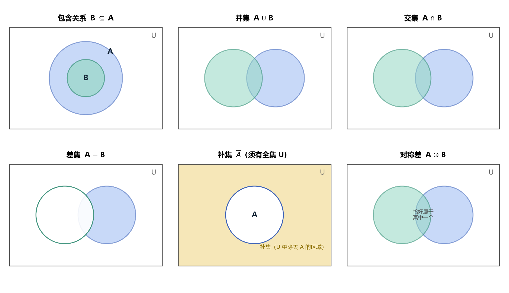
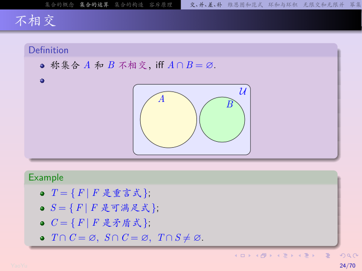
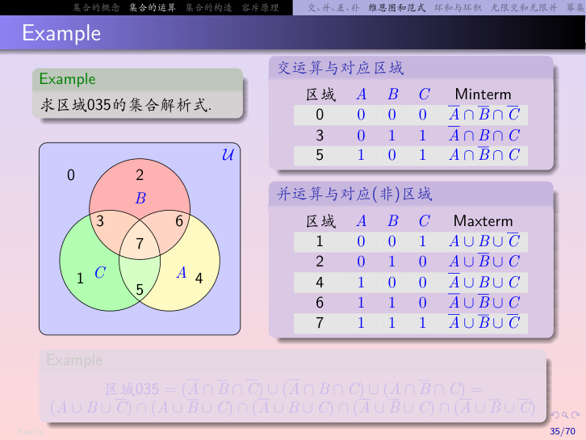
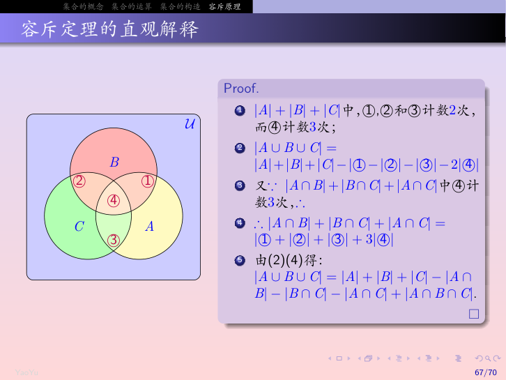
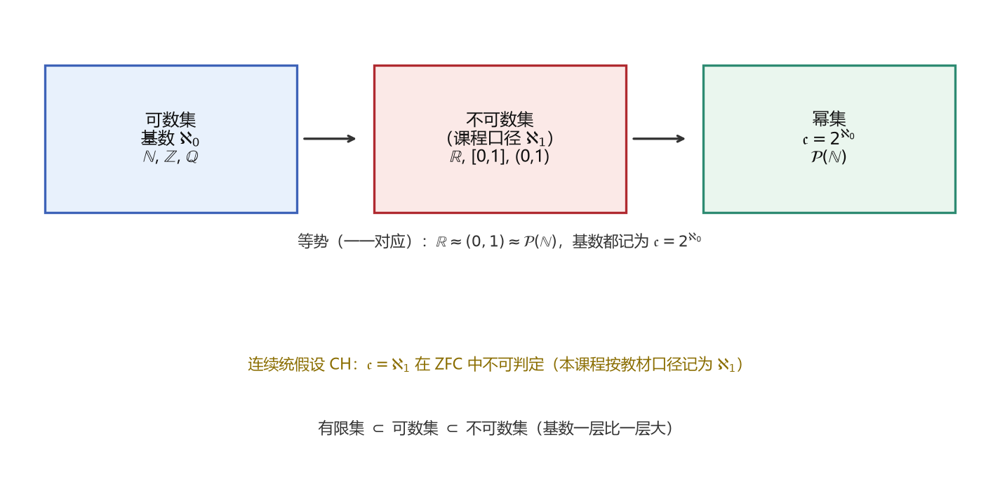
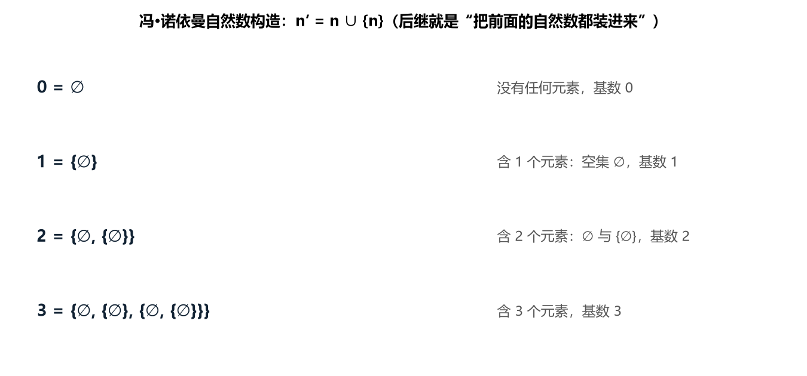
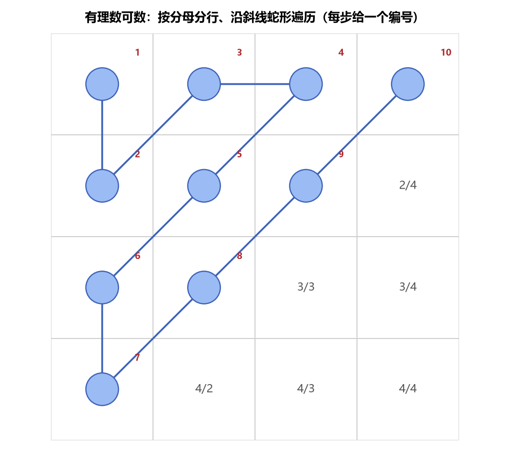

# 第1章 集合 - 学习笔记

> 整理自 B站《【电子科技大学】《离散数学》全63讲》（BV16Btc6VEpE，up主：哔哩大学-学生中心）P1-P5
> 字幕来源：AI字幕，已核对数学逻辑
>
> **补充来源**（2026-09-24 增补）：武汉大学《集合论》课件 `03-set.pdf`；教材《离散数学及其应用》（原书第8版，Rosen）§2.1 集合、§2.2 集合运算。课件侧重"为什么用集合"和公理化，教材侧重计算机表示、多重集与证明方法，两处已分别标注。

> **目录**
>
> - [1. 集合的基本概念](#1-集合的基本概念)
>   - [1.0 为什么要集合（消除断言的二义性）](#10-为什么要集合从模糊的断言到精确的集合)
>   - [1.5 集合与谓词：真值集和带量词的符号](#15-集合与谓词真值集和带量词的符号)
>   - [1.6 集合运算与逻辑运算的对照表](#16-集合运算与逻辑运算的对照表)
> - [2. 特殊集合与集合间关系](#2-特殊集合与集合间关系)
> - [3. 集合的运算](#3-集合的运算)
>   - [3.12 多重集（Multiset）](#312-多重集multiset)
>   - [3.13 集合表达式有没有运算优先级](#313-集合表达式有没有运算优先级)
> - [4. 集合的运算定律](#4-集合的运算定律)
>   - [4.4 成员表法](#44-成员表法)
> - [5. 序偶、n元组与笛卡尔积](#5-序偶n元组与笛卡尔积)
> - [6. 维恩图与集合范式](#6-维恩图与集合范式)
> - [7. 集合的递归构造](#7-集合的递归构造)
> - [8. 容斥原理](#8-容斥原理)
> - [9. 可数集合与不可数集合](#9-可数集合与不可数集合)
> - [10. 集合的程序实现](#10-集合的程序实现)
> - [11. 本节重点](#11-本节重点)

---

## 1. 集合的基本概念

### 1.0 为什么要集合：从模糊的断言到精确的集合

用自然语言表达的断言容易引起**二义性**：

> 例：$P(x)$ = "$x$ 是大学生"，$Q(x)$ = "$x$ 是好人"。
> 给定某个具体对象，$P(x)$、$Q(x)$ 是否成立往往无法客观判定——"好人"没有公认标准。

改用集合就能把断言精确化：**不去追问"$x$ 是否具有某性质"，而是先确定这个性质对应的元素名单**。

$$\text{大学生} = \{\text{张三}, \text{李四}, \dots\}, \qquad \text{好人} = \{\text{王五}, \text{赵六}, \dots\}$$

于是有：

$$P(x)\ \text{成立} \iff x \in S_P \quad(\text{$x$ 在对应的名单里})$$

"$x$ 是否属于某个集合"是可以精确判定的（集合给的就是**外延**：哪些个体在名单里）。所以"用枚举具有某性质的全部对象来间接表示一个断言"，就消除了主观二义性——这是集合能成为整套数学基础语言的根本原因，也是"命题逻辑 → 谓词逻辑 → 集合"这条链路的动机。

### 1.1 什么是集合

**康托尔的定义**：集合是由一组确定的、各不相同的对象构成的整体，这些对象称为集合的元素。

**中文描述性定义**：由指定范围内的、满足给定条件的所有对象聚集在一起构成的集合。

> 集合的定义比较随意——元素可以是真实存在的，也可以是想象出来的。但正是这种随意性导致了悖论，最终产生了公理化集合论。

### 1.2 朴素集合论 vs 公理化集合论

| 类型 | 创立者 | 特点 | 问题 |
|------|--------|------|------|
| 朴素集合论 | 康托尔 | 描述性定义，直观易懂 | 存在悖论（罗素悖论/理发师悖论），引发第三次数学危机 |
| 公理化集合论 | 策梅洛、弗兰克尔 | 用一组公理定义集合，避免悖论 | 较为抽象 |

**ZFC公理化集合论**（最广泛接受）包含9条公理：
- 外延公理、空集存在公理、无序对公理、并集公理、幂集公理
- 无穷公理、替换公理、正则公理、选择公理
- ZF = 前8条（策梅洛+弗兰克尔），C = 选择公理（Choice）

**罗素悖论到底怎么推出矛盾**（教材练习）：

设想存在一个集合 $S$，它收集所有"不以自身为元素的集合"：

$$S = \{A \mid A \notin A\}$$

现在问：$S \in S$ 吗？

- 若 $S \in S$：则 $S$ 是 $S$ 的成员，按 $S$ 的定义它必须满足"不以自身为元素"，即 $S \notin S$ —— 矛盾
- 若 $S \notin S$：则 $S$ 满足"不以自身为元素"，按定义它应当被收进 $S$，即 $S \in S$ —— 还是矛盾

两个分支都推出矛盾，说明这样的 $S$ **不可能存在**。

> ⚠️ 病根在于朴素集合论默认"任给一个性质，都能把满足它的对象聚成一个集合"（概括原则）。¹ 一旦允许 $A \notin A$ 这种性质，就会造出上面的怪物。ZFC 的做法是**用公理限制集合的生成方式**（不再是想要什么就有什么），从而绕开悖论。
>
> ¹ 朴素集合论还有一个副作用：因为集合可以任意大，就会出现"所有集合的集合"这类东西，它同样导致矛盾。

### 1.3 集合的表示

**符号约定**：
- 大写英文字母（带或不带下标）表示集合：$A, B, C, A_1, B_2$
- 小写英文字母表示元素：$a, b, c$
- 常用数集：自然数集 $\mathbb{N}$、整数集 $\mathbb{Z}$、有理数集 $\mathbb{Q}$、实数集 $\mathbb{R}$

**属于关系**：
- $a \in A$：元素 $a$ 属于集合 $A$
- $a \notin A$：元素 $a$ 不属于集合 $A$

**三种表示方法**：

1. **枚举法**：把元素一一列举，用大括号括起来
   - 有限集：$A = \{a, b, c, d\}$
   - 无限集（有规律时）：正偶数集 $= \{2, 4, 6, 8, 10, \dots\}$
   - 适用条件：前面的元素能推导出后面省略的元素

2. **叙述法**（描述法）：刻画元素的性质
   - 基本形式：$P = \{x \mid P(x)\}$，竖线是分隔符，右边是元素应满足的性质
   - 例：$A = \{x \mid x \text{ 是英文字母中的元音字母}\}$
   - 例：$B = \{x \mid x \in \mathbb{Z} \text{ 且 } x < 10\}$
   - 例：$C = \{x \mid x = 2k, k \in \mathbb{N}\}$（零和所有正偶数）

3. **文氏图**（Venn图）：用平面上的圆形或方形表示集合，圆点表示元素
   - 一般用方形表示全集，圆形表示普通集合

### 1.4 基数

集合中元素的数量称为**基数**，记为 $|A|$（符号与绝对值相同，但含义不同）。

- **有限集**：基数有限
- **无限集**：基数无限

**易错题**：
- $A = \{a, b, c\}$，则 $|A| = 3$
- $B = \{a, \{b, c\}\}$，则 $|B| = 2$（第二个元素是一个集合 $\{b,c\}$，作为整体算一个元素）
- $C = \{\varnothing, \{\varnothing\}\}$，则 $|C| = 2$；$|\{\{\varnothing\}\}| = 1$——**外层大括号决定元素个数**，与内部嵌套几层无关

> 集合的元素可以是任何对象，包括另一个集合。注意区分 $\{b,c\}$ 作为元素 vs $b,c$ 分别作为元素。

### 1.5 集合与谓词：真值集和带量词的符号

> 来源：教材《离散数学及其应用》2.1.7–2.1.8

**真值集（Truth Set）**：给定论域 $D$，谓词 $P(x)$ 的**真值集**就是使 $P(x)$ 为真的那些个体构成的集合：

$$\{x \in D \mid P(x)\}$$

- 例：$D = \mathbb{Z}^+$，$P(x)$ = "$x$ 是素数" → 真值集是全体素数组成的集合
- 例：$D = \mathbb{Z}^+$，$Q(x)$ = "$x < 5$" → 真值集是 $\{1,2,3,4\}$
- 例：$D = \mathbb{N}$，$R(x)$ = "$x^2 \ge 0$" → 真值集是 $\mathbb{N}$ 本身（全体都满足）

> $P(x)$ 为真 ⟺ $x$ 属于 $P$ 的真值集——这就是 §1.0 说的"查名单"，也是给谓词做**解释**的另一种写法（谓词 $P \mapsto$ 一个确定的集合）。

**带量词的集合符号**（重要缩写，$\forall$ 配蕴含、$\exists$ 配合取）：

$$\forall x \in S\,(P(x)) \ \triangleq\ \forall x\,(x \in S \to P(x))$$

$$\exists x \in S\,(P(x)) \ \triangleq\ \exists x\,(x \in S \land P(x))$$

> ⚠️ 这条要和谓词逻辑那边的纪律对齐：**限定全称用 $\to$，限定存在用 $\land$**。若写成 $\forall x\,(x \in S \land P(x))$，意思就变成"论域里每个东西都在 $S$ 里且满足 $P$"，把"只在 $S$ 范围内讨论"扩大成了"全体都是 $S$ 的成员"——荒谬。

### 1.6 集合运算与逻辑运算的对照表

集合运算和逻辑运算**本质上是一回事**，因此逻辑的恒等式、推理规则可以整体平移到集合上：

| 集合侧 | 逻辑侧 | 说明 |
|:------|:------|:----|
| 全集 $U$ | 永真 $\mathbf{T}$ | 全集相当于"恒为真" |
| 空集 $\varnothing$ | 永假 $\mathbf{F}$ | 空集相当于"恒为假" |
| $A \subseteq B$ | $P_A \Rightarrow P_B$ | 包含就是蕴含 |
| $A = B$ | $P_A \Leftrightarrow P_B$ | 相等就是等价 |
| $A \cup B$ | $P_A \lor P_B$ | 并 = 或 |
| $A \cap B$ | $P_A \land P_B$ | 交 = 且 |
| $\overline{A}$ | $\neg P_A$ | 补 = 非 |
| $A - B$ | $P_A \land \neg P_B$ | 差 = 且非 |
| $A \oplus B$（环和） | $P_A \oplus P_B$（异或） | 恰好一个成立 |
| $A \otimes B$（环积） | XNOR（同或） | 归属相同 |
| $x \in A$ | $P_A(x)$ 为真 | 属于 = 命题为真 |
| $A \cup \overline{A} = U$ | $P \lor \neg P \equiv \mathbf{T}$ | 排中律 |
| $A \cap \overline{A} = \varnothing$ | $P \land \neg P \equiv \mathbf{F}$ | 矛盾律 |

> 📌 **平移规则**：证明集合恒等式时，"$=$" 照着逻辑的 "$\Leftrightarrow$" 写、"$\subseteq$" 照着 "$\Rightarrow$" 写，剩下的就是套德摩根律、分配律这些逻辑定律。**学了谓词逻辑，集合这一章的定律等于记了两遍**。

---

## 2. 特殊集合与集合间关系

### 2.1 空集

**定义**：不含任何元素的集合，记为 $\varnothing$（注意不是希腊字母 $\phi$，而是源自挪威/丹麦语的符号）。

**叙述法表示**：$\varnothing = \{x \mid x \neq x\}$（没有任何对象不等于自身）。

**性质**：
- $|\varnothing| = 0$
- 空集是**绝对唯一**的——宇宙中只有一个空集
- 空集是任何集合的子集

**易错题**：
- $|\varnothing| = 0$（空集本身没有元素）
- $|\{\varnothing\}| = 1$（空集作为一个元素，外面再套大括号，此时集合有一个元素——就是空集）
- $\varnothing \subseteq A$ 对任意 $A$ 恒真，但 $\varnothing \in A$ 不一定成立：$\varnothing \in \{\varnothing\}$ 为真，$\varnothing \notin \{1,2\}$ 为真
- 不要混用"属于"（$\in$）与"包含"（$\subseteq$）：$a \in A$、$\{a\} \subseteq A$；一般不能说 $a \subseteq A$ 或 $\{a\} \in A$（除非 $A$ 恰以 $\{a\}$ 为元素）

### 2.2 全集

**定义**：在一个研究范围内，由所有可能的对象构成的集合，记为 $U$ 或 $E$。

**性质**：
- 全集是**相对唯一**的——不同研究范围有不同的全集，但同一研究范围内唯一
- 文氏图中用方形表示全集

**例**：
- 立体几何中，全集 = 空间所有点
- 中国人口普查中，全集 = 所有中国人

### 2.3 集合元素的基本特性

1. **无序性**：$\{1,2,3,4\} = \{2,3,1,4\}$
2. **互异性**：重复元素只算一个，$\{1,2,2,3,4,3,4\} = \{1,2,3,4\}$

### 2.4 集合相等（外延性原理）

**定义**：两个集合 $A$ 和 $B$ 相等，当且仅当它们的元素完全相同，记为 $A = B$。

> 这就是ZFC公理系统中的**外延公理**。

**例**：
- $E = \{x \mid (x-1)(x-2)(x-3) = 0\} = \{1,2,3\}$
- $F = \{x \mid x \in \mathbb{Z}^+, x^2 < 12\} = \{1,2,3\}$
- $E$ 和 $F$ 定义方式不同，但元素相同，所以 $E = F$

### 2.5 包含关系（子集）

**定义**：设 $A, B$ 是两个集合，如果 $B$ 的每个元素都是 $A$ 中的元素，则称 $B$ 是 $A$ 的**子集**，记作 $B \subseteq A$（读作"B包含于A"或"A包含B"）。

**数学语言描述**：
$$B \subseteq A \iff \forall x\,(x \in B \to x \in A)$$

**真子集**：如果 $B \subseteq A$ 且 $A \neq B$，则称 $B$ 是 $A$ 的**真子集**，记作 $B \subset A$。

**文氏图理解**：$B$ 的圆形完全在 $A$ 的圆形内部。

**包含关系的两个极端**（在 $B \subseteq A$ 前提下）：
- $B$ 最小可以是 $\varnothing$（空集是任何集合的子集）
- $B$ 最大可以是 $A$ 本身（任何集合是自身的子集）

**相关术语**（课件补充）：

| 术语 | 记号/定义 | 例子 |
|:----|:--------|:----|
| 单点集 Singleton | 只含一个元素的集合 $\{a\}$ | $\{a\}$ 是单点集，但 $a$ 只是元素 |
| 子集合 / 父集合 | $A \subseteq B$ 时也称 $B \supseteq A$，称 $B$ 是 $A$ 的**父集合**（superset） | — |
| 平凡子集 trivial | 任何集合 $A$ 的子集中，$\varnothing$ 和 $A$ 本身称为**平凡子集**，其余叫非平凡子集 | $\{a,b\}$ 的子集中，$\varnothing$ 与 $\{a,b\}$ 平凡，$\{a\},\{b\}$ 非平凡 |

**真子集的严格谓词形式**（课件写法）：

$$A \subset B \iff \forall x\,(x \in A \to x \in B) \ \land\ \exists x\,(x \in B \land x \notin A)$$

前半句就是 $A \subseteq B$，后半句排除相等的情形——和" $A \subseteq B$ 且 $A \neq B$ "完全等价，只是显式拆成了谓词形式（方便和 §1.5 的平移规则对上）。

> ⚠️ **$\in$ 与 $\subseteq$ 差一个层次**：$\in$ 是"个体与集合"的关系，$\subseteq$ 是"集合与集合"的关系。**当集合里有不同层次的对象时，二者可以同时成立**：设 $A = \{1, \{1\}\}$，则 $\{1\} \in A$（作为元素）且 $\{1\} \subseteq A$（作为子集）都为真。
>
> 嵌套空集是典型：$\varnothing \subset \{\varnothing\} \subset \{\varnothing, \{\varnothing\}\}$——每一步左边是右边的**元素**，同时也是右边的**子集**。

### 2.6 集合相等的判定定理

**定理**：$A = B$ 当且仅当 $A \subseteq B$ 且 $B \subseteq A$。

> 这是证明集合相等的**标准方法**：证明两个方向的包含关系。

**证明框架**：
1. 证明 $A \subseteq B$：任取 $x \in A$，经过推导得到 $x \in B$
2. 证明 $B \subseteq A$：任取 $x \in B$，经过推导得到 $x \in A$
3. 由以上两点得 $A = B$

### 2.7 幂集

**定义**：集合 $A$ 的所有子集构成的集合称为 $A$ 的**幂集**，记为 $\mathcal{P}(A)$（或 $P(A)$）。

$$\mathcal{P}(A) = \{X \mid X \subseteq A\}$$

**子集个数公式**：若 $|A| = n$，则 $A$ 有 $2^n$ 个不同的子集。

> 推导：从 $n$ 个元素中取 $m$ 个构成子集，有 $\binom{n}{m}$ 种；$m$ 从 $0$ 到 $n$，总数为 $\sum_{m=0}^{n} \binom{n}{m} = 2^n$。

**例**：$A = \{a, b, c\}$，则
$$\mathcal{P}(A) = \{\varnothing, \{a\}, \{b\}, \{c\}, \{a,b\}, \{a,c\}, \{b,c\}, \{a,b,c\}\}$$
共 $2^3 = 8$ 个元素。

**幂集的性质**：$X \in \mathcal{P}(A) \iff X \subseteq A$（元素属于幂集，当且仅当它是A的子集）。

**易错题**：
- $|\mathcal{P}(\varnothing)| = 1$（$\mathcal{P}(\varnothing) = \{\varnothing\}$）；$|\mathcal{P}(\mathcal{P}(\varnothing))| = 2$（$= \{\varnothing, \{\varnothing\}\}$）
- $\varnothing \in \mathcal{P}(A)$ 与 $A \in \mathcal{P}(A)$ 恒真（$\varnothing$ 与 $A$ 都是 $A$ 的子集）；但 $a \notin \mathcal{P}(A)$——$a$ 是 $A$ 的**元素**而非 $A$ 的**子集**（除非 $A$ 的元素本身是集合）

---

## 3. 集合的运算



> **图1** 五种运算（并/交/补/差/对称差）与包含关系的文氏图总览：矩形为全集 $U$，圆形为集合 $A, B$（自绘）。

### 3.1 并运算

**定义**：$A \cup B = \{x \mid x \in A \text{ 或 } x \in B\}$

**文氏图**：两个圆形覆盖的全部区域。

**例**：$\{1,3,5\} \cup \{1,2,3\} = \{1,2,3,5\}$

### 3.2 交运算

**定义**：$A \cap B = \{x \mid x \in A \text{ 且 } x \in B\}$

**文氏图**：两个圆形的重叠区域。

**例**：$\{1,3,5\} \cap \{1,2,3\} = \{1,3\}$

### 3.3 补运算

**定义**（相对于全集 $U$）：$\overline{A} = \{x \mid x \notin A\}$

**文氏图**：全集方形中，$A$ 圆形以外的区域。

> 补运算必须有全集！没有全集就没有补集。

**例**：设 $U = \{1,2,3,4,5,6,7,8\}$，$A = \{1,3,5\}$，则 $\overline{A} = \{2,4,6,7,8\}$。

### 3.4 差运算

**定义**：$A - B = \{x \mid x \in A \text{ 且 } x \notin B\}$

**文氏图**：$A$ 的圆形中去掉与 $B$ 重叠的部分。

**理解**：差运算是**相对补集**——相对于 $A$ 求补，而补运算是相对于全集求补。

**例**：$\{1,3,5\} - \{1,2,3\} = \{5\}$

### 3.5 对称差（环和）

**定义**：$A \oplus B = \{x \mid (x \in A \text{ 且 } x \notin B) \text{ 或 } (x \notin A \text{ 且 } x \in B)\}$

**等价形式**：$A \oplus B = (A - B) \cup (B - A) = (A \cup B) - (A \cap B)$

**直观理解**：两个集合中"恰好只属于一个"的元素，去掉共同部分。在逻辑上对应**异或（XOR）**。

**例**：$\{1,3,5\} \oplus \{1,2,3\} = \{2,5\}$

### 3.6 环积

**定义**：环积是环和的补集：

$$A \otimes B = \overline{A \oplus B} = (A \cap B) \cup (\overline{A} \cap \overline{B})$$

**直观理解**：元素"要么同时属于A和B，要么同时不属于"——即A和B的归属完全相同。在逻辑上对应**同或（XNOR）**。

> 📌 环和 vs 环积：
> - 环和（$\oplus$）：恰好属于一个 → 异或 XOR
> - 环积（$\otimes$）：归属完全相同 → 同或 XNOR
> - 二者互为补集：$A \otimes B = \overline{A \oplus B}$

### 3.7 不相交

**定义**：如果 $A \cap B = \varnothing$，则称集合 $A$ 和 $B$ **不相交**。

**直观理解**：两个集合没有任何共同元素，文氏图中两个圆形完全不重叠。

**例**：奇数集和偶数集不相交；三角形集合和正方形集合不相交。



### 3.8 连并、连交与指标集

**有限个集合的并与交：**

$n$ 个集合的并：$\bigcup_{i=1}^{n} A_i = A_1 \cup A_2 \cup \dots \cup A_n$（属于任意一个即可）

$n$ 个集合的交：$\bigcap_{i=1}^{n} A_i = A_1 \cap A_2 \cap \dots \cap A_n$（属于所有集合）

**例**：$A=\{0,2,4,6,8\}, B=\{0,1,2,3,4\}, C=\{0,3,6,9\}$
- $A \cup B \cup C = \{0,1,2,3,4,6,8,9\}$
- $A \cap B \cap C = \{0\}$

---

**指标集（Index Set）：**

$I$ 是一个集合，并且对 $\forall i \in I$，都有一个集合 $S_i$ 与之对应，称这样的集合 $I$ 为**指标集**。

简单说：指标集就是"给集合编号的集合"——每个编号 $i$ 对应一个集合 $S_i$。

**例子**：
- $I = \{0, 1, 2, 3\}$，$S_i = \{x \in \mathbb{N} \mid x \le i\}$
  - $S_0 = \{0\}$，$S_1 = \{0,1\}$，$S_2 = \{0,1,2\}$，$S_3 = \{0,1,2,3\}$
- $I = \mathbb{N}$，$S_n = \{x \in \mathbb{N} \mid x \ge n\}$
  - $S_0 = \{0,1,2,\dots\}$，$S_1 = \{1,2,3,\dots\}$，……

---

**无限交和无限并：**

有了指标集，就可以定义无限多个集合的交和并：

$$\bigcap_{i \in I} S_i = \{x \mid \forall i \in I,\, x \in S_i\}$$

$$\bigcup_{i \in I} S_i = \{x \mid \exists i \in I,\, x \in S_i\}$$

- **无限交**：$x$ 属于**每一个** $S_i$（对应全称量词 $\forall$）
- **无限并**：$x$ 属于**至少一个** $S_i$（对应存在量词 $\exists$）

**例子**：

1. $\bigcap_{n \in \mathbb{N}} \{n, n+1, n+2, \dots\} = \varnothing$
   - 每个集合是"从n开始的自然数"，没有自然数能同时属于所有集合

2. $\bigcup_{x \in \mathbb{R}^+} [\frac{1}{x}, +\infty) = (0, +\infty)$
   - 对任意正数 $y$，取 $x = \frac{1}{y}$，则 $y \in [\frac{1}{x}, +\infty)$

> 📌 无限交和无限并**封装了全称量词和特称量词**，使得谓词转换为集合运算成为可能。当指标集是有限集合时，就退化为有限的连并、连交。

**无限交并的分配律：**

$$A \cup \left(\bigcap_{i \in I} S_i\right) = \bigcap_{i \in I} (A \cup S_i)$$

$$A \cap \left(\bigcup_{i \in I} S_i\right) = \bigcup_{i \in I} (A \cap S_i)$$

这是有限分配律在无限情形下的推广。

### 3.9 运算之间的等价关系

**差运算 = 交上补**：$A - B = A \cap \overline{B}$

**证明**：$x \in A - B \iff x \in A \text{ 且 } x \notin B \iff x \in A \text{ 且 } x \in \overline{B} \iff x \in A \cap \overline{B}$

**对称差的等价形式与性质**：
- $A \oplus B = (A \cup B) - (A \cap B)$（并减去交）
- $A \oplus \varnothing = A$，$A \oplus A = \varnothing$，$A \oplus U = \overline{A}$
- 对称差满足**交换律**和**结合律**：$A \oplus B = B \oplus A$，$(A \oplus B) \oplus C = A \oplus (B \oplus C)$（结合律可用文氏图直观理解，严格证明按定义展开元素分析）
- 对称差在逻辑上对应"异或"（XOR）：元素恰好属于其中一个集合

**差运算不满足交换律**：一般 $A - B \neq B - A$。例：$\{1,2\} - \{2\} = \{1\}$，而 $\{2\} - \{1,2\} = \varnothing$。

---

### 3.10 补集的唯一性定理

**定理**：设 $A, B$ 是集合，$B$ 是 $A$ 的补集的充要条件是：

$$A \cup B = U \quad \text{且} \quad A \cap B = \varnothing$$

这意味着：**补集是唯一的**——只要同时满足"并起来是全集、交起来是空集"，$B$ 就一定是 $A$ 的补集 $\overline{A}$。

---

### 3.11 包含关系的等价形式

$A \subseteq B$ 有好几种等价的说法，做题时可以灵活转换：

$$A \subseteq B \iff A \cup B = B \iff A \cap B = A \iff A - B = \varnothing$$

| 等价形式 | 含义 |
|:--------|:----|
| $A \subseteq B$ | 定义：A的元素都在B里 |
| $A \cup B = B$ | A并B还是B，说明A没有超出B的元素 |
| $A \cap B = A$ | A交B还是A，说明A的元素都在B里 |
| $A - B = \varnothing$ | A减B是空集，说明A中没有不在B里的元素 |

> 📌 证明思路（以 $A \subseteq B \iff A \cup B = B$ 为例）：
> - $\Rightarrow$：$A \subseteq B$，则 $A \cup B \subseteq B \cup B = B$；又 $B \subseteq A \cup B$，故 $A \cup B = B$
> - $\Leftarrow$：$A \subseteq A \cup B = B$，故 $A \subseteq B$

### 3.12 多重集（Multiset）

> 来源：教材 2.2.5

**动机**：普通集合里"元素在不在里面"只有两档，`{a, a, a} = {a}`（重复被抹掉）。但有时**出现次数是有意义的**——比如清单上有3台同型号设备、订单里买了4件同样的货。这就需要多重集。

**定义**：多重集是元素可以重复出现的无序集合，每个元素的**重复数（multiplicity）**记录它出现了几次。记号 $\{m_1 \cdot a_1,\ m_2 \cdot a_2,\ \dots\}$ 表示 $a_i$ 出现 $m_i$ 次（重复数为 0 或省略即不出现）。

**运算规则**（设 $P, Q$ 是多重集，$m_P(x)$ 是 $x$ 在 $P$ 中的重复数）：

| 运算 | 重复数怎么算 | 记号提示 |
|:----|:-----------|:--------|
| 并 $P \cup Q$ | $\max(m_P, m_Q)$ | 取**较大** |
| 交 $P \cap Q$ | $\min(m_P, m_Q)$ | 取**较小** |
| 差 $P - Q$ | $\max(m_P - m_Q,\ 0)$ | 减完不为负 |
| 和 $P + Q$ | $m_P + m_Q$ | 直接相加 |

**例**（教材例21）：$P = \{4 \cdot a,\ 1 \cdot b,\ 3 \cdot c\}$，$Q = \{3 \cdot a,\ 4 \cdot b,\ 2 \cdot d\}$

- $P \cup Q = \{4 \cdot a,\ 4 \cdot b,\ 3 \cdot c,\ 2 \cdot d\}$
- $P \cap Q = \{3 \cdot a,\ 1 \cdot b\}$（$c, d$ 的重复数为 0，省略）
- $P - Q = \{1 \cdot a,\ 3 \cdot c\}$
- $P + Q = \{7 \cdot a,\ 5 \cdot b,\ 3 \cdot c,\ 2 \cdot d\}$

> ⚠️ **普通集合 vs 多重集**：$\{a,a,a\} - \{a,a\} = \varnothing$（普通集合，重复不算数），而作为多重集结果是 $\{1 \cdot a\}$。**做题先看清题目问的是哪一种**。
>
> 普通集合可以看成"所有重复数都是 1"的多重集——所以多重集是集合的推广。

### 3.13 集合表达式有没有运算优先级

**先给结论：教材（Rosen 第8版）根本没有规定集合运算的优先级。课上 PPT 说的"集合没有运算顺序"是对的，不存在一条像"先乘除后加减"那样公认的集合先行约定。**

翻遍 §2.1～§2.2，教材唯一一次讨论"集合式子能不能省括号"是在 **§2.2.3 扩展的并集和交集**：

> 由于集合的并集和交集满足结合律，所以只要 $A$、$B$、$C$ 为集合，则 $A \cup B \cup C$ 和 $A \cap B \cap C$ 均有定义，即这样的记号是无二义性的。**也就是说，我们不需要用括号来指明哪个运算在前**，因为 $A \cup (B \cup C) = (A \cup B) \cup C$ 及 $A \cap (B \cap C) = (A \cap B) \cap C$。

注意它说的是**同一种运算连写**（$\cup\cup\cup$、$\cap\cap\cap$）——是靠**结合律**省括号，不是靠"优先级"。教材从头到尾没说"交比并先算"。

至于教材在 §1.1.5 确实列了一张**逻辑运算符优先级表**（$\neg > \land > \lor > \to > \leftrightarrow$），但那是给命题公式用的，没有平移到集合式子上；而且它自己紧接着写了一句很关键的话：

> 因为这个规则不太好记，所以我们将继续使用括号以使析取运算符和合取运算符的作用顺序看起来很清晰。

连教材本人都不敢指望着这条约定去省括号。所以：

| 说法 | 出处 | 可信度 |
|------|------|--------|
| 同种运算连写不用括号（$A\cup B\cup C$） | 教材 §2.2.3，**明确写了** | ✅ 可以放心用，靠结合律保证 |
| 交比并先算（借用 $\land > \lor$） | 教材**没写**，只是从逻辑那边借过来的民间约定 | ⚠️ 有人这么用，但不是通行规定 |
| 差 $-$、对称差 $\oplus$ 的优先级 | 教材**完全没提** | ❌ 不存在任何约定 |
| 集合式有一套通用运算顺序 | —— | ❌ 不存在 |

> 📌 **一句话**：集合这边没有"先算谁"的规定，只有"能不能省括号"的依据——**依据是结合律，不是优先级**。所以写集合式子一律加括号，别指望读式子的人跟你默认同一套顺序。

**什么时候连写安全**：满足**结合律**的运算才能连写，跟优先级无关——$\cup$、$\cap$、$\oplus$（环和）、$\otimes$（环积）都满足：

$$A \cup B \cup C,\quad A \cap B \cap C,\quad A \oplus B \oplus C$$

这些随便怎么加括号结果都一样，因此省略括号没问题（这也是课堂上不太强调运算顺序的原因：绝大多数式子都是同类连写，压根用不到优先级）。

**什么时候必须加括号**（两种情形，都是因为**没有结合律/不能用结合律**，所以 $A \circ B \circ C$ 这种写法本身就是不合法的）：

**① 交并混合连写**——$(A \cup B) \cap C \neq A \cup (B \cap C)$，两边**一般不相等**：

> 反例：$A = \{1\},\ B = \{2\},\ C = \{2\}$
> - $(A \cup B) \cap C = \{1,2\} \cap \{2\} = \{2\}$
> - $A \cup (B \cap C) = \{1\} \cup \{2\} = \{1,2\}$
>
> 结果不同。根子在于：并对交的分配律是 $A \cup (B \cap C) = (A \cup B) \cap (A \cup C)$——**右边也要跟着变**，不是简单地挪括号。

**② 差运算连写**——差**不满足结合律**，$(A - B) - C \neq A - (B - C)$：

> 反例：$A = \{1,2\},\ B = \{2\},\ C = \{1\}$
> - $(A - B) - C = \{1\} - \{1\} = \varnothing$
> - $A - (B - C) = \{1,2\} - \{2\} = \{1\}$
>
> 所以 $A - B - C$ 这种写法是**有歧义的、不合法的**，必须写成 $(A-B)-C$ 或 $A-(B-C)$。

> 📌 **一句话**：不是"先看运算顺序"，而是——**同种运算随便连（有结合律兜底）；其他一律加括号**，混写、带 $-$ 的一定加括号。

---

## 4. 集合的运算定律

设 $U$ 为全集，$A, B, C$ 为任意集合。

| 定律名称      | 公式                                                                                                            |
| --------- | ------------------------------------------------------------------------------------------------------------- |
| **幂等律**   | $A \cup A = A$，$A \cap A = A$                                                                                 |
| **交换律**   | $A \cup B = B \cup A$，$A \cap B = B \cap A$                                                                   |
| **结合律**   | $(A \cup B) \cup C = A \cup (B \cup C)$，$(A \cap B) \cap C = A \cap (B \cap C)$                               |
| **同一律**   | $A \cup \varnothing = A$，$A \cap U = A$                                                                       |
| **零律**    | $A \cup U = U$，$A \cap \varnothing = \varnothing$                                                             |
| **分配律**   | $A \cup (B \cap C) = (A \cup B) \cap (A \cup C)$，$A \cap (B \cup C) = (A \cap B) \cup (A \cap C)$             |
| **吸收律**   | $A \cup (A \cap B) = A$，$A \cap (A \cup B) = A$                                                               |
| **矛盾律**   | $A \cap \overline{A} = \varnothing$                                                                           |
| **排中律**   | $A \cup \overline{A} = U$                                                                                     |
| **双重否定律** | $\overline{\overline{A}} = A$                                                                                 |
| **德摩根律**  | $\overline{A \cup B} = \overline{A} \cap \overline{B}$，$\overline{A \cap B} = \overline{A} \cup \overline{B}$ |

### 4.1 定律理解要点

- **幂等律**：无论多少个 $A$ 做并/交，结果都是 $A$——"幂等"（idempotent）指对同一对象**再运算一次结果不变**
- **零律**：$U$ 对并运算起"零"的作用（并上 $U$ 得 $U$），$\varnothing$ 对交运算起"零"的作用（交上 $\varnothing$ 得 $\varnothing$）
- **分配律**：并对交、交对并**双向**都满足分配律（与实数不同——实数只有乘法对加法分配，加法不对乘法分配）
- **吸收律**：内层和外层是不同运算（一个并一个交），且有共同元素 $A$，则 $B$ 被"吸收"，结果为 $A$
- **德摩根律**：先并后补 = 先补后交；先交后补 = 先补后并（并变交，交变并）

### 4.2 运算定律的证明方法

以**德摩根律** $\overline{A \cup B} = \overline{A} \cap \overline{B}$ 为例：

**第一步**：证明 $\overline{A \cup B} \subseteq \overline{A} \cap \overline{B}$
- 任取 $x \in \overline{A \cup B}$
- 则 $x \notin A \cup B$，即 $x \notin A$ 且 $x \notin B$
- 所以 $x \in \overline{A}$ 且 $x \in \overline{B}$
- 因此 $x \in \overline{A} \cap \overline{B}$

**第二步**：证明 $\overline{A} \cap \overline{B} \subseteq \overline{A \cup B}$
- 任取 $x \in \overline{A} \cap \overline{B}$
- 则 $x \in \overline{A}$ 且 $x \in \overline{B}$，即 $x \notin A$ 且 $x \notin B$
- 所以 $x \notin A \cup B$
- 因此 $x \in \overline{A \cup B}$

**结论**：由两步得 $\overline{A \cup B} = \overline{A} \cap \overline{B}$。

> 文氏图可以做直观理解，但**严格证明必须用相互包含法**。

### 4.3 更多定律的证明（补充）

**吸收律** $A \cup (A \cap B) = A$ 的**代数证明**（由其他定律推出，避免循环论证）：

1. $A \cup (A \cap B) = (A \cap U) \cup (A \cap B)$（同一律：$A = A \cap U$）
2. $= A \cap (U \cup B)$（分配律）
3. $= A \cap U$（零律：$U \cup B = U$）
4. $= A$（同一律）

**分配律** $A \cup (B \cap C) = (A \cup B) \cap (A \cup C)$ 的**相互包含证明**：

- 证 $\subseteq$：任取 $x \in A \cup (B \cap C)$。若 $x \in A$，则 $x$ 属于右边的两个括号；若 $x \in B \cap C$，则 $x \in B$ 且 $x \in C$，同样属于右边的两个括号。两种情形都有 $x \in (A \cup B) \cap (A \cup C)$。
- 证 $\supseteq$：任取 $x \in (A \cup B) \cap (A \cup C)$。若 $x \in A$，显然 $x \in A \cup (B \cap C)$；若 $x \notin A$，则由 $x \in A \cup B$ 得 $x \in B$，由 $x \in A \cup C$ 得 $x \in C$，故 $x \in B \cap C \subseteq A \cup (B \cap C)$。

> 技巧：前提含"或"（$\cup$）时分情况讨论（$x \in A$ / $x \notin A$）；结论含"且"（$\cap$）时分别验证两个条件。这是元素法证明的常用套路。

### 4.4 第三种证法：成员表法

> 来源：教材 2.2.2

除了相互包含法和代数法，还可以用**成员表（membership table）**机械地证明集合恒等式。

**思想**：对一个任意的元素 $x$，枚举它"属于/不属于"各个原子集合的所有可能组合，用 **1 表示属于、0 表示不属于**。若恒等式两边那一列完全一致，恒等式就成立——因为这说明任何元素在两边的归属情况永远相同。

**例**（教材例13）：证 $A \cap (B \cup C) = (A \cap B) \cup (A \cap C)$

| $A$ | $B$ | $C$ | $B \cup C$ | $A \cap (B \cup C)$ | $A \cap B$ | $A \cap C$ | $(A \cap B) \cup (A \cap C)$ |
|:---:|:---:|:---:|:----------:|:-------------------:|:----------:|:----------:|:---------------------------:|
| 1 | 1 | 1 | 1 | **1** | 1 | 1 | **1** |
| 1 | 1 | 0 | 1 | **1** | 1 | 0 | **1** |
| 1 | 0 | 1 | 1 | **1** | 0 | 1 | **1** |
| 1 | 0 | 0 | 0 | **0** | 0 | 0 | **0** |
| 0 | 1 | 1 | 1 | **0** | 0 | 0 | **0** |
| 0 | 1 | 0 | 1 | **0** | 0 | 0 | **0** |
| 0 | 0 | 1 | 1 | **0** | 0 | 0 | **0** |
| 0 | 0 | 0 | 0 | **0** | 0 | 0 | **0** |

加粗两列完全相同 → 恒等式成立。

**三种证法对比**（教材表3）：

| 方法 | 怎么做 | 什么时候用 |
|:----|:------|:----------|
| **相互包含法**（元素法） | 证两边互为子集：任取 $x$，按定义一步步推 | 最通用、最"正统"，考试默认写法；含 $\subseteq$ 的不等式也靠它 |
| **代数法** | 用已证恒等式串起来推（每步套一条定律） | 式子不长时最简洁，注意**不能循环论证** |
| **成员表法** | 枚举元素归属的全部组合，比对两列 | 原子集合少（2～3个）时最快；$n$ 个集合要 $2^n$ 行，多了就炸 |

> 📌 本质上，成员表就是给"集合版"的命题画**真值表**——这正是 §1.6 那张对照表的直接应用。

---

## 5. 序偶、n元组与笛卡尔积

### 5.1 序偶

集合是**无序**的，但有时候我们需要表达"有顺序"的两个对象——比如平面上的点（横坐标, 纵坐标）、（父亲, 儿子）。这就需要**序偶**。

**定义（序偶 Ordered Pair）**：

序偶是一个包含两个元素的集合，其中一个元素（称为**第一分量**）和另一个元素（称为**第二分量**）是可区别的；若第一分量是 $a$，第二分量是 $b$，则记该序偶为 $\langle a, b \rangle$（或 $(a, b)$）。

**序偶的集合表示**（Kuratowski 定义）：

$$\langle a, b \rangle = \{\{a\}, \{a, b\}\}$$

这样就用无序集合"构造"出了有序对。

**关键性质**：

$$\langle a, b \rangle = \langle a', b' \rangle \iff a = a' \text{ 且 } b = b'$$

即：两个序偶相等，当且仅当两个分量分别相等。

> ⚠️ 序偶不能看成两个元素平等地在一个集合中：$\langle a, b \rangle \neq \{a, b\}$，因为 $\{a,b\}$ 是无序的，而 $\langle a,b \rangle$ 是有序的。
>
> 反例：$\{1,2\} = \{2,1\}$，但 $\langle 1, 2 \rangle \neq \langle 2, 1 \rangle$。

### 5.2 n元组

把序偶推广到 $n$ 个元素，就是 **n元组（n-tuple）**。

**归纳定义**：

1. **2元组**即序偶
2. 任意 $n$（$n \ge 3$）个元素 $a_1, a_2, \dots, a_n$，设前 $n-1$ 个元素的 $n-1$ 元组已经定义，记为 $\langle a_1, a_2, \dots, a_{n-1} \rangle$，则 $n$ 元组定义为：

$$\langle a_1, a_2, \dots, a_n \rangle = \langle \langle a_1, a_2, \dots, a_{n-1} \rangle, a_n \rangle$$

**例子**：
- $\langle a_1, a_2, a_3 \rangle = \langle \langle a_1, a_2 \rangle, a_3 \rangle$
- 三维空间的点：$\langle 3, 5, 2 \rangle$
- 一条学生记录：$\langle 2024001, \text{张三}, 90 \rangle$

**相等条件**：

$$\langle a_1, \dots, a_n \rangle = \langle a_1', \dots, a_n' \rangle \iff a_i = a_i',\ i = 1, 2, \dots, n$$

### 5.3 笛卡尔积

有了序偶和n元组，就可以定义两个集合的**笛卡尔积（叉积）**。

**定义**：

设 $A, B$ 是两个集合，所有第一分量取自 $A$、第二分量取自 $B$ 的序偶组成的集合，称为 $A$ 和 $B$ 的**笛卡尔积**（Cartesian Product），记为 $A \times B$：

$$A \times B = \{\langle a, b \rangle \mid a \in A \land b \in B\}$$

推广到 $n$ 个集合：

$$A_1 \times A_2 \times \dots \times A_n = \{\langle a_1, a_2, \dots, a_n \rangle \mid a_i \in A_i,\ i = 1, \dots, n\}$$

**特殊记号**：

- 若所有集合都相同：$A \times A = A^2$，$A \times A \times A = A^3$，……，$\underbrace{A \times \dots \times A}_{n} = A^n$

**例 1**：设 $A = \{1, 2\}$，$B = \{a, b, c\}$，则

$$A \times B = \{\langle 1,a \rangle, \langle 1,b \rangle, \langle 1,c \rangle, \langle 2,a \rangle, \langle 2,b \rangle, \langle 2,c \rangle\}$$

$$B \times A = \{\langle a,1 \rangle, \langle b,1 \rangle, \langle c,1 \rangle, \langle a,2 \rangle, \langle b,2 \rangle, \langle c,2 \rangle\}$$

注意：$A \times B \neq B \times A$（**无交换律**）。

**例 2**：$n$ 维向量空间 $\mathbb{R}^n = \mathbb{R} \times \mathbb{R} \times \dots \times \mathbb{R}$，元素是 $n$ 元组 $\langle x_1, x_2, \dots, x_n \rangle$。

**例 3**：扑克牌——花色集合 $S = \{\spadesuit, \heartsuit, \diamondsuit, \clubsuit\}$，点数集合 $R = \{A, 2, \dots, K\}$，则 $S \times R$ 正好是54张牌（去掉大小王为52张）。

**笛卡尔积的基数**：

若 $A, B$ 是有限集，则

$$|A \times B| = |A| \cdot |B|$$

**笛卡尔积的性质**：

- $\varnothing \times A = A \times \varnothing = \varnothing$
- $A \times (B \cup C) = (A \times B) \cup (A \times C)$（左对并的分配律）
- $A \times (B \cap C) = (A \times B) \cap (A \times C)$（左对交的分配律）
- $(A \cup B) \times C = (A \times C) \cup (B \times C)$（右对并的分配律）
- $(A \cap B) \times C = (A \times C) \cap (B \times C)$（右对交的分配律）
- **无论左右，分配律对并、对交都成立**

**常用推论**：

- $A \times B = \varnothing \iff A = \varnothing$ 或 $B = \varnothing$（只要有一边空，就凑不出任何序偶）
- 若 $A \subseteq C$ 且 $B \subseteq D$，则 $A \times B \subseteq C \times D$
- $A \times B = B \times A$ 只在特殊情形成立（$A = B$，或其中一个是空集）；一般**无交换律**
- 无结合律：$(A \times B) \times C \neq A \times (B \times C)$（元素分别是 $\langle\langle a,b\rangle,c\rangle$ 和 $\langle a,\langle b,c\rangle\rangle$，但二者等势）

> 📌 **和计算机的联系**：
> - 函数式语言的 tuple 类型就是n元组
> - C语言的 struct 本质上是**命名笛卡尔积**——给每个位置加上字段名
> - 数据库的一张表就是若干域的笛卡尔积的子集

---

## 6. 维恩图与集合范式

### 6.1 两个集合的区域划分

两个集合 $A, B$ 把全集分成 **4个区域**，每个区域都可以用交运算精确表示：

| 区域 | $A$ | $B$ | 交运算表示 | 含义 |
|:----:|:---:|:---:|:----------|:----|
| 0 | 0 | 0 | $\overline{A} \cap \overline{B}$ | 既不在A也不在B |
| 1 | 0 | 1 | $\overline{A} \cap B$ | 只在B |
| 2 | 1 | 0 | $A \cap \overline{B}$ | 只在A |
| 3 | 1 | 1 | $A \cap B$ | 同时在A和B |

这正好对应命题逻辑里的**极小项（Minterm）**——每个区域是一个"交"，每个集合要么出现、要么以补集出现。

**并运算与区域的关系**：

| 集合运算 | 覆盖区域 |
|:--------|:--------|
| $A \cup B$ | 1, 2, 3 |
| $A \cap B$ | 3 |
| $\overline{A \cup B}$ | 0 |
| $A \oplus B$（环和） | 1, 2 |

### 6.2 集合的析取范式

任何集合表达式都可以写成**若干个极小区域的并**——这就是集合的**析取范式**。

**例子**：区域3（$A \cap B$）也可以用并的交来表示：

$$A \cap B = (A \cup B) \cap (A \cup \overline{B}) \cap (\overline{A} \cup B)$$

### 6.3 三个集合的区域划分

三个集合 $A, B, C$ 把全集分成 **8个区域**：

| 区域 | $A$ | $B$ | $C$ | 极小项（交） |
|:----:|:---:|:---:|:---:|:-----------|
| 0 | 0 | 0 | 0 | $\overline{A} \cap \overline{B} \cap \overline{C}$ |
| 1 | 0 | 0 | 1 | $\overline{A} \cap \overline{B} \cap C$ |
| 2 | 0 | 1 | 0 | $\overline{A} \cap B \cap \overline{C}$ |
| 3 | 0 | 1 | 1 | $\overline{A} \cap B \cap C$ |
| 4 | 1 | 0 | 0 | $A \cap \overline{B} \cap \overline{C}$ |
| 5 | 1 | 0 | 1 | $A \cap \overline{B} \cap C$ |
| 6 | 1 | 1 | 0 | $A \cap B \cap \overline{C}$ |
| 7 | 1 | 1 | 1 | $A \cap B \cap C$ |



**例**：求区域0、3、5的并的集合解析式：

$$(\overline{A} \cap \overline{B} \cap \overline{C}) \cup (\overline{A} \cap B \cap C) \cup (A \cap \overline{B} \cap C)$$

### 6.4 四个集合的维恩图

4个集合需要 $2^4 = 16$ 个区域。普通的4个圆只能画出14个区域（无法同时表示"只在1、3不在2、4"和"只在2、4不在1、3"），需要用椭圆才能画出完整的16个区域。

> 📌 **核心思想**：维恩图的每个区域对应一个极小项（交），任意集合都能表示成这些区域的并——这和命题逻辑的主析取范式完全对应，只是把"且/或/非"换成了"交/并/补"。

---

## 7. 集合的递归构造

### 7.1 递归定义的一般形式

前面我们用枚举法和描述法表示集合，但有些集合（特别是无限集合）更适合用**递归定义（归纳定义）**来描述。

使用以下规则描述一个集合：

1. **归纳基础（Inductive Base）**：描述集合里最简单的初始元素
2. **归纳规则（Inductive Rules）**：描述如何由已知元素按规则生成新元素
3. **极小性条款**：有限次使用以上步骤生成集合的所有元素（一般可以省略）

**直观理解**：先放几个"种子"，然后给出生长规则，让集合自己长出来。

### 7.2 自然数集合的递归定义

自然数集 $\mathbb{N}$ 是最典型的递归定义（对应无穷公理）：

存在集合 $\mathbb{N}$ 满足以下条件：

1. **基础**：$\varnothing \in \mathbb{N}$（即 $0 \in \mathbb{N}$）
2. **归纳规则**：若 $n \in \mathbb{N}$，则 $n \cup \{n\} \in \mathbb{N}$（即 $n$ 的后继 $S(n) \in \mathbb{N}$）

由此生成：

| 编号 | 集合 |
|:----:|:----|
| 0 | $\varnothing$ |
| 1 | $\{\varnothing\}$ |
| 2 | $\{\varnothing, \{\varnothing\}\}$ |
| 3 | $\{\varnothing, \{\varnothing\}, \{\varnothing,\{\varnothing\}\}\}$ |
| … | … |

### 7.3 字符串集合

**字母表（Alphabet）**：一个非空有限集合 $\Sigma$，其元素称为**字母**。

例如：
- 二进制字母表：$\Sigma = \{0, 1\}$
- DNA字母表：$\Sigma = \{A, C, G, T\}$
- 英文字母表：$\Sigma = \{a, b, \dots, z\}$

**字符串（串）**：$\Sigma$ 上的有限序列。$\Sigma$ 上所有字符串的集合记为 $\Sigma^*$，其归纳定义如下：

1. **基础**：空串 $\varepsilon \in \Sigma^*$（空串是长度为0的字符串）
2. **归纳规则**：若 $a \in \Sigma$ 且 $s \in \Sigma^*$，则 $as \in \Sigma^*$（在字符串前面加一个字母）
3. **极小性条款**：$\Sigma^*$ 的所有元素都由以上规则在有限步生成

**记号**：$\langle a_1, \langle a_2, \dots, \langle a_n, \varepsilon \rangle \dots \rangle \rangle$ 简写为 $a_1 a_2 \dots a_n$。

**例子**（$\Sigma = \{a, b, c\}$）：
- $\varepsilon \in \Sigma^*$
- $c\varepsilon = c \in \Sigma^*$
- $ac \in \Sigma^*$
- $bac \in \Sigma^*$

**字符串长度**：
- 基础：$|\varepsilon| = 0$
- 归纳规则：若 $|s| = n$，则 $\forall a \in \Sigma$，$|as| = n + 1$

### 7.4 字符串的连接运算

**连接（Concatenation）**：把两个字符串首尾相接。

归纳定义：

1. $\forall t \in \Sigma^*$，$\varepsilon \cdot t = t$
2. $\forall a \in \Sigma$，$s, t \in \Sigma^*$，$(as) \cdot t = a(s \cdot t)$

**性质**：
- 结合律：$(s \cdot t) \cdot u = s \cdot (t \cdot u)$
- $|s \cdot t| = |s| + |t|$
- 幂记号：$w^0 = \varepsilon$，$w^{n+1} = w^n \cdot w$

**例子**：$(ab) \cdot (cd) = abcd$。

### 7.5 语言

**语言（Language）**：$\Sigma^*$ 的子集称为 $\Sigma$ 上的语言。

即：语言是字符串的集合。

**例子**：
- $L_1 = \{0^n 1^n \mid n \ge 0\} = \{\varepsilon, 01, 0011, 000111, \dots\}$
- $L_2 = \{w \in \{0,1\}^* \mid w \text{ 中0和1的个数相同}\}$
- 所有合法的C语言程序构成一个语言

**例**：设 $\Sigma = \{a, b\}$，$S \triangleq \{a^n b^n \mid n \in \mathbb{N}\}$，其归纳定义为：
- 基础：$\varepsilon \in S$
- 归纳规则：若 $s \in S$，则 $asb \in S$

### 7.6 结构归纳法

数学归纳法是针对自然数的，而**结构归纳法**是针对一般递归结构的证明方法。

设 $S$ 是一个具有递归结构的集合，要证明 $\forall x \in S,\, P(x)$ 成立，只需以下两步：

1. **基础（Base）**：对归纳定义中的**基础元素** $b$，证明 $P(b)$ 成立
2. **归纳步骤（Inductive Step）**：对每个归纳规则，假设由元素 $x$ 生成新元素 $r(x)$，由 $P(x)$ 成立推出 $P(r(x))$ 成立

**例子**：证明连接运算的结合律 $\forall s, t, u \in \Sigma^*$，$(s \cdot t) \cdot u = s \cdot (t \cdot u)$。

对 $s$ 用结构归纳法：

1. **基础**：$s = \varepsilon$ 时，$(\varepsilon \cdot t) \cdot u = t \cdot u = \varepsilon \cdot (t \cdot u)$
2. **归纳步骤**：设 $s = a s'$，且结论对 $s'$ 成立，则

$$((as') \cdot t) \cdot u = (a(s' \cdot t)) \cdot u = a((s' \cdot t) \cdot u) = a(s' \cdot (t \cdot u)) = (as') \cdot (t \cdot u)$$

故结合律成立。

> 📌 **为什么递归结构重要？**
>
> - 递归定义一定是从最小的元素开始，逐步增长生成被定义的集合（**最小不动点**）
> - 计算机处理的对象一定是具有递归结构的集合（程序、数据、字符串等），否则计算机无法表示和操作
> - 数据结构中的链表、栈、树等都是递归结构
> - 能够计算的函数也一定是可递归定义的函数

---

## 8. 容斥原理

### 8.1 两个集合的容斥原理

计算两个集合并集的元素个数，不能简单地把两个集合的大小相加——因为重叠部分被算了两次，需要减去一次：

$$|A \cup B| = |A| + |B| - |A \cap B|$$

**直观理解**：先把A和B的元素都数一遍（$|A|+|B|$），重叠部分被数了两次，所以减去一次交集。

**例**：某班有20人喜欢数学，15人喜欢英语，其中8人两门都喜欢。那么至少喜欢一门的有多少人？

$$|M \cup E| = 20 + 15 - 8 = 27 \text{ 人}$$

### 8.2 三个集合的容斥原理

三个集合的情况更复杂一些：

$$|A \cup B \cup C| = |A| + |B| + |C| - |A \cap B| - |A \cap C| - |B \cap C| + |A \cap B \cap C|$$

**为什么最后要加回三个集合的交集？**

- 第一步 $|A|+|B|+|C|$：只属于一个集合的区域被数1次，属于两个集合的区域被数2次，属于三个集合的区域被数3次
- 第二步减去两两交集：属于两个集合的区域被减1次（变成1次，正确），但属于三个集合的区域被减3次（变成0次）
- 第三步加回三个集合的交集：属于三个集合的区域被加1次（变成1次，正确）

**文氏图区域计数验证**：

| 区域类型 | 第一步 | 第二步 | 第三步 | 最终 |
|:--------|:-----:|:-----:|:-----:|:---:|
| 只属于1个集合 | 1次 | 0次 | 0次 | 1次 ✅ |
| 属于2个集合 | 2次 | 减1次 | 0次 | 1次 ✅ |
| 属于3个集合 | 3次 | 减3次 | 加1次 | 1次 ✅ |



### 8.3 一般形式（n个集合）

$$\left|\bigcup_{i=1}^{n} A_i\right| = \sum_{i=1}^{n} |A_i| - \sum_{1 \le i < j \le n} |A_i \cap A_j| + \sum_{1 \le i < j < k \le n} |A_i \cap A_j \cap A_k| - \dots + (-1)^{n+1} |A_1 \cap A_2 \cap \dots \cap A_n|$$

**规律**：
- 奇数个集合的交集：加
- 偶数个集合的交集：减
- 即"奇加偶减"

### 8.4 容斥原理的应用例子

**例**：某教研组有教师30人，其中会英语的15人，会法语的8人，会日语的6人，三种都会的有3人。问最少有多少人三种外语都不会？

**解**：

设三种都不会的人数为 $N$，则

$$N = 30 - |E \cup F \cap J|$$

要让 $N$ 最小，就要让 $|E \cup F \cup J|$ 最大。

由容斥原理：

$$|E \cup F \cup J| = 15 + 8 + 6 - |E \cap F| - |E \cap J| - |F \cap J| + 3$$

又因为两两交集都包含三种都会的人，所以 $|E \cap F| \ge 3$，$|E \cap J| \ge 3$，$|F \cap J| \ge 3$。

因此：

$$|E \cup F \cup J| \le 29 - 3 \times 3 + 3 = 23$$

$$N \ge 30 - 23 = 7$$

∴ 最少有 **7人** 三种外语都不会。

> 📌 容斥原理是组合计数的基本工具，在排列组合、概率论、数论（欧拉函数）中都有广泛应用。

## 9. 可数集合与不可数集合

### 9.1 从有限到无限：量变引起质变

康托尔最伟大的贡献之一是**超限数**——为无穷集合定义了不同的基数（无穷有不同的层次）。

他用符号 **$\aleph$**（阿列夫）表示不同层次的无穷：
- $\aleph_0$（阿列夫零）：可数集合的基数
- $\aleph_1$（阿列夫一）：不可数集合的基数
- $\aleph_2, \aleph_3, \dots$：更高层次的无穷

> 有限集合的真子集不可能与自身等势，但**无限集合的真子集可以与自身等势**——这是有限与无限的根本区别。



> **图2** 基数层次：可数集（$\aleph_0$）→ 不可数集（课程口径 $\aleph_1$）→ 幂集（$\mathfrak{c}=2^{\aleph_0}$），连续统假设说明见 §5.7（自绘）。

### 9.2 自然数集的定义

**可数集合的参照物是自然数集**，因此必须严格定义自然数。

**皮亚诺公理**（1889年，基于序数）：
1. $0$ 是自然数
2. 每个自然数 $n$ 都有一个后继 $S(n)$，也是自然数
3. 若两个自然数有相同的后继，则它们相等（后继映射是**单射**）
4. 没有任何自然数的后继是 $0$
5. **归纳公理**：若 $P(0)$ 为真，且 $P(n) \to P(S(n))$，则对所有自然数 $n$，$P(n)$ 为真

> 第5条就是**数学归纳法**的理论基础。

**冯·诺依曼定义**（基于集合）：
1. $\varnothing$ 是自然数（基数为 $0$）
2. 若 $n$ 是自然数，则 $n' = n \cup \{n\}$ 也是自然数

由此得到：
- $0 = \varnothing$（基数0）
- $1 = \{\varnothing\}$（基数1）
- $2 = \{\varnothing, \{\varnothing\}\}$（基数2）
- $3 = \{\varnothing, \{\varnothing\}, \{\varnothing, \{\varnothing\}\}\}$（基数3）



> **图3** 冯·诺依曼自然数构造：每个自然数 $n$ 是"前面所有自然数"组成的集合，$n' = n \cup \{n\}$（自绘）。

### 9.3 等势（一一对应）

**定义**：若集合 $A$ 和 $B$ 之间存在一一对应关系，则称 $A$ 与 $B$ **等势**，记为 $A \approx B$。

- 相等的集合一定等势（$x$ 对应 $x$）
- 等势的集合不一定相等（如 $\{a,b,c\}$ 与 $\{1,2,3\}$ 等势但不相等）

### 9.4 可数集合

**定义**：与自然数集 $\mathbb{N}$ 等势的集合称为**可数集合**，其基数为 $\aleph_0$。

**可数集合的例子**：

| 集合 | 与自然数的对应关系 |
|------|------------------|
| 正奇数集 | $n \leftrightarrow 2n+1$ |
| 正偶数集 | $n \leftrightarrow 2n+2$（或 $2n$） |
| 素数集 | $n \leftrightarrow$ 第 $n+1$ 个素数（按从小到大排列） |
| 有理数集 $\mathbb{Q}$ | 按螺旋往复方式排列分数，跳过重复值 |

> 注：表中 $n \in \mathbb{N}$（含 $0$），故 $2n+1$ 从 $1$ 起、$2n+2$ 从 $2$ 起；若用 $2n$ 表示正偶数，则 $n$ 应从 $1$ 起。

**有理数可数的证明思路**：
- 将所有有理数写成分数形式，按分母分行排列
- 从 $0/1$ 开始，按螺旋方向依次遍历
- 遇到与之前重复的值（如 $0/2 = 0/1$）则跳过
- 这样每个有理数都能对应到唯一的自然数



> **图4** 有理数可数的对角线遍历示意（以正有理数为例）：按分母分行、沿斜线蛇形编号，每条斜线只有有限个分数，任意分数都能在有限步到达；重复值（如 $2/2=1/1$）跳过（自绘）。

> 正奇数集、正偶数集、素数集都是自然数集的**真子集**，但它们都与自然数集等势——这就是无限集合的奇妙性质。

### 9.5 不可数集合

**定义**：与开区间 $(0,1)$ 等势的集合称为**不可数集合**，其基数为 $\aleph_1$（或简称 $\aleph$）。

**不可数集合的例子**：
- 开区间 $(0,1)$（参照物）
- 闭区间 $[0,1]$（可与 $(0,1)$ 建立一一对应：$0 \to 1/4$，$1 \to 1/2$，$1/2^n \to 1/2^{n+2}$（$n \ge 1$），其余 $x \to x$）
- 任意区间（开/闭/半开半闭）
- 整个实数集 $\mathbb{R}$（用 $x \mapsto \tan\big(\pi(x - \tfrac{1}{2})\big)$ 可建立 $(0,1)$ 与 $\mathbb{R}$ 的双射：先把 $(0,1)$ 平移拉伸到 $(-\tfrac{\pi}{2}, \tfrac{\pi}{2})$，再作 $\tan$）

### 9.6 可数性判定要点（补充）

**核心认知**：可数 ⟺ 与 $\mathbb{N}$ 等势 ⟺ 能把所有元素排成无限序列 $a_1, a_2, a_3, \dots$（每个元素有且仅有一个**有限**的序号）。"能找到一种把元素无遗漏地数出来的办法"与"可数"互为充要条件。

**合格"数法"的三条标准**：

1. **无遗漏**：每个元素都必须出现，且出现在某个**有限**位置（"迟早能被数到"）。注意：可数 ≠ 数得完——无限可数集永远数不完，但每个元素都能在有限步内被数到。
2. **不重复**：每个元素恰好数一次；遇到重复值（如 $0/2 = 0/1$）跳过即可。
3. **顺序任意**：不要求按大小、按"自然"顺序——螺旋、斜线、蛇形、跳着数都行，只要**存在一种**合格排法。

**常见误区**：

- 误区1：有理数**按数值大小排**能数吗？——不能。有理数是**稠密**的（任意两个之间有无穷多个），排完 $1$ 之后没有"下一个"，$2$ 永远排不到。
- 误区2："某种排法不行" = "集合不可数"？——不对。可数性只问是否存在**至少一种**合格排法；螺旋遍历已经存在，所以 $\mathbb{Q}$ 仍可数。
- 误区3：可数 = 元素按顺序列出来？——顺序无关紧要，关键是**无遗漏 + 有限序号**。

**为什么螺旋遍历可行**：按分母分行、沿斜线蛇形遍历（$1/1 \to 1/2 \to 2/1 \to 3/1 \to 2/2 \to 1/3 \to \dots$），每条斜线只有**有限个**分数，所以任意分数都能在有限步到达；重复值（如 $2/2 = 1/1$）跳过即可。

**不可数如何判定（对角线法）**：要证不可数，必须证明**所有**排法都会失败，而不是"我没想到办法"。以实数为例：无论怎么排 $(0,1)$ 中的数，都能构造一个新数——其第 $n$ 位小数与第 $n$ 个数的第 $n$ 位不同——它不在列表里，故 $\mathbb{R}$ 不可数。

> 口径补充：本课程中"可数集"特指与 $\mathbb{N}$ 等势的**无限**集；若把有限集也算入，习惯称"至多可数"。

### 9.7 可数集的运算性质（补充）

- **$\mathbb{Z}$ 可数**：$0, 1, -1, 2, -2, 3, -3, \dots$ 按此顺序与自然数一一对应
- **有限个可数集的笛卡尔积仍可数**：$\mathbb{N} \times \mathbb{N}$ 按网格对角线遍历即可数（与有理数可数同理），故 $\mathbb{N}^k$（有限个）可数
- **可数个可数集的并仍可数**：把第 $i$ 个集合排成第 $i$ 行，沿斜线遍历整个阵列（跳过重复），即 $\aleph_0 \cdot \aleph_0 = \aleph_0$——这是证明"$\mathbb{Z}$、$\mathbb{Q}$ 可数"的通用模板
- **进阶（超出本课程口径）**：$\mathcal{P}(\mathbb{N})$ 与 $\mathbb{R}$ 等势，基数记为 $\mathfrak{c} = 2^{\aleph_0}$，都不可数；"$\mathfrak{c} = \aleph_1$"即**连续统假设**（CH），在 ZFC 中不可判定

> 判定小工具：证可数三招——① 直接给出枚举规则；② 建立与已知可数集（$\mathbb{N}, \mathbb{Z}, \mathbb{Q}$）的双射；③ 把集合写成可数个可数集的并或有限个可数集的积。

---

## 10. 集合的程序实现

### 10.1 集合的抽象数据类型

集合在程序中是一种常用的数据结构，需要支持以下操作：

- 创建集合、判断元素是否属于集合
- 添加元素、删除元素
- 集合的交、并、差、对称差
- 枚举集合中的所有元素

抽象要求：所有能够对两个元素进行比较的数据类型都可以作为集合的元素。

### 10.2 位串表示法（Bit String）

> 来源：教材 2.2.4

当全集 $U$ 有限时，先把 $U$ 的元素排成一个**固定顺序**，然后用一个长度 $|U|$ 的比特串表示子集：第 $i$ 位为 1 表示第 $i$ 个元素在集合中，0 表示不在。

设 $U = \{1,2,3,4,5,6,7,8,9,10\}$（按此顺序）：

| 集合 | 比特串 |
|:----|:------|
| 奇数集 $\{1,3,5,7,9\}$ | `1010101010` |
| 偶数集 $\{2,4,6,8,10\}$ | `0101010101` |
| $\{1,2,3,4,5\}$ | `1111100000` |

**集合运算 = 按位布尔运算**（正好是 §1.6 对照表的落地）：

| 集合运算 | 位运算 | 例子 |
|:--------|:------|:----|
| 补 $\overline{A}$ | 按位取反 | `1010101010` → `0101010101` |
| 并 $A \cup B$ | 按位或 $\lor$ | `1111100000` ∨ `1010101010` = `1111101010` → $\{1,2,3,4,5,7,9\}$ |
| 交 $A \cap B$ | 按位与 $\land$ | `1111100000` ∧ `1010101010` = `1010100000` → $\{1,3,5\}$ |
| 差 $A - B$ | $A \land \neg B$ | — |
| 对称差 $A \oplus B$ | 按位异或 | — |

> 📌 这正是计算机能"秒算"集合运算的原因：把集合压成一个整数（位Mask），交并补就退化成 CPU 的 AND/OR/NOT。缺点是只能处理**有限、稠密、元素已编号**的全集。

### 10.3 C语言：位向量实现

当全集大小有限时，可以用一个二进制位表示元素是否在集合中（位向量/位图）：

```c
#include <limits.h>
#define SET_BITS sizeof(set) * CHAR_BIT
typedef unsigned int SET;
#define set(i)       ((SET)1 << (i))
#define empty(i)     ((SET)0)
#define intersect(s1, s2) ((s1) & (s2))
#define union(s1, s2)     ((s1) | (s2))
#define setdiff(s1, s2)   ((s1) & ~(s2))
#define element(i, set)   (singleset(i) & (set))
#define forallelements(j, s) \
    for ((j)=0; (j)<SET_BITS; ++(j)) if ((element((j),(s))))
#define first_set_of_n_elements(x) ...
```

优点：交并差运算直接对应位运算，速度极快。
缺点：受限于全集大小，稀疏集合浪费空间。

### 10.4 C++ STL

C++标准模板库提供了两种集合：

- ``std::set``：基于红黑树，元素有序，查找/插入/删除为 $O(\log n)$
- ``std::unordered_set``：基于哈希表，元素无序，平均 $O(1)$

常用操作：

```cpp
#include <set>
std::set<int> s = {3, 1, 4, 1, 5};  // 自动去重、排序
s.insert(9);
s.erase(3);
if (s.count(4)) { /* 4 在集合中 */ }
for (int x : s) { /* 遍历 */ }
```

集合运算（STL algorithm）：`std::set_union`、`std::set_intersection`、`std::set_difference`。

### 10.5 Java

Java 的集合框架中：

- `Set<E>` 接口：不允许重复元素
- ``HashSet<E>``：基于哈希表，平均 $O(1)$
- ``TreeSet<E>``：基于红黑树，有序，$O(\log n)$

### 10.6 Python

Python 内置 `set` 和 `frozenset`：

```python
s = {1, 2, 3, 2}        # 自动去重 -> {1, 2, 3}
s.add(4)
a, b = {1, 2, 3}, {2, 3, 4}
a | b   # 并 {1,2,3,4}
a & b   # 交 {2,3}
a - b   # 差 {1}
a ^ b   # 对称差 {1,4}
```

> 📌 实现方式对比：
> - 位向量：适合小而稠密的集合，集合运算最快
> - 哈希表：通用，平均常数时间，但无序
> - 平衡树（红黑树）：有序，对数时间，支持范围查询

---
## 11. 本节重点

> **本节重点**：
> - **要点1**：集合的三种表示法（枚举法/叙述法/文氏图）和基数的概念，注意 $|\{a,\{b,c\}\}|=2$ 这类易错题
> - **要点2**：空集绝对唯一、全集相对唯一；空集是任何集合的子集，任何集合是自身的子集
> - **要点3**：集合相等的证明方法——相互包含法，这是贯穿全书的核心证明技巧
> - **要点4**：幂集 $\mathcal{P}(A)$ 的元素个数为 $2^{|A|}$，幂集中的元素都是集合
> - **要点5**：集合运算——并/交/补/差/环和（对称差,XOR）/环积（XNOR），差运算=相对补集；$A \subseteq B$ 的四种等价形式
> - **要点6**：11组运算定律，重点掌握德摩根律和分配律；无限交并封装了全称/存在量词
> - **要点7**：序偶有序、集合无序；笛卡尔积 $A \times B$ 无交换律，$|A \times B| = |A| \cdot |B|$
> - **要点8**：维恩图每个区域对应一个极小项（交），集合可写成区域的并（对应主析取范式）
> - **要点9**：递归定义三要素（基础/规则/极小性）；结构归纳法是递归结构上的证明方法
> - **要点10**：容斥原理——奇加偶减，是组合计数的基本工具
> - **要点11**：可数集（基数 $\aleph_0$，与自然数等势）vs 不可数集（基数 $\aleph_1$，与 $(0,1)$ 等势）；有理数可数，实数不可数
> - **要点12**（建议多看一遍）：**集合运算就是逻辑运算**——$\cup$/$\cap$/补/$\oplus$ 对应 $\lor$/$\land$/$\neg$/异或，$=$ 对应 $\Leftrightarrow$，$\subseteq$ 对应 $\Rightarrow$，$U$ 与 $\varnothing$ 对应 $\mathbf{T}$ 与 $\mathbf{F}$；谓词 $P$ 的真值集，就是把 $P$ 翻译成集合时得到的那份"名单"
> - **要点13**：多重集是"重复有意义"的集合——并取 max、交取 min、差减完不为负、和直接相加；$\{a,a,a\}-\{a,a\}$ 在普通集合里是 $\varnothing$，在多重集里是 $\{1 \cdot a\}$
>
> **三种证法怎么选**
> - 相互包含法（元素法）：最通用，含 $\subseteq$ 的不等式只能用它，考试的默认写法
> - 代数法：用已证恒等式串推，注意别循环论证
> - 成员表法：2～3 个原子集合时最快，本质就是给集合画真值表（$n$ 个集合要 $2^n$ 行）
>
> **常见坑（补充）**
> - $\in$ 与 $\subseteq$ 差一个层次：集合里套集合时二者可同时成立（$A = \{1,\{1\}\}$：$\{1\} \in A$ 且 $\{1\} \subseteq A$）
> - $A \times B = \varnothing \iff A = \varnothing$ 或 $B = \varnothing$；笛卡尔积无交换律（除非 $A = B$ 或一边为空）
> - 全称配 $\to$、存在配 $\land$：$\forall x \in S\,(P(x))$ 展开是 $\forall x(x \in S \to P(x))$，写成 $\land$ 意思就全变了
> - 见到重复元素先确认是普通集合还是多重集——两套答案不一样
> - 同种集合运算才能放心连写：$\cup$、$\cap$、$\oplus$ 有结合律；**差 $-$ 没有结合律**，$(A-B)-C \neq A-(B-C)$，连写必须加括号
> - **集合没有公认的运算优先级**（教材 Rosen 也没规定，"交比并先算"只是借用逻辑里 $\land > \lor$ 的民间约定）；交并混写时 $(A \cup B) \cap C \neq A \cup (B \cap C)$，看到没加括号的混写式子，别自己猜顺序，先确认约定再算（或者干脆默认它写得不合格）
>
> **常见坑**：$\varnothing$ vs $\{\varnothing\}$（基数0 vs 基数1）；$\subseteq$ vs $\in$；补运算必须有全集；差运算不满足交换律；无限集的真子集可与自身等势（与有限集根本不同）
