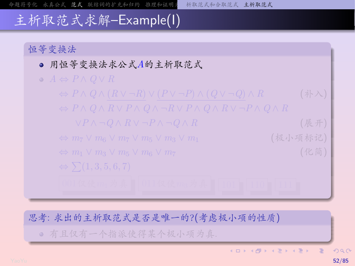
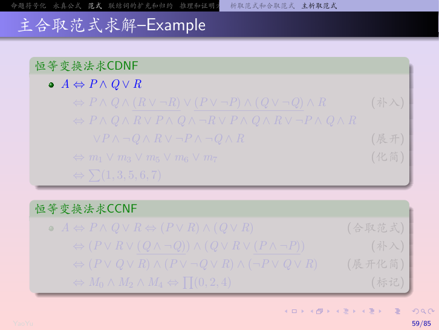
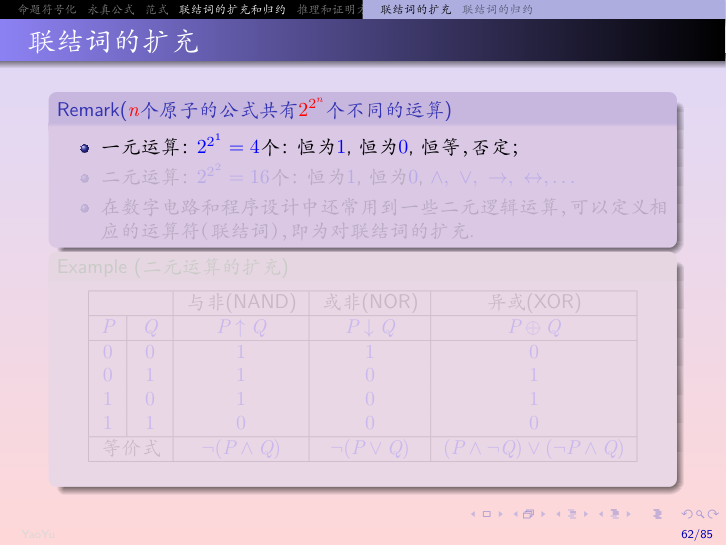
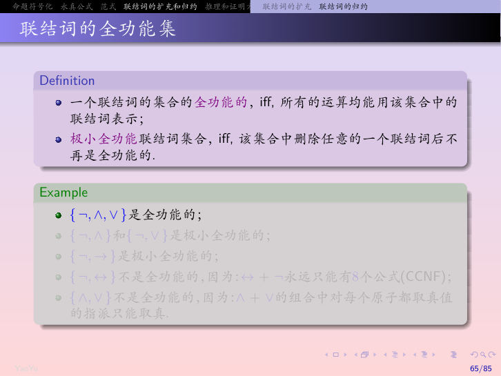
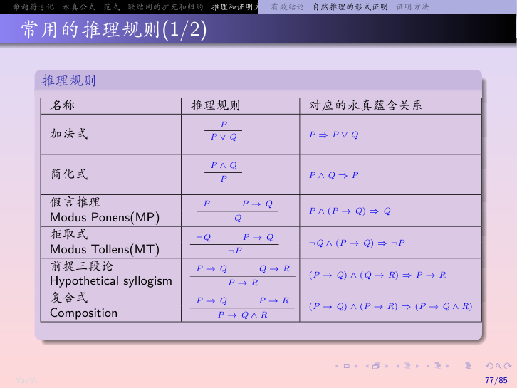
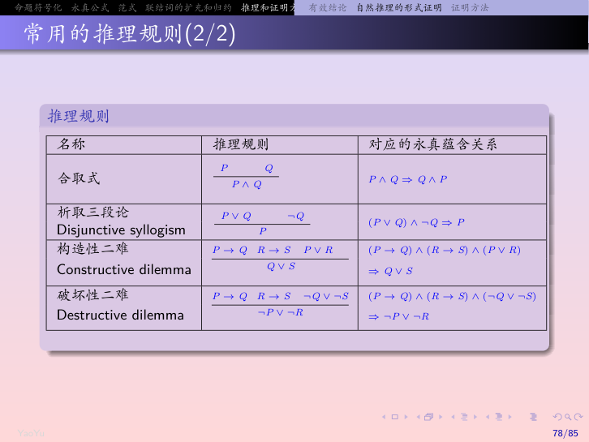
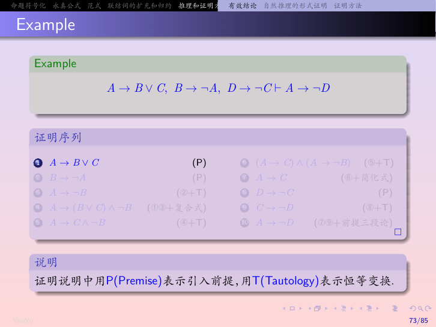
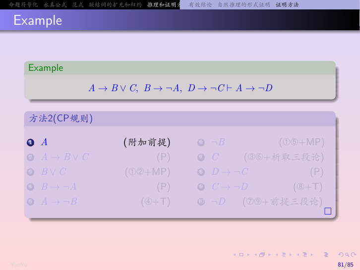
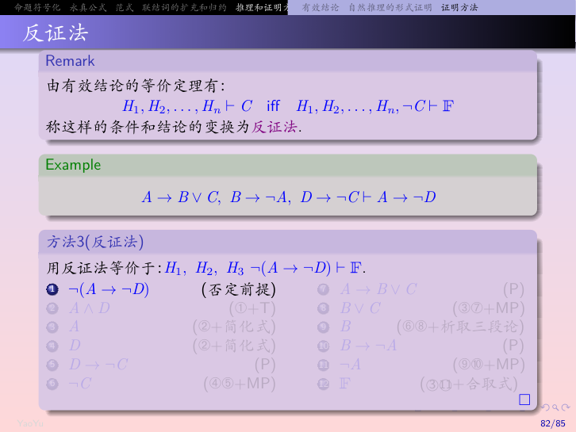

# 02 命题逻辑

> 本章对应教材《离散数学及其应用》（第8版）第1章 基础逻辑 1.1、1.2、1.3、1.6、1.7、1.8 节。
> 谓词和量词（1.4、1.5 节）见 **03-谓词逻辑**。

---

> **目录**
>
> - [1.1 命题逻辑](#11-命题逻辑)
>   - [命题](#命题) · [逻辑联结词](#逻辑联结词) · [真值表](#真值表) · [运算符优先级](#运算符优先级) · [比特运算](#比特运算)
> - [1.2 命题逻辑的应用](#12-命题逻辑的应用)
>   - [语句翻译](#语句翻译) · [系统规范说明](#系统规范说明) · [布尔搜索](#布尔搜索) · [逻辑谜题](#逻辑谜题) · [逻辑电路](#逻辑电路)
> - [1.3 命题等价式](#13-命题等价式)
>   - [永真式、矛盾式和可能式](#永真式矛盾式和可能式) · [逻辑等价式](#逻辑等价式) · [德摩根律](#德摩根律) · [重要的逻辑等价式](#重要的逻辑等价式) · [可满足性](#可满足性)
>   - [对偶性](#对偶性duality) · [范式](#范式normal-form) · [联结词的扩充与归约](#联结词的扩充与归约)
> - [1.6 推理规则](#16-推理规则)
>   - [有效论证](#有效论证) · [推理规则](#命题逻辑的推理规则) · [消解律](#消解律) · [谬误](#谬误) · [量化命题的推理规则](#量化命题的推理规则)
> - [1.7 证明导论](#17-证明导论)
>   - [专用术语](#专用术语) · [直接证明法](#直接证明法) · [反证法](#反证法) · [归谬证明法](#归谬证明法) · [等价证明法](#等价证明法) · [证明中的错误](#证明中的错误)
> - [1.8 证明的方法和策略](#18-证明的方法和策略)
>   - [穷举证明法](#穷举证明法和分情形证明法) · [存在性证明](#存在性证明) · [唯一性证明](#唯一性证明) · [证明策略](#证明策略)
> - [本节重点](#本节重点)

---

## 1.1 命题逻辑

### 命题

**定义**：一个命题是一个陈述语句（即陈述事实的语句），它必须或真或假，不能既真又假。

命题的**真值**：真（True，记为 T）或假（False，记为 F）。

**例子**：
- ✅ "华盛顿是美国的首都" → 真命题
- ✅ "多伦多是加拿大的首都" → 假命题
- ❌ "现在几点了？" → 疑问句，不是命题
- ❌ "x + 1 = 2" → 真值取决于 x，不是命题

**命题变元**：用字母表示命题（如 $p, q, r, s$），类似于代数中用 $x, y, z$ 表示变量。

**复合命题**：由已知命题用**逻辑运算符**（联结词）组合而成的新命题。

---

### 逻辑联结词

#### 否定（非）

**定义**：令 $p$ 为一命题，则 $p$ 的**否定**记作 $\neg p$（也记作 $\bar{p}$），读作"非 $p$"。$\neg p$ 的真值与 $p$ 的真值相反。

| $p$ | $\neg p$ |
|:---:|:-------:|
| T | F |
| F | T |

**例**：$p$ = "Michael 的 PC 运行 Linux"  
$\neg p$ = "Michael 的 PC 没有运行 Linux"（即"并非 Michael 的 PC 运行 Linux"）

---

#### 合取（且）

**定义**：令 $p$ 和 $q$ 为命题。$p$、$q$ 的**合取**记作 $p \land q$，读作"$p$ 并且 $q$"。当且仅当 $p$ 和 $q$ 都为真时，$p \land q$ 为真，否则为假。

| $p$ | $q$ | $p \land q$ |
|:---:|:---:|:----------:|
| T | T | T |
| T | F | F |
| F | T | F |
| F | F | F |

**例**：$p$ = "今天是星期五"，$q$ = "今天下雨"  
$p \land q$ = "今天是星期五并且下雨"

> 📌 **口语中的"但"等价于"且"**："今天下雨但冷" = "今天下雨 ∧ 今天冷"
>
> 🎙️ **老师补充**：不是所有"和"都能拆成合取！
> - ✅ 能拆："今天下雨且刮风" → 下雨 ∧ 刮风
> - ❌ 不能拆："二和三的最小公倍数是六" → 这是一个完整的关系，不能拆成"二的最小公倍数是六 ∧ 三的最小公倍数是六"
> - ❌ 不能拆："点A位于点B与点C之间" → 描述三个点的关系，是一个原子命题

---

#### 析取（或）

**定义**：令 $p$ 和 $q$ 为命题。$p$、$q$ 的**析取**记作 $p \lor q$，读作"$p$ 或 $q$"。当且仅当 $p$ 和 $q$ 至少有一个为真时，$p \lor q$ 为真，否则为假。

| $p$ | $q$ | $p \lor q$ |
|:---:|:---:|:----------:|
| T | T | T |
| T | F | T |
| F | T | T |
| F | F | F |

> ⚠️ **注意**：逻辑中的"或"是**兼容或**（inclusive or），即两者都为真时也为真。
> 还有一种**异或**（exclusive or），记作 $p \oplus q$ 或 $p \veebar q$，仅当恰好一个为真时为真。
>
> 🎙️ **老师补充**：
> - **可兼或**（逻辑或）："张三是大学生或运动员" → 他可以既是大学生又是运动员
> - **不可兼或**（异或）："张宏生于1982年或1983年" → 他不可能同时生于两年，只能是其中之一
> - 严格来说异或不是基本联结词，但题目里遇到"二者不可兼得"的表述时要注意区分

| $p$ | $q$ | $p \oplus q$ |
|:---:|:---:|:------------:|
| T | T | F |
| T | F | T |
| F | T | T |
| F | F | F |

---

#### 条件语句（蕴含）

**定义**：令 $p$ 和 $q$ 为命题。**条件语句** $p \to q$ 是命题"如果 $p$，则 $q$"。当 $p$ 为真而 $q$ 为假时，$p \to q$ 为假，否则为真。

| $p$ | $q$ | $p \to q$ |
|:---:|:---:|:---------:|
| T | T | T |
| T | F | F |
| F | T | T |
| F | F | T |

> 📌 **关键理解**：$p \to q$ 只在一种情况下为假——**前件真而后件假**。当前件 $p$ 为假时，无论后件 $q$ 真假如何，$p \to q$ 都为真（"空真"）。
>
> 🎙️ **老师讲的两个"善意推定"例子**：
> 1. **嫌疑人定罪**：如果你有充分证据证明他犯了罪（前件真），他确实犯了罪（后件真），那判他有罪没问题；如果证据不足（前件假），不管他实际有没有罪，都只能判无罪——这就是"善意推定"
> 2. **对顶角定理**："如果两个角是对顶角，则它们相等"——这个定理永远是真的。但当两个角**不是**对顶角时（前件假），定理依然成立（后件可能真也可能假），这就是为什么前件为假时整个蕴含式为真

**术语**：
- $p$ 称为**前件**（前提），$q$ 称为**后件**（结论）
- $p \to q$ 也读作："$p$ 蕴含 $q$"、"$p$ 是 $q$ 的充分条件"、"$q$ 是 $p$ 的必要条件"

**$p \to q$ 的各种表述方式**（老师讲的7种中文说法，都要会辨认）：
- "如果 $p$，则 $q$"
- "因为 $p$，所以 $q$"
- "只要 $p$，就 $q$"
- "$p$ 仅当 $q$"
- "只有 $q$，才 $p$"（注意：后件 $q$ 在前）
- "除非 $q$，才 $p$"（注意：后件 $q$ 在前）
- "除非 $q$，否则不 $p$"（注意：后件 $q$ 在前，且 $p$ 以否定形式出现）

> 🎙️ **老师补充**：如何判断充分条件和必要条件？
> - **充分条件**：看"如果...那么..."——"如果"后面的就是充分条件
> - **必要条件**：看"只有...才..."——"只有"后面的就是必要条件，必要条件放在蕴含的**后件**
> - 举例："只有修满学分才能毕业" → 修满学分是毕业的必要条件 → 毕业 → 修满学分
> - 判断技巧：**充分条件用肯定形式判断**（条件成立时结论是否成立）；**必要条件用否定形式判断**（条件不成立时结论是否一定不成立）

---

#### 双条件语句（等价）

**定义**：令 $p$ 和 $q$ 为命题。**双条件语句** $p \leftrightarrow q$ 是命题"$p$ 当且仅当 $q$"（记作 $p$ iff $q$）。当 $p$ 和 $q$ 有同样真值时，$p \leftrightarrow q$ 为真，否则为假。

| $p$ | $q$ | $p \leftrightarrow q$ |
|:---:|:---:|:--------------------:|
| T | T | T |
| T | F | F |
| F | T | F |
| F | F | T |

> 📌 $p \leftrightarrow q$ 等价于 $(p \to q) \land (q \to p)$

---

### 命题公式（合式公式 / WFF）

**WFF = Well-Formed Formula = 合式公式（良构公式）**

意思是：**语法正确、符合规则的公式**。不是随便写一串符号都叫公式，必须按规则构造出来才是合法的。

**合式公式的递归定义**：

1. **基础**：单个命题变元（$P, Q, R$ 等）是WFF
2. **递归**：
   - 如果 $A$ 是WFF，那么 $\neg A$ 也是WFF
   - 如果 $A$ 和 $B$ 是WFF，那么 $(A \land B)$、$(A \lor B)$、$(A \to B)$、$(A \leftrightarrow B)$ 都是WFF
3. **封闭**：只有有限步按上面规则构造出来的才是WFF

**例子**：
- ✅ 合法：$(P \to Q) \land R$ —— 按联结词优先级和括号规则构造
- ❌ 非法：$P \land \to Q$ —— 两个联结词连在一起，语法错误
- ❌ 非法：$\lor P$ —— 析取是二元联结词，不能只接一个变元

> 📌 **一句话理解**：WFF就是"写法正确"的公式——就像数学里不是随便写一串符号就叫代数式，必须符合语法规则才行。

---

### 真值表

**定义**：一个复合命题的真值表列出了命题变元所有可能的取值组合下公式的真值。

**构造方法**：
1. 左边列出所有命题变元的 $2^n$ 种取值组合（$n$ 为变元个数）
2. 按运算优先级逐步计算中间结果
3. 最后一列是公式的最终真值

**例**：求 $(p \lor \neg q) \to (p \land q)$ 的真值表

| $p$ | $q$ | $\neg q$ | $p \lor \neg q$ | $p \land q$ | $(p \lor \neg q) \to (p \land q)$ |
|:---:|:---:|:-------:|:-------------:|:----------:|:-------------------------------:|
| T | T | F | T | T | T |
| T | F | T | T | F | F |
| F | T | F | F | F | T |
| F | F | T | T | F | F |

---

### 运算符优先级

命题逻辑联结词的优先级如下：

| 运算符 | 优先级 |
|:-----:|:-----:|
| $\neg$ | 1（最高） |
| $\land$ | 2 |
| $\lor$ | 3 |
| $\to$ | 4 |
| $\leftrightarrow$ | 5（最低） |

> 📌 有括号时先算括号内。多个同级运算符从左到右计算。

---

### 比特运算

**比特**：一个值为 0 或 1 的符号。**布尔变量**：值为真或假的变量。

**真值与比特的对应**：真 = 1，假 = 0。

**位运算**：用逻辑运算符对位串进行操作。

| 运算符 | 对应位运算 |
|:-----:|:--------:|
| $\lor$ | OR |
| $\land$ | AND |
| $\oplus$ | XOR |

**位运算示例**：
```
  01 1011 0110
∧ 11 0001 1101
--------------
  01 0001 0100
```

---

## 1.2 命题逻辑的应用

### 语句翻译

**目标**：将自然语言语句翻译成逻辑表达式。

**步骤**：
1. 识别简单命题并分配命题变元
2. 确定合适的逻辑联结词

> 🎙️ **老师讲的"剥洋葱法"**：从句子最外层的结构开始，一层一层向内剥。
> 比如"如果你陪伴我并且带我叫辆车，则我将出去"——最外层是"如果...则..."（蕴含），前件是"你陪伴我并且带我叫辆车"（合取），后件是"我将出去"。

**例**："你可以在这门课不及格，除非你通过了期末考试。"

- 设 $p$ = "你可以在这门课不及格"，$q$ = "你通过了期末考试"
- 翻译：$p \to q$（"除非"表示必要条件）

**老师补充的三个符号化例子**（设 $P$=你陪伴我，$Q$=你带我叫车，$R$=我将出去）：

| 自然语言句子 | 逻辑表达式 | 说明 |
|:-----------|:---------:|:----:|
| 如果你陪伴我并且带我叫车，则我将出去 | $(P \land Q) \to R$ | 最外层是"如果...则..." |
| 如果你不陪伴我或不带我叫车，则我将不出去 | $(\neg P \lor \neg Q) \to \neg R$ | 前件是"或"，后件是否定 |
| 除非你陪伴我或带我叫车，否则我将不出去 | $R \to (P \lor Q)$ | "除非...否则..."等价于 $R \to (P \lor Q)$ |

> ⚠️ **"除非...否则..."的翻译技巧**：
> - "除非 $Q$，否则不 $P$" = $P \to Q$
> - 也就是说，"除非"后面的内容是**后件**，"否则"后面的内容是**前件的否定**

---

### 系统规范说明

**应用**：用逻辑表达式描述硬件/软件系统的规范说明。

**例**："当系统满足以下规范时才工作正常：
- 诊断信息只在系统处于正常运行状态时显示
- 系统处于正常运行状态"

- 设 $p$ = "诊断信息显示"，$q$ = "系统处于正常运行状态"
- 规范：$(p \to q) \land q$

> ✅ 一致性检查：所有规范同时为真的赋值是否存在？存在则一致。

---

### 布尔搜索

**应用**：搜索引擎中的布尔逻辑。

- **AND**：同时包含两个关键词
- **OR**：包含任意一个关键词
- **NOT**：排除包含某关键词的结果

**例**：搜索"大学 AND 排名" = 只返回同时包含"大学"和"排名"的网页。

---

### 逻辑谜题

**应用**：用逻辑推理解决谜题。

**例**：两个房间，一扇门通向自由，一扇门通向死亡。两个守卫，一个总说真话，一个总说假话。你只能问一个问题。

**答案**：问任意一人："如果我问另一个人哪扇门通向自由，他会指哪扇门？"然后选相反的那扇。

> 📌 这类问题的核心是构造一个复合命题，使得真话者和假话者给出相同的错误答案。

---

### 逻辑电路

**应用**：数字电路设计。

三种基本门电路：

| 门 | 输入输出 | 对应逻辑 |
|:--:|:------:|:------:|
| 逆变器（非门） | 输入 → 输出 | $\neg p$ |
| 或门 | 两输入 → 输出 | $p \lor q$ |
| 与门 | 两输入 → 输出 | $p \land q$ |

> 📌 复杂电路可以用这些基本门的组合来构造。

---

## 1.3 命题等价式

### 永真式、矛盾式和可能式

**定义**：
- **永真式（重言式）**：一个永远为真的复合命题
- **矛盾式**：一个永远为假的复合命题
- **可能式**：既不是永真式也不是矛盾式的复合命题

**例**：
- $p \lor \neg p$ 是永真式
- $p \land \neg p$ 是矛盾式
- $p$ 是可能式

---

### 逻辑等价式

**定义**：如果 $p \leftrightarrow q$ 是永真式，则称 $p$ 和 $q$ 是**逻辑等价的**，记作 $p \equiv q$（或 $p \Leftrightarrow q$）。

> 📌 **验证方法**：真值表法——两个公式在所有赋值下真值都相同。

---

### 德摩根律

**德摩根律**是最重要的逻辑等价式之一：

$$\neg(p \land q) \equiv \neg p \lor \neg q$$

$$\neg(p \lor q) \equiv \neg p \land \neg q$$

> 📌 **白话理解**："并非（$p$ 且 $q$）" = "非 $p$ 或 非 $q$"；"并非（$p$ 或 $q$）" = "非 $p$ 且 非 $q$"。
>
> 就像"今天又下雨又刮风是假的" = "今天不下雨 或 不刮风"。

---

### 重要的逻辑等价式

| 等价式 | 名称 |
|:-----:|:----:|
| $p \land T \equiv p$, $p \lor F \equiv p$ | 同一律 |
| $p \lor T \equiv T$, $p \land F \equiv F$ | 支配律（零律） |
| $p \lor p \equiv p$, $p \land p \equiv p$ | 幂等律 |
| $\neg(\neg p) \equiv p$ | 双重否定律 |
| $p \lor q \equiv q \lor p$, $p \land q \equiv q \land p$ | 交换律 |
| $(p \lor q) \lor r \equiv p \lor (q \lor r)$ | 结合律（析取） |
| $(p \land q) \land r \equiv p \land (q \land r)$ | 结合律（合取） |
| $p \lor (q \land r) \equiv (p \lor q) \land (p \lor r)$ | 分配律（析取对合取） |
| $p \land (q \lor r) \equiv (p \land q) \lor (p \land r)$ | 分配律（合取对析取） |
| $\neg(p \land q) \equiv \neg p \lor \neg q$ | 德摩根律（合取） |
| $\neg(p \lor q) \equiv \neg p \land \neg q$ | 德摩根律（析取） |
| $p \lor (p \land q) \equiv p$, $p \land (p \lor q) \equiv p$ | 吸收律 |
| $p \lor \neg p \equiv T$, $p \land \neg p \equiv F$ | 排中律、矛盾律 |
| $p \to q \equiv \neg p \lor q$ | 蕴含等值式 |
| $p \to q \equiv \neg q \to \neg p$ | 假言易位（逆否） |
| $p \leftrightarrow q \equiv (p \to q) \land (q \to p)$ | 等价等值式 |

> 🎙️ **老师补充**：**代入规则 vs 替换规则**
> - **代入规则**：在一个永真式中，把某个命题变元的所有出现都替换为任意复合命题，结果仍是永真式
> - **替换规则**：如果公式 $A$ 的某个子公式 $B$ 与 $C$ 逻辑等价，则把 $B$ 替换为 $C$，得到的新公式与原公式等价
> - 关键区别：代入规则只适用于**永真式**中的**命题变元**；替换规则适用于**任何公式**中的**任何子公式**

---

### 可满足性

**定义**：一个复合命题是**可满足的**，如果存在一个使得它为真的赋值（解释）。如果不存在这样的赋值，则它是**不可满足的**（即矛盾式）。

**例**：判断 $(p \lor \neg q) \land (q \lor \neg r) \land (r \lor \neg p)$ 是否可满足。

- 令 $p = q = r = T$：$(T \lor F) \land (T \lor F) \land (T \lor F) = T$
- ✅ 可满足

**应用**：可满足性问题在计算机科学、人工智能、电路设计等领域有广泛应用。

---

### 对偶性（Duality）

> 对偶性是命题逻辑中非常重要的性质，它把 $\land$ 和 $\lor$、$T$ 和 $F$ 联系起来。

**对偶公式**：设 $G$ 是一个仅含有 $\neg$、$\land$ 和 $\lor$ 的公式，把 $G$ 中的 $\land$、$\lor$、$T$、$F$ 分别替换为 $\lor$、$\land$、$F$、$T$，得到的新公式 $G^*$ 称为 $G$ 的**对偶公式**。

**例**：$(P \land Q \lor \neg R)^* = (P \lor Q \land \neg R)$

**广义德摩根定理**：

$$\neg G(P_1, P_2, \ldots, P_n) \equiv G^*(\neg P_1, \neg P_2, \ldots, \neg P_n)$$

> 📌 **白话理解**：对一个公式取否定，等于先把公式对偶化，再把每个变元换成它的否定。

**对偶推论**：
- 如果 $F \equiv G$，则 $F^* \equiv G^*$（等价式的对偶式也等价）
- 如果 $F \Rightarrow G$，则 $G^* \Rightarrow F^*$（蕴含式的对偶式反向蕴含）

> 🎙️ **老师补充**：对偶性最大的用处是——记住一半等价式，另一半自动就出来了。比如记住了分配律 $P \lor (Q \land R) \equiv (P \lor Q) \land (P \lor R)$，对偶一下就得到 $P \land (Q \lor R) \equiv (P \land Q) \lor (P \land R)$，不用死记。

---

### 范式（Normal Form）

> 教材在1.3节练习中提到了析取范式，这里按武大PPT内容展开。

#### 基本积与基本和

- **基本积**：命题变元或其否定的合取式。例如 $P$、$\neg P \land Q$、$Q \land \neg P$
- **基本和**：命题变元或其否定的析取式。例如 $P$、$\neg P \lor Q$、$Q \lor \neg P$

#### 析取范式（DNF）

**定义**：由基本积的析取组成的公式，称为**析取范式**。

$$A \equiv A_1 \lor A_2 \lor \cdots \lor A_n \quad (n \geq 1)$$

其中每个 $A_i$ 是基本积。

**求解步骤**：
1. 消去联结词 $\rightarrow$ 和 $\leftrightarrow$
2. 用德摩根律把否定移到变元前面，消去双重否定
3. 用分配律、结合律把公式化为析取范式
#### 合取范式（CNF）

**定义**：由基本和的合取组成的公式，称为**合取范式**。

$$A \equiv A_1 \land A_2 \land \cdots \land A_n \quad (n \geq 1)$$

其中每个 $A_i$ 是基本和。

> **对偶**：析取范式和合取范式是对偶的——把 $\land$ 和 $\lor$ 互换、把"基本积"和"基本和"互换，就从一个变成另一个。

---

#### 极小项与主析取范式

**极小项**：含 $n$ 个命题变元的基本积，要求每个变元与其否定不同时出现，且二者之一恰好出现一次。

例如，3个变元 $P, Q, R$ 的极小项：
- $m_0 = \neg P \land \neg Q \land \neg R$
- $m_1 = \neg P \land \neg Q \land R$
- $m_2 = \neg P \land Q \land \neg R$
- $m_3 = \neg P \land Q \land R$
- $m_4 = P \land \neg Q \land \neg R$
- $m_5 = P \land \neg Q \land R$
- $m_6 = P \land Q \land \neg R$
- $m_7 = P \land Q \land R$

共 $2^n$ 个极小项。

**极小项的性质**：
- 每个极小项**恰好对应一组真值指派**，且只有在这组指派下它才为真
- 任意两个不同极小项的合取为假
- 所有极小项的析取为真

**主析取范式**：由极小项的析取组成的公式，且与原公式逻辑等价。

**求解方法**：
1. 先求析取范式
2. 去掉永假的基本积
3. 对缺少变元的基本积补入未出现的变元：$A \equiv A \land (B \lor \neg B)$
4. 合并相同的基本积



**主析取范式的唯一性**：每个公式的主析取范式是**唯一的**（不计极小项顺序）。因为每个公式的真值表是唯一的，为真的行也是唯一的，对应的极小项就是唯一的。

---

#### 极大项与主合取范式

**极大项**：含 $n$ 个命题变元的基本和，要求每个变元与其否定不同时出现，且二者之一恰好出现一次。

**极大项的性质**：
- 每个极大项**恰好对应一组真值指派**，且只有在这组指派下它才为假
- 任意两个不同极大项的析取为真
- 所有极大项的合取为假

**主合取范式**：由极大项的合取组成的公式，且与原公式逻辑等价。

**对偶关系**：
- 极小项 $\leftrightarrow$ 极大项：$\land$ 和 $\lor$ 互换，$\neg$ 和非 $\neg$ 互换
- 主析取范式 $\leftrightarrow$ 主合取范式：为真的行对应极小项，为假的行对应极大项



> 🎙️ **老师补充**：范式这部分考试重点是**求主析取范式**。两种方法：① 真值表法（找公式为真的行，直接写出对应极小项）；② 恒等变换法（先求析取范式，再补变元）。真值表法更直观，恒等变换法更灵活。

---

### 联结词的扩充与归约

> 这部分是武大PPT特有的内容，教材正文里没有专门讲。

#### 联结词的扩充

除了常用的 $\neg$、$\land$、$\lor$、$\rightarrow$、$\leftrightarrow$ 之外，数字电路和程序设计中还常用到一些联结词：

- **与非（NAND）**：$P \uparrow Q \equiv \neg(P \land Q)$，相当于"合取再取反"
- **或非（NOR）**：$P \downarrow Q \equiv \neg(P \lor Q)$，相当于"析取再取反"
- **异或（XOR）**：$P \oplus Q \equiv (P \lor Q) \land \neg(P \land Q)$，恰好一个为真时为真

n个原子的公式共有 $2^{2^n}$ 个不同的运算：
- 一元运算：$2^{2^1} = 4$ 个（恒为真、恒为假、恒等、否定）
- 二元运算：$2^{2^2} = 16$ 个（$\land$、$\lor$、$\rightarrow$、$\leftrightarrow$、与非、或非、异或等）



---

#### 全功能集与极小全功能集

**全功能集**：一个联结词集合是**全功能的**（功能完备的），如果所有逻辑运算都能用该集合中的联结词表示。

**极小全功能集**：如果一个全功能集中删除任意一个联结词后就不再是全功能的，则称它为**极小全功能集**。

| 集合 | 是否全功能 | 是否极小 |
|:----:|:----------:|:--------:|
| $\{\neg, \land, \lor\}$ | ✅ | ❌ |
| $\{\neg, \land\}$ | ✅ | ✅ |
| $\{\neg, \lor\}$ | ✅ | ✅ |
| $\{\neg, \rightarrow\}$ | ✅ | ✅ |
| $\{\uparrow\}$（与非） | ✅ | ✅ |
| $\{\downarrow\}$（或非） | ✅ | ✅ |



**例**：证明 $\{\downarrow\}$ 是全功能的。

1. $\neg P \equiv P \downarrow P$
2. $P \lor Q \equiv \neg(P \downarrow Q) \equiv (P \downarrow Q) \downarrow (P \downarrow Q)$
3. $P \land Q \equiv \neg P \downarrow \neg Q$

> 📌 **为什么重要**：数字电路设计中，只要一种门电路（如与非门）就可以实现所有逻辑功能，这大大简化了电路设计。

---

## 1.6 推理规则

### 有效论证

**定义**：一个**论证**是一串命题，最后一个命题是**结论**，前面的命题称为**前提**。如果所有前提为真时结论也为真，则称该论证是**有效的**。

> 🎙️ **老师补充**：
> 形式化定义：设 $H_1, H_2, \ldots, H_n$ 是前提，$C$ 是结论。如果 $H_1 \land H_2 \land \cdots \land H_n \to C$ 是**永真式**，则称 $C$ 是前提 $H_1, \ldots, H_n$ 的**有效结论**。
>
> 等价说法：
> 1. $H_1 \land \cdots \land H_n \Rightarrow C$（符号表示）
> 2. $H_1 \land \cdots \land H_n \to C$ 是永真式
> 3. $\neg(H_1 \land \cdots \land H_n \to C)$ 是矛盾式

**判断论证有效性的方法**：
1. **真值表法**：检查前提合取 → 结论 是否为永真式
2. **逻辑等价变换法**：通过等价变换证明是永真式
3. **推理规则法**：形式化证明序列（推荐！）

---

### 命题逻辑的推理规则

> 🎙️ **老师补充**：证明序列的格式
> ```
> 序号    公式          规则
> 1       $H_1$         P（前提引入）
> 2       $H_2$         P
> 3       $A$           T, 1,2（等价变换）
> 4       $B$           I, 3, 推理规则名
> ...
> n       $C$           （结论）
> ```
> 证明序列中每一步只能是三种之一：
> 1. **P 规则**：引入前提（任何时候都可以引入）
> 2. **T 规则**：对前面的公式做逻辑等价变换（恒等变换）
> 3. **I 规则**：应用永真蕴含式（推理规则）得到新结论

#### 常用推理规则表



| 推理规则 | 永真蕴含式 | 名称 | 简称 |
|:------:|:--------:|:----:|:---:|
| $p, q \vdash p \land q$ | $p \land q \Rightarrow p \land q$ | 合取引入 | 加法 |
| $p \land q \vdash p$ | $p \land q \Rightarrow p$ | 合取消去 | 简化式 |
| $p, p \to q \vdash q$ | $p \land (p \to q) \Rightarrow q$ | 假言推理（肯定前件） | MP |
| $\neg q, p \to q \vdash \neg p$ | $\neg q \land (p \to q) \Rightarrow \neg p$ | 拒取式（否定后件） | MT |
| $p \lor q, \neg p \vdash q$ | $(p \lor q) \land \neg p \Rightarrow q$ | 析取三段论 | 析取三段 |
| $p \to q, q \to r \vdash p \to r$ | $(p \to q) \land (q \to r) \Rightarrow p \to r$ | 假言三段论 | 前提三段论 |
| $(p \to q) \land (r \to s), p \lor r \vdash q \lor s$ | 同左 | 构造性二难 | 构造性二难 |
| $(p \to q) \land (r \to s), \neg q \lor \neg s \vdash \neg p \lor \neg r$ | 同左 | 破坏性二难 | 破坏性二难 |



> 📌 **MP（Modus Ponens）**：最常用的推理规则——"如果 $p$ 则 $q$，已知 $p$，所以 $q$"
> 📌 **MT（Modus Tollens）**："如果 $p$ 则 $q$，已知非 $q$，所以非 $p$"

> 🎙️ **老师补充：关于 I 和 E 的区别**
> - **I（Implication，永真蕴含式推导）**：使用基本蕴含关系（推理定律）推导，即上面表中的推理规则
>   - 特点：$A \Rightarrow B$ 表示 $A$ 为真时 $B$ 必为真，但 $B$ 为真时 $A$ 不一定为真
>   - 不可逆！$p \Rightarrow p \lor q$，但 $p \lor q$ 为真不能推出 $p$ 为真
> - **E（Equivalence，等价变换推导）**：使用逻辑等价式推导
>   - 特点：$A \equiv B$ 表示 $A$ 和 $B$ 真值完全相同
>   - 可逆！两边可以互相替换
>
> **例子**：$p \to q, p \to r \vdash p \to (q \land r)$ 属于 **I（复合式/合取引入）**，因为它是永真蕴含关系，不是等价变换。

#### 证明序列例题



> 📌 例题：$A \to B \lor C, B \to \neg A, D \to \neg C \vdash A \to \neg D$
>
> 证明序列的每一步三列：序号 | 公式 | 规则（P=前提引入，T=等价变换，I=推理规则）

---

### 消解律

**消解律**：$(p \lor q) \land (\neg p \lor r) \vdash q \lor r$

> 📌 消解律在自动定理证明和逻辑编程中有重要应用。

---

### 谬误

常见的推理错误：

1. **肯定结论的谬误**：从 $p \to q$ 和 $q$ 推出 $p$
   - 错误：$p \to q$ 为真且 $q$ 为真时，$p$ 不一定为真
   - 例："如果下雨则地湿，地湿了，所以下雨了"——可能是洒水车洒的

2. **否定假设的谬误**：从 $p \to q$ 和 $\neg p$ 推出 $\neg q$
   - 错误：$p \to q$ 为真且 $p$ 为假时，$q$ 不一定为假
   - 例："如果下雨则地湿，没下雨，所以地没湿"——可能是洒水车洒的

3. **循环论证（窃取论题）**：证明的某个步骤基于待证明命题的真实性
   - 例：要证"$n^2$ 是偶数则 $n$ 是偶数"，证明中直接说"令 $n = 2k$"——这本身就是待证结论

---

### 量化命题的推理规则

| 推理规则 | 名称 |
|:------:|:----:|
| $\forall x\, P(x) \vdash P(c)$（$c$ 是论域中任意元素） | 全称实例化（UI） |
| $P(c)$（$c$ 是任意元素）$\vdash \forall x\, P(x)$ | 全称泛化（UG） |
| $\exists x\, P(x) \vdash P(c)$（$c$ 是论域中某个特定元素） | 存在实例化（EI） |
| $P(c)$（某个元素 $c$）$\vdash \exists x\, P(x)$ | 存在泛化（EG） |

**全称假言推理**：$\forall x\, (P(x) \to Q(x)), P(a) \vdash Q(a)$

> 📌 这就是"所有人都会死，苏格拉底是人，所以苏格拉底会死"的形式化：
> - $\forall x\, (人(x) \to 死(x))$
> - $人(苏格拉底)$
> - ∴ $死(苏格拉底)$

---

## 1.7 证明导论

### 专用术语

| 术语 | 定义 |
|:--:|:----:|
| **定理** | 能够被证明为真的语句（重要的） |
| **命题** | 不太重要的定理 |
| **公理/假设** | 假定为真的语句 |
| **证明** | 建立定理真实性的有效论证 |
| **引理** | 重要性较低、用于证明其他结论的定理 |
| **推论** | 从已证定理直接推出的定理 |
| **猜想** | 被提出认为是真但尚未证明的命题 |

---

### 直接证明法

**方法**：要证明 $p \to q$，假设 $p$ 为真，然后用公理、定义、已证定理和推理规则，证明 $q$ 必须为真。

**例**：证明"如果 $n$ 是奇数，则 $n^2$ 是奇数"。

**证明**：
1. 假设 $n$ 是奇数（$p$ 为真）
2. 由奇数定义，$n = 2k + 1$，其中 $k$ 是整数
3. $n^2 = (2k+1)^2 = 4k^2 + 4k + 1 = 2(2k^2 + 2k) + 1$
4. 由奇数定义，$n^2$ 是奇数（$q$ 为真）
5. ∴ 如果 $n$ 是奇数，则 $n^2$ 是奇数 ✅

---

### 反证法

**方法**：要证明 $p \to q$，等价于证明其逆否命题 $\neg q \to \neg p$ 为真。假设 $\neg q$ 为真，然后证明 $\neg p$ 必须为真。

> 📌 **为什么有效？** 因为 $p \to q \equiv \neg q \to \neg p$（假言易位）

**例**：证明"如果 $3n + 2$ 是奇数，则 $n$ 是奇数"。

**证明（反证法）**：
1. 假设结论为假：$n$ 是偶数
2. 由偶数定义，$n = 2k$
3. $3n + 2 = 3(2k) + 2 = 6k + 2 = 2(3k+1)$
4. 所以 $3n + 2$ 是偶数，即不是奇数（前提为假）
5. 结论的否定蕴含前提为假，所以原命题为真 ✅

---

### 空证明和平凡证明

**空证明**：已知 $p$ 为假，则 $p \to q$ 自动为真（不管 $q$ 是什么）。

**例**：证明"如果 $0 > 1$，则 $0^2 > 0$"。
- 前提 $0 > 1$ 为假，所以条件语句自动为真。✅

**平凡证明**：已知 $q$ 为真，则 $p \to q$ 自动为真（不管 $p$ 是什么）。

**例**：证明"如果 $a \ge b$，则 $a^0 \ge b^0$"。
- 结论 $a^0 \ge b^0$ 即 $1 \ge 1$，为真，所以条件语句自动为真。✅

---

### 归谬证明法

**方法**：要证明命题 $p$，假设 $\neg p$ 为真，然后导出矛盾（即证明 $\neg p \to (r \land \neg r)$），从而 $p$ 为真。

> 📌 **为什么有效？** 如果 $\neg p$ 蕴含矛盾，则 $\neg p$ 为假，所以 $p$ 为真。

**例**：证明 $\sqrt{2}$ 是无理数。

**证明（归谬法）**：
1. 假设 $\sqrt{2}$ 是有理数，则 $\sqrt{2} = a/b$，其中 $a, b$ 是整数，无公因子，$b \neq 0$
2. 平方得 $2 = a^2/b^2$，即 $2b^2 = a^2$
3. $a^2$ 是偶数，所以 $a$ 是偶数（如果平方是偶数则原数是偶数）
4. 设 $a = 2c$，则 $2b^2 = 4c^2$，即 $b^2 = 2c^2$
5. $b^2$ 是偶数，所以 $b$ 也是偶数
6. $a$ 和 $b$ 都是偶数，所以有公因子 2，与"无公因子"矛盾
7. ∴ $\sqrt{2}$ 是无理数 ✅

> 🎙️ **老师补充：归谬法 vs 反证法 vs CP规则的关系**
> - **反证法（教材称"反证"）**：证明 $\neg q \to \neg p$ 来证 $p \to q$
> - **归谬法**：假设 $\neg p$，推出矛盾，从而 $p$ 为真
> - **CP规则（附加前提法）**：当结论是蕴含式 $p \to q$ 时，把前件 $p$ 作为附加前提引入，证明后件 $q$
> - **反证法（老师课上讲的"反证法"）**：假设结论 $\neg C$，推出矛盾，从而 $C$ 为真
> - 三者本质上可以互相转化，都是间接证明

#### CP规则（附加前提法）



> 📌 **什么时候用CP规则？**
> - 结论是蕴含式（$A \to B$）时
> - 把结论的前件 $A$ 作为**附加前提**引入证明序列
> - 然后证明后件 $B$
> - 原理：$H_1 \land \cdots \land H_n \to (A \to B) \equiv (H_1 \land \cdots \land H_n \land A) \to B$

#### 反证法（归谬法）



> 📌 **反证法原理**：
> - 要证 $H_1, \ldots, H_n \vdash C$
> - 等价于 $H_1, \ldots, H_n, \neg C \vdash F$（推出矛盾）
> - 即：假设结论为假，看能否推出矛盾

---

### 等价证明法

**方法**：要证明 $p \leftrightarrow q$（$p$ 当且仅当 $q$），需要证明 $p \to q$ 和 $q \to p$ 都为真。

**例**：证明"$n$ 是奇数当且仅当 $n^2$ 是奇数"。

- $p \to q$：如果 $n$ 是奇数，则 $n^2$ 是奇数（直接证明，见上）
- $q \to p$：如果 $n^2$ 是奇数，则 $n$ 是奇数（反证法：假设 $n$ 是偶数，则 $n^2$ 是偶数）
- ∴ $n$ 是奇数当且仅当 $n^2$ 是奇数 ✅

**多命题等价**：要证明 $p_1, p_2, \ldots, p_n$ 等价，只需证明一个循环：
$$p_1 \to p_2, p_2 \to p_3, \ldots, p_n \to p_1$$

---

### 反例证明法

**方法**：要证明 $\forall x\, P(x)$ 为假，只需找到一个反例 $c$ 使得 $P(c)$ 为假。

**例**：证明"每个正整数都是两个整数的平方和"为假。
- 反例：$3$ 不能写成两个整数的平方和（$0^2+1^2=1$, $0^2+2^2=4$, $1^2+2^2=5$，都不是 3）
- ∴ 原命题为假 ✅

---

### 证明中的错误

常见错误：

1. **除零错误**：等式两边除以零
2. **肯定结论的谬误**：从 $p \to q$ 和 $q$ 推出 $p$
3. **否定假设的谬误**：从 $p \to q$ 和 $\neg p$ 推出 $\neg q$
4. **循环论证（窃取论题）**：证明中使用了待证结论本身

> 📌 每一步都必须从之前的步骤逻辑地导出，不能引入未经证明的假设。

---

## 1.8 证明的方法和策略

### 穷举证明法和分情形证明法

**分情形证明法**：当一个证明不能同时覆盖所有情况时，将前提拆分为若干情形 $p_1, p_2, \ldots, p_n$，分别证明每个情形都能推出结论 $q$。

推理规则：
$$(p_1 \to q) \land (p_2 \to q) \land \cdots \land (p_n \to q) \Rightarrow (p_1 \lor p_2 \lor \cdots \lor p_n) \to q$$

**穷举证明法**：分情形证明的特例，每种情形对应一个具体例子，只需检验少量例子。

**例**：证明对所有整数 $n$，$n^2 \ge n$。

分三种情形：
- 情形(i)：$n = 0$，$0^2 = 0 \ge 0$ ✅
- 情形(ii)：$n \ge 1$，$n \cdot n \ge n \cdot 1$，即 $n^2 \ge n$ ✅
- 情形(iii)：$n \le -1$，$n^2 \ge 0 \ge n$ ✅
- ∴ 对所有整数 $n$，$n^2 \ge n$ ✅

**不失一般性（WLOG）**：当两种情形的证明完全对称时，可以只证明一种，说明另一种通过交换变量即可得到。

> ⚠️ 滥用 WLOG 是常见错误——如果两种情形不对称，就不能省略！

---

### 存在性证明

**定义**：证明 $\exists x\, P(x)$ 为真。

**构造性存在证明**：找出一个具体的 $a$ 使得 $P(a)$ 为真。

**例**：证明存在一个正整数可以用两种不同方式表示为正整数的立方和。

- $1729 = 10^3 + 9^3 = 12^3 + 1^3$ ✅

> 📌 1729 是著名的"出租车数"——哈代看望拉马努金时提到出租车号 1729 很无聊，拉马努金说："不，它是可以用两种方式表示为立方和的最小数。"

**非构造性存在证明**：不找出具体元素，而是用归谬法等方法证明存在。

**例**：证明存在无理数 $x, y$ 使得 $x^y$ 是有理数。

- 考虑 $\sqrt{2}^{\sqrt{2}}$：
  - 如果它是有理数，则取 $x = y = \sqrt{2}$，得证
  - 如果它是无理数，则取 $x = \sqrt{2}^{\sqrt{2}}$, $y = \sqrt{2}$，则 $x^y = (\sqrt{2}^{\sqrt{2}})^{\sqrt{2}} = \sqrt{2}^2 = 2$，是有理数
- ∴ 存在这样的无理数对 ✅
- 注意：我们不知道哪一对是解，只是证明了存在性

---

### 唯一性证明

**定义**：证明恰好存在一个具有特定性质的元素。

**两个部分**：
1. **存在性**：证明存在一个元素 $x$ 具有该性质
2. **唯一性**：证明如果 $x$ 和 $y$ 都具有该性质，则 $x = y$

**例**：证明如果 $a \neq 0$，则方程 $ax + b = 0$ 有唯一解。

- **存在性**：$x = -b/a$ 是解，因为 $a(-b/a) + b = -b + b = 0$ ✅
- **唯一性**：假设 $r$ 和 $s$ 都是解，则 $ar + b = 0 = as + b$，所以 $ar = as$，两边除以 $a$（$a \neq 0$），得 $r = s$ ✅
- ∴ 唯一解 ✅

---

### 证明策略

#### 正向推理 vs 反向推理

- **正向推理**：从前提出发，一步步推到结论
- **反向推理**：从结论出发，反向寻找需要证明什么

**例**：证明对不同正实数 $x, y$，算术均值大于几何均值：$(x+y)/2 > \sqrt{xy}$。

**反向推理**：
$$(x+y)/2 > \sqrt{xy}$$
$$\iff (x+y)^2/4 > xy$$
$$\iff (x+y)^2 > 4xy$$
$$\iff x^2 + 2xy + y^2 > 4xy$$
$$\iff x^2 - 2xy + y^2 > 0$$
$$\iff (x-y)^2 > 0$$

最后一个式子当 $x \neq y$ 时为真。然后反过来正向写就是证明。

#### 改编现有证明

遇到新问题时，看看能不能改编类似问题的证明。

**例**：改编 $\sqrt{2}$ 是无理数的证明来证明 $\sqrt{3}$ 是无理数。

---

### 寻找反例

当猜想难以证明时，先尝试找反例。

**例**：
- "每个正整数都是两个平方和" → 反例：3
- "每个正整数都是三个平方和" → 反例：7
- "每个正整数都是四个平方和" → 这是真的（拉格朗日四平方定理）

---

### 拼接问题

**骨牌拼接**：用 $1 \times 2$ 的骨牌覆盖棋盘。

**关键观察**：每个骨牌覆盖一个白格和一个黑格。

**经典结论**：去掉对角两个方格的标准棋盘（$8 \times 8$）不能用骨牌拼接。

**证明**：
1. 标准棋盘去掉两个对角后有 $64 - 2 = 62$ 个格
2. 但两个对角同色，所以剩下 32 个白格和 30 个黑格（或反之）
3. 每个骨牌必须覆盖一白一黑，$k$ 个骨牌覆盖 $k$ 白 $k$ 黑
4. 32 白 30 黑 ≠ $k$ 白 $k$ 黑，矛盾
5. ∴ 不能拼接 ✅

---

## 本节重点

> **命题逻辑核心**：
> - **命题**：有唯一真值的陈述句；**联结词**：$\neg, \land, \lor, \to, \leftrightarrow$
> - **逻辑等价**：$p \leftrightarrow q$ 是永真式；最重要的是德摩根律和蕴含等值式 $p \to q \equiv \neg p \lor q$
> - **推理**：有效论证 = 前提合取 → 结论 是永真式；常用推理规则：MP、MT、假言三段论、析取三段论
> - **证明方法**：直接证明、反证法（逆否）、归谬法（矛盾）、分情形证明、构造性/非构造性存在证明、唯一性证明
>
> **常见坑**：
> - 蕴含 $p \to q$ 只在"前真后假"时为假——前件为假时自动为真（空真）
> - 肯定结论谬误：$p \to q, q \not\Rightarrow p$
> - 否定假设谬误：$p \to q, \neg p \not\Rightarrow \neg q$
> - 循环论证：用待证结论本身来证明自己
> - 分情形证明必须覆盖所有可能情况！
