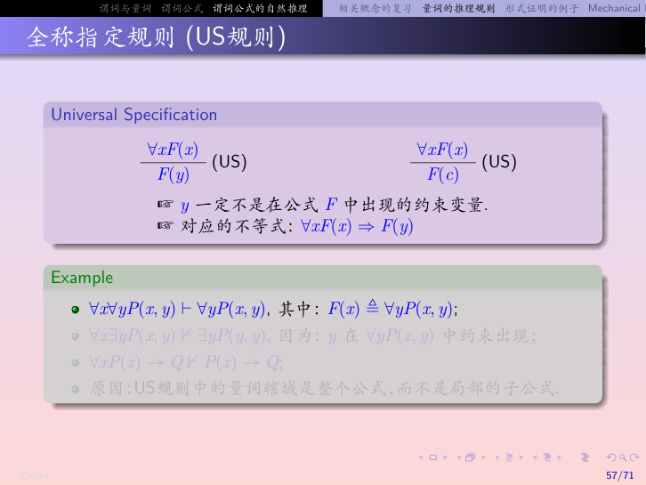
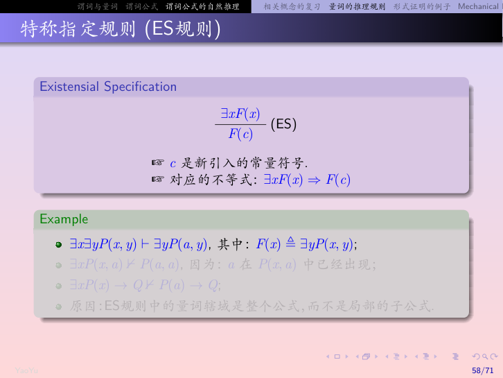
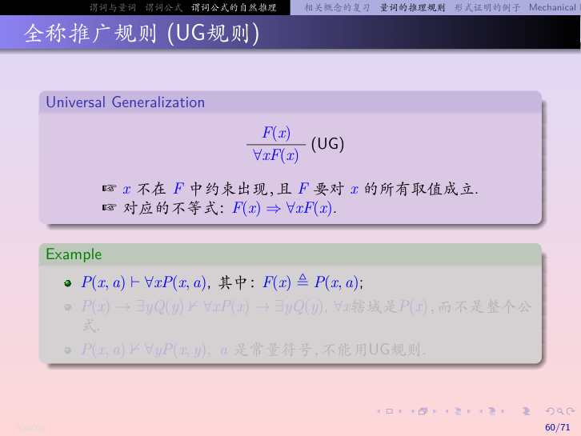

# 03 谓词逻辑（教材 1.4–1.5）

> 教材：Rosen《离散数学及其应用》第8版，1.4 谓词和量词、1.5 嵌套量词
> 课件：武大姚羽《谓词逻辑》（02-pred.pdf）
> 录音：老师补充细节已嵌入正文

---

> **目录**
>
> - [1.4 谓词和量词](#14-谓词和量词)
>   - [为什么需要谓词逻辑](#141-为什么需要谓词逻辑) · [谓词与命题函数](#142-谓词与命题函数) · [量词](#143-量词)
>   - [特性谓词与论域限制](#特性谓词与论域限制) · [受限量词](#受限量词) · [唯一性量词](#唯一性量词)
>   - [量词优先级与变量绑定](#量词优先级与变量绑定) · [量词的德摩根律](#量词的德摩根律) · [量词分配律](#量词分配律)
>   - [辖域扩张与收缩](#辖域扩张与收缩) · [量词交换性](#量词交换性) · [前束范式](#前束范式)
>   - [语句翻译与应用](#语句翻译与应用)
> - [1.5 嵌套量词](#15-嵌套量词)
>   - [理解嵌套量词](#理解嵌套量词) · [量词顺序](#量词顺序) · [翻译与否定](#翻译与否定)
> - [量词推理规则](#量词推理规则)

---

## 1.4 谓词和量词

### 1.4.1 为什么需要谓词逻辑

命题逻辑只能处理完整的命题，无法刻画"个体的性质"和"数量关系"。例如：

> 苏格拉底是人。所有人都是要死的。所以苏格拉底是要死的。

这个推理在命题逻辑中是不可证的——因为它把三个命题当作独立原子，看不出"苏格拉底"和"所有人"之间的联系。

谓词逻辑把命题拆成 **个体词（主语）+ 谓词（谓语）**，并引入量词来表达"所有""存在"，从而能刻画这类推理。

> **课件补充**：命题逻辑的局限（Limitations of Propositional Logic）
>
> 课件用经典三段论引入："Every man is mortal. Since Confucius is a man, Confucius is mortal." 命题逻辑无法推出这个结论，因为它看不到"人"这个概念在两个前提中的重复。

> 📌 **什么是"一阶逻辑"？**
>
> 我们现在学的谓词逻辑，也叫**一阶逻辑**（First-Order Logic, FOL）。
>
> 为什么叫"一阶"？因为**量词只能作用于个体变量，不能作用于谓词本身**。
>
> | 层级 | 量词作用对象 | 例子 |
> |:----|:------------|:----|
> | **一阶逻辑** | 个体（论域里的对象） | $\forall x\, P(x)$ —— 对所有个体 $x$，$P(x)$ 成立 |
> | **二阶逻辑** | 谓词本身 | $\forall P\, P(x)$ —— 对所有谓词 $P$，$P(x)$ 成立 |
>
> 我们只能说"所有 $x$ 都满足 $P$"，不能说"所有性质 $P$ 都满足……"——这就是"一阶"的意思。

---

### 1.4.2 谓词与命题函数

把命题拆成主语和谓语之后，就有了**谓词**的概念。

**谓词（predicate）**：表示个体的性质或个体之间关系的词。

**命题函数（propositional function）**：含变量的表达式。一旦给变量赋上确定值，它就变成一个命题。

例：
- $P(x)$："$x$ 大于 3"——给 $x$ 赋值后才是命题
- $Q(x, y)$："$x = y + 3$"
- $R(x, y)$："$x + y = 3$"

给变量赋值后的结果：
- $P(4)$："4 > 3"——真
- $P(2)$："2 > 3"——假
- $Q(1, 2)$："1 = 2 + 3"——假
- $R(3, 0)$："3 + 0 = 3"——真

**n 元谓词**：含 $n$ 个变量的命题函数，如 $P(x_1, x_2, \ldots, x_n)$。

**论域（domain / universe of discourse）**：变量的取值范围。同一个命题函数在不同论域下含义不同。

**📌 谓词 vs 函数：核心区别**

| 维度 | 谓词（Predicate） | 函数（Function） |
|:----|:-----------------|:----------------|
| **返回值** | **真值**（真/假） | **个体**（论域中的对象） |
| **本质** | 判断"是不是" | 表示"是谁/是什么" |
| **作用** | 描述性质、关系 | 个体之间的映射/变换 |
| **例子** | $P(x)$ = "$x$ 是素数" | $f(x)$ = "$x$ 的父亲" |
| **输入输出** | 个体 → 真假 | 个体 → 个体 |

**关键：函数可以嵌套在谓词里**

比如"张三的母亲是老师"：
- $f(x)$ = $x$ 的母亲（**函数**，输入人，输出人）
- $T(x)$ = $x$ 是老师（**谓词**，输入人，输出真假）
- 符号化：$T(f(\text{张三}))$

> **一句话记忆**：谓词回答"对不对"，函数回答"是谁"。

> **课件补充**：项（Terms）的归纳定义
>
> 课件把"项"（term）单独定义：常量、变量是项；若 $f$ 是 $n$ 元函数符号，$t_1, \ldots, t_n$ 是项，则 $f(t_1, \ldots, t_n)$ 也是项。例如 $x$ 的父亲是项 $\text{father}(x)$。
>
> **原子公式**：若 $P$ 是 $n$ 元谓词，$t_1, \ldots, t_n$ 是项，则 $P(t_1, \ldots, t_n)$ 是原子公式。

---

### 谓词公式的解释（Interpretation）

谓词公式本身只是一串符号，没有真假。要让它有真值，必须给它一个**解释**。

**什么是解释？**

一个解释 $I$ 包含：

| 组成部分 | 对应关系 | 例子 |
|:--------|:--------|:----|
| **论域** $D$ | 一个非空集合，规定变量的取值范围 | $D$ = {所有整数} |
| **常量符号** | 每个常量 → $D$ 中的一个元素 | $a$ → 3，$b$ → 5 |
| **$n$ 元函数符号** | 每个函数 → $D^n \to D$ 的映射 | $f(x)$ → $x+1$ |
| **$n$ 元谓词符号** | 每个谓词 → $D^n \to \{0, 1\}$（真/假） | $P(x, y)$ → "$x > y$" |

> 📌 **一句话理解**：解释就是给公式里所有的"符号"都指定具体含义——常量是谁、函数是什么映射、谓词是什么关系，论域是哪些东西。全部指定完，公式就有真值了。

**为什么需要解释？**

因为同一个谓词公式，在不同解释下真值可能完全不同。比如 $P(a)$：
- 解释1：$D$ = {人}，$a$ = 张三，$P(x)$ = "$x$ 是学生" → 真
- 解释2：$D$ = {人}，$a$ = 张三，$P(x)$ = "$x$ 是老师" → 假

---

#### 代入记号 $G(d/x)$

量词的定义需要用到"代入"——把变量换成具体的个体。

**$G(d/x)$ 是什么？**

意思是：把公式 $G$ 里所有的自由变量 $x$，都替换成个体 $d$。

**例子**：
- $G(x)$ = "$x$ 是偶数"
- $G(3/x)$ = "$3$ 是偶数"（把 $x$ 换成 3）
- $G(4/x)$ = "$4$ 是偶数"（把 $x$ 换成 4）

**量词和代入的关系**：

> $F = \forall x\, G$ 在解释 $I$ 下为真，当且仅当：对论域 $D$ 中的**每一个** $d$，都有 $G(d/x)|_I = 1$

翻译成人话：

> "所有 $x$ 都满足 $G$"为真 = 拿论域里每一个东西 $d$，把 $G$ 里的 $x$ 换成 $d$，都为真。

比如论域 $D = \{1, 2, 3, 4\}$，$G(x) = "x > 0"$：
- $G(1/x) = "1 > 0"$ ✔️ 真
- $G(2/x) = "2 > 0"$ ✔️ 真
- $G(3/x) = "3 > 0"$ ✔️ 真
- $G(4/x) = "4 > 0"$ ✔️ 真

四个都为真，所以 $\forall x\, G(x)$ 为真。

> 📌 **一句话理解**：$G(d/x)$ 就是"把 $x$ 换成 $d$"——$d$ 是具体的个体，$x$ 是变量，代入之后公式就有确定的真假了。

---

#### 完整计算例子：给定解释，求公式真值

知道了解释和代入记号，就可以计算任何谓词公式的真值了。下面是一个完整的步骤演示。

**给定解释 $I$：**

| 项目 | 指派 |
|:----|:----|
| 论域 $D$ | $\{1, 2, 3\}$ |
| 常量 $a$ | $a = 1$ |
| 常量 $b$ | $b = 2$ |
| 谓词 $P(x)$ | $P(x)$ 表示 "$x > 1$" |
| 谓词 $Q(x, y)$ | $Q(x, y)$ 表示 "$x + y = 3$" |

**要计算的公式：**

$$F = \forall x\, P(x) \rightarrow \exists y\, Q(a, y)$$

**计算步骤：**

**第一步：先算 $\forall x\, P(x)$ 的真值**

$\forall x\, P(x)$ 表示"对论域里所有 $x$，$P(x)$ 都为真"。

逐个代入：
- $P(1/x)$："1 > 1" → **假**
- $P(2/x)$："2 > 1" → 真
- $P(3/x)$："3 > 1" → 真

只要有一个 $x$ 使 $P(x)$ 为假，$\forall x\, P(x)$ 就为假。

∴ $\forall x\, P(x) =$ **假**

---

**第二步：再算 $\exists y\, Q(a, y)$ 的真值**

$\exists y\, Q(a, y)$ 表示"存在某个 $y$，使 $Q(a, y)$ 为真"。

已知 $a = 1$，逐个代入：
- $Q(a, 1/y) = Q(1, 1)$："1+1=3" → 假
- $Q(a, 2/y) = Q(1, 2)$："1+2=3" → **真**
- $Q(a, 3/y) = Q(1, 3)$："1+3=3" → 假

只要有一个 $y$ 使 $Q(a, y)$ 为真，$\exists y\, Q(a, y)$ 就为真。

∴ $\exists y\, Q(a, y) =$ **真**

---

**第三步：最后算整个蕴含式 $F$ 的真值**

$$F = (\forall x\, P(x)) \rightarrow (\exists y\, Q(a, y))$$

代入刚才算的结果：

$$F = \text{假} \rightarrow \text{真}$$

根据蕴含式的真值表：前件假，整个蕴含式为真（空真）。

∴ $F$ 在解释 $I$ 下为 **真** ✅

---

**另一个例子（同一个解释）：**

计算 $G = \forall x\, (P(x) \lor Q(x, b))$ 的真值，其中 $b = 2$。

**第一步：逐个 $x$ 代入**

- $x = 1$：$P(1) \lor Q(1, 2)$ = 假 $\lor$ 真 = **真**
- $x = 2$：$P(2) \lor Q(2, 2)$ = 真 $\lor$ 假 = **真**
- $x = 3$：$P(3) \lor Q(3, 2)$ = 真 $\lor$ 假 = **真**

三个都为真，所以：

∴ $G = \forall x\, (P(x) \lor Q(x, b))$ = **真** ✅

> 📌 **计算口诀**：
> 1. 先把量词展开——$\forall$ 就是逐个代入看是不是都真，$\exists$ 就是看有没有一个真
> 2. 先算内层子公式，再算外层
> 3. 最后按联结词的真值表算出整个公式的结果

---

### 1.4.3 量词

有了谓词，还需要表达"所有""存在"这类数量关系，这就引出了量词。

#### 全称量词（universal quantifier）

$\forall x\, P(x)$ 表示"对论域中**所有** $x$，$P(x)$ 为真"。

读作："对所有 $x$，$P(x)$" 或 "对每个 $x$，$P(x)$"。

**何时为真**：$P(x)$ 对论域中每个 $x$ 都为真。
**何时为假**：存在至少一个 $x$ 使 $P(x)$ 为假（这个 $x$ 称为**反例**）。

#### 存在量词（existential quantifier）

$\exists x\, P(x)$ 表示"论域中**存在**至少一个 $x$ 使 $P(x)$ 为真"。

读作："存在 $x$，使得 $P(x)$"。

**何时为真**：至少存在一个 $x$ 使 $P(x)$ 为真。
**何时为假**：对论域中所有 $x$，$P(x)$ 都为假。

#### 有限论域下的量词

若论域是有限集合 $\{a_1, a_2, \ldots, a_n\}$，则：

$$\forall x\, P(x) \equiv P(a_1) \land P(a_2) \land \cdots \land P(a_n)$$

$$\exists x\, P(x) \equiv P(a_1) \lor P(a_2) \lor \cdots \lor P(a_n)$$

也就是说，**全称量词 = 合取，存在量词 = 析取**。

> **一眼记住**：$\forall$ 是"所有人都"——缺一不可（合取）；$\exists$ 是"至少有一个"——有一个就行（析取）。

---

### 特性谓词与论域限制

量词是对整个论域做断言的，但我们日常说话时，往往只关心论域中的某一部分——比如"所有老虎都吃人"，并不是说论域里所有东西都吃人，而是说"如果 $x$ 是老虎，那它要吃人"。这就需要**特性谓词**来限定讨论范围。

**什么是特性谓词？**

当我们说"所有老虎都吃人"时，我们**不是**说论域里所有东西（桌子、椅子、猫）都吃人，而是限定了"老虎"这个范围。这个用来**限定讨论范围**的谓词，就叫**特性谓词**。

比如：
- $T(x) = x$ 是老虎 → 特性谓词，限定我们只讨论老虎
- $P(x) = x$ 要吃人 → 真正要说的性质

| 量词类型 | 特性谓词的加入方式 | 例子 |
| --- | --- | --- |
| 全称量词 $\forall x$ | 作为**蕴含式的前件**加入 | $\forall x\,(T(x) \rightarrow P(x))$：如果 $x$ 是老虎，则 $x$ 要吃人 |
| 存在量词 $\exists x$ | 作为**合取式的合取项**加入 | $\exists x\,(H(x) \land R(x))$：存在 $x$ 既是人又登上过月球 |

**为什么不能乱搭？**

- 如果"所有人都聪明"写成 $\forall x\,(\text{Student}(x) \land \text{Smart}(x))$，那就意味着论域里**所有东西**都是学生且聪明——这显然不对。
- 如果"有人登过月球"写成 $\exists x\,(\text{Human}(x) \rightarrow \text{OnMoon}(x))$，那只要论域里有一个不是人的东西，这个蕴含式就为真（前件为假），整个式子就失去了意义。

**更多例子**：

| 自然语言 | 特性谓词 | 正确符号化 |
| --- | --- | --- |
| 所有大学生都要上课 | $S(x) = x$ 是大学生 | $\forall x\,(S(x) \to A(x))$ |
| 有的大学生是党员 | $S(x) = x$ 是大学生 | $\exists x\,(S(x) \land M(x))$ |
| 所有偶数都能被2整除 | $E(x) = x$ 是偶数 | $\forall x\,(E(x) \to D(x))$ |
| 有的质数是偶数 | $P(x) = x$ 是质数 | $\exists x\,(P(x) \land E(x))$ |

**规则口诀**：**全称用蕴含，存在用合取**。

> **录音补充（老师强调）**：这个搭配规则是考试必考点。全称量词后面跟蕴含，是因为"所有 $A$ 都是 $B$"的意思是"只要是 $A$，就一定是 $B$"；存在量词后面跟合取，是因为"存在 $A$ 是 $B$"要求同时满足两个条件。
>
> 反例：$\exists x\,(\text{Student}(x) \rightarrow \text{Smart}(x))$ 恒真（只要论域里有一个非学生即可），完全表达不出"有学生聪明"的意思。

---

### 受限量词

特性谓词写起来稍显繁琐，对于最常见的范围限制（比如"所有大于0的实数"），可以直接用受限量词简写。

- $\forall x > 0\, P(x)$：表示"对所有 $x > 0$，$P(x)$ 为真"
- $\exists y \neq 0\, Q(y)$：表示"存在 $y \neq 0$，使 $Q(y)$ 为真"

展开成标准量词：

$$\forall x > 0\, P(x) \equiv \forall x\,(x > 0 \rightarrow P(x))$$

$$\exists y \neq 0\, Q(y) \equiv \exists y\,(y \neq 0 \land Q(y))$$

> 注意：受限量词只是简写，展开后仍然遵循"全称用蕴含、存在用合取"的规则。

---

### 唯一性量词

有时候我们需要表达"恰好一个"——比如"每个人恰好有一个最好的朋友"。这就引出了唯一性量词。

$\exists ! x\, P(x)$ 表示"**恰好存在一个** $x$ 使 $P(x)$ 为真"。

等价展开：

$$\exists ! x\, P(x) \equiv \exists x\,(P(x) \land \forall y\,(P(y) \rightarrow y = x))$$

意思是：存在一个 $x$ 满足 $P$，并且任何满足 $P$ 的 $y$ 都等于这个 $x$（即没有第二个）。

例："每个人恰好有一个最好的朋友"可以写成：

$$\forall x\, \exists ! y\, B(x, y)$$

其中 $B(x, y)$ 表示"$y$ 是 $x$ 最好的朋友"。

---

### 量词优先级与变量绑定

量词和逻辑联结词混在一起时，需要规定谁先算。

量词 $\forall$ 和 $\exists$ 的优先级**高于**所有逻辑联结词。

例如：$\forall x\, P(x) \land Q(x)$ 的意思是 $(\forall x\, P(x)) \land Q(x)$，而不是 $\forall x\,(P(x) \land Q(x))$。

**变量绑定**：$\forall x$ 或 $\exists x$ 后面紧跟着的公式是该量词的**作用域**。在作用域内出现的 $x$ 称为**约束变量**；不在任何量词作用域内的 $x$ 称为**自由变量**。

> **注意**：第二个 $Q(x)$ 中的 $x$ 不受 $\forall$ 约束（因为 $Q(x)$ 在量词作用域之外）。

---

### 量词的德摩根律

有了量词，自然要问：否定一个量词公式怎么算？这就是量词的德摩根律。

$$\neg \forall x\, P(x) \equiv \exists x\, \neg P(x)$$

$$\neg \exists x\, P(x) \equiv \forall x\, \neg P(x)$$

直觉理解：
- "不是所有人都及格了" = "有人没及格"
- "没有人及格" = "所有人都没及格"

---

### 量词分配律

量词能不能像联结词一样"分配"到合取或析取上？答案是部分可以——全称对合取可以双向分配，存在对析取可以双向分配，反过来就只有单向蕴涵。

| 等价式 | 名称 |
| --- | --- |
| $\forall x\,(P(x) \land Q(x)) \equiv \forall x\, P(x) \land \forall x\, Q(x)$ | 全称对合取分配 |
| $\exists x\,(P(x) \lor Q(x)) \equiv \exists x\, P(x) \lor \exists x\, Q(x)$ | 存在对析取分配 |

注意：全称对析取**不分配**，存在对合取**不分配**！但反过来有单向蕴涵：

$$\forall x\, P(x) \lor \forall x\, Q(x) \Rightarrow \forall x\,(P(x) \lor Q(x))$$

（反过来不成立："所有人都及格或所有人都不及格"推不出"所有人要么及格要么不及格"——如果每个人要么及格要么不及格，不一定是所有人都及格或所有人都不及格。）

$$\exists x\,(P(x) \land Q(x)) \Rightarrow \exists x\, P(x) \land \exists x\, Q(x)$$

（反过来不成立："有人高且有人瘦"推不出"有人又高又瘦"。）


> 🎙️ **老师课堂录音补充：量词分配律的证明思路**
>
> 老师在课上详细讲了怎么证明这些分配律，核心思路是**假设前件为真，推出后件为真**。
>
> **1. 全称对合取分配（双向等价）**
>
> - **从左到右**：假设 $\forall x(P(x) \land Q(x))$ 为真 → 对每个 $x$，$P(x)$ 和 $Q(x)$ 都为真 → 自然 $\forall x P(x)$ 和 $\forall x Q(x)$ 都为真
> - **从右到左**：假设 $\forall x P(x) \land \forall x Q(x)$ 为真 → 对每个 $x$，$P(x)$ 真且 $Q(x)$ 真 → $\forall x(P(x) \land Q(x))$ 为真
>
> 所以双向都成立，是等价式。
>
> **2. 全称对析取分配（只有单向）**
>
> - **从左到右成立**：假设 $\forall x P(x) \lor \forall x Q(x)$ 为真 → 要么所有 $x$ 都满足 $P$，要么所有 $x$ 都满足 $Q$ → 不管哪种情况，对每个 $x$ 都有 $P(x) \lor Q(x)$ 为真
> - **从右到左不成立**：老师构造了一个反例——论域 = {a, b}，$P(a) = T, P(b) = F$，$Q(a) = F, Q(b) = T$
>   - 右边 $\forall x(P(x) \lor Q(x))$：$P(a)\lor Q(a)=T$，$P(b)\lor Q(b)=T$ → 真
>   - 左边 $\forall x P(x) \lor \forall x Q(x)$：$\forall x P(x)=F$，$\forall x Q(x)=F$ → 假
>   - 所以右边为真但左边为假，反向不成立
>
> **3. 存在对析取分配（双向等价）**
>
> - **从左到右**：假设 $\exists x(P(x) \lor Q(x))$ 为真 → 存在某个 $x_1$ 使 $P(x_1) \lor Q(x_1)$ 为真 → 要么 $P(x_1)$ 真，要么 $Q(x_1)$ 真 → 自然 $\exists x P(x) \lor \exists x Q(x)$ 为真
> - **从右到左**：假设 $\exists x P(x) \lor \exists x Q(x)$ 为真 → 要么存在 $x_1$ 使 $P(x_1)$ 真，要么存在 $x_2$ 使 $Q(x_2)$ 真 → 不管哪种情况，都存在某个 $x$ 使 $P(x) \lor Q(x)$ 为真
>
> 所以双向都成立，是等价式。
>
> **4. 存在对合取分配（只有单向）**
>
> - **从左到右成立**：假设 $\exists x(P(x) \land Q(x))$ 为真 → 存在某个 $x_1$ 使 $P(x_1)$ 和 $Q(x_1)$ 都为真 → 自然 $\exists x P(x)$ 和 $\exists x Q(x)$ 都为真
> - **从右到左不成立**：老师强调——$\exists x P(x)$ 和 $\exists x Q(x)$ 为真，**不保证是同一个 $x$**！可能 $P$ 对 $x_1$ 真，$Q$ 对 $x_2$ 真，但没有一个 $x$ 同时满足两个
>
> > 📌 **老师反复强调的易错点**：存在量词对合取的反向不成立，就是因为"存在一个 $x$ 满足 $P$"和"存在一个 $x$ 满足 $Q$"里的两个 $x$ 不一定是同一个！

---

### 辖域扩张与收缩

在做前束范式化时，我们需要把量词从公式中间"往外提"。这就需要量词辖域的扩张与收缩规则。

**条件**：$x$ 不在公式 $G$ 中出现。

| 恒等式 | 说明 |
|:------|:----|
| $(\forall x P(x)) \land G \equiv \forall x(P(x) \land G)$ | 全称量词辖域可以扩张到合取项 |
| $(\forall x P(x)) \lor G \equiv \forall x(P(x) \lor G)$ | 全称量词辖域可以扩张到析取项 |
| $(\exists x P(x)) \land G \equiv \exists x(P(x) \land G)$ | 存在量词辖域可以扩张到合取项 |
| $(\exists x P(x)) \lor G \equiv \exists x(P(x) \lor G)$ | 存在量词辖域可以扩张到析取项 |

> 📌 **为什么需要这个？** 这是前束范式化的核心工具——把量词从公式中间"往外提"，最终全部移到最前面。

---

### 量词交换性

两个量词出现在一起时，顺序能不能换？

| 恒等式 | 说明 |
|:------|:----|
| $\forall x \forall y P(x, y) \equiv \forall y \forall x P(x, y)$ | 两个全称量词可以交换顺序 |
| $\exists x \exists y P(x, y) \equiv \exists y \exists x P(x, y)$ | 两个存在量词可以交换顺序 |

> ⚠️ **注意**：全称和存在**混合**时不能随便交换！
> - $\forall x \exists y P(x, y)$ **不等价于** $\exists y \forall x P(x, y)$
> - 例子："每个人都有一个妈妈" ≠ "有一个人是所有人的妈妈"

---

### 谓词逻辑永真蕴涵式总结

| 蕴涵式 | 方向 | 例子理解 |
|:------|:----|:--------|
| $\forall x P(x) \lor \forall x Q(x) \Rightarrow \forall x(P(x) \lor Q(x))$ | 左 → 右 | 所有人都及格 或 所有人都不及格 → 所有人要么及格要么不及格 |
| $\exists x(P(x) \land Q(x)) \Rightarrow \exists x P(x) \land \exists x Q(x)$ | 左 → 右 | 有人又高又瘦 → 有人高 且 有人瘦 |
| $\forall x P(x) \Rightarrow P(y)$ | 全称例示 | 所有人都会死 → 苏格拉底会死 |
| $P(y) \Rightarrow \exists x P(x)$ | 存在例示 | 苏格拉底会死 → 有人会死 |
| $\forall x(P(x) \to Q(x)) \Rightarrow (\forall x P(x) \to \forall x Q(x))$ | 左 → 右 | 所有人都聪明 → 如果所有人都努力，那所有人都成功 |

> 🎙️ **老师提示**：以上都是**单向**蕴涵，反过来不成立。考试经常考"哪个方向是对的"。

---

### 前束范式（Prenex Normal Form）

既然我们有了辖域扩张收缩、量词交换等工具，就可以把任何谓词公式都化成"所有量词都在最前面"的标准形式——这就是前束范式。

**定义**：形如

$$Q_1 x_1\, Q_2 x_2\, \cdots\, Q_n x_n\, M$$

的公式称为**前束范式**（PNF），其中每个 $Q_i$ 是全称量词 $\forall$ 或存在量词 $\exists$，$M$ 是不含量词的公式。

- $Q_1 x_1 \cdots Q_n x_n$ 称为**前束词**（前缀）
- $M$ 称为**母式**（Matrix）

例：
- $\forall x\, \forall y\, (P(x, y) \land Q(x))$ —— 是前束范式
- $\forall x\, \exists y\, (P(x) \rightarrow Q(x, y))$ —— 是前束范式
- $\exists x\, P(x) \lor \forall x\, Q(x)$ —— **不是**前束范式（量词不都在最前面）


**定理**：任意谓词公式都存在与之等价的前束范式。

**求解步骤**：

1. **消除蕴含和等值**：把 $\rightarrow$ 和 $\leftrightarrow$ 换成 $\neg, \land, \lor$
2. **否定内移**：用德摩根律把否定词移到谓词前面
3. **变量更名**：对约束变量重新命名，避免变量名冲突
4. **量词外提**：用量词的扩张、收缩、分配律把所有量词移到最前面

> 🎙️ **老师课堂录音补充：前束范式的注意事项**
>
> 老师在课上强调了几个关键问题：
>
> 1. **为什么要先消否定？** 量词的扩张、收缩和分配律都是基于合取和析取的，如果量词前面带否定词，就不能直接外提——必须先用德摩根律把否定移到量词里面去
>
> 2. **替换规则的条件**：做等价变换时，替换规则要求两边必须**逻辑等价**。不能把单向蕴涵当成等价来用——比如不能把 $\forall x(P(x) \lor Q(x))$ 直接换成 $\forall x P(x) \lor \forall x Q(x)$，因为这两个只是单向蕴涵，不是等价的
>
> 3. **变量更名要及时**：如果两个量词用了同一个变量名，外提之前必须先改名，否则会冲突

**例 1**：求 $\forall x\, P(x) \lor \forall x\, Q(x)$ 的前束范式。

$$\forall x\, P(x) \lor \forall x\, Q(x)$$

$$\Leftrightarrow \forall x\, P(x) \lor \forall y\, Q(y) \quad \text{（变量更名）}$$

$$\Leftrightarrow \forall x\, (P(x) \lor \forall y\, Q(y)) \quad \text{（量词外提：} y \text{ 不在 } P(x) \text{ 中出现）}$$

$$\Leftrightarrow \forall x\, \forall y\, (P(x) \lor Q(y)) \quad \text{（量词外提：} x \text{ 不在 } Q(y) \text{ 中出现）}$$

> 注意：第一步不能直接写成 $\forall x\, (P(x) \lor Q(x))$——全称对析取不分配！必须先更名再外提。

**例 2**：求 $\forall x\, P(x) \rightarrow \exists x\, Q(x)$ 的前束范式。

$$\forall x\, P(x) \rightarrow \exists x\, Q(x)$$

$$\Leftrightarrow \neg \forall x\, P(x) \lor \exists x\, Q(x) \quad \text{（消除 $\rightarrow$）}$$

$$\Leftrightarrow \exists x\, \neg P(x) \lor \exists x\, Q(x) \quad \text{（否定内移）}$$

$$\Leftrightarrow \exists x\, \neg P(x) \lor \exists y\, Q(y) \quad \text{（变量更名）}$$

$$\Leftrightarrow \exists x\, (\neg P(x) \lor \exists y\, Q(y)) \quad \text{（量词外提）}$$

$$\Leftrightarrow \exists x\, \exists y\, (\neg P(x) \lor Q(y)) \quad \text{（量词外提）}$$

> **录音补充（老师强调）**：前束范式求解的关键是"先更名，再外提"。同名变量在不同量词作用域里是不同的变量，必须先改名避免冲突，然后才能把量词提到最前面。考试常考的就是 $\forall x P(x) \lor \forall x Q(x)$ 这种形式。

---

### 语句翻译与应用

掌握了谓词逻辑的语法和等价变换，就可以把自然语言语句翻译成逻辑表达式了。

把自然语言语句翻译成谓词逻辑表达式的步骤：

1. 找出谓词（性质/关系）
2. 找出量词（所有/存在/恰好一个）
3. 确定论域
4. 按"全称用蕴含、存在用合取"的规则组合

**基本翻译例子**：

"这班上的每个学生都已学过微积分"
- 设 $S(x)$：$x$ 是这个班的学生
- 设 $C(x)$：$x$ 学过微积分
- 翻译：$\forall x\,(S(x) \rightarrow C(x))$

"这个班上有个学生已去过加拿大"
- 翻译：$\exists x\,(S(x) \land G(x))$，其中 $G(x)$：$x$ 去过加拿大

"这个班上的每个学生都去过加拿大或墨西哥"
- $\forall x\,(S(x) \rightarrow (C(x) \lor M(x)))$

**系统规范说明**：用量词表达计算机系统的规范。

"每个用户可以访问邮箱"
- 设 $U(x)$：$x$ 是用户
- 设 $A(x, y)$：$x$ 可以访问邮箱 $y$
- 翻译：$\forall x\,(U(x) \rightarrow \exists y\, A(x, y))$

**路易斯·卡罗尔的例子**：

《爱丽丝梦游仙境》作者路易斯·卡罗尔也是逻辑学家。他的经典例子：

> "所有狮子都是凶猛的。有些狮子不喝咖啡。"

设：
- $L(x)$：$x$ 是狮子
- $F(x)$：$x$ 是凶猛的
- $C(x)$：$x$ 喝咖啡

翻译：
- $\forall x\,(L(x) \rightarrow F(x))$
- $\exists x\,(L(x) \land \neg C(x))$

结论："有些凶猛的动物不喝咖啡。"
$\exists x\,(F(x) \land \neg C(x))$

**Prolog**：

Prolog（Programming in Logic）是一种逻辑编程语言，它用事实和规则来描述世界，然后回答查询。

Prolog 中的规则形如：

```
人类 Socrates.
人类 Confucius.
要会死(X) :- 人类(X).
```

查询 `?- 要会死(Socrates)` 会返回真。

> Prolog 的推理就是谓词逻辑的自动演绎。它把知识库表示为一组 Horn 子句（一个原子目标是多个原子条件的合取），然后用归结法回答查询。

---

## 1.5 嵌套量词

### 理解嵌套量词

单个量词的表达能力有限，很多日常说法需要两个甚至多个量词嵌套在一起——比如"每个人都有一个妈妈"，既有"每个人"又有"有一个妈妈"。这就是嵌套量词。

**嵌套量词**：一个量词出现在另一个量词的作用域内。

例如 $\forall x\, \exists y\,(x + y = 0)$。

理解方法：把它看成**嵌套循环**。

| 量化式 | 循环理解 |
| --- | --- |
| $\forall x\, \forall y\, P(x,y)$ | 对所有 $x$，对所有 $y$，$P$ 都为真（两层循环全跑完） |
| $\forall x\, \exists y\, P(x,y)$ | 对每个 $x$，在 $y$ 的循环里找到一个使 $P$ 为真的 $y$ |
| $\exists x\, \forall y\, P(x,y)$ | 在 $x$ 的循环里找到一个 $x$，使 $P$ 对所有 $y$ 都为真 |
| $\exists x\, \exists y\, P(x,y)$ | 在 $x$ 循环里找到一个 $x$，再在 $y$ 循环里找到一个 $y$ 使 $P$ 为真 |

> **直觉**：$\forall$ 是"外层全跑"，$\exists$ 是"找到就行"。

---

### 量词顺序

嵌套量词最关键的一点是：**顺序不能随便换**。

例：论域是实数，$Q(x, y)$ 表示 "$x + y = 0$"。

- $\exists y\, \forall x\, Q(x, y)$：存在一个 $y$，使得对所有 $x$，$x + y = 0$。**假**（没有这样的 $y$）
- $\forall x\, \exists y\, Q(x, y)$：对每个 $x$，存在一个 $y$ 使 $x + y = 0$。**真**（$y = -x$）

**核心区别**：
- $\exists y\, \forall x$：$y$ 是**固定的、与 $x$ 无关的常数**
- $\forall x\, \exists y$：$y$ **可以依赖于 $x$**（每个 $x$ 对应不同的 $y$）

**蕴含关系**：
$$\exists y\, \forall x\, P(x,y) \Rightarrow \forall x\, \exists y\, P(x,y)$$

反过来不成立。

**两个变量的四种量化式总结**：

| 量化式 | 含义 |
| --- | --- |
| $\forall x\, \forall y\, P(x,y)$ | 对所有 $x, y$，$P$ 都成立 |
| $\forall y\, \forall x\, P(x,y)$ | 同上，顺序无关 |
| $\forall x\, \exists y\, P(x,y)$ | 每个 $x$ 都有某个 $y$ 使 $P$ 成立（$y$ 依赖 $x$） |
| $\exists y\, \forall x\, P(x,y)$ | 存在一个固定的 $y$，使 $P$ 对所有 $x$ 成立 |
| $\exists x\, \forall y\, P(x,y)$ | 存在一个固定的 $x$，使 $P$ 对所有 $y$ 成立 |
| $\forall y\, \exists x\, P(x,y)$ | 每个 $y$ 都有某个 $x$ 使 $P$ 成立（$x$ 依赖 $y$） |
| $\exists x\, \exists y\, P(x,y)$ | 存在某对 $x, y$ 使 $P$ 成立 |
| $\exists y\, \exists x\, P(x,y)$ | 同上，顺序无关 |

> **录音补充（老师强调）**：量词顺序是谓词逻辑的灵魂。$\forall x \exists y$ 和 $\exists y \forall x$ 完全不同——前者"每个人都有妈妈"，后者"有一个人是所有人的妈妈"。

超过两个变量的量词同理。例如：

- $\forall x\, \forall y\, \exists z\, (x + y = z)$：**真**（对任意 $x, y$，$z = x + y$）
- $\exists z\, \forall x\, \forall y\, (x + y = z)$：**假**（没有一个固定 $z$ 等于所有 $x + y$）

---

### 翻译与否定

**数学语句到嵌套量词的翻译**：

两个正整数的和总是正数

重写："对每两个整数，如果它们都是正的，那么它们的和是正的。"

$$\forall x\, \forall y\, ((x > 0) \land (y > 0) \rightarrow (x + y > 0))$$

除了 0 以外的每个实数都有乘法逆元

$$\forall x\, (x \neq 0 \rightarrow \exists y\, (x \cdot y = 1))$$

极限定义：$\lim_{x \to a} f(x) = L$ 意味着：

> 对每个实数 $\varepsilon > 0$，存在一个实数 $\delta > 0$，使得对所有 $x$，只要 $0 < |x - a| < \delta$，就有 $|f(x) - L| < \varepsilon$。

用量词表示：

$$\forall \varepsilon > 0\, \exists \delta > 0\, \forall x\, (0 < |x - a| < \delta \rightarrow |f(x) - L| < \varepsilon)$$

> **这是微积分的核心定义，也是嵌套量词最经典的应用。** 注意量词顺序：$\forall \varepsilon \exists \delta \forall x$——先定误差容限，再找响应精度，最后检查所有 $x$。

**嵌套量词到自然语言的翻译**：

$\forall x\, (C(x) \lor \exists y\, (C(y) \land F(x,y)))$

其中 $C(x)$：$x$ 有计算机；$F(x,y)$：$x$ 和 $y$ 是朋友。

翻译："学校的每个学生或者有一台计算机，或者有一个有计算机的朋友。"

$\exists x\, \forall y\, \forall z\, ((F(x,y) \land F(x,z) \land y \neq z) \rightarrow \neg F(y,z))$

其中 $F(a,b)$：$a$ 和 $b$ 是朋友。

翻译："有一个学生，他的朋友之间互相都不是朋友。"（这是一个"孤立社交圈"的描述。）

**汉语语句到逻辑表达式的翻译**：

"如果某人是女性且是家长，那么她是某人的母亲"

设 $F(x)$：$x$ 是女性；$P(x)$：$x$ 是家长；$M(x,y)$：$x$ 是 $y$ 的母亲。

$$\forall x\, ((F(x) \land P(x)) \rightarrow \exists y\, M(x,y))$$

"每个人恰好有一个最好的朋友"

设 $B(x,y)$：$y$ 是 $x$ 最好的朋友。

$$\forall x\, \exists y\, (B(x,y) \land \forall z\, (z \neq y \rightarrow \neg B(x,z)))$$

等价于 $\forall x\, \exists ! y\, B(x,y)$。

"有一位妇女已搭乘过世界上每一条航线上的一个航班"

设 $P(w,f)$：$w$ 搭乘过航班 $f$；$Q(f,a)$：$f$ 是航线 $a$ 上的航班。

$$\exists w\, \forall a\, \exists f\, (P(w,f) \land Q(f,a))$$

> 注意量词顺序：$\exists w \forall a \exists f$——先找这位妇女，然后对每条航线，都能找到一个她搭乘过的该航线上的航班。

**嵌套量词的否定**：

连续应用量词德摩根律即可：

$$\neg \forall x\, \exists y\, P(x,y) \equiv \exists x\, \neg \exists y\, P(x,y) \equiv \exists x\, \forall y\, \neg P(x,y)$$

**规则**：否定词每越过一个量词，$\forall$ 变 $\exists$，$\exists$ 变 $\forall$。

例："没有妇女搭乘过每条航线上的航班"

原句（例13）：$\exists w\, \forall a\, \exists f\, (P(w,f) \land Q(f,a))$

否定：

$$\neg \exists w\, \forall a\, \exists f\, (P(w,f) \land Q(f,a))$$

$$\equiv \forall w\, \neg \forall a\, \exists f\, (P(w,f) \land Q(f,a))$$

$$\equiv \forall w\, \exists a\, \neg \exists f\, (P(w,f) \land Q(f,a))$$

$$\equiv \forall w\, \exists a\, \forall f\, \neg (P(w,f) \land Q(f,a))$$

$$\equiv \forall w\, \exists a\, \forall f\, (\neg P(w,f) \lor \neg Q(f,a))$$

读作："对每位妇女，存在一条航线，使得对所有航班，这位妇女要么没搭乘过该航班，要么该航班不在这条航线上。"

极限不存在：$\lim_{x \to a} f(x) \neq L$ 的否定就是极限定义的否定：

$$\neg \forall \varepsilon > 0\, \exists \delta > 0\, \forall x\, (0 < |x-a| < \delta \rightarrow |f(x)-L| < \varepsilon)$$

$$\equiv \exists \varepsilon > 0\, \forall \delta > 0\, \exists x\, (0 < |x-a| < \delta \land |f(x)-L| \geq \varepsilon)$$

读作："存在一个 $\varepsilon > 0$，使得对所有 $\delta > 0$，都存在 $x$ 满足 $0 < |x-a| < \delta$ 但 $|f(x)-L| \geq \varepsilon$。"

---

## 量词推理规则

有了谓词逻辑的语法和等价变换，还需要推理规则来做演绎证明——这就是谓词逻辑版的推理定律。

> 教材 1.6 节会讲推理规则，这里先把谓词逻辑特有的四条量词规则列出来，方便查阅。

| 规则 | 名称 | 公式 | 说明 |
| --- | --- | --- | --- |
| US | 全称指定 | $\forall x\, P(x) \Rightarrow P(c)$ | 从"所有都成立"推出"某个特定 $c$ 成立" |
| ES | 存在指定 | $\exists x\, P(x) \Rightarrow P(c)$ | 从"存在"推出"某个新常量 $c$ 成立" |
| UG | 全称推广 | $P(c) \Rightarrow \forall x\, P(x)$ | 从"任意 $c$ 成立"推出"所有都成立" |
| EG | 存在推广 | $P(c) \Rightarrow \exists x\, P(x)$ | 从"某个 $c$ 成立"推出"存在成立" |








**使用顺序**：先 ES 再 US（因为 ES 引入的常量是"新的"，而 US 可以指定任意常量）。

---

#### 四个规则的使用注意事项

| 规则 | 关键注意 | 为什么 |
|:----|:--------|:------|
| **US** | $c$ 可以是任意个体常量 | 既然所有都成立，那随便拿一个出来当然成立 |
| **ES** | $c$ 必须是**之前没有出现过的新常量** | 不能随便拿一个已知的常量来"代表"存在的那个 |
| **UG** | $c$ 必须是**任意选取的**（不是特定的） | 只有"随便拿一个都成立"才能推广到"所有都成立" |
| **EG** | $y$ 不能和公式中其他变量重名 | 避免变量名冲突 |

> ⚠️ **考试最容易错的点**：ES 规则引入的 $c$ 是"某个特定的人"，不是"所有人"。如果先用了 ES 引入 $c$，后面就不能对 $c$ 用 UG 推广。

---

#### 典型推理例题

**例 1：苏格拉底三段论**

> 前提：所有人都是要死的，苏格拉底是人。  
> 结论：苏格拉底是要死的。

**证明**：

| 步骤 | 公式 | 理由 |
|:----|:----|:----|
| 1 | $\forall x\,(\text{Human}(x) \to \text{Mortal}(x))$ | 前提 |
| 2 | $\text{Human}(\text{Socrates})$ | 前提 |
| 3 | $\text{Human}(\text{Socrates}) \to \text{Mortal}(\text{Socrates})$ | US，对步骤1 |
| 4 | $\text{Mortal}(\text{Socrates})$ | 假言推理，步骤2+3 |

---

**例 2：纪检审查推理**

> 前提：
> 1. 纪检人员审查了该部门的每一个职工；
> 2. 有些职工有经济问题。
>
> 结论：有些被审查的人有经济问题。

**证明**：

| 步骤 | 公式 | 理由 |
|:----|:----|:----|
| 1 | $\forall x\,(\text{Employee}(x) \to \text{Reviewed}(x))$ | 前提1 |
| 2 | $\exists x\,(\text{Employee}(x) \land \text{HasProblem}(x))$ | 前提2 |
| 3 | $\text{Employee}(c) \land \text{HasProblem}(c)$ | ES，对步骤2 |
| 4 | $\text{Employee}(c) \to \text{Reviewed}(c)$ | US，对步骤1 |
| 5 | $\text{Employee}(c)$ | 化简，步骤3 |
| 6 | $\text{Reviewed}(c)$ | 假言推理，步骤4+5 |
| 7 | $\text{HasProblem}(c)$ | 化简，步骤3 |
| 8 | $\text{Reviewed}(c) \land \text{HasProblem}(c)$ | 合取，步骤6+7 |
| 9 | $\exists x\,(\text{Reviewed}(x) \land \text{HasProblem}(x))$ | EG，对步骤8 |

> 📌 **关键**：先 ES 引入 $c$，再 US 指定到同一个 $c$——这就是"先 ES 再 US"的顺序要求。

> 🎙️ **老师口头补充**：
> - ES 引入的常量 $c$ 是"某个特定的个体"，不是随便选的，它代表"存在的那个"
> - 如果某个个体不符合前提，也可以用推理规则来证明它不符合——逻辑推理不只是用来证明"成立"，也可以用来证明"不成立"
> - 全称量词给的是"通用信息"，可以指定到任意个体；存在量词给的是"特定信息"，只能指定到新引入的常量

---

## 本节重点

> **1.4 谓词和量词**
> - 谓词把命题拆成"个体 + 性质"，量词表达"所有/存在/恰好一个"
> - **全称用蕴含，存在用合取**——这是最容易错的考点
> - 量词德摩根律：$\neg \forall \equiv \exists \neg$，$\neg \exists \equiv \forall \neg$
> - 全称对合取分配，存在对析取分配；反过来只能单向推
>
> **1.5 嵌套量词**
> - 量词顺序不能随便换：$\forall x \exists y \neq \exists y \forall x$
> - $\exists y \forall x$ 的 $y$ 是固定常数；$\forall x \exists y$ 的 $y$ 可以依赖 $x$
> - 极限定义是嵌套量词最经典的应用：$\forall \varepsilon \exists \delta \forall x$
> - 否定嵌套量词：否定词每越过一个量词，量词类型就翻转
>
> **常见坑**
> - 把 $\forall x\,(S(x) \land P(x))$ 当"所有 $S$ 都是 $P$"——错！应该是 $\forall x\,(S(x) \rightarrow P(x))$
> - 把 $\exists x\,(S(x) \rightarrow P(x))$ 当"有 $S$ 是 $P$"——错！应该是 $\exists x\,(S(x) \land P(x))$
> - 交换 $\forall$ 和 $\exists$ 的顺序——意思完全变了
