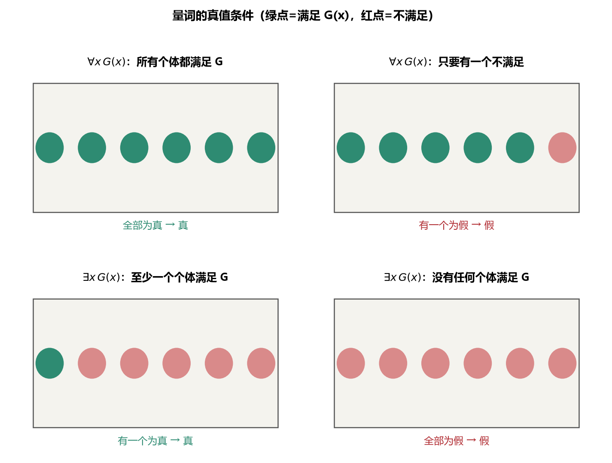
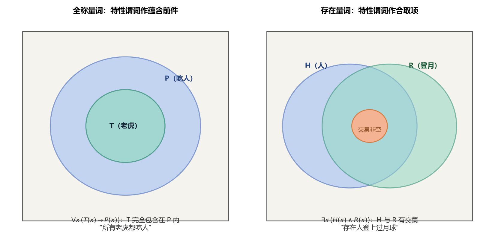
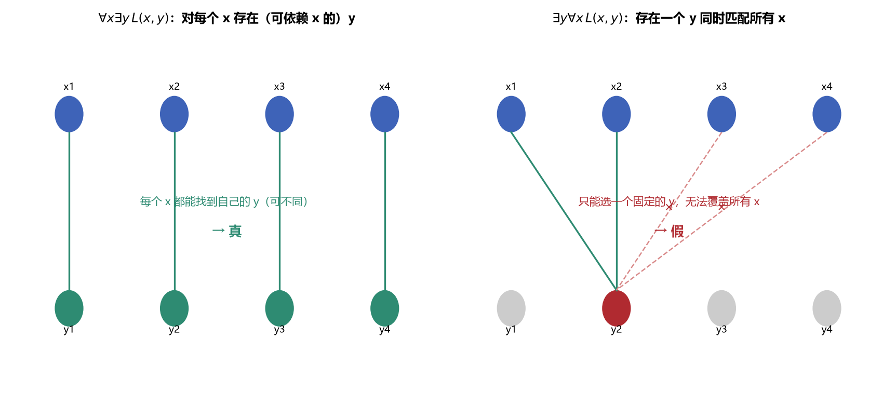
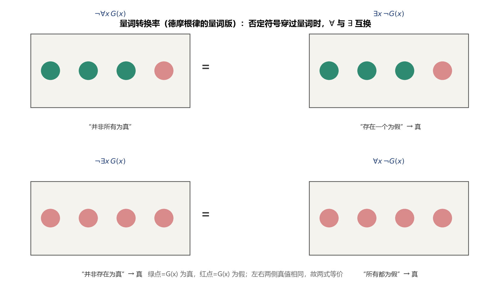

# 第3章 谓词逻辑 - 学习笔记

> 整理自 B站《【电子科技大学】《离散数学》全63讲》（BV16Btc6VEpE，up主：哔哩大学-学生中心）P16-P25
> 字幕来源：AI字幕，已核对数学逻辑

## 目录
- [1. 谓词的引入](#1-谓词的引入)
- [2. 量词](#2-量词)
- [3. 谓词符号化](#3-谓词符号化)
- [4. 谓词合式公式](#4-谓词合式公式)
- [5. 自由变元与约束变元](#5-自由变元与约束变元)
- [6. 公式解释与分类](#6-公式解释与分类)
- [7. 公式等价](#7-公式等价)
- [8. 前束范式](#8-前束范式)
- [9. 推理形式与推理规则](#9-推理形式与推理规则)
- [10. 谓词综合推理](#10-谓词综合推理)
- [11. 本节重点](#11-本节重点)

---

## 1. 谓词的引入

### 1.1 命题逻辑的局限

命题逻辑把简单命题当作不可分割的整体，导致两类问题无法处理：

1. **无法表达命题内部的逻辑关系**：苏格拉底三段论
   - 所有的人都是要死的（P）
   - 苏格拉底是人（Q）
   - 所以苏格拉底是要死的（R）
   - 命题逻辑中 $P, Q$ 无法推出 $R$（三个独立命题）

2. **无法处理含变量的句子**："$x > 3$"、"$x = y + 3$" 等，命题逻辑认为不是命题

**解决方案**：对简单命题进行分解，引入**个体词**、**谓词**和**量词**，研究个体与总体的内在联系和数量关系——这就是谓词逻辑（一阶逻辑）。

### 1.2 个体词

在原子命题中可以独立存在的客体（句子中的主语、宾语等）。

| 类型 | 定义 | 符号表示 |
|------|------|----------|
| 个体常量 | 表示具体或特定的个体 | 小写字母 $a, b, c, a_1$ 等 |
| 个体变量 | 表示抽象或泛指的个体 | 小写字母 $x, y, z, x_1$ 等 |
| 个体域（论域）$D$ | 个体变量的取值范围 | 集合，如实数集、所有人的集合 |
| 全总个体域 | 宇宙中所有可能个体构成的集合 | 默认使用（不特别说明时） |

### 1.3 谓词

用于刻画客体的性质或客体之间关系的成分。

**数学定义**：设 $D$ 为非空个体域，定义在 $D^n$ 上取值于 $\{0,1\}$ 的 $n$ 元函数，称为 **$n$ 元命题函数**或 **$n$ 元谓词**，记为 $P(x_1, x_2, \dots, x_n)$。

- 谓词用大写字母 $P, Q, R, F, G, H$ 表示
- **谓词常量**：表示具体性质或关系（如 $F(x,y)$ 表示"$x$ 是 $y$ 的父亲"）
- **谓词变量**：表示抽象或泛指的性质或关系（如 $L(x,y)$ 表示"$x$ 与 $y$ 具有关系 $L$"）

### 1.4 谓词的要点

1. **个体词顺序十分重要**，不能随意变更：$F(b,c)$（李新华是李兰的父亲）$\neq$ $F(c,b)$（李兰是李新华的父亲）
2. **一元谓词**描述个体的性质；**$n$ 元谓词**（$n \geq 2$）描述 $n$ 个个体之间的关系
3. **$P(x_1,\dots,x_n)$ 本身不是命题**，只有用谓词常量取代 $P$、用个体常量取代所有 $x_i$ 后才成为命题
4. **零元谓词**（不含个体变量的谓词，如 $F(a), G(a,b)$）当谓词为常量时就是命题——命题逻辑中的所有命题都可表示为零元谓词

---

## 2. 量词

### 2.1 两种量词

| 量词 | 符号 | 自然语言 | 真值条件 |
|------|------|----------|----------|
| 全称量词 | $\forall x$ | 所有的、任意的、一切的、每一个 | 所有个体代入后 $G(x)$ 都为真才为真；有一个为假就为假 |
| 存在量词 | $\exists x$ | 有些、至少有一个、某一些、存在 | 有一个个体使 $G(x)$ 为真就为真；所有都为假才为假 |

- $x$ 称为**作用变量**
- 量词后面紧跟的公式称为量词的**辖域**



> **图1** 量词的真值条件（自绘，绿点=满足 $G(x)$）：$\forall x\,G(x)$ 要求全部为真，$\exists x\,G(x)$ 只要一个为真。

### 2.2 特性谓词

统一个体域为全总个体域后，用**特性谓词**刻画个体变量的变化范围。

**加入规则（必须遵守）**：

| 量词类型 | 特性谓词的加入方式 | 原因 |
|----------|-------------------|------|
| 全称量词 $\forall x$ | 作为**蕴含式的前件**加入 | $\forall x\,(T(x) \rightarrow P(x))$：如果 $x$ 是老虎，则 $x$ 要吃人 |
| 存在量词 $\exists x$ | 作为**合取式的合取项**加入 | $\exists x\,(H(x) \land R(x))$：存在 $x$ 既是人又登上过月球 |

> **易错点**：全称量词的特性谓词不能用合取——$\forall x\,(T(x) \land P(x))$ 表示"所有个体既是老虎又要吃人"，含义完全不同。

> **为什么全称用→，特称用∧？（课件反例分析）**
>
> 以"这个班的每个学生都去过北京"为例：
> - 设 $C(x)$：$x$ 是这个班的学生；$B(x)$：$x$ 去过北京。
>
> **正确**：$\forall x\,(C(x) \rightarrow B(x))$
>
> 为什么不能写成 $\forall x\,(C(x) \land B(x))$？
> - 如果张三**不是**这个班的学生，那么 $C(\text{张三}) = 假$
> - 用 $\rightarrow$：$C(\text{张三}) \rightarrow B(\text{张三}) = 假 \rightarrow 假 = 真$（不影响整句真值）
> - 用 $\land$：$C(\text{张三}) \land B(\text{张三}) = 假 \land 假 = 假$（整句就变成假了）
> - 但原句只是说"这个班的学生"如何如何，**不应该**因为非本班学生而判为假
>
> 所以：**全称量词 + 特性谓词 = 蕴含式**（$C(x) \rightarrow B(x)$），非本班学生自动"豁免"，不影响真值。
>
> 反过来，特称量词为什么用 $\land$？
> - 原句"这个班有学生去过北京"：$\exists x\,(C(x) \land B(x))$
> - 如果写成 $\exists x\,(C(x) \rightarrow B(x))$：只要存在一个 $x$ 不是本班学生（$C(x)=假$），那么 $C(x) \rightarrow B(x) = 真$，整句就恒真了——这显然不对
>
> 所以：**特称量词 + 特性谓词 = 合取式**（$C(x) \land B(x)$），必须同时满足"是本班学生"和"去过北京"。



> **图2** 特性谓词加入规则（自绘）：全称量词作蕴含前件（T 完全包含于 P），存在量词作合取项（H 与 R 有交集）。

### 2.3 有限个体域时量词的展开

当个体域 $D = \{a_1, a_2, \dots, a_n\}$ 为有限集时：

$$\forall x\,G(x) = G(a_1) \land G(a_2) \land \dots \land G(a_n)$$

$$\exists x\,G(x) = G(a_1) \lor G(a_2) \lor \dots \lor G(a_n)$$

- 全称量词对应合取（所有为真才为真）
- 存在量词对应析取（有一个为真就为真）

### 2.4 量词次序

**多个量词的次序不能随意调换！**

- $\forall x \exists y\,L(x,y)$：对任意实数 $x$，都存在一个 $y$ 比 $x$ 大 → **真**
- $\exists y \forall x\,L(x,y)$：存在一个 $y$，比所有 $x$ 都大 → **假**（实数中无最大值）



> **图3** 量词次序的差异（自绘）：$\forall x \exists y$ 中 $y$ 可以随 $x$ 变化；$\exists y \forall x$ 要求同一个 $y$ 匹配所有 $x$——顺序不同含义不同。

---

## 3. 谓词符号化

### 3.1 符号化步骤

1. 找出命题联结词（否定、合取、析取、蕴含、等价）
2. 对每个简单命题，确定个体词和谓词
3. 确定量词类型（全称/存在）
4. 按规则加入特性谓词

### 3.2 典型例子

**例1**："没有人登上过木星"
- 方法一（存在量词+否定）：$\neg \exists x\,(H(x) \land M(x))$
- 方法二（全称量词）：$\forall x\,(H(x) \rightarrow \neg M(x))$
- 两种形式等价——这暗示了全称量词和存在量词之间的转换关系

**例2**："天下乌鸦一般黑"
- $\forall x \forall y\,(F(x) \land F(y) \rightarrow G(x,y))$（任选两只乌鸦，它们一般黑）
- 或等价地：$\neg \exists x \exists y\,(F(x) \land F(y) \land \neg G(x,y))$

**例3**："每个实数都存在比它大的另外的实数"
- $\forall x\,(R(x) \rightarrow \exists y\,(R(y) \land L(x,y)))$，其中 $L(x,y)$ 表示 $x < y$
- 若限定个体域为实数集：$\forall x \exists y\,L(x,y)$（简化了很多）

**例4（唯一性表述）**："每个人有且只有一个最好的朋友"
- 设 $B(x,y)$：$y$ 是 $x$ 的最好的朋友；$Inequal(x,y)$：$x$ 和 $y$ 不同
- "$y$ 是唯一的" = "对任意的 $z$，如果 $z \neq y$，则 $z$ 和 $x$ 不是最好的朋友"
- 完整符号化：$\forall x \exists y\,\left( B(x,y) \land \forall z\,\left( Inequal(z,y) \rightarrow \neg B(x,z) \right) \right)$
- 引入中级谓词"≠"（$Inequal(x,y) \triangleq x \neq y$）后可简写为：$\forall x \exists y\,(B(x,y) \land \forall z\,(z \neq y \rightarrow \neg B(x,z)))$
- 常用记号 $\exists!$ 表示"存在唯一"：$\forall x \exists! y\,B(x,y)$

**例5（喝酒者悖论）**："酒吧里存在一个人，如果他在喝酒，那么酒吧里所有人都在喝酒"
- 符号化：$\exists x\,(D(x) \rightarrow \forall y\,D(y))$
- 这是一个**永真式**（听起来很反直觉，但逻辑上成立）：
  - 如果酒吧里**没人**喝酒：任取一个人，$D(x)=假$，则 $D(x) \rightarrow \forall y D(y) = 真 \rightarrow 真 = 真$
  - 如果酒吧里**有人**喝酒：取那个喝酒的人 $x$，$D(x)=真$，$\forall y D(y)=真$，则 $真 \rightarrow 真 = 真$
- 这就是著名的"喝酒者悖论"——逻辑上永真，但直觉上很奇怪

**例6（Peano自然数公理）**：用谓词逻辑表述自然数的三条公理
- 引入函数：$succ(x)$ 表示 $x$ 的直接后继，$pred(x)$ 表示 $x$ 的直接前驱
- $A_1$：每个数都有唯一的直接后继：$\forall x \exists y\,(y = succ(x) \land \forall z\,(z = succ(x) \rightarrow y = z))$
- $A_2$：0 不是任何数的后继：$\neg \exists x\,(0 = succ(x))$
- $A_3$：除0外，每个数都有唯一的直接前驱：$\forall x\,(x \neq 0 \rightarrow \exists y\,(y = pred(x) \land \forall z\,(z = pred(x) \rightarrow y = z)))$

### 3.3 刘易斯·卡罗尔例子（《爱丽丝梦游仙境》作者）

**例**：所有狮子都是凶猛的；有些狮子不喝咖啡；有些凶猛的动物不喝咖啡。
- 限定个体域为动物，$P(x)$=$x$是狮子，$Q(x)$=$x$是凶猛的，$R(x)$=$x$喝咖啡
- $\forall x\,(P(x) \rightarrow Q(x))$
- $\exists x\,(P(x) \land \neg R(x))$
- $\exists x\,(Q(x) \land \neg R(x))$

---

## 4. 谓词合式公式

### 4.1 四类符号

| 符号类型 | 含义 | 值域 |
|----------|------|------|
| 常量符号 | 个体域 $D$ 内的某个特定元素 | $D$ |
| 变量符号 | 个体域 $D$ 内的任意元素 | $D$ |
| 函数符号 | $D^n \rightarrow D$ 的函数 | $D$（个体） |
| 谓词符号 | $D^n \rightarrow \{0,1\}$ 的谓词 | $\{0,1\}$（真值） |

> **函数 vs 谓词**：函数的值域是个体域（返回一个个体），谓词的值域是 $\{0,1\}$（返回真值）。
>
> 例："周红的父亲是教授"
> - 用函数：$f(x)$=$x$的父亲，$P(x)$=$x$是教授 → $P(f(c))$（简洁）
> - 不用函数：$F(x,y)$=$x$是$y$的父亲 → $\forall x\,(F(x,c) \rightarrow P(x))$（繁琐）

### 4.2 项的递归定义

1. 任意常量符号或变量符号是项
2. 若 $f$ 是 $n$ 元函数符号，$t_1,\dots,t_n$ 是项，则 $f(t_1,\dots,t_n)$ 是项
3. 有限次使用以上规则得到的是项

### 4.3 原子谓词公式

若 $P$ 是 $n$ 元谓词符号，$t_1,\dots,t_n$ 是项，则 $P(t_1,\dots,t_n)$ 为**原子谓词公式**。

### 4.4 合式公式的递归定义

1. 原子公式是合式公式
2. 若 $G, H$ 是合式公式，则 $\neg G, G \land H, G \lor H, G \rightarrow H, G \leftrightarrow H$ 也是
3. 若 $G$ 是合式公式，$x$ 是个体变量，则 $\forall x\,G, \exists x\,G$ 也是
4. 有限次使用以上规则得到的是合式公式

### 4.5 书写约定

1. 公式最外层括号可省略
2. 量词后括号：若辖域仅含一个原子公式，外层括号可省略；否则不能省略
3. 一个个体词最多接受一个量词的约束（$\forall x \exists x\,P(x,y)$ 无意义）

---

## 5. 自由变元与约束变元

### 5.1 基本概念

- **量词的辖域**：量词后面紧跟的公式范围
  - 量词后有括号：括号内的子公式是辖域
  - 量词后无括号：直接连接的子公式是辖域
- **约束出现**：变元 $x$ 出现在使用 $x$ 的量词的辖域内
- **自由出现**：变元的出现不是约束出现
- **约束变元**：约束出现的变元
- **自由变元**：自由出现的变元

### 5.2 改名规则与代入规则

| 规则 | 对象 | 要求 |
|------|------|------|
| **约束变元改名规则** | 约束变元 | ①量词中的变元和辖域中所有约束出现都要替换；②新变元名不能与辖域中其他变量重名 |
| **自由变元代入规则** | 自由变元 | ①公式中该自由变元的每一处都要替换；②新变元名不能在原公式中以约束形式出现；③可用个体常量代入（但代入后公式含义改变） |

### 5.3 闭式

不包含任何自由变元的合式公式称为**封闭的合式公式**，简称**闭式**。

- 只有闭式才能对应一个命题（所有变元都被量词约束或为常量）
- 非闭式（含自由变元）不是命题，如 $x=0$ 中 $x$ 是自由变元

---

## 6. 公式解释与分类

### 6.1 谓词公式的解释

谓词公式的解释由四部分构成：
1. 指定非空个体域 $D$
2. 指定常量符号为 $D$ 中哪个元素
3. 指定函数符号为 $D^n \rightarrow D$ 的特定函数
4. 指定谓词符号为 $D^n \rightarrow \{0,1\}$ 的特定谓词

> 与命题公式不同：命题变元只有2种取值，可列真值表；谓词公式的个体域和谓词解释有无穷多种，**不存在真值表**。

### 6.2 公式分类

| 类型 | 定义 | 对应命题逻辑 |
|------|------|-------------|
| **有效公式** | 在所有解释下都取值为真 | 永真公式（重言式） |
| **矛盾公式** | 在所有解释下都取值为假 | 永假公式（矛盾式） |
| **可满足公式** | 至少有一种解释使其为真 | 可满足公式 |

> 不叫"永真公式"而叫"有效公式"，因为无法列出真值表逐一验证，只能从逻辑上证明有效性。

### 6.3 可判定性

- **命题逻辑是可判定的**（真值表方法）
- **谓词逻辑一般是不可判定的**（解释无穷多，无法穷举）
- 特殊情况可判定：①只含一元谓词变项的公式；②特定形式的公式；③个体域有限时

---

## 7. 公式等价

### 7.1 定义

若 $G \leftrightarrow H$ 是有效公式，则称 $G$ 与 $H$ 等价，记为 $G = H$。

> **对偶原理（课件补充）**
>
> 设 $G$ 是一个仅含有 $\forall, \exists, \neg, \land, \lor$ 运算符号的公式。$G$ 的对偶公式 $G^*$ 是把 $G$ 中的：
> - $\lor$ 与 $\land$ 互换
> - $\forall$ 与 $\exists$ 互换
> - $\top$ 与 $\bot$ 互换
>
> 得到的公式（保持原来的运算关系不变）。
>
> **对偶定理**：
> - 若 $F \Leftrightarrow G$，则 $F^* \Leftrightarrow G^*$
> - 若 $F \Rightarrow G$，则 $G^* \Rightarrow F^*$（注意方向反转）
>
> **例子**：
> - $\forall x\,P(x) \lor \forall x\,Q(x) \Rightarrow \forall x\,(P(x) \lor Q(x))$
> - 对偶式（方向反转）：$\exists x\,(P(x) \land Q(x)) \Rightarrow \exists x\,P(x) \land \exists x\,Q(x)$
> - 这正好对应了"∀对∨不可分配"和"∃对∧不可分配"的两个方向——它们互为对偶。

### 7.2 命题等价公式的沿用

通过**代入实例**（将命题变元替换为谓词公式）可证明：命题逻辑中的24个基本等价公式在谓词逻辑中依然成立。

### 7.3 谓词特有的基本等价公式

设 $G(x), H(x)$ 只含自由变元 $x$，$S$ 不含 $x$。

| 编号 | 名称 | 公式 |
|------|------|------|
| E25/E26 | 改名规则 | $\exists x\,G(x) = \exists y\,G(y)$，$\forall x\,G(x) = \forall y\,G(y)$ |
| E27/E28 | **量词转换率** | $\neg \exists x\,G(x) = \forall x\,\neg G(x)$，$\neg \forall x\,G(x) = \exists x\,\neg G(x)$ |
| E29-E32 | 量词辖域扩张与收缩 | $\forall x\,G(x) \lor S = \forall x\,(G(x) \lor S)$ 等4条（$S$ 不含 $x$） |
| E33/E34 | **量词分配率** | $\forall x\,(G(x) \land H(x)) = \forall x\,G(x) \land \forall x\,H(x)$；$\exists x\,(G(x) \lor H(x)) = \exists x\,G(x) \lor \exists x\,H(x)$ |



> **图4** 量词转换率（自绘，绿点=$G(x)$ 为真）：否定符号穿过量词时 $\forall$ 与 $\exists$ 互换，左右两侧真值相同。

> **量词分配率注意**：
> - 全称量词**只对合取**可分配，对析取**不可**分配
> - 存在量词**只对析取**可分配，对合取**不可**分配
> - 不可分配时需先改名再扩张辖域：$\forall x\,G(x) \lor \forall x\,H(x) = \forall x \forall y\,(G(x) \lor H(y))$
>
> **为什么 ∀ 对 ∨ 和 ∃ 对 ∧ 不能分配？（课件反例）**
>
> 设论域为自然数集，$P(x)$：$x$ 是偶数，$Q(x)$：$x$ 是奇数。
>
> 1. **$\forall x\,(P(x) \lor Q(x))$**：每个数要么是偶数要么是奇数 → **真**（自然数非奇即偶）
> 2. **$\forall x\,P(x) \lor \forall x\,Q(x)$**：所有数都是偶数，或者所有数都是奇数 → **假**（既有偶数也有奇数）
>
> 所以 $\forall x\,(P(x) \lor Q(x)) \neq \forall x\,P(x) \lor \forall x\,Q(x)$——**∀ 对 ∨ 不可分配**。
>
> 反过来：
> 1. **$\exists x\,(P(x) \land Q(x))$**：存在一个数既是偶数又是奇数 → **假**（没有这样的数）
> 2. **$\exists x\,P(x) \land \exists x\,Q(x)$**：存在偶数，也存在奇数 → **真**
>
> 所以 $\exists x\,(P(x) \land Q(x)) \neq \exists x\,P(x) \land \exists x\,Q(x)$——**∃ 对 ∧ 不可分配**。
>
> **记忆口诀**：**∀ 只管 ∧，∃ 只管 ∨**（全称找合取，特称找析取）。

### 7.4 多量词的交换

- 同类型量词可交换：$\forall x \forall y\,G(x,y) = \forall y \forall x\,G(x,y)$
- 同类型量词可交换：$\exists x \exists y\,G(x,y) = \exists y \exists x\,G(x,y)$
- **不同类型量词不可交换**（$\forall x \exists y \neq \exists y \forall x$）

### 7.5 量词否定的应用：极限与发散（课件重点）

**极限的 $\varepsilon$-$\delta$ 定义**：

> 对任意的 $\varepsilon > 0$，存在 $\delta > 0$，使得对任意的 $x$，当 $0 < |x - x_0| \leqslant \delta$ 时，有 $|f(x) - f(x_0)| \leqslant \varepsilon$。

符号化：
$$\forall \varepsilon \exists \delta \forall x\, \left( (0 < |x - x_0| \leqslant \delta) \rightarrow |f(x) - f(x_0)| \leqslant \varepsilon \right)$$

**发散的定义**（极限不存在）——就是把极限定义整个否定：

$$\neg \left( \forall \varepsilon \exists \delta \forall x\, \left( (0 < |x - x_0| \leqslant \delta) \rightarrow |f(x) - f(x_0)| \leqslant \varepsilon \right) \right)$$

用量词转换率逐层否定：

$$\Leftrightarrow \exists \varepsilon \neg \exists \delta \forall x\, \left( (0 < |x - x_0| \leqslant \delta) \rightarrow |f(x) - f(x_0)| \leqslant \varepsilon \right)$$

$$\Leftrightarrow \exists \varepsilon \forall \delta \neg \forall x\, \left( \neg(0 < |x - x_0| \leqslant \delta) \lor |f(x) - f(x_0)| \leqslant \varepsilon \right)$$

$$\Leftrightarrow \exists \varepsilon \forall \delta \exists x\, \left( (0 < |x - x_0| \leqslant \delta) \land |f(x) - f(x_0)| > \varepsilon \right)$$

**翻译成白话**：
> 存在一个 $\varepsilon > 0$，对任意的 $\delta > 0$，都存在某个 $x$，使得 $0 < |x - x_0| \leqslant \delta$ 且 $|f(x) - f(x_0)| > \varepsilon$。

> **一句话总结**：否定符号从左往右穿过量词时，**∀ 和 ∃ 互换**，最后否定落在最里面的不等式上。这就是"极限不存在"的严格逻辑定义。

---

## 8. 前束范式

### 8.1 定义

公式 $G$ 是**前束范式**，当且仅当：
1. 一切量词都位于公式的最前端
2. 量词之间不含否定词
3. 量词的辖域延伸到公式末端

标准形式：

$$Q_1 x_1 Q_2 x_2 \dots Q_n x_n\,M(x_1, x_2, \dots, x_n)$$

其中每个 $Q_i$ 是 $\forall$ 或 $\exists$，$M$ 称为**母式**（不含任何量词）。

### 8.2 求解三步法

1. **消去**蕴含和等价联结词：$G \rightarrow H = \neg G \lor H$，$G \leftrightarrow H = (\neg G \lor H) \land (\neg H \lor G)$
2. **否定内移**：用量词转换率（$\neg \forall \rightarrow \exists \neg$，$\neg \exists \rightarrow \forall \neg$）+ 德摩根律 + 双重否定律，将否定符号移到原子公式前端
3. **量词前移**：用改名规则（避免重名）+ 量词分配率 + 量词辖域扩张，将所有量词移到最前端

---

## 9. 推理形式与推理规则

### 9.1 推理形式

设 $H_1, H_2, \dots, H_n, C$ 是公式，称 $C$ 是 $H_1, H_2, \dots, H_n$ 的有效结论（Valid Consequence），当且仅当：对任意的指派 $I$，如果 $H_1 \land H_2 \land \dots \land H_n$ 在 $I$ 下为 $1$，则 $C$ 在 $I$ 下也为 $1$。记为 $H_1, H_2, \dots, H_n \vdash C$。

命题逻辑中的基本蕴含公式 $I_1$-$I_{11}$ 在谓词逻辑中仍成立（代入实例）。

> **有效结论的 7 个等价条件（课件总结）**
>
> 以下说法彼此等价，可以互相转换：
> 1. $H_1, H_2, \dots, H_n \vdash C$（$C$ 是有效结论）
> 2. $(H_1 \land H_2 \land \dots \land H_n) \rightarrow C$ 是重言式（永真式）
> 3. $(H_1 \land H_2 \land \dots \land H_n) \Rightarrow C$（永真蕴含）
> 4. $\neg \left( (H_1 \land H_2 \land \dots \land H_n) \rightarrow C \right)$ 是矛盾式（永假式）
> 5. $H_1 \land H_2 \land \dots \land H_n \land \neg C$ 是矛盾式（这就是**反证法**的逻辑基础）
> 6. $H_1 \land H_2 \land \dots \land H_n \land \neg C \Rightarrow F$（永假）
> 7. $(H_1 \land H_2 \land \dots \land H_n \rightarrow C) \Rightarrow \top$（永真）
>
> **最常用的两个转换**：
> - **反证法**：要证 $H \vdash C$，等价于证 $H \land \neg C$ 是矛盾式
> - **CP 规则**：要证 $H \vdash (A \rightarrow C)$，等价于证 $H \land A \vdash C$（把前件 $A$ 加入前提）

### 9.2 四条量词推理规则

| 规则 | 名称 | 形式 | 关键注意事项 |
|------|------|------|-------------|
| **US** | 全称特指（消去全称） | $\forall x\,G(x) \Rightarrow G(y)$ 或 $G(c)$ | $y$ 不能在 $G(x)$ 中约束出现；$c$ 为任意个体常量 |
| **ES** | 存在特指（消去存在） | $\exists x\,G(x) \Rightarrow G(c)$ | $c$ 必须是使 $G(c)$ 为真的**特定**个体常量；若 $G(x)$ 含其他自由变元，须用关于这些变元的函数取代 $c$ |
| **UG** | 全称推广（添加全称） | $G(y) \Rightarrow \forall x\,G(x)$ | $y$ 是变量且对所有个体成立；$G(y)$ 中不能有 $x$ |
| **EG** | 存在推广（添加存在） | $G(c) \Rightarrow \exists x\,G(x)$ 或 $G(y) \Rightarrow \exists x\,G(x)$ | 替换的变元不能在 $G(c)$/$G(y)$ 中已出现 |

> **ES规则的函数形式**：如 $\forall x \exists y\,G(x,y)$，用US得 $\exists y\,G(z,y)$，再用ES时不能写 $G(z,c)$（$c$ 是常量，不随 $z$ 变），而应写 $G(z, f(z))$（$f(z)$ 是关于 $z$ 的函数，随 $z$ 变化）。

> **US/ES/UG/EG 四大易错点（课件重点）**
>
> **易错点1：US 规则的辖域必须是整个公式**
> - 正确：$\forall x\,P(x) \rightarrow Q \vdash P(y) \rightarrow Q$（US 作用于整个 $\forall x\,P(x)$）
> - 错误：$\forall x\,P(x) \rightarrow Q \vdash P(y) \rightarrow Q$（如果 $\forall x$ 的辖域只是 $P(x)$，那它不是整个公式，不能直接 US）
> - 口诀：**量词辖域 = 整个公式**，不能只套住半个式子。
>
> **易错点2：ES 引入的常量必须是全新的**
> - 正确：$\exists x\,P(x) \vdash P(c)$（$c$ 是新引入的常量，之前没出现过）
> - 错误：如果之前已经用过 $c$（比如 $P(c)$ 已经出现过），再用 ES 得到的 $P(c)$ 就可能和之前的冲突
> - 口诀：**ES 的 $c$ 必须是新面孔**，不能是推导过程中已经出现过的常量。
>
> **易错点3：ES 之后不能再用 UG 推广 ES 引入的变量**
> - 经典反例：$\forall x \exists y\,F(x,y)$ 想推出 $\exists y \forall x\,F(x,y)$
>   1. $\forall x \exists y\,F(x,y)$ （P）
>   2. $\exists y\,F(z,y)$ （①+US，$z$ 是任意变量）
>   3. $F(z, c_z)$ （②+ES，$c_z$ 依赖于 $z$）
>   4. $\forall x\,F(x, c_z)$ （③+UG）← **错误！**
>   5. $\exists y \forall x\,F(x, y)$ （④+EG）
> - 为什么错？因为 ES 引入的 $c_z$ 是**依赖于** $z$ 的（$c_z = f(z)$），不是固定常量。你不能对一个"依赖于 $z$ 的东西"再做 UG（全称推广）。
> - 口诀：**US + ES 之后，ES 引入的常量不能再用 UG**。
>
> **易错点4：UG 推广的变量必须不受前提约束**
> - 正确：如果 $P(x)$ 是从前提推导出来的，且 $x$ 在前提中没有被约束（前提中 $x$ 是自由变量），才能用 UG 推出 $\forall x\,P(x)$
> - 错误：如果 $x$ 是通过 ES 引入的特定常量，或者 $x$ 在前提中已经被约束了，就不能用 UG
> - 口诀：**UG 只推广"任意性"的变量，不推广"特定性"的常量**。

---

## 10. 谓词综合推理

### 10.1 三步走策略

1. **消去量词**：用US和ES规则（注意：既要用US又要用ES且用同一个体符号时，**必须先用ES再用US**——因为ES对个体常量有特定要求，US可以任意选择）
2. **命题推理**：消去量词后，使用命题演算中的推理规则（P/T/CP规则、基本蕴含/等价公式）
3. **添加量词**：用UG或EG规则得到结论

### 10.2 关键注意事项

1. **ES先于US**：当需要用同一个体符号时，先ES确定特定常量，再US用同一常量代入
2. **ES消去的变元**只能得到常量形式，添加量词时只能用EG（不能用UG）
3. **US消去的变元**可用常量或变量，添加量词时可用EG或UG
4. 用US/ES消去量词时，量词必须位于公式最前端且辖域为整个公式
5. 添加量词时，选用的变元不能在公式中已出现

### 10.3 CP规则与反证法

- **CP规则**：结论是蕴含式（或可转化为蕴含式的析取式）时，将前件作为附加前提
- **反证法**：将结论的否定加入前提，推出矛盾（$R \land \neg R$）

### 10.4 苏格拉底三段论证明

前提：$\forall x\,(H(x) \rightarrow M(x))$，$H(s)$；结论：$M(s)$

```
1.  ∀x(H(x)→M(x))    P
2.  H(s)→M(s)         US(1)    （用常量s替换x）
3.  H(s)              P
4.  M(s)              T(2)(3) I （假言推理）
```

> 常见错误：第2步用变量 $y$ 替换得 $H(y) \rightarrow M(y)$，则无法与 $H(s)$ 配合假言推理——必须用同一个体常量 $s$。

---

## 11. 本节重点

> **本节重点**：
> - **要点1**：谓词逻辑解决命题逻辑的两大局限——无法表达命题内部关系（苏格拉底三段论）和无法处理含变量句子
> - **要点2**：个体词（常量/变量/个体域）+ 谓词（$n$元命题函数，值域{0,1}）+ 量词（∀/∃）；函数值域是个体域，谓词值域是真值
> - **要点3**：特性谓词加入规则——全称量词作蕴含前件，存在量词作合取项，不能搞反
> - **要点4**：量词次序不能随意调换（∀x∃y ≠ ∃y∀x）；同类型量词可交换
> - **要点5**：约束变元vs自由变元；改名规则（约束）和代入规则（自由）的区别；闭式（无自由变元）才是命题
> - **要点6**：谓词公式无真值表（解释无穷多）；有效公式/矛盾公式/可满足公式；谓词逻辑一般不可判定
> - **要点7**：量词转换率 $\neg\forall x = \exists x\neg$、$\neg\exists x = \forall x\neg$；量词分配率（全称对合取、存在对析取）
> - **要点8**：前束范式三步法——消去→↔、否定内移、量词前移
> - **要点9**：四条量词推理规则US/ES/UG/EG及注意事项；ES的函数形式（自由变元存在时用函数代替常量）
> - **要点10**：综合推理三步走——消量词（ES先于US）→命题推理→加量词；CP规则和反证法同样适用
> - **常见坑**：US用变量替换后无法与特定常量前提配合；ES后只能EG不能UG；量词不在最前端时不能直接US/ES
