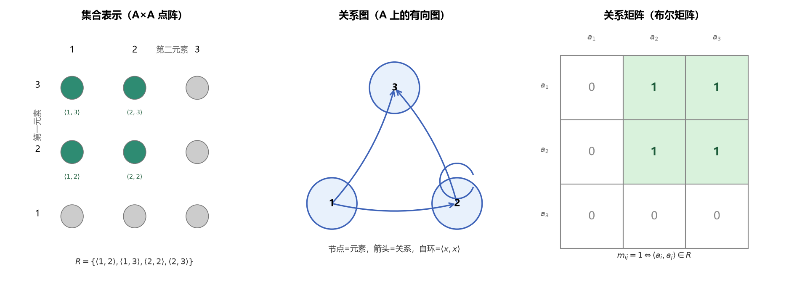
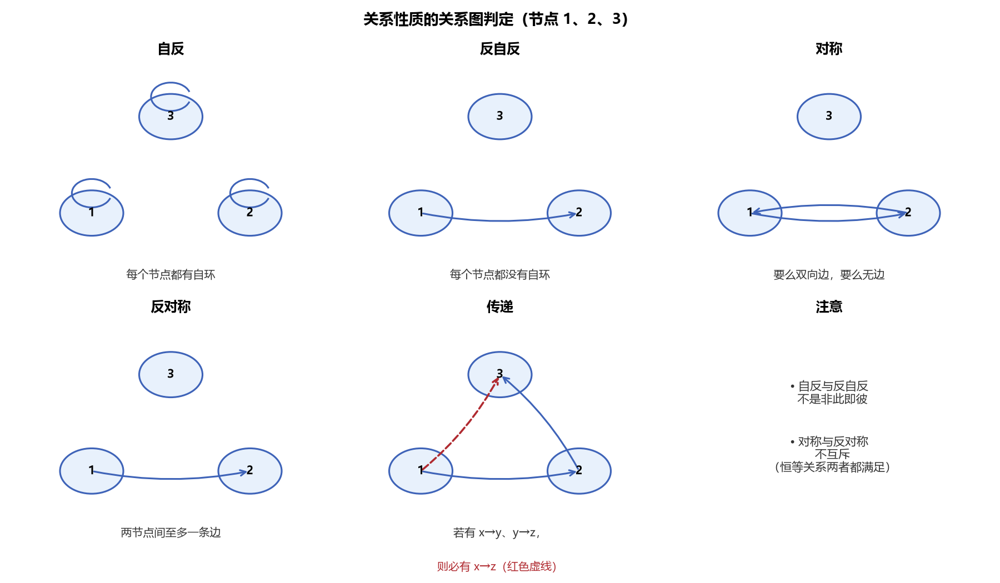
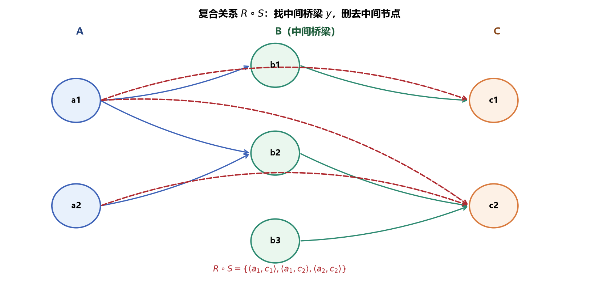
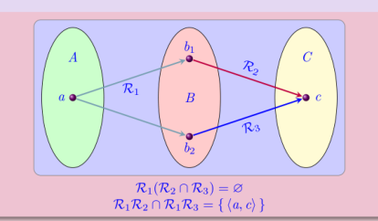
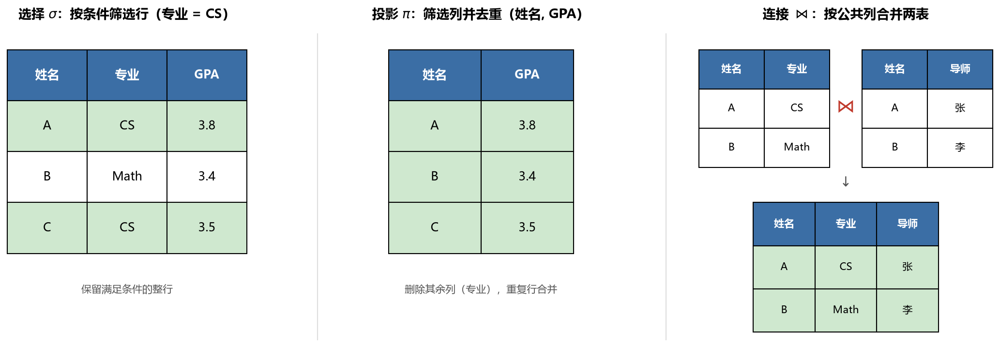
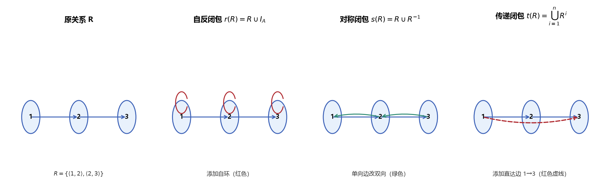
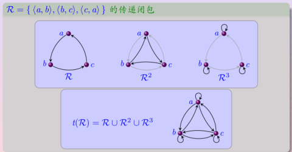
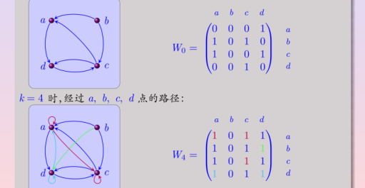

# 第4章 关系 - 学习笔记

> **主线**：Kenneth H. Rosen《离散数学及其应用（原书第8版）》第9章（9.1–9.4）
> **插图与补充**：武汉大学《关系》课件、电子科技大学《离散数学》课程（BV16Btc6VEpE）P26–P34
> 凡课件、视频与教材表述不一致处，以教材为准。

> **目录**
>
> - [[#1. 序偶与笛卡尔积]]
> - [[#2. 关系的基本概念]]
> - [[#3. 关系的性质]]
> - [[#4. 关系的表示]]
> - [[#5. 关系的运算与定律]]
> - [[#6. 关系的幂]]
> - [[#7. n元关系与关系数据库]]
> - [[#8. 关系的闭包]]
> - [[#9. 本节重点]]

---

## 1. 序偶与笛卡尔积

### 1.1 序偶

由两个元素按照一定次序组成的二元组，称为**序偶**（有序对），记作 $\langle x, y \rangle$。

- $x$ 称为第一元素，$y$ 称为第二元素。
- **序偶相等**：

$$\langle a, b \rangle = \langle c, d \rangle \iff a = c \text{ 且 } b = d$$

- 序偶强调次序，两个元素一般不能交换。例如“甲是乙的父亲”这一关系调换次序后含义完全不同。

### 1.2 笛卡尔积

设 $A, B$ 是两个集合，称集合

$$A \times B = \{\langle x, y \rangle \mid x \in A \text{ 且 } y \in B\}$$

为 $A$ 与 $B$ 的**笛卡尔积**（直积）。

笛卡尔积具有下列性质：

1. **一般不满足交换律**：$A \times B \neq B \times A$，除非 $A = B$ 或其中至少一个为空集。
2. **为空的条件**：

$$A \times B = \varnothing \iff A = \varnothing \text{ 或 } B = \varnothing$$

3. **不满足结合律**：$A \times (B \times C) \neq (A \times B) \times C$，因为两者的元素分别是 $\langle a,\langle b,c\rangle\rangle$ 与 $\langle\langle a,b\rangle,c\rangle$，结构不同。
4. **基数**：若 $|A|=m,\ |B|=n$，则 $|A \times B| = mn$。
5. **对并、交满足分配律**：

$$A \times (B \cup C) = (A \times B) \cup (A \times C)$$

$$A \times (B \cap C) = (A \times B) \cap (A \times C)$$

### 1.3 n重有序组与n元笛卡尔积

- $n$ 个元素按一定次序组成的组称为 **$n$ 重有序组**（$n$ 元组），记作 $\langle a_1, a_2, \dots, a_n \rangle$。
- $n$ 个集合的笛卡尔积为

$$A_1 \times A_2 \times \cdots \times A_n = \{\langle a_1,\dots,a_n\rangle \mid a_i \in A_i\}$$

- 当 $A_1 = A_2 = \cdots = A_n = A$ 时，简记为 $A^n$。

---

## 2. 关系的基本概念

### 2.1 二元关系

设 $A, B$ 为两个集合，称笛卡尔积 $A \times B$ 的任意子集 $R$ 为**从 $A$ 到 $B$ 的二元关系**，简称**关系**：

$$R \subseteq A \times B$$

- $A$ 称为关系 $R$ 的**前域**，$B$ 称为**后域**。
- 若 $\langle x, y \rangle \in R$，记作 $xRy$，读作“$x$ 与 $y$ 有关系 $R$”；若 $\langle x, y \rangle \notin R$，记作 $x\not{R}y$。

关系是集合，因此关系可以用集合的一切方式描述，也满足集合的全部运算规律；但由于关系的元素是序偶，它还具有一般集合所没有的特殊性质（如复合、逆、幂）。

**两个关系相等**。关系既然是序偶组成的集合，两个关系相等就完全等同于它们在集合意义下相等，不需要新的判据。具体地，关系 $R_1$ 与 $R_2$ 相等，当且仅当：

1. 两者**定义在相同的集合上**——前域、后域相同，即它们是同一个笛卡尔积 $A\times B$ 的子集；
2. 两者所含的序偶完全相同，即 $\langle x,y\rangle\in R_1\iff\langle x,y\rangle\in R_2$。

第一条保证两个关系处在同一个"论域空间"中（否则像"学生上的室友关系"与"课程上的先修关系"根本无从比较），第二条就是集合相等的外延公理。严格地说，只要序偶完全相同，论域就由这些序偶自动确定，所以第一条是隐含的；把它单列出来，是为了先限定讨论范围、再比较成员。

### 2.2 集合A上的关系

当 $A = B$ 时，称 $R \subseteq A \times A$ 为 **$A$ 上的二元关系**。$A$ 上的关系是 $A^2$ 的子集，这是本章研究的重点。

更一般地，$R \subseteq A_1 \times A_2 \times \cdots \times A_n$ 称为 $n$ 元关系；当 $n = 1$ 时 $R \subseteq A$，关系退化为普通集合。

### 2.3 三种特殊关系

设 $R$ 是 $A$ 上的关系，下列三种关系最为基本：

| 关系 | 定义 | 记法 |
|------|------|------|
| 空关系 | 不含任何序偶，$R = \varnothing$ | $\varnothing$ |
| 全关系 | 包含全部序偶，$R = A \times A$ | $E_A$ |
| 恒等关系 | 只含 $\langle x,x\rangle$，$R=\{\langle x,x\rangle\mid x\in A\}$ | $I_A$ |

恒等关系 $I_A$ 又称**对角关系**，教材记作 $\Delta$。

### 2.4 关系的数量

从 $A$ 到 $B$ 的关系就是 $A \times B$ 的子集。若 $|A|=m,\ |B|=n$，则 $A \times B$ 有 $mn$ 个元素，从而不同关系的个数为

$$2^{mn}$$

特别地，$n$ 元素集合 $A$ 上的关系共有 $2^{n^2}$ 个。例如 $A=\{a,b,c\}$ 上有 $2^{9}=512$ 个关系。

### 2.5 定义域、值域、域

设 $R$ 是从 $A$ 到 $B$ 的关系：

- **定义域**：

$$\operatorname{dom}(R) = \{x \in A \mid \exists\, y \in B,\ \langle x,y \rangle \in R\}$$

- **值域**：

$$\operatorname{ran}(R) = \{y \in B \mid \exists\, x \in A,\ \langle x,y \rangle \in R\}$$

- **域**：$\operatorname{fld}(R) = \operatorname{dom}(R) \cup \operatorname{ran}(R)$。

定义域由所有作为序偶第一元素出现的成员构成，值域由所有作为第二元素出现的成员构成。例如在自然数集上，小于关系“$<$”的定义域为 $\mathbb{N}$，值域为 $\mathbb{N}-\{0\}$；并且 $\operatorname{dom}(R)=\varnothing \iff R=\varnothing$。

### 2.6 函数作为关系

设 $f:A \to B$ 是一个函数，其图像为

$$\{\langle a, f(a)\rangle \mid a \in A\}$$

它是 $A \times B$ 的子集，因而是一个从 $A$ 到 $B$ 的关系，并且具有特殊性质：**$A$ 中每个元素恰好是其中一个序偶的第一元素**。

反过来，若关系 $R \subseteq A \times B$ 满足 $A$ 中每个元素恰好作为一个序偶的第一元素出现，则 $R$ 就确定了一个函数。

因此，函数是一种特殊的关系：一般关系可以表达“一对多”的联系（一个城市属于唯一州，但一个州含多个城市），而函数要求定义域中每个元素恰有一个对应值。关系是函数的推广（函数将在第6章专门讨论）。

---

## 3. 关系的性质

下面均设 $R$ 是集合 $A$ 上的关系。关系最重要的分类特征有五种。

### 3.1 五种性质的定义

| 性质 | 定义 | 典型例子 |
|------|------|----------|
| **自反性** | $\forall x \in A,\ \langle x,x \rangle \in R$ | $\leq$、$\geq$、$=$、整除、$\subseteq$ |
| **反自反性** | $\forall x \in A,\ \langle x,x \rangle \notin R$ | $<$、$>$、真包含、父子关系 |
| **对称性** | $\langle x,y \rangle \in R \Rightarrow \langle y,x \rangle \in R$ | $=$、$\leftrightarrow$、朋友关系、同余 |
| **反对称性** | $\langle x,y \rangle,\langle y,x \rangle \in R \Rightarrow x = y$ | $\leq$、$\geq$、$\subseteq$、整除 |
| **传递性** | $\langle x,y\rangle,\langle y,z\rangle\in R\Rightarrow\langle x,z\rangle\in R$ | $\leq$、$<$、$=$、$\subseteq$、整除、同余 |

### 3.2 关于五种性质的重要说明

- **自反与反自反并非非此即彼**。若 $A$ 中部分元素有自环、部分没有，则关系既不是自反的也不是反自反的。例如在 $\{1,2\}$ 上，$R=\{\langle1,1\rangle\}$ 既非自反也非反自反。
- **对称与反对称也并非互相矛盾**。恒等关系 $I_A$ 既是对称的又是反对称的；空关系同时满足对称、反对称、传递。也存在两者都不满足的关系。
- 一个含有 $\langle x,y\rangle$（$x\neq y$）的关系，不可能同时是对称的和反对称的。
- **反对称性的含义**：当 $x\neq y$ 时，$\langle x,y\rangle$ 与 $\langle y,x\rangle$ 至多有一个属于 $R$。
- **空真（vacuous truth）**：五种性质都用蕴含式表述。当不存在满足前件的序偶时，蕴含式前件为假、整个命题为真。因此空关系满足对称、反对称、传递；在空集上，空关系甚至是自反的。
- 五种性质中，自反性与反自反性互相对立（非空集合上不能同时成立），而对称性与反对称性并不对立。

- **自反性的作用**：自反性首先把关系分成"允许两端相同"（$\leq$、$=$、整除、$\subseteq$）与"要求严格不同"（$<$、$>$）两类。更重要的是，它是后两类核心关系的必要前提——自反、对称、传递共同定义**等价关系**（用于分类），自反、反对称、传递共同定义**偏序关系**（用于排序，见第5章）。在图论中，约定每个顶点到自身有一条长度为 0 的路径（即可达关系自反），能让传递闭包与 Warshall 算法的公式统一处理。

---

## 4. 关系的表示

关系有三种等价的表示方法：集合表示、关系矩阵、关系图。



> **图1** 同一关系 $R=\{\langle1,2\rangle,\langle1,3\rangle,\langle2,2\rangle,\langle2,3\rangle\}$ 的三种表示对照：集合（点阵）、关系图、关系矩阵，三者信息完全等价。

### 4.1 集合表示法

- **枚举法**：$R=\{\langle1,1\rangle,\langle1,2\rangle,\langle2,2\rangle,\dots\}$。

例如 $B=\{1,2,4\}$ 上的整除关系（$x\mid y$ 表示 $x$ 整除 $y$），用枚举法写为

$$R=\{\langle1,1\rangle,\langle1,2\rangle,\langle1,4\rangle,\langle2,2\rangle,\langle2,4\rangle,\langle4,4\rangle\}$$

其中 $\langle2,4\rangle$ 在（$2\mid4$）而 $\langle4,2\rangle$ 不在（$4\nmid2$）。这正是叙述法 $R=\{\langle x,y\rangle\mid x,y\in B,\ x\mid y\}$ 展开后的完整结果。
- **叙述法**：$R=\{\langle x,y\rangle\mid x,y\in\mathbb{R},\ x=y\}$。

关系（作为集合）也可以用**归纳定义法**给出。例如定义非负整数上的关系

$$R=\{\langle x,y\rangle\mid x,y\in\mathbb{N},\ 2\mid(x-y)\}$$

- **基础**：$\langle0,0\rangle\in R$；
- **归纳**：若 $\langle x,y\rangle\in R$，则 $\langle x+1,y+1\rangle$、$\langle x+2,y\rangle$、$\langle x,y+2\rangle$ 均属于 $R$。

### 4.2 关系矩阵

设 $A=\{a_1,\dots,a_m\}$，$B=\{b_1,\dots,b_n\}$，关系 $R$ 的**关系矩阵**（邻接矩阵）$M_R=(m_{ij})_{m\times n}$ 定义为

$$m_{ij} = \begin{cases} 1, & a_i R b_j \\ 0, & a_i \not{R} b_j \end{cases}$$

关系矩阵是元素只取 $0,1$ 的**布尔矩阵**。定义在同一集合上的关系其矩阵为方阵。

要注意关系本身与关系矩阵的区别：关系的元素是序偶 $\langle x,y\rangle$，并不是 0、1；0、1 是关系在矩阵（或特征函数）这一表示层上的取值。事实上，任何关系都可以用它的**特征函数**

$$\chi_R:A\times B\to\{0,1\},\qquad \chi_R(x,y)=1\iff\langle x,y\rangle\in R$$

来刻画，关系矩阵正是把这个函数在有限集合上的取值逐格排成表格。所以"0/1"描述的是表示，关系本体始终是序偶的集合。

布尔矩阵支持下列运算：

| 运算 | 定义 | 对应逻辑 |
|------|------|----------|
| 并 $A\lor B$ | $c_{ij}=a_{ij}\lor b_{ij}$（有1则1） | 析取 |
| 交 $A\land B$ | $c_{ij}=a_{ij}\land b_{ij}$（全1则1） | 合取 |
| 布尔积 $A\odot B$ | $c_{ij}=\bigvee_k(a_{ik}\land b_{kj})$ | 乘法换合取，加法换析取 |

布尔积与普通矩阵乘法形式相同，只是把普通乘法换成逻辑合取、加法换成逻辑析取。

### 4.3 关系图

- **从 $A$ 到 $B$ 的关系**：将 $A,B$ 的元素都画成顶点，$a_iRb_j$ 时从 $a_i$ 向 $b_j$ 画有向边。
- **$A$ 上的关系**：只把 $A$ 的元素画成顶点，$a_iRa_j$ 时画有向边；$a_iRa_i$ 时画一条从顶点回到自身的**环**（自环）。

$A$ 上的关系与以 $A$ 为顶点集的有向图之间一一对应，因此关于关系的每个论断都可翻译成关于有向图的论断，反之亦然。

### 4.4 五种性质的矩阵判定与图判定



> **图2** 五种性质的图判定：自反要求每个顶点都有环，反自反要求都无环，对称要求边成对出现，反对称要求两点间至多一条边，传递要求长度为2的路径必有直达边。

| 性质 | 关系图特征 | 关系矩阵特征 |
|------|-----------|-------------|
| 自反 | 每个顶点都有环 | 主对角线全为1 |
| 反自反 | 每个顶点都无环 | 主对角线全为0 |
| 对称 | 两顶点间边成对（双向）或无边 | $M_R=M_R^{T}$，矩阵对称 |
| 反对称 | 两不同顶点间至多一条边 | $i\neq j$ 时 $m_{ij},m_{ji}$ 不同时为1 |
| 传递 | 有 $x\to y,y\to z$ 必有 $x\to z$ | $m_{ij}=m_{jk}=1\Rightarrow m_{ik}=1$ |

从集合运算的角度，五种性质还有下列等价判定条件：

| 性质 | 判定条件 |
|------|----------|
| 自反 | $I_A \subseteq R$ |
| 反自反 | $R \cap I_A = \varnothing$ |
| 对称 | $R = R^{-1}$ |
| 反对称 | $R \cap R^{-1} \subseteq I_A$ |
| 传递 | $R \circ R \subseteq R$ |

---

## 5. 关系的运算与定律

### 5.1 并、交、差、补

设 $R,S \subseteq A \times B$。由于关系是集合，集合的并、交、差、补可直接用于关系：

- $x(R\cup S)y \iff xRy \lor xSy$；
- $x(R\cap S)y \iff xRy \land xSy$；
- $x(R-S)y \iff xRy \land x\not{S}y$；
- 补关系 $\overline{R}=\{\langle x,y\rangle\mid \langle x,y\rangle\notin R\}$，即 $x\overline{R}y \iff x\not{R}y$。

例如在实数集上，$\leq\cap\geq$ 等于相等关系“$=$”，$\leq\cup\geq$ 等于全关系；在幂集上，$\subseteq\cap\supseteq$ 等于“$=$”，$\subseteq\cup\supseteq$ 等于全关系。

### 5.2 复合运算

设 $R$ 是从 $A$ 到 $B$ 的关系，$S$ 是从 $B$ 到 $C$ 的关系，则 $R$ 与 $S$ 的**复合关系**定义为

$$R \circ S = \{\langle x,z\rangle \mid \exists\, y\in B,\ \langle x,y\rangle\in R \land \langle y,z\rangle\in S\}$$

复合的前提是第一个关系的后域与第二个关系的前域相同。直观上，复合就是“走过 $R$ 的一条边、紧接着走 $S$ 的一条边”，再删去中间顶点。



> **图3** 复合关系示意：沿边 $a\to b$ 与 $b\to c$ 首尾相接，删去中间顶点 $b$，得到直达边 $a\to c$。

三种表示下求复合的方法：

- **集合**：找出所有 $\langle x,y\rangle\in R$ 与 $\langle y,z\rangle\in S$，组成 $\langle x,z\rangle$；
- **关系图**：找出首尾相接的两条边，去掉中间顶点；
- **关系矩阵**：$M_{R\circ S}=M_R\odot M_S$（布尔积）。

复合有很强的建模能力：兄弟关系与父子关系复合得到叔侄关系；城市直航关系 $R$ 与自身复合得到“经一次转机”的接续航 $R^2$。

### 5.3 逆运算

设 $R$ 是从 $A$ 到 $B$ 的关系，则其**逆关系**定义为

$$R^{-1} = \{\langle y,x\rangle \mid \langle x,y\rangle\in R\}$$

三种表示下求逆：集合中每个序偶调换次序；关系图中每条边反向；关系矩阵取转置，即

$$M_{R^{-1}} = M_R^{T}$$

需注意区分**逆**与**补**：逆是调换序偶中两个元素的次序，补是找出所有不属于 $R$ 的序偶，二者完全不同。例如 $\leq$ 的逆是 $\geq$，$\subseteq$ 的逆是 $\supseteq$，而恒等关系的逆仍是其自身。

### 5.4 复合运算的定律

设 $R_1\subseteq A\times B$，$R_2,R_3\subseteq B\times C$，$R_4\subseteq C\times D$，则：

| 定律 | 公式 |
|------|------|
| 结合律 | $(R_1R_2)R_4 = R_1(R_2R_4)$ |
| 同一律 | $I_A R = R I_B = R$ |
| 对并的分配律 | $R_1(R_2\cup R_3)=R_1R_2\cup R_1R_3$（左、右均成立） |
| 对交的单向包含 | $R_1(R_2\cap R_3)\subseteq R_1R_2\cap R_1R_3$ |
| 零关系 | $\varnothing R = R\varnothing = \varnothing$ |

**复合对交不满足分配律，只有单向包含。** 其根本原因在于存在量词对“合取”不能分配：

$$\exists y\,(P(y)\land Q(y)) \Rightarrow \exists y\,P(y)\land\exists y\,Q(y)$$

但反向不成立，因为使两部分成立的 $y$ 可能不是同一个。下图给出了具体反例。



> **图4** 复合对交不分配的反例：$R_1$ 含 $a\to b_1$、$a\to b_2$，$R_2$ 含 $b_1\to c$，$R_3$ 含 $b_2\to c$。由于 $R_2\cap R_3=\varnothing$，故 $R_1(R_2\cap R_3)=\varnothing$；但 $R_1R_2$ 与 $R_1R_3$ 都含 $\langle a,c\rangle$，于是 $R_1R_2\cap R_1R_3=\{\langle a,c\rangle\}$，两边不相等。

### 5.5 逆运算的定律

| 定律 | 公式 |
|------|------|
| 复合的逆 | $(R\circ S)^{-1}=S^{-1}\circ R^{-1}$（顺序反转） |
| 并的逆 | $(R\cup S)^{-1}=R^{-1}\cup S^{-1}$ |
| 交的逆 | $(R\cap S)^{-1}=R^{-1}\cap S^{-1}$ |
| 差的逆 | $(R-S)^{-1}=R^{-1}-S^{-1}$ |
| 补与逆可交换 | $(\overline{R})^{-1}=\overline{R^{-1}}$ |
| 双重逆 | $(R^{-1})^{-1}=R$ |
| 单调性 | $S\subseteq R \iff S^{-1}\subseteq R^{-1}$ |

复合的逆必须反转两个关系的顺序，类似于矩阵转置 $(AB)^T=B^TA^T$；而并、交、差的逆不改变参与运算关系的顺序。此外，关系 $R$ 对称当且仅当 $R=R^{-1}$。

### 5.6 关系性质的保守性

保守性考察当参与运算的关系具有某种性质时，运算所得关系是否仍保持该性质：

| 运算 | 自反 | 反自反 | 对称 | 反对称 | 传递 |
|------|------|--------|------|--------|------|
| 逆运算 | 是 | 是 | 是 | 是 | 是 |
| 并运算 | 是 | 是 | 是 | 否 | 否 |
| 交运算 | 是 | 是 | 是 | 是 | 是 |
| 差运算 | 否 | 是 | 是 | 是 | 否 |
| 复合运算 | 是 | 否 | 否 | 否 | 否 |

逆运算与交运算对各性质保持得最好；并、差、复合容易破坏反对称性与传递性。

---

## 6. 关系的幂

### 6.1 定义

设 $R$ 是集合 $A$ 上的关系，其幂归纳定义为：

- $R^0 = I_A$；
- $R^{n+1} = R^n \circ R$。

$R^n$ 由所有可通过 $n$ 条边（长度为 $n$ 的路径）连接的序偶构成。规定 $R^0=I_A$ 是因为由同一律 $R=R^0\circ R$，只有恒等关系满足。

### 6.2 幂的运算性质

$$R^m \circ R^n = R^{m+n}$$

$$(R^m)^n = R^{mn}$$

### 6.3 幂的周期性与收敛

有限集合上关系的幂只有有限种可能。设 $|A|=n$，则 $A\times A$ 有 $n^2$ 个元素、$2^{n^2}$ 个不同关系。而序列

$$R^0,R^1,R^2,\dots,R^{2^{n^2}}$$

含有 $2^{n^2}+1$ 项。由抽屉原理，必存在 $0\leq i<j\leq 2^{n^2}$ 使 $R^i=R^j$。此后幂序列进入周期循环，即对一切 $m$，$R^m$ 都落在 $\{R^0,R^1,\dots,R^{2^{n^2}-1}\}$ 中。

例如 $R$ 是 $a,b$ 之间的双向边，则 $R$（奇数次幂）保持双向边，$R^2$（偶数次幂）等于两个顶点上的环，即

$$R^n = \begin{cases} R, & n\text{ 为奇数} \\ I_A, & n\text{ 为偶数} \end{cases}$$

---

## 7. n元关系与关系数据库

### 7.1 n元关系

设 $A_1,A_2,\dots,A_n$ 是集合，称笛卡尔积 $A_1\times A_2\times\cdots\times A_n$ 的子集为 **$n$ 元关系**。

- $A_i$ 称为关系的**域**；
- $n$ 称为关系的**度**（阶）；
- 当各域相同且为 $\mathbb{Z}$ 或 $\mathbb{N}$ 时，可表示诸如 $a<b<c$、三项成等差数列、$a\equiv b\pmod m$ 等多元约束。

例如三元关系 $R\subseteq\mathbb{Z}\times\mathbb{Z}\times\mathbb{Z}^+$ 由满足 $a\equiv b\pmod m$ 的 $\langle a,b,m\rangle$ 构成，则 $\langle8,2,3\rangle\in R$ 而 $\langle7,2,3\rangle\notin R$。

### 7.2 关系数据模型

数据库由若干**记录**组成，每条记录是由若干**域**（数据项）构成的 $n$ 元组。**关系数据模型**把整个数据库表示为一个 $n$ 元关系，这种关系也称为**表**，表的每一列对应一个**属性**。

下表是一个学生数据库，属性为姓名、学号、专业、平均学分绩点（GPA）：

| 姓名 | 学号 | 专业 | GPA |
|------|------|------|-----|
| Ackermann | 231455 | 计算机科学 | 3.88 |
| Adams | 888323 | 物理学 | 3.45 |
| Chou | 102147 | 计算机科学 | 3.49 |
| Goodfriend | 453876 | 数学 | 3.45 |
| Rao | 678543 | 数学 | 3.90 |
| Stevens | 786576 | 心理学 | 2.99 |

- **主键**：若某个属性（域）的值能唯一确定一条记录，即表中没有两条记录在该属性上取相同值，则该属性称为主键。上表中姓名、学号可作为主键，而专业、GPA 不能（多人同专业、多人 GPA 相同）。
- **复合主键**：当单个域不足以唯一标识记录时，若干域的笛卡尔积称为复合主键。
- **外延与内涵**：表中当前所有记录构成关系的**外延**；数据库持久的结构（名字、属性）称为**内涵**。选择主键应依据内涵，使其对所有可能的外延都成立。

### 7.3 关系代数：选择、投影、连接

对 $n$ 元关系施加运算可以构造新关系，从而回答各类查询。三种基本运算如下：

- **选择**（selection）：从表中选出满足给定条件的所有记录，是对**行**的水平筛选，记作 $\sigma_C$；
- **投影**（projection）：删去每条记录中指定之外的分量，是对**列**的垂直筛选，并合并投影后重复的行，记作 $\pi_{i_1,\dots,i_m}$；
- **连接**（join）：当两个表含有相同的域时，把一个表记录的后 $p$ 个分量与另一表记录的前 $p$ 个分量相同者配对合并，拼成更宽的表，记作 $\bowtie$。



> **图5** 关系代数三种运算示意：选择按条件保留整行（专业 = CS），投影只保留指定列（姓名、GPA）并去重，连接按公共列（姓名）把两个表合并为一个表。

### 7.4 SQL

数据库查询语言 **SQL**（结构化查询语言）用于实现上述运算。例如：

```sql
SELECT Departure_time
FROM Flights
WHERE Destination = 'Detroit'
```

其中 `FROM` 子句指定被查询的表，`WHERE` 子句给出**选择**运算的条件，`SELECT` 子句指定**投影**所保留的属性。该语句在航班表中选出目的地为底特律的记录，并投影出起飞时间。

需要注意一个术语上的不一致：SQL 中的 `SELECT` 实际执行的是关系代数中的**投影**，而不是“选择”。涉及多个表时，`FROM` 子句先完成连接，再做选择与投影。

### 7.5 数据挖掘与关联规则

**数据挖掘**致力于从数据中提取有用信息。在事务数据库中，一次事务（购物篮）是顾客购买商品的集合：

- 每件商品称为一个**项**，项的集合称为**项集**；含 $k$ 个项的项集称为 $k$ 项集。
- 项集 $I$ 的**支持度计数** $\sigma(I)$ 是包含 $I$ 的事务数；**支持度**为 $\sigma(I)/|T|$，即 $I$ 在事务中出现的频率。
- 支持度不小于给定阈值的项集称为**频繁项集**。
- **关联规则**是形如 $I\to J$ 的表达式，其中 $I,J$ 是不相交的项集。它不是逻辑意义上的蕴含，其强度由两个量衡量：
  - **支持度**：$\sigma(I\cup J)/|T|$；
  - **置信度**：$\sigma(I\cup J)/\sigma(I)$，即在含 $I$ 的事务中同时含 $J$ 的比例。

以一个含苹果、苹果酒、甜甜圈等商品、共 8 笔事务的数据库为例：苹果出现于 5 笔事务，故支持度为 $5/8$；$\{$苹果, 苹果酒$\}$ 出现于 4 笔，支持度为 $1/2$。规则

$$\{\text{苹果酒},\text{甜甜圈}\}\to\{\text{苹果}\}$$

的支持度为 $3/8=0.375$，置信度为 $3/4=0.75$。寻找支持度与置信度都不低于阈值的**强关联规则**是数据挖掘的核心问题之一，其应用涵盖医疗诊断、搜索引擎、抄袭检测与入侵检测等。

---

## 8. 关系的闭包

### 8.1 闭包的思想与定义

当关系不具备所需性质时，可以通过**添加尽可能少的序偶**使其具备该性质。一般地，设 $R$ 是 $A$ 上的关系，若关系 $R'$ 满足：

1. $R'$ 是自反的（对称的、传递的）；
2. $R \subseteq R'$；
3. 对任何满足前两条的关系 $R''$，都有 $R' \subseteq R''$（极小性）；

则称 $R'$ 为 $R$ 的**自反闭包**（对称闭包、传递闭包），分别记作 $r(R)$、$s(R)$、$t(R)$。

自反性、对称性、传递性可通过添加序偶获得；而反自反性、反对称性只能通过删除序偶获得，不在闭包讨论之列。关系 $R$ 本身是自反（对称、传递）的，当且仅当 $R=r(R)$（$s(R)$、$t(R)$）。



> **图6** 三种闭包总览：自反闭包补足所有自环，对称闭包把单向边补成双向，传递闭包补足所有“可到达”的直达边，三者都遵循“添加最少元素”的原则。

### 8.2 自反闭包与对称闭包

- **自反闭包**：把所有缺失的 $\langle x,x\rangle$ 加入即可：

$$r(R) = R \cup I_A$$

- **对称闭包**：加入所有反向序偶，即与逆关系取并：

$$s(R) = R \cup R^{-1}$$

例如整数集上 $<$ 的自反闭包是 $\leq$，对称闭包是“$\neq$”；$>$ 的对称闭包同样是“$\neq$”。

### 8.3 有向图中的路径

沿有向图中的边、按箭头方向移动所得到的顶点序列称为**路径**，路径中边的条数称为其**长度**；起点与终点相同的路径称为**回路**。路径可以多次经过同一顶点、多次包含同一条边。

把这一概念用于关系：若存在序列 $a,x_1,x_2,\dots,x_{n-1},b$ 使

$$\langle a,x_1\rangle,\langle x_1,x_2\rangle,\dots,\langle x_{n-1},b\rangle\in R$$

则称从 $a$ 到 $b$ 有一条长度为 $n$ 的路径。一个基本结论是：

$$\langle a,b\rangle\in R^n \iff \text{从 }a\text{ 到 }b\text{ 存在长度为 }n\text{ 的路径}$$

该结论可对 $n$ 作数学归纳法证明：长度为 $n+1$ 的路径等价于先走一条长度为1 的边 $\langle a,c\rangle\in R$，再接一条从 $c$ 到 $b$、长度为 $n$ 的路径，即 $\langle a,b\rangle\in R\circ R^n=R^{n+1}$。

### 8.4 传递闭包

定义关系的**连通性**（可达关系）为

$$R^* = \bigcup_{i=1}^{\infty} R^i$$

$R^*$ 恰好是传递闭包：

- $R\subseteq R^*$；
- $R^*$ 是传递的，因为把“从 $a$ 到 $b$”与“从 $b$ 到 $c$”的两条路径拼接，即得到从 $a$ 到 $c$ 的路径；
- 任何包含 $R$ 的传递关系 $S$ 都必包含 $R^*$（$S$ 传递则 $S^n\subseteq S$，而 $R^n\subseteq S^n$），故 $R^*$ 满足极小性。

因此，**求传递闭包等价于在相应有向图中确定哪些顶点对之间存在路径**。城市直航关系的传递闭包，就是允许任意次转机后的全部可达航线；社交网络中“认识”关系的传递闭包则刻画了“通过朋友链条可以联系到谁”，著名的“六度分隔”现象即指该网络的直径很小。

在有限集合上，只需检测长度不超过顶点数的路径。设 $|A|=n$，若从 $a$ 到 $b$ 存在路径，取其中最短者；若其长度大于 $n$，则路径上 $n+1$ 个顶点中必有两个相同（抽屉原理），删去这两个顶点之间的回路便得到更短路径。故最短路径长度不超过 $n$，从而

$$t(R) = \bigcup_{i=1}^{n} R^i$$

下图以三个顶点上的循环关系为例，直观展示传递闭包如何逐次幂构造。



> **图7** 设 $R=\{\langle a,b\rangle,\langle b,c\rangle,\langle c,a\rangle\}$：$R$ 是一个有向三角形，$R^2$ 补上反向边，$R^3$ 补上各顶点的环，最终 $t(R)=R\cup R^2\cup R^3$ 成为全关系。

### 8.5 传递闭包的幂方法

由上式，可直接用矩阵的布尔幂计算传递闭包：

$$M_{t(R)} = M_R \lor M_R^{[2]} \lor \cdots \lor M_R^{[n]}$$

其中 $M_R^{[k]}$ 表示 $M_R$ 的第 $k$ 次布尔幂。其算法为：先令 $B=A=M_R$，再对 $i=2,\dots,n$ 反复执行 $A:=A\odot M_R$、$B:=B\lor A$，最终 $B$ 即传递闭包矩阵。

复杂度方面：一次 $n\times n$ 布尔积需 $n^2(2n-1)$ 次位运算，$n-1$ 次布尔积连同矩阵取并，总计约 $2n^3(n-1)$ 次位运算，即复杂度为 $O(n^4)$。

### 8.6 沃舍尔算法

**沃舍尔算法**（Warshall，又称 Roy–Warshall）以 $O(n^3)$ 的复杂度计算传递闭包，比幂方法高一个数量级。

设顶点排列为 $v_1,v_2,\dots,v_n$。一条路径 $a,x_1,\dots,x_{m-1},b$ 的**内部顶点**是除起点与终点外的全部顶点。算法构造一系列矩阵 $W_0,W_1,\dots,W_n$：

- $W_0 = M_R$；
- $W_k=(w_{ij}^{(k)})$ 中 $w_{ij}^{(k)}=1$ 当且仅当存在一条从 $v_i$ 到 $v_j$、内部顶点全部属于 $\{v_1,\dots,v_k\}$ 的路径。

从 $W_{k-1}$ 求 $W_k$ 时，从 $v_i$ 到 $v_j$ 的合规路径只有两种情形：要么不经过 $v_k$（对应 $w_{ij}^{(k-1)}=1$），要么由 $v_i$ 到 $v_k$、再由 $v_k$ 到 $v_j$ 两段拼成。故递推式为

$$w_{ij}^{(k)} = w_{ij}^{(k-1)} \lor \bigl(w_{ik}^{(k-1)} \land w_{kj}^{(k-1)}\bigr)$$

算法伪码如下：

```text
procedure Warshall(MR: n×n 的 0-1 矩阵)
    W := MR
    for k := 1 to n
        for i := 1 to n
            for j := 1 to n
                w_ij := w_ij ∨ (w_ik ∧ w_kj)
    return W
```

当 $k=n$ 时允许使用全部顶点作为内部顶点，故 $W_n$ 就是传递闭包矩阵。下图给出一个四顶点例子的初始矩阵 $W_0$ 与最终结果 $W_4$。



> **图8** Warshall 算法示例。左为 $W_0$ 对应的有向图与矩阵，右为 $W_4$；矩阵中红色的 1 是算法过程中新增加的可达序偶。

该例各阶段矩阵如下，可逐阶段验证递推过程：

$$W_0=\begin{pmatrix}0&0&0&1\\1&0&1&0\\1&0&0&1\\0&0&1&0\end{pmatrix}$$

$$W_1=\begin{pmatrix}0&0&0&1\\1&0&1&1\\1&0&0&1\\0&0&1&0\end{pmatrix},\quad W_2=W_1$$

$$W_3=\begin{pmatrix}0&0&0&1\\1&0&1&1\\1&0&0&1\\1&0&1&1\end{pmatrix},\quad W_4=\begin{pmatrix}1&0&1&1\\1&0&1&1\\1&0&1&1\\1&0&1&1\end{pmatrix}$$

其中 $k=1$ 以 $a$ 为内部点新增 $b\to d$；$k=3$ 以 $c$ 为内部点新增 $d\to a$ 与 $d$ 的环；$k=4$ 以 $d$ 为内部点新增 $a$ 的环、$a\to c$ 与 $c$ 的环。复杂度上，每更新一个矩阵元素需 2 次位运算，$n$ 个矩阵共需 $2n^3$ 次位运算，即 $O(n^3)$。

### 8.7 闭包之间的关系

自反、对称、传递闭包的复合满足：

| 关系 | 公式 |
|------|------|
| 自反与对称可交换 | $rs(R)=sr(R)$ |
| 自反与传递可交换 | $rt(R)=tr(R)$ |
| 对称与传递单向包含 | $st(R)\subseteq ts(R)$ |

此外，闭包保持部分性质：若 $R$ 自反，则 $s(R)$、$t(R)$ 自反；若 $R$ 对称，则 $r(R)$、$t(R)$ 对称；若 $R$ 传递，则 $r(R)$ 仍传递。例如 $t(R)$ 自反是因为 $R$ 自反时 $I_A\subseteq R\subseteq t(R)$。

---

## 9. 本节重点

> **本节重点**：
>
> - **关系的定义**：二元关系是 $A\times B$ 的子集，$A$ 上的关系是 $A^2$ 的子集；从 $A$ 到 $B$ 共 $2^{|A||B|}$ 个关系，$n$ 元集合上有 $2^{n^2}$ 个关系；空关系、全关系 $E_A$、恒等关系 $I_A$ 是三种特殊关系。
> - **函数与关系**：函数是“每个定义域元素恰对应一个值”的特殊关系，关系是函数的推广。
> - **五种性质**：自反、反自反、对称、反对称、传递的定义；自反与反自反对立，对称与反对称并不矛盾；注意蕴含式的空真（空关系满足对称、反对称、传递）。
> - **三种表示**：集合、关系矩阵（布尔矩阵）、关系图；五性质在矩阵（对角线、对称性）与图（环、双向边、三角形闭合）上的判定。
> - **复合与逆**：$R\circ S$ 找“中间桥梁”，$R^{-1}$ 调换序偶次序；矩阵分别对应布尔积与转置；复合满足结合律、同一律、对并可分配，但对交只有单向包含；复合的逆为 $S^{-1}\circ R^{-1}$。
> - **关系的幂**：$R^0=I_A$，$R^m R^n=R^{m+n}$；有限集上幂序列由抽屉原理进入循环。
> - **n元关系与数据库**：关系数据模型中表即 $n$ 元关系；主键、复合主键；关系代数的选择（选行）、投影（选列）、连接（合并表）；SQL 的 SELECT/FROM/WHERE；关联规则的支持度与置信度。
> - **闭包**：$r(R)=R\cup I_A$，$s(R)=R\cup R^{-1}$，$t(R)=\bigcup_{i=1}^{n}R^i$；传递闭包等于有向图的可达关系。
> - **两种传递闭包算法**：幂方法复杂度 $O(n^4)$；沃舍尔算法以内部顶点逐次扩充，递推式为 $w_{ij}^{(k)}=w_{ij}^{(k-1)}\lor(w_{ik}^{(k-1)}\land w_{kj}^{(k-1)})$，复杂度 $O(n^3)$。
