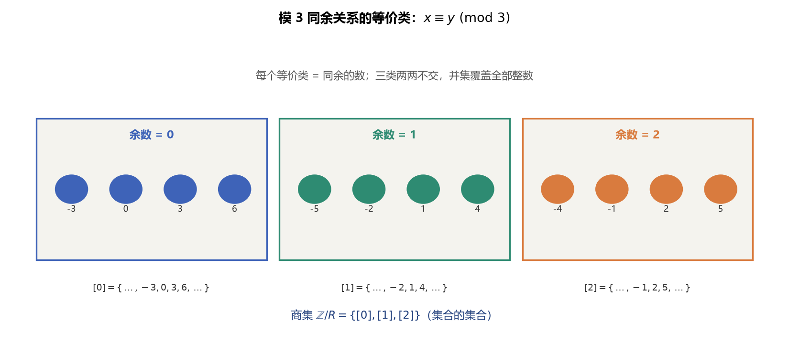
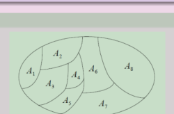
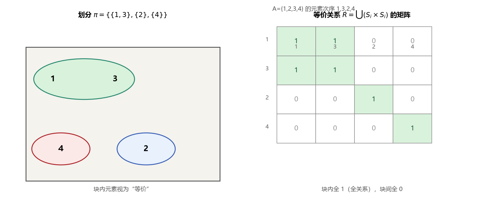
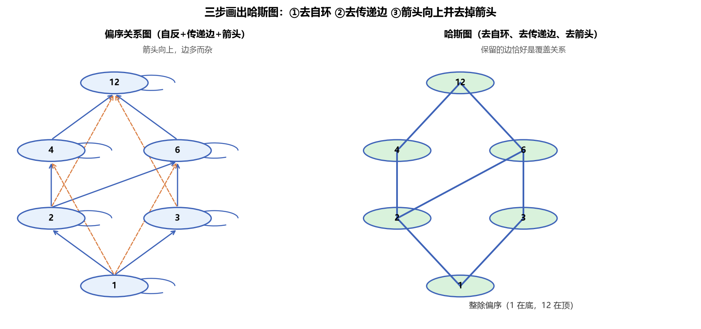
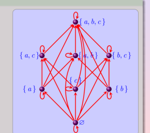
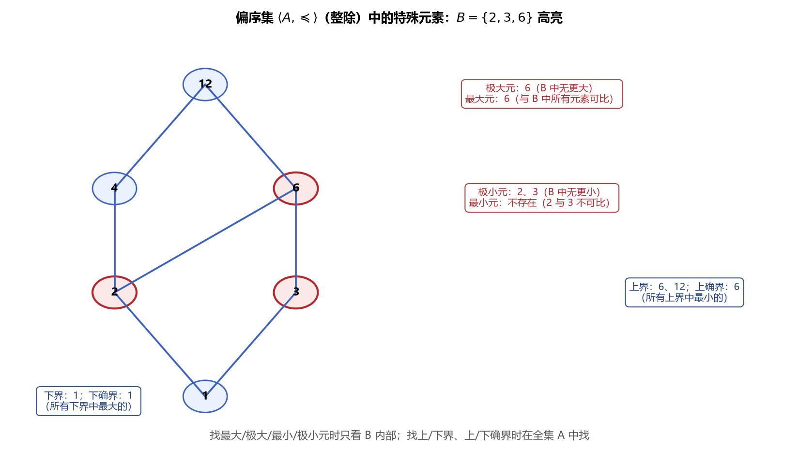
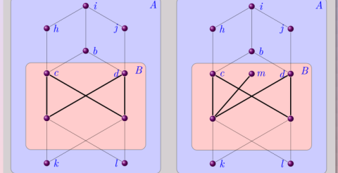
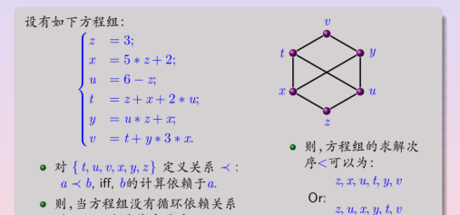

# 第5章 次序关系 - 学习笔记

> **主线**：Kenneth H. Rosen《离散数学及其应用（原书第8版）》9.5 等价关系、9.6 偏序
> **插图与补充**：武汉大学《关系》课件、电子科技大学《离散数学》（BV16Btc6VEpE）P35–P39
> 凡课件、视频与教材表述不一致处，以教材为准。

> **目录**
>
> - [[#1. 等价关系]]
> - [[#2. 等价类]]
> - [[#3. 集合的划分]]
> - [[#4. 等价关系与划分的一一对应]]
> - [[#5. 偏序关系与偏序集]]
> - [[#6. 可比、全序与良序]]
> - [[#7. 字典顺序]]
> - [[#8. 哈斯图]]
> - [[#9. 偏序集中的特殊元素]]
> - [[#10. 格]]
> - [[#11. 拓扑排序]]
> - [[#12. 拟序关系]]
> - [[#13. 本节重点]]

---

## 1. 等价关系

### 1.1 定义

设 $R$ 是非空集合 $A$ 上的关系，若 $R$ 同时满足**自反性、对称性、传递性**，则称 $R$ 为 $A$ 上的**等价关系**。此时若 $\langle a,b\rangle\in R$，称 $a$ 与 $b$ **等价**，记作 $a\sim b$。

三个性质分别保证：每个元素等价于自身；等价是相互的而非单向的；等价可以沿链条传递。

### 1.2 常见等价关系与非等价关系

| 关系 | 是否等价 | 说明 |
|------|---------|------|
| 实数上的 $=$、集合相等 | 是 | 自反、对称、传递 |
| 模 $m$ 同余 | 是 | 余数相同 |
| 字符串长度相同 | 是 | 长度是函数值 |
| 同姓、同颜色、同专业 | 是 | 按某属性归类 |
| 朋友关系 | 否 | 不传递 |
| 整除、包含 $\subseteq$ | 否 | 不对称 |
| $\lvert x-y\rvert<1$ | 否 | 不传递（见下） |

### 1.3 典型例子

- **模 $m$ 同余**：$R=\{\langle x,y\rangle\mid m\mid(x-y)\}$。自反（$m\mid0$）、对称（$m\mid(x-y)\Rightarrow m\mid(y-x)$）、传递（$m\mid(x-y)$ 且 $m\mid(y-z)\Rightarrow m\mid(x-z)$）。
- **绝对值关系**：$aRb$ 当且仅当 $a=b$ 或 $a=-b$，是等价关系。
- **差为整数**：实数上 $aRb$ 当且仅当 $a-b$ 是整数，是等价关系。
- **前 $n$ 个字符相同**：字符串上 $sR_nt$ 当且仅当 $s=t$，或二者都至少含 $n$ 个字符且前 $n$ 个字符相同，是等价关系。传统 C 编译器据此把前 31 个字符相同的标识符视为同一个。

**非等价的两个反例**：

- 整除关系自反、传递，但不对称（$2\mid4$ 而 $4\nmid2$），故不是等价关系。
- 实数上 $\lvert x-y\rvert<1$ 自反、对称，但不传递：取 $2.8,1.9,1.1$，有 $\lvert2.8-1.9\rvert=0.9<1$、$\lvert1.9-1.1\rvert=0.8<1$，但 $\lvert2.8-1.1\rvert=1.7>1$。

---

## 2. 等价类

### 2.1 定义

设 $R$ 是 $A$ 上的等价关系，元素 $a$ 的**等价类**定义为

$$[a]_R = \{s\in A\mid \langle a,s\rangle\in R\}$$

$a$ 称为该等价类的**代表元**。等价类中的任何元素都可作为代表元，选择哪一个并无特殊要求。



> **图1** 模 3 同余的等价类：整数被分成余数为 0、1、2 的三个类，两两不交、并集覆盖全部整数。

### 2.2 等价类的性质

设 $R$ 是 $A$ 上的等价关系，则：

1. **非空**：对任意 $a\in A$，$[a]_R\neq\varnothing$（至少含 $a$ 自身）；
2. **要么相等要么不交**：若 $b\in[a]_R$，则 $[a]_R=[b]_R$，否则 $[a]_R\cap[b]_R=\varnothing$；
3. **覆盖全集**：$\displaystyle\bigcup_{a\in A}[a]_R=A$。

例如模 4 同余有四个等价类：

$$[0]=\{\dots,-8,-4,0,4,8,\dots\}$$

$$[1]=\{\dots,-7,-3,1,5,9,\dots\}$$

$$[2]=\{\dots,-6,-2,2,6,10,\dots\}$$

$$[3]=\{\dots,-5,-1,3,7,11,\dots\}$$

每个整数恰好属于其中一个类。当只关心一个整数除以 $m$ 的余数时，只需知道它属于哪个类，而不必知道它的具体取值——这正是等价关系“抽象”的意义。

---

## 3. 集合的划分

### 3.1 定义

设 $A$ 为非空集合，若集簇 $\pi=\{A_i\mid i\in I\}$ 满足：

1. 每个 $A_i\subseteq A$ 且 $A_i\neq\varnothing$；
2. 对 $i\neq j$，$A_i\cap A_j=\varnothing$（两两不交）；
3. $\displaystyle\bigcup_{i\in I}A_i=A$（并集为 $A$）；

则称 $\pi$ 为 $A$ 的一个**划分**，$A_i$ 称为划分的**块**（类）。



> **图2** 划分的几何示意：把一个集合（椭圆）切成若干互不重叠、又恰好覆盖整体的小块 $A_1,\dots,A_8$。

---

## 4. 等价关系与划分的一一对应

### 4.1 核心定理

**定理**：设 $R$ 是 $A$ 上的等价关系，则下列三个命题等价：

$$aRb \iff [a]_R=[b]_R \iff [a]_R\cap[b]_R\neq\varnothing$$

- $aRb\Rightarrow[a]=[b]$：若 $c\in[a]$，则 $aRc$；由 $aRb$ 及对称性得 $bRa$，再由传递性得 $bRc$，故 $c\in[b]$；反向同理。
- $[a]=[b]\Rightarrow[a]\cap[b]\neq\varnothing$：等价类非空。
- $[a]\cap[b]\neq\varnothing\Rightarrow aRb$：取公共元素 $c$，有 $aRc$、$bRc$，由对称性 $cRb$，再由传递性 $aRb$。

### 4.2 双向对应

- **等价关系 $\to$ 划分**：等价关系的全部等价类构成 $A$ 的一个划分（它们两两不交、并集为 $A$），称为由 $R$ **诱导**的划分。
- **划分 $\to$ 等价关系**：设 $\pi=\{A_i\}$ 是划分，则

$$R = \bigcup_{i\in I}(A_i\times A_i)$$

是 $A$ 上的等价关系，即两个元素等价当且仅当它们处于同一块中。块内部是全关系，块之间没有关系。



> **图3** 划分与其等价关系的矩阵呈“对角分块”结构：块内全为 1、块间全为 0。

### 4.3 商集与秩

等价关系 $R$ 诱导的划分（全部等价类构成的集合）称为**商集**：

$$A/R = \{[a]_R\mid a\in A\}$$

商集是“集合的集合”。若商集有限，其元素个数称为关系 $R$ 的**秩**。例如模 $m$ 同余的商集 $\mathbb{Z}/m\mathbb{Z}$ 有 $m$ 个元素，秩为 $m$。

### 4.4 加细与等价关系计数

- **加细**：若划分 $P_1$ 中的每个块都是划分 $P_2$ 中某个块的子集，则称 $P_1$ 是 $P_2$ 的**加细**。例如模 6 同余类构成的划分是模 3 同余类划分的加细。
- $n$ 元素集合上不同等价关系的个数等于不同划分的个数，称为**贝尔数**，如 3 个元素有 5 个、4 个元素有 15 个。
- 秩恰为 $m$ 的等价关系个数称为第二类 **Stirling 数**，即把 $n$ 个不同元素放入 $m$ 个相同的非空块中的放法数。

---

## 5. 偏序关系与偏序集

### 5.1 定义

设 $R$ 是集合 $S$ 上的关系，若 $R$ 同时满足**自反性、反对称性、传递性**，则称 $R$ 为 $S$ 上的**偏序**（部分序）。集合 $S$ 与偏序 $R$ 一起称为**偏序集**，记作 $\langle S,\preceq\rangle$。

偏序用于排序，其中记号 $\preceq$ 是任意偏序的通用符号，并不专指数值的“小于等于”。$a\preceq b$ 且 $a\neq b$ 记作 $a\prec b$。

### 5.2 典型偏序

| 偏序集 | 偏序含义 |
|--------|----------|
| $\langle\mathbb{Z},\leq\rangle$、$\langle\mathbb{Z},\geq\rangle$ | 数值大小 |
| $\langle\mathbb{Z}^+,\mid\rangle$ | 整除 |
| $\langle P(S),\subseteq\rangle$ | 集合包含 |

整除关系自反（$a\mid a$）、反对称（$a\mid b$ 且 $b\mid a\Rightarrow a=b$）、传递；包含关系同理。而“年纪大于”关系反对称、传递但不自反，故不是偏序。

### 5.3 偏序与等价关系的对比

| 性质 | 等价关系 | 偏序关系 |
|------|---------|---------|
| 自反 | 是 | 是 |
| 对称 | 是 | 否 |
| 反对称 | 否 | 是 |
| 传递 | 是 | 是 |
| 解决的问题 | 分类 | 排序 |

---

## 6. 可比、全序与良序

### 6.1 可比

设 $\langle S,\preceq\rangle$ 为偏序集，若 $x\preceq y$ 或 $y\preceq x$，则称 $x$ 与 $y$ **可比**，否则称**不可比**。

“偏（部分）”字正源于有些元素对不可比。例如整除关系中 $3\mid9$ 故 3 与 9 可比，而 5 与 7 互不整除、不可比；幂集中 $\{1,2\}$ 与 $\{1,3\}$ 互不包含、不可比。

### 6.2 全序

若偏序集中**每一对**元素都可比，则称该偏序为**全序**（线序），相应集合为全序集。

- $\langle\mathbb{Z},\leq\rangle$ 是全序集；
- $\langle\mathbb{Z}^+,\mid\rangle$ 不是全序集（含不可比元素，如 5、7）。

### 6.3 良序

设 $\preceq$ 是全序，若集合 $A$ 的**每个非空子集**都有最小元，则称其为**良序**，相应集合为良序集。

- 正整数集关于 $\leq$ 是良序集；
- 整数集（负整数子集无最小元）、实数集（开区间 $(0,1)$ 无最小元）不是良序集；
- 有限全序集必为良序集。

### 6.4 良序归纳原理

在良序集上，若对任意元素 $x$，只要所有满足 $y\prec x$ 的元素 $y$ 都使性质 $P$ 成立，就能推出 $P(x)$ 成立，则 $P$ 对所有元素成立。

其有效性可用反证法说明：若结论不成立，则使 $P$ 为假的元素构成非空集合，由良序性它有最小元 $a$；而 $a$ 之前的元素都使 $P$ 成立，由归纳步应推出 $P(a)$ 成立，矛盾。良序归纳不需要单独的基础步骤，它是数学归纳法的推广。

**良序定理**指出任意集合上都可构造一个良序，它等价于集合论中的选择公理，并保证超限归纳法可用。

---

## 7. 字典顺序

### 7.1 笛卡尔积上的字典顺序

在两个偏序集 $\langle A_1,\preceq_1\rangle$、$\langle A_2,\preceq_2\rangle$ 的笛卡尔积上定义字典顺序：

$$\langle a_1,a_2\rangle\prec\langle b_1,b_2\rangle$$

当且仅当 $a_1\prec_1 b_1$，或者 $a_1=b_1$ 且 $a_2\prec_2 b_2$。

即先比较第一分量，第一分量相等时才比较第二分量。该定义可推广到 $n$ 个偏序集的笛卡尔积：在两个 $n$ 元组首次出现不同的位置上，分量较小者整体较小。

### 7.2 字符串上的字典顺序

设字母表 $\Sigma$ 上有线序，$\Sigma^*$ 为所有字符串（含空串 $\varepsilon$）的集合。比较两个字符串时，取二者长度的较小值 $t$，比较前 $t$ 个字符：首个不同位置上字符较小者整体较小；若前 $t$ 个字符全相同，则较短的字符串较小（短串是长串的前缀）。

例如按英文字母表，`discreet` 与 `discrete` 在第 7 位首次不同、$e<t$，故 `discreet < discrete`；`discreet < discreetness`，因为前者是后者的前缀。C 语言的 `strcmp` 即按字典顺序实现。

---

## 8. 哈斯图

### 8.1 覆盖关系

设 $\langle S,\preceq\rangle$ 为偏序集，若 $x\prec y$ 且不存在 $z\in S$ 使 $x\prec z\prec y$，则称 $y$ **覆盖** $x$。全部覆盖序偶构成覆盖关系。

### 8.2 哈斯图的画法

从偏序的有向图出发，经三步简化得到**哈斯图**：

1. **去自环**：自反性使每个顶点都有环，省略不画；
2. **去传递边**：若 $x\to y$、$y\to z$ 存在，则 $x\to z$ 由传递性保证，省略；
3. **向上排列去箭头**：重新安排顶点使每条边起点在下、终点在上，于是可省略箭头。



> **图4** 从关系图到哈斯图的三步简化（以整除偏序为例），保留下来的边恰好是覆盖关系。

哈斯图保留的边恰好对应覆盖关系。反过来，偏序集就是其覆盖关系的传递闭包的自反闭包，因此可从哈斯图恢复完整偏序。



> **图5** 幂集 $\langle P(\{a,b,c\}),\subseteq\rangle$ 的哈斯图，呈立方体结构：空集在底，全集在顶，每上升一层恰好多一个元素。全序集的哈斯图则是一条竖直的“链”。

---

## 9. 偏序集中的特殊元素

设 $\langle A,\preceq\rangle$ 为偏序集，$B\subseteq A$。



> **图6** 特殊元素总览（整除偏序，$B=\{2,3,6\}$）：最大、极大元在 $B$ 内寻找，上、下界在整个 $A$ 中寻找。

### 9.1 最大元、最小元与极大元、极小元

- **最大元**：$b\in B$ 且对所有 $x\in B$ 有 $x\preceq b$；**最小元**方向相反。最大（小）元若存在则唯一。
- **极大元**：$b\in B$，且不存在 $x\in B$ 使 $b\prec x$；**极小元**方向相反。极大元允许存在不可比元素，有限偏序集必有极大、极小元，但可以有多个。

最大元一定是极大元；有限集合一定存在极大、极小元（可通过不断比较求得）。

### 9.2 上界、下界与确界

- **上界**：$u\in A$ 且对所有 $x\in B$ 有 $x\preceq u$；**下界**方向相反。界可能有多个，且不要求属于 $B$。
- **最小上界**（上确界 $\operatorname{lub}$）：上界中最小者；**最大下界**（下确界 $\operatorname{glb}$）：下界中最大者。确界若存在则唯一。



> **图7** 上下界与确界：左图中 $b$ 是子集 $B$ 的最小上界、$k$ 与 $l$ 是下界；右图中相应子集没有最大下界（几个下界互不包含）。

### 9.3 特殊元素总结

| 元素 | 是否一定存在 | 是否唯一 | 是否属于 $B$ | 关系 |
|------|-------------|---------|-------------|------|
| 最大元 | 否 | 是 | 是 | 最大元是极大元、是上界、是 lub |
| 极大元 | 有限集存在 | 否 | 是 | — |
| 上界 | 否 | 否 | 否 | — |
| 最小上界 | 否 | 是 | 否 | — |
| 最小元 | 否 | 是 | 是 | 最小元是极小元、是下界、是 glb |
| 极小元 | 有限集存在 | 否 | 是 | — |
| 下界 | 否 | 否 | 否 | — |
| 最大下界 | 否 | 是 | 否 | — |

需特别注意：**有上界不一定有上确界**。若若干上界之间不可比，就不存在最小的上界；下界同理。在整除偏序中，lub 对应最小公倍数、glb 对应最大公约数。

---

## 10. 格

### 10.1 定义

若偏序集中**每一对**元素都有最小上界和最大下界，则称该偏序集为**格**。

### 10.2 典型格与非格

- $\langle\mathbb{Z}^+,\mid\rangle$ 是格：两数的 lub 是最小公倍数、glb 是最大公约数。
- $\langle P(S),\subseteq\rangle$ 是格：两子集的 lub 是并集、glb 是交集。
- 全序集都是格：两元素的 lub 是较大者、glb 是较小者。
- 若一对元素有若干互不可比的上界（无最小上界），则不是格。

### 10.3 信息流的格模型

格可用于建模多级安全中的信息流。安全类用序对 $\langle A,C\rangle$ 表示，其中 $A$ 是权限级别（如不保密 0、秘密 1、机密 2、绝密 3），$C$ 是种类集合（涉及的项目）的子集。规定

$$\langle A_1,C_1\rangle\preceq\langle A_2,C_2\rangle \iff A_1\leq A_2 \text{ 且 } C_1\subseteq C_2$$

信息允许从类 $\langle A_1,C_1\rangle$ 流向 $\langle A_2,C_2\rangle$ 当且仅当上述关系成立。两个安全类的 lub 为 $\langle\max(A_1,A_2),C_1\cup C_2\rangle$、glb 为 $\langle\min(A_1,A_2),C_1\cap C_2\rangle$，故全体安全类构成一个格。

---

## 11. 拓扑排序

### 11.1 相容与拓扑排序

若全序 $\preceq'$ 与偏序 $\preceq$ 满足：只要 $a\preceq b$ 就有 $a\preceq' b$，则称全序与偏序**相容**。从偏序构造相容全序的过程称为**拓扑排序**（数学上称偏序的线性化）。

### 11.2 算法

有限非空偏序集必有极小元。算法反复执行：在当前剩余集合中选取一个极小元并将其移出，直到取尽。由此得到的序列就是一个相容全序。

```text
S := A
while S 非空:
    选取 S 的一个极小元 m 并输出
    S := S - {m}
```



> **图8** 拓扑排序的典型应用：方程组中变量的计算依赖关系构成偏序（若 $b$ 的计算依赖 $a$，则 $a\prec b$）。只要依赖关系不含回路，就可通过拓扑排序确定求解次序，如 $z,u,x,y,t,v$。

当存在多个极小元时，可任选其一，因此一个偏序可能对应多个不同的拓扑排序。该算法广泛用于安排项目任务、课程先修顺序、电子表格单元格重算等。

---

## 12. 拟序关系

### 12.1 定义

设 $R$ 是 $A$ 上的关系，若 $R$ 满足**反自反性**和**传递性**，则称 $R$ 为**拟序**（严格偏序），记作 $\prec$。

拟序的反对称性不必单独假设，可由反自反性与传递性推出：若 $x\prec y$ 且 $y\prec x$，由传递性得 $x\prec x$，与反自反矛盾。

### 12.2 拟序与偏序的转换

- 偏序去掉恒等部分得到拟序：$\prec\ =\ \preceq - I_A$；
- 拟序并上恒等关系得到偏序：$\preceq\ =\ \prec\cup I_A$。

典型拟序有实数上的严格小于 $<$、集合间的真包含 $\subset$。

---

## 13. 本节重点

> **本节重点**：
>
> - **等价关系**：自反、对称、传递，用于分类；模 $m$ 同余是典型代表。$\lvert x-y\rvert<1$ 因不传递而不是等价关系。
> - **等价类** $[a]_R$ 非空、两两要么相等要么不交、并集覆盖全集。
> - **划分**：不相交非空块并集为全集。等价关系与划分一一对应：划分 $\{A_i\}$ 导出 $R=\bigcup(A_i\times A_i)$；商集 $A/R$ 即划分，其大小称为秩。
> - **偏序**：自反、反对称、传递，用于排序；与等价关系的关键差别是反对称 vs 对称。
> - **可比、全序、良序**：全序要求每对元素可比（哈斯图是一条链）；良序要求每个非空子集有最小元。良序归纳是数学归纳的推广。
> - **字典顺序**：先比较前分量，相等才比较后分量；字符串前缀较短者较小。
> - **哈斯图**：去自环、去传递边、向上排列去箭头，保留的边是覆盖关系；偏序可由覆盖关系的自反传递闭包恢复。
> - **特殊元素**：最大/最小、极大/极小在 $B$ 中找，上/下界与确界在 $A$ 中找；最大元、确界存在则唯一，极大元、界可有多个；有上界不一定有上确界。
> - **格**：每对元素都有 lub 与 glb；整除（lcm/gcd）、包含（并/交）是典型格；信息流安全类构成格。
> - **拓扑排序**：反复选取极小元，得到与偏序相容的全序，用于安排有依赖关系的任务。
> - **拟序**：反自反、传递（反对称可推出）；偏序去 $I_A$ 得拟序，拟序加 $I_A$ 得偏序。
> - **包含关系**：良序 $\subset$ 全序 $\subset$ 偏序；有限全序集必为良序集。
