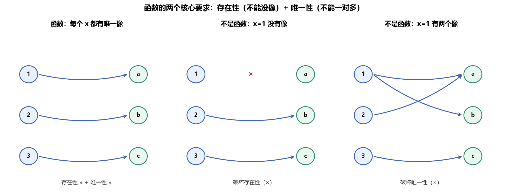
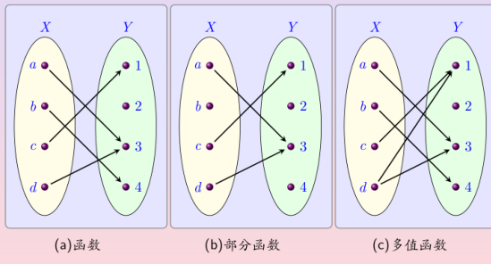
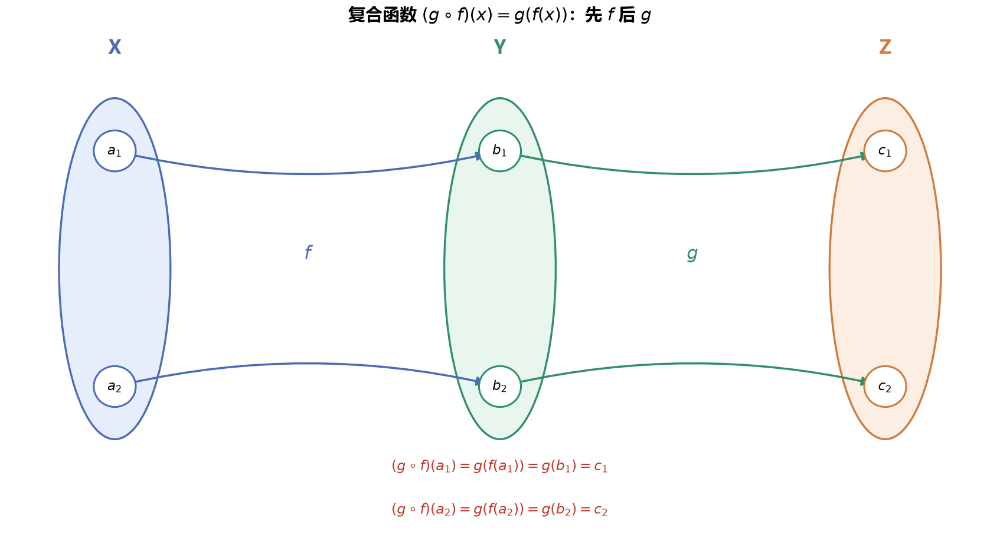
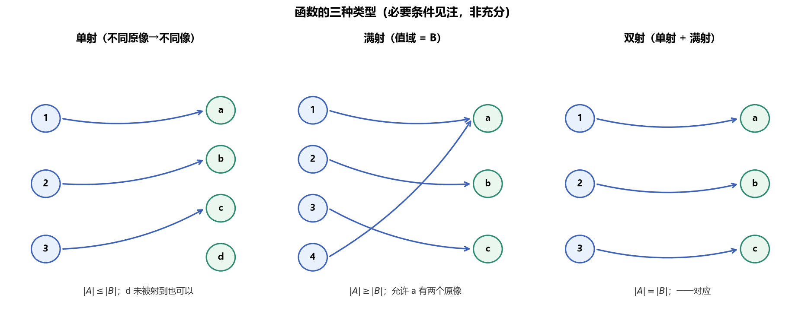
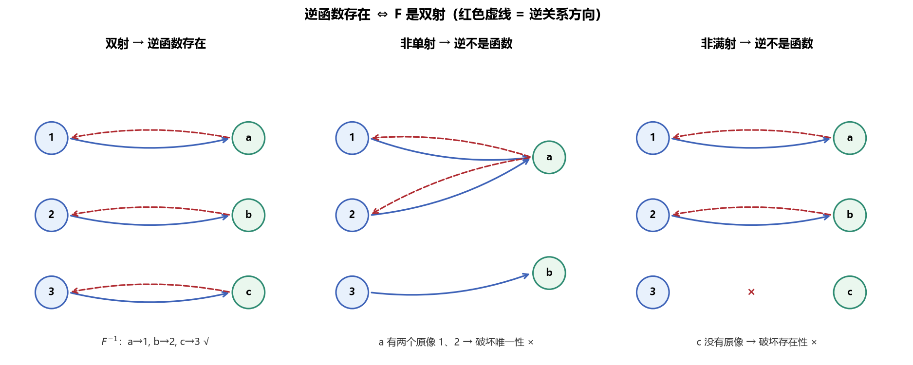

# 第6章 函数 - 学习笔记

> 本笔记以 Rosen《离散数学及其应用（原书第8版）》2.3 节为主线，融合武汉大学《函数》课件（43 页）与 B 站课程讲解整理而成。课件中的递归定义函数部分教材置于第 5 章，本笔记按课件顺序一并收入。

> **目录**
>
> - [[#1. 函数的基本概念]]
> - [[#2. 函数的像与逆像]]
> - [[#3. 常用函数]]
> - [[#4. 函数的合成]]
> - [[#5. 单射、满射和双射]]
> - [[#6. 逆函数]]
> - [[#7. 函数的图]]
> - [[#8. 取整函数、对数与阶乘]]
> - [[#9. 部分函数]]
> - [[#10. 函数的递归定义]]
> - [[#11. 本章小结]]

---

## 1. 函数的基本概念

### 1.1 函数的引入

在许多问题中，需要为一个集合的每个元素指派另一个集合（可以是第一个集合）中的一个特定元素。例如，为离散数学课的每个学生指派集合 $\{A,B,C,D,F\}$ 中的一个字母作为成绩；为每个学生指派一个年龄；为长度不小于 2 的比特串指派其最后两位。这种**指派**就是函数。

函数在数学与计算机科学中尤为重要：序列、字符串等离散结构借助函数定义；算法的时间复杂度用函数表示；程序中的子程序本质上都在计算函数值；递归函数则基于自身定义，在计算机科学中应用广泛。

函数也称为**映射**（mapping）或**变换**（transformation）。

### 1.2 函数的定义

设 $A,B$ 为集合，从 $A$ 到 $B$ 的函数 $f$ 是一种指派，它为 $A$ 中的每个元素恰好指派 $B$ 中的一个元素，记作

$$f:A\to B$$

函数也可以从关系的角度定义。$A$ 到 $B$ 的关系是笛卡尔积 $A\times B$ 的子集；若一个关系对每个 $a\in A$ 都有且仅有一个序偶 $\langle a,b\rangle$，则它定义了一个函数 $f$，并规定 $f(a)=b$，其中 $\langle a,b\rangle$ 是关系中唯一以 $a$ 为第一元素的序偶。

因此，函数是一种特殊的二元关系，它同时满足两个要求：

1. **存在性（完全性）**：每个 $x\in A$ 都有像，即 $\forall x\in A,\ \exists y\in B,\ f(x)=y$；
2. **唯一性（多对一）**：每个 $x\in A$ 只有一个像，即一个自变量不能同时对应两个不同的函数值。

当 $f(a)=b$ 时，称 $b$ 是 $a$ 的**像**（image），称 $a$ 是 $b$ 的**原像**（preimage）。需注意区分 $f$ 与 $f(x)$：$f$ 是函数本身，$f(x)$ 是自变量 $x$ 所对应的函数值。



> **图1** 函数的两个核心要求（自绘）：左为函数，每个 $x$ 都有唯一像；中破坏存在性（$x=1$ 没有像）；右破坏唯一性（$x=1$ 同时指向 $a,b$）。任一要求被破坏，对应关系都不是函数。

### 1.3 定义域、陪域与值域

设 $f:A\to B$，则：

- $A$ 称为 $f$ 的**定义域**（domain），记作 $\operatorname{dom}(f)=A$；
- $B$ 称为 $f$ 的**陪域**（codomain），是函数所有可能取值的集合；
- $f$ 的**值域**（range）是定义域中所有元素之像构成的集合：

$$\operatorname{ran}(f)=f(A)=\{f(a)\mid a\in A\}$$

值域总是陪域的子集，即 $f(A)\subseteq B$。二者的区别在于：陪域是函数**可能**取值的集合，在定义函数时人为指定；值域是函数**实际**取到的值的集合，由映射关系决定。称 $f$ 把 $A$ 映射到 $B$。

定义一个函数必须指定其三要素：定义域、陪域，以及定义域元素到陪域的映射关系。当两个函数的定义域相同、陪域相同，且定义域中每个元素都映射到相同的像时，称这两个函数**相等**。只要改变定义域、陪域或映射关系中的任意一个，就得到不同的函数。

函数可以用多种方式描述：明确画出指派关系、给出公式（如 $f(x)=x+1$），或用计算机程序描述。

### 1.4 函数的若干例子

例1（成绩函数）设 $G$ 表示离散数学课上某学生的成绩，如 $G(\text{Adams})=A$。其定义域为学生集合 $\{\text{Adams},\text{Chou},\text{Goodfriend},\text{Rodriguez},\text{Stevens}\}$，陪域为 $\{A,B,C,D,F\}$，值域为 $\{A,B,C,F\}$（字母 $D$ 没有任何学生取得）。

例2（年龄函数）关系 $R$ 包含序偶 $(\text{Abdul},22),(\text{Brenda},24),(\text{Carla},21)$ 等，每一对由学生与其年龄组成，它确定函数 $f(x)=x$ 的年龄。定义域为学生集合，可取小于 100 的正整数为陪域，值域为 $\{21,22,24\}$。陪域的选择并不唯一，但选择不同的陪域会得到不同的函数。

例3（末两位函数）函数 $f$ 为长度不小于 2 的比特串指派其最后两位，如 $f(11010)=10$。定义域是所有长度不小于 2 的比特串，陪域与值域均为 $\{00,01,10,11\}$。

例4（平方函数）函数 $f:\mathbb{Z}\to\mathbb{Z}$ 为每个整数指派其平方，$f(x)=x^2$。定义域为整数集，陪域为整数集，值域为完全平方数集合 $\{0,1,4,9,\ldots\}$。

例5（程序描述）Java 或 C++ 中形如 `int floor(float x)` 的语句说明：`floor` 函数的定义域是（由浮点数表示的）实数集合，陪域是整数集合。

例（计算机科学中的函数）函数在计算机科学中以多种形式出现。命题公式的语义解释 $I:\{0,1\}^n\to\{0,1\}$ 为每一种真值指派确定唯一的真值，是一个函数；程序状态可看作存储单元集合 $\mathcal{M}$ 到整数的函数 $S:\mathcal{M}\to\mathbb{Z}$，每个单元中存有唯一的整数；运行环境则把变量名集合 $Name$ 映射到存储单元，$E:Name\to\mathcal{M}$，每个变量名对应唯一的单元地址。

### 1.5 实值函数、整数值函数与函数的和、积

若函数的陪域为实数集合，称为**实值函数**；若陪域为整数集合，称为**整数值函数**。具有相同定义域的两个实值（或整数值）函数可以相加、相乘：

$$(f_1+f_2)(x)=f_1(x)+f_2(x)$$

$$(f_1f_2)(x)=f_1(x)f_2(x)$$

例6 设 $f_1,f_2:\mathbb{R}\to\mathbb{R}$，$f_1(x)=x^2$，$f_2(x)=x-x^2$，则

$$(f_1+f_2)(x)=x^2+(x-x^2)=x$$

$$(f_1f_2)(x)=x^2(x-x^2)=x^3-x^4$$

### 1.6 不是函数的情形：部分函数与多值函数

一个关系不成为函数，对应于破坏 1.2 节两个要求之一：

- 若某个 $x\in A$ **没有像**，即不满足完全性，称对应关系确定一个**部分函数**；
- 若某个 $x\in A$ **有两个或更多像**，即不满足唯一性，称对应关系为**多值函数**。

下图把函数、部分函数、多值函数放在一起对照。



> **图2** 函数、部分函数、多值函数对照（取自武大课件）：(a) 函数，每个 $X$ 中元素都有且仅有一个像；(b) 部分函数，元素 $c$ 没有像；(c) 多值函数，元素 $a$ 同时有 $1$ 和 $3$ 两个像。

### 1.7 函数的集合

从 $A$ 到 $B$ 的所有函数构成一个集合，记作

$$B^A=\{f\mid f:A\to B\}$$

若 $|A|=m,\ |B|=n$，则定义域中每个元素都有 $n$ 种可选的像，由乘法原理，函数总数为

$$|B^A|=n^m=|B|^{|A|}$$

例如 $|A|=3,\ |B|=2$ 时，$A\times B$ 的子集（一般关系）共有 $2^6=64$ 个，而其中函数只有 $2^3=8$ 个。函数作为关系，其基数恒为 $|A|$（每个定义域元素恰好贡献一个序偶），且所有序偶的第一元素互不相同。

---

## 2. 函数的像与逆像

### 2.1 子集的像

设 $f:A\to B$，$S\subseteq A$，则 $S$ 在 $f$ 下的像定义为

$$f(S)=\{f(x)\mid x\in S\}$$

需注意记号 $f(S)$ 的二义性：它表示由 $S$ 中各元素之像组成的**集合**，而不是函数在某个点 $S$ 处的值。

例7 设 $A=\{a,b,c,d,e\}$，$B=\{1,2,3,4\}$，且 $f(a)=2,f(b)=1,f(c)=4,f(d)=1,f(e)=1$。对子集 $S=\{b,c,d\}$，有

$$f(S)=\{f(b),f(c),f(d)\}=\{1,4\}$$

### 2.2 逆像

设 $T\subseteq B$，则 $T$ 的**逆像**（原像集）定义为

$$f^{-1}(T)=\{a\in A\mid f(a)\in T\}$$

逆像由所有其像落在 $T$ 中的定义域元素组成。这里必须注意记号 $f^{-1}$ 的两种不同用法：

- $f^{-1}(T)$ 表示集合 $T$ 的逆像，它对**任意函数**（即使不可逆）都有意义；
- $f^{-1}(y)$ 若表示可逆函数的反函数在 $y$ 处的取值，则只在 $f$ 为双射时才有定义。

二者通过上下文区分。

### 2.3 像与逆像的基本性质

对 $S,S_1,S_2\subseteq A$ 与 $T,T_1,T_2\subseteq B$，像与逆像满足下列性质。

像对并、交的作用：

$$f(S_1\cup S_2)=f(S_1)\cup f(S_2)$$

$$f(S_1\cap S_2)\subseteq f(S_1)\cap f(S_2)$$

逆像对并、交均可分配（取等号）：

$$f^{-1}(T_1\cup T_2)=f^{-1}(T_1)\cup f^{-1}(T_2)$$

$$f^{-1}(T_1\cap T_2)=f^{-1}(T_1)\cap f^{-1}(T_2)$$

像与逆像复合时，有两个最基本的包含关系：

$$S\subseteq f^{-1}(f(S))$$

$$f(f^{-1}(T))\subseteq T$$

直观上，**求像会“缩小”、求逆像会“放大”**：先求像再求逆像，得到的集合不小于原集合；先求逆像再求像，得到的集合不大于原集合。这是因为可能有多个原像映到同一个像，求像时丢失了“谁映射过来”的信息。

当 $f$ 为单射时，像对交也可取等号，且 $f^{-1}(f(S))=S$；当 $f$ 为满射时，$f(f^{-1}(T))=T$。这些充要条件将在第 6 章证明。

---

## 3. 常用函数

下面列出若干最基本、最常用的函数。

### 3.1 恒等函数

集合 $A$ 上的**恒等函数** $\iota_A:A\to A$（$\iota$ 为希腊字母，读作 iota）把每个元素指派到自身：

$$\iota_A(x)=x$$

恒等函数既单又满，是双射。

### 3.2 常数函数

函数 $f:A\to B$ 若对所有 $x\in A$ 都取同一个固定值 $b\in B$，即 $f(x)=b$，称为**常数函数**。

### 3.3 后继函数

自然数集上的**后继函数** $s:\mathbb{N}\to\mathbb{N}$ 定义为

$$s(n)=n+1$$

它把每个自然数映射到它的后继，是自然数公理化定义（皮亚诺公理）的基础。

### 3.4 n 元函数与投影函数

若函数的定义域是笛卡尔积 $X_1\times X_2\times\cdots\times X_n$，称为 **n 元函数**，其自变量是一个 $n$ 元组。**投影函数**

$$p_i:X_1\times\cdots\times X_n\to X_i,\quad p_i(x_1,\ldots,x_n)=x_i$$

从一个 $n$ 元组中取出其第 $i$ 个分量。

此外，给定关系 $R\subseteq X\times Y$，可定义**截痕**函数 $X\to P(Y)$，把每个 $x\in X$ 映射到集合

$$\{y\in Y\mid\langle x,y\rangle\in R\}$$

即固定第一分量 $x$ 后，关系 $R$ 中所有配对之第二元素构成的截面。

### 3.5 特征函数

设 $S\subseteq U$，$S$ 的**特征函数** $\chi_S:U\to\{0,1\}$ 定义为

$$\chi_S(x)=\begin{cases}1,&x\in S\\ 0,&x\notin S\end{cases}$$

特征函数用 0/1 编码了元素是否属于集合，集合运算可翻译成特征函数的算术运算，例如 $\chi_{A\cap B}(x)=\chi_A(x)\chi_B(x)$、$\chi_{\overline A}(x)=1-\chi_A(x)$。

---

## 4. 函数的合成

### 4.1 合成的定义

设 $f:X\to Y$ 与 $g:Y\to Z$ 是两个函数，则它们的**合成**（复合）函数 $g\circ f:X\to Z$ 定义为

$$(g\circ f)(x)=g(f(x))$$

即先把 $f$ 作用于 $x$，再把 $g$ 作用于所得结果 $f(x)$。合成的前提是 $f$ 的陪域与 $g$ 的定义域相同（更一般地，$f$ 的值域包含在 $g$ 的定义域中）。



> **图3** 复合函数 $(g\circ f)(x)=g(f(x))$（自绘）：沿 $X\xrightarrow{f}Y\xrightarrow{g}Z$ 走过两级，先 $f$ 后 $g$。例如 $(g\circ f)(a_1)=g(f(a_1))=g(b_1)=c_1$。

### 4.2 记号约定：函数合成与关系合成

本笔记采用武汉大学课件的记号约定，函数合成与关系合成的书写方向**相反**，需特别留意：

- **函数合成** $g\circ f$ 表示先 $f$ 后 $g$，即 $\circ$ **右侧**的函数先作用（与 $(g\circ f)(x)=g(f(x))$ 的嵌套次序一致，内层先算）；
- **关系合成** $R\circ S$ 表示先 $R$ 后 $S$，即 $\circ$ **左侧**的关系先作用（见 04 章）。

阅读其他教材时还会遇到另一种统一约定（Rosen 英文原版把关系合成记作 $S\circ R$，与函数合成方向一致）。使用时应先确认所采用的记号体系。

### 4.3 合成的定律

设 $f:X\to Y$，$g:Y\to Z$，$h:Z\to W$，则函数合成满足：

同一律：

$$\iota_Y\circ f=f,\qquad g\circ\iota_Y=g$$

结合律：

$$h\circ(g\circ f)=(h\circ g)\circ f$$

合成**不满足交换律**。一般而言 $g\circ f\neq f\circ g$：二者甚至可能连定义域、陪域都不同；即使都有定义，结果也未必相等。

例（合成不可交换）设 $f(x)=2x+3$，$g(x)=3x+2$，二者都是 $\mathbb{Z}\to\mathbb{Z}$ 的函数，则

$$(f\circ g)(x)=f(g(x))=f(3x+2)=2(3x+2)+3=6x+7$$

$$(g\circ f)(x)=g(f(x))=g(2x+3)=3(2x+3)+2=6x+11$$

二者均有定义但不相等。

### 4.4 函数的合成幂

函数 $f:X\to X$ 与自身反复合成，可递归定义其幂：

$$f^0=\iota_X,\qquad f^{n+1}=f\circ f^n$$

于是 $f^n$ 表示把 $f$ 连续作用 $n$ 次。幂运算满足

$$f^m\circ f^n=f^{m+n}$$

---

## 5. 单射、满射和双射

### 5.1 单射

设 $f:X\to Y$，若定义域中任意两个不同元素的像也不同，即

$$\forall x_1,x_2\in X,\quad x_1\neq x_2\Rightarrow f(x_1)\neq f(x_2)$$

则称 $f$ 为**单射**（one-to-one，又称入射、一对一函数）。对该命题取逆否，可得等价的量词表达：

$$\forall x_1,x_2\in X,\quad f(x_1)=f(x_2)\Rightarrow x_1=x_2$$

即只要两个像相等，其原像必然相同。判断一个函数不是单射，只需找到一对 $x_1\neq x_2$ 使 $f(x_1)=f(x_2)$。

例 函数 $f(x)=x^2$ 在 $\mathbb{Z}$ 上不是单射，因为 $f(1)=f(-1)=1$ 而 $1\neq-1$；但在正整数集 $\mathbb{Z}^+$ 上是单射。注意这两个函数因定义域不同而是不同的函数。

例 函数 $f(x)=x+1$ 在 $\mathbb{R}$ 上是单射：若 $f(x)=f(y)$，即 $x+1=y+1$，则 $x=y$。

### 5.2 单调性与单射

函数 $f$ 称为：

- **递增**：$\forall x,y,\ x<y\Rightarrow f(x)\leq f(y)$；
- **严格递增**：$\forall x,y,\ x<y\Rightarrow f(x)<f(y)$；
- **递减**：$\forall x,y,\ x<y\Rightarrow f(x)\geq f(y)$；
- **严格递减**：$\forall x,y,\ x<y\Rightarrow f(x)>f(y)$。

严格递增或严格递减的函数必定是单射。例如 $f(x)=x^2$ 在正实数上严格递增（$x<y$ 时 $x^2<xy<y^2$），故为单射；但在全体实数上不是严格递增的（$-1<0$ 但 $f(-1)=1>f(0)=0$），也不是单射。

### 5.3 满射

设 $f:X\to Y$，若陪域中每个元素都是定义域中某元素的像，即

$$\forall y\in Y,\ \exists x\in X,\quad f(x)=y$$

则称 $f$ 为**满射**（onto，又称映上函数）。满射的值域恰好等于陪域：$f(X)=Y$。

例 函数 $f(x)=x^2$ 在 $\mathbb{Z}\to\mathbb{Z}$ 上不是满射，因为不存在整数 $x$ 使 $x^2=-1$。函数 $f(x)=x+1$ 是满射：对任意整数 $y$，取 $x=y-1$ 即有 $f(x)=y$。

### 5.4 双射

若函数 $f:X\to Y$ 既是单射又是满射，则称 $f$ 为**双射**（bijection，又称一一对应）。集合 $A$ 上的恒等函数 $\iota_A$ 把每个元素映到自身，既单又满，是双射。



> **图4** 单射、满射、双射对照（自绘）：单射要求不同原像不同像，但陪域可以有元素未被映到；满射要求值域等于陪域，但允许不同原像映到同一像；双射二者兼得，元素之间一一配对。

### 5.5 基数关系

设 $f:X\to Y$，则函数性质给出定义域与陪域基数之间的必要条件：

| 性质 | 基数关系 |
|------|---------|
| $f$ 是单射 | $\vert X\vert\leq\vert Y\vert$ |
| $f$ 是满射 | $\vert Y\vert\leq\vert X\vert$ |
| $f$ 是双射 | $\vert X\vert=\vert Y\vert$ |

这些是**必要条件而非充分条件**：满足基数关系不保证函数具有相应性质，但不满足则一定不具有该性质。

若 $f$ 是有限集 $A$ 到自身的函数，则 $f$ 为单射当且仅当它为满射（从而单射、满射、双射三者等价）。但当 $A$ 为无限集时这一结论不一定成立。

### 5.6 置换

有限集合上的双射称为**置换**（permutation）。集合 $\{1,2,\ldots,n\}$ 上全体置换构成的集合记为 $P_n$，其元素个数为

$$|P_n|=n!$$

### 5.7 单射、满射、双射的计数

设 $|X|=m$，$|Y|=n$。

当 $m\leq n$ 时，从 $X$ 到 $Y$ 的单射个数为

$$\binom{n}{m}m!=\frac{n!}{(n-m)!}$$

其含义是：从 $Y$ 的 $n$ 个元素中选出 $m$ 个不同的像，再把它们与 $X$ 的 $m$ 个元素作一一配对。

当 $m\geq n$ 时，从 $X$ 到 $Y$ 的满射个数等于“把 $m$ 个不同小球放入 $n$ 个不同盒子且无空盒”的放法数，由容斥原理得

$$\sum_{k=0}^{n}(-1)^k\binom{n}{k}(n-k)^m$$

当 $m=n$ 时，双射个数为 $n!$，与 $n$ 元置换数相同。

### 5.8 常见函数的性质判断

下表判断若干 $\mathbb{R}\to\mathbb{R}$（或受限定义域）函数的性质。

| 函数 | 单射 | 满射 | 双射 |
|------|------|------|------|
| $f(x)=x^2$（$\mathbb{R}\to\mathbb{R}$） | 否（$1,-1$ 都映到 $1$） | 否（值域为 $[0,+\infty)$） | 否 |
| $f(x)=x+1$（$\mathbb{R}\to\mathbb{R}$） | 是 | 是 | 是 |
| $f(x)=e^x$（$\mathbb{R}\to\mathbb{R}$） | 是 | 否（值域为 $(0,+\infty)$） | 否 |
| $f(x)=x^2$（$\mathbb{R}^+\to\mathbb{R}^+$） | 是 | 是 | 是 |

### 5.9 自然映射

设 $R$ 是 $A$ 上的等价关系，商集 $A/R$ 是所有等价类的集合。定义**自然映射**（典型映射）$g:A\to A/R$：

$$g(a)=[a]_R$$

自然映射是满射：对任意等价类 $[a]_R\in A/R$，取代表元 $a\in A$，便有 $g(a)=[a]_R$，故商集中每个元素都有原像。

---

## 6. 逆函数

### 6.1 可逆与逆函数

设 $f:A\to B$ 是双射。由于 $f$ 是满射，$B$ 中每个元素都是 $A$ 中某元素的像；又由于 $f$ 是单射，$B$ 中每个元素恰是 $A$ 中唯一一个元素的像。因此可以定义一个从 $B$ 到 $A$ 的新函数，把 $f$ 的对应关系颠倒过来，这就是 $f$ 的**逆函数**（反函数）$f^{-1}$。

双射又称为**可逆**函数；不是双射的函数称为**不可逆**，因为它不存在逆函数。

切勿把逆函数 $f^{-1}$ 与倒数 $1/f$ 混淆：$1/f$ 表示函数 $x\mapsto 1/f(x)$，仅当 $f(x)\neq 0$ 时有意义，二者完全不同。



> **图5** 逆函数存在的条件（自绘，红色虚线为逆关系方向）：双射的逆关系满足函数定义；非单射时某个 $y$ 有多个原像（破坏唯一性），非满射时某个 $y$ 没有原像（破坏存在性）。

### 6.2 通过限制定义域获得可逆函数

有时可通过限制函数的定义域或陪域（或两者），把不可逆函数改造为可逆函数。

例 $f(x)=x^2$ 在 $\mathbb{R}\to\mathbb{R}$ 上不可逆。但若将其限制为非负实数集到非负实数集的函数，则：若 $f(x)=f(y)$，即 $x^2=y^2$，有 $(x+y)(x-y)=0$；因 $x,y$ 非负，必有 $x=y$，故为单射；又每个非负实数都有非负平方根，故为满射。于是限制后的函数可逆，其逆函数为 $f^{-1}(y)=\sqrt{y}$。

### 6.3 单射、满射与左逆、右逆

函数的单、满性质可由“逆函数”是否存在来刻画。

设 $f:X\to Y$：

- $f$ 为单射，当且仅当存在函数 $g:Y\to X$ 使 $g\circ f=\iota_X$，称 $g$ 为 $f$ 的**左逆**；
- $f$ 为满射，当且仅当存在函数 $g:Y\to X$ 使 $f\circ g=\iota_Y$，称 $g$ 为 $f$ 的**右逆**。

左逆、右逆一般不唯一。直观上，左逆保证“不同输入不会被合并”（单射），右逆保证“每个输出都能被取到”（满射）。

### 6.4 双射与唯一逆

$f:X\to Y$ 为双射，当且仅当存在**唯一**函数 $g:Y\to X$ 同时满足

$$g\circ f=\iota_X,\qquad f\circ g=\iota_Y$$

此时记 $g=f^{-1}$，并称 $f$ 可逆。唯一性可由结合律推出：若 $g,g'$ 都满足上式，则

$$g=g\circ\iota_Y=g\circ(f\circ g')=(g\circ f)\circ g'=\iota_X\circ g'=g'$$

### 6.5 逆函数的性质

设 $f:X\to Y$、$g:Y\to Z$ 均为双射，则：

$$(f^{-1})^{-1}=f$$

$$(g\circ f)^{-1}=f^{-1}\circ g^{-1}$$

第二条称为**穿脱原则**：复合函数的逆要把两个函数的次序颠倒、并分别取逆，如同先脱外套再脱内衣（与穿戴次序相反）。它由合成结合律验证：

$$(f^{-1}\circ g^{-1})\circ(g\circ f)=\iota_X,\qquad (g\circ f)\circ(f^{-1}\circ g^{-1})=\iota_Z$$

函数与其逆函数以任意次序复合，都得到恒等函数：

$$f^{-1}\circ f=\iota_X,\qquad f\circ f^{-1}=\iota_Y$$

### 6.6 像、逆像与单射、满射的充要条件

单射、满射还可用第 2 章的像与逆像集合等式刻画：

$f$ 为单射，当且仅当对任意 $S\subseteq X$，

$$f^{-1}(f(S))=S$$

$f$ 为满射，当且仅当对任意 $T\subseteq Y$，

$$f(f^{-1}(T))=T$$

这与 2.3 节的两个包含关系相呼应：单射时“求像再求逆像”恰好还原原集合，满射时“求逆像再求像”恰好还原原集合。

### 6.7 合成对函数性质的保持与反推

设 $f:X\to Y$，$g:Y\to Z$。

若 $f,g$ 都为单射（满射、双射），则 $g\circ f$ 也为单射（满射、双射）。

反过来：

- 若 $g\circ f$ 为单射，则 $f$ 为单射；
- 若 $g\circ f$ 为满射，则 $g$ 为满射；
- 若 $g\circ f$ 为双射，则 $f$ 为单射且 $g$ 为满射。

注意反推的方向：单射性质只能保证“靠前”的 $f$ 单射，满射性质只能保证“靠后”的 $g$ 满射，不能据此对另一函数下结论。

---

## 7. 函数的图

对每个函数 $f:A\to B$，可以关联 $A\times B$ 中的一个序偶集合，称为该函数的**图**（graph）：

$$\{(x,f(x))\mid x\in A\}$$

函数的图与该函数所确定的从 $A$ 到 $B$ 的关系是同一个集合，常用图像来帮助理解函数的行为。

例 函数 $f(n)=2n+1$（$\mathbb{Z}\to\mathbb{Z}$）的图是形如 $(n,2n+1)$ 的离散点集；函数 $f(x)=x^2$（$\mathbb{Z}\to\mathbb{Z}$）的图是形如 $(x,x^2)$ 的离散点集，关于纵轴对称。

---

## 8. 取整函数、对数与阶乘

### 8.1 下取整与上取整

设 $x$ 为实数：

- **下取整函数**把 $x$ 向下取到不超过 $x$ 的最大整数，记作 $\lfloor x\rfloor$（又称最大整数函数，旧记为 $[x]$）；
- **上取整函数**把 $x$ 向上取到不小于 $x$ 的最小整数，记作 $\lceil x\rceil$。

下取整函数在整个区间 $[n,n+1)$ 上取同一值 $n$，在 $x=n+1$ 处跳到 $n+1$；上取整函数在整个区间 $(n,n+1]$ 上取同一值 $n+1$。

### 8.2 计数应用

例（字节）每个字节由 8 比特组成，表示 100 比特数据所需的字节数，是不小于 $100/8$ 的最小整数：

$$\left\lceil\frac{100}{8}\right\rceil=\lceil 12.5\rceil=13$$

例（ATM 信元）异步传输模式下信元长度为 53 字节（即 $53\times8=424$ 比特）。速率为 $500\,\text{kbit/s}$ 时，1 分钟传输 $500000\times60=30000000$ 比特，可传输的信元数为

$$\left\lfloor\frac{30000000}{424}\right\rfloor=70754$$

### 8.3 取整函数的性质

下表给出取整函数的常用恒等式，其中 $n$ 为整数、$x$ 为实数。

| 编号 | 恒等式 |
|------|--------|
| (1a) | $\lfloor x\rfloor=n\iff n\leq x<n+1$ |
| (1b) | $\lceil x\rceil=n\iff n-1<x\leq n$ |
| (1c) | $\lfloor x\rfloor=n\iff x-1<n\leq x$ |
| (1d) | $\lceil x\rceil=n\iff x\leq n<x+1$ |
| (2) | $x-1<\lfloor x\rfloor\leq x\leq\lceil x\rceil<x+1$ |
| (3) | $\lceil x\rceil-\lfloor x\rfloor=\begin{cases}0,&x\text{ 为整数}\\ 1,&x\text{ 非整数}\end{cases}$ |
| (4a) | $\lfloor x+n\rfloor=\lfloor x\rfloor+n$ |
| (4b) | $\lceil x+n\rceil=\lceil x\rceil+n$ |
| (5a) | $\lfloor-x\rfloor=-\lceil x\rceil$ |
| (5b) | $\lceil-x\rceil=-\lfloor x\rfloor$ |

(1a)–(1d) 直接由定义得到。以 (4a) 为例：设 $\lfloor x\rfloor=m$，由 (1a) 有 $m\leq x<m+1$；三部分同加 $n$ 得 $m+n\leq x+n<m+n+1$，再由 (1a) 得 $\lfloor x+n\rfloor=m+n=\lfloor x\rfloor+n$。

处理取整问题的常用技巧是把实数写成整数部分加分数部分：考虑下取整时令 $x=n+\varepsilon$，其中 $n=\lfloor x\rfloor$、$0\leq\varepsilon<1$；考虑上取整时令 $x=n-\varepsilon$。

### 8.4 取整中的常见错误

取整函数有许多看似正确、实则不成立的式子。例如

$$\lceil x+y\rceil=\lceil x\rceil+\lceil y\rceil$$

并不成立。取 $x=y=0.5$，则左边 $\lceil 1\rceil=1$，右边 $\lceil0.5\rceil+\lceil0.5\rceil=2$，二者不等。同理 $\lfloor x+y\rfloor=\lfloor x\rfloor+\lfloor y\rfloor$ 也一般不成立。

### 8.5 对数函数

本书中 $\log x$ 默认表示以 2 为底的对数；$\log_b x$ 表示以 $b$（$b>1$）为底的对数；$\ln x$ 表示自然对数（以 $e$ 为底）。

### 8.6 阶乘函数与斯特林公式

阶乘函数 $f:\mathbb{N}\to\mathbb{Z}^+$ 记为 $f(n)=n!$，其值为前 $n$ 个正整数之积：

$$n!=1\cdot2\cdots(n-1)\cdot n,\qquad 0!=1$$

阶乘随 $n$ 增长极为迅速（如 $20!=2432902008176640000$）。其增长速度由**斯特林公式**刻画：

$$n!\sim\sqrt{2\pi n}\left(\frac{n}{e}\right)^n$$

记号 $f(n)\sim g(n)$ 表示当 $n\to\infty$ 时比值 $f(n)/g(n)\to 1$，读作“渐近于”。

---

## 9. 部分函数

### 9.1 定义

计算函数的程序可能不会对定义域中所有元素都产生正确值（如无限循环、溢出）。在抽象数学中，也常遇到只在某个子集上有定义的函数，如 $1/x$、$\sqrt{x}$、$\arcsin(x)$；又如“幼子”函数对没有孩子的夫妇无定义，“日出时间”对北极圈内某些日期无定义。

设 $f:A\to B$，若 $f$ 只对 $A$ 的一个子集（称为它的**定义域**，即实际被指派了值的元素集合）中的元素指派 $B$ 中的唯一元素，而对其余元素不指派任何值，则称 $f$ 为**部分函数**。部分函数记号仍写作 $f:A\to B$，由上下文判断它是部分函数还是全函数；全函数可看作在整个 $A$ 上都有定义的特殊部分函数。

例 函数 $f:\mathbb{Z}\to\mathbb{R}$，$f(n)=\sqrt{n}$ 是部分函数：它对非负整数有定义，对负整数无定义，其定义域为非负整数集。

### 9.2 部分函数与全函数的关系

一个部分函数 $f:A\to B$ 可转化为从 $A$ 到 $B\cup\{\bot\}$ 的全函数，其中 $\bot$ 是不属于 $B$ 的特殊符号（表示“无定义”）：在原本有定义的点取原值，在无定义的点取 $\bot$。这正是程序中用空值、异常表示“缺失结果”的数学抽象。

---

## 10. 函数的递归定义

除了用公式直接给出函数值，还可以在函数自身的基础上定义函数，即**递归定义**。递归定义的首要条件是其定义域具有递归结构：先给出若干基础元素上的取值（基础情形），再按定义域集合的递归构造方式，把一般元素上的取值归结为更小元素上的取值。

### 10.1 自然数集上的递归函数

例 设 $f:\mathbb{N}\to\mathbb{N}$ 递归定义为

$$f(0)=3,\qquad f(n+1)=2f(n)+3$$

求其解析式。展开递推：

$$\begin{aligned}f(n)&=2f(n-1)+3\\ &=2\big(2f(n-2)+3\big)+3\\ &\ \vdots\\ &=2^n f(0)+3(2^{n-1}+\cdots+2+1)\\ &=3(2^n+2^n-1)=3(2^{n+1}-1)\end{aligned}$$

同一函数可用递归或循环两种方式实现：

```python
def f(n):              # 递归
    if n == 0:
        return 3
    return 2 * f(n - 1) + 3

def f_loop(n):         # 循环
    r = 3
    for _ in range(n):
        r = 2 * r + 3
    return r
```

### 10.2 Fibonacci 数列

Fibonacci 数列递归定义为

$$f_0=0,\quad f_1=1,\quad f_n=f_{n-1}+f_{n-2}\ (n\geq 2)$$

其解析式可用特征方程法求得。递推关系对应的特征方程为

$$r^2-r-1=0$$

两根为 $r_1=\dfrac{1+\sqrt5}{2}$、$r_2=\dfrac{1-\sqrt5}{2}$，通项 $f_n=\alpha_1 r_1^n+\alpha_2 r_2^n$，由初始条件定出系数，得到比内公式：

$$f_n=\frac{1}{\sqrt5}\left[\left(\frac{1+\sqrt5}{2}\right)^n-\left(\frac{1-\sqrt5}{2}\right)^n\right]$$

```python
def fib(n):            # 递归（存在大量重复计算）
    if n == 0: return 0
    if n == 1: return 1
    return fib(n - 1) + fib(n - 2)

def fib_loop(n):       # 循环（自底向上）
    a, b = 0, 1
    for _ in range(n):
        a, b = b, a + b
    return a
```

### 10.3 Euclid 算法与尾递归

最大公约数函数 $\gcd:\mathbb{N}\times\mathbb{N}\to\mathbb{N}$ 递归定义为

$$\gcd(0,n)=n,\qquad \gcd(m,n)=\gcd(n\bmod m,m)$$

其正确性基于：$m,n$ 的公约数与 $n\bmod m,m$ 的公约数完全相同。该定义中递归调用是函数的最后一个操作，称为**尾递归**：

```python
def gcd(m, n):                     # 尾递归
    if m == 0:
        return n
    return gcd(n % m, m)

def gcd_loop(m, n):                # 尾递归可直接改写为 while
    while m != 0:
        m, n = n % m, m
    return n
```

计算 $\gcd(18,12)$ 的展开过程为

$$\gcd(18,12)\to\gcd(12,18)\to\gcd(6,12)\to\gcd(0,6)\to 6$$

### 10.4 List 上的递归函数

设 $\Sigma^*$ 为字母表 $\Sigma$ 上所有字符串（含空串 $\varepsilon$）的集合，字符串长度函数递归定义为

$$\operatorname{length}(\varepsilon)=0,\qquad \operatorname{length}(a\cdot s)=1+\operatorname{length}(s)$$

其中 $a\cdot s$ 表示在字符串 $s$ 前添加字符 $a$。其尾递归版本引入一个累加参数：

$$f(m,\varepsilon)=m,\qquad f(m,a\cdot s)=f(m+1,s)$$

于是 $\operatorname{length}(s)=f(0,s)$。

```python
def length(s):
    if s == "":
        return 0
    return 1 + length(s[1:])
```

### 10.5 Ackermann 函数

Ackermann 函数用三段递归定义：

$$A(m,n)=\begin{cases}n+1,&m=0\\ A(m-1,1),&m>0,\ n=0\\ A(m-1,A(m,n-1)),&m>0,\ n>0\end{cases}$$

该函数有以下重要性质：

- 处处有定义；
- 当 $m$ 较小时增长缓慢，当 $m\geq 4$ 时呈指数乃至更高速度激增，如 $A(4,2)\approx 2\times 10^{19728}$；
- 它是递归函数，但**不是原始递归函数**，无法仅用嵌套循环（无内部递归）表达；
- 因其深度递归特性，常被用于测试编译器对递归的优化性能。

```python
def ack(m, n):
    if m == 0:
        return n + 1
    if n == 0:
        return ack(m - 1, 1)
    return ack(m - 1, ack(m, n - 1))
```

### 10.6 高阶函数与 fold

当函数的自变量或返回值本身也是函数时，称为**高阶函数**。例如可定义折叠函数 `fold-left`，它接受一个二元函数 $f$、一个初值 $x$ 和一个序列，从左到右反复合并：

$$\operatorname{fold}(f,x,\langle a_1,\ldots,a_n\rangle)=f(\cdots f(f(x,a_1),a_2)\cdots,a_n)$$

许多递归函数都能用折叠统一表达：取 $f(x,y)=x+y$ 得到求和，取 $f(x,y)=x+1$ 得到长度。

```python
def fold_left(f, x, seq):
    for a in seq:
        x = f(x, a)
    return x

import operator
sum_seq = lambda seq: fold_left(operator.add, 0, seq)
len_seq = lambda seq: fold_left(lambda x, y: x + 1, 0, seq)
```

### 10.7 递归与循环的比较

- 递归定义要求定义域本身具有递归结构，并按该结构对元素逐层“析构”；
- 递归与循环并不完全等价：一般递归（如 Ackermann）无法只用循环表达；
- **尾递归**可以机械地转换为 while 循环；
- 递归写法简单、清晰、贴近数学定义，但函数调用带来较大的时间与空间开销；循环写法相对复杂，但执行效率更高。

---

## 11. 本章小结

> **本章重点**：
>
> - **函数的定义**：函数是特殊的二元关系，为定义域中每个元素恰好指派陪域中的一个元素，须同时满足存在性（完全性）与唯一性（多对一）。定义域、陪域、映射三者共同确定一个函数。
> - **值域与陪域**：陪域是可能取值的集合，值域是实际取到之像的集合，恒有 $f(A)\subseteq B$。函数集合 $B^A$ 的大小为 $|B|^{|A|}$。
> - **像与逆像**：$f(S)=\{f(x)\mid x\in S\}$，$f^{-1}(T)=\{a\mid f(a)\in T\}$；求像缩小、求逆像放大，即 $S\subseteq f^{-1}(f(S))$、$f(f^{-1}(T))\subseteq T$。
> - **函数合成**：$(g\circ f)(x)=g(f(x))$，先 $f$ 后 $g$；满足同一律、结合律，不满足交换律。本笔记中函数合成与关系合成的书写方向相反。
> - **单射、满射、双射**：单射要求不同原像不同像，满射要求值域等于陪域，双射二者兼得。基数必要条件分别为 $|X|\leq|Y|$、$|Y|\leq|X|$、$|X|=|Y|$。有限集上的双射称为置换，共 $n!$ 个。
> - **逆函数**：双射可逆且逆唯一；$f^{-1}\circ f=\iota_X$、$f\circ f^{-1}=\iota_Y$；$(g\circ f)^{-1}=f^{-1}\circ g^{-1}$。单射对应左逆，满射对应右逆。
> - **重要函数**：下取整 $\lfloor x\rfloor$、上取整 $\lceil x\rceil$ 及其恒等式；对数与阶乘，阶乘由斯特林公式渐近估计。
> - **部分函数与递归**：部分函数只在定义域子集上有定义；递归函数依托定义域的递归结构定义，尾递归可化为循环，而 Ackermann 函数递归但非原始递归。
>
> **常见易错点**：
>
> - 基数关系只是必要条件：$|X|=|Y|$ 不代表 $f$ 一定是双射。
> - 不要把逆函数 $f^{-1}$ 与倒数 $1/f$ 混淆；$f^{-1}(T)$ 作为集合逆像对任意函数都有意义，不要求 $f$ 可逆。
> - 合成记号方向容易写反：函数 $g\circ f$ 先 $f$（右侧），关系 $R\circ S$ 先 $R$（左侧）。
> - $f(x)=x^2$ 在全体实数上不可逆，限制到非负实数后才以 $\sqrt{x}$ 为逆函数。
> - $\lceil x+y\rceil=\lceil x\rceil+\lceil y\rceil$、$\lfloor x+y\rfloor=\lfloor x\rfloor+\lfloor y\rfloor$ 一般不成立。
> - 合成性质反推有方向：$g\circ f$ 单射只能推出 $f$ 单射，满射只能推出 $g$ 满射。
