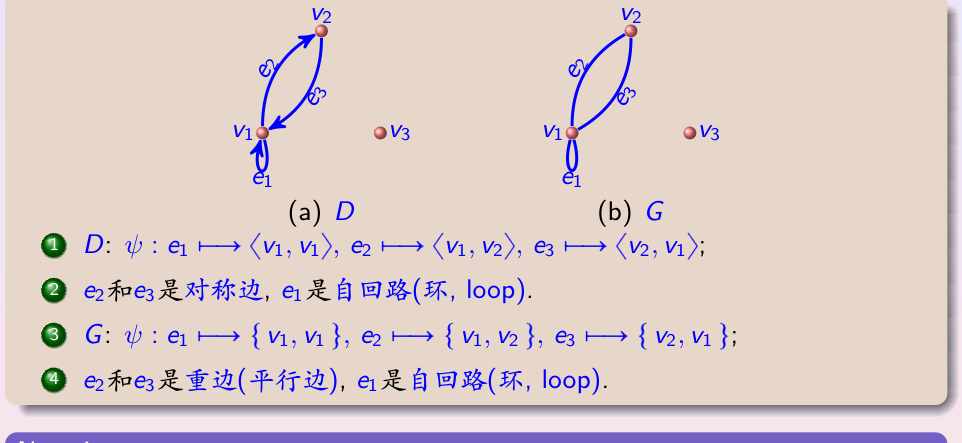
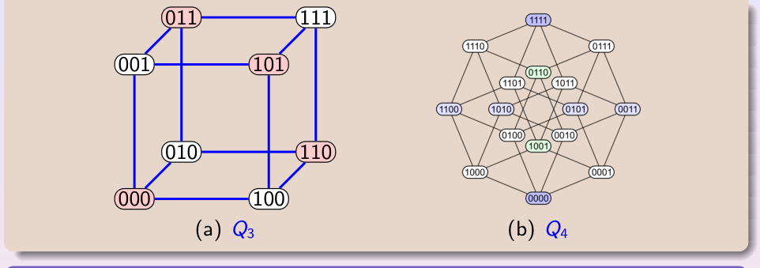
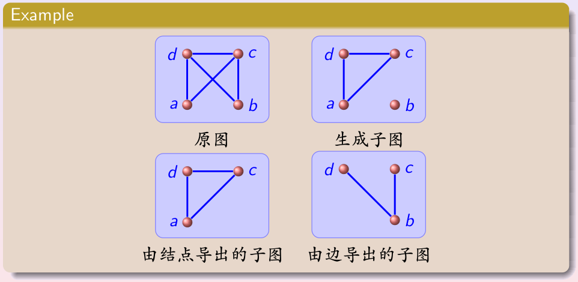
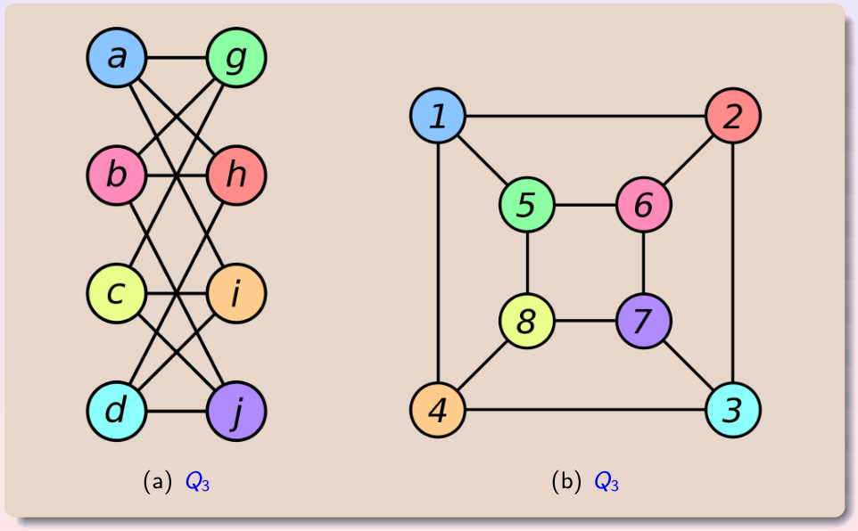
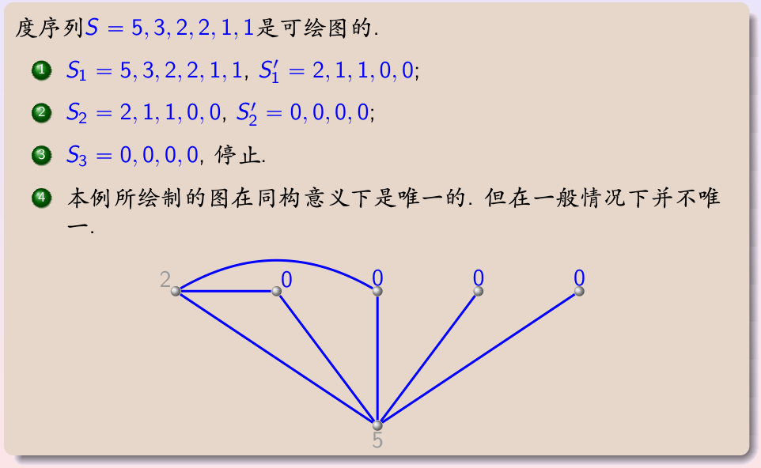
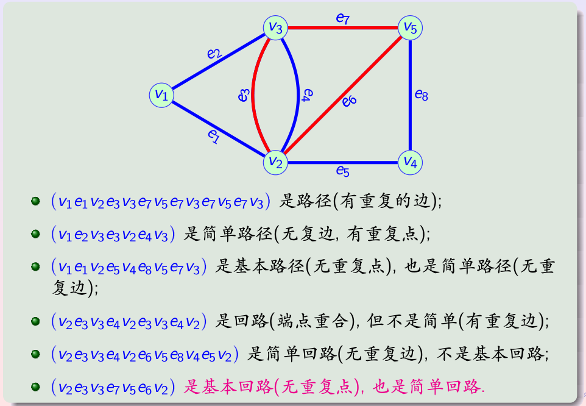
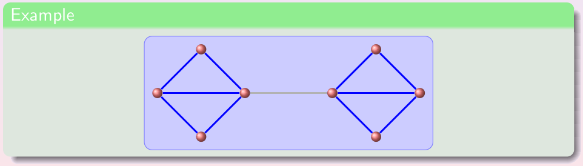
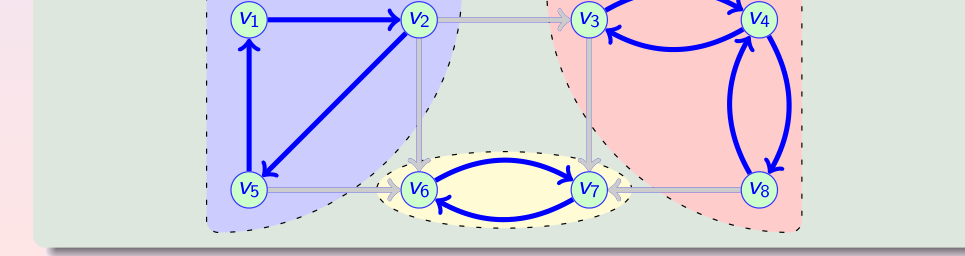
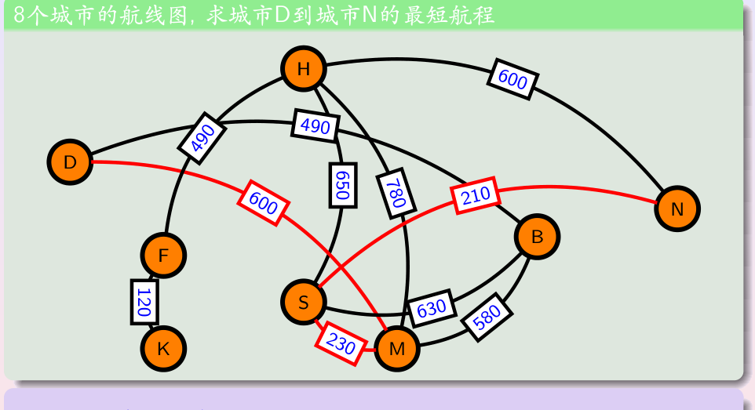
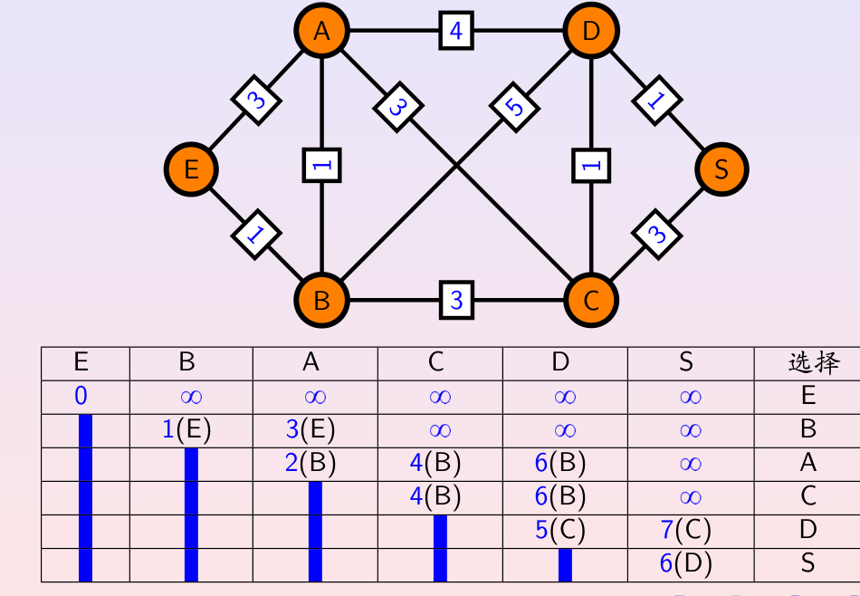

# 第7章 图论 - 学习笔记

> 本笔记以 Rosen《离散数学及其应用（原书第8版）》10.1、10.3、10.4、10.6 节为主线，融合武汉大学《图（基本概念）》《图（路径）》课件与 B 站课程讲解整理而成。欧拉回路、哈密顿回路、平面图、图着色、二分图匹配等专题归入第 9 章特殊图。

> **目录**
>
> - [[#1. 图的基本概念]]
> - [[#2. 几类基本的图]]
> - [[#3. 度数与握手定理]]
> - [[#4. 子图与图的运算]]
> - [[#5. 图的表示]]
> - [[#6. 图的同构]]
> - [[#7. 通路与连通性]]
> - [[#8. 最短通路问题]]
> - [[#9. 本章小结]]

---

## 1. 图的基本概念

### 1.1 图的引入

现实中大量问题涉及一组离散对象以及对象之间的某种二元联系：城市之间有无航线、两个人是否相识、网页之间是否有超链接、程序模块之间是否存在调用。若用**顶点**表示对象、用**边**表示对象之间的联系，就得到图模型。

图论（graph theory）一般追溯到 1736 年欧拉对哥尼斯堡七桥问题的研究，该问题将在第 9 章欧拉回路一节讨论。本章先建立图的形式化定义与基本术语。

### 1.2 图的定义

一个**图** $G$ 由顶点的非空集合 $V$ 和边的集合 $E$ 组成，记作 $G=\langle V,E\rangle$。$V$ 中的元素称为**顶点**（vertex，也称结点），$E$ 中的元素称为**边**（edge）。

为了精确刻画每条边与哪两个顶点相关联，武汉大学课件进一步用三元组 $G=\langle V,E,\psi\rangle$ 表示，其中 $\psi$ 是关联函数：

- 在**无向图**中，每条边对应两个顶点组成的二元子集，即 $\psi:E\to\mathcal P_2(V)$，$\psi(e)=\{u,v\}$，称 $u,v$ 是边 $e$ 的两个**端点**；
- 在**有向图**中，每条边对应一个有序对，即 $\psi:E\to V^2$，$\psi(e)=\langle u,v\rangle$，称 $u$ 为边的**始点**（弧尾，tail），$v$ 为边的**终点**（弧头，head）。

顶点数 $n=|V|$ 称为图的**阶**，边数记为 $m=|E|$。阶为 $1$ 的图称为**平凡图**。若顶点集和边集都是有限集，则称为有限图；否则称为无限图。本课程主要讨论有限图。

### 1.3 无向图的三种类型

根据是否允许重边和环，无向图分为三类。

**简单图（simple graph）**：每条边都连接两个不同的顶点，且任意两个顶点之间至多有一条边。换言之，简单图中没有环、也没有重边，每条边对应一个互不相同的无序顶点对。

**多重图（multigraph）**：允许同一对顶点之间存在多条边，这些边称为**重边**（平行边），重边的条数称为该顶点对的**多重度**。多重图可以含重边，但不含环。

**伪图（pseudograph）**：在多重图的基础上进一步允许**环**（loop，也称自回路），即两个端点是同一个顶点的边。伪图是最一般的无向图，环和重边都可能出现。

### 1.4 有向图与混合图

**有向图（directed graph）**：每条边对应一个有序顶点对 $\langle u,v\rangle$，方向从 $u$ 指向 $v$。有向图中可以出现环（$\langle u,u\rangle$，表示自指），也允许一对顶点之间同时存在 $\langle u,v\rangle$ 和 $\langle v,u\rangle$ 两条方向相反的边（表示互链）。

- 没有环、且任意有序对至多出现一次的有向图称为**简单有向图**；
- 允许同一有序对出现多条边的有向图称为**有向多重图**。

**混合图（mixed graph）**：同时含有无向边和有向边的图，用于刻画例如城市道路网中既有双向道路、又有单行道的情形。

### 1.5 自回路、对称边与重边

下面的例子集中说明有向图与无向图中几类特殊边的区别。

在有向图 $D$ 中：$\psi(e_1)=\langle v_1,v_1\rangle$，故 $e_1$ 是自回路（环）；$\psi(e_2)=\langle v_1,v_2\rangle$、$\psi(e_3)=\langle v_2,v_1\rangle$，二者方向相反，称为**对称边**。

在无向图 $G$ 中：$e_1$ 仍是自回路；而 $e_2,e_3$ 对应同一个二元子集 $\{v_1,v_2\}$，二者没有方向之分，称为**重边（平行边）**。

### 1.6 相邻、关联与其他基本术语

若一条边的两个端点是 $u,v$，则称 $u$ 与 $v$ **相邻**（adjacent），并称该边与顶点 $u$、$v$ **关联**（incident）。不与任何顶点相邻、度数为零的顶点称为**孤立点**，如图中的 $v_3$。

此外常用的术语还有：

- **简单图**：关联函数 $\psi$ 为单射的无向图，即没有重边；
- **空图**：边集为空的图（顶点仍可存在）；
- **赋权图（weighted graph）**：在图上再定义权函数 $\phi:E\to\mathbb R$，为每条边赋予距离、时间、费用等数值；
- **底图与定向图**：把有向图各边的方向去掉后得到的无向图称为其**底图**；反之，为无向图的每条边指定方向则得到**定向图**。

### 1.7 图模型

图是应用极广的建模工具。Rosen 教材给出了一批典型的图模型，按领域归纳如下。

| 应用领域 | 图模型 | 顶点 / 边的含义 | 图的类型 |
| --- | --- | --- | --- |
| 社交网络 | 交往（朋友）图 | 顶点为人，边表示两人是朋友 | 无向简单图 |
| 社交网络 | 影响图 | 边表示某人能影响另一人 | 有向图 |
| 社交网络 | 合作图（好莱坞图） | 边表示两人合作过影片 | 无向（多次合作为多重图） |
| 通信网络 | 呼叫图 | 边表示一个号码呼叫过另一号码 | 有向多重图 |
| 信息网络 | 万维网网络图 | 顶点为网页，边为超链接 | 有向图（含环、双向边） |
| 信息网络 | 引用图 | 边表示一篇文献引用另一篇 | 有向无环图 |
| 软件设计 | 模块依赖图 | 边表示一个模块依赖另一模块 | 有向图 |
| 软件设计 | 优先图 | 边表示一个语句须先于另一语句执行，用于并发控制 | 有向图 |
| 运输网络 | 航线图 | 顶点为城市，边为航班 | 无向 / 有向多重图 |
| 运输网络 | 道路网 | 边为道路，单行道定向、多车道为重边 | 混合图 |
| 生态网络 | 栖息地重叠图 | 边表示两个物种栖息于同一区域 | 无向简单图 |
| 生态网络 | 蛋白质相互作用图 | 边表示两种蛋白质发生相互作用 | 无向图 |
| 知识表示 | 语义网络 | 顶点为概念，边表示概念间的语义关系 | 有向图 |
| 体育竞赛 | 循环赛图 | 边表示两队比赛，由胜者指向负者 | 竞赛图（有向） |

判断一个实际问题对应哪类图时，可依次回答三个问题：边是否有方向？是否允许重边？是否允许环？据此即可确定应使用简单图、多重图、伪图还是有向图。

---

## 2. 几类基本的图

本节认识若干结构规则、应用频繁的图。它们在教材 10.2 节还会结合性质进一步讨论，这里先建立直观认识。

### 2.1 完全图

在 $n$ 个顶点的简单无向图中，若任意两个不同顶点之间都恰有一条边相连，则称为**完全图**，记作 $K_n$。

$K_n$ 中每个顶点与其余 $n-1$ 个顶点相连，故边数为

$$|E(K_n)|=\frac{n(n-1)}{2}.$$

对应的有向完全图中，任意两个不同顶点之间有方向相反的两条边，边数为 $n(n-1)$。

### 2.2 竞赛图

将无向完全图 $K_n$ 的每条边指定一个方向，所得到的有向图称为**竞赛图**（tournament），用于建模循环赛：每两队比赛一次，边由胜者指向负者。竞赛图中任意两个顶点之间恰有一条有向边。

### 2.3 二部图与完全二部图

若一个图的顶点集可以划分为两个互不相交的子集，使得每条边的两个端点分别落在两个子集中（同一子集内没有边），则称为**二部图**（二分图，bipartite graph）。

若二部图两个部分的顶点数分别为 $m$ 和 $n$，且一个部分的每个顶点都与另一部分的每个顶点相连，则称为**完全二部图**，记作 $K_{m,n}$，其边数为 $mn$。其中 $K_{1,n-1}$ 形如一个中心顶点连接其余所有顶点，称为**星**。

二部图的判定定理以及二部图上的匹配问题将在第 9 章详细讨论。

### 2.4 超立方体

**超立方体** $Q_n$ 是这样定义的：顶点是所有长度为 $n$ 的比特串，共 $2^n$ 个；两个顶点之间有边相连，当且仅当这两个比特串恰有一位不同（即汉明距离为 1）。

如上图，$Q_3$ 的 8 个顶点可画成立方体，$Q_4$ 有 16 个顶点。每个顶点的 $n$ 个比特位中任取一位翻转即得到一个相邻顶点，因此每个顶点的度数都是 $n$，边数为

$$|E(Q_n)|=2^{n-1}n.$$

按每个比特串中 1 的个数的奇偶性可将顶点分为两组，每条边恰好连接一奇一偶，故 $Q_n$ 一定是二部图。

---

## 3. 度数与握手定理

### 3.1 度数的定义

在无向图中，顶点 $v$ 的**度数**（degree）是以 $v$ 为端点的边的条数，记作 $\deg(v)$。一个环在其顶点处贡献度数 $2$（环的两端都是该顶点）。

在有向图中，度数进一步分为：

- **出度**（out-degree）：以 $v$ 为始点的边数，记作 $\deg^{+}(v)$；
- **入度**（in-degree）：以 $v$ 为终点的边数，记作 $\deg^{-}(v)$；
- **总度数**：$\deg(v)=\deg^{+}(v)+\deg^{-}(v)$。

### 3.2 最大度与最小度

图 $G$ 中各顶点度数的最大值和最小值分别记为

$$\Delta(G)=\max\{\deg(v)\mid v\in V\},\qquad \delta(G)=\min\{\deg(v)\mid v\in V\}.$$

$\Delta(G)$ 与 $\delta(G)$ 是描述图整体稠密程度的基本量，在连通度理论中还会用到。

### 3.3 握手定理

**握手定理（Handshaking Theorem）**：在无向图 $G=\langle V,E\rangle$ 中，所有顶点的度数之和等于边数的两倍：

$$\sum_{v\in V}\deg(v)=2m.$$

这是因为每条边都有两个端点，在度数总和中被恰好计算两次。该定理名称来自社交场合的类比：每一次握手涉及两个人，所有人握手次数之和必为偶数。

对有向图，每条边贡献一个出度和一个入度，因此

$$\sum_{v\in V}\deg^{+}(v)=\sum_{v\in V}\deg^{-}(v)=m.$$

### 3.4 推论：奇度顶点有偶数个

由握手定理，所有顶点度数之和为偶数。所有偶度顶点的度数之和本身是偶数，因此所有奇度顶点的度数之和也必须是偶数，而每个奇度顶点贡献一个奇数，故**奇度顶点的个数必为偶数**。

这一结论是判断一个度序列能否成图的基本必要条件。例如度序列 $(5,1)$ 中两个顶点度数之和为 $6$ 虽为偶数，但只有两个奇度点（偶数个），数量上满足；而度序列 $(3,3,3)$ 有三个奇度点，个数为奇数，必然不可能成图。

### 3.5 正则图

若图中每个顶点的度数都等于同一个常数 $k$，则称为 **$k$ 正则图**（$k$-regular graph）。由握手定理，$k$ 正则图的边数满足

$$m=\frac{kn}{2},$$

因此当 $k$ 为奇数时，顶点数 $n$ 必为偶数。

完全图 $K_n$ 中每个顶点度数都是 $n-1$，故 $K_n$ 是 $(n-1)$ 正则图。著名的彼得森图（Petersen graph）是 $3$ 正则图，在第 6 节同构和第 9 章哈密顿图中还会多次出现。

---

## 4. 子图与图的运算

### 4.1 子图

设 $G=\langle V,E\rangle$、$H=\langle V',E'\rangle$ 是两个图。若 $V'\subseteq V$ 且 $E'\subseteq E$，则称 $H$ 是 $G$ 的**子图**（subgraph）。若 $H$ 不等于 $G$，则称为**真子图**。

### 4.2 生成子图

若子图 $H$ 保留了原图的全部顶点，即 $V'=V$（仅删去部分边），则称为**生成子图**（支撑子图，spanning subgraph）。

### 4.3 导出子图

子图可以由指定的顶点集或边集唯一确定：

- **结点导出子图**：给定顶点子集 $V'\subseteq V$，取 $V'$ 为顶点，并取原图中两个端点都在 $V'$ 中的所有边，记为 $G[V']$；
- **边导出子图**：给定边子集 $E'\subseteq E$，取 $E'$ 为边，并取这些边的所有端点作为顶点。

上图对照了同一个原图的生成子图（顶点不变、删去部分边）、结点导出子图和边导出子图。

### 4.4 图的并、交与差

设 $G_1=\langle V_1,E_1\rangle$、$G_2=\langle V_2,E_2\rangle$，定义：

$$G_1\cup G_2=\langle V_1\cup V_2,\ E_1\cup E_2\rangle,$$

$$G_1\cap G_2=\langle V_1\cap V_2,\ E_1\cap E_2\rangle,$$

而 $G_1-G_2$ 是由边集 $E_1-E_2$ 导出的子图。

### 4.5 补图与自补图

设 $G$ 是 $n$ 阶简单无向图。在相同的 $n$ 个顶点上，把 $G$ 中缺失的边全部补上、已有的边全部去掉，所得的图称为 $G$ 的**补图**，记作 $\overline G$。形式化地，$G$ 与 $\overline G$ 满足

$$G\cap\overline G=\langle V,\varnothing\rangle,\qquad G\cup\overline G=K_n.$$

简单图与其补图的边数之和为 $\frac{n(n-1)}{2}$。若一个图与其补图同构，则称为**自补图**。

五边形 $C_5$ 是自补图：它的补图是五角星（五边形的对角线构成），而五角星与五边形同构。

### 4.6 两个经典结论

**结论一（拉姆齐型）**：把完全图 $K_6$ 的每条边染成红、蓝两色，则必存在一个三条边同色的三角形。证明取任一顶点，它连出 $5$ 条边，由鸽巢原理至少有 $3$ 条同色；再分析这 $3$ 个邻点之间的边即可导出同色三角形。这说明 $R(3,3)=6$。

**结论二（无三角形图的边数上界）**：不含三角形的 $n$ 阶简单图，其边数满足 $m\leq\frac{n^2}{4}$，等号由完全二部图 $K_{\lfloor n/2\rfloor,\lceil n/2\rceil}$ 取得。该结论称为曼特尔定理（Turán 定理的特例）。

---

## 5. 图的表示

要把图交给计算机处理，需要规定其存储方式。常用的有邻接表、邻接矩阵和关联矩阵三种。

### 5.1 邻接表

**邻接表**（adjacency list）为每个顶点建立一个表，列出与它相邻的所有顶点。无向图中每条边在其两个端点的表中各出现一次，有向图中每条边只出现在始点的表中。

邻接表节省空间，是稀疏图最常用的表示方法。

### 5.2 邻接矩阵

设图的顶点按某种顺序排列为 $v_1,v_2,\ldots,v_n$。**邻接矩阵**（adjacency matrix）$\mathbf A$ 是一个 $n\times n$ 矩阵：

- 对简单无向图，令 $a_{ij}=1$ 当且仅当 $\{v_i,v_j\}$ 是一条边，否则为 $0$。该矩阵是对称的，且主对角线全为 $0$（无环）；
- 对有向图，令 $a_{ij}=1$ 当且仅当存在边 $\langle v_i,v_j\rangle$，矩阵一般不对称；
- 对多重图，$a_{ij}$ 取连接 $v_i,v_j$ 的边的条数，不再只是 $0,1$。

例如四个顶点的无向图，其邻接矩阵形如

$$\mathbf A=\begin{pmatrix}0&1&1&0\\1&0&1&1\\1&1&0&0\\0&1&0&0\end{pmatrix}.$$

邻接矩阵依赖顶点的排列顺序，同一个图在不同顶点顺序下可产生 $n!$ 个形式不同但等价的矩阵。

### 5.3 关联矩阵

**关联矩阵**（incidence matrix）$\mathbf M$ 是顶点关于边的矩阵：设图有 $n$ 个顶点、$m$ 条边，令 $m_{ij}=1$ 当且仅当顶点 $v_i$ 与边 $e_j$ 相关联，否则为 $0$。

- 无向图中每条普通边对应恰有两个 $1$ 的列（其两个端点），环对应只有一个 $1$ 的列（但该环在顶点处仍贡献度数 $2$）；
- 多重图中重边对应完全相同的列。

### 5.4 稀疏图与稠密图

设图有 $n$ 个顶点。邻接表中无向图记录的顶点数约为 $2m$，当边数 $m\leq cn$（与顶点数同阶）时存储量为 $O(n)$；邻接矩阵则固定占用 $n^2$ 个位置。因此：

- **稀疏图**（边相对很少）适合用邻接表，可显著节省空间；
- **稠密图**（边很多）适合用邻接矩阵，且判断两顶点之间是否有边只需一次查表，为 $O(1)$；而邻接表需遍历该顶点的邻接点序列。

---

## 6. 图的同构

### 6.1 同构的定义

同一个图可以有差别很大的画法：顶点可以挪动位置，边可以画成直线或曲线。若两个图 $G=\langle V,E\rangle$ 和 $G'=\langle V',E'\rangle$ 之间存在顶点之间的双射 $\Phi:V\to V'$，使得任意两个顶点在 $G$ 中相邻当且仅当它们的像在 $G'$ 中相邻（边也随之建立保持关联的双射 $\Psi:E\to E'$），则称两图**同构**（isomorphic），记作 $G\cong G'$。

直观地说，同构的两个图本质上是同一个图，只是顶点的名称和图形的画法不同。同构是图之间的等价关系（自反、对称、传递）。

### 6.2 图形不变量

若两个图同构，则它们必然在一系列结构量上完全相同，这些量称为**图形不变量**，包括：顶点数相同、边数相同、对应顶点的度数相同（度序列相同，只是排列顺序可能不同）。

图形不变量相同只是同构的**必要条件而非充分条件**：两个图可以有相同的顶点数、边数和度序列却不同构。因此判定时，若发现任一不变量不同，即可断定不同构；但若不变量都相同，还需进一步检验。

### 6.3 同构判定示例

上图给出超立方体 $Q_3$ 的两种画法：图 (a) 按二部图方式把顶点排成两列，图 (b) 画成立方体。可以建立顶点对应使两图的邻接关系完全一致，故二者同构。这也说明识别同构时不应被顶点的摆放位置所迷惑，而应抓住"谁与谁相邻"这一结构信息。

### 6.4 邻接矩阵重排法

判定两个带标号图是否同构，等价于判断能否通过同时重排一个图邻接矩阵的行和列（即重新命名顶点），使之与另一个图的邻接矩阵完全相等。若能找到这样的顶点排列，则两图同构。

### 6.5 度序列

把图中各顶点的度数按非递增顺序排列所得到的序列称为**度序列**（degree sequence）。一个非递增的非负整数序列若能作为某个简单图的度序列，则称为**可绘图的**（graphical）。

度序列之和为偶数（握手定理）是可绘图的必要条件，但不充分。例如序列 $(3,3,3,1)$ 的度数之和为 $10$ 是偶数，但它不可绘成简单图。

### 6.6 Havel-Hakimi 算法

**Havel-Hakimi 算法**给出了判断度序列能否绘成简单图的构造性方法：

1. 将度序列按非递增顺序排列；
2. 删去第一个数 $k$，并把紧随其后的 $k$ 个数各减去 $1$（相当于把度数最大的顶点连到接下来的 $k$ 个顶点）；
3. 重新排列，重复上述过程；
4. 若最终得到全 $0$ 序列，则原序列可绘图；若过程中出现负数或剩余顶点不足，则不可绘图。

以 $S=(5,3,2,2,1,1)$ 为例：删去首数 $5$，后 $5$ 个数各减 $1$ 得 $(2,1,1,0,0)$；再删去首数 $2$，后 $2$ 个数各减 $1$ 得 $(0,0,0,0)$，故该序列可绘图，结果如上图。本例绘出的图在同构意义下唯一，但一般情况下同一度序列可对应多个不同构的图。

### 6.7 同构问题的复杂度与应用

一般图的同构判定在理论上地位特殊：长期以来既没有找到多项式时间算法，也没有证明它是 NP 完全问题。Babai 于 2017 年给出了准多项式时间算法，复杂度约为 $2^{O((\log n)^3)}$；实用工具 NAUTY 能在约 1 秒内判定上百个顶点的图。

图同构有重要应用：化学中把分子表示成原子—键图，通过同构判定识别相同化合物；电子设计自动化中通过比较电路图（网表）验证两个设计是否等价。

---

## 7. 通路与连通性

### 7.1 通路的术语

**通路**（途径，walk）是顶点与边交替出现的有限序列 $v_0,e_1,v_1,e_2,\ldots,e_k,v_k$，其中每条边 $e_i$ 连接 $v_{i-1}$ 与 $v_i$，$k$ 称为通路的**长度**。在简单图中可简写为顶点序列 $(v_0v_1\cdots v_k)$。

根据顶点和边是否允许重复，教材区分三个层次：

- **路径（walk）**：边和顶点都允许重复；
- **简单路径（trail，路线）**：所有边互不重复，但顶点允许重复；
- **基本路径（path，通路）**：所有顶点互不重复（边自然也不重复）。

类似地，起点与终点重合的通路称为**回路**：边不重复的称为**简单回路（circuit）**，除起点（也是终点）外其余顶点互不重复的称为**基本回路（cycle，圈）**。

上图在同一个图上给出六种对照：允许重复边的路径、无重复边但有重复点的简单路径、无重复点的基本路径，以及与之对应的回路、简单回路、基本回路。其包含关系为：基本路径必是简单路径，基本回路必是简单回路。

### 7.2 通路长度的上界

在 $n$ 个顶点的图中：

- 基本路径的顶点互不重复，故长度至多为 $n-1$；基本回路至多含 $n$ 条边；
- 简单路径边不重复，故长度至多为 $m$；简单回路长度也至多为 $m$。

经过每个顶点恰好一次的基本路径称为**哈密顿路径**，长度恰为 $n-1$，其存在性是第 9 章的专题。

### 7.3 有路径则有基本路径

**定理**：若顶点 $u$ 到 $v$ 之间存在一条路径，则一定存在一条从 $u$ 到 $v$ 的基本路径。

证明思路：若该路径上某顶点重复出现，则删去两次出现之间的一段回路，得到一条更短的路径；反复进行，直到没有重复顶点，即得到基本路径。

### 7.4 无向连通与连通分支

若无向图中任意两个顶点之间都存在通路，则称该图为**连通图**（connected graph）。图的**连通分支**（connected component）是其极大的连通子图：每个连通分支内部彼此可达，不同分支之间没有通路。

连通关系（两顶点之间有通路）是顶点集上的等价关系，连通分支正是这一等价关系的等价类。整个图可分解为若干互不相交连通分支的并。

### 7.5 割点与割边

若删去某个顶点及其关联边后，图的连通分支数增加，则该顶点称为**割点**（关节点，articulation point）。

若删去某条边后连通分支数增加，则该边称为**割边**（桥，bridge）。

上图中间连接两个菱形的那条边是割边：删去它后一个连通图分裂为两个连通分支。割边有一个重要刻画：**一条边是割边，当且仅当它不属于任何基本回路**。因为若边在某个回路上，删去它后仍可沿回路绕行，连通性不变。

### 7.6 点连通度与边连通度

为了衡量一个连通图"有多么连通"，引入两个量。

使图变得不连通所需删去的最少顶点数称为**点连通度**（vertex connectivity），记作 $\kappa(G)$；所需删去的最少边数称为**边连通度**（edge connectivity），记作 $\lambda(G)$。约定完全图 $K_n$ 的点连通度为 $\kappa(K_n)=n-1$，不连通图和平凡图的连通度为 $0$。若 $\kappa(G)\geq k$，则称图为 $k$ 连通的。

点连通度、边连通度与最小度数之间满足重要不等式

$$\kappa(G)\leq\lambda(G)\leq\delta(G).$$

其中 $\lambda(G)\leq\delta(G)$ 是因为删去度数最小顶点所关联的全部边（共 $\delta(G)$ 条）即可使其孤立；$\kappa(G)\leq\lambda(G)$ 则表明割断联系所需的顶点数不会多于边数。

### 7.7 有向图的连通性

有向图按其连通程度分为三级：

- **强连通**：任意两个顶点 $u,v$ 之间，既存在从 $u$ 到 $v$ 的通路，也存在从 $v$ 到 $u$ 的通路；
- **单向连通**：任意两个顶点之间至少有一个方向存在通路；
- **弱连通**：忽略边的方向后（在底图中）是连通的。

三者的关系为：强连通必单向连通，单向连通必弱连通；反之不然。

强连通关系（两顶点互相可达）是顶点集上的等价关系，其等价类导出的子图称为**强连通分支**（strongly connected component）。

上图的有向图有三个强连通分支：$\{v_1,v_2,v_5\}$、$\{v_3,v_4,v_8\}$ 和 $\{v_6,v_7\}$，图中用不同底色标出。注意把各强连通分支简单取并并不一定还原整个图，因为分支之间还可能有单向边相连。

### 7.8 用邻接矩阵计算通路数

邻接矩阵不仅能表示图，还能用来计算两顶点之间特定长度的通路数。

**定理**：设 $\mathbf A$ 是图 $G$ 的邻接矩阵，则 $\mathbf A^r$ 的第 $(i,j)$ 项等于从顶点 $v_i$ 到 $v_j$ 的长度为 $r$ 的通路（walk，允许重复）的条数。

证明对 $r$ 作归纳。$r=1$ 时，$\mathbf A$ 的 $(i,j)$ 项就是连接 $v_i,v_j$ 的边数，结论成立。假设结论对 $r$ 成立，则

$$(\mathbf A^{r+1})_{ij}=\sum_{k=1}^{n}(\mathbf A^r)_{ik}a_{kj},$$

其中 $(\mathbf A^r)_{ik}$ 是 $v_i$ 到 $v_k$ 长度为 $r$ 的通路数，$a_{kj}$ 是 $v_k$ 到 $v_j$ 的边数，求和即得到所有以 $v_j$ 为终点的长度 $r+1$ 的通路数。

教材中的例子表明，利用该定理可直接由矩阵幂算出例如从顶点 $a$ 到 $d$ 长度为 $4$ 的通路共有 $8$ 条，而不必逐条枚举。此外，"两顶点之间是否存在特定长度的简单回路"本身也是图形不变量，可用于证明两图不同构。

---

## 8. 最短通路问题

### 8.1 加权图

给图的每条边赋予一个数值（距离、时间、费用等），所得的图称为**加权图**（weighted graph）。在加权图中，一条通路的**长度**定义为通路上各边权值之和，这与无权图中用边数表示长度的用法不同。

上图为 8 个城市的航线图，边旁数字为两城之间的航程，要求城市 $D$ 到城市 $N$ 的最短航程。例如直连或绕行的若干候选路径中，$(D,M,S,N)$ 的航程为 $600+230+210=1040$，明显短于 $(D,M,H,N)$ 的 $1980$ 和 $(D,B,S,N)$ 的 $1330$。

### 8.2 最短通路问题

给定加权图和两个顶点，求权值之和最小的通路，称为**最短通路问题**。当所有边权均为非负（实际问题中距离、时间、费用通常如此）时，最短通路一定可以取为简单通路，因为绕回路只会增加总权。

### 8.3 Dijkstra 算法

荷兰数学家迪克斯特拉（E. W. Dijkstra）于 1959 年提出了求单源最短通路的经典算法，适用于所有权值都为正的图。

算法维护一个**特殊顶点集 $S$**，其中每个顶点都已经确定了从源点出发的最短距离；初始时 $S$ 只含源点。源点的标记置为 $0$，其余顶点标记置为 $\infty$。算法反复执行：

1. 在不属于 $S$ 的顶点中，选取当前标记最小的顶点 $u$，加入 $S$；
2. 借助新加入的顶点 $u$ 更新其余顶点的标记，即进行**松弛**：

$$L(v)=\min\{L(v),\ L(u)+w(u,v)\}.$$

其含义是：到 $v$ 的最短通路，要么不经过 $u$（保持原标记），要么由到 $u$ 的最短通路再接上边 $(u,v)$。当目标顶点被加入 $S$ 时，其标记即为最短距离；若让所有顶点都加入 $S$，则一次性求出源点到所有顶点的最短距离。

上图以 $E$ 为源点，表格逐行记录各顶点标记与每轮选择：初始仅 $E=0$，选 $E$；经 $E$ 得 $B=1$、$A=3$，选 $B$；经 $B$ 得 $A=2$、$C=4$、$D=6$，选 $A$；随后依次选 $C$（$D$ 更新为 $5$、$S=7$）、$D$（$S$ 更新为 $6$）、$S$。最终 $E$ 到各点的最短距离为 $B:1,A:2,C:4,D:5,S:6$。

### 8.4 正确性证明

Dijkstra 算法的正确性可用归纳法证明，归纳假设包含两条：

1. 第 $k$ 次迭代后，$S$ 中每个顶点的标记等于从源点到它的最短距离；
2. 不在 $S$ 中的顶点，其标记等于**只经过 $S$ 中顶点**的最短通路长度。

基础情形（$S$ 只含源点）显然成立。关键在于论证每轮被选中的顶点 $v$（标记最小）确实已取得全局最短距离：若存在一条更短的通路，它必经过某个尚未加入 $S$ 的顶点，设其中第一个这样的顶点为 $u$，则只经 $S$ 到 $u$ 的距离会小于 $v$ 的标记，与 $v$ 标记最小相矛盾。松弛更新则保证第二条假设继续成立。

### 8.5 复杂度

算法共进行不超过 $n-1$ 轮（每轮加入一个顶点）。每轮选出最小标记顶点需 $O(n)$ 次比较，更新各顶点标记也需 $O(n)$，故总时间复杂度为

$$O(n^2).$$

若用最小堆等优先队列实现选取最小标记顶点的操作，可进一步降低复杂度，这在数据结构课程中讨论。

### 8.6 Floyd 算法

Dijkstra 算法求的是从一个源点到其余各点的最短距离。若要求图中**所有顶点对**之间的最短距离，可使用 **Floyd（弗洛伊德）算法**：它以顶点为中间点逐步松弛，递推式为

$$d_{ij}^{(k)}=\min\{d_{ij}^{(k-1)},\ d_{ik}^{(k-1)}+d_{kj}^{(k-1)}\},$$

时间复杂度为 $O(n^3)$，适合顶点数不太多的稠密图。

### 8.7 旅行商问题

**旅行商问题**（Traveling Salesman Problem, TSP）要求在加权完全图中找一条经过每个顶点恰好一次并回到起点、总权最小的回路，即求最小权的哈密顿回路。

最直接的解法是枚举所有哈密顿回路。固定起点后，其余 $n-1$ 个顶点的排列有 $(n-1)!$ 种，又因正反两条回路相同，只需检查

$$\frac{(n-1)!}{2}$$

条回路。该数量增长极快：当 $n=25$ 时约为 $3.1\times10^{23}$ 条，即使每条只花 $1$ 纳秒也需约一千万年。

旅行商问题是 NP 完全问题，目前没有已知的多项式时间算法；实际中多采用**近似算法**，保证给出的回路长度不超过最优解的某个倍数（例如存在 $c=\frac{3}{2}$ 的近似算法），成熟的方法已能在几分钟内解决上千个顶点、误差控制在约 $2\%$ 以内的实例。

---

## 9. 本章小结

- 图由顶点集 $V$ 和边集 $E$ 组成，无向边对应二元子集、有向边对应有序对；按是否允许重边和环分为简单图、多重图、伪图，另有有向图与混合图。
- 完全图 $K_n$、竞赛图、完全二部图 $K_{m,n}$、超立方体 $Q_n$ 是结构规则的基本图；$K_n$ 有 $\frac{n(n-1)}{2}$ 条边，$Q_n$ 有 $2^n$ 个顶点、$2^{n-1}n$ 条边且必为二部图。
- 握手定理给出 $\sum\deg(v)=2m$，有向图中出度之和等于入度之和等于 $m$；由此奇度顶点必有偶数个。每个顶点度数均为 $k$ 的图称为 $k$ 正则图。
- 子图分为生成子图、结点导出子图和边导出子图；图可作并、交、差运算，简单图的补图 $\overline G$ 与原图合成 $K_n$，与补图同构的图称为自补图。
- 图可用邻接表、邻接矩阵、关联矩阵表示；稀疏图宜用邻接表，稠密图宜用邻接矩阵。
- 两图同构指存在保持相邻关系的顶点双射；顶点数、边数、度序列是必要非充分的图形不变量；Havel-Hakimi 算法可判定度序列是否可绘图。
- 通路按是否允许重复边、重复顶点分为路径、简单路径、基本路径及相应回路；连通分支是极大连通子图；割点和割边是删去后破坏连通性的顶点和边，割边不属于任何回路；点边连通度满足 $\kappa(G)\leq\lambda(G)\leq\delta(G)$。
- 有向图分为强连通、单向连通、弱连通，强连通分支由互相可达的顶点构成；邻接矩阵的 $r$ 次幂 $\mathbf A^r$ 的 $(i,j)$ 项给出长度为 $r$ 的通路数。
- Dijkstra 算法通过特殊顶点集与松弛操作求非负权图的单源最短通路，复杂度 $O(n^2)$；Floyd 算法在 $O(n^3)$ 内求全点对最短距离；旅行商问题求最小权哈密顿回路，是 NP 完全问题，常用近似算法求解。
