# 第8章 树 - 学习笔记

> 本笔记以 Rosen《离散数学及其应用（原书第8版）》第 11 章（11.1～11.5 节）为主线，融合武汉大学《树》课件与 B 站课程讲解整理而成。树是连通且不含简单回路的无向图，在搜索、排序、编码、博弈与网络优化等问题中有广泛应用。

> **目录**
>
> - [[#1. 树的基本概念]]
> - [[#2. 树的应用]]
> - [[#3. 树的遍历]]
> - [[#4. 生成树]]
> - [[#5. 最小生成树]]
> - [[#6. 本章小结]]

---

## 1. 树的基本概念

### 1.1 树的引入

树的概念最早由英国数学家阿瑟·凯莱（Arthur Cayley）在 19 世纪中叶研究**饱和碳氢化合物**（通式 $\mathrm{C}_n\mathrm{H}_{2n+2}$）的同分异构体时提出。给定碳原子数，分子有多少种不同的连接方式，本质上就是在计数某一类树。此后树发展成为描述层次结构与分支过程的基本数学工具。

本节先给出无向树的定义与基本性质，再引入有根树这一常用形式。

### 1.2 树的定义

**树（tree）** 是连通且不含简单回路的无向图。树中的顶点常称为**结点**。

由定义可立即得到两点：

- 树必为简单图。若含有重边，则两条重边与其两个端点构成长度为 2 的回路；若含有环，则环本身是长度为 1 的回路，二者都与“不含简单回路”矛盾。
- 树中去掉任意一条边都会变得不连通（否则该边位于某条回路上），因此树的每一条边都是割边（桥）。

**森林（forest）** 是每个连通分支都是树的无向图，即森林是若干棵互不相连的树组成的图，森林本身不含简单回路但不一定连通。

### 1.3 树的等价刻画

**定理 1** 设 $G$ 是无向图，则 $G$ 是树，当且仅当 $G$ 中任意两个顶点之间恰有一条简单通路。

**证明**

- 必要性：树连通，故任意两顶点 $u,v$ 之间至少有一条简单通路。若存在两条不同的简单通路，则二者的并中包含一条简单回路，与树无回路矛盾，故通路唯一。
- 充分性：任意两顶点之间都有通路，所以 $G$ 连通。若 $G$ 含有简单回路，则回路上任意两个顶点之间有两条简单通路，与“恰有一条”矛盾，故 $G$ 无简单回路。于是 $G$ 是树。

定理 1 表明，“连通而无回路”与“任意两顶点间唯一通路”是树的两种等价描述。

### 1.4 有根树

**有根树（rooted tree）** 是指定了一个顶点作为**根（root）** 的树。指定根之后，每条边都被理解为**背离根**的方向：从根出发沿唯一通路指向其余各顶点，从而得到一个有向图。

同一棵无向树选取不同的顶点作为根，会得到不同的有根树。一旦根确定，便可借用家族谱系的术语描述各结点：

- 若从根到 $v$ 的通路上经过 $u$，且 $u$ 与 $v$ 相邻，则称 $u$ 是 $v$ 的**父亲（parent）**，$v$ 是 $u$ 的**孩子（child）**；
- 同一个父亲的孩子互为**兄弟（sibling）**；
- 从根到 $v$ 的通路上（除 $v$ 外）的所有顶点称为 $v$ 的**祖先（ancestor）**；
- 以 $v$ 为祖先的所有顶点称为 $v$ 的**后代（descendant）**；
- 没有孩子的顶点称为**树叶（leaf）**，也叫叶子；
- 至少有一个孩子的顶点称为**内点（internal vertex）**，根也是内点（除非树只有一个顶点）。

**以 $v$ 为根的子树（subtree）** 是由 $v$ 及其全部后代连同相关边构成的子图，它本身是一棵以 $v$ 为根的有根树。

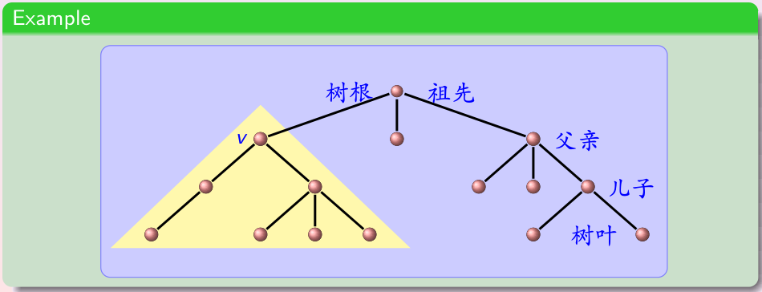

有根树也可以用归纳（递归）方式定义，这种定义与“连通无回路”的定义等价，且便于递归证明：

1. **归纳基础**：单个孤立点是一棵有根树；
2. **归纳步**：设 $T_1,T_2,\ldots,T_k$ 是分别以 $r_1,r_2,\ldots,r_k$ 为根的有根树，$r$ 是新的孤立点，从 $r$ 向各 $r_i$ 连一条边，则所得图是一棵以 $r$ 为根的有根树；
3. 只有经上述规则在有限步内构造出的图才是有根树。

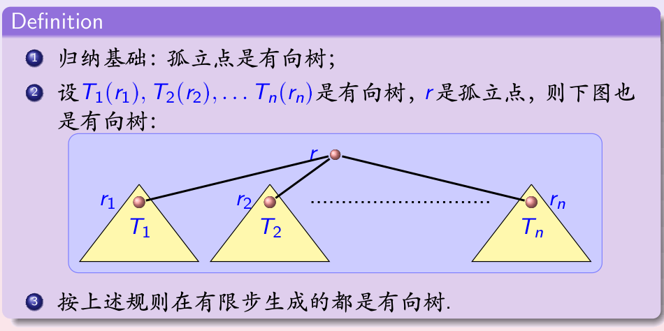

### 1.5 满 m 叉树与有序根树

若有根树中每个内点至多有 $m$ 个孩子，则称为 **$m$ 叉树（$m$-ary tree）**。每个内点恰有 $m$ 个孩子的 $m$ 叉树称为**满 $m$ 叉树（full $m$-ary tree）**。

最重要的情形是 $m=2$：每个内点至多有两个孩子的树称为**二叉树（binary tree）**，每个内点恰有两个孩子的二叉树称为满二叉树。在二叉树中，一个孩子被指定为**左孩子**、另一个为**右孩子**，分别对应**左子树**与**右子树**。即使某内点只有一个孩子，也必须说明它是左孩子还是右孩子。

若规定每个内点的孩子从左到右具有确定次序，则称为**有序根树（ordered rooted tree）**。若孩子的位置（而非仅仅次序）有意义，则称为位置树。二叉树是最常用的位置树。

为避免术语混淆，须注意不同教材对“完全”“完美”的用法。武汉大学课件采用如下区分：

- **$k$ 元树**：每个结点的孩子数不超过 $k$，$k=2$ 即二叉树；
- **完全 $k$ 元树（complete $k$-ary tree）**：每个内点（树枝）恰有 $k$ 个孩子，即满 $k$ 叉树；
- **完美 $k$ 元树（perfect $k$-ary tree）**：所有树叶深度相同的完全 $k$ 元树；
- **有序树**：孩子的排列次序有意义；
- **位置树**：每个孩子的位置有意义。

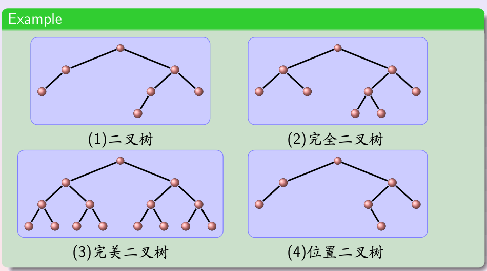

### 1.6 树作为模型

树为形形色色的层次结构与分支结构提供模型，下面给出若干典型例子。

**饱和碳氢化合物。** 在分子结构图中，碳原子的度为 $4$，氢原子的度为 $1$，整个分子构成一棵树。饱和碳氢化合物的通式为 $\mathrm{C}_n\mathrm{H}_{2n+2}$。例如 $\mathrm{C}_4\mathrm{H}_{10}$ 有两种同分异构体：直链的**丁烷**与支链的**异丁烷**；$\mathrm{C}_5\mathrm{H}_{12}$ 则有三种同分异构体。

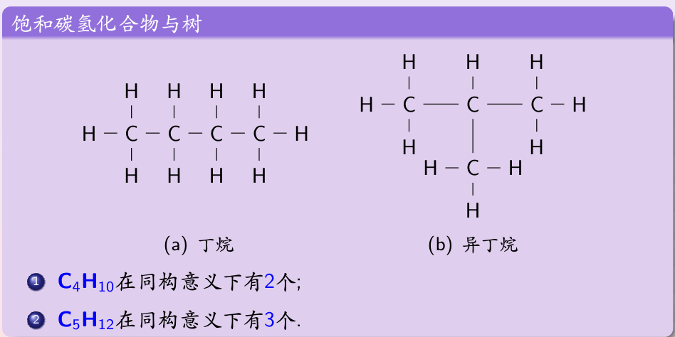

**组织机构图。** 用根表示最高负责人，其孩子表示直接下属，依次向下，树叶表示基层岗位。

**计算机文件系统。** 根目录是树的根，子文件夹是内点，文件是树叶，文件夹之间的包含关系对应父子关系。

**结构化文档。** XML、HTML 等标记语言的元素嵌套结构天然是一棵树：最外层元素是根，内层元素是其后代，文本内容位于树叶。下例把一段关于“有向树定义”的 XML 文档表示为树。

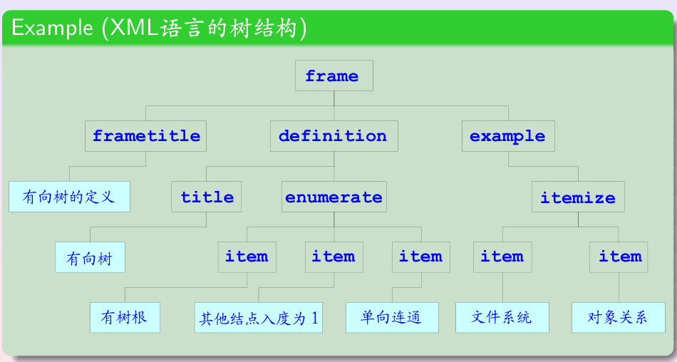

**树形连接的并行网络。** 用一棵完美二叉树连接多个处理器，根、内点、树叶都是处理器。以 $7$ 个处理器连接成的二叉树网络为例，$8$ 个数的相加可在 $3$ 步内完成：第 $1$ 步由 $4$ 个树叶处理器各接收两个数并相加，第 $2$ 步由两个内点处理器分别相加，第 $3$ 步由根处理器给出总和。一般地，$n=2^k$ 个数用 $n-1$ 个处理器可在 $k=\log_2 n$ 步内完成求和。

### 1.7 树的基本性质

**定理 2** 一棵含 $n$ 个顶点的树恰有 $n-1$ 条边。

**证明（对 $n$ 归纳）**

- 基础：$n=1$ 时树只有一个顶点、没有边，结论成立。
- 归纳：设结论对顶点数少于 $n$ 的树成立。任取树中一条边并删去，由于每条边都是割边，原图分成两棵树，设其顶点数分别为 $n_1,n_2$，则 $n_1+n_2=n$。由归纳假设，两棵树分别有 $n_1-1$、$n_2-1$ 条边，故原图边数为

$$(n_1-1)+(n_2-1)+1=n_1+n_2-1=n-1$$

结论成立。

定理 2 给出了树的边数特征。事实上，对一个无向图，下列三个条件中任意两个成立，就能推出它是树：

1. 图连通；
2. 图不含简单回路；
3. 图有 $n-1$ 条边。

例如，连通且有 $n-1$ 条边的图必无简单回路；无简单回路且有 $n-1$ 条边的图必连通。

**定理 3** 在满 $m$ 叉树中，若内点数为 $i$，则顶点总数满足

$$n=mi+1$$

**证明** 每个内点恰有 $m$ 个孩子，故所有内点的孩子总数为 $mi$。除根以外，每个顶点恰好是某个内点的孩子，因此孩子总数等于 $n-1$，于是 $n-1=mi$，即 $n=mi+1$。

**定理 4** 设满 $m$ 叉树有 $n$ 个顶点、$i$ 个内点、$l$ 片树叶，则

$$n=l+i,\qquad i=\frac{n-1}{m},\qquad l=\frac{(m-1)n+1}{m}$$

相应地，

$$n=\frac{ml-1}{m-1},\qquad i=\frac{l-1}{m-1}$$

**证明** 每个顶点不是内点就是树叶，故 $n=l+i$。代入 $n=mi+1$ 得 $l+i=mi+1$，整理即得上述各式。

**例（连锁信）** 一封连锁信要求每个收到信的人把信复制后寄给另外 $4$ 个人，因此这是一棵 $m=4$ 的满 $4$ 叉树，发信者为内点、不再转发者为树叶。若最终有 $l=100$ 个人收到信但没有继续寄出，则

$$i=\frac{l-1}{m-1}=\frac{99}{3}=33,\qquad n=l+i=133$$

即共有 $33$ 个人参与了转发，整个过程涉及 $133$ 个人。

**层数与高度。** 在有根树中，根的**层（level）** 规定为 $0$，其余顶点的层数等于从根到该顶点的通路长度。树的**高度（height）** $h$ 是树叶层数的最大值，即从根到树叶的最长通路长度。

若一棵树的所有树叶都位于第 $h$ 层或第 $h-1$ 层，则称该树是**平衡树（balanced tree）**。

**定理 5** 高度为 $h$ 的 $m$ 叉树至多有 $m^h$ 片树叶。

**证明（对 $h$ 归纳）**

- 基础：$h=0$ 时树只有根这一片树叶，而 $m^0=1$，结论成立。
- 归纳：根的每棵子树高度不超过 $h-1$，由归纳假设每棵子树至多有 $m^{h-1}$ 片树叶；根至多有 $m$ 棵子树，故树叶总数至多为

$$m\cdot m^{h-1}=m^h$$

**推论 1** 若一棵 $m$ 叉树有 $l$ 片树叶，则其高度满足

$$h\geq\left\lceil\log_m l\right\rceil$$

当树是满的且平衡时，等号成立，即 $h=\lceil\log_m l\rceil$。

推论 1 给出了树高关于树叶数的下界：要容纳 $l$ 个结果，树必须有足够的高度。

---

## 2. 树的应用

### 2.1 引言

本节运用树讨论三类问题：如何对一组元素进行排序与定位、如何根据一系列判断做出决策、如何用比特串有效地编码一组字符。它们分别对应二叉搜索树、决策树以及前缀码与哈夫曼编码；最后介绍树在博弈分析中的应用。

### 2.2 二叉搜索树

**二叉搜索树（binary search tree，BST）** 是一棵带有关键字的二叉树，每个顶点标记一个关键字，并满足：对任意顶点，其**左子树**中所有关键字都**小于**该顶点的关键字，其**右子树**中所有关键字都**大于**该顶点的关键字（假设关键字互不相同）。

这一性质称为二叉搜索树的**有序性**，它使得查找与插入可以沿一条自根向下的通路完成。

**插入与构造。** 从只含一个顶点（根）的树开始，依次处理各关键字。插入新关键字 $x$ 时，从根起比较：

- 若 $x$ 小于当前顶点关键字，则向左子树移动；若当前顶点没有左孩子，就把 $x$ 作为其左孩子插入；
- 若 $x$ 大于当前顶点关键字，则向右子树移动；若当前顶点没有右孩子，就把 $x$ 作为其右孩子插入。

**例** 按字母顺序依次插入单词 mathematics、physics、geography、zoology、meteorology、geology、psychology、chemistry，构造过程如下图。mathematics 是根；physics 在其后，成为右孩子；geography 在其前，成为左孩子；如此逐层比较定位。

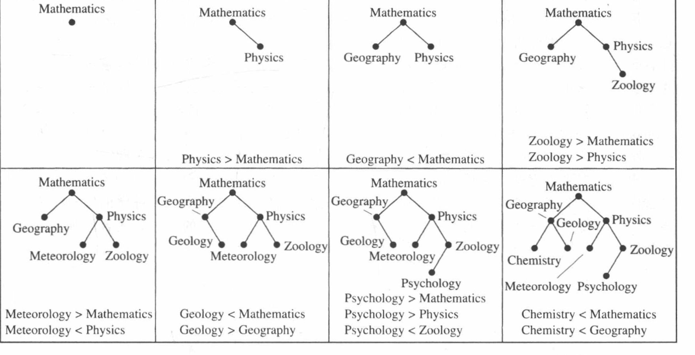

**查找。** 在树中查找关键字 $x$ 时同样从根开始：若当前顶点关键字等于 $x$，则查找成功；若 $x$ 较小则进入左子树，较大则进入右子树；若应进入的子树不存在，则 $x$ 不在树中。插入算法与查找算法合二为一：查找失败的位置正是新顶点的插入位置。

下面给出查找/插入算法的 Python 描述。

```python
class BSTNode:
    def __init__(self, key):
        self.key = key
        self.left = None
        self.right = None

def bst_insert(root, key):
    if root is None:
        return BSTNode(key)
    cur = root
    while True:
        if key < cur.key:
            if cur.left is None:
                cur.left = BSTNode(key)
                return root
            cur = cur.left
        else:
            if cur.right is None:
                cur.right = BSTNode(key)
                return root
            cur = cur.right

def bst_search(root, key):
    cur = root
    while cur is not None:
        if key == cur.key:
            return cur
        cur = cur.left if key < cur.key else cur.right
    return None
```

**复杂度。** 一次查找或插入所经过的顶点数等于从根到某顶点（或树叶）的通路长度，最坏情况下等于树高加 $1$。含 $n$ 个顶点的二叉树，其高度最小约为 $\lceil\log(n+1)\rceil-1$，因此当树**平衡**时，查找与插入至多需要 $\lceil\log(n+1)\rceil$ 次比较，即 $O(\log n)$。

若插入次序不当，树可能严重失衡，最坏情况下高度为 $n-1$（退化成一条链），此时查找与插入为 $O(n)$。为保证最坏情形的效率，需要使用 AVL 树、红黑树等**自平衡二叉搜索树**，在插入时自动重新平衡。

### 2.3 决策树

**决策树（decision tree）** 中，每个内点表示一次决策（一次比较或测试），从内点引出的各子树对应这次决策的每一种可能结果，树叶对应问题的一个解。问题的每个可能解，对应有根树中通向一片树叶的通路；解决问题所需的最多操作次数等于树的高度。

**例（找出较轻的伪币）** 设有 $8$ 枚外观相同的硬币，其中一枚较轻。用天平称重时每次有三种结果：左盘轻、平衡、右盘轻，因此决策树是一棵 $3$ 叉树。$8$ 枚硬币中的每一枚都可能是伪币，故至少需要 $8$ 片树叶，每片树叶对应一种结果。由推论 1，树高至少为

$$\left\lceil\log_3 8\right\rceil=2$$

所以用两次称重必能找出伪币：第一次把硬币分成三组（如 $1,2,3$ 与 $4,5,6$ 称，$7,8$ 暂不称），根据结果再称第二次即可定位。

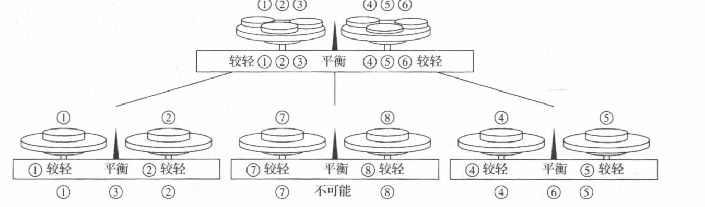

**基于二元比较的排序下界。** 对 $n$ 个互不相同的元素排序，共有 $n!$ 种可能的排列。任何只通过**二元比较**（一次比较两个元素）进行排序的算法，都可表示成一棵二叉决策树：每个内点表示一次比较，每片树叶表示一种排列。因此该树至少有 $n!$ 片树叶。

由推论 1，树高至少为 $\lceil\log_2(n!)\rceil$，即任何基于二元比较的排序算法在最坏情况下至少需要 $\lceil\log(n!)\rceil$ 次比较。利用斯特林公式可知

$$\log_2(n!)=\Theta(n\log n)$$

**定理 1** 基于二元比较的排序算法在最坏情况下至少需要 $\lceil\log(n!)\rceil$ 次比较，即比较次数为 $\Omega(n\log n)$。

这说明比较排序的最坏情形复杂度不可能优于 $O(n\log n)$，而归并排序、堆排序等达到了这一界，在此意义下是最优的。类似地可证明，比较排序的**平均**比较次数也是 $\Omega(n\log n)$。

**例（3 个元素排序的决策树）** 对 $a,b,c$ 三个元素排序，决策树如下：先比较 $a,b$，再根据结果比较 $a,c$ 或 $b,c$，$6$ 片树叶分别对应 $3!=6$ 种排列，树高为 $\lceil\log_2 6\rceil=3$。

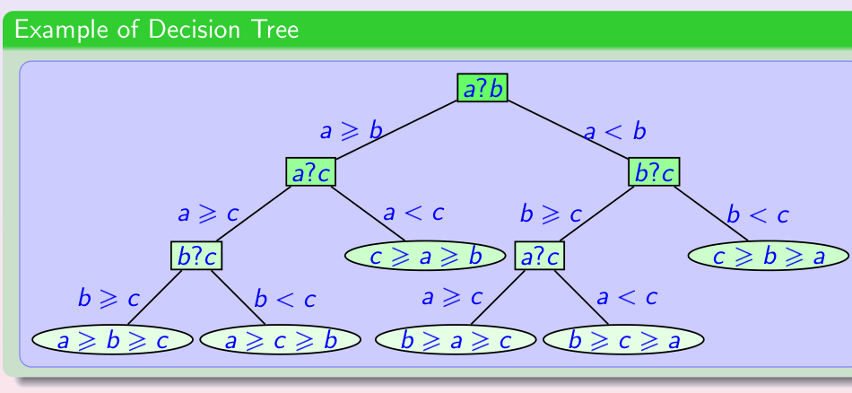

### 2.4 前缀码

考虑用比特串表示字符。若所有字符都用相同长度的比特串（定长码），例如用 $5$ 位表示一个英文字母，则编码后的数据较长。希望让出现频繁的字符用较短的码字、出现少的字符用较长的码字，以压缩数据的平均长度；但变长码必须能无歧义地分界。

**前缀码（prefix code）** 是满足下述条件的一组码字：任何一个码字都不是另一个码字的前缀。这样在连续的比特流中，从某一位置开始读到恰好构成一个码字时，就可以确定一个字符，不会与更长的码字混淆。

例如码字集合 $\{0,10,110,111\}$ 是前缀码：$e$ 编码为 $0$，$a$ 编码为 $10$，$n$ 编码为 $110$，$s$ 编码为 $111$。比特串 $10110$ 可唯一解码为 $an$。

前缀码可以用一棵二叉树表示：字符放在**树叶**上，通向左边孩子的边标记 $0$、通向右边孩子的边标记 $1$，每个字符的码字就是从根到其树叶的通路上各边标记的序列。因为字符都在树叶上，所以没有一个码字是另一个码字的前缀。

**解码** 时从根开始，依次读入比特：遇 $0$ 走左子树、遇 $1$ 走右子树，到达树叶便输出该字符并回到根，如此继续。

### 2.5 哈夫曼编码

**哈夫曼编码（Huffman coding）** 是构造最优前缀码的贪心算法，由大卫·哈夫曼（David Huffman）于 1951 年提出。给定各字符的频率，它构造一棵使编码平均长度最小的二叉树。

**构造方法。**

1. 初始时为每个字符建立一棵只含一个顶点的树，根的权等于该字符的频率，形成一片森林；
2. 选取权**最小**的两棵树，用一个新根把它们合并：权较大者作为左子树、权较小者作为右子树（约定左子树的边标 $0$、右子树的边标 $1$），新根的权为两棵子树权之和；
3. 重复上一步，直到森林中只剩一棵树。

每个字符的码字是从根到对应树叶的通路上的标记序列。

**例** 对频率分别为 $A:0.08$、$B:0.10$、$C:0.12$、$D:0.15$、$E:0.20$、$F:0.35$ 的六个符号，哈夫曼算法依次合并最小的两棵树，五步后得到完整编码树。所得码字为 $A:111$、$B:110$、$C:011$、$D:010$、$E:10$、$F:0$，每个字符的平均码长为

$$3(0.08+0.10+0.12)+3(0.15)+2(0.20)+1(0.35)=2.45\text{ 位}$$

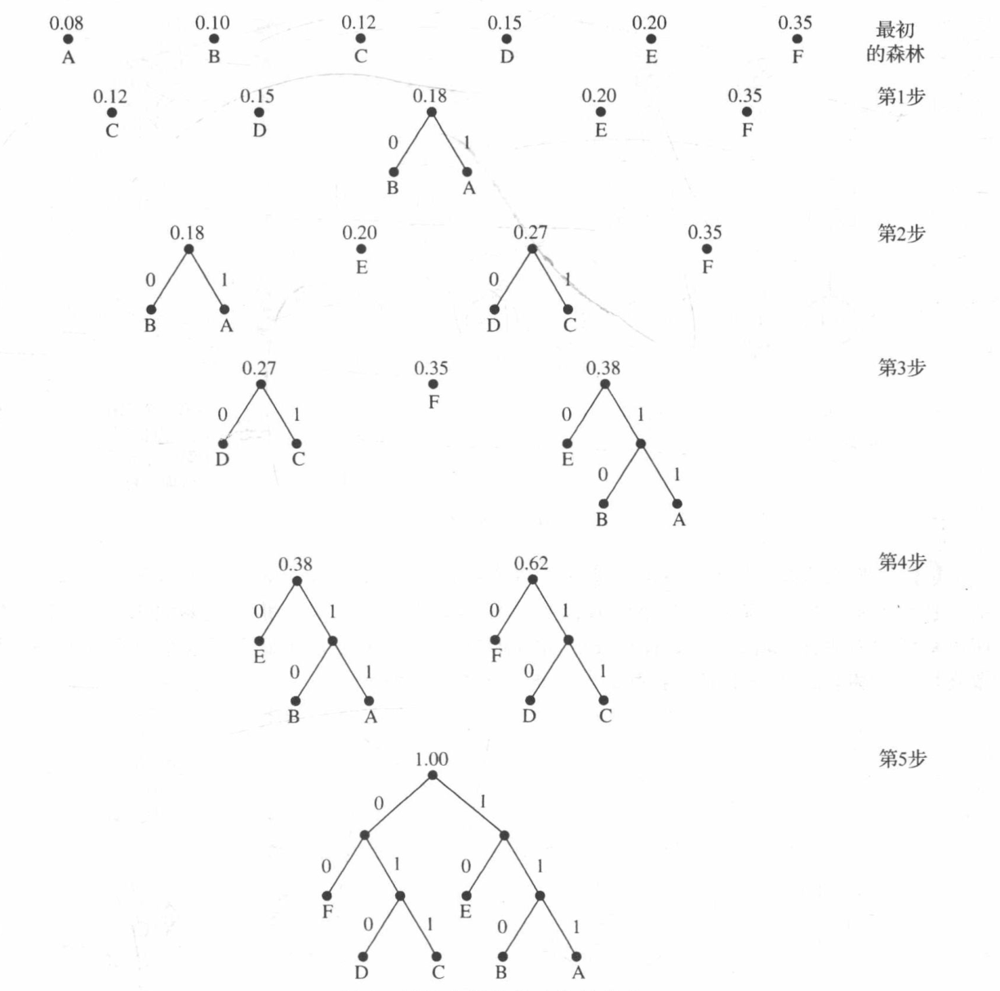

**最优性。** 哈夫曼编码是贪心算法：每一步只合并当前权最小的两棵树。可以证明，在所有前缀码中，哈夫曼编码使加权平均码长最小，因此它是给定频率下的最优前缀码（最优前缀码必能取为使两个频率最小的字符互为兄弟，这是贪心选择成立的依据）。

哈夫曼编码是数据压缩的基本算法，广泛用于文本、图像、视频的压缩。实际系统中还有许多变种，例如一次编码成块字符的成块编码，以及无需预先统计频率、在读入数据的同时动态更新编码的**自适应哈夫曼编码**。

### 2.6 博弈树

**博弈树（game tree）** 用于分析双方轮流进行的博弈，如井字游戏、取石子、国际象棋。树中顶点表示对局的局面，边表示合法的走法，树叶表示终局。

通常约定：用**方框**表示偶数层的局面（轮到先手），用**圆圈**表示奇数层的局面（轮到后手）。树叶标记终局时先手的得分：先手胜记 $+1$，后手胜记 $-1$，平局记 $0$。

**最小最大策略（minimax strategy）** 假设双方都采取最优走法，自树叶向上递归确定每个顶点的值：

- 轮到先手（方框，取最大）时，选择对自己最有利的走法，顶点值为其孩子值的**最大值**；
- 轮到后手（圆圈，取最小）时，选择对先手最不利的走法，顶点值为其孩子值的**最小值**。

树根的值就是双方都最优时对局的结果。

**例（取石子）** 设开局有三堆石子，分别含 $2,2,1$ 块，合法走法是从某一堆中取走一块或多块石子，无法走者负。其博弈树如下图，树叶中 $+1$ 表示先手胜、$-1$ 表示后手胜。自树叶按“方框取最大、圆圈取最小”逐层计算，根的值为 $+1$，因此在双方都最优时先手必胜。

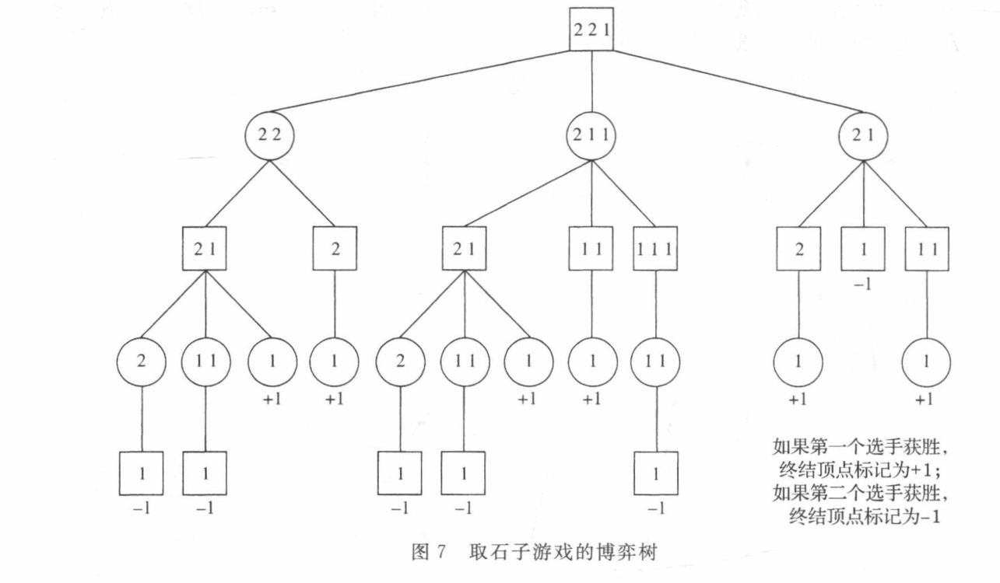

对于井字游戏，由于对称的局面等价，只需考虑少数几种初始走法即可分析；其完整博弈树虽大，但可由程序轻松构造。

**剪枝与求值函数。** 国际象棋等博弈的博弈树极其庞大（据估计可达 $10^{100}$ 个顶点），无法完整枚举。两类方法用于缩小搜索范围：

- **$\alpha$-$\beta$ 剪枝**：在自下而上求值时，剪掉那些已不可能影响祖先最终取值的子树，从而在不改变结果的前提下减少计算量；
- **求值函数**：不搜索到终局，而是对有限深度内的局面估计一个分值，用以近似局面的优劣。

IBM 的“深蓝”正是结合强大的并行硬件、$\alpha$-$\beta$ 剪枝与精细的求值函数，成为首个在正常规则下战胜国际象棋世界冠军的计算机程序。

---

## 3. 树的遍历

### 3.1 通用地址系统

为给有序根树的顶点规定一个统一次序，可使用**通用地址系统（universal address system）**：

- 根标记为 $0$；
- 根的孩子从左到右标记为 $1,2,\ldots,k$；
- 对标记为 $x$ 的顶点，其孩子从左到右标记为 $x.1,x.2,\ldots$；
- 一般地，第 $n$ 层顶点的标记形如 $x_1.x_2.\cdots.x_n$。

按标记的字典序排列顶点，就得到有序根树顶点的一个完全次序，称为**字典序**：先比较第一段，第一段相同再比较第二段，依此类推。

### 3.2 前序、中序与后序遍历

**树的遍历（tree traversal）** 是系统地访问树中每个顶点恰好一次的过程，常用的有三种递归方式。

**前序遍历（preorder traversal）**：先访问根，再从左到右依次对每棵子树进行前序遍历。前序遍历中顶点出现的次序与通用地址的字典序一致。

**中序遍历（inorder traversal）**：先对最左边的第一棵子树进行中序遍历，然后访问根，再从左到右对其余各子树进行中序遍历。对二叉树而言，即“左子树 → 根 → 右子树”。

**后序遍历（postorder traversal）**：先从左到右对每棵子树进行后序遍历，最后访问根。对二叉树而言，即“左子树 → 右子树 → 根”。

一种直观的快捷做法是沿有序根树的外围画一条连续曲线（外绕树一周）：

- 曲线**第一次**经过某顶点时列出它，得到前序遍历；
- 曲线第二次经过内点（或第一次经过树叶）时列出它，得到中序遍历；
- 曲线**最后一次**经过某顶点时列出它，得到后序遍历。

需要注意遍历序列与树的对应关系：给定前序（或后序）遍历序列以及每个顶点的孩子数，能唯一确定一棵有序根树；但**中序**遍历序列与树不是一一对应的，同一个中序序列可能对应多棵不同的树。

### 3.3 中缀、前缀与后缀记法

可以用一棵有序根树表示复合表达式：内点标记运算符，树叶标记变量或常量；一元运算符（如逻辑否定）对应只有一个孩子的内点。对表达式树分别作三种遍历，就得到表达式的三种书写形式。

**中缀形式（infix notation）** 由中序遍历得到：运算符位于其两个运算对象之间，如 $x+y$。中缀形式需要借助括号（或规定运算符优先级与结合性）才能无歧义，否则 $x+y\times z$ 可有不同的理解。

**前缀形式（prefix form）** 又称**波兰记法（Polish notation）**，由前序遍历得到：运算符位于其运算对象之前，如 $+xy$ 表示 $x+y$。前缀形式无二义性、无需括号，求值时从右向左进行。

**后缀形式（postfix form）** 又称**逆波兰记法（reverse Polish notation）**，由后序遍历得到：运算符位于其运算对象之后，如 $xy+$ 表示 $x+y$。后缀形式同样无二义性、无需括号，求值时从左向右进行，遇到运算符就把它前面相应个数的运算对象施以该运算。由于后缀表达式便于扫描求值，它被广泛用于计算器与编译器中。

**例** 表达式 $(x+y)\times((-z)\div u)$ 的表达式树如下图。三种遍历分别给出：

- 前序（前缀）：$\times+xy\div -zu$；
- 中序（中缀）：$x+y\times -z\div u$（需加括号才无歧义）；
- 后序（后缀）：$xy+z-u\div\times$。

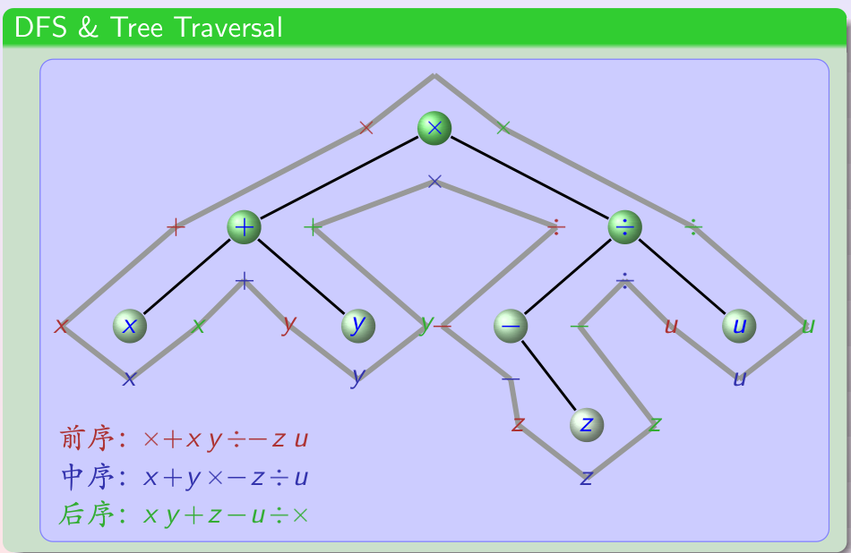

前缀与后缀表达式都是无二义性的，不必来回扫描即可求值，因此在计算机科学中大量使用，对编译器的构造尤为有用。

---

## 4. 生成树

### 4.1 生成树的定义

设 $G$ 是无向连通图，若 $G$ 的一个生成子图本身是树，则称它为 $G$ 的一棵**生成树（spanning tree）**。生成树包含 $G$ 的全部顶点，且是边数最少的连通生成子图（含 $n$ 个顶点、$n-1$ 条边）。

**定理** 一个图有生成树，当且仅当它连通。

**证明** 若图有生成树，则生成树连通且包含全部顶点，故原图连通。反之，若图连通且含有简单回路，可从回路中删去一条边，图仍连通；反复删去回路边，直到不再含回路，最终得到一棵包含全部顶点的树，即生成树。

**例** 下图给出一个连通图、它的两棵不同的生成树，以及一条哈密顿路径（沿生成树可构造经过各顶点的路径）。

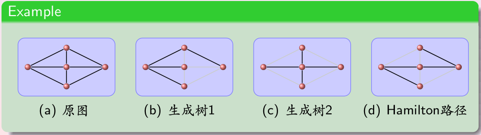

### 4.2 深度优先搜索

**深度优先搜索（depth-first search，DFS）** 又称**回溯（backtracking）**，是构造生成树的系统方法：

1. 任选一个顶点作为根，标记为已访问；
2. 沿一条通路不断前进：选取当前顶点的一个尚未访问的邻点，加入通路并连一条边，重复此过程；
3. 当当前顶点没有未访问的邻点时（走到“尽头”），沿通路上的边**后退**到上一个顶点，再尝试它的其他未访问邻点；
4. 如此前进、后退，直到所有顶点都被访问。

搜索过程中加入生成树的边称为**树边**，其余连接已访问顶点的边称为**背边（back edge）**。背边总是连接某个顶点与其祖先，且不属于任何生成树。

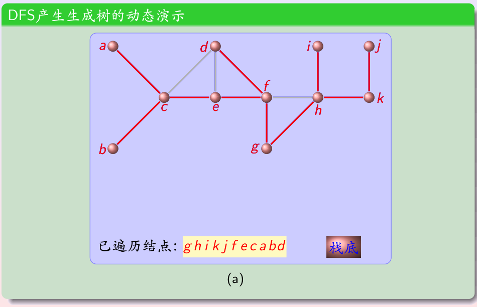

深度优先搜索中每条边至多被考察两次，时间复杂度为 $O(e)$（用邻接矩阵时为 $O(n^2)$）。它可用于求图中的简单回路、连通分支以及割点。

### 4.3 宽度优先搜索

**宽度优先搜索（breadth-first search，BFS）** 按层扩展：

1. 任选根顶点，作为第 $0$ 层；
2. 依次访问与根相邻的所有未访问顶点，构成第 $1$ 层，用树边连到根；
3. 再按顺序访问第 $1$ 层各顶点的所有未访问邻点，构成第 $2$ 层；
4. 逐层向外，直到所有顶点都被访问。

BFS 常用队列实现：顶点在被发现时入队、处理时出队。其非树边只连接同一层或相邻两层的顶点。BFS 的时间复杂度同样为 $O(e)$。

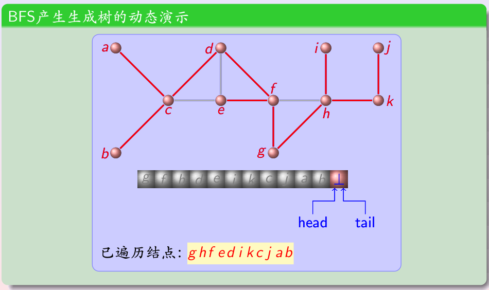

BFS 得到的生成树中，从根到任一顶点的通路是二者之间**边数最少**的通路，因此 BFS 可用于求无权图的最短通路，也可用于判定一个图是否为二分图。DFS 倾向于一条路走到底，BFS 倾向于逐层铺开；稠密图常用 DFS，稀疏图常用 BFS。

### 4.4 回溯的应用

深度优先搜索的回溯过程可看作在一棵决策树上穷举各种选择，应用十分广泛：

- **图着色**：逐个顶点尝试可用颜色，冲突时后退换色，可判定一个图能否用指定数目的颜色着色；
- **$n$ 皇后问题**：逐行放置皇后，若新皇后与已放置者冲突则后退；
- **子集和问题**：通过决定“取或不取”每个元素来搜索和为目标值的子集。

这类问题在最坏情况下需要指数时间，但回溯通过及早剪除冲突分支，往往能显著减少实际搜索量。

### 4.5 有向图的深度优先与宽度优先搜索

DFS 与 BFS 同样适用于有向图，但搜索树不一定包含全部顶点，结果可能是一片**生成森林**：当从当前顶点无法到达任何未加入的顶点时，算法选取一个新顶点作为另一棵树的根。

有向图上的深度优先搜索可用于：判断有向图是否含有向回路、对顶点进行拓扑排序、求有向图的强连通分支。

### 4.6 网络蜘蛛

**网络蜘蛛（web spider）** 是搜索引擎用来遍历网页的程序，其遍历方式正是图搜索：把网页视为顶点、超链接视为有向边。蜘蛛从一组高质量的**种子**网页出发，沿链接访问并索引网页。

实际系统综合使用 BFS 与 DFS 思想：用 BFS 从种子站点出发建立索引、保证热门站点被优先覆盖，用 DFS 沿一条链接深入以发现冷门页面。Google 等搜索引擎还会根据网页被链接的程度（PageRank）等策略安排访问次序。

---

## 5. 最小生成树

### 5.1 最小生成树的定义

设 $G=\langle V,E,w\rangle$ 是简单连通赋权图，其中权函数 $w:E\to\mathbb{R}^+$ 给每条边赋予一个非负权值。生成树 $T$ 中所有边的权值之和称为 $T$ 的**权**。在 $G$ 的所有生成树中权值最小的那棵称为**最小生成树（minimum spanning tree，MST）**。

由于连通图的生成树只有有限棵，最小生成树一定存在。最小生成树可用于管网、道路、通信线路等的设计：在保证所有地点连通的前提下，使总造价最小。

**例** 下图给出一个赋权图、一棵权为 $30$ 的生成树，以及权为 $24$ 的最小生成树。

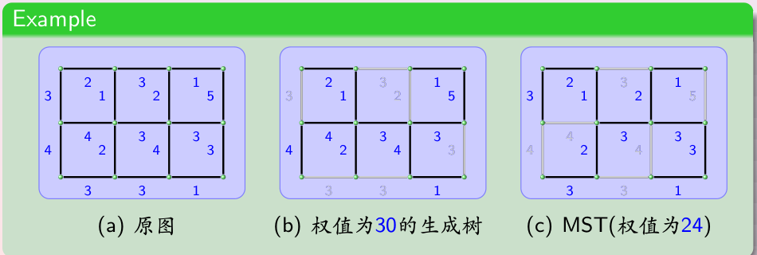

### 5.2 Prim 算法

**Prim 算法**从一个顶点出发逐步扩展生成树：

1. 任选图中权最小的一条边及其端点作为初始树；
2. 在所有一端位于当前树中、另一端不在树中、且加入后不形成简单回路的边里，选取权**最小**的一条，把它连同新顶点加入树；
3. 重复上一步，直到树中含有 $n-1$ 条边（包含全部顶点）。

Prim 算法每一步都让树“向外生长”一个顶点，树始终保持连通。

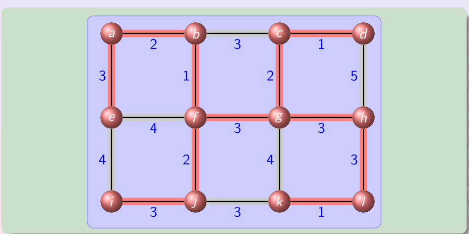

Prim 算法的正确性可用**交换论证**证明：设算法某一步加入边 $e$，若最终存在一棵不含 $e$ 的最小生成树，可在该树中找到另一条跨越“树内—树外”分界的边 $e'$，由算法选取规则有 $w(e)\leq w(e')$，用 $e$ 替换 $e'$ 不会增大总权，从而存在一棵包含 $e$ 的最小生成树；逐步推进即知算法结果是最小生成树。借助优先队列，Prim 算法可在 $O(e\log n)$ 时间内实现。

### 5.3 Kruskal 算法

**Kruskal 算法**从边的角度构造，不要求中间过程连通：

1. 把所有边按权从小到大排序；
2. 依次考察各边，若加入该边**不形成简单回路**，就把它选入；
3. 直到选入 $n-1$ 条边为止。

Kruskal 算法每次选择权最小且不构成回路的边，初始时各顶点彼此独立，随着边的加入逐渐连成一棵（或若干棵）树，最终合并成最小生成树。判断一条边是否会形成回路，可用并查集（不相交集合）数据结构高效完成。

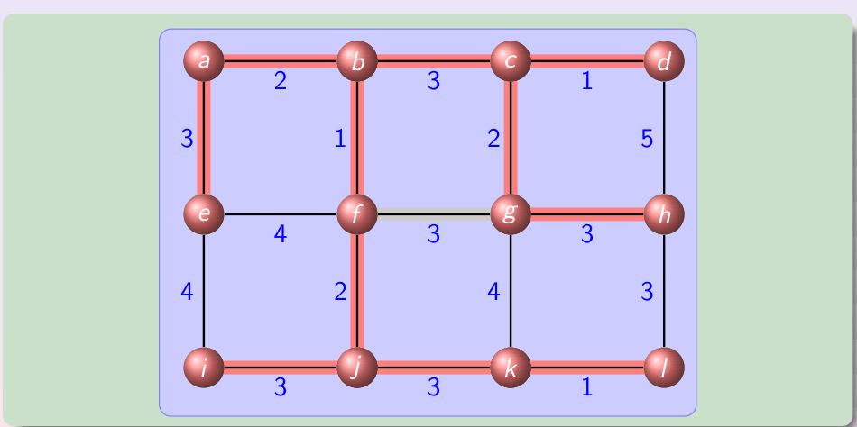

Kruskal 算法的时间复杂度主要取决于排序，为 $O(e\log e)$（即 $O(e\log n)$）。在稀疏图上，Kruskal 算法通常比 Prim 算法更高效。

### 5.4 算法的正确性

下面用武汉大学课件给出的引理证明 Kruskal 算法的正确性。

**引理** 设 $T$ 是 $G$ 的最小生成树，$C$ 是 $G$ 上任意一条简单回路，则该回路上权最大的边 $e$ 一定不在 $T$ 中。

**证明（反证法）** 设权最大的边 $e$ 在 $T$ 中，其端点为 $a,b$。删去 $e$ 后，$T-\{e\}$ 分成两个连通分支 $T_1,T_2$。由于 $a,b$ 还可沿回路 $C$ 的其余部分相连，回路上必存在另一条边 $e'$（$e'\neq e$）跨越 $T_1,T_2$。于是 $(T-\{e\})\cup\{e'\}$ 也是一棵生成树，而 $w(e')\leq w(e)$，故其权不大于原树；当权值互不相同时严格更小，这与 $T$ 是最小生成树矛盾。

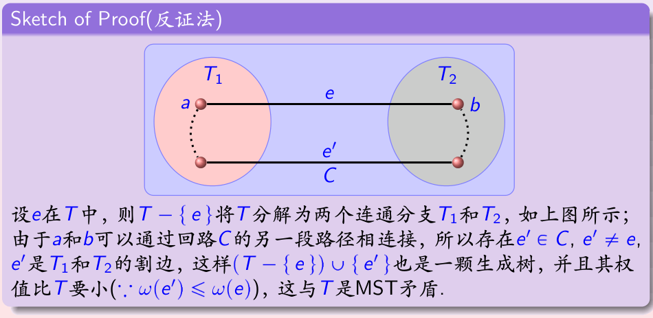

由引理可推出 Kruskal 算法的正确性：算法每加入一条边都不形成回路，最终得到生成树；而它总是按权递增选边，任何被跳过的边都会与已选边构成回路、且是该回路上权最大的边，本就不属于最小生成树。因此算法选出的边构成一棵最小生成树。

### 5.5 其他算法与变种

- **Sollin 算法**：算法过程中维护若干棵树，每棵树同时选出连接它与其他树的最小权边，成组地加入；如此直到连成一棵树。它兼有 Prim 与 Kruskal 的特点，适合并行实现。
- **唯一性**：当图中所有边的权互不相同时，最小生成树唯一。
- **最大生成树**：把“权最小”改为“权最大”，可求总权最大的生成树（如使收益最大）。
- **最小生成森林**：对不连通的图，可对每个连通分支分别求最小生成树，合起来得到最小生成森林。

---

## 6. 本章小结

本章围绕树的定义、性质、应用、遍历与生成树、最小生成树展开，主要结论如下。

- 树是连通且不含简单回路的无向图，等价地，任意两顶点之间恰有一条简单通路；森林的每个连通分支都是树。
- 有根树指定根并把边理解为背离根的方向，配有父母、孩子、祖先、后代、树叶、内点、子树等术语；满 $m$ 叉树每个内点恰有 $m$ 个孩子，二叉树区分左、右子树。
- 含 $n$ 个顶点的树有 $n-1$ 条边；满 $m$ 叉树满足 $n=mi+1$，并有 $l=\dfrac{(m-1)n+1}{m}$；高度为 $h$ 的 $m$ 叉树至多有 $m^h$ 片树叶，故有 $l$ 片树叶时 $h\geq\lceil\log_m l\rceil$。
- 二叉搜索树支持 $O(\log n)$ 的查找与插入（平衡时）；决策树给出找伪币等问题的操作次数，并证明比较排序最坏情况下需要 $\Omega(n\log n)$ 次比较。
- 前缀码的码字互不为前缀，可用树叶放字符的二叉树表示；哈夫曼编码通过反复合并权最小的两棵树，构造出平均码长最小的最优前缀码。
- 博弈树用方框（先手取最大）、圆圈（后手取最小）描述双方最优对局，根值即对局结果；$\alpha$-$\beta$ 剪枝与求值函数用于处理规模庞大的博弈。
- 树的遍历有前序、中序、后序三种，分别对应表达式的前缀（波兰）、中缀、后缀（逆波兰）记法；前/后序配合孩子数可唯一确定树。
- 生成树包含全部顶点且有 $n-1$ 条边，连通图必有生成树；DFS（回溯）与 BFS 是两种基本构造方法，分别适合求回路、割点与最短通路、判二分图。
- 最小生成树由 Prim（从树向外加最小边）与 Kruskal（按权加不构成回路的边）构造，是连通赋权图中总权最小的生成树。

**常见易错点**

- 树必为简单图，不能有环或重边；树中每条边都是割边。
- “完全二叉树”“满二叉树”“完美二叉树”的术语在不同教材中含义不同，应以具体定义为准。
- 二叉树中只有一个孩子时，仍须区分它是左孩子还是右孩子。
- 前缀码要求字符位于树叶；若字符出现在内点，就会出现一个码字是另一个码字前缀的问题。
- 中缀表达式不加括号可能有二义性，前缀、后缀表达式则无需括号。
- Prim 选边要求一端在当前树中，Kruskal 选边只要求不形成回路、不要求与树相连，二者选边范围不同。
