# 第9章 特殊图 - 学习笔记

> 本笔记以 Rosen《离散数学及其应用（原书第8版）》第 10 章的 10.2、10.5、10.7、10.8 节为主线，融合武汉大学《图》系列课件（路径、二分图、平面图）与 B 站课程讲解整理而成。本篇在第 7 篇图论基础（基本术语、图的表示、同构、连通性、最短路）之上，研究几类结构特殊的图：完全图/圈图/轮图/立方体图、二分图与匹配、欧拉图、哈密顿图、平面图与图着色。

> **目录**
>
> - [[#1. 特殊简单图]]
> - [[#2. 二分图]]
> - [[#3. 匹配]]
> - [[#4. 欧拉通路与回路]]
> - [[#5. 哈密顿通路与回路]]
> - [[#6. 平面图]]
> - [[#7. 图着色]]
> - [[#8. 本章小结]]

---

## 1. 特殊简单图

本节定义四类在图论中反复出现的简单图，它们既是构造更复杂图的基本构件，也是检验度、同构、色数等概念的标准例子。

### 1.1 完全图

**完全图（complete graph）** $K_n$ 是以 $n$ 个顶点为顶点集、在每一对不同顶点之间都恰有一条边的简单图。

$K_n$ 的边数为

$$|E(K_n)|=\binom{n}{2}=\frac{n(n-1)}{2}$$

每个顶点与其余 $n-1$ 个顶点相邻，故 $K_n$ 是 $(n-1)$ 正则图。若一个简单图至少有一对不同顶点之间没有边相连，则称它为**非完全图**。

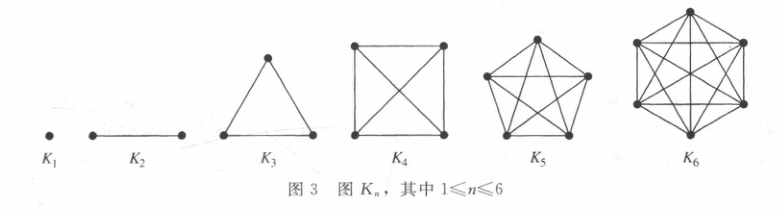

$K_1$ 是单个孤立顶点，$K_2$ 是一条边，$K_3$ 是三角形，此后顶点数每增加一个，新顶点都要与此前列出的所有顶点相连，因此边数增长很快——这也是后面讨论互连网络时全连接结构代价过高的原因。

### 1.2 圈图

**圈图（cycle）** $C_n$（$n\ge 3$）由 $n$ 个顶点 $v_1,v_2,\ldots,v_n$ 以及边

$$\{v_1,v_2\},\{v_2,v_3\},\ldots,\{v_{n-1},v_n\},\{v_n,v_1\}$$

组成。

$C_n$ 有 $n$ 个顶点、$n$ 条边，每个顶点的度都是 2，是 2 正则图，首尾相接形成一个闭合的环。

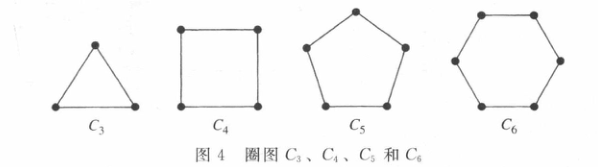

### 1.3 轮图

**轮图（wheel）** $W_n$（$n\ge 3$）是在圈图 $C_n$ 的基础上再添加一个顶点，并把这个新顶点与 $C_n$ 的 $n$ 个顶点逐一相连得到的图。

$W_n$ 有 $n+1$ 个顶点、$2n$ 条边。新增的顶点称为**轮毂（中心）**，它的度为 $n$；圈上每个顶点除圈上两条边外还与中心相连，度为 3。$W_3$ 即 $K_4$。

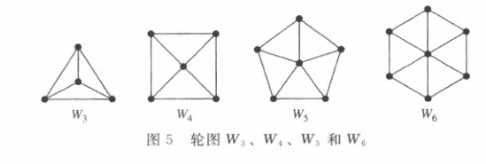

轮图的命名很形象：外圈的圈是“轮缘”，中心是“轮毂”，中心连向圈上各点的边是“辐条”。

### 1.4 n立方体图

**$n$ 立方体图（n-cube）** $Q_n$ 用全部 $2^n$ 个长度为 $n$ 的比特串作为顶点，两个顶点相邻当且仅当它们所表示的比特串恰好有一位不同。

$Q_n$ 有 $2^n$ 个顶点。每个比特串有 $n$ 位，改变其中任意一位得到一个相邻顶点，故每个顶点的度都是 $n$，$Q_n$ 是 $n$ 正则图；由握手定理，边数为

$$|E(Q_n)|=\frac{n\cdot 2^n}{2}=n\,2^{n-1}$$

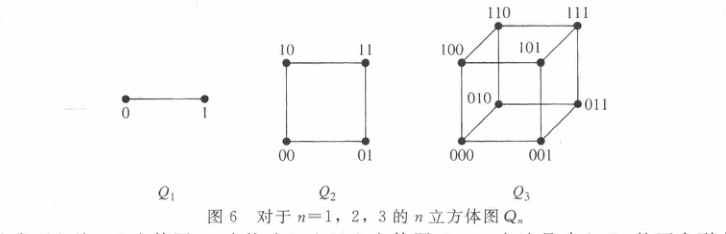

$Q_1$ 是一条边（顶点 $0,1$），$Q_2$ 是一个正方形（顶点 $00,01,10,11$），$Q_3$ 是立方体的平面投影。

$Q_{n+1}$ 可由 $Q_n$ 构造：取 $Q_n$ 的两个副本，在一个副本的所有顶点标记前加 $0$，在另一个副本的所有顶点标记前加 $1$，再把标记仅在第一位不同的成对顶点连接起来，这与三维立方体由两个正方形（顶面、底面）叠加而成的过程一致。$Q_n$ 是并行计算机中**超立方体互连网络**的拓扑结构（见 4.6 节）。

---

## 2. 二分图

### 2.1 二分图的定义

**二分图（bipartite graph，二部图）** 是这样的简单图：其顶点集可以划分为两个互不相交的非空子集 $V_1$ 和 $V_2$，使得图中每条边都连接 $V_1$ 中的一个顶点与 $V_2$ 中的一个顶点。换言之，$V_1$ 内部和 $V_2$ 内部都没有边。称 $(V_1,V_2)$ 为顶点集的一个**二部划分**。

二分图刻画的是“两类对象之间发生关系”的结构。例如婚姻关系图中顶点分男女，每条边（婚姻）总是连接一名男性与一名女性；任务分配图中顶点分员工与工作，边表示某员工能胜任某工作。

### 2.2 二分图的判定

一个图是否为二分图，有两个等价的实用准则。

**定理 1（二色判定）** 一个简单图是二分图，当且仅当可以用两种颜色对其顶点着色，使得任意两个相邻顶点颜色不同。

**证明** 若 $G$ 是二分图，二部划分为 $V_1,V_2$，给 $V_1$ 着一种颜色、$V_2$ 着另一种颜色，则每条边两端异色。反之，若能用两色这样着色，把两种颜色的顶点分别归为 $V_1,V_2$，则每条边都跨两组，$G$ 是二分图。$\square$

**定理 2（无奇圈判定）** 一个简单图是二分图，当且仅当它不含长度为奇数的圈（奇圈）。

**证明思路** 二分图中，从某顶点出发沿通路再回到该顶点，每经过一条边就切换一次所在子集，回到起点必须切换偶数次，故所有圈长为偶数。反之，对不含奇圈的连通图，从任一顶点出发按通路长度的奇偶性给顶点分两类，可证明同一类内没有边（否则形成奇圈），从而得到二部划分。$\square$

例如 $C_6$ 是二分图（偶圈），可按位置奇偶把顶点分成 $\{v_1,v_3,v_5\}$ 与 $\{v_2,v_4,v_6\}$；$K_3$ 即 $C_3$，是奇圈，不是二分图。

**BFS 判定算法**：实际判别一个图是否为二分图，可在宽度优先搜索过程中进行二着色。从某个顶点开始赋予一种颜色，每访问一个未着色顶点就赋予与其父顶点相反的颜色；若发现某顶点与已着色的相邻顶点同色，则存在奇圈、图不是二分图。

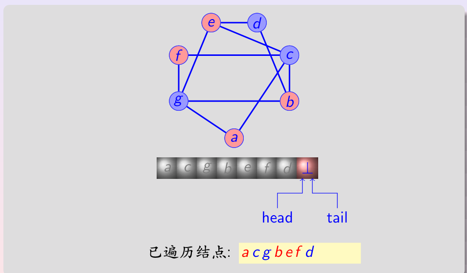

上图在搜索过程中用两种颜色标记顶点，队列记录待处理顶点，已遍历序列为 `a c g b e f d`，相邻顶点颜色始终相反。

### 2.3 完全二分图

**完全二分图（complete bipartite graph）** $K_{m,n}$ 是二部划分的两个子集分别含 $m$ 个和 $n$ 个顶点、且第一个子集中每个顶点都与第二个子集中每个顶点相连的图。

$K_{m,n}$ 有 $m+n$ 个顶点、$mn$ 条边。$K_{1,n}$ 称为**星形图（star）**，其中一个中心顶点与其余 $n$ 个顶点相连，它对应局域网的星形拓扑。

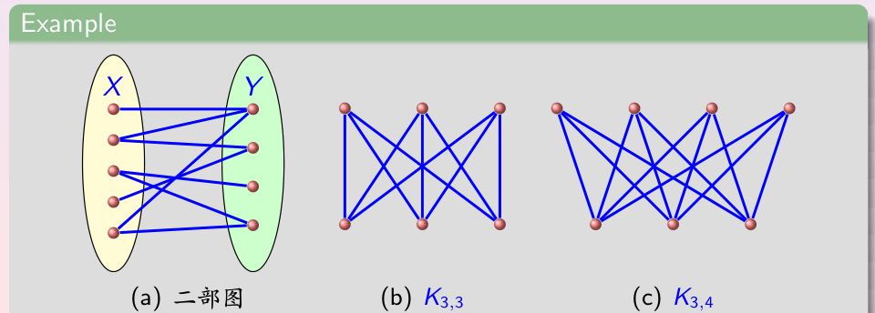

上图 (a) 是一个一般二分图（顶点分属椭圆 $X,Y$，边只跨两组），(b) 是 $K_{3,3}$，(c) 是 $K_{3,4}$。

---

## 3. 匹配

匹配是二分图（以及一般图）上的核心结构，研究如何把两组对象一一配对，在任务分配、婚姻、资源调度中有直接应用。

### 3.1 匹配与饱和

设 $G=(V,E)$ 是简单图。

**匹配（matching）** 是边集的一个子集 $M\subseteq E$，其中任意两条边都没有公共端点。即若 $\{s,t\},\{u,v\}\in M$ 是不同的边，则 $s,t,u,v$ 互不相同。

若一个顶点是 $M$ 中某条边的端点，则称该顶点**被 $M$ 饱和（匹配）**；否则称为**未饱和（未匹配）**。

- **完全匹配（complete matching）**：在二部划分为 $(V_1,V_2)$ 的二分图中，若 $V_1$ 的每个顶点都被 $M$ 饱和（即 $|M|=|V_1|$），则称 $M$ 是从 $V_1$ 到 $V_2$ 的完全匹配。若所有顶点都被饱和（$|M|=|V|/2$），则称**完美匹配（perfect matching）**。
- **最大匹配（maximum matching）**：所有匹配中含边数最多的匹配，其边数称为匹配数。

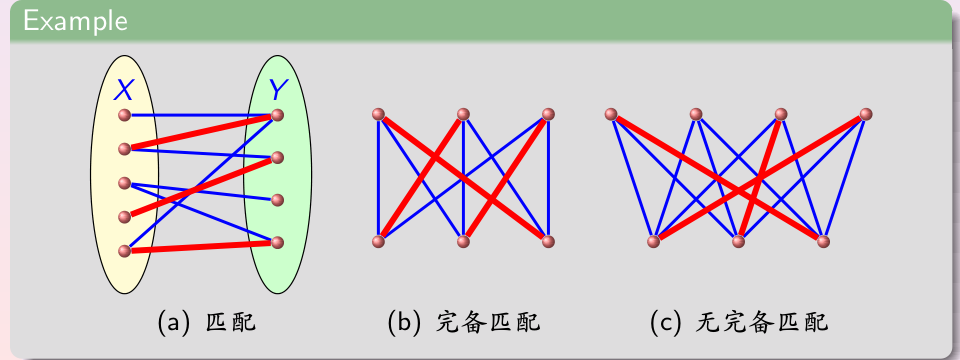

上图 (a) 标出一个匹配（粗边），(b) 是完备匹配，(c) 不存在完备匹配。匹配只是“互不共端点的边的集合”，并不要求边数最多或覆盖所有顶点。

### 3.2 极大匹配与最大匹配

这里要区分两个容易混淆的概念。

- **极大匹配（maximal matching）**：若向匹配 $M$ 中再添加任何一条边都会破坏匹配（即剩下的边都至少有一个端点已被饱和），则 $M$ 是极大匹配。
- **最大匹配（maximum matching）**：所有匹配中基数（边数）最大的匹配。

对任意匹配 $M$ 有

$$|M|\le \frac{n}{2}$$

因为匹配中每条边占用两个不同顶点。完备匹配一定是最大匹配，但最大匹配不唯一；极大匹配只要求“不能再加边”，其边数可能远小于最大匹配。

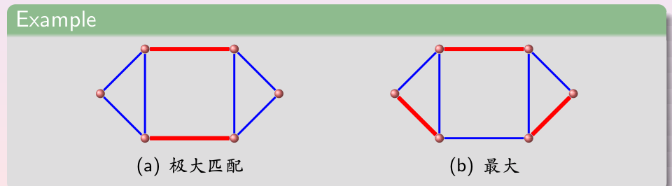

上图 (a) 是一个极大匹配（两条粗边，此时已无法再加入不共端点的边），(b) 是最大匹配（三条粗边）。可见“极大”是局部不能扩展，“最大”才是全局边数最多。

### 3.3 交错路、增广路与 Berge 定理

设 $M$ 是一个匹配。

- **$M$-交错路（alternating path）**：边在 $M$ 与 $E\setminus M$ 之间交替出现的通路。
- **$M$-增广路（augmenting path）**：两个端点都未被 $M$ 饱和的 $M$-交错路。

增广路的边数必为奇数，其中不属于 $M$ 的边比属于 $M$ 的边多一条。因此沿一条增广路把“属于 $M$”与“不属于 $M$”的边身份互换（翻转）、其余边不动，就得到一个比原匹配恰好多一条边的新匹配。这正是“增广”一词的含义。

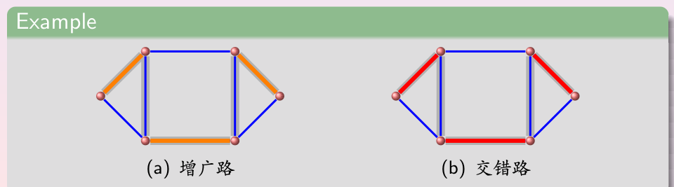

上图 (a) 标出一条增广路（两端点未饱和），(b) 标出一条交错路。

**定理 3（Berge 定理）** 匹配 $M$ 是最大匹配，当且仅当图中不存在 $M$-增广路。

**证明思路** 若存在增广路，翻转后得到更大匹配，故最大匹配必无增广路。反之，若 $M$ 不是最大匹配，取一个更大的匹配 $M'$，考察对称差 $M\oplus M'$：其中每个顶点至多关联两条边（两个匹配各一条），故其连通分支只能是交错路或偶圈；偶圈中两匹配边数相等，而 $|M'|>|M|$，所以必有一条分支是 $M'$ 边比 $M$ 边多的交错路，其两端未被 $M$ 饱和，即一条 $M$-增广路。$\square$

Berge 定理把“求最大匹配”归结为“不断寻找并翻转增广路，直到不存在为止”，是匹配算法的理论基础。

### 3.4 霍尔婚姻定理

如何判断二分图中能否把某一侧顶点全部配对？先定义邻集。

**邻集（邻居集合）** 设 $S\subseteq V$，$S$ 的邻集为

$$N_G(S)=N(S)=\{u\mid \exists s\in S,\ su\in E\}$$

即至少与 $S$ 中一个顶点相邻的所有顶点组成的集合。

**定理 4（霍尔婚姻定理，Hall 1935）** 设 $G$ 是二部划分为 $(V_1,V_2)$ 的二分图，则存在从 $V_1$ 到 $V_2$ 的完全匹配，当且仅当对每个子集 $S\subseteq V_1$ 都有

$$|N(S)|\ge |S|$$

该条件称为**霍尔条件**：任取 $V_1$ 中若干顶点，与它们相邻的 $V_2$ 顶点个数不能更少。

**证明（必要性）** 若存在完全匹配 $M$，则对任意 $S\subseteq V_1$，$S$ 中每个顶点在 $M$ 下与 $V_2$ 中一个不同顶点配对，这些配对顶点都属于 $N(S)$，故 $|N(S)|\ge |S|$。

**充分性（思路）** 对 $|V_1|$ 作强归纳。若每个 $S$ 都有富余邻居（$|N(S)|\ge |S|+1$），任取一条边配对后删去其两端，剩余图仍满足霍尔条件，用归纳假设即可；若存在一个恰好 $|N(S)|=|S|$ 的子集，则先在这一子集内部用归纳假设配对，再证明删去这部分后剩余图仍满足霍尔条件，两段匹配合并即得完全匹配。$\square$

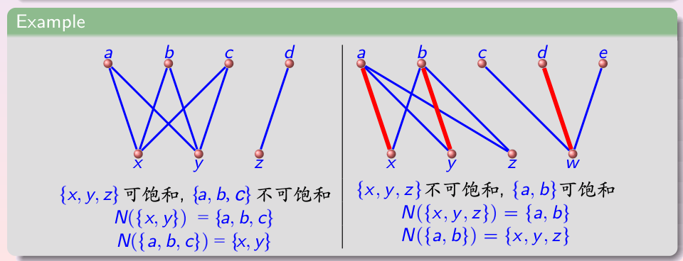

上图给出两组例子。左图中 $\{x,y,z\}$ 可被饱和而 $\{a,b,c\}$ 不能，其中 $N(\{x,y\})=\{a,b,c\}$、$N(\{a,b,c\})=\{x,y\}$（后者邻集只有 2 个、少于 3，违反霍尔条件）。右图中 $\{x,y,z\}$ 不能饱和而 $\{a,b\}$ 可以，$N(\{x,y,z\})=\{a,b\}$、$N(\{a,b\})=\{x,y,z\}$。

**推论（正则二分图）** 设 $G$ 是 $k>0$ 的 $k$ 正则二分图，二部划分为 $(V_1,V_2)$，则 $G$ 有完美匹配。

**证明** 先由正则性证明两侧顶点数相等：计数跨两侧的边，从 $V_1$ 一侧得 $k|V_1|$、从 $V_2$ 一侧得 $k|V_2|$，故 $|V_1|=|V_2|$。再验证霍尔条件：对 $S\subseteq V_1$，$S$ 发出 $k|S|$ 条边，这些边全部落入 $N(S)$，而 $N(S)$ 中每个顶点至多接收 $k$ 条边，故 $k|S|\le k|N(S)|$，即 $|N(S)|\ge |S|$。由 Hall 定理存在从 $V_1$ 到 $V_2$ 的完全匹配，又因两侧等大，它是完美匹配。$\square$

### 3.5 点覆盖、独立集与边覆盖

为完整起见，列出与匹配密切相关的几个概念，它们在二分图上由经典定理联系。

**点覆盖（vertex cover）** 是顶点集的子集 $C$，使得图中每条边至少有一个端点属于 $C$。

**独立集（independent set）** 是顶点集的子集 $I$，其中任意两个顶点都不相邻。

**边覆盖（edge cover）** 是边集的子集 $L$，使得每个顶点都与 $L$ 中至少一条边关联（图无孤立点时才存在）。

**定理 5（König 定理）** 在二分图中，最大匹配的边数等于最小点覆盖的顶点数。

此外，对无孤立点的图，最大匹配边数与最小边覆盖边数之和等于顶点数 $n$（Gallai 恒等式）；最大独立集的顶点数等于 $n$ 减去最小点覆盖的顶点数。这些结论把配对、覆盖与独立三类问题统一了起来。

### 3.6 残缺棋盘问题

**例（残缺棋盘）** 一个 $8\times 8$ 棋盘移去一对对角上的两个方格后，能否用 $1\times 2$ 的多米诺骨牌不重叠地铺满？

**解** 把每个方格看成一个顶点，相邻（共享一条边）的方格之间连边。棋盘按黑白（红蓝）相间染色，这是一个二分图，二部划分即两种颜色的方格；一张多米诺骨牌恰好覆盖相邻的一黑一红两个方格，对应匹配中的一条边。因此“能否铺满”等价于该二分图有无完美匹配。

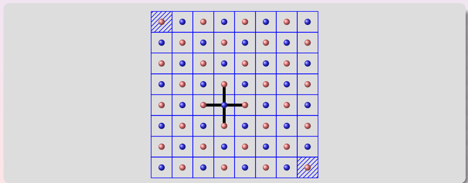

一对对角上的两个方格颜色相同。移去它们后剩余 62 个方格中一种颜色有 32 个、另一种颜色只有 30 个，两侧顶点数相差 2，不可能存在完美匹配，故无法铺满。$\square$

---

## 4. 欧拉通路与回路

### 4.1 哥尼斯堡七桥问题

普鲁士的哥尼斯堡（今加里宁格勒）被普雷格尔河分成四块陆地（两岸与河心岛等），18 世纪时有七座桥把它们连接起来。镇上的人想知道：能否从某地出发散步，恰好经过每座桥一次，最后回到出发点？

瑞士数学家欧拉在 1736 年解决了这个问题，这被视为图论的开端。他把四块陆地抽象为四个顶点、七座桥抽象为七条边，得到一个连通多重图。

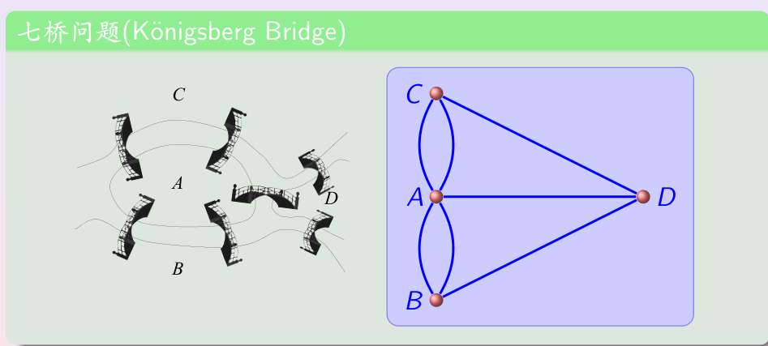

上图左侧是七桥的实景示意，右侧是对应的多重图模型：顶点 $A,B,C,D$ 表示四块陆地，边表示桥（连接同一对陆地的多座桥给出多重边）。

### 4.2 欧拉通路与回路的定义

**欧拉通路（Euler path，欧拉迹）** 是恰好包含图中每条边一次的通路。**欧拉回路（Euler circuit，欧拉闭迹）** 是恰好包含每条边一次的回路。具有欧拉回路的图称为**欧拉图**。

欧拉通路/回路要求遍历所有的**边**，这与后面要求遍历所有**顶点**的哈密顿通路/回路相对。

### 4.3 无向图的判定定理

**定理 6（欧拉回路判定）** 连通多重图具有欧拉回路，当且仅当它的每个顶点都具有偶数度。

**定理 7（欧拉通路判定）** 连通多重图具有欧拉通路（但无欧拉回路），当且仅当它恰有两个奇度顶点，这两个奇度顶点分别是欧拉通路的起点和终点。

**证明思路（必要性）** 沿欧拉回路每经过一个顶点就一进一出、贡献 2 度，故所有顶点度数为偶；起点（也是终点）在开始和结束处各贡献 1 度、合计仍为偶。对欧拉通路，中间顶点同样一进一出为偶度，只有起点（只出）和终点（只入）各多出 1 度而为奇度，故恰有两个奇度顶点。

**充分性（构造）** 当所有顶点为偶度时，从任一顶点出发沿未走过的边尽量延伸，由于顶点偶度、每次进入都能离开，这条迹必在起点闭合；若尚未覆盖所有边，则已走回路与剩余子图（顶点仍为偶度）必有公共顶点，在该顶点处再构造一个回路并拼接进来，如此反复直到覆盖全部边，即得欧拉回路。对于恰有两个奇度顶点的情形，在两个奇度顶点间添加一条辅助边，则所有顶点变为偶度、存在欧拉回路，删去辅助边即得欧拉通路。$\square$

**哥尼斯堡的判定**：四个顶点的度数为 $3,3,5,3$，共有 4 个奇度顶点，既不是 0 个也不是 2 个，故既无欧拉回路也无欧拉通路，七桥问题无解。

**一笔画**：用笔不离纸、不重复地画出一个图形，等价于在对应图中寻找欧拉通路或回路。全偶度可一笔画成并回到起点；恰有两个奇度顶点时从其中一个开始、到另一个结束；奇度顶点超过两个则无法一笔画成。

### 4.4 有向图的判定

**定理 8** 不含孤立点的有向多重图具有欧拉回路，当且仅当它弱连通（其基本无向图连通）且每个顶点的入度等于出度。

具有欧拉通路而无欧拉回路，当且仅当它弱连通，且存在一个顶点出度比入度大 1（起点）、一个顶点入度比出度大 1（终点），其余每个顶点入度等于出度。

### 4.5 Fleury 算法与割边

**割边（桥，bridge）** 是删除后会使连通分支数增加的边。一条边是割边，当且仅当它不属于任何圈。

**Fleury 算法（1883）** 构造欧拉回路：从任一顶点开始，每次选择一条边继续，规则是**除非别无选择，否则不走割边**；每走过一条边就将其删除，直到回到起点、遍历所有边。优先避开割边是为了避免过早把尚未访问的部分断连。

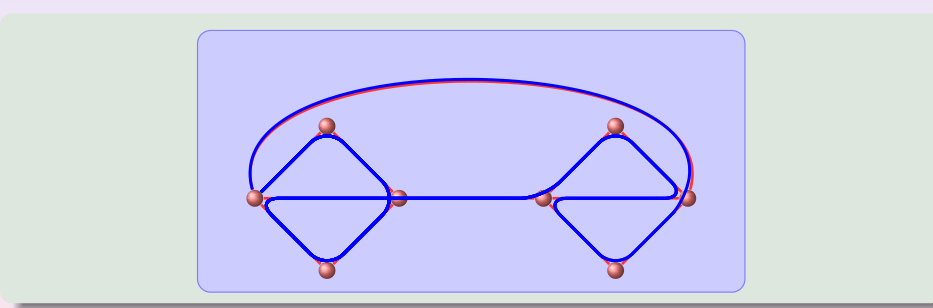

上图用 Fleury 算法在两个以多重边相连的菱形图上构造出一条欧拉回路（标出的回路沿非割边前进）。

### 4.6 欧拉通路的应用

许多实际问题要求恰好一次经过某范围内的每条“边”：邮递员经过每条街道、巡检每条道路、检测电网的每条线路或通信网络的每条链路，求出相应图模型的欧拉回路就给出了路线。

**中国邮递员问题**（管梅谷，1962）：当图中不存在欧拉回路（有奇度顶点）时，如何找一条至少经过每条边一次、且重复走的边数最少的闭合路线。它是欧拉回路问题在一般图上的推广，名称纪念提出该问题的中国数学家管梅谷。

**德布鲁因序列（De Bruijn sequence）**：在以长度 $n-1$ 的比特串为顶点、按比特移位关系连有向边的**德布鲁因图**中，每条有向边对应一个长度 $n$ 的比特串；该图每个顶点入度等于出度、存在欧拉回路，沿欧拉回路依次取边即可得到德布鲁因序列，它使每个长度 $n$ 的比特串恰好出现一次，在 DNA 测序等问题中有用。

---

## 5. 哈密顿通路与回路

### 5.1 周游世界问题

1857 年，爱尔兰数学家哈密顿发明了一个智力题：在一个正十二面体（有 20 个顶点、12 个五边形面）上，20 个顶点标记为 20 座城市，能否从某城市出发沿棱边恰好经过每个城市一次，最后回到起点？他用钉子和细线在木质十二面体上标记路线，称为“周游世界游戏（Icosian game）”。

把十二面体的顶点与棱画成平面图，问题等价于该图是否存在恰好经过每个顶点一次的回路。

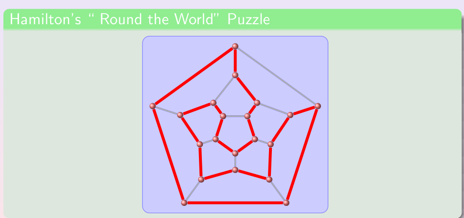

上图是正十二面体的平面展开，粗边标出一条满足要求的回路。

### 5.2 哈密顿通路与回路的定义

**哈密顿通路（Hamilton path）** 是恰好通过图中每个顶点一次的简单通路。**哈密顿回路（Hamilton circuit）** 是恰好通过每个顶点一次的回路。具有哈密顿回路的图称为**哈密顿图**。

与欧拉问题遍历边不同，哈密顿问题遍历顶点。判定一个图有无哈密顿回路至今**没有已知的简单充要条件**，该判定问题是 NP 完全的，已知最好的算法在最坏情况下需要指数时间，这与只需检查度数的欧拉判定形成鲜明对比。

### 5.3 哈密顿回路的充分条件

虽然没有充要条件，但有若干以顶点度数为条件的充分条件。

**定理 9（Dirac，1952）** 设 $G$ 是含 $n\ge 3$ 个顶点的简单图，若每个顶点的度都满足

$$\deg(v)\ge \frac{n}{2}$$

则 $G$ 具有哈密顿回路。

**定理 10（Ore，1960）** 设 $G$ 是含 $n\ge 3$ 个顶点的简单图，若对每一对不相邻的顶点 $u,v$ 都有

$$\deg(u)+\deg(v)\ge n$$

则 $G$ 具有哈密顿回路。

Dirac 条件蕴含 Ore 条件（每点度 $\ge n/2$ 时任意两点度数之和 $\ge n$），故 Dirac 定理可作为 Ore 定理的推论。这两个条件都只是**充分而非必要**的：例如 $C_5$ 有哈密顿回路，但每点度为 $2<5/2$、不相邻顶点度数之和为 $4<5$，两个条件都不满足。

直观上，图的边越密、顶点度数越大，越可能存在哈密顿回路；向已有哈密顿回路的图中添加边，原回路依然存在。

### 5.4 哈密顿回路的必要条件

**定理 11（必要条件）** 若 $G$ 是哈密顿图，则对顶点集的任意非空子集 $S$ 都有

$$\omega(G-S)\le |S|$$

其中 $\omega(\cdot)$ 表示连通分支数。即删去 $S$ 中的顶点（及其关联边）后，所产生的连通分支数不能超过删去的顶点数。

**理由** 哈密顿回路经过每个顶点；删去 $S$ 中 $|S|$ 个顶点，至多把这条回路切成 $|S|$ 段，故剩余图至多有 $|S|$ 个连通分支。

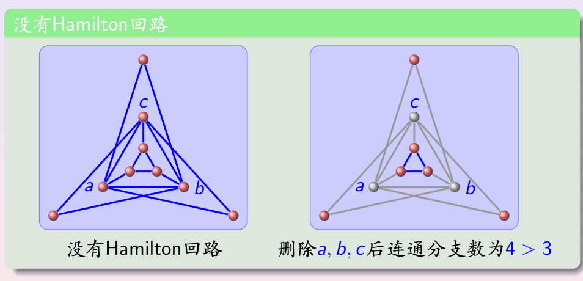

上图左侧的图没有哈密顿回路：如右侧所示，删去 $a,b,c$ 三个顶点后剩下 4 个连通分支，$4>3$，违反必要条件。这给出了证明“不存在哈密顿回路”的有力方法。其他简单信号还包括：含度为 1 顶点的图没有哈密顿回路（回路中每顶点都关联两条边）。

### 5.5 彼得森图

**彼得森图（Petersen graph）** 是每个顶点度为 3、围长（最短圈长）为 5 的图，常作为图论中各种猜想的反例来源。

- 彼得森图**没有哈密顿回路**（可由其结构反证：若存在哈密顿回路，结合每点度 3、围长 5 会迫使边的选取产生矛盾），但它有哈密顿通路。
- 删去任意一个顶点及关联边后，所得子图是哈密顿图。
- 彼得森图也不是平面图（见 6.4 节）。

### 5.6 哈密顿回路的应用

**马的周游（knight's tour）**：国际象棋中马走“日”字（横向两格纵向一格，或横向一格纵向两格）。把棋盘每格作为顶点、马能一步到达的两格之间连边，则“马能否从某格出发恰好经过每格一次”等价于该图有无哈密顿通路，“能否再回到起点”（closed tour）等价于有无哈密顿回路。

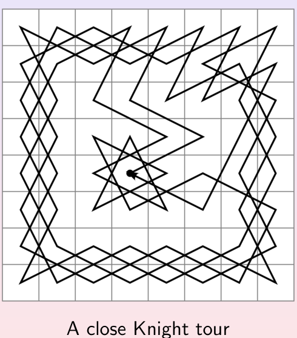

上图是 $8\times 8$ 棋盘上一个闭合的马跳周游（closed knight tour）。构造马跳周游常用 **Warnsdorff 启发式（1823）**：每一步总是跳向“可继续到达的未用格子数最少”的位置，该方法通常有效但不保证一定成功。

**格雷码（Gray code）**：为圆周上等分成 $2^n$ 段的弧标记长度为 $n$ 的比特串，希望相邻的弧（以及首尾两段）所标记的比特串恰好相差一位，这样指针在读数位置出错时只会错一位。满足该要求的标记就是格雷码，它等价于在 $Q_n$ 中找一条哈密顿回路。例如 $Q_3$ 的一条哈密顿回路给出序列

$$000,001,011,010,110,111,101,100$$

相邻两项（含首尾）恰差一位。

**旅行商问题（TSP）**：给定若干城市及两两距离，求访问每个城市恰好一次并回到起点的最短回路。它归结为在完全图中找一条边权总和最小的哈密顿回路，是经典的 NP 难问题。

---

## 6. 平面图

### 6.1 平面图的定义

**平面图（planar graph）** 是可以画在平面上、使得任意两条边都不在非顶点处相交的图，这样一种画法称为图的**平面表示（平面嵌入）**。

一个图即使通常被画成有边交叉，也仍可能是平面图——只要能找到另一种无交叉的画法。

- $K_4$ 是平面图：虽然一种画法中有两条边交叉，但把其中一个顶点移到三角形外侧即可无交叉地画出。
- $Q_3$ 是平面图，可以画出无任何边交叉的平面表示。

**$K_{3,3}$ 不是平面图**：经典的“三座房屋、三种设施（水/电/煤气）”问题问能否把每座房屋与每种设施相连且连线不交叉，它正是 $K_{3,3}$，任何平面画法都无法避免边交叉。

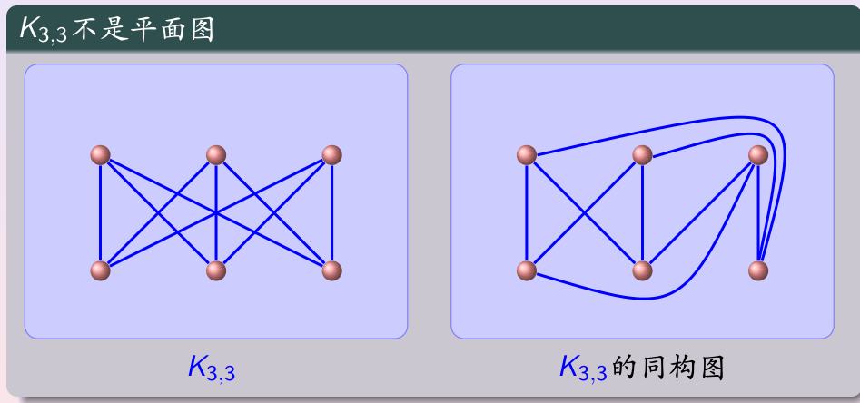

上图左侧是 $K_{3,3}$，右侧尝试把部分边绕到外侧，仍不可避免地出现交叉。

**$K_{3,3}$ 非平面的论证（思路）**：先连接某两个同侧顶点与另一侧两个顶点的四条边，它们形成一条把平面分成内外两部分的闭合曲线；第三个同侧顶点无论放在内部还是外部，继续连接都会把所在区域进一步分割，最后一个顶点无论放在哪个区域，都至少有一条连向它的边必须穿过已有边界。$K_5$ 也可用类似论证证明为非平面。

平面图在**印刷电路板（VLSI）**设计中很重要：若电路对应的图是平面图，就可以把所有连线不交叉地印在单层板上；否则必须采用多层板或在交叉处绝缘，成本更高。公路网设计中，平面性意味着无需修天桥或地下通道。

### 6.2 面与欧拉公式

一个平面图的平面表示把平面分割成若干区域，称为**面（region）**，其中恰有一个是无界（外部）面，每个面的边界是若干边组成的闭合回路。

**定理 12（欧拉公式）** 设连通平面图 $G$ 有 $v$ 个顶点、$e$ 条边，其平面表示把平面分成 $r$ 个面，则

$$v-e+r=2$$

即

$$r=e-v+2$$

**证明（思路）** 对边数归纳。一条边的基本情形有 $r=1=e-v+2$；每次添加一条边时分两种情况：若新边两端都已在图中，它把某个面一分为二（面数、边数各加 1，顶点数不变）；若新边带来一个新顶点，则不产生新面（边数、顶点数各加 1，面数不变）。两种情况下 $r=e-v+2$ 都继续成立。$\square$

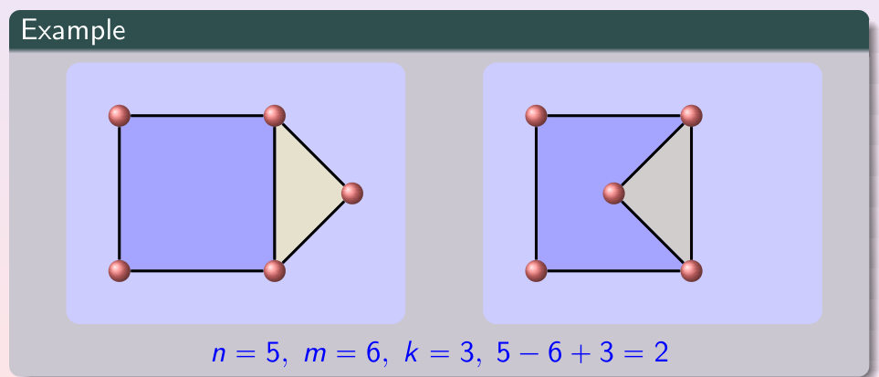

上图两个连通平面图均为 $v=5,e=6,r=3$，代入得 $5-6+3=2$。

**例** 连通平面简单图有 20 个顶点、每点度为 3，求面数。由握手定理 $2e=3\cdot 20=60$，$e=30$；由欧拉公式 $r=e-v+2=30-20+2=12$。

### 6.3 平面图的边数上界

定义**面的度**为该面边界上的边数（一条边若在边界上出现两次则计两次），所有面的度数之和等于边数的两倍。

**定理 13（边数上界）** 含 $v\ge 3$ 个顶点的连通平面简单图满足

$$e\le 3v-6$$

**证明思路** 简单图每个面的度至少为 3，故 $2e\ge 3r$（即 $r\le 2e/3$）；代入欧拉公式 $r=e-v+2$，得 $e-v+2\le 2e/3$，整理即 $e\le 3v-6$。$\square$

由此可证明 $K_5$ 非平面：$K_5$ 有 $v=5,e=10$，而 $3v-6=9$，$10>9$，违反上界。

**定理 14（无三角面的上界）** 连通平面简单图若不含长度为 3 的回路（例如二分平面图），且 $v\ge 3$，则

$$e\le 2v-4$$

此时每个面的度至少为 4，同理代入欧拉公式可得。由此证明 $K_{3,3}$ 非平面：$K_{3,3}$ 有 $v=6,e=9$，而 $2v-4=8$，$9>8$。

值得注意的是，$K_{3,3}$ 的 $e=9\le 12=3v-6$，**满足** $e\le 3v-6$ 却仍非平面，因此这些上界只是平面的**必要条件**，满足它们并不保证图是平面的。

由 $e\le 3v-6$ 还可推出：每个平面简单图都至少含有一个度不超过 5 的顶点（否则每点度 $\ge 6$，则 $2e\ge 6v$，与 $2e\le 6v-12$ 矛盾），这是平面图着色证明的关键。

### 6.4 初等细分、同胚与库拉图斯基定理

**初等细分（elementary subdivision）**：删除一条边 $\{u,v\}$，添加一个新顶点 $w$ 和两条边 $\{u,w\},\{w,v\}$，即在一条边中间插入一个度为 2 的顶点。反复进行初等细分，相当于在边的路径上加入若干度为 2 的点。

若两个图能从同一个图通过一系列初等细分得到，则称它们**同胚（homeomorphic，也称“两度结点同构”）**。直观上，同胚的图忽略掉边上度为 2 的多余顶点后是同一个图。

**定理 15（库拉图斯基定理，Kuratowski 1930）** 一个图是平面图，当且仅当它不包含与 $K_5$ 或 $K_{3,3}$ 同胚的子图。

非平面图“坏”的方式本质上只有两种：藏着一个经细分变形的 $K_5$ 或 $K_{3,3}$。定理充分性（每个非平面图都含这样的子图）的证明很复杂，超出本书范围。

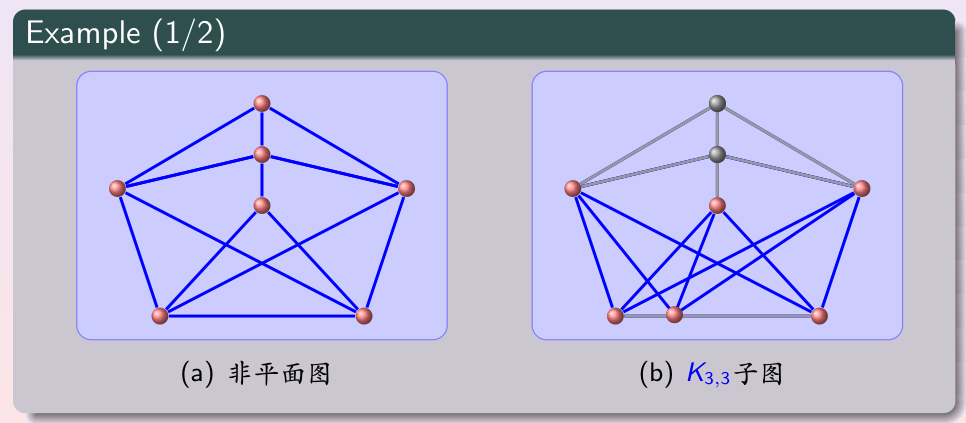

上图 (a) 是非平面图，(b) 中高亮部分即一个 $K_{3,3}$ 子图（其余边灰显），故由定理它非平面。彼得森图也不是平面图：删去适当顶点后可得到与 $K_{3,3}$ 同胚的子图。

---

## 7. 图着色

### 7.1 地图、对偶图与着色定义

给一幅地图着色，希望具有公共边界的区域颜色不同、且使用颜色尽可能少。地图可转化为一个图：每个区域对应一个顶点，两个区域若共享一条边界（仅在一点相触不算）就在对应顶点间连边，所得图称为地图的**对偶图（dual graph）**，地图的任何对偶图都是平面图。

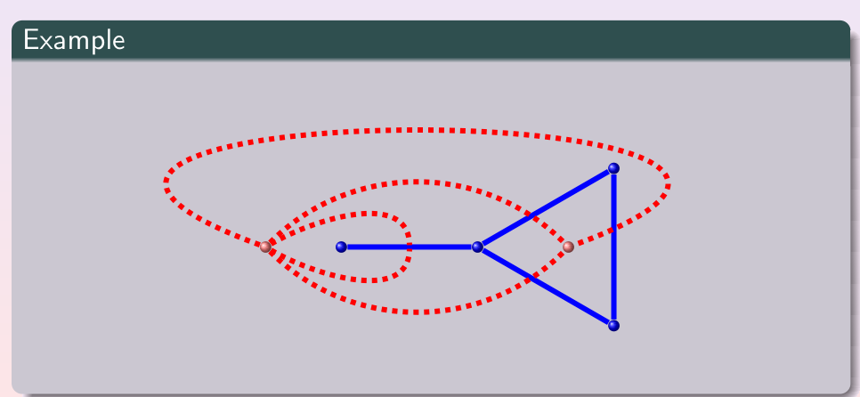

上图实线为原平面图，虚线为按“面对应顶点、跨边相连”构造的对偶图，二者叠加显示。

**图着色（graph coloring）** 是给图的顶点指定颜色，使任意两个相邻顶点颜色不同。**着色数（色数，chromatic number）** $\chi(G)$ 是合法着色所需的最少颜色数。于是“给地图着色所需最少颜色”等于其对偶图的色数。

### 7.2 四色定理

**定理 16（四色定理）** 每个平面图都可以用不超过 4 种颜色着色，即

$$\chi(G)\le 4$$

该问题 1852 年由弗朗西斯·古特利（Francis Guthrie）在给英格兰地图着色时提出猜想。1879 年肯普（Kempe）发表过一个证明，1890 年被希伍德发现错误；直到 1976 年阿佩尔（Appel）与黑肯（Haken）才借助计算机完成证明：他们把可能的反例归为约 2000 种构型并逐一排除，使用了上千小时机时。1996 年罗伯逊等人将其简化为检查 633 种构型，但至今没有不依赖计算机的纯人工证明。四色定理只适用于平面图，非平面图的色数可以任意大。

证明一个图的色数恰为 $k$ 需要两方面：给出一种 $k$ 色的合法着色，并证明用 $k-1$ 种颜色无法着色。求色数本身是困难问题，已知算法最坏情况为指数时间，甚至求其近似值也很难。

### 7.3 常见图的色数

由前面各图的结构可直接得到其色数。

- **完全图**：$\chi(K_n)=n$，每个顶点两两相邻，颜色必须全不同。
- **完全二分图**：$\chi(K_{m,n})=2$，两个二部子集各用一色（连通二分图色数为 2，平凡图为 1）。
- **圈图**：

$$\chi(C_n)=\begin{cases}2,& n\text{ 为偶数}\\3,& n\text{ 为奇数}\end{cases}$$

偶圈可两色交替；奇圈首尾处两色冲突，需第三色。

- **轮图**：$W_n$ 由 $C_n$ 加中心构成，中心与圈上所有顶点相邻、需一种新颜色，故

$$\chi(W_n)=\begin{cases}3,& n\text{ 为偶数}\\4,& n\text{ 为奇数}\end{cases}$$

- **$n$ 立方体**：$Q_n$ 是二分图（按比特串中 1 的个数奇偶分两侧），$\chi(Q_n)=2$。

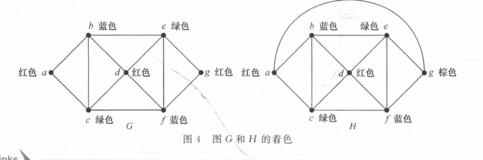

上图给出两个图的着色方案：图 $G$ 用 3 色（红/蓝/绿）即可，图 $H$ 因多出一条边使顶点 $g$ 与三种颜色的顶点都相邻，必须引入第 4 色（棕色），故 $\chi(G)=3,\chi(H)=4$。

### 7.4 图着色的应用

凡是“彼此冲突的对象不能安排到同一资源”的问题，都可用着色建模：顶点表示对象，冲突关系连边，颜色表示资源，色数给出所需资源的最少数目。

**期末考试安排**：顶点表示考试科目，若有学生同时要考两门则在两科目间连边，颜色表示考试时间段；把考试安排成无学生冲突的日程，等价于给该图着色。教材中 7 门科目对应的图色数为 4，故需要 4 个时间段。

**频率（频道）分配**：顶点表示电视台，相距在限定距离（如 150 英里）以内的两台之间连边，颜色表示频道；互相干扰的电视台必须使用不同频道，所需最少频道数即图的色数。

**变址寄存器分配**：在编译器中，顶点表示循环里的变量，若两个变量在某段执行期间同时活跃（需同时占用寄存器）则连边；该图的色数就是所需变址寄存器的最少数目，相邻变量分配不同寄存器。

此外还有**边着色**（给边着色使同一顶点关联的边颜色不同，用于排课、链路分配）、**k 重着色**（每顶点分配一组颜色，相邻顶点的颜色集合不相交，用于为蜂窝小区分配多个频率）等推广。

---

## 8. 本章小结

**特殊简单图**：$K_n$（每对顶点一条边，$(n-1)$ 正则）、$C_n$（2 正则的圈）、$W_n$（$C_n$ 加中心）、$Q_n$（比特串为顶点、恰一位不同相邻，$n$ 正则）。

**二分图与匹配**：二分图等价于可二着色、等价于无奇圈；$K_{m,n}$ 为完全二分图。匹配是无公共端点的边集；区分**极大**（不能再加边）与**最大**（边数最多）匹配。沿**增广路**翻转可增大匹配，**Berge 定理**给出最大匹配的充要条件（无增广路）。**Hall 定理**以邻集条件 $|N(S)|\ge |S|$ 判定一侧能否完全饱和；$k>0$ 的正则二分图有完美匹配。二分图上最大匹配数等于最小点覆盖数（König 定理）。

**欧拉图**：连通多重图有欧拉回路 iff 所有顶点偶度；有欧拉通路 iff 恰有两个奇度顶点；有向情形对应入度等于出度。Fleury 算法构造时优先走非割边；推广为中国邮递员问题，欧拉回路还用于构造德布鲁因序列。

**哈密顿图**：无简单充要条件（NP 完全）。充分条件有 Dirac（每点度 $\ge n/2$）与 Ore（不相邻点度数之和 $\ge n$）；必要条件为对任意非空 $S$ 有 $\omega(G-S)\le |S|$。彼得森图无哈密顿回路但有哈密顿通路；应用包括马跳周游、格雷码（$Q_n$ 的哈密顿回路）与旅行商问题。

**平面图**：连通平面图满足欧拉公式 $v-e+r=2$；由此得边数上界 $e\le 3v-6$（无三角圈时 $e\le 2v-4$），据此判定 $K_5,K_{3,3}$ 非平面。**库拉图斯基定理**：图平面 iff 不含与 $K_5,K_{3,3}$ 同胚（初等细分）的子图。

**图着色**：地图经对偶图化为平面图着色；**四色定理**保证平面图色数不超过 4。常见色数为 $\chi(K_n)=n$、$\chi(K_{m,n})=\chi(Q_n)=2$、$\chi(C_n)$ 偶 2 奇 3、$\chi(W_n)$ 偶 3 奇 4。着色用于考试安排、频率分配与寄存器分配。

**常见易错点**：

- 混淆“极大匹配”与“最大匹配”，以及“欧拉（遍历边）”与“哈密顿（遍历顶点）”。
- 把 $e\le 3v-6$ 当成充分条件，它只是必要条件，$K_{3,3}$ 满足该式仍非平面。
- 误以为 Dirac/Ore 条件是必要条件，$C_5$ 不满足条件却有哈密顿回路。
- 轮图 $W_n$ 有 $n+1$ 个顶点（不是 $n$ 个），其色数随 $n$ 奇偶为 3 或 4。
- 四色定理只适用于平面图，不能用于任意图。
