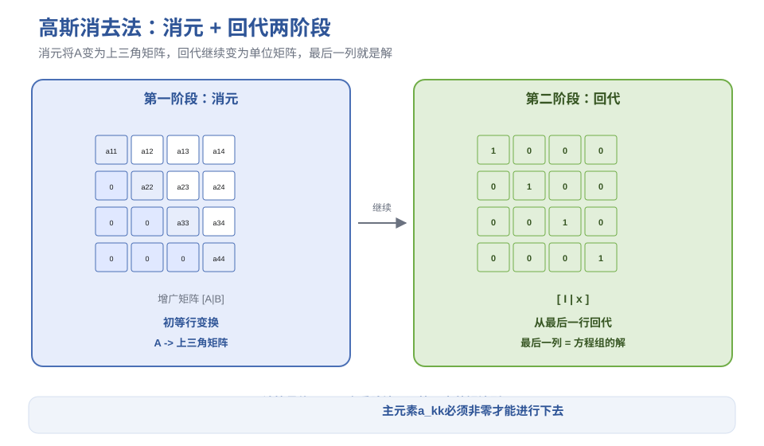
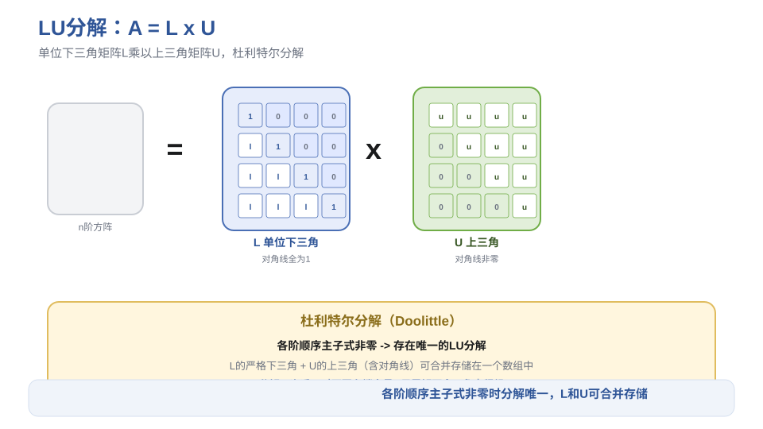
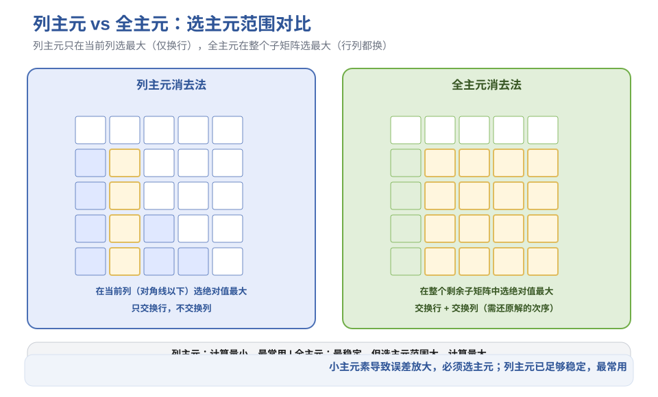
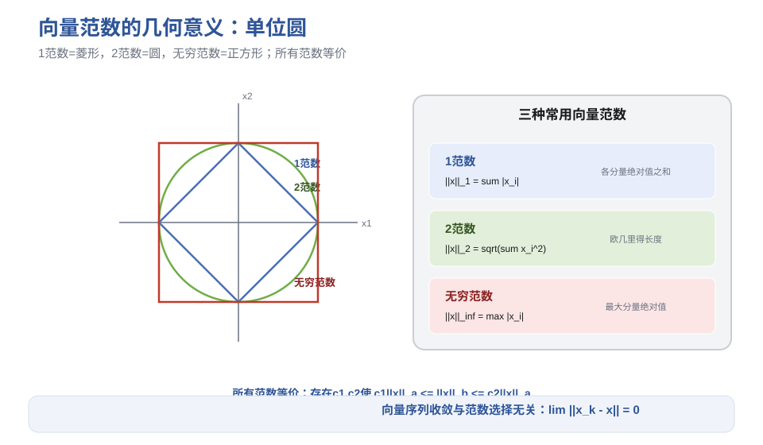
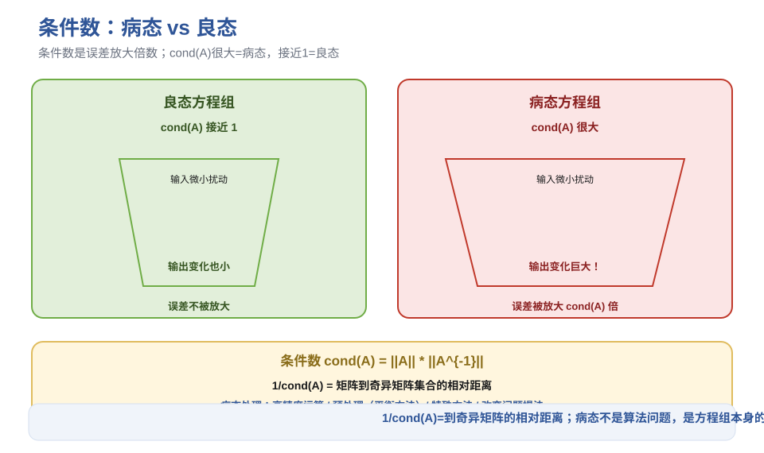

# 第3章 线性方程组直接解法 - 笔记

> 课程：数值计算方法（中国石油大学华东，国家级精品课，BV1NvYSzEEYd）
> 对应视频：p012-p021（3.1 高斯消去法 ~ 3.10 方程组的敏度分析）

## 目录

- [1. 概述](#1-概述)
- [2. 高斯消去法](#2-高斯消去法)
- [3. 三角方程组求解](#3-三角方程组求解)
- [4. 矩阵三角分解（LU分解）](#4-矩阵三角分解lu分解)
- [5. 选主元消去法](#5-选主元消去法)
- [6. 三角分解法求解方程组](#6-三角分解法求解方程组)
- [7. 特殊矩阵的分解方法](#7-特殊矩阵的分解方法)
- [8. 向量范数](#8-向量范数)
- [9. 矩阵范数](#9-矩阵范数)
- [10. 条件数与敏度分析](#10-条件数与敏度分析)
- [11. 本节重点](#11-本节重点)

---

## 1. 概述

### 1.1 方程组的两种类型

| 类型 | 特点 | 适用方法 |
|------|------|---------|
| 低阶稠密方程组 | 阶数通常 < 100，零元素少 | 直接方法 |
| 大型稀疏方程组 | 阶数可达几万~几百万，非零元少，分布在对角线附近 | 迭代方法（第7章） |

### 1.2 求解方法的两大类

- **直接方法**：在无舍入误差假设下，经过有限次运算求出精确解。适合低阶稠密方程组。
- **迭代方法**：从近似解出发，由迭代格式产生向量序列逐步逼近精确解。适合大型稀疏方程组。

> 本章假设系数矩阵 $A$ 非奇异（行列式 $\neq 0$），方程组有唯一解。

---

## 2. 高斯消去法

### 2.1 基本思想

对增广矩阵 $[A|B]$ 进行初等行变换，分两阶段：

1. **消元**：将系数矩阵 $A$ 变为上三角矩阵
2. **回代**：继续变换将上三角变为单位矩阵，此时最后一列就是解

### 2.2 消元公式

第 $k$ 次消元（$k=1,2,\dots,n-1$）：

$$l_{ik} = \frac{a_{ik}^{(k-1)}}{a_{kk}^{(k-1)}}, \quad i = k+1, \dots, n$$

$$a_{ij}^{(k)} = a_{ij}^{(k-1)} - l_{ik} \cdot a_{kj}^{(k-1)}$$

$$b_i^{(k)} = b_i^{(k-1)} - l_{ik} \cdot b_k^{(k-1)}$$

### 2.3 回代公式

$$x_i = \frac{b_i^{(n-1)} - \sum_{j=i+1}^{n} a_{ij}^{(n-1)} x_j}{a_{ii}^{(n-1)}}, \quad i = n, n-1, \dots, 1$$

### 2.4 算法能进行下去的条件

消元过程中所有主元素 $a_{kk}^{(k-1)} \neq 0$（$k=1,2,\dots,n$）。

> 注意：这里的主元素是**消元过程中产生的**对角线元素，不是原始矩阵的对角线元素。$A$ 非奇异不能保证主元素非零。

### 2.5 计算量分析

求解 $n$ 阶方程组约需 $\frac{n^3}{3}$ 次乘除法。

**与克莱姆法则对比**（100 阶方程组）：
- 高斯消去法：约 $1.3 \times 10^4$ 秒
- 克莱姆法则（用行列式定义）：天文数字（需算 $n+1$ 个 $n$ 阶行列式，每个有 $n!$ 项）

> 选择高效算法至关重要。

---

> **图1** 高斯消去法两阶段：消元（变上三角）+ 回代（变单位矩阵）（自绘）。

## 3. 三角方程组求解

三角分解法求解的基础，分下三角和上三角两类。

### 3.1 下三角方程组 $LY = B$

$L$ 是非奇异下三角矩阵（对角线非零）。

**代入法**（从第一个方程开始）：

$$y_i = \frac{b_i - \sum_{j=1}^{i-1} l_{ij} y_j}{l_{ii}}, \quad i = 1, 2, \dots, n$$

**单位下三角**（对角线全为1）：省去除法，$y_i = b_i - \sum_{j=1}^{i-1} l_{ij} y_j$。

### 3.2 上三角方程组 $UX = Y$

**回代法**（从最后一个方程开始）：

$$x_i = \frac{y_i - \sum_{j=i+1}^{n} u_{ij} x_j}{u_{ii}}, \quad i = n, n-1, \dots, 1$$

**单位上三角**：省去除法。

---

## 4. 矩阵三角分解（LU分解）

### 4.1 定义

将 $A$ 分解为 $A = LU$，其中：
- $L$：单位下三角矩阵（对角线全为1）
- $U$：上三角矩阵

这称为**杜利特尔（Doolittle）分解**。

> 另一种是克洛特（Crout）分解：$L$ 是下三角，$U$ 是单位上三角。本课程只用杜利特尔。

### 4.2 用高斯变换实现分解

**高斯变换矩阵**：$L_k = I - l_k e_k^T$，其中 $l_k = (0,\dots,0,l_{k+1,k},\dots,l_{nk})^T$。

性质：$L_k^{-1} = I + l_k e_k^T$。

连续左乘高斯变换矩阵将 $A$ 化为上三角：

$$L_{n-1} \cdots L_2 L_1 A = U$$

则 $A = L_1^{-1} L_2^{-1} \cdots L_{n-1}^{-1} U = LU$，其中 $L = L_1^{-1} \cdots L_{n-1}^{-1}$ 是单位下三角矩阵。

### 4.3 节省存储

$L$ 的严格下三角部分和 $U$ 的上三角部分（含对角线）可以合并存储在一个二维数组中（位置互补）。

### 4.4 存在唯一性定理

**定理1**：主元素 $a_{kk}^{(k-1)}$ 均非零 $\iff$ $A$ 的各阶顺序主子式均非奇异。

**定理2**：若 $A$ 的各阶顺序主子式均非奇异，则存在**唯一**的单位下三角矩阵 $L$ 和上三角矩阵 $U$，使 $A = LU$。

---

> **图2** LU 分解结构：单位下三角 L × 上三角 U（自绘）。

## 5. 选主元消去法

### 5.1 为什么要选主元

顺序消去法的问题：
- 主元素为零 → 计算失败
- 主元素绝对值很小 → 误差巨大（小数做分母，误差放大）甚至溢出

**经典例子**：二阶方程组，三位十进制运算：
- 顺序消元：$x_1=0.00, x_2=1.00$（误差巨大）
- 先交换行再消元：$x_1=1.00, x_2=1.00$（精度很高）

> 根本原因：小主元素导致乘子 $l_{ik}$ 很大，舍入误差被放大。

### 5.2 列主元消去法

每次消元前，在**当前列**（从对角线元素 $a_{kk}$ 到最后一行 $a_{nk}$）中选绝对值最大的元素，交换行后再消元。

**步骤**：选主元 → 交换行 → 消元 → 回代。

**列主元三角分解**：$PA = LU$，其中 $P$ 是行交换矩阵（用向量记录交换信息，节省存储）。

求解步骤：
1. $PA = LU$ 分解（含选主元和行交换）
2. 解 $LY = PB$（下三角，$B$ 先做相同的行交换）
3. 解 $UX = Y$（上三角）

### 5.3 全主元消去法

每次消元前，在**整个剩余子矩阵**（从 $a_{kk}$ 到右下角）中选绝对值最大的元素，交换行**和列**后再消元。

- 需要同时记录行交换和列交换
- 求解后需要**还原解的分量次序**（列交换改变了未知数的顺序）

**全主元三角分解**：$PAQ = LU$，$P$ 记录行交换，$Q$ 记录列交换。

**定理**：任何矩阵 $A$ 都存在排列矩阵 $P,Q$ 和单位下三角 $L$、上三角 $U$，使 $PAQ = LU$，且 $L$ 的所有元素绝对值 $\le 1$，$U$ 的非零对角元个数 $= \text{rank}(A)$。

### 5.4 列主元 vs 全主元

| 方法 | 选主元范围 | 交换 | 稳定性 | 计算量 |
|------|-----------|------|--------|--------|
| 列主元 | 当前列 | 仅行 | 较好 | 较小 |
| 全主元 | 整个子矩阵 | 行+列 | 最好 | 较大 |

> 实际应用中列主元已足够稳定，最常用。

---

> **图3** 列主元 vs 全主元：选主元范围对比（自绘）。

## 6. 三角分解法求解方程组

### 6.1 三步法

1. **分解**：$A = LU$（或 $PA=LU$、$PAQ=LU$）
2. **解下三角**：$LY = B$（或 $LY = PB$）
3. **解上三角**：$UX = Y$

### 6.2 与高斯消去法的关系

| 高斯消去法 | 三角分解法 |
|-----------|-----------|
| 消元过程 | $LU$ 分解 + 解 $LY=B$ |
| 回代过程 | 解 $UX=Y$ |

两者本质相同，仅计算次序不同。三角分解法的优势：分解一次后，对不同的右端向量 $B$ 只需重复解两个三角方程组，不必重新分解。

---

## 7. 特殊矩阵的分解方法

### 7.1 带状方程组

**带状矩阵**：非零元素分布在主对角线附近的带状区域内。

- 上半带宽 $q$：主对角线右上方有 $q$ 条非零对角线
- 下半带宽 $p$：主对角线左下方有 $p$ 条非零对角线
- 总带宽 $= p + q + 1$（1 指主对角线）

**保带宽定理**：若 $A$ 是上半带宽 $q$、下半带宽 $p$ 的带状矩阵，且各阶顺序主子式非零，则 $A=LU$ 中 $L$ 保持下半带宽 $p$，$U$ 保持上半带宽 $q$。

> 只需修改循环变量的范围（$i$ 从 $k+1$ 到 $\min(n, k+p)$，$j$ 从 $k+1$ 到 $\min(n, k+q)$），即可在带状区域内运算，大幅节省计算量。

**三对角方程组**（$p=q=1$，只有三条对角线非零）：用**追赶法**（LU 分解的特殊形式，无需写循环）。

### 7.2 对称正定方程组：平方根法

**乔列斯基（Cholesky）分解定理**：若 $A$ 对称正定，则存在唯一的下三角矩阵 $L$（对角线元素为正），使 $A = LL^T$。

**求解三步**：
1. 分解 $A = LL^T$（按列计算 $L$ 的元素，需要开方）
2. 解 $LY = B$（下三角）
3. 解 $L^T X = Y$（上三角）

**改进的平方根法**（避免开方）：$A = LDL^T$，其中 $L$ 是单位下三角，$D$ 是对角矩阵（对角元为正）。

**求解四步**：
1. 分解 $A = LDL^T$
2. 解 $LY = B$（单位下三角）
3. 解 $DZ = Y$（对角矩阵，只需 $n$ 次除法）
4. 解 $L^T X = Z$（单位上三角）

> 对称正定方程组的分解计算量约为一般矩阵的一半（利用对称性）。

---

## 8. 向量范数

### 8.1 定义

$\mathbb{R}^n$ 上的实函数 $\|\cdot\|$ 满足：

1. **正定性**：$\|x\| \ge 0$，$\|x\|=0 \iff x=0$
2. **齐次性**：$\|\alpha x\| = |\alpha| \cdot \|x\|$
3. **三角不等式**：$\|x+y\| \le \|x\| + \|y\|$

则称 $\|\cdot\|$ 为向量范数。$\|x-y\|$ 表示向量 $x$ 与 $y$ 的距离。

### 8.2 常用的 P 范数（Holder 范数）

$$\|x\|_p = \left(\sum_{i=1}^{n} |x_i|^p\right)^{1/p}, \quad p \ge 1$$

| 范数 | 公式 | 别名 | 直观含义 |
|------|------|------|---------|
| 1范数 | $\Vertx\Vert_1 = \sum \midx_i\mid$ | 曼哈顿范数 | 各分量绝对值之和 |
| 2范数 | $\Vertx\Vert_2 = \sqrt{\sum x_i^2}$ | 欧几里得范数 | 向量长度 |
| 无穷范数 | $\Vertx\Vert_\infty = \max \midx_i\mid$ | 最大范数 | 最大分量绝对值 |

> 无穷范数是 $p \to \infty$ 时 P 范数的极限。

### 8.3 加权范数

若 $A$ 对称正定，则 $\|x\|_A = \sqrt{x^T A x}$ 是向量范数。

### 8.4 范数等价性

$\mathbb{R}^n$ 上**所有范数等价**：存在常数 $c_1, c_2 > 0$，使 $c_1\|x\|_\alpha \le \|x\|_\beta \le c_2\|x\|_\alpha$。

> 因此向量序列收敛的定义与范数选择无关：$\lim_{k\to\infty} \|x_k - x\| = 0$（任何范数）。

---

> **图4** 三种向量范数的几何意义（单位圆）（自绘）。

## 9. 矩阵范数

### 9.1 定义

满足以下四条的实函数 $\|\cdot\|$ 称为矩阵范数：

1. 正定性、2. 齐次性、3. 三角不等式（与向量范数相同）
4. **相容性**：$\|AB\| \le \|A\| \cdot \|B\|$

### 9.2 算子范数（从属范数）

由向量范数诱导：

$$\|A\| = \max_{\|x\|=1} \|Ax\|$$

算子范数自动满足与对应向量范数的相容性：$\|Ax\| \le \|A\| \cdot \|x\|$。

### 9.3 常用矩阵范数

| 范数 | 公式 | 别名 | 计算方法 |
|------|------|------|---------|
| 1范数 | $\VertA\Vert_1 = \max_j \sum_i \mida_{ij}\mid$ | 列范数 | 各列绝对值和取最大 |
| 无穷范数 | $\VertA\Vert_\infty = \max_i \sum_j \mida_{ij}\mid$ | 行范数 | 各行绝对值和取最大 |
| 2范数 | $\VertA\Vert_2 = \sqrt{\lambda_{\max}(A^T A)}$ | 谱范数 | $A^TA$ 最大特征值开方 |
| F范数 | $\VertA\Vert_F = \sqrt{\sum_{i,j} a_{ij}^2}$ | Frobenius范数 | 所有元素平方和开方 |

> 1范数和无穷范数最容易计算；2范数需要求特征值，但性质最好（正交变换不变）。

### 9.4 谱半径

$$\rho(A) = \max_i |\lambda_i|$$

**与范数的关系**：
- $\rho(A) \le \|A\|$（对任何矩阵范数）
- 对任意 $\varepsilon > 0$，存在算子范数使 $\|A\| \le \rho(A) + \varepsilon$

**重要定理**：$A^k \to 0 \iff \rho(A) < 1$。

** Neumann 级数**：若 $\|A\| < 1$，则 $(I-A)$ 可逆，且

$$(I-A)^{-1} = \sum_{k=0}^{\infty} A^k, \quad \|(I-A)^{-1}\| \le \frac{1}{1-\|A\|}$$

---

## 10. 条件数与敏度分析

### 10.1 问题的提出

实际问题中 $A$ 和 $B$ 通常带有误差（扰动）：

$$(A + \delta A)(x + \delta x) = B + \delta B$$

微小的扰动会不会导致解的巨大变化？

**经典例子**：两个方程组仅右端向量相差 $1/20000$，但解的相对误差达 $1/2$——误差被放大了 **1 万倍**！

> 这种误差放大与求解方法无关，是方程组本身的性质。

### 10.2 条件数的定义

$$\text{cond}(A) = \|A\| \cdot \|A^{-1}\|$$

条件数是**误差的放大倍数**。

- $\text{cond}(A)$ 很大 → **病态矩阵** / **病态方程组**
- $\text{cond}(A)$ 接近 1 → **良态矩阵** / **良态方程组**

> 条件数 $\ge 1$（因为 $\|I\| = \|A \cdot A^{-1}\| \le \|A\| \cdot \|A^{-1}\|$）。

### 10.3 误差估计定理

$$\frac{\|\delta x\|}{\|x\|} \le \frac{\text{cond}(A)}{1 - \text{cond}(A) \frac{\|\delta A\|}{\|A\|}} \left( \frac{\|\delta A\|}{\|A\|} + \frac{\|\delta B\|}{\|B\|} \right)$$

当扰动很小时，分母 $\approx 1$：

$$\frac{\|\delta x\|}{\|x\|} \lesssim \text{cond}(A) \left( \frac{\|\delta A\|}{\|A\|} + \frac{\|\delta B\|}{\|B\|} \right)$$

> 条件数直接决定了输入的相对误差被放大多少倍。

### 10.4 条件数的几何意义

$$\frac{1}{\text{cond}(A)} = \min \left\{ \frac{\|\delta A\|}{\|A\|} : A + \delta A \text{ 奇异} \right\}$$

即条件数的倒数 = 矩阵到奇异矩阵集合的**相对距离**。

- 病态矩阵 $\iff$ 非常接近奇异矩阵
- 条件数量化了矩阵"奇异性的程度"（不是非奇即异的二元判断）

### 10.5 病态判断（经验法则）

满足以下任一条，矩阵很可能病态：

1. 行列式相对来说非常小
2. 某些行或列近似线性相关
3. 选主元消去法中出现绝对值很小的主元素
4. 解的某个分量特别大
5. 矩阵元素数量级相差很大且无规律

### 10.6 病态处理方法

1. **高精度数值运算**（Matlab、Mathematica 等支持）
2. **预处理**：寻找非奇异矩阵 $P, Q$，使 $PAQ$ 的条件数大幅下降。常取对角阵（**平衡方法**：行平衡/列平衡，使各行/列元素数量级接近）
3. **特殊数值方法**（避免直接处理病态矩阵）
4. **重新寻找病态原因**，改变原问题的提法

**平衡方法例子**：矩阵元素有 $10^4$ 和 $1$，条件数 $\approx 10^4$。取对角阵 $P = \text{diag}(10^{-4}, 1)$ 做行平衡后，$PA$ 的条件数降为 $\approx 4$——从病态变良态。

---

> **图5** 条件数：病态 vs 良态，误差放大倍数（自绘）。

## 11. 本节重点

> **本节重点**：
> - **高斯消去法**：消元（变上三角）+ 回代（求逆）；计算量约 $n^3/3$；主元素非零才能进行
> - **LU 分解**：$A=LU$（L单位下三角，U上三角）；各阶顺序主子式非零→存在唯一分解；L和U可合并存储
> - **选主元**：小主元素导致误差放大；列主元（当前列选最大，仅换行）最常用；全主元（整个子矩阵选最大，行列都换）最稳
> - **三角分解法求解**：①分解 ②解下三角 $LY=B$ ③解上三角 $UX=Y$；分解一次可复用多个右端向量
> - **特殊矩阵**：带状矩阵保带宽（修改循环范围省计算量）；三对角用追赶法；对称正定用乔列斯基 $A=LL^T$ 或改进 $A=LDL^T$（免开方）
> - **向量范数**：1范数（绝对值和）、2范数（欧氏长度）、无穷范数（最大分量）；所有范数等价
> - **矩阵范数**：1范数=列和最大、无穷范数=行和最大、2范数=谱范数（需特征值）；相容性 $\|AB\|\le\|A\|\|B\|$
> - **谱半径**：$\rho(A)=\max|\lambda_i|$；$A^k\to0 \iff \rho(A)<1$；$\rho(A)\le\|A\|$
> - **条件数**：$\text{cond}(A)=\|A\|\cdot\|A^{-1}\|$，是误差放大倍数；很大=病态，接近1=良态；倒数=到奇异矩阵的相对距离
> - **常见坑**：
>   - 主元素很小不是"还能算"，而是"误差会爆炸"，必须选主元
>   - 全主元求解后要还原解的分量次序（列交换改变了未知数顺序）
>   - 条件数大不是算法的问题，是方程组本身的问题，换算法没用，要预处理或高精度
>   - 对称正定用平方根法，不要硬做一般LU分解（省一半计算量）

---

> **竞赛模板 → ICPC/数值计算**：高斯消元（模意义下/实数）、LU分解、条件数判断病态是编程竞赛数值题的核心。带状矩阵和三对角追赶法在动态规划/差分约束中也有应用。
