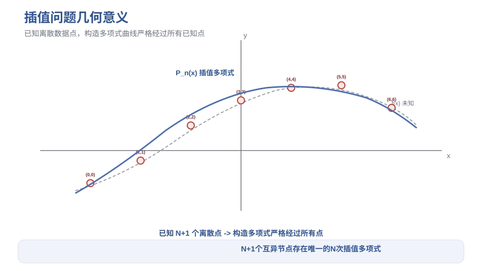
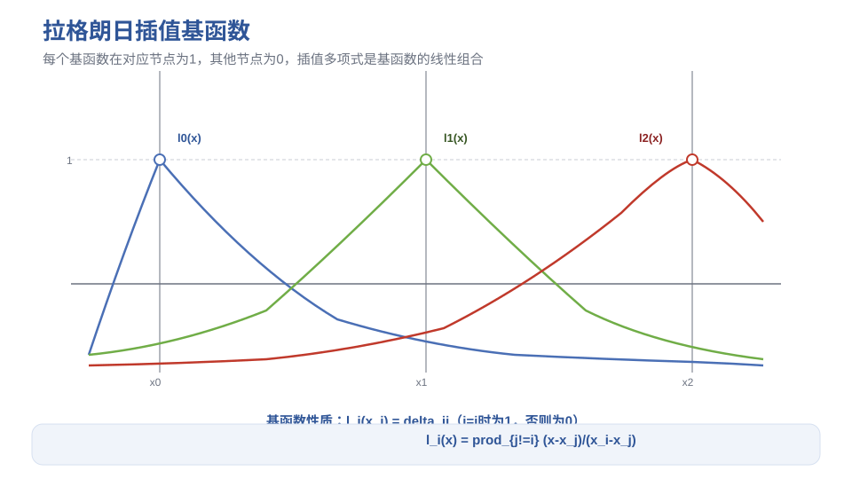
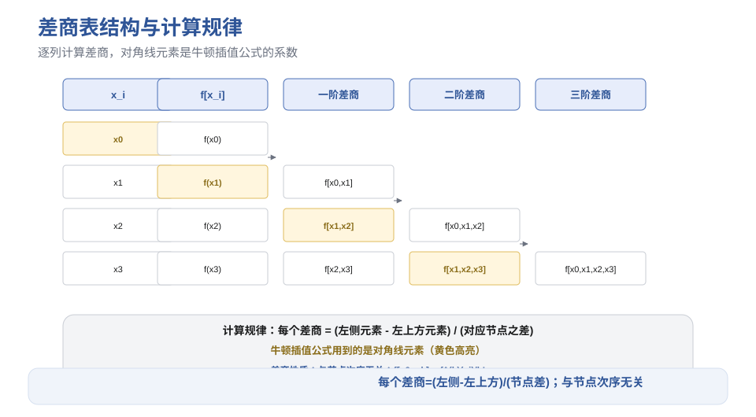
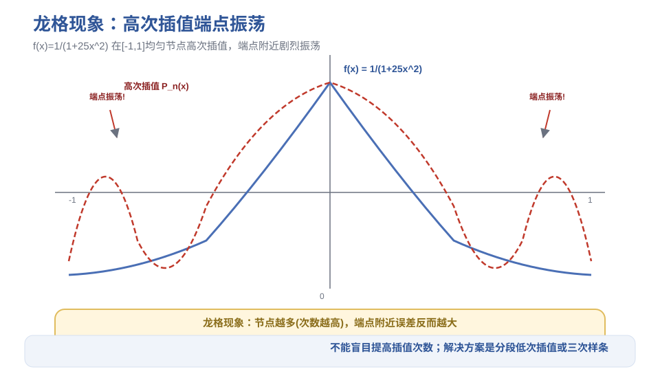
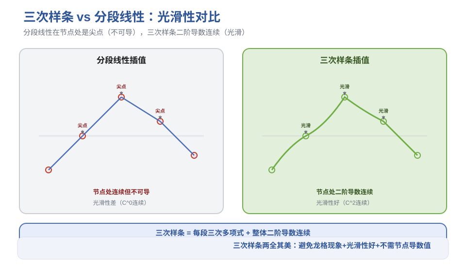

# 第4章 插值法 - 笔记

> 课程：数值计算方法（中国石油大学华东，国家级精品课，BV1NvYSzEEYd）
> 对应视频：p022-p029（4.1 插值问题 ~ 4.8 三次样条插值）

## 目录

- [1. 插值问题概述](#1-插值问题概述)
- [2. 拉格朗日插值法](#2-拉格朗日插值法)
- [3. 牛顿插值法（差商）](#3-牛顿插值法差商)
- [4. 埃尔米特插值](#4-埃尔米特插值)
- [5. 龙格现象](#5-龙格现象)
- [6. 分段低次插值](#6-分段低次插值)
- [7. 三次样条插值](#7-三次样条插值)
- [8. 本节重点](#8-本节重点)

---

## 1. 插值问题概述

### 1.1 问题背景

函数 $f(x)$ 计算复杂或没有解析式，只知道有限个点的函数值（表格形式），需要研究函数变化规律或计算其他点的函数值。

**两个典型场景**：
- 复杂函数（如变上限积分定义的函数），只算出了几个点的值
- 物理实验数据（如水的相对渗透率与饱和度的关系），只有观测数据

### 1.2 插值 vs 拟合

| 方法 | 要求 | 适用场景 |
|------|------|---------|
| **插值** | 插值函数**严格经过**所有已知数据点 | 数据精确，需要精确经过 |
| **拟合** | 近似经过，反映整体趋势 | 数据有误差，不需要精确经过 |

> 本章只讨论多项式插值与分段多项式插值。

### 1.3 插值问题的四个子问题

1. **选择插值函数类型**（多项式、样条、有理函数、三角函数等）
2. **存在性与唯一性**
3. **构造方法**
4. **误差估计**

### 1.4 多项式插值的存在唯一性

给定 $n+1$ 个互异节点 $x_0, x_1, \dots, x_n$ 及函数值 $y_0, y_1, \dots, y_n$，存在**唯一**的次数不超过 $n$ 的多项式 $P_n(x)$ 满足 $P_n(x_i) = y_i$。

> 证明：代入条件得到 $n+1$ 阶线性方程组，系数矩阵是范德蒙矩阵，节点互异时行列式非零，故解唯一。

**注意**：
- 次数 $< n$：方程多未知数少，不一定有解
- 次数 $> n$：未知数多方程少，解不唯一（无穷多）
- 次数恰好 $= n$：存在唯一

### 1.5 插值余项（误差公式）

若 $f^{(n+1)}(x)$ 在 $[a,b]$ 上存在，则对任意 $x \in [a,b]$，存在 $\xi \in [a,b]$ 使：

$$R_n(x) = f(x) - P_n(x) = \frac{f^{(n+1)}(\xi)}{(n+1)!} \prod_{i=0}^{n} (x - x_i)$$

> 证明思路：构造辅助函数，反复用罗尔定理。

**误差估计**：若 $|f^{(n+1)}(x)| \le M_{n+1}$，则

$$|R_n(x)| \le \frac{M_{n+1}}{(n+1)!} \left| \prod_{i=0}^{n} (x - x_i) \right|$$

### 1.6 收敛性问题

不能保证 $n \to \infty$ 时 $P_n(x) \to f(x)$——余项中 $(n+1)!$ 趋于无穷，但 $f^{(n+1)}(\xi)$ 和连乘积也可能增长很快。这就是**龙格现象**的根源（见第5节）。

---

## 2. 拉格朗日插值法

### 2.1 基本思想

先构造**插值基函数** $l_i(x)$，满足：

$$l_i(x_j) = \delta_{ij} = \begin{cases} 1, & i=j \\ 0, & i \neq j \end{cases}$$

然后线性组合：

$$P_n(x) = \sum_{i=0}^{n} y_i \, l_i(x)$$

> 很容易验证 $P_n(x_j) = \sum y_i l_i(x_j) = y_j$，满足插值条件。

### 2.2 基函数公式

$$l_i(x) = \prod_{\substack{j=0 \\ j \neq i}}^{n} \frac{x - x_j}{x_i - x_j} = \frac{(x-x_0)\cdots(x-x_{i-1})(x-x_{i+1})\cdots(x-x_n)}{(x_i-x_0)\cdots(x_i-x_{i-1})(x_i-x_{i+1})\cdots(x_i-x_n)}$$

**规律**：分子是 $x$ 减去除 $x_i$ 外所有节点的连乘积；分母是 $x_i$ 减去除自身外所有节点的连乘积。

### 2.3 二次插值示例（3个节点）

$$P_2(x) = y_0 \frac{(x-x_1)(x-x_2)}{(x_0-x_1)(x_0-x_2)} + y_1 \frac{(x-x_0)(x-x_2)}{(x_1-x_0)(x_1-x_2)} + y_2 \frac{(x-x_0)(x-x_1)}{(x_2-x_0)(x_2-x_1)}$$

### 2.4 算法设计

**直接计算**（两重循环）：
```
S = 0
for i = 0 to n:
    t = y_i
    for j = 0 to n, j != i:
        t = t * (x - x_j) / (x_i - x_j)
    S = S + t
return S
```

**优化**（多个插值点时）：预先计算与 $x$ 无关的部分 $z_i = y_i / \prod_{j \neq i}(x_i - x_j)$，则 $P_n(x) = \left(\prod (x-x_j)\right) \sum \frac{z_i}{x-x_i}$，避免重复计算。

### 2.5 节点选择原则

当已知节点较多而插值次数较低时，**就近选择**插值点附近的节点——误差最小。

> 例：求 $\sin(0.3367)$，已知节点 0.32, 0.34, 0.36，做一次插值时选 0.32 和 0.34（最靠近插值点），精度最高。

---

## 3. 牛顿插值法（差商）

### 3.1 差商（均差）的定义

| 阶数 | 定义 |
|------|------|
| 零阶差商 | $f[x_i] = f(x_i)$ |
| 一阶差商 | $f[x_i, x_j] = \frac{f(x_j) - f(x_i)}{x_j - x_i}$（平均变化率） |
| 二阶差商 | $f[x_i, x_j, x_k] = \frac{f[x_j, x_k] - f[x_i, x_j]}{x_k - x_i}$ |
| $k$阶差商 | $f[x_0, \dots, x_k] = \frac{f[x_1, \dots, x_k] - f[x_0, \dots, x_{k-1}]}{x_k - x_0}$ |

### 3.2 差商的性质

1. **线性组合**：$k$ 阶差商可表示为函数值的线性组合
2. **对称性**：与节点次序无关（任意交换节点次序，差商不变）
3. **多项式降次**：$k$ 阶差商是 $m$ 次多项式 $\Rightarrow$ $k+1$ 阶差商是 $m-1$ 次
4. **与导数的关系**：$f[x_0, \dots, x_k] = \frac{f^{(k)}(\xi)}{k!}$，$\xi$ 在节点构成的区间内

### 3.3 牛顿插值多项式

$$P_n(x) = f(x_0) + f[x_0,x_1](x-x_0) + f[x_0,x_1,x_2](x-x_0)(x-x_1) + \cdots + f[x_0,\dots,x_n]\prod_{i=0}^{n-1}(x-x_i)$$

**与拉格朗日插值的关系**：两者求出的是**同一个多项式**（存在唯一性定理），只是形式不同。

**牛顿插值的优势**：增加节点时只需增加一项，不必重新计算全部；拉格朗日插值增加节点需要全部重算。

### 3.4 差商表

| $x_i$ | $f[x_i]$ | 一阶差商 | 二阶差商 | 三阶差商 |
|-------|----------|---------|---------|---------|
| $x_0$ | $f(x_0)$ | | | |
| $x_1$ | $f(x_1)$ | $f[x_0,x_1]$ | | |
| $x_2$ | $f(x_2)$ | $f[x_1,x_2]$ | $f[x_0,x_1,x_2]$ | |
| $x_3$ | $f(x_3)$ | $f[x_2,x_3]$ | $f[x_1,x_2,x_3]$ | $f[x_0,x_1,x_2,x_3]$ |

> 计算规律：每个差商 = （左侧元素 - 左上方元素）/（对应节点之差）。牛顿公式中用到的是**对角线元素**。

### 3.5 高效算法

**差商存储**：用一维数组覆盖计算（只需存对角线元素），计算次序**下标由大到小**（避免覆盖需要的数据）。

**函数值计算——秦九韶算法**（嵌套乘法）：

$$P_n(x) = (\cdots((a_n(x-x_{n-1}) + a_{n-1})(x-x_{n-2}) + a_{n-2})\cdots)(x-x_0) + a_0$$

只需 $n$ 次乘法（直接计算需要 $n(n+1)/2$ 次）。

---

## 4. 埃尔米特插值

### 4.1 问题提出

不仅要求插值多项式与被插值函数在节点处**函数值相同**，还要求**导数值相同**（一阶、二阶直到某阶）。

> 拉格朗日插值是埃尔米特插值的特殊情况（只要求函数值，即各节点 $m_i=0$）。

### 4.2 存在唯一性

给定节点 $x_0, \dots, x_n$，在 $x_i$ 处要求函数值及直到 $m_i$ 阶导数值相同，则存在唯一的次数不超过 $M$ 的多项式，其中

$$M = \sum_{i=0}^{n} (m_i + 1) - 1 = n + \sum m_i$$

> $M$ 正好是全部条件数减一。

### 4.3 余项公式

$$R(x) = f(x) - H(x) = \frac{f^{(M+1)}(\xi)}{(M+1)!} \prod_{i=0}^{n} (x - x_i)^{m_i + 1}$$

### 4.4 两种构造方法

**方法一：基函数法**（类似拉格朗日）

以最常见的"函数值+一阶导数值"情况为例（$2n+1$ 次多项式）：

构造基函数 $\alpha_i(x)$ 和 $\beta_i(x)$，满足：
- $\alpha_i(x_j) = \delta_{ij}$，$\alpha_i'(x_j) = 0$
- $\beta_i(x_j) = 0$，$\beta_i'(x_j) = \delta_{ij}$

则 $H(x) = \sum [y_i \alpha_i(x) + y_i' \beta_i(x)]$。

具体形式：
- $\alpha_i(x) = (ax + b) l_i^2(x)$
- $\beta_i(x) = c(x - x_i) l_i^2(x)$

其中 $l_i(x)$ 是拉格朗日基函数，系数由条件确定。

**方法二：重节点差商法**（更通用）

拓展差商定义，允许重节点：

$$f[\underbrace{x, \dots, x}_{k+1}] = \frac{f^{(k)}(x)}{k!}$$

这样埃尔米特插值与拉格朗日插值**统一处理**：把有导数要求的节点看作重节点（如要求函数值+一阶导数→节点出现两次），构造带重节点的差商表，代入牛顿插值公式即可。

> 重节点差商法适合任意阶导数要求的埃尔米特插值，是更通用的方法。

---

## 5. 龙格现象

### 5.1 现象

高次多项式插值不一定提高精度，反而可能在区间端点附近产生剧烈振荡。

**经典例子**：$f(x) = \frac{1}{1+25x^2}$，在 $[-1, 1]$ 上取均匀节点做高次插值：
- $n=6$：除节点外误差较大，端点附近更明显
- $n=8, 10, 12$：端点附近误差**越来越大**，插值效果没有提高反而更差

### 5.2 原因分析

余项公式：

$$R_n(x) = \frac{f^{(n+1)}(\xi)}{(n+1)!} \prod_{i=0}^{n} (x - x_i)$$

- $(n+1)!$ 趋于无穷（有利）
- 但 $f^{(n+1)}(\xi)$ 可能增长极快（不利，如 $1/(1+25x^2)$ 的高阶导数）
- 连乘积在端点附近也较大（不利）

综合效果：余项可能不趋于零，甚至无界。

### 5.3 结论

- **不能盲目提高插值次数**
- 必须做误差分析：若余项趋于零，可提高次数；否则不能
- 解决方案：**分段低次插值**（下一节）或**三次样条插值**（第7节）

---

## 6. 分段低次插值

### 6.1 基本思想

把插值区间分割为若干小区间，在每个小区间上用低次多项式（一次或二次）插值。整个区间上的插值函数是分段多项式。

### 6.2 优缺点

| 优点 | 缺点 |
|------|------|
| 避免龙格现象 | 光滑性差（分段线性在节点处不可导） |
| 可任意提高精度（增加小区间） | 不能满足有导数要求的问题 |
| 计算简单 | |

> 如果只需要近似函数值，分段插值非常有效。

### 6.3 分段线性插值

在每个小区间 $[x_{i-1}, x_i]$ 上用一次多项式（直线）连接相邻节点。

**余项估计**：

$$|R(x)| \le \frac{M_2 h^2}{8}$$

其中 $M_2 = \max |f''(x)|$，$h = \max(x_i - x_{i-1})$ 是最大小区间长度。

> 只要 $h$ 足够小，就能保证任意精度要求。

### 6.4 分段二次插值

在每个小区间上用二次多项式插值（需要3个节点），余项类似，精度更高（同样 $h$ 下误差更小）。

### 6.5 典型例题

在 $[-\pi, \pi]$ 上对 $\sin x$ 做分段线性插值，要求误差 $\le 10^{-6}$。

利用余项公式 $|R| \le M_2 h^2 / 8$，$M_2 = 1$（$\sin x$ 二阶导数最大值），解得 $h \le \sqrt{8 \times 10^{-6}} \approx 0.0028$，需要约 2223 个节点。

> 分段二次插值需要的节点数少得多（精度更高）。

---

## 7. 三次样条插值

### 7.1 问题：两全其美

- 高次多项式插值：光滑性好（任意阶可导），但可能龙格现象
- 分段低次插值：避免龙格现象，但光滑性差
- 分段埃尔米特插值：光滑性好，但需要提供节点处的导数值

**三次样条插值**：每个小区间上是三次多项式，整个区间上具有**连续的二阶导数**——既避免龙格现象，又光滑性好，还不需要提供节点导数值！

### 7.2 定义

给定分割 $a = x_0 < x_1 < \dots < x_n = b$，若函数 $S(x)$ 满足：
1. 在每个小区间 $[x_{i-1}, x_i]$ 上是三次多项式
2. 在整个 $[a,b]$ 上具有连续的二阶导数（$S, S', S''$ 都连续）

则称 $S(x)$ 为三次样条函数。若再满足插值条件 $S(x_i) = f(x_i)$，则称为三次样条插值函数。

### 7.3 条件数与边界条件

- $n$ 个小区间 $\times$ 每个三次多项式4个参数 = $4n$ 个参数
- 插值条件：$n+1$ 个
- 内部节点连续性：$(n-1) \times 3 = 3n-3$ 个（函数值、一阶导、二阶导连续）
- 合计：$4n-2$ 个条件

**还差2个条件** → 需要补充**边界条件**：

| 类型 | 条件 | 特殊情况 |
|------|------|---------|
| 第一类 | 给定端点一阶导数 $S'(x_0), S'(x_n)$ | |
| 第二类 | 给定端点二阶导数 $S''(x_0), S''(x_n)$ | $S''(x_0)=S''(x_n)=0$ → **自然样条** |
| 第三类 | 周期边界条件（$f$ 是周期函数） | |

### 7.4 求解方法（三弯矩方程）

设 $M_i = S''(x_i)$（力学上称为弯矩）。由于 $S''$ 在每个小区间上是线性函数，可用一次插值写出 $S''(x)$，积分两次并利用插值条件确定常数，得到 $S(x)$ 在小区间上的表达式。

再利用 $S'$ 在内部节点的连续性，建立关于 $M_0, M_1, \dots, M_n$ 的线性方程组——这是一个**三对角方程组**，可用**追赶法**（第3章）高效求解。

求出所有 $M_i$ 后，代入 $S(x)$ 的表达式即可。

### 7.5 三次样条的性质

1. **最小曲率性质**：自然三次样条的 $\int (S'')^2 dx$ 最小（在所有满足插值条件的函数中），即曲率变化最平缓
2. **最佳逼近性质**：带斜率边界条件的样条对 $f''$ 的逼近最优
3. **收敛性**：若 $f^{(4)}$ 连续，$h \to 0$ 时，不仅 $S \to f$，$S' \to f'$，$S'' \to f''$，$S''' \to f'''$ 都成立

> 三次样条具有良好的逼近性质，是实际应用中最常用的插值方法。

---

## 配图

> **图1** 插值问题几何意义：已知离散点，构造曲线经过所有点（自绘）。


> **图2** 拉格朗日插值基函数图形：每个基函数在对应节点为1，其他节点为0（自绘）。


> **图3** 差商表结构与计算规律（自绘）。


> **图4** 龙格现象：f(x)=1/(1+25x²) 高次插值在端点附近剧烈振荡（自绘）。


> **图5** 三次样条 vs 分段线性：光滑性对比（自绘）。


---

## 8. 本节重点

> **本节重点**：
> - **插值问题**：N+1个互异节点→存在唯一的N次插值多项式；余项 $R_n = f^{(n+1)}(\xi)/(n+1)! \cdot \Pi(x-x_i)$
> - **拉格朗日插值**：基函数 $l_i(x_j)=\delta_{ij}$，$P_n = \sum y_i l_i$；增加节点需全部重算；节点就近选择精度最高
> - **牛顿插值**：差商定义 $f[x_0..x_k]=(f[x_1..x_k]-f[x_0..x_{k-1}])/(x_k-x_0)$；差商与节点次序无关；$f[x_0..x_k]=f^{(k)}(\xi)/k!$；增加节点只需加一项
> - **差商表**：逐列计算，对角线元素是牛顿公式的系数；一维数组覆盖计算时下标由大到小；秦九韶算法只需N次乘法
> - **埃尔米特插值**：要求函数值+导数值相同；重节点差商法统一处理（$f[x..x]=f^{(k)}(x)/k!$）；余项中 $(x-x_i)^{m_i+1}$
> - **龙格现象**：高次插值不一定提高精度，$f=1/(1+25x^2)$ 在端点振荡；不能盲目提高次数
> - **分段插值**：小区间低次多项式，避免龙格现象；分段线性余项 $\le M_2 h^2/8$；光滑性差
> - **三次样条**：每段三次多项式+整体二阶导数连续；需补充2个边界条件（第一类/第二类/周期）；三对角方程组用追赶法求解；自然样条曲率最小；收敛性好（S,S',S'',S'''都收敛）
> - **常见坑**：
>   - 插值多项式次数必须恰好=N，次数<N不一定有解，>N解不唯一
>   - 拉格朗日和牛顿求出的是同一个多项式，不要以为是两个不同的结果
>   - 差商计算分母是 $x_k - x_0$（不是 $x_k - x_{k-1}$），注意节点范围
>   - 高次插值前先做误差分析，不要默认次数越高越好
>   - 三次样条必须给边界条件，否则解不唯一

---

> **竞赛模板 → ICPC/数值计算**：拉格朗日插值、牛顿插值（差商表）、分段线性插值是编程竞赛中数值题的常用技巧。三次样条在图形学、数据平滑中也有广泛应用。
