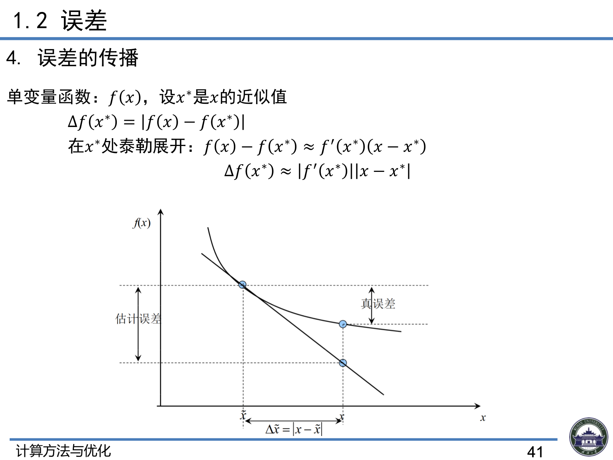
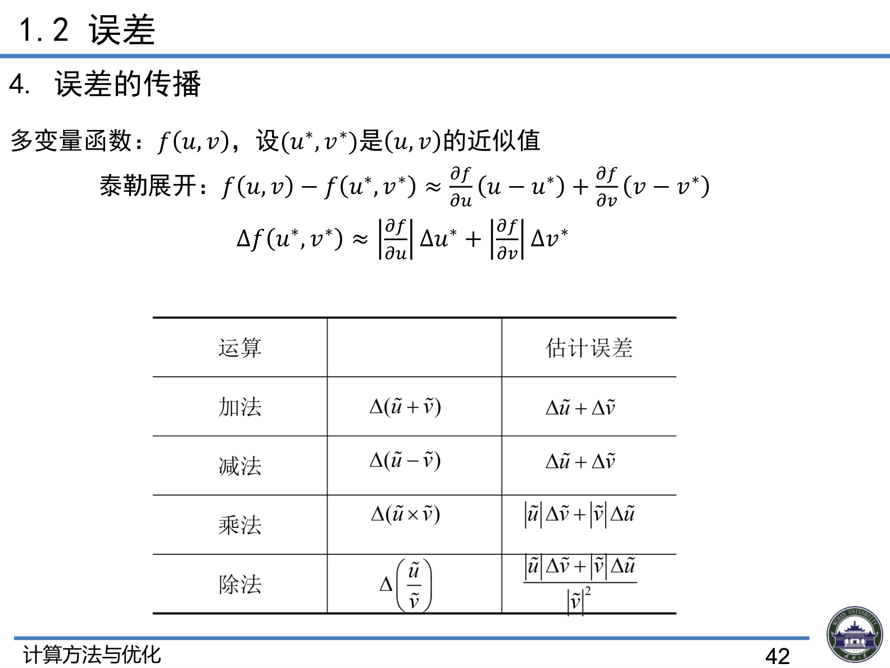

# 1.2 误差

> 上课：9.8 晚 ｜ 对应课件章节：第一章 1.2 误差（CM+Opt_ch1.pdf P35–42）
> [返回总览](00-总览与索引.md)

## 1. 误差的来源与分类（课件 P35–36）

误差是用来描述数值计算中近似解的精确程度的概念，是科学计算中十分重要的概念。

**四大来源：**

| 来源 | 含义 | 英文 |
|------|------|------|
| 模型误差 | 从实际问题中抽象出数学模型时引入 | Modeling Error |
| 观测误差 | 通过测量得到模型中参数的值时引入 | Measurement Error |
| 方法误差/截断误差 | 用近似方法求近似解（如截断无穷级数） | Truncation Error |
| 舍入误差 | 机器字长有限，实数只能近似存储 | Round-off Error |

**前提假定**：数值分析中总假定数学模型是准确的，因此**不考虑模型误差和观测误差**，主要研究**截断误差和舍入误差**对计算结果的影响。

> 思考（课件 P36）：如何计算 $\int_0^1 e^{-x^2}dx$？——见下文第 5 节泰勒展开的例子。

## 2. 绝对误差与相对误差（课件 P38–39）

**绝对误差**：$\varepsilon = |x - x^*|$（$x^*$ 为精确值，$x$ 为近似值）
- $\varepsilon$ 的上限记为 $\varepsilon^*$，称为**绝对误差限**
- 工程上常记 $x^* = x \pm \varepsilon^*$
- 绝对误差越小越有参考价值，但**不能很好地表示近似值的精确程度**（量级不同的数没法比）

**相对误差**：$\xi = \left|\dfrac{x-x^*}{x^*}\right|$，更能反映近似程度
- 真值难以求出，常用替代定义：$\xi = \left|\dfrac{x^*-x}{x}\right|$
- 近似值的精确程度取决于**相对误差**的大小；实际计算中能得到的是**相对误差限**

## 3. 有效数字

**有效数字定义**：用科学计数法，记 $x = \pm 0.a_1 a_2 \dots a_n \times 10^m$（其中 $a_1 \neq 0$），若

$$|x - x^*| \le 0.5 \times 10^{m-n}$$

（即 $a_n$ 的截取按四舍五入规则），则称 $x$ 有 **n 位有效数字**，精确到小数点后第 $m-n$ 位。

**例 1**：设 $x^* = \pi$，求 $x = 3.1415$ 的有效数字。

板书推导：

$$x^* - x = 0.00009\dots = 0.9\dots \times 10^{-4} = 0.09\dots \times 10^{-3} \Rightarrow m - n = -3$$

$$x = 0.31415 \times 10^1 \Rightarrow m = 1,\quad n = 4$$

即 $x = 3.1415$ 有 **4 位有效数字**（误差不超过 $0.5\times10^{-3}$）。

> 课件练习：对 42.195、0.0375551，按四舍五入写出具有四位有效数字的近似数。
> （42.195 → 42.20；0.0375551 → 0.03756，注意四舍五入的进位与末位保留。）

## 4. 误差的传播（课件 P41–42）

**单变量函数** $f(x)$：设 $x^*$ 是 $x$ 的近似值

$$\Delta f(x^*) = |f(x) - f(x^*)|$$

在 $x^*$ 处泰勒展开：$f(x) - f(x^*) \approx f'(x^*)(x - x^*)$，故

$$\Delta f(x^*) \approx |f'(x^*)|\,|x - x^*| = |f'(x^*)|\,\Delta x^*$$

（误差被导数 $|f'|$ 放大或缩小——这就是误差传播的系数。）

**多变量函数** $f(u,v)$：设 $(u^*, v^*)$ 是 $(u,v)$ 的近似值，泰勒展开：

$$f(u,v) - f(u^*,v^*) \approx \frac{\partial f}{\partial u}(u-u^*) + \frac{\partial f}{\partial v}(v-v^*)$$

$$\Delta f(u^*,v^*) \approx \left|\frac{\partial f}{\partial u}\right|\Delta u^* + \left|\frac{\partial f}{\partial v}\right|\Delta v^*$$

**四则运算的误差估计**：

| 运算 | 估计误差 |
|------|---------|
| 加法 | $\Delta(\tilde{u}+\tilde{v}) = \Delta\tilde{u} + \Delta\tilde{v}$ |
| 减法 | $\Delta(\tilde{u}-\tilde{v}) = \Delta\tilde{u} + \Delta\tilde{v}$（相减误差相加，可导致灾难性抵消） |
| 乘法 | $\Delta(\tilde{u}\times\tilde{v}) = |\tilde{u}|\Delta\tilde{v} + |\tilde{v}|\Delta\tilde{u}$ |
| 除法 | $\Delta\left(\dfrac{\tilde{u}}{\tilde{v}}\right) = \dfrac{|\tilde{u}|\Delta\tilde{v} + |\tilde{v}|\Delta\tilde{u}}{|\tilde{v}|^2}$ |

## 5. 例：用泰勒展开计算 $\int_0^1 e^{-x^2}dx$（课件 P37）

**① 泰勒展开**：$e^{-x^2} = \sum_{k=0}^{\infty}\frac{(-1)^k x^{2k}}{k!}$，该级数在 $\mathbb{R}$ 上收敛

**② 逐项积分**：

$$I = \int_0^1 e^{-x^2}dx = \sum_{k=0}^{\infty}\frac{(-1)^k}{k!}\int_0^1 x^{2k}dx = \sum_{k=0}^{\infty}\frac{(-1)^k}{k!(2k+1)}$$

**③ 截断近似**：取前 $n+1$ 项 $I_n = \sum_{k=0}^{n}\frac{(-1)^k}{k!(2k+1)}$

例 $n=4$：$I_4 = 1 - \frac{1}{3} + \frac{1}{2!\cdot5} - \frac{1}{3!\cdot7} + \frac{1}{4!\cdot9} \approx 0.7474868$

**④ 残差估计**：$R_n = I - I_n = \sum_{k=n+1}^{\infty}\frac{(-1)^k}{k!(2k+1)}$，$a_k = \frac{1}{k!(2k+1)}$ 单调下降趋于 0，由交错级数余项估计（Leibniz）：

$$|R_n| \le \frac{1}{(n+1)!(2n+3)}$$

**⑤ 数值对照**（真实值 $\int_0^1 e^{-x^2}dx \approx 0.7468241328$）：

| n | 近似值 $I_n$ | 误差估计 | 实际误差 $|I-I_n|$ |
|---|------------|---------|-------------------|
| 0 | 1.0000000 | $1/3 \approx 3.33\times10^{-1}$ | $2.53\times10^{-1}$ |
| 1 | 0.6666667 | $1/6 \approx 1.00\times10^{-1}$ | $8.02\times10^{-2}$ |
| 2 | 0.7666667 | $1/42 \approx 2.38\times10^{-2}$ | $1.98\times10^{-2}$ |
| 3 | 0.7428571 | $1/216 \approx 4.63\times10^{-3}$ | $3.97\times10^{-3}$ |
| 4 | 0.7474868 | $1/1320 \approx 7.58\times10^{-4}$ | $6.63\times10^{-4}$ |
| 5 | 0.7467293 | $1/9360 \approx 1.07\times10^{-4}$ | $9.48\times10^{-5}$ |

**结论**：用泰勒展开可以得到积分的高精度近似，并且可以**显式地估计截断误差**。

