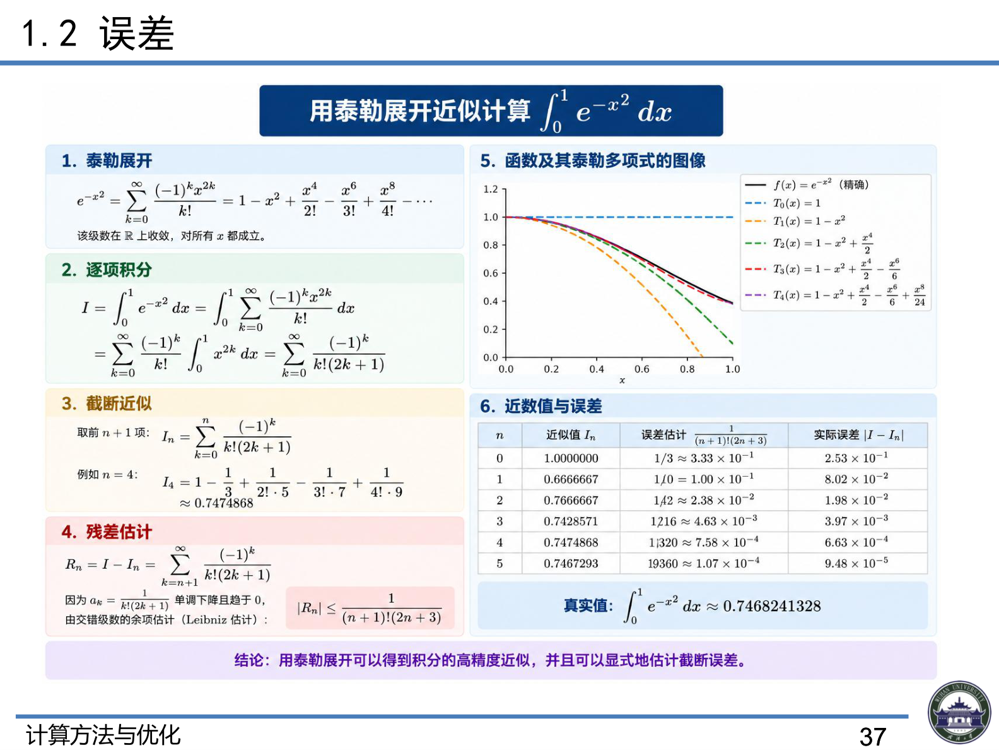

# 1.2 误差

> 上课：9.8 晚 ｜ 对应课件章节：第一章 1.2 误差（CM+Opt_ch1.pdf P35–42）
> 对应课本：李庆扬《数值分析》§1.2 数值计算的误差、§1.3 误差定性分析与避免误差危害（教材做主线，本文按课本补充）
> [返回总览](../00-索引.md)

## 1. 误差的来源与分类（课件 P35–36）

误差是用来描述数值计算中近似解的精确程度的概念，是科学计算中十分重要的概念。

**四大来源：**

| 来源 | 含义 | 英文 |
|------|------|------|
| 模型误差 | 从实际问题中抽象出数学模型时引入 | Modeling Error |
| 观测误差 | 通过测量得到模型中参数的值时引入 | Measurement Error |
| 方法误差/截断误差 | 用近似方法求近似解（如截断无穷级数） | Truncation Error |
| 舍入误差 | 机器字长有限，实数只能近似存储 | Round-off Error |

**前提假定**：数值分析中总假定数学模型是准确的，因此**不考虑模型误差和观测误差**，主要研究**截断误差和舍入误差**对计算结果的影响。

> 思考（课件 P36）：如何计算 $\int_0^1 e^{-x^2}dx$？——见下文第 6 节泰勒展开的例子。

## 2. 绝对误差与相对误差（课件 P38–39）

**绝对误差**：$\varepsilon = |x - x^*|$（$x^*$ 为精确值，$x$ 为近似值）
- $\varepsilon$ 的上限记为 $\varepsilon^*$，称为**绝对误差限**
- 工程上常记 $x^* = x \pm \varepsilon^*$
- 绝对误差越小越有参考价值，但**不能很好地表示近似值的精确程度**（量级不同的数没法比）

**相对误差**：$\xi = \left|\dfrac{x-x^*}{x^*}\right|$，更能反映近似程度
- 真值难以求出，常用替代定义：$\xi = \left|\dfrac{x^*-x}{x}\right|$
- 近似值的精确程度取决于**相对误差**的大小；实际计算中能得到的是**相对误差限**

## 3. 有效数字

**有效数字定义**：用科学计数法，记 $x = \pm 0.a_1 a_2 \dots a_n \times 10^m$（其中 $a_1 \neq 0$），若

$$|x - x^*| \le 0.5 \times 10^{m-n}$$

（即 $a_n$ 的截取按四舍五入规则），则称 $x$ 有 **n 位有效数字**，精确到小数点后第 $m-n$ 位。

**例 1**：设 $x^* = \pi$，求 $x = 3.1415$ 的有效数字。

板书推导：

$$x^* - x = 0.00009\dots = 0.9\dots \times 10^{-4} = 0.09\dots \times 10^{-3} \Rightarrow m - n = -3$$

$$x = 0.31415 \times 10^1 \Rightarrow m = 1,\quad n = 4$$

即 $x = 3.1415$ 有 **4 位有效数字**（误差不超过 $0.5\times10^{-3}$）。

> 课件练习：对 42.195、0.0375551，按四舍五入写出具有四位有效数字的近似数。
> （42.195 → 42.20；0.0375551 → 0.03756，注意四舍五入的进位与末位保留。）

## 4. 误差的传播（课件 P41–42）

**单变量函数** $f(x)$：设 $x^*$ 是 $x$ 的近似值

$$\Delta f(x^*) = |f(x) - f(x^*)|$$

在 $x^*$ 处泰勒展开：$f(x) - f(x^*) \approx f'(x^*)(x - x^*)$，故

$$\Delta f(x^*) \approx |f'(x^*)|\,|x - x^*| = |f'(x^*)|\,\Delta x^*$$

（误差被导数 $|f'|$ 放大或缩小——这就是误差传播的系数。）

**多变量函数** $f(u,v)$：设 $(u^*, v^*)$ 是 $(u,v)$ 的近似值，泰勒展开：

$$f(u,v) - f(u^*,v^*) \approx \frac{\partial f}{\partial u}(u-u^*) + \frac{\partial f}{\partial v}(v-v^*)$$

$$\Delta f(u^*,v^*) \approx \left|\frac{\partial f}{\partial u}\right|\Delta u^* + \left|\frac{\partial f}{\partial v}\right|\Delta v^*$$

**四则运算的误差估计**（课本 §1.2.3）：设两个近似数 $x_1^*, x_2^*$ 的误差限分别为 $\varepsilon(x_1^*)$、$\varepsilon(x_2^*)$，则加、减、乘、除运算得到的误差限分别满足不等式：

| 运算 | 误差限（课本标准形式） |
|------|------------------------|
| 加减 | $\varepsilon(x_1^* \pm x_2^*) \le \varepsilon(x_1^*) + \varepsilon(x_2^*)$ |
| 乘法 | $\varepsilon(x_1^* x_2^*) \le \lvert x_1^* \rvert \varepsilon(x_2^*) + \lvert x_2^* \rvert \varepsilon(x_1^*)$ |
| 除法 | $\varepsilon\left(\dfrac{x_1^*}{x_2^*}\right) \le \dfrac{\lvert x_1^* \rvert \varepsilon(x_2^*) + \lvert x_2^* \rvert \varepsilon(x_1^*)}{\lvert x_2^* \rvert^2},\quad x_2^* \ne 0$ |

**推导（一阶泰勒展开的统一视角）**：设 $x_1 = x_1^* + \varepsilon_1$，$x_2 = x_2^* + \varepsilon_2$（$\lvert\varepsilon_1\rvert \le \varepsilon(x_1^*)$，$\lvert\varepsilon_2\rvert \le \varepsilon(x_2^*)$）。对 $f(x_1, x_2)$ 在 $(x_1^*, x_2^*)$ 处做一阶泰勒展开，误差按一阶项线性传播（即前面多元函数误差公式的直接应用）：

$$\varepsilon(f) \approx \left\lvert\frac{\partial f}{\partial x_1}\right\rvert \varepsilon(x_1^*) + \left\lvert\frac{\partial f}{\partial x_2}\right\rvert \varepsilon(x_2^*)$$

四种运算分别代入：

- **加减法** $f = x_1 \pm x_2$：$f_{x_1} = 1,\ f_{x_2} = \pm 1$，取绝对值后 $\varepsilon(x_1^* \pm x_2^*) \le \varepsilon(x_1^*) + \varepsilon(x_2^*)$——两误差同号相加，取"最坏情况"（相减时误差可能相消，但误差限保守取相加）；
- **乘法** $f = x_1 x_2$：$f_{x_1} = x_2,\ f_{x_2} = x_1 \Rightarrow \lvert x_1^* \rvert \varepsilon(x_2^*) + \lvert x_2^* \rvert \varepsilon(x_1^*)$。等价地直接展开：$x_1 x_2 - x_1^* x_2^* = x_1^* \varepsilon_2 + x_2^* \varepsilon_1 + \varepsilon_1 \varepsilon_2$，舍去二阶小量 $\varepsilon_1 \varepsilon_2$ 后取绝对值即得；
- **除法** $f = x_1 / x_2$：$f_{x_1} = \dfrac{1}{x_2},\ f_{x_2} = -\dfrac{x_1}{x_2^2} \Rightarrow \dfrac{\lvert x_2^* \rvert \varepsilon(x_1^*) + \lvert x_1^* \rvert \varepsilon(x_2^*)}{\lvert x_2^* \rvert^2}$（分母 $x_2 x_2^* \approx x_2^{*2}$，因 $x_2 \approx x_2^*$）。

## 5. 误差定性分析：数值稳定性、病态与避免误差危害（课本 §1.3）

> 为什么只能做定性分析？实际计算往往要运算成千上万次，每步都有误差，逐部做误差分析不可能也不科学——误差积累有正有负，都按最坏情况（误差限相加）估计过于保守，不反映实际误差积累。有人用概率统计方法把舍入误差视为随机变量（概率分析法）；20 世纪 60 年代后有 Wilkinson 的**向后误差分析法**和 Moore 的**区间分析法**，但至今舍入误差的定量估计尚无有效方法，所以通常只做**定性分析**。

### 5.1 算法的数值稳定性（课本定义 3）

**定义**：一个算法如果输入数据有误差，而在计算过程中舍入误差**不增长**，则称此算法是**数值稳定**的；否则称其为**不稳定**的。

**例（课本例 5，经典递推稳定性）**：计算 $I_n = \int_0^1 x^n e^{x-1}dx\ (n=0,1,\dots)$。由分部积分得递推公式

$$I_n = 1 - nI_{n-1},\qquad I_0 = 1 - e^{-1} \approx 0.6321$$

- **方案 A（正向递推）**：由 $I_0$ 逐次求 $I_1, I_2, \dots$。设初值误差 $E_0 = I_0 - I_0^*$，则

$E_n = -n E_{n-1} \Rightarrow E_n = (-1)^n n!\, E_0$

  误差被放大 $n!$ 倍（$n=8$ 时 $8! = 40320$ 倍），$I_8$ 甚至算出负值——而真实 $I_n > 0$。**数值不稳定**。
- **方案 B（倒向递推）**：由积分估值 $\frac{1}{e(N+1)} \le I_N \le \frac{1}{N+1}$ 粗略取 $I_N^*$，再用 $I_{n-1} = \dfrac{1 - I_n}{n}$ 倒着算回 $I_0$。误差每步缩小约 $n$ 倍：$|E_{n-1}^*| = |E_n^*|/n$，最终 $|E_0^*| \le |E_N^*|/N!$。**数值稳定**，结果误差不超过 $10^{-4}$。

> 积分估值 $\dfrac{1}{e(N+1)} \le I_N \le \dfrac{1}{N+1}$ 怎么来的：因为 $x \in [0,1]$ 时 $e^{x-1}$ 单调，最小值在 $x=0$ 处取 $e^{-1}=\frac{1}{e}$，最大值在 $x=1$ 处取 $e^0=1$，即 $\frac{1}{e} \le e^{x-1} \le 1$。由积分比较定理（被积函数逐点夹住，积分也被夹住）：
>
> $$\frac{1}{e}\int_0^1 x^N dx \le I_N = \int_0^1 x^N e^{x-1}dx \le \int_0^1 x^N dx$$
>
> 而 $\int_0^1 x^N dx = \dfrac{1}{N+1}$，即得估值式。**用途**：给倒向递推提供一个粗略初值 $I_N^*$（常取区间中点 $\frac{1}{2}(\frac{1}{e(N+1)}+\frac{1}{N+1})$），初始误差不超过区间宽度的一半 $\frac{1}{2}(1-\frac{1}{e})\frac{1}{N+1}$——之后每步除以 $n$，误差被迅速抹平。

**结论**：数值不稳定的算法**不能使用**。同一个数学问题可以有不同的计算方案，公式本身正确 ≠ 用它计算就可靠——这正是"算法设计"（笔记 1.1）重要的原因。

### 5.2 病态问题与条件数（课本 1.3.2）

**定义**：若输入数据有微小扰动（误差）时，引起输出数据（问题的解）相对误差很大，则称问题是**病态**的。

**函数值问题的条件数**：设 $f(x)$ 可微，由泰勒展开 $f(x) - f(x^*) \approx f'(x^*)(x-x^*)$ 得

$$\frac{|f(x) - f(x^*)|}{|f(x^*)|} \approx \underbrace{\left|\frac{x^* f'(x^*)}{f(x^*)}\right|}_{C_p} \cdot \frac{|x - x^*|}{|x^*|}$$

$C_p$ 称为计算函数值问题的**条件数**：自变量相对误差的放大倍数。

- **例**：$f(x) = x^n \Rightarrow C_p = n$。$n=10$ 时，$x$ 有 2% 相对误差（$x=1 \to x^*=1.02$），$f$ 有约 24% 相对误差（$f(1)=1,\ f(1.02)\approx1.24$）。
- **经验判据**：一般 $C_p \ge 10$ 就认为病态，$C_p$ 越大病态越严重。
- **例（线性方程组病态，课本例 6）**：解 $\begin{cases}2x_1 + x_2 = 2\\ \alpha x_1 + x_2 = \alpha\end{cases}$ 时，$\alpha=0.99$ 解 $x\approx50.25$；$\alpha$ 有 0.001 扰动取 $\alpha^*=0.991$ 时解约 55.81，误差很大——由条件数公式得 $C_p\approx100$，病态。
- **注意**：病态是**数值问题自身固有的**，不是计算方法引起的。先分清问题是否病态，对病态问题须采取特殊方法（如迭代改善法）。

**病态 vs 数值稳定（两者层面不同，常被混淆）**：

| 维度 | 病态（问题） | 数值稳定（算法） |
|------|-------------|-----------------|
| 属性对象 | **问题本身**（数学模型/方程组） | **算法**（求解方法） |
| 决定因素 | 条件数 $C_p$ / $\text{cond}(A)$ | 误差在计算过程中的增长/缩小 |
| 换算法能救吗 | 不能——问题固有，任何算法都受条件数限制 | 能——同一问题可换稳定算法（例 5：正向→倒向递推） |
| 典型例子 | 例 6 线性方程组（$\alpha$ 微扰→解巨变） | 例 5 $I_n$ 递推（正向放大 $n!$ 倍 / 倒向稳定） |

组合关系：**稳定算法 × 良态问题** → 结果好；**稳定算法 × 病态问题** → 结果仍差（受问题本身条件数限制）；**不稳定算法 × 良态问题** → 结果也可能很差（算法把误差放大了）。因此：先判断问题是否病态（选合适的问题处理方法），再选择数值稳定的算法。

### 5.3 避免误差危害的若干原则（课本 1.3.3）

**① 避免两相近数相减**（相减会损失有效数字）：

- **例 7**：求 $x^2 - 16x + 1 = 0$ 的小正根。直接算 $x_2 = 8 - \sqrt{63} \approx 8 - 7.94 = 0.06$ 只有**一位**有效数字；改用韦达定理 $x_2 = \frac{1}{x_1} = \frac{1}{8+\sqrt{63}} \approx 0.0627$ 得**三位**有效数字。
- **例 8**：计算 $A = 10^7(1 - \cos 2°)$。直接算 $A = 10^7(1-0.9994) = 6\times10^3$ 只有一位有效数字；利用 $1-\cos2° = 2\sin^2 1°$，$A = 2\times10^7\sin^2 1° = 6.13\times10^3$ 得三位有效数字。
- 一般做法：当 $f(x) \approx f(x^*)$（两数很接近）时，用泰勒展开取右端有限项代替左端。

**② 防止大数"吃"小数**：

- **例 9**：在五位十进制计算机上算 $A = 52492 + \sum_{i=1}^{1000}\delta_i$（$0.1 \le \delta_i \le 0.9$）。对阶后每个 $\delta_i$ 写成 $0.000009\times10^5$，五位机中表示为机器 0，结果 $\hat A = 52492$——小数被大数吃掉，不可靠。若先把 1000 个 $\delta_i$ 相加（约 500），再加 52492，则 $52592 \le A \le 53392$。

**③ 避免用绝对值很小的数做除数**：会急剧放大舍入误差（与消元选主元的动机相同，见直接法章节）。

**④ 注意运算次序、减少运算次数**：

- **例 10**：计算 $\ln 2$。用 $\ln(1+x) = x - \frac{x^2}{2} + \frac{x^3}{3} - \dots$ 取 $x=1$，要 $N=10^5$ 项才精确到 $10^{-5}$，计算量巨大且舍入误差积累严重；改用 $\ln\frac{1+x}{1-x} = 2\sum_{k=1}^{\infty}\frac{x^{2k-1}}{2k-1}$，取 $x=\frac{1}{3}$，只要前 10 项，截断误差便 $< 10^{-10}$。

如果无法改变算式，则增加有效位数（计算机上用双倍字长运算），但更耗时、占内存。

## 6. 例：用泰勒展开计算 $\int_0^1 e^{-x^2}dx$（课件 P37）

**① 泰勒展开**：$e^{-x^2} = \sum_{k=0}^{\infty}\frac{(-1)^k x^{2k}}{k!}$，该级数在 $\mathbb{R}$ 上收敛

**② 逐项积分**：

$$I = \int_0^1 e^{-x^2}dx = \sum_{k=0}^{\infty}\frac{(-1)^k}{k!}\int_0^1 x^{2k}dx = \sum_{k=0}^{\infty}\frac{(-1)^k}{k!(2k+1)}$$

**③ 截断近似**：取前 $n+1$ 项 $I_n = \sum_{k=0}^{n}\frac{(-1)^k}{k!(2k+1)}$

例 $n=4$：$I_4 = 1 - \frac{1}{3} + \frac{1}{2!\cdot5} - \frac{1}{3!\cdot7} + \frac{1}{4!\cdot9} \approx 0.7474868$

**④ 残差估计**：$R_n = I - I_n = \sum_{k=n+1}^{\infty}\frac{(-1)^k}{k!(2k+1)}$，$a_k = \frac{1}{k!(2k+1)}$ 单调下降趋于 0，由交错级数余项估计（Leibniz）：

$$|R_n| \le \frac{1}{(n+1)!(2n+3)}$$

**⑤ 数值对照**（真实值 $\int_0^1 e^{-x^2}dx \approx 0.7468241328$）：

| n | 近似值 $I_n$ | 误差估计 | 实际误差 $\lvert I - I_n \rvert$ |
|---|------------|---------|-------------------|
| 0 | 1.0000000 | $1/3 \approx 3.33\times10^{-1}$ | $2.53\times10^{-1}$ |
| 1 | 0.6666667 | $1/6 \approx 1.00\times10^{-1}$ | $8.02\times10^{-2}$ |
| 2 | 0.7666667 | $1/42 \approx 2.38\times10^{-2}$ | $1.98\times10^{-2}$ |
| 3 | 0.7428571 | $1/216 \approx 4.63\times10^{-3}$ | $3.97\times10^{-3}$ |
| 4 | 0.7474868 | $1/1320 \approx 7.58\times10^{-4}$ | $6.63\times10^{-4}$ |
| 5 | 0.7467293 | $1/9360 \approx 1.07\times10^{-4}$ | $9.48\times10^{-5}$ |

**结论**：用泰勒展开可以得到积分的高精度近似，并且可以**显式地估计截断误差**。

