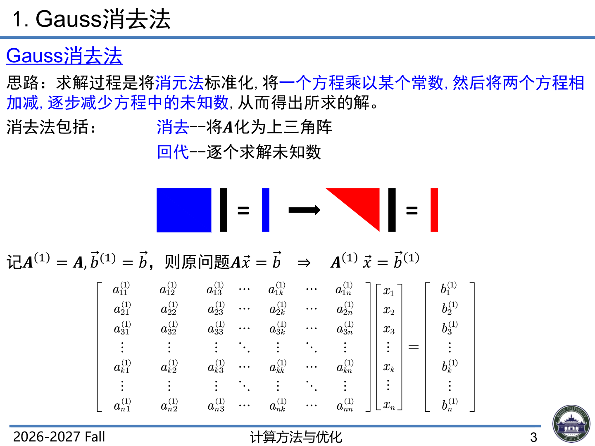
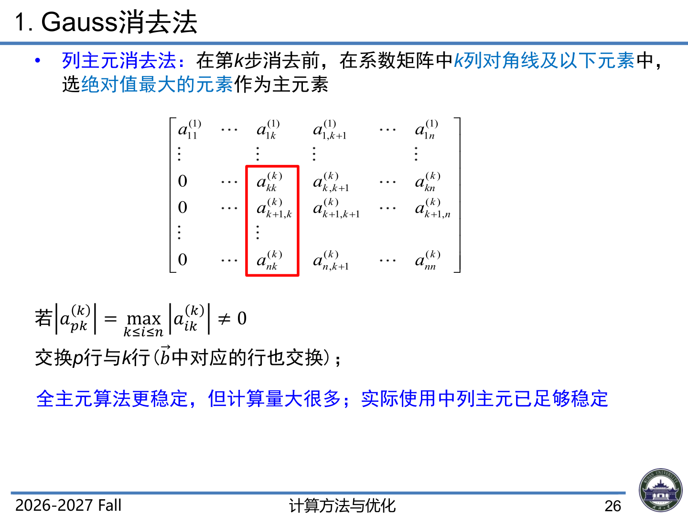
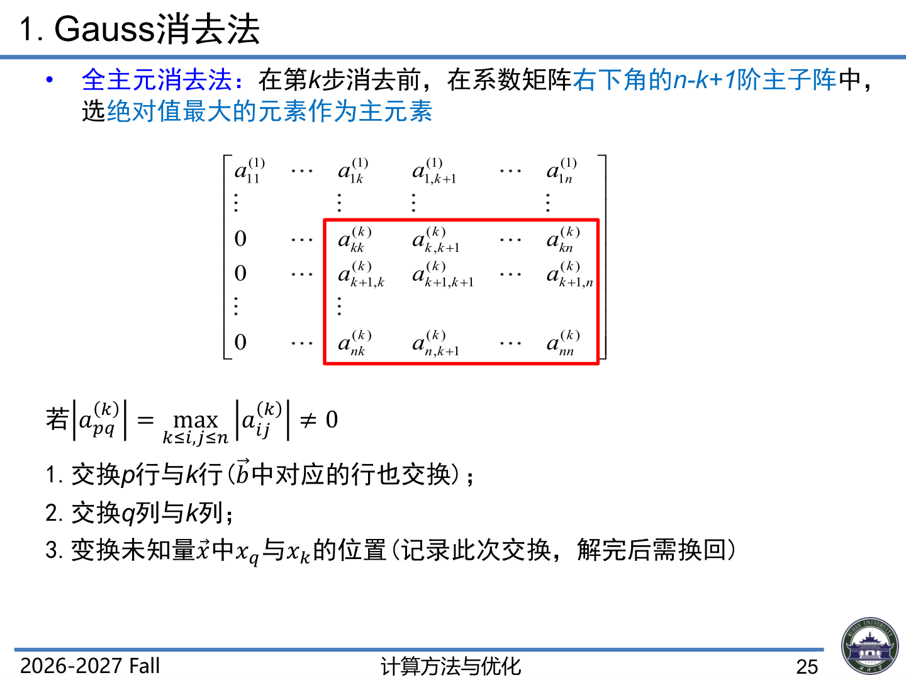

# 5.2 高斯消去法

> 上课：9.16 / 9.20（录音整理，条件数回顾 + 高斯消元/LU 分解）｜ 对应课件：ch2.1 P3–P26
> 对应课本：李庆扬《数值分析》§5.2 高斯消去法（教材做主线，录音与 B 站视频补充细节）
> [返回总览](../00-索引.md)

## 1. 基本思想与一个例子

### 1.1 思想

对方程组 $Ax = b$ 的**增广矩阵** $(A \mid b)$ 施行一系列初等行变换，分两阶段：

1. **消元**：把系数矩阵逐步化为上三角矩阵；
2. **回代**：从上三角方程组自下而上逐个解出未知数（矩阵写法即继续化为主对角为 1 的单位阵，此时右端向量就是解）。

> 课件 P3 示意图：左边蓝块代表稠密系数矩阵 $A$，右边红三角代表消元后的上三角矩阵 $U$；消元把方阵"压"成上三角，回代再从右下角逐个解出未知数。

> 课堂口头（降阶视角）：消元本质是"降阶法"——第一行第一列暂时不动，只看右下角 $(n-1)$ 阶子方程组，用同样的方法继续消，逐层降阶，最后只剩一个方程，直接解出。

### 1.2 课本例 2（3 阶）

用消去法解方程组（课本例 2，矩阵细节见原书，此处记录变换要点）：

- 第 1 步：将第 1 个方程乘 $-2$ 加到第 3 个方程，消去 $x_1$（对应行变换 $(-2) \times r_1 + r_3 \to r_3$）；
- 第 2 步：将第 2 个方程加到第 3 个方程，消去 $x_2$（$r_2 + r_3 \to r_3$），得到等价的三角形方程组；
- 回代得解 $x^* = (1, 2, 3)^T$。

> B 站视频（p012）补充（4 阶示例的套路）：消元时"第一行乘以适当的数加到第二行、第三行、第四行，把第一列对角线以下的元素全部变为零"；然后"第二行乘以适当的数加到第三行、第四行…"，直到第 $n-1$ 次消元，系数矩阵变成上三角；回代时从最后一个方程解出 $x_n$，逐个代入前面的方程，求出 $x_{n-1}, \dots, x_1$。

## 2. 高斯消去法的一般公式（定理 5）

将方程组记为 $A^{(1)}x = b^{(1)}$，其中 $A^{(1)} = A$，$b^{(1)} = b$。第 $k$ 次消元把 $A^{(k)}x = b^{(k)}$ 化为等价的 $A^{(k+1)}x = b^{(k+1)}$。

设 $a_{kk}^{(k)} \ne 0$（$k = 1, 2, \dots, n-1$），计算**乘数**

$$m_{ik} = \frac{a_{ik}^{(k)}}{a_{kk}^{(k)}}, \qquad i = k+1, k+2, \dots, n$$

用 $-m_{ik}$ 乘第 $k$ 个方程加到第 $i$ 个方程（$i = k+1, \dots, n$），消去第 $k+1$ 到第 $n$ 个方程中的未知数 $x_k$：

$$
a_{ij}^{(k+1)} = a_{ij}^{(k)} - m_{ik}\,a_{kj}^{(k)}, \qquad j = k+1, \dots, n
$$

$$
b_i^{(k+1)} = b_i^{(k)} - m_{ik}\,b_k^{(k)}
$$

重复到第 $n-1$ 步，得到与 $Ax = b$ 等价的上三角方程组 $A^{(n)}x = b^{(n)}$（记 $Ux = \hat{b}$）。

**回代公式**：

$$
x_n = \frac{b_n^{(n)}}{a_{nn}^{(n)}}
$$

$$
x_i = \frac{b_i^{(i)} - \sum_{j=i+1}^{n} a_{ij}^{(i)} x_j}{a_{ii}^{(i)}}, \qquad i = n-1, n-2, \dots, 1
$$

> 课堂口头（**下标约定，老师重点强调**）：乘数 $m_{ik}$ 第一个下标 $i$ 表示"加到第几行"，第二个下标 $k$ 表示"第几步 / 消哪一列"。下标含义写清楚，否则隔一段时间自己都看不懂。

**定理 5** 设 $Ax = b$，$A \in \mathbb{R}^{n \times n}$。

1. 如果 $a_{kk}^{(k)} \ne 0$（$k = 1, 2, \dots, n$），则高斯消去法可将 $Ax = b$ 约化为等价的上三角方程组，计算公式即上述消元 + 回代公式；
2. 如果 $A$ 非奇异，则可通过高斯消去法（及交换两行的初等变换）将方程组约化为上三角方程组。

## 3. 运算量分析：为什么比 Cramer 法则可行

第 $k$ 步消元的运算量（$n-k$ 个乘数 + 更新右下角 $(n-k)^2$ 个元素 + 更新右端项 $n-k$ 个元素）：

1. 计算 $n-k$ 个乘数：$n-k$ 次除法；
2. 更新系数矩阵右下角：$(n-k)^2$ 次乘法 + $(n-k)^2$ 次加法；
3. 更新右端项：$n-k$ 次乘加。

对 $k = 1, \dots, n-1$ 求和，主导项为

$$
\text{乘除法次数} \approx \frac{n^3}{3} + O(n^2), \qquad \text{加减法次数} \approx \frac{n^3}{3} + O(n^2)
$$

总运算量约 $\dfrac{2}{3}n^3$，即 **$O(n^3)$** 量级；回代只占 $O(n^2)$。

> 课件 P21–P22（精确常数）：消元过程中，第 $k$ 步需 $(n-k)(n-k+1)$ 次加法、$(n-k)(n-k+1)$ 次乘法、$n-k$ 次除法。对 $k = 1, \dots, n-1$ 求和：

$$
\sum_{k=1}^{n-1}(n-k)(n-k+1) = \frac{n(n^2-1)}{3} \text{ 次加法（乘法同数）}
$$

$$
\sum_{k=1}^{n-1}(n-k) = \frac{n(n-1)}{2} \text{ 次除法}
$$

> 回代过程：共 $n(n-1)/2$ 次加法、$n(n-1)/2$ 次乘法、$n$ 次除法。消元 + 回代合计约 $\frac{2}{3}n^3 = O(n^3)$ 次运算。

> B 站视频（p012）补充（算法效率对比）：以 100 阶方程组为例，假设一次乘除法耗时 $3.8 \times 10^{-10}$ 秒——高斯消去法约 $1.30 \times 10^4$ 秒即可求解；而 Cramer 法则 + 行列式定义需要"天文数字"级的时间。**选择一个高效的算法非常重要**。

## 4. 高斯消去法何时可行：顺序主子式条件（定理 6）

消元要求每一步 $a_{kk}^{(k)} \ne 0$，但即使 $A$ 非奇异，也不能保证消元过程中产生的对角元非零。下面的定理给出充要条件。

**定理 6** 约化的主元素 $a_{ii}^{(i)} \ne 0$（$i = 1, 2, \dots, k$）的充要条件是矩阵 $A$ 的顺序主子式 $D_i \ne 0$（$i = 1, 2, \dots, k$），即

$$
D_i = \det\begin{pmatrix} a_{11} & \cdots & a_{1i} \\ \vdots & & \vdots \\ a_{i1} & \cdots & a_{ii} \end{pmatrix} \ne 0, \qquad i = 1, 2, \dots, k
$$

**推论** 如果 $A$ 的顺序主子式 $D_k \ne 0$（$k = 1, 2, \dots, n-1$），则 $a_{kk}^{(k)} \ne 0$ 可由高斯消去法实现约化。

> B 站视频（p014）补充（主元视角）：消元过程中 $a_{kk}^{(k)}$ 称为主元素，作为分母参与除法。**这个对角线元素不是在原始系数矩阵中出现的，而是在消元过程中产生的**——所以必须逐一判断，不能只看 $A$ 本身。
>
> 课堂口头（程序化视角）：写程序时，每步除法前先判断 $a_{kk}^{(k)}$ 是否为零；为零则消元失败（矩阵奇异），返回失败标志；不为零才继续。判断前 $n-1$ 个对角元后，第 $n$ 个（$a_{nn}^{(n)}$）还要单独判断一次再回代。

## 5. 矩阵视角：从消元到三角分解（§5.2.2）

### 5.1 初等矩阵（高斯变换矩阵）

对矩阵施行初等行变换 = 左乘相应的初等矩阵。消元的每一步等价于左乘一个**单位下三角矩阵** $L_k$（对角元为 1，第 $k$ 列对角元以下为 $-m_{ik}$）：

$$
A^{(2)} = L_1 A^{(1)}, \qquad A^{(3)} = L_2 A^{(2)}, \qquad \dots, \qquad U = L_{n-1} \cdots L_2 L_1 A
$$

> B 站视频（p014）补充（高斯变换的紧凑写法）：若用向量 $l = (0, \dots, 0, m_{k+1,k}, \dots, m_{nk})^T$ 记录乘数，则第 $k$ 个高斯变换矩阵可写为 $L_k = I - l\, e_k^T$，且 $L_k^{-1} = I + l\, e_k^T$（"反号加回去"即可求逆）。

### 5.2 LU 分解（定理 7）

把所有 $L_k$ 移到右边：$A = L_1^{-1} L_2^{-1} \cdots L_{n-1}^{-1} U$。关键事实：**$L_k^{-1}$ 的乘积仍是单位下三角矩阵 $L$，且非对角元素就是原来的乘数 $m_{ik}$**（"一列一列叠上去"），于是

$$
A = LU
$$

（$L$：单位下三角；$U$：上三角，正是消元得到的那个上三角矩阵。）

**定理 7（矩阵的 LU 分解）** 设 $A$ 为 $n$ 阶矩阵，若 $A$ 的顺序主子式 $D_i \ne 0$（$i = 1, 2, \dots, n-1$），则 $A$ 可唯一分解为 $A = LU$，其中 $L$ 为单位下三角矩阵，$U$ 为上三角矩阵。

> 唯一性证明思路（课本）：设 $A = LU = L_1 U_1$，由 $U_1^{-1}$ 存在得 $L^{-1}L_1 = UU_1^{-1}$——左边是单位下三角，右边是上三角，两边必须同时等于单位矩阵，故 $U = U_1$，$L = L_1$。

> 课堂口头（分解不唯一）：同一个 $A$ 的"下三角 × 上三角"分解方式不唯一——插入对角矩阵 $D$，$A = (LD)(D^{-1}U)$ 仍是下三角乘上三角。常用规范：**Doolittle 分解**（$L$ 单位下三角，对应高斯消元）、**Crout 分解**（$U$ 单位上三角）；对称情形还有 $LDL^T$（见 5.3）。

**例 3** 对例 2 的系数矩阵，高斯消去法的乘数为 $m_{21} = 0$，$m_{31} = 2$，$m_{32} = -1$，故 $A = LU$（$L$ 由这些乘数构成，$U$ 为消元得到的上三角）。

### 5.3 用 LU 分解解方程组

$$Ax = b \iff LUx = b$$

令 $Ux = y$，拆成两个三角方程组：

$$
Ly = b \quad (\text{前代 / 前向代入}), \qquad Ux = y \quad (\text{回代})
$$

- $L$ 是下三角 → 从 $y_1$ 开始逐个解出，运算量 $O(n^2)$；
- $U$ 是上三角 → 从 $x_n$ 开始逐个解出，运算量 $O(n^2)$。

> 课堂口头（好处）：分解一次（$O(n^3)$），可以反复解多个右端项（每个 $O(n^2)$）——例如同系数矩阵 $Ax = b_1, b_2, \dots$ 只需分解一次。矩阵分解思想与后面的 QR、SVD、Cholesky 一脉相承。

## 6. 列主元消去法（§5.2.3）

### 6.1 小主元的危害（课本例 4）

即使 $a_{kk}^{(k)} \ne 0$，若 $a_{kk}^{(k)}$ **绝对值很小**，用它作除数会导致其他元素数量级严重增长、舍入误差扩散，最终计算解不可靠。

**例 4**（4 位浮点数）精确解 $x^* = (-0.4904, -0.05104, 0.3675)^T$：

- 方法 1（顺序消去，用小主元 $0.001$）：$m_{32} = 4001/2004 = 1.997$，计算解 $x = (-0.400, -0.09980, 0.4000)^T$——**很坏的结果**（消元后元素数量级剧增，$(3,3)$ 元素发生严重相消，正确值 $5.922$ 舍入丢失）；
- 方法 2（交换行，避免小主元）：$m_{32} = 0.6300$，计算解 $x = (-0.4900, -0.05113, 0.3678)^T \approx x^*$。

**结论**：应避免采用绝对值小的主元素；最好每一步选取（消元后的低阶矩阵中）绝对值最大的元素作主元。

> 课件 P23（8 位有效数字的直观例子）：方程组

$$
\begin{cases} 10^{-9} x_1 + x_2 = 1 \\ x_1 + x_2 = 2 \end{cases}
$$

> 精确解为 $x_1 = \dfrac{1}{1-10^{-9}} \approx 1.00\cdots0100$，$x_2 = 2 - x_1 \approx 0.99\cdots9899$。
>
> 顺序消元：$l_{21} = -a_{21}/a_{11} = -10^9$，$a_{22} = 1 + l_{21} \times 1 \approx -10^9$，$b_2 = 2 + l_{21} \times 1 \approx -10^9$，于是得 $x_2 = 1$，$x_1 = 0$——**完全错误**。
>
> 原因：绝对值很小的数作除数 → 乘数很大（$10^9$）→ 中间结果数量级严重增长 → 舍入误差扩散。结论：避免采用绝对值很小的主元素。

### 6.2 列主元（部分选主元）算法

第 $k$ 步在 $A^{(k)}$ 右下角方阵的**第 $k$ 列**内选取绝对值最大的元素作为主元，即确定 $i_k$ 使 $|a_{i_k k}^{(k)}| = \max_{k \le i \le n} |a_{ik}^{(k)}|$（以行内公式书写，避免该式以 $\mid$ 开头被 Markdown 误判为表格）。

交换第 $k$ 行与第 $i_k$ 行，再进行消元计算。列主元消去法 = 顺序消去法 + 选主元 + 交换行两个步骤。

> 课件 P26：列主元只在第 $k$ 列对角线及以下（红框区域）选绝对值最大者，只换行不换列。

> 课堂口头（全选主元 vs 列选主元）：
> - **全选主元**：在第 $k$ 步于右下角 $(n-k+1)^2$ 个元素中找绝对值最大者，通过换行 + 换列把它换到 $(k,k)$ 位置。换行不影响解；**换列会改变未知数的次序，必须记录**，回代后按逆序换回来，否则得到的是"换了次序的解"。代价是每次扫描 $O((n-k)^2)$ 个元素。
> - **列选主元**：只在第 $k$ 列选，只需换行（不换列），代价小，实际使用中**通常已经足够**。

> B 站视频（p015）补充（为什么必须选主元，3 位十进制例子）：顺序消去时第一行要乘 $-10^4$ 加到第二行，主元绝对值极小，数值不稳定，得 $x_1 = 0.00$，$x_2 = 1.00$（误差极大）；先交换两行再消元，主元相对较大，得 $x_1 = 1.00$，$x_2 = 1.00$（精度高）。**选绝对值大的元素作主元能显著改善稳定性**。

### 6.3 矩阵视角：PA = LU（定理 8）

列主元消去法等价于：先对 $(A \mid b)$ 进行一系列行交换（用排列矩阵 $P$ 表示），再对 $PAx = Pb$ 应用高斯消去法：

$$
PA = LU
$$

其中 $P$ 为排列矩阵，$L$ 为单位下三角矩阵（元素满足 $|m_{ik}| \le 1$），$U$ 为上三角矩阵。

**定理 8（列主元素的三角分解定理）** 若 $A$ 非奇异，则存在排列矩阵 $P$ 使 $PA = LU$，其中 $L$ 为单位下三角矩阵，$U$ 为上三角矩阵。

> 课堂口头（程序实现）：编程时 $L$ 的元素存放在数组 $A$ 的下三角部分、$U$ 在上三角部分，行交换情况用整型数组 $\text{Ip}(n)$ 记录即可，不需要真的构造矩阵 $P$。

> B 站视频（p015）补充（行交换的记录）：不需要用若干置换矩阵存储，用一个长度为 $n-1$ 的向量即可——第 $k$ 步若交换了第 $k$ 行与第 $i_k$ 行，就记 $\text{Ip}(k) = i_k$；求解时先按 $\text{Ip}$ 对 $b$ 的元素做同样的交换，再解 $Ly = Pb$、$Ux = y$。

> 课堂口头（Hilbert 矩阵演示的教训）：病态矩阵（如 Hilbert 矩阵）即使选主元，也只能缓解小主元带来的部分问题，**不能治好病态本身**——条件数 $10^{17}$ 时结果照样完全失真，那要靠后面的方法（正则化、QR 等）处理。

### 6.4 全主元（完整选主元）与 PAQ = LU 的严格推导

列主元只在第 $k$ 列选主元（只换行）。**全主元**在右下角 $(n-k+1)$ 阶子矩阵 $A^{(k)}_{22}$ 的所有元素中选绝对值最大者，换行又换列把它搬到 $(k,k)$ 位置。本节给出其矩阵形式的严格推导（9.20 课堂板书）。

#### 6.4.1 第 $k$ 步的分块与选元

设第 $k$ 步消元前矩阵为 $A^{(k)}$，按前 $k$ 行 / 前 $k$ 列分块：

$$
A^{(k)} = \begin{pmatrix} U_{11} & U_{12} \\ 0 & A_{22}^{(k)} \end{pmatrix}
$$

其中 $U_{11}$ 已是 $k$ 阶上三角，$A_{22}^{(k)}$ 是右下 $(n-k)$ 阶子矩阵。

全主元在 $A_{22}^{(k)}$ 中找绝对值最大者 $|a_{pq}^{(k)}| = \max_{i,j \ge k} |a_{ij}^{(k)}|$。通过：

> 课件 P25：全主元在右下角 $n-k+1$ 阶子矩阵（红框）中选绝对值最大者，换行又换列把它搬到 $(k,k)$。

- **行交换** $P_{kp}$：把第 $p$ 行换到第 $k$ 行（$P_{kp}$ 是交换两行的初等置换矩阵）；
- **列交换** $Q_{kq}$：把第 $q$ 列换到第 $k$ 列（右乘 $Q_{kq}$）。

把主元搬到 $(k,k)$。令

$$
P_k = \operatorname{diag}(I_k, P_{kp}), \qquad Q_k = \operatorname{diag}(I_k, Q_{kq})
$$

然后做一次普通高斯消元（乘高斯变换矩阵 $L_k$），消去第 $k$ 列下方元素：

$$
A^{(k+1)} = L_k P_k A^{(k)} Q_k
$$

> 对比：列主元不换列，即 $Q_k = I$，递推式退化为 $A^{(k+1)} = L_k P_k A^{(k)}$。

#### 6.4.2 逐级累乘

从 $k = 1$ 到 $n-1$ 递推，把所有变换矩阵移到左边：

$$
A^{(n)} = L_{n-1} P_{n-1} \cdots L_2 P_2 L_1 P_1 A Q_1 Q_2 \cdots Q_{n-1}
$$

其中 $A^{(n)} = U$ 是最终上三角矩阵。

#### 6.4.3 关键化简：$L_k' = P_k L_k P_k^{-1}$

上式中 $L_k$ 夹在两个 $P$ 之间，需要"穿过"右边的 $P$ 才能把所有 $L$ 归到一起。关键事实：

$$
P_k L_k P_k^{-1} = L_k'
$$

**仍然是高斯变换矩阵**（单位下三角，且因为选了绝对值最大的主元，其非对角元满足 $|l_{ij}'| \le 1$）。直观上：$P_k$ 只是把行重新排了一下，高斯变换的结构不变；选主元保证了乘数绝对值不超过 1，数值稳定。

把所有 $L$ 归并到一起后，令

$$
P = P_{n-1} \cdots P_1, \qquad Q = Q_1 \cdots Q_{n-1}
$$

（均为排列矩阵），最终得到

$$
U = L P A Q \quad\Longrightarrow\quad PAQ = LU
$$

**全主元三角分解定理**（课本定理，B站 p016）：设 $A$ 为 $n$ 阶方阵，则存在排列矩阵 $P, Q$，单位下三角矩阵 $L$（$|l_{ij}| \le 1$）和上三角矩阵 $U$，使

$$
PAQ = LU
$$

且 $U$ 的非零对角元个数等于 $A$ 的秩。

> B 站视频（p016）补充：定理对任意矩阵都成立（不限于非奇异）；当 $A$ 奇异时，$U$ 的零对角元个数直接反映秩。

#### 6.4.4 解方程组的流程

$$
Ax = b
$$

插入 $QQ^{-1} = I$：

$$
AQ \cdot Q^{-1} x = b
$$

令 $y = Q^{-1}x$，两边左乘 $P$：

$$
PAQ \cdot y = Pb \quad\Longrightarrow\quad LUy = Pb
$$

分三步求解：

1. $Lz = Pb$（前代，解单位下三角方程组；$Pb$ 是按行交换记录调整 $b$ 的次序）；
2. $Uy = z$（回代）；
3. $x = Qy$（按列交换记录把解的分量次序换回来）。

> B 站视频（p016）补充（程序实现，不需要真构造 $P$、$Q$）：
> - **行交换**用整型向量 $\text{Ip}(n)$ 记录：第 $k$ 步若交换了第 $k$ 行与第 $p$ 行，记 $\text{Ip}(k) = p$；求 $Pb$ 时按 $\text{Ip}$ 对 $b$ 做同样的行重排即可，不用真乘排列矩阵；
> - **列交换**用整型向量 $V(n)$ 记录：$V(k) = q$ 表示第 $k$ 步把第 $k$ 列与第 $q$ 列交换；回代得到 $y$ 后，**按 $V$ 的逆序**把 $y$ 的分量换回来，才得到原方程组的解 $x$（因为换列 = 换未知数的次序）。
> - 求解顺序：选主元 → 换行换列并记录 → 消元 → 前代 $Lz = Pb$ → 回代 $Uy = z$ → 按 $V$ 还原分量次序得 $x$。

> 课堂口头（列主元是全主元的特例）：$Q_k = I$（不换列）时 $PAQ = LU$ 退化为 $PA = LU$，即 §6.3 的列主元分解。全主元稳定性最好但每次要扫 $O((n-k)^2)$ 个元素选主元，代价高；列主元只扫一列 $O(n-k)$，实际工程中**列主元通常已足够**，全主元用于对稳定性要求极高的场合。

> 注：Hilbert 矩阵演示与条件数的完整讨论见 [5.5 线性方程组的性态与误差分析](5.5-线性方程组的性态与误差分析.md)；矩阵逐层分解（Doolittle 递推实现）见 [5.3 矩阵三角分解法](5.3-矩阵三角分解法.md)。
