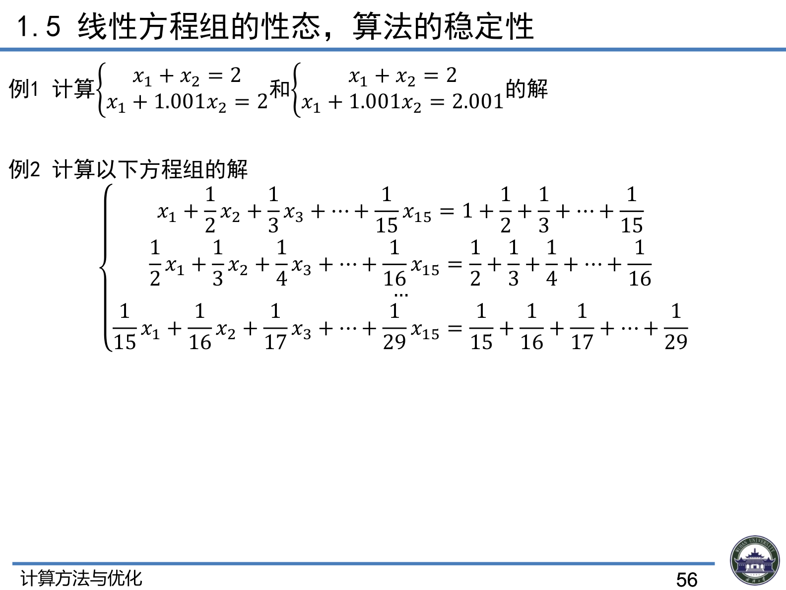
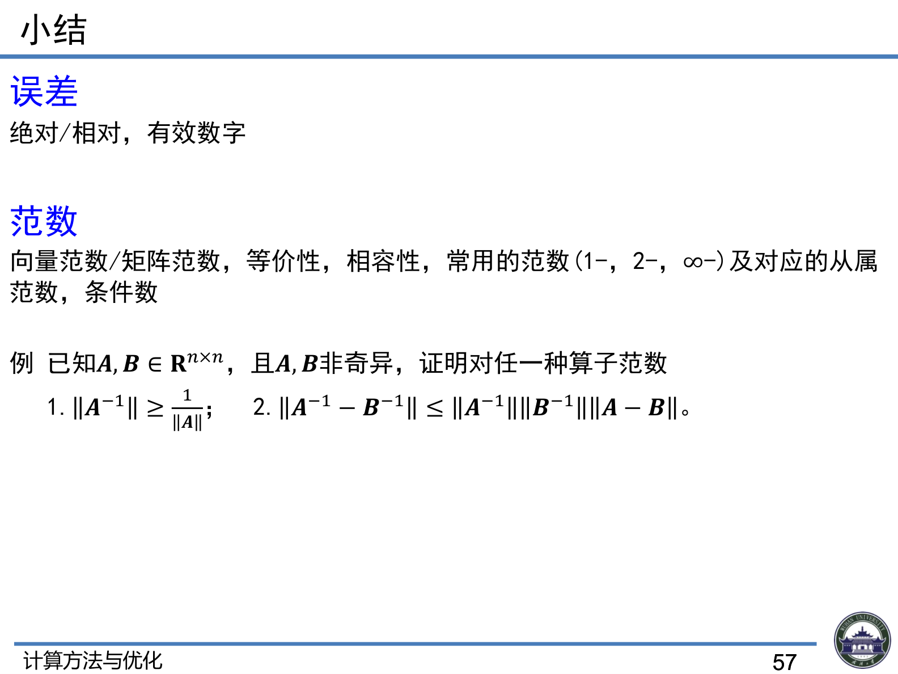

# 5.5 线性方程组的性态与误差分析

> 上课：9.9 上午 ｜ 对应课件章节：第一章 1.5 线性方程组的性态，算法的稳定性（CM+Opt_ch1.pdf P53–57）
> 对应课本：李庆扬《数值分析》§5.5 误差分析（教材做主线，本文按课本补充）
> 前置：[5.4-向量范数与矩阵范数](5.4-向量范数与矩阵范数.md) ｜ [返回总览](../00-索引.md)

## 1. 问题

考虑求解 $A\vec{x} = \vec{b}$ 时，$A$ 和 $\vec{b}$ 的误差对解的影响。

> 课堂口头（出发点）：$b$ 与 $A$ 的输入都因浮点表示带有舍入误差，关心的核心问题是"**输入小扰动 → 输出变化多大**"。

## 2. a. $\vec{b}$ 受扰动 $\delta\vec{b}$（课件 P53）

$$A(\vec{x} + \delta\vec{x}) = \vec{b} + \delta\vec{b} \Rightarrow \delta\vec{x} = A^{-1}\delta\vec{b}$$

$$\Rightarrow \|\delta\vec{x}\| \le \|A^{-1}\|\|\delta\vec{b}\| \Rightarrow \frac{\|\delta\vec{x}\|}{\|\vec{x}\|} \le \|A\| \cdot \|A^{-1}\| \cdot \frac{\|\delta\vec{b}\|}{\|\vec{b}\|}$$

- $\|A^{-1}\|$：**绝对误差放大因子**
- $\|A\| \cdot \|A^{-1}\|$：**相对误差放大因子**

> 课堂口头（推导步骤感，每一步的工具来源）：
> ① $Ax = b$，扰动后 $A(x + \delta x) = b + \delta b$，相减得 $A\delta x = \delta b$，即 $\delta x = A^{-1}\delta b$；
> ② 两边取范数并用**矩阵-向量相容性**：$\|\delta x\| \le \|A^{-1}\|\|\delta b\|$；
> ③ 与 $\|x\|$ 结合（利用 $\|b\| \le \|A\|\|x\|$ 或 $\|x\| \ge \|b\|/\|A\|$）得

$$
\frac{\|\delta x\|}{\|x\|} \le \|A\|\|A^{-1}\| \cdot \frac{\|\delta b\|}{\|b\|}
$$

> 即 **输出的相对误差 ≤ cond(A) × 输入的相对误差**。

## 3. b. $A$ 受扰动 $\delta A$（课件 P54）

$$(A + \delta A)(\vec{x} + \delta\vec{x}) = \vec{b}$$

$$\Rightarrow \delta\vec{x} = -A^{-1}\delta A(\vec{x} + \delta\vec{x}), \quad \delta\vec{x} = -(I + A^{-1}\delta A)^{-1}A^{-1}\delta A\vec{x}$$

$$\Rightarrow \frac{\|\delta\vec{x}\|}{\|\vec{x} + \delta\vec{x}\|} \le \|A\| \cdot \|A^{-1}\| \cdot \frac{\|\delta A\|}{\|A\|}, \quad \frac{\|\delta\vec{x}\|}{\|\vec{x}\|} \le \frac{\|A\|\cdot\|A^{-1}\|\cdot\frac{\|\delta A\|}{\|A\|}}{1 - \|A\|\cdot\|A^{-1}\|\cdot\frac{\|\delta A\|}{\|A\|}}$$

误差同样由相对误差因子控制。

> 课堂口头（$A$ 扰动）：结果与 $b$ 扰动类似（见上），控制因子仍是 $\text{cond}(A)$；分子、分母同现误差项、符号相反——误差越大分母越小，整体上界仍由放大因子控制。

## 4. 条件数（状态数）（课件 P54）

$$\text{cond}(A) = \|A\| \cdot \|A^{-1}\|$$

- 条件数越大则越难求得准确解，即越**病态**；反之称之为**良态**
- 不同的矩阵范数对应不同的条件数
- $\text{cond}(A) \ge 1$，$\text{cond}(kA) = \text{cond}(A)$ 且 $k \neq 0$

> 课堂口头（"相对误差放大因子"）：老师把 $\|A\|\|A^{-1}\|$ 直接称为相对误差放大因子（即条件数）。即使输入误差小到 $10^{-16}$（双精度），若放大因子达 $10^{20}$，输出误差仍可能很大。

> 课堂口头（病态判断与范数无关）：不同矩阵范数给出不同条件数值，但等价性保证"一种范数下病态 → 其他范数下也病态"，判断结论不因范数选择而变。

## 5. 病态矩阵的经验判断与算法稳定性（课件 P55）

**经验判断**（一般并不计算 $A^{-1}$，而由经验得出）：

- 行列式很大或很小（如某些行、列近似相关）
- 元素间相差大数量级，且无规则
- 主元消去过程中出现小主元
- 特征值相差大数量级

以上几种情况均可以认为矩阵是病态的。

> 课堂口头（经验判据补充）：$\text{cond}(A) \ge 10^5$ 量级即认为病态；行列式很大/很小、矩阵元素相差多个数量级、特征值分布非常分散，都是病态的"红旗"。

**算法稳定性**（课件 P55）：算法中必然会引入浮点误差，此时就要求算法中对应矩阵的条件数较小——条件数小时数值解误差也较小，算法**稳定**。

## 6. 课件例题（课件 P56）

**例 1**（课件 P56）：解方程组

$$\begin{cases} x_1 + x_2 = 2 \\ x_1 + 1.001x_2 = 2 \end{cases} \quad \text{与} \quad \begin{cases} x_1 + x_2 = 2 \\ x_1 + 1.001x_2 = 2.001 \end{cases}$$

第一组解为 $(2, 0)$；右端项仅从 $2$ 变为 $2.001$（约 0.05% 扰动），第二组解变为 $(1, 1)$——输出变化约 100%。原因：系数矩阵 $\begin{pmatrix}1&1\\1&1.001\end{pmatrix}$ 行列式仅 $0.001$，接近奇异，$\text{cond}(A)_\infty \approx 4\times10^3$，属于病态方程组（与课堂口头"右端项 2→2.05、解 (2,0)→(1,1)"是同一类例子）。

**例 2**：15 阶希尔伯特方程组（$H_{ij} = 1/(i+j-1)$，右端项取对应行和使真解为全 1）——课堂上口头讲过：5 阶没问题、10 阶误差明显、15 阶"基本不能看"。

**小结例题（练习 4 来源，课件 P57）**：已知 $A,B \in \mathbb{R}^{n\times n}$ 且 $A,B$ 非奇异，证明对任一种算子范数：

$$1.\ \|A^{-1}\| \ge \frac{1}{\|A\|};\qquad 2.\ \|A^{-1} - B^{-1}\| \le \|A^{-1}\|\|B^{-1}\|\|A - B\|$$

（提示：① 由 $I = AA^{-1}$ 两边取范数；② 由 $A^{-1} - B^{-1} = A^{-1}(B - A)B^{-1}$ 两边取范数。）

> 课堂演示预告（作业）：希尔伯特矩阵（MATLAB `hilb`）——5 阶解全 1 没问题；10 阶误差明显；15 阶结果"基本不能看"，且**任何标准算法都救不了**。

> 老师建议：实际问题中不必执着理论判据，可以先**试算一小步**看结果是否符合预期，不符合就及早停止（"试算一下就知道"）。

## 7. 课本补充：条件数的性质与迭代改善法（李庆扬《数值分析》§5.5）

### 7.1 条件数的基本性质（课本 §5.5.1）

设 $A$ 非奇异，$\text{cond}(A) = \|A\|\cdot\|A^{-1}\|$（$v=1,2$ 或 $\infty$），则：

1. $\text{cond}(A) \ge 1$（由 $\|A\|\|A^{-1}\| \ge \|AA^{-1}\| = \|I\| = 1$）
2. $\text{cond}(kA) = \text{cond}(A)$（$k \ne 0$，缩放不改变性态）
3. $\text{cond}(AB) \le \text{cond}(A)\,\text{cond}(B)$
4. $\text{cond}(A^{-1}) = \text{cond}(A)$
5. **谱条件数**：$\text{cond}(A)_2 = \|A\|_2\|A^{-1}\|_2 = \sqrt{\dfrac{\lambda_{\max}(A^TA)}{\lambda_{\min}(A^TA)}}$（即最大/最小奇异值之比）；若 $A$ 还对称，则 $\text{cond}(A)_2 = \dfrac{|\lambda|_{\max}}{|\lambda|_{\min}}$（结合 5.4 课本补充的 $\|A\|_2 = \rho(A)$）。

> 谱条件数的意义：$\text{cond}(A)_2$ 给出"特征值/奇异值离散程度"与病态的直接联系——特征值分布越分散，条件数越大，越病态（与 5.5 第 5 节"特征值相差大数量级 ⇒ 病态"的经验判据互相印证）。

### 7.2 病态问题的补救：迭代改善法（课本 §5.5.2）

**思路**：病态问题用标准算法解出的 $\tilde x$ 不理想，但**残差 $r = b - A\tilde x$ 可以用双精度精确计算**，于是：

1. 用列主元消去法求 $A\tilde x = b$ 的近似解 $\tilde x$（并保存 $A$ 的三角分解）
2. 用双精度计算残差 $r = b - A\tilde x$
3. 解 $A\delta = r$（用同一分解，前代+回代，代价小）
4. 修正 $x = \tilde x + \delta$；可重复 2–4 步

每次迭代可把精度提高一位以上有效数字。注意：这要求**残差计算比求解更精确**（故用双精度），且仍是有限精度的补救，$\text{cond}(A)$ 极大时（如 15 阶 Hilbert，$\text{cond} \approx 10^{17}$）改善有限。
