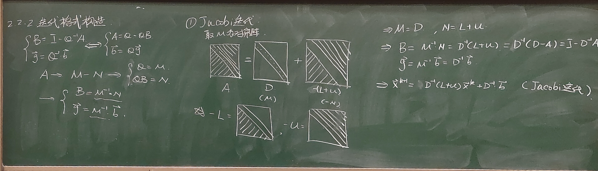

# 6.2.1 Jacobi（雅可比）迭代法

> 上课：9.20（录音整理 + 板书照片）｜ 对应课件章节：待 PPT 补充
> 对应课本：李庆扬《数值分析》§6.2.1（教材做主线，课堂录音与 B 站视频 p042 补充细节）
> [返回总览](../00-索引.md) ｜ [上一篇：6.1 迭代法引论与收敛理论](6.1-迭代法引论与收敛理论.md)

## 1. 矩阵分块约定

给定 $Ax = b$，$A = (a_{ij})_{n\times n}$ 非奇异，且**对角元 $a_{ii} \ne 0$**（否则无法做除法）。把 $A$ 拆成三块：

$$
A = D - L - U
$$

其中：

- $D = \operatorname{diag}(a_{11}, a_{22}, \dots, a_{nn})$（对角矩阵）；
- $-L$ 是 $A$ 的**严格下三角部分**（即 $L$ 的元素是 $A$ 严格下三角部分取负）；
- $-U$ 是 $A$ 的**严格上三角部分**（即 $U$ 的元素是 $A$ 严格上三角部分取负）。

> 板书照片（9.20）：上图即课堂板书的分块示意——对角位置留 $D$，严格下三角和严格上三角分别归入 $-L$、$-U$。
>
> 注意课本约定是 $A = D - L - U$（$L$、$U$ 本身取负号），与课堂板书的 $A = D + (-L) + (-U)$ 是同一件事，只是写法不同。

## 2. 分量形式：从方程出发构造

对第 $i$ 个方程

$$
\sum_{j=1}^{n} a_{ij} x_j = b_i
$$

**保留 $a_{ii} x_i$ 在等号左端**，其余项移到右端，两边除以 $a_{ii}$：

$$
x_i = \frac{1}{a_{ii}}\left(b_i - \sum_{j \ne i} a_{ij} x_j\right)
$$

建立迭代格式时，右端所有分量都用上一步 $x^{(k)}$ 的值：

$$
x_i^{(k+1)} = \frac{1}{a_{ii}}\left(b_i - \sum_{j=1}^{i-1} a_{ij} x_j^{(k)} - \sum_{j=i+1}^{n} a_{ij} x_j^{(k)}\right), \qquad i = 1, 2, \dots, n
$$

> B 站视频（p042）补充（不用背公式，理解来源）：对第 $i$ 个方程，把 $a_{ii}x_i$ 留在左边，其余项移到右边再除 $a_{ii}$——就这么简单。第 $k+1$ 次迭代时，右端所有 $x_j$ 都用第 $k$ 次的值（**全部用上一轮旧值**），这是 Jacobi 与 Gauss-Seidel 的关键区别。

## 3. 矩阵形式

取分裂 $M = D$（对角阵最好求逆），$N = L + U$（严格下三角取负 + 严格上三角取负），则迭代矩阵

$$
B_J = M^{-1}N = D^{-1}(L+U) = I - D^{-1}A
$$

右端项

$$
f_J = D^{-1}b
$$

迭代格式

$$
x^{(k+1)} = B_J x^{(k)} + f_J
$$

或写成

$$
D x^{(k+1)} = (L+U) x^{(k)} + b
$$

### 迭代矩阵 $B_J$ 的结构规律

- **对角线元素全为 0**：因为对角项 $a_{ii}x_i$ 被留在左端，不出现在右端；
- **非对角元素全部取反**：因为移项产生负号；
- **第 $i$ 行除以 $a_{ii}$**：每行按各自对角元归一化。

> 看到系数矩阵 $A$ 后，应能直接写出 $B_J$：对角位置填 0，非对角位置 $b_{ij} = -a_{ij}/a_{ii}$。

## 4. 数值实验：收敛与发散（课本例 1 的延伸）

**收敛例**（课本例 1 型方程组，真解 $x^* = (1,1,1)^T$）：从 $x^{(0)} = (0,0,0)^T$ 出发，10 次迭代后各分量逐渐趋近 1。误差 $\|e^{(k)}\| = \|x^{(k)} - x^*\|$ 与相邻步差 $\|x^{(k)} - x^{(k-1)}\|$ 都趋于零，且

$$
\frac{\|e^{(k)}\|}{\|e^{(k-1)}\|} \approx \text{常数} < 1
$$

即误差大致**等比衰减**。

**发散例**（另一个方程组）：同样从 $x^{(0)} = 0$ 出发，各分量绝对值越滚越大，$\|e^{(k)}\| / \|e^{(k-1)}\| \approx 3.6 > 1$，发散。

> B 站视频（p042）补充（停机判据的工程意义）：
> - 编程时真解未知，用 $\|x^{(k)} - x^{(k-1)}\|$ 是否小于阈值代替误差判断——收敛时它确实趋于零；
> - 但**必须设最大迭代次数 $M$**：发散时 $\|x^{(k)} - x^{(k-1)}\|$ 反而越来越大，若不设上限会死循环。迭代到 $M$ 次仍不满足精度，就报失败（很可能迭代法本身不收敛）。

## 5. 算法流程

1. 输入：阶数 $n$、系数矩阵 $A$、右端 $b$、精度 $\varepsilon$、最大迭代次数 $M$；
2. 检查对角元 $a_{ii} \ne 0$（否则无法除法）；
3. 取初值 $x^{(0)} = 0$（不知解的大致范围时的默认选择）；
4. 循环 $k = 1, 2, \dots, M$：
   - 按分量公式计算 $x^{(k)}$；
   - 若 $\|x^{(k)} - x^{(k-1)}\| < \varepsilon$，返回成功；
   - 否则把 $x^{(k)}$ 存为旧值，进入下一轮；
5. 到 $M$ 次仍不收敛，返回失败。

> 课堂口头（两块内存 vs 原地更新）：Jacobi 迭代计算 $x^{(k+1)}$ 时**所有分量都依赖上一轮的 $x^{(k)}$**，因此需要同时保留新旧两个向量（两块内存）。下节课的 Gauss-Seidel 利用"算 $x_i^{(k+1)}$ 时，$x_1^{(k+1)}, \dots, x_{i-1}^{(k+1)}$ 已经算出来了"，直接用最新值代入，可原地更新省一半内存。

## 6. 运算量与稀疏矩阵优化

- 一般稠密矩阵：每轮迭代 $O(n^2)$ 次乘除；
- **带状矩阵优化**（半带宽 $p$ 在下、$q$ 在上）：只在带状区域内做循环，零元素不参与运算，每轮成本从 $n^2$ 降到 $n(p+q+1)$——对大型稀疏方程组大幅节省计算量。

> B 站视频（p042）补充：压缩存储技巧在第 5 章直接法部分讲过，迭代法同样适用；无穷范数 $\|\cdot\|_\infty$ 计算最简单，故停机判据最常用它。

## 7. 收敛性判据（预告，详见 §6.2.3）

由 §6.1 定理 5，Jacobi 迭代法收敛的充要条件是 $\rho(B_J) < 1$；充分条件是 $\|B_J\| < 1$（某范数）。

实用的结构性判据见课本定理 9：若 $A$ 严格对角占优（或不可约弱对角占优），则 Jacobi 迭代法收敛。这部分在讲完 Gauss-Seidel 后统一讨论。
