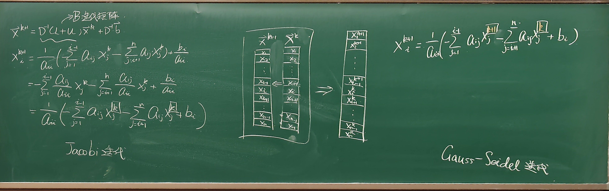
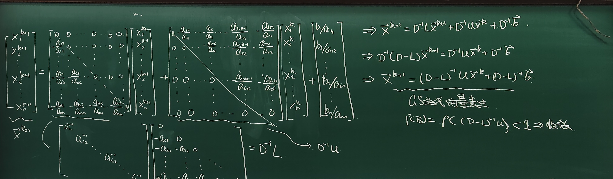

# 6.2.2 Gauss-Seidel（高斯-塞德尔）迭代法

> 上课：9.22（作业讲解 + 板书照片）｜ 对应课件章节：2.2.2（GS 迭代）
> 对应课本：李庆扬《数值分析》§6.2.2（教材做主线，课堂录音与板书补充细节）
> [返回总览](../00-索引.md) ｜ [上一篇：6.2.1 Jacobi 迭代法](6.2.1-Jacobi迭代法.md) ｜ [下一篇：6.2.3 收敛性](6.2.3-Jacobi与GS迭代法收敛性.md)

## 1. 思想：算一个用最新值，更新一个是一个

Jacobi 迭代的缺点：算 $x_i^{(k+1)}$ 时，右端**全部**用第 $k$ 步的旧值——明明 $x_1^{(k+1)}, \dots, x_{i-1}^{(k+1)}$ 已经算出来了，却还放着不用。

Gauss-Seidel 的改进：**按顺序逐个更新分量**，算 $x_i^{(k+1)}$ 时，下标 $j < i$ 的分量用**本轮新值** $x_j^{(k+1)}$，下标 $j > i$ 的分量用**上轮旧值** $x_j^{(k)}$：

$$
x_i^{(k+1)} = \frac{1}{a_{ii}}\left(b_i - \sum_{j=1}^{i-1} a_{ij} x_j^{(k+1)} - \sum_{j=i+1}^{n} a_{ij} x_j^{(k)}\right), \qquad i = 1, 2, \dots, n
$$

> 课堂口头（直觉）：GS 的出发点很朴素——如果迭代在收敛，新算出来的值大概率比旧值更接近真解，那"只要有了新值就用新值"，只把还没有的部分留在旧值上。

## 2. 矩阵形式：从分量式翻译成向量式

### 2.1 先把分量式拆成两个求和

GS 的向量形式不能像 Jacobi 那样"直接看"出来，因为右端同时混着 $x^{(k+1)}$ 和 $x^{(k)}$。做法：把每个分量的求和按 $j < i$、$j > i$ 拆成两段，两段各自是"某矩阵 × 某向量"的第 $i$ 个分量。

### 2.2 写出系数矩阵：左边是 $D^{-1}L$，右边是 $D^{-1}U$

把每个分量式写成"矩阵 × 向量"：

$$
\vec{x}^{\,(k+1)} = \underbrace{D^{-1}L}_{\text{严格下三角（含符号）}} \vec{x}^{\,(k+1)} + \underbrace{D^{-1}U}_{\text{严格上三角（含符号）}} \vec{x}^{\,(k)} + D^{-1}\vec{b}
$$

其中 $D^{-1}$ 是**行归一化**（每行除以 $a_{ii}$），$L$、$U$ 沿用 $A = D - L - U$ 的分块约定。

> 记忆方法：左端 $\vec{x}^{\,(k+1)}$ 对应 $j < i$ 的求和——那些分量在本轮**已经算出来**，系数来自 $A$ 的**严格下三角部分**（取负后即 $L$）；右端 $\vec{x}^{\,(k)}$ 对应 $j > i$——还没算到，只能取上轮值，系数来自**严格上三角部分** $U$。

### 2.3 归并到一边，得到标准迭代式

把含 $\vec{x}^{\,(k+1)}$ 的项移到左边：

$$
(D^{-1} - D^{-1}L)\vec{x}^{\,(k+1)} = D^{-1}U\vec{x}^{\,(k)} + D^{-1}\vec{b}
$$

两边左乘 $(D^{-1}(D-L))^{-1} = (D-L)^{-1}D$：

$$
\vec{x}^{\,(k+1)} = \underbrace{(D-L)^{-1}U}_{B_{\mathrm{GS}}} \vec{x}^{\,(k)} + (D-L)^{-1}\vec{b}
$$

> 三种写法（分量式 / $D^{-1}L$ 两段式 / $(D-L)^{-1}U$ 标准式）数学上完全等价，但**实际计算只用分量式**——标准式里的 $(D-L)^{-1}$ 是个下三角矩阵的逆，真要乘出来成本很高，没人会这么算。向量式只用于理论分析（求迭代矩阵、判断收敛）。

## 3. 算法实现：原地更新，一块内存就够

### 3.1 两块内存 → 一块内存

Jacobi 需要**两块内存**（新向量、旧向量各一份），因为算 $x^{(k+1)}$ 时所有旧分量都还要用。GS 算 $x_i^{(k+1)}$ 时，只依赖"下标比 $i$ 小（已更新）和比 $i$ 大（还没更新）"的分量——所以可以**原地更新**：算出一个新分量立刻覆盖旧值，后续分量直接读更新后的内存。

> 课堂口头（内存视角）：GS 就是"算完一个塞回去一个"，同一块内存不断被刷新。省一半内存，对大型稀疏问题很关键。

### 3.2 同一表达式 ≠ 同一算法（作业讲解重点）

同一个数学表达式，写成不同的计算形式，计算量可能不同。例如 GS 分量式

$$
x_i^{(k+1)} = \frac{1}{a_{ii}}\left(b_i - \sum_{j=1}^{i-1} a_{ij} x_j^{(k+1)} - \sum_{j=i+1}^{n} a_{ij} x_j^{(k)}\right)
$$

两种实现：

| 写法 | 计算方式 | 除法次数 |
|------|---------|---------|
| 每项除以 $a_{ii}$ | 求和每一项都除一次 | 每轮 $O(n^2)$ 次除法 |
| 先求和后除法 | 先把所有项加起来，最后统一除一次 $a_{ii}$ | 每轮 $O(n)$ 次除法，省 $n-1$ 次 |

规模大、迭代次数多时，后一种省下的除法非常可观。**表达式本身不决定算法效率，真正写代码时的求和顺序、内存布局才是**。

## 4. SOR 超松弛迭代：给 GS 加一个"油门"

### 4.1 引入松弛因子 $\omega$

GS 每步直接取新值 $x_i^{(k+1)}$。SOR 先按 GS 算一个"试探值" $x_i^*$，再把它与前一步的值做线性组合：

$$
\begin{cases}
x_i^* = \dfrac{1}{a_{ii}}\left(b_i - \sum_{j=1}^{i-1} a_{ij} x_j^{(k+1)} - \sum_{j=i+1}^{n} a_{ij} x_j^{(k)}\right) \\[6pt]
x_i^{(k+1)} = x_i^{(k)} + \omega\,(x_i^* - x_i^{(k)})
\end{cases}
$$

- $\omega = 1$：$x_i^{(k+1)} = x_i^*$，退化为 GS；
- $\omega > 1$：步子迈得比 GS 更大（超松弛），觉得收敛太慢时"加油门"；
- $\omega < 1$：步子收小（低松弛），担心震荡/发散时"踩刹车"。

> 课堂口头（走路的比喻）：本来决定往目标走 0.5 米，脚抬起来先停住——想想今天状态好，就多走一点（乘 $\omega > 1$），状态差就少走一点。$\omega$ 是预先定好的参数，给迭代更多调节空间。

### 4.2 向量形式与迭代矩阵

SOR 的迭代矩阵（$A = D - L - U$）：

$$
B_{\mathrm{SOR}} = (D - \omega L)^{-1}\big((1-\omega)D + \omega U\big)
$$

> 推导方法：把分量式按 $j<i$、$j>i$ 拆开，再归并到一边，和 GS 完全一样的套路，只是每行多了一个 $\omega$。收敛性分析见课本 §6.3（下节课展开）。

## 5. 收敛性（预告，详见 6.2.3）

- 充要条件：$\rho(B_{\mathrm{GS}}) < 1$，其中 $B_{\mathrm{GS}} = (D-L)^{-1}U$；
- 结构性充分条件：$A$ 严格对角占优或不可约弱对角占优 ⇒ GS 收敛；$A$ 对称正定 ⇒ GS 收敛（比 Jacobi 的收敛条件更宽松）。

> 实际工程中不先算谱半径再决定用不用——**先试算几步**：相邻两步差值在缩小，就继续；差值在放大，说明方法对该矩阵不收敛，换方法。
