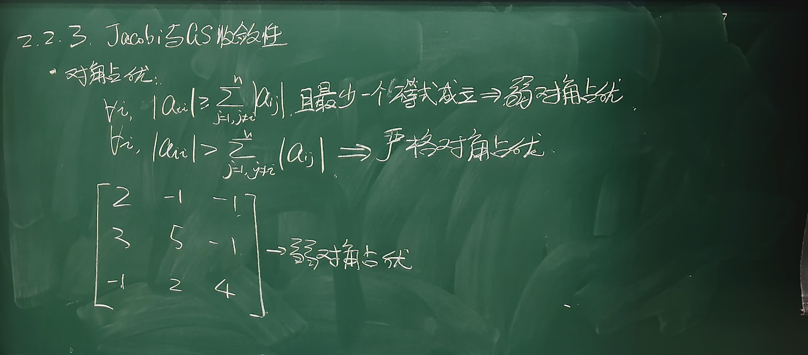
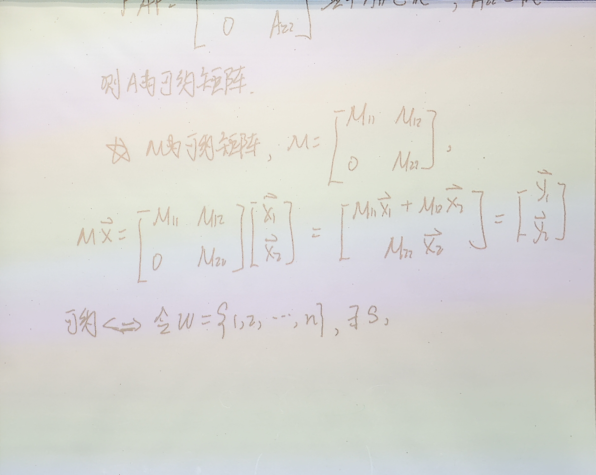

# 6.2.3 Jacobi 与 Gauss-Seidel 迭代法的收敛性

> 上课：9.22（讲解可约矩阵相关知识 + 板书照片）｜ 对应课件章节：2.2.3
> 对应课本：李庆扬《数值分析》§6.2.3（教材做主线，课堂板书补齐证明细节）
> [返回总览](../00-索引.md) ｜ [上一篇：6.2.2 Gauss-Seidel 迭代法](6.2.2-Gauss-Seidel迭代法.md)

## 1. 已有结论回顾（§6.1 定理 5/6）

设 $Ax = b$，$A = D - L - U$ 非奇异，$D$ 非奇异，则：

- **Jacobi**：收敛 $\iff \rho(B_J) < 1$，其中 $B_J = D^{-1}(L+U)$；
- **Gauss-Seidel**：收敛 $\iff \rho(B_{\mathrm{GS}}) < 1$，其中 $B_{\mathrm{GS}} = (D-L)^{-1}U$。

谱半径难算，所以希望从 $A$ 的**结构**直接判断收敛性。本节给出三类结构性条件：对角占优、不可约、对称正定。

## 2. 对角占优矩阵（课本定义 6）

设 $A = (a_{ij})_{n\times n}$：

- **严格对角占优**：对每个 $i$，

$$
|a_{ii}| > \sum_{\substack{j=1 \\ j \ne i}}^{n} |a_{ij}|
$$

- **弱对角占优**：对每个 $i$，

$$
|a_{ii}| \ge \sum_{\substack{j=1 \\ j \ne i}}^{n} |a_{ij}|
$$

且**至少有一个**不等式严格成立。

> 直观：每一行"自己（对角元）"的绝对值要压过"别人（同行非对角元）"的总和。严格版本要求每行都压倒，弱版本允许某几行取等号，但整体至少有一行是压倒的。

**例子**（板书）：

$$
A = \begin{pmatrix} 2 & -1 & -1 \\ 3 & 5 & -1 \\ -1 & 2 & 4 \end{pmatrix}
$$

逐行检查：$|2| = |-1| + |-1|$（取等号）；$|5| > |3| + |-1|$（严格）；$|4| > |-1| + |2|$（严格）。第 1 行取等号、第 2/3 行严格 → **弱对角占优**。

## 3. 可约与不可约矩阵（课本定义 7）

### 3.1 定义：行列重排后能否化成块下三角

设 $A = (a_{ij})_{n\times n}$（$n \ge 2$）。如果存在**置换矩阵** $P$（换行换列的排列矩阵），使得

$$
P^T A P = \begin{pmatrix} A_{11} & A_{12} \\ 0 & A_{22} \end{pmatrix}
$$

其中 $A_{11}$ 为 $r$ 阶方阵、$A_{22}$ 为 $n-r$ 阶方阵（$1 \le r < n$），则称 $A$ 为**可约矩阵**；否则称为**不可约矩阵**。

> 课堂口头（置换矩阵的作用）：$P$ 就是"同时交换两行 + 相应两列"（称为一次行列重排）。零元素原本散落在矩阵各处，若通过若干次行列重排能把零元素**集中成左下角一个零方块**，矩阵就可约。

### 3.2 可约的等价定义（集合语言）

存在非空集合 $S, T \subset W = \{1, 2, \dots, n\}$，满足：

$$
S \cap T = \varnothing, \qquad S \cup T = W, \qquad \forall\, i \in S,\ j \in T:\ a_{ij} = 0
$$

即：把行指标拆成两组，**从 $S$ 组行到 $T$ 组列的交叉块全为零**。这等价于"把 $W$ 拆成两个非空子集，任一 $S$ 中的行与 $T$ 中的列交叉处没有非零元"。

> 显然，若 $A$ 所有元素都非零，则 $A$ 不可约。

### 3.3 可约矩阵的意义：解耦成两个小方程组

若 $A$ 可约，则 $Ax = b$ 可化为两个低阶方程组。记 $y = P^T x$，$d = P^T b$，$y = (y_1, y_2)^T$，则

$$
\begin{pmatrix} A_{11} & A_{12} \\ 0 & A_{22} \end{pmatrix} \begin{pmatrix} y_1 \\ y_2 \end{pmatrix} = \begin{pmatrix} d_1 \\ d_2 \end{pmatrix}
$$

先由 $A_{22} y_2 = d_2$ 解出 $y_2$，再代入 $A_{11} y_1 = d_1 - A_{12} y_2$ 解出 $y_1$——**一个大规模问题拆成两个小规模问题**（第二块只是往第一块"喂"一个已知量）。

## 4. 定理 8：对角占优定理（非奇异性）

**定理 8** 若 $A$ 为**严格对角占优**矩阵，或 $A$ 为**不可约弱对角占优**矩阵，则 $A$ **非奇异**。

**证明（严格对角占优情形，反证法）**：

假设 $\det(A) = 0$，则 $A\vec{x} = \vec{0}$ 有非零解。取

$$
\vec{x} = \frac{\vec{y}}{\|\vec{y}\|_\infty}
$$

（$\vec{y}$ 为任一非零解）使 $\|\vec{x}\|_\infty = 1$，即存在某个 $i$ 使 $|x_i| = 1$，且对所有 $j$ 有 $|x_j| \le 1$。

考察齐次方程的第 $i$ 行：$\sum_{j=1}^{n} a_{ij} x_j = 0$，把对角项分离出来：

$$
a_{ii} x_i = -\sum_{\substack{j=1 \\ j \ne i}}^{n} a_{ij} x_j
$$

两边取绝对值并放缩：

$$
|a_{ii}| \cdot |x_i| = \left|\sum_{\substack{j=1 \\ j \ne i}}^{n} a_{ij} x_j\right|
\le \sum_{\substack{j=1 \\ j \ne i}}^{n} |a_{ij}| \cdot |x_j|
\le \sum_{\substack{j=1 \\ j \ne i}}^{n} |a_{ij}|
$$

由 $|x_i| = 1$ 得

$$
|a_{ii}| \le \sum_{\substack{j=1 \\ j \ne i}}^{n} |a_{ij}|
$$

与"严格对角占优（每行都是严格大于）"矛盾。故 $\det(A) \ne 0$。$\blacksquare$

> 不可约弱对角占优情形的证明思路相同但更繁琐：仍用反证法假设奇异，取无穷范数为 1 的解，只能推出"存在某行 $|a_{ii}| \le \sum|a_{ij}|$"；再利用不可约性（零元素无法集中成块）把"取等号"的行逐层传播，最终推出矛盾。细节不展开，可参考课本或自行补全。

## 5. 定理 9：对角占优 ⇒ J/GS 收敛

**定理 9** 设 $Ax = b$：

1. 若 $A$ 严格对角占优，则 Jacobi 与 Gauss-Seidel 迭代均收敛；
2. 若 $A$ 弱对角占优且不可约，则 Jacobi 与 Gauss-Seidel 迭代均收敛。

**证明思路**（只证（1）中 GS 情形，J 同理）：迭代收敛 $\iff \rho(B) < 1$，即证明 $B_{\mathrm{GS}} = (D-L)^{-1}U$ 的所有特征值满足 $|\lambda| < 1$。

**第 1 步：把特征值问题化为 $\det(C) = 0$。** 设 $\lambda$ 为 $B_{\mathrm{GS}}$ 的特征值：

$$
\det(\lambda I - B_{\mathrm{GS}}) = \det\left(\lambda I - (D-L)^{-1}U\right) = \det\big((D-L)^{-1}\big) \cdot \det\big(\lambda(D-L) - U\big)
$$

$\det((D-L)^{-1}) \ne 0$，故 $\lambda$ 是 $\det\big(\lambda(D-L) - U\big) = 0$ 的根。记

$$
C = \lambda(D-L) - U = \lambda D - \lambda L - U
$$

**第 2 步：分析 $C$ 的元素结构。** 由 $A = D - L - U$ 的分块约定，$L$ 是严格下三角（元素为 $-a_{ij}$，$i > j$），$U$ 是严格上三角（元素为 $-a_{ij}$，$i < j$）。故 $C$ 的对角元为 $\lambda a_{ii}$，非对角元与 $A$ 的非对角元相同（$-a_{ij}$）。

**第 3 步：用对角占优推 $|\lambda| < 1$。** 反证：若 $|\lambda| \ge 1$，则 $C$ 的对角元绝对值 $\ge |a_{ii}|$（被 $\lambda$ 放大），非对角元不变——$A$ 严格对角占优时，$C$ 仍严格对角占优，由**定理 8** 得 $\det(C) \ne 0$，矛盾。故所有特征值满足 $|\lambda| < 1$。$\blacksquare$

**Jacobi 情形**：迭代矩阵 $B_J = D^{-1}(L+U)$，特征值满足 $\det\big(D^{-1}(L+U) - \lambda I\big) = 0$，即 $\det\big(L + U - \lambda D\big) = 0$。令 $C = L+U-\lambda D$：

$$
C = \begin{pmatrix} -\lambda a_{11} & -a_{12} & -a_{13} & \cdots \\ -a_{21} & -\lambda a_{22} & -a_{23} & \cdots \\ \vdots & \vdots & \vdots & \ddots \end{pmatrix}
$$

对角元为 $-\lambda a_{ii}$（绝对值被 $|\lambda| \ge 1$ 放大），非对角元仍为 $-a_{ij}$。若 $A$ 严格对角占优或不可约弱对角占优，$C$ 保持同样性质 → $\det(C) \ne 0$ → 矛盾 → $|\lambda| < 1$。$\blacksquare$

> 板书总结（一句话记忆）：**"把对角元乘上 $|\lambda| \ge 1$ 后，对角占优性只会更强，不会变弱"**——这就是为什么对角占优能推出谱半径小于 1。

## 6. 定理 10：对称正定情形

**定理 10** 设 $A$ 对称，且对角元 $a_{ii} > 0$（$i = 1, \dots, n$），则：

1. Jacobi 迭代收敛 $\iff$ $A$ 与 $2D - A$ 均为正定矩阵（$D = \operatorname{diag}(a_{11}, \dots, a_{nn})$）；
2. Gauss-Seidel 迭代收敛的**充分条件**：$A$ 正定。

> 注意区别：**A 正定只保证 GS 收敛，不保证 Jacobi 收敛**（还要 $2D - A$ 正定）。例 8 就是这个现象的经典例子。

**例 8**（课本）设

$$
A = \begin{pmatrix} 1 & a & a \\ a & 1 & a \\ a & a & 1 \end{pmatrix}
$$

当 $-\frac{1}{2} < a < 1$ 时 GS 收敛，而 Jacobi 仅在 $|a| < \frac{1}{2}$ 时收敛。

- GS：$A$ 的顺序主子式 $\Delta_1 = 1$，$\Delta_2 = 1 - a^2 > 0$，$\Delta_3 = \det A = 1 + 2a^3 - 3a^2 = (1-a)^2(1+2a) > 0$（当 $-\frac{1}{2} < a < 1$）→ $A$ 正定 → GS 收敛；
- Jacobi：迭代矩阵 $B_J = D^{-1}(L+U)$，其特征多项式

$$
\det(\lambda I - B_J) = \lambda^3 - 3\lambda a^2 + 2a^3 = (\lambda - a)^2(\lambda + 2a)
$$

谱半径 $\rho(B_J) = |2a|$，故 Jacobi 收敛 $\iff |a| < \frac{1}{2}$。

例如 $a = 0.8$：GS 收敛（$A$ 正定），但 $\rho(B_J) = 1.6 > 1$，Jacobi 发散，此时 $2D - A$ 不正定。

> 工程提醒（课本注）：若原方程组换行后 $A$ 才满足收敛条件，应**换行后再构造迭代法**。例如某些方程组直接看不是对角占优，但交换行后变成严格对角占优，此时对新方程组做 Jacobi/GS 均收敛。

## 7. 小结：三种结构性判据对比

| 判据 | Jacobi | Gauss-Seidel |
|------|--------|-------------|
| $A$ 严格对角占优 | 收敛（定理 9） | 收敛（定理 9） |
| $A$ 不可约弱对角占优 | 收敛（定理 9） | 收敛（定理 9） |
| $A$ 对称正定 | 未必（还需 $2D-A$ 正定） | 一定收敛（定理 10） |
| 一般情形 | 充要条件 $\rho(B_J)<1$ | 充要条件 $\rho(B_{\mathrm{GS}})<1$ |

> 实际工程中不先算谱半径：**先试算几步**，相邻两步差值在缩小就继续，在放大就换方法（如选主元直接法、SOR 等）。理论判据用于"事先知道 $A$ 来自哪个物理系统"的场景——很多问题（如后面的一维模型问题）天然对称正定，可预判收敛。
