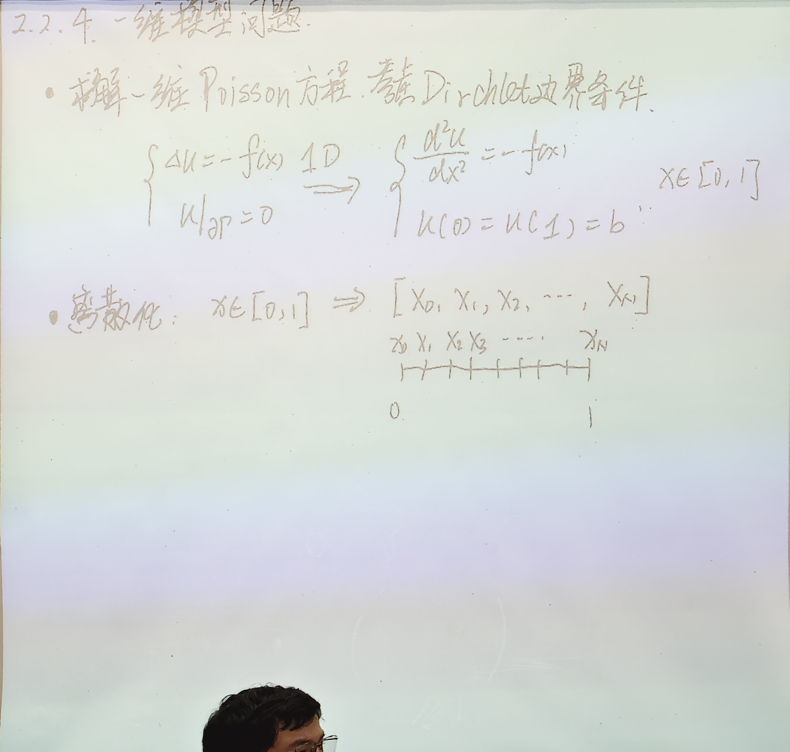
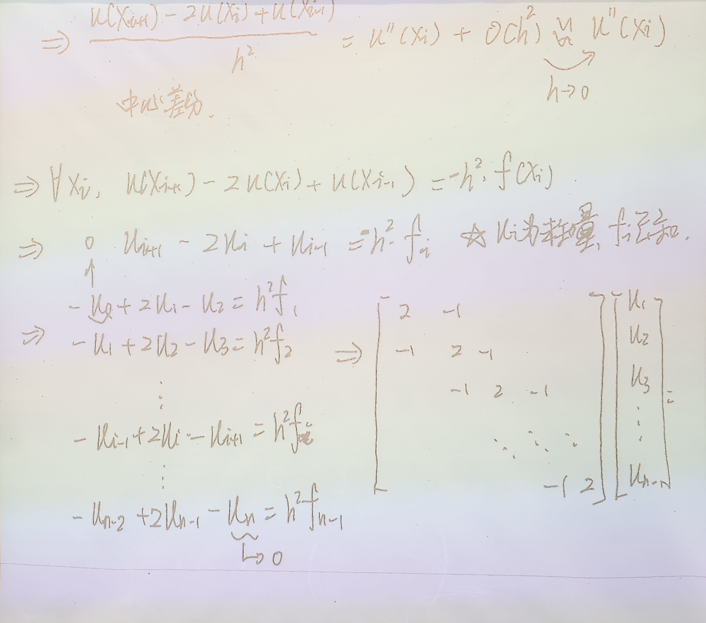

# 6.2.4 应用：一维模型问题——微分方程离散化与迭代法

> 上课：9.22（22:10 录音整理 + 板书照片）｜ 对应课件章节：2.2.4（一维模型问题）
> 对应课本：迭代法应用示范（对应课本 §6.2 末尾例题精神；教材做主线，课堂板书补齐推导）
> [返回总览](../00-索引.md) ｜ [上一篇：6.2.3 Jacobi 与 GS 迭代法收敛性](6.2.3-Jacobi与GS迭代法收敛性.md)

## 1. 为什么讲这个例子：迭代法不是只用来解"已经是线性"的方程组

前面讲的迭代法都在解线性方程组 $Ax = b$。但这个例子要说明：**很多实际问题一开始根本不是线性方程组**——是一个微分方程。我们要展示的完整链条是：

$$
\text{微分方程（连续问题）} \xrightarrow{\text{离散化}} \text{线性方程组（离散问题）} \xrightarrow{\text{追赶法 / 迭代法}} \text{数值解}
$$

## 2. 一维模型问题（Poisson 方程 + Dirichlet 边界）

求解带 Dirichlet 边界条件的一维 Poisson 方程：

$$
\begin{cases} \dfrac{d^2 u}{dx^2} = -f(x), & x \in (0,1) \\[4pt] u(0) = u(1) = b \end{cases}
$$

（板书原式写作 $\Delta u = -f(x), u|_{\partial\Omega} = 0$ 的 1D 形式，即 $-u'' = f$。注意这个负号有讲究：右端 $f$ 前是负号，后面离散时会把符号理清。）

## 3. 离散化：把"求函数"变成"求向量"

连续问题要求出 $[0,1]$ 上**每一个点**的函数值——无穷多个数。离散化就是只求**有限个离散点**上的值：

- 把区间 $[0,1]$ 等分成 $N$ 份，步长 $h = 1/N$，得到 $N+1$ 个离散点 $x_0, x_1, \dots, x_N$；
- 记 $u_i = u(x_i)$（$i = 0, 1, \dots, N$），边界给定了 $u_0 = u_N = b$（或 $0$）；
- 只需求 $N-1$ 个内点 $u_1, \dots, u_{N-1}$——**把一个函数问题变成了一个 $N-1$ 维向量问题**。

> 课堂口头（离散化的本质）：原来要知道函数在每个实数点上的值（无穷多个），现在只看 N+1 个离散点。只要点足够密，把这些点的值标在图上连起来，基本就把原函数恢复了。这就是"连续问题 → 离散问题"的过程。

## 4. 中心差分格式：用三个点的值逼近二阶导数

### 4.1 泰勒展开推导

在 $x_i$ 处对 $u(x_i \pm h)$ 做泰勒展开：

$$
u(x_i + h) = u(x_i) + u'(x_i)\,h + \frac{1}{2}u''(x_i)\,h^2 + O(h^3)
$$

$$
u(x_i - h) = u(x_i) - u'(x_i)\,h + \frac{1}{2}u''(x_i)\,h^2 + O(h^3)
$$

两式相加，**一阶导数项正好抵消**：

$$
u(x_i+h) + u(x_i-h) = 2u(x_i) + u''(x_i)\,h^2 + O(h^4)
$$

整理得二阶导数的**中心差分逼近**：

$$
\frac{u(x_{i+1}) - 2u(x_i) + u(x_{i-1})}{h^2} = u''(x_i) + O(h^2) \xrightarrow{h \to 0} u''(x_i)
$$

截断误差为 $O(h^2)$：$h$ 缩小一半，误差缩到原来的 $1/4$。

> 课堂口头（为什么叫"中心"）：这个公式用 $x_i$ **左右两边对称**的两个点 $x_{i-1}, x_{i+1}$ 来近似 $x_i$ 处的二阶导，所以叫中心差分。二阶导也能用其他线性组合逼近，但中心差分最简单、精度也不错。
>
> 注意：**约等号在数值计算中被强制写成等号**——$O(h^2)$ 误差被忽略，这就是"离散误差"的来源。$h$ 越小越准（但方程组越大，见下）。

## 5. 把微分方程变成线性方程组

把中心差分代入原方程 $-u''(x_i) = f(x_i)$（对 $-u''=f$ 口径，板书也出现 $u''=-f$ 的等价写法，符号随之调整），得：

$$
u(x_{i+1}) - 2u(x_i) + u(x_{i-1}) = -h^2 f(x_i)
$$

即对每个内点 $i = 1, 2, \dots, N-1$：

$$
-u_{i-1} + 2u_i - u_{i+1} = h^2 f_i
$$

其中 $u_i$ 是**未知量**，$f_i = f(x_i)$ 是**已知量**。逐行写出（利用 $u_0 = u_N = 0$ 边界）：

$$
\begin{aligned}
-u_0 + 2u_1 - u_2 &= h^2 f_1 \\
-u_1 + 2u_2 - u_3 &= h^2 f_2 \\
&\ \vdots \\
-u_{N-2} + 2u_{N-1} - u_N &= h^2 f_{N-1}
\end{aligned}
$$

写成矩阵形式——**三对角线性方程组**：

$$
\begin{pmatrix} 2 & -1 & & & \\ -1 & 2 & -1 & & \\ & -1 & 2 & -1 & \\ & & \ddots & \ddots & \ddots \\ & & & -1 & 2 \end{pmatrix}
\begin{pmatrix} u_1 \\ u_2 \\ u_3 \\ \vdots \\ u_{N-1} \end{pmatrix}
=
h^2 \begin{pmatrix} f_1 \\ f_2 \\ f_3 \\ \vdots \\ f_{N-1} \end{pmatrix}
$$

> 板书照片：三对角矩阵的主对角线为 $2$，两条副对角线为 $-1$。**注意符号口径**：课本口径 $-u''=f$ 时三对角阵对角元为 $+2$、副对角为 $-1$；板书曾出现 $-u_0+2u_1-u_2=h^2f_1$ 与矩阵对角 $-2$ 的写法差异，那是因为两边同乘了 $-1$（方程写作 $u''=-f$）。写笔记统一用课本的 $-u''=f$ 口径。

## 6. 怎么解这个方程组：追赶法 或 迭代法

三对角方程组有两种典型解法，正好把第 5 章和第 6 章串起来：

| 方法 | 依据 | 特点 |
|------|------|------|
| **追赶法**（Thomas 算法） | 第 5 章三角分解，三对角矩阵的 LU 分解 | 直接法，$O(N)$ 成本，一步到位 |
| **Jacobi / GS 迭代** | 第 6 章 | 每轮 $O(N)$，适合超大 $N$（$n \ge 10^4$） |

**为什么迭代法一定收敛**：这个三对角矩阵

$$
A = \begin{pmatrix} 2 & -1 & & \\ -1 & 2 & \ddots & \\ & \ddots & \ddots & -1 \\ & & -1 & 2 \end{pmatrix}
$$

- 每行 $|a_{ii}| = 2$，同行非对角元绝对值之和 $= 1 + 1 = 2$（首尾行只有 $1$），即 $|a_{ii}| \ge \sum_{j \ne i} |a_{ij}|$——**弱对角占优**；
- 且不可约（无法通过行列重排把零元素集中成块下三角——三对角结构本身"全连在一起"）。

由 6.2.3 **定理 9**：不可约弱对角占优 ⇒ Jacobi 与 GS 迭代均收敛。这是"先验判据"的绝佳实例：**不用算谱半径，看矩阵结构就知道迭代会收敛**。

> 课堂口头（实际工程做法）：实际中没人先算谱半径再决定用不用迭代法——**先试算几步**：如果相邻两步的差值在缩小（比如 $10^{-2} \to 10^{-3} \to 10^{-5}$），说明在收敛，继续；如果差值越来越大，说明该迭代法对这个矩阵发散，换方法（选主元直接法、SOR 或追赶法）。

## 7. 非线性问题的线性化：外层迭代

### 7.1 问题升级：右端项不再"已知"

上面例子的关键性质：$f = f(x)$ 只依赖位置，$f_i$ 直接可算。现在考虑更一般的边值问题：

$$
\begin{cases} \dfrac{d^2 u}{dx^2} = f(u) \\[4pt] u(0) = u(1) = 0 \end{cases}
$$

右端 $f$ 依赖**未知函数** $u$ 本身，离散后右端 $h^2 f(u_i)$ 里的 $u_i$ 也在变——**方程不再是线性的**，直接解不了。

### 7.2 线性化思想：把非线性问题拆成一系列线性问题

核心思路（**不动点/外层迭代**）：假设已知第 $k$ 步的近似 $u^{(k)}$，用它的值算右端，把 $u^{(k+1)}$ 当作未知量解一个**线性**问题：

$$
\begin{cases} \dfrac{d^2 u^{(k+1)}}{dx^2} = -f\big(u^{(k)}\big) \\[4pt] u^{(k+1)}(0) = u^{(k+1)}(1) = 0 \end{cases}
$$

离散后每一步都变成同一个三对角线性方程组，只是右端换成 $-h^2 f\big(u_i^{(k)}\big)$：

$$
\begin{pmatrix} 2 & -1 & & \\ -1 & 2 & \ddots & \\ & \ddots & \ddots & -1 \\ & & -1 & 2 \end{pmatrix}
\begin{pmatrix} u_1^{(k+1)} \\ u_2^{(k+1)} \\ u_3^{(k+1)} \\ \vdots \\ u_{N-1}^{(k+1)} \end{pmatrix}
=
-h^2 \begin{pmatrix} f\big(u_1^{(k)}\big) \\ f\big(u_2^{(k)}\big) \\ f\big(u_3^{(k)}\big) \\ \vdots \\ f\big(u_{N-1}^{(k)}\big) \end{pmatrix}
$$

> 课堂口头（两层迭代的结构）：
> - **外层迭代**：$u^{(k)} \to u^{(k+1)}$（更新右端项，把非线性变成线性）；
> - **内层迭代**：每个线性问题用 Jacobi/GS 迭代逼近。
>
> 每步之间"**算出的 $u^{(k+1)}$ 又变成已知信息去算 $u^{(k+2)}$**"，如此循环直到两次外层迭代结果差异足够小。这就是**线性化**：一个非线性问题被拆成一系列线性问题，每次只在一个局部范围内把"曲线看成直线"。

> 图像直觉（课堂口头）：一条曲线可以看成由很多局部的小直线段拼成——只要每段变化范围不大，非线性整体上都能用逐段线性逼近。更精细的做法可以用二次近似（牛顿类方法），但"线性化 + 迭代"是最基本的框架。

> 应用背景（课堂口头）：有限元方法（如结构力学里把房子拆成大量网格点，算每个点受力，最后组装成一个巨大的线性方程组）本质上也是"离散化 + 解大线性方程组"。所以**解线性方程组（直接法/迭代法）是整个科学计算最基础的底层能力**——这也是为什么这门课花一整章讲它。

## 8. 例题：判断收敛性 vs 写迭代格式（考试两种问法）

课堂最后给出两个例子 $A_1$、$A_2$，演示两种完全不同的问法：

### 8.1 问法一："这个迭代法收敛吗？" → 算谱半径 $\rho(B)$

例（板书给出 $A_1$ 为 $3\times3$ 矩阵，具体元素略，关键是流程）：

1. 按 $A = D - L - U$ 拆出 $D, L, U$；
2. 写出迭代矩阵：Jacobi 用 $B_J = D^{-1}(L+U)$，GS 用 $B_{\mathrm{GS}} = (D-L)^{-1}U$；
3. 求特征值：$\det(\lambda I - B_J) = 0$，得到特征多项式（例如形如 $\lambda(\lambda^2 - \frac{5}{4})$ 的因子分解）；
4. 看谱半径 $\rho(B) = \max|\lambda|$：$< 1$ 收敛，$\ge 1$ 不收敛（例如算得 $\rho = \frac{\sqrt{5}}{2} > 1$ 就发散）。

> 判断收敛性**必须**用迭代矩阵的谱半径，不能靠迭代格式本身——迭代格式只是"怎么算"，收敛与否由 $B$ 的特征值决定。

### 8.2 问法二："写出迭代格式" → 分量形式逐行写出

如果要写 Jacobi 或 GS 的**具体迭代格式**（告诉计算机每一步怎么算），就不能写矩阵形式，而要把每个分量展开：

- **Jacobi**：右端所有 $x_j$ 用 $x^{(k)}$（全部旧值）：

$$
x_i^{(k+1)} = \frac{1}{a_{ii}}\Big(b_i - \sum_{j=1}^{i-1} a_{ij} x_j^{(k)} - \sum_{j=i+1}^{n} a_{ij} x_j^{(k)}\Big)
$$

- **GS**：$j < i$ 用 $x_j^{(k+1)}$（新值），$j > i$ 用 $x_j^{(k)}$（旧值）：

$$
x_i^{(k+1)} = \frac{1}{a_{ii}}\Big(b_i - \sum_{j=1}^{i-1} a_{ij} x_j^{(k+1)} - \sum_{j=i+1}^{n} a_{ij} x_j^{(k)}\Big)
$$

> 课堂口头（两种问法的分工）：**"收敛吗"→ 算谱半径；"怎么写"→ 写分量式逐行算**。写 GS 分量式时逐一检查：这个 $x_j$ 算过没有？算过的用新值，没算到的用旧值——最后一个方程两个都是新值。

## 9. 补充：光滑性假设的警告（易错点）

中心差分 $\frac{u(x+h)-2u(x)+u(x-h)}{h^2} \approx u''(x)$ 的推导依赖泰勒展开，**隐含假设 $u$ 足够光滑**（各阶导数存在）。这个假设不是总能成立的：

- **NS 方程（Navier–Stokes）与湍流**：即使初值和右端项都光滑，方程解可能在有限时间内发生"爆破"（某点处导数趋于无穷，这正是千禧年难题之一）。在涡旋处解不再可微，泰勒展开不成立，中心差分格式失效——这就是为什么流体数值模拟中**涡旋区域算不准**；
- 结论：**数值格式都建立在某种假设之上**，用格式之前要确认解满足假设；格式算出"结果"不等于结果有效。

> 课堂口头（警示）：不要以为"给一个方程，套一个数值格式，就一定能算出有效解"。用中心差分去逼近导数时，你已经默认了解的光滑性；解一旦不再光滑（出现涡旋/爆破），格式就失效了，算出来不知道是什么。

## 10. 附：迭代格式的几何级数展开（引子）

把迭代格式 $x^{(k+1)} = Bx^{(k)} + g$ 逐步展开：

$$
x^{(k)} = B^k x^{(0)} + (I + B + \cdots + B^{k-1})\,g
$$

这与几何级数 $1 + a + a^2 + \cdots$ 的收敛条件如出一辙：$|a| < 1$ 时级数收敛，对应 $\rho(B) < 1$ 时迭代收敛，且极限满足

$$
x^* = (I - B)^{-1}g
$$

这个"矩阵几何级数"视角是理解 $x^{(k)} \to x^*$ 的本质，详见 6.1 的收敛理论。
