# 第八章 异常控制流（ECF）：信号与非本地跳转（8.5–8.6）

> 依据：CMU 15-213 第 15 讲课件
>
> `15-ecf-signals.pptx`（中译版）
>
> （Bryant & O'Hallaron）+ 《深入理解计算机系统》原书第 3 版第八章 8.5–8.6 节（中文版）+ 课堂录音（《进程回收与僵尸进程讲解》《进程与线程及信号相关讲解》《计算机相关课程教学内容说明》）。
> 环境假设：Linux x86-64 系统。

***

## 目录

- [0. 从上一讲到本讲：ECF 的层次](#0-从上一讲到本讲ecf的层次)
- [1. 外壳（Shell）与进程层次（15 讲热身）](#1-外壳shell与进程层次15-讲热身)
- [2. 信号基础（8.5.1）](#2-信号基础851)
- [3. 发送信号（8.5.2）](#3-发送信号852)
- [4. 接收信号（8.5.3）](#4-接收信号853)
- [5. 阻塞与解除阻塞信号（8.5.4）](#5-阻塞与解除阻塞信号854)
- [6. 编写安全信号处理程序（8.5.5）](#6-编写安全信号处理程序855)
- [7. 同步流以避免竞态（8.5.6）](#7-同步流以避免竞态856)
- [8. 显式等待信号（8.5.7）](#8-显式等待信号857)
- [9. 非本地跳转（8.6）](#9-非本地跳转86)
- [10. 本节重点](#10-本节重点)
- [附：本笔记涉及的命令与函数速查](#附本笔记涉及的命令与函数速查)

***

## 0. 从上一讲到本讲：ECF 的层次

上一讲（第 14 讲）讲了**异常**（硬件与 OS 内核之间）和**进程控制**（fork/execve/waitpid）。本讲沿着 ECF 层次往上走：

| 层次 | ECF 形式 | 实现者 | 本讲 |
| --- | --- | --- | --- |
| 硬件层 | 异常（中断、陷阱、故障、终止） | 硬件 + OS | 上一讲 |
| 操作系统层 | 进程上下文切换 | 内核 | 上一讲 |
| 应用层（OS 接口） | **信号（signal）** | OS 软件 | **本讲** |
| 应用层（最高） | **非本地跳转（setjmp/longjmp）** | C 运行库 | **本讲** |

> **直观理解（录音）**
>
> 老师把信号比作"**进程间的小纸条**"：内核（或别的进程）给某个进程递一张小纸条（一个小整数），告诉它"出事了"——比如你按了 Ctrl-C、子进程死了、除零了。收到纸条的进程可以选择不理、去死，或者跳到自己写好的处理函数里干点事。

***

## 1. 外壳（Shell）与进程层次（15 讲热身）

### 1.1 Linux 进程层次结构

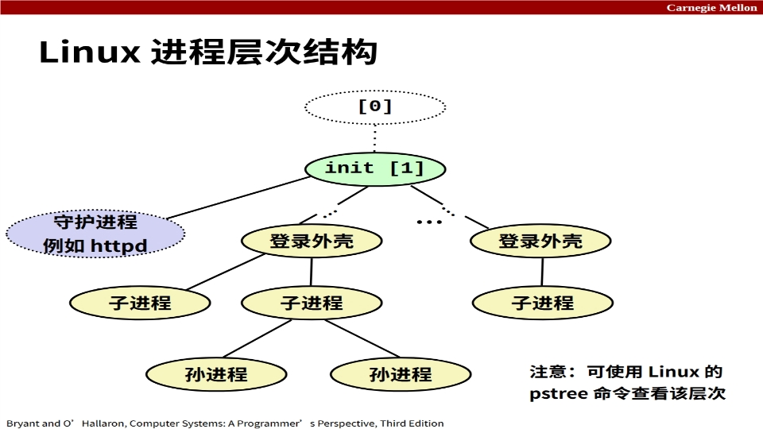

Linux 系统启动后，进程按"祖孙"关系组成一棵树：

- **[0] 号进程**：系统启动时最先运行的进程（调度进程，PID=0，是所有进程的祖先）。录音补充：0 号进程是最基础的进程，整个操作系统最先启动的就是它。
- **init 进程（PID 1）**：由 0 号创建，是所有其他进程的"老祖宗"；**永不终止**，负责收养孤儿进程（见第 8 章进程部分"回收子进程"）。
- 从 init 繁衍出两类进程：
  - **守护进程（daemon）**：后台常驻、提供服务的进程，如 `httpd`（Web 服务器）。
  - **登录外壳（login shell）**：用户登录后启动的命令解释器。
- 外壳再创建**子进程**、**孙进程**——你每敲一条命令，shell 就 fork 一个子进程去执行它（详见 1.2）。

> **课堂补充（录音）：守护进程名字的规律**
>
> 很多守护进程名字以字母 `d` 结尾（daemon 的 d）：`httpd`（HTTP 服务）、`sshd`（远程登录服务）等。Windows 上叫"服务"（Service），Unix 上叫"守护进程/精灵进程"。你输网址时最前面那个 `http://` 里的 **HTTP 就是"超文本传输协议"（HyperText Transfer Protocol）**：超文本 = 不只文字，还能传图片、音频、视频的"高级文本"；`://` 表示协议分隔符。
>
> 另外，`ps`/`top` 命令可以查看进程；`pstree` 命令可以把进程树画出来（课件 p4 也提示了）。

### 1.2 外壳程序（shell）

**外壳（shell）**：一种**应用程序**，代表用户运行其他程序——它本身不是内核，而是一个普通进程，靠 fork + execve + waitpid 实现"读命令 → 执行命令"的循环。

**常见 shell 及历史（录音补充）**：

| 外壳 | 说明 |
| --- | --- |
| sh | 最初的 Unix 外壳，Stephen Bourne 于 1977 年在 AT&T 贝尔实验室发明 |
| csh / tcsh | BSD Unix 的 C 外壳，命令风格像 C 代码（tcsh 是 csh 的增强版） |
| bash | "Bourne-Again" 外壳，sh 的增强版，**Linux 默认外壳** |

> **课堂补充（录音）：shell 提示符**
>
> 提示符 `#` 表示当前是 **root（超级用户）**：权限最大，"可以破坏自己"；普通用户的提示符通常是美元符号，只能操作自己的数据和文件。Linux 是多用户系统，每个人登录都创建一个登录外壳进程，谁也不能乱动别人的文件。

**shell 的主循环（读/求值循环）**：

```c
/* shellex.c 主循环 */
int main()
{
    char cmdline[MAXLINE]; /* 命令行 */
    while (1) {
        /* 读取 */
        printf("> ");
        Fgets(cmdline, MAXLINE, stdin);
        if (feof(stdin))
            exit(0);
        /* 求值 */
        eval(cmdline);
    }
}
```

执行过程是一系列"读取 → 求值"步骤：打印提示符 → 从键盘读一行命令 → 解析并执行。

**eval 函数（怎么执行一条命令）**：

```c
/* shellex.c eval */
void eval(char *cmdline)
{
    char *argv[MAXARGS]; /* 供 execve() 使用的参数列表 */
    char buf[MAXLINE];   /* 存放修改后的命令行 */
    int bg;              /* 作业应在后台还是前台运行？ */
    pid_t pid;           /* 进程 ID */
    strcpy(buf, cmdline);
    bg = parseline(buf, argv);
    if (argv[0] == NULL)
        return;                     /* 忽略空行 */
    if (!builtin_command(argv)) {   /* 不是内置命令（如 quit） */
        if ((pid = Fork()) == 0) {  /* 子进程运行用户作业 */
            if (execve(argv[0], argv, environ) < 0) {
                printf("%s：找不到命令。\n", argv[0]);
                exit(0);
            }
        }
        /* 父进程等待前台作业终止 */
        if (!bg) {
            int status;
            if (waitpid(pid, &status, 0) < 0)
                unix_error("waitfg：waitpid 错误");
        }
        else
            printf("%d %s", pid, cmdline);
    }
    return;
}
```

要点：

- **parseline** 把一行命令按**空格切分**成 `argv[]` 数组：`argv[0]` 是命令名，后面是参数；若最后参数是 `&` 则返回 1（**后台执行**，shell 不等它），否则返回 0（**前台执行**，shell 等它结束）。
- **builtin_command** 判断是不是内置命令（本示例 shell 只有 quit；真实 shell 还有 pwd、jobs、fg 等）。
- 不是内置命令 → **fork 子进程 → 子进程 execve 运行用户程序**；前台作业父进程 waitpid 等它结束并善后，后台作业只打印 PID 就继续。

> **课堂补充（录音）：shell 命令的"分身"逻辑**
>
> 你在 shell 里敲的任何命令（ls、clear……），其实都是 shell **fork 一个子进程再去 exec** 那个程序执行的，shell 自己只负责等你执行完（前台）或记下 PID（后台）。这就是"父进程接单、子进程干活"的模型，和服务器模型完全一致。
>
> 前台 vs 后台（录音）：**前台程序**占着终端，你不能再敲命令，Ctrl-C 可以直接终止它；**后台程序**（命令末尾加 `&`）不占终端，你想终止它只能 `kill` 发信号。后台程序的输出如果不想要，可以重定向到黑洞 `/dev/null`。

### 1.3 简单外壳示例的问题：后台作业变成僵尸

> 注：此处课件 p7 为纯文字页，内容直接列在下面，不插图。

我们的示例 shell 能正确等待并回收**前台**作业，但**后台**作业呢？

- 后台作业终止时会变成**僵尸进程**；
- 永远不会被回收，因为 shell（通常）不会终止；
- 会造成资源泄漏，可能耗尽内核内存（进程表项、PID）。

**ECF 来救场！** 解决办法：**异常控制流**——当后台进程完成时，内核会**中断常规处理**来提醒 shell。在 Unix 中，这种提醒机制称为**信号（signal）**。这正是本讲的主角。

***

## 2. 信号基础（8.5.1）

### 2.1 什么是信号

**信号（signal）**：一条**小消息**，用于通知进程系统中发生了某类事件。

- **类似异常和中断**：异常是硬件 → 内核的通知，信号是内核（或进程）→ 进程的通知，都是"控制流突变"。
- **由内核发送**（有时应另一个进程的请求）。
- **信号类型由小整数 ID（1–30）标识**；信号中只包含它的 ID 和"已到达"这一事实，**不携带数据**。

> **课堂补充（录音）：信号就是个小整数标签**
>
> 信号本质上就是一个 1–30 的小整数。操作系统里很多东西都用整数表示：进程 ID 是整数、文件描述符是整数、信号也是整数。信号很"轻"——它不像消息队列那样能传内容，它只告诉你"某种事件发生了"，具体怎么办由你（或默认动作）决定。

### 2.2 常用信号表

**信号编号 → 名称 → 默认动作 → 对应事件**（课件 p10 表格 + 录音补充）：

| 编号 | 名称 | 默认动作 | 对应事件 |
| --- | --- | --- | --- |
| 2 | SIGINT | 终止 | 用户键入 ctrl-c |
| 9 | SIGKILL | 终止 | 终止程序（**无法覆盖或忽略**） |
| 11 | SIGSEGV | 终止 | 段违规（非法内存引用） |
| 14 | SIGALRM | 终止 | 定时器信号（时间到） |
| 17 | SIGCHLD | 忽略 | 子进程停止或终止 |
| 8 | SIGFPE | 终止 | 除零（浮点异常） |
| 4 | SIGILL | 终止 | 非法指令 |
| 15 | SIGTERM | 终止 | 终止（"请你去死"，可被捕获/忽略） |
| 20 | SIGTSTP | 停止（挂起） | 用户键入 ctrl-z |
| 19 | SIGSTOP | 停止（挂起） | 停止进程（**无法覆盖或忽略**） |
| 18 | SIGCONT | 忽略（继续） | 继续执行一个停止的进程 |

> **课堂补充（录音）：两个"你管不了"的信号**
>
> **SIGKILL（9）** 和 **SIGSTOP（19）** 是两个**不能被忽略、不能被捕获**的信号：SIGKILL 是"你必须死"，SIGSTOP 是"你必须停"。为什么？如果程序能把所有信号都忽略，那它就连内核都管不了、无法无天了——操作系统必须保留"最后手段"来掌控任何进程。
>
> **SIGTERM（15）vs SIGKILL（9）**：SIGTERM 是"礼貌地请你去死"，程序可以捕获它、做点清理再退出（很多服务器用这个做优雅停机）；SIGKILL 是"强行弄死"，程序没有任何机会反抗。默认动作都是终止，区别在于**能不能被捕获/忽略**。
>
> **SIGCHLD（17）**：子进程终止或停止时，内核自动给父进程发这个信号。**父进程如果忽略它，子进程就没人收尸 → 变成僵尸进程**。这正是上一讲"僵尸进程"和本讲信号的衔接点。
>
> **停止 ≠ 终止**（录音重点）：SIGTSTP/SIGSTOP 是"**暂停**"（挂起），进程还在内存里，可以靠 SIGCONT 继续跑；SIGINT/SIGTERM/SIGKILL 是"**终止**"，进程结束。Ctrl-C 是终止，Ctrl-Z 是挂起——两个键完全不同。

***

## 3. 发送信号（8.5.2）

### 3.1 发送信号的概念

**发送（递送）信号**：内核通过更新目标进程上下文中的某些状态，向目标进程发送信号。

内核因以下两种原因之一发送信号：

1. **内核检测到系统事件**：如除零（SIGFPE）、子进程终止（SIGCHLD）、非法内存引用（SIGSEGV）。
2. **另一进程调用了 `kill` 系统调用**，显式请求内核向目标进程发送信号。

> **课堂补充（录音）：kill 不是"杀死"，是"发信号"**
>
> `kill` 这个名字有误导性——它其实是"**请内核帮我给某进程发一个信号**"。发 9 号（SIGKILL）才会"杀死"，发别的号（如 2 号 SIGINT）可能只是通知。信号都是**内核发的**，kill 只是"告诉内核去发"。

### 3.2 进程组（发送信号的目标）

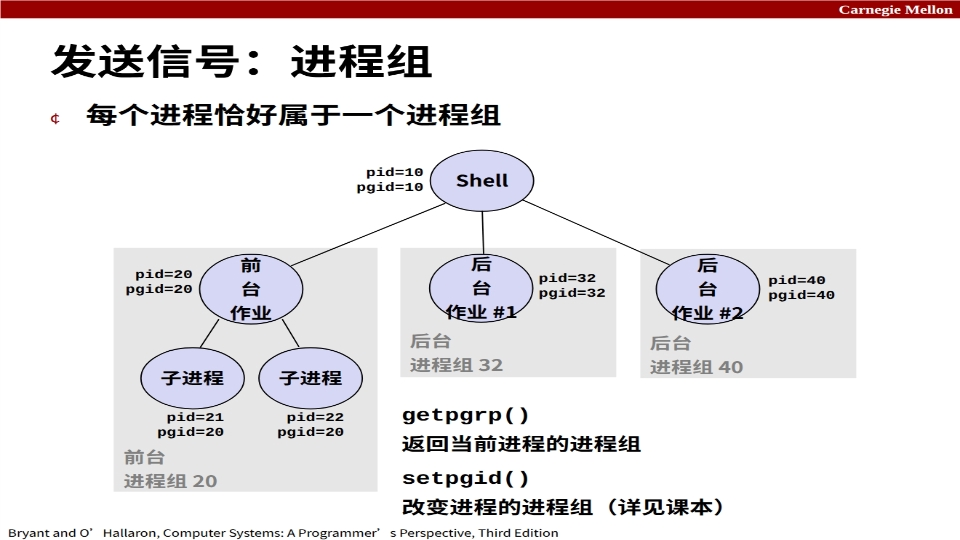

**进程组（process group）**：每个进程恰好属于一个进程组，进程组用一个**进程组 ID（PGID）**标识。

- 图中 Shell 自身：pid=10、pgid=10（**默认进程组 ID = 进程 ID**）。
- 前台作业（pid=20，pgid=20）下有两个子进程 pid=21、pid=22，**它们的 pgid 都是 20**——父子一起算"前台进程组 20"。
- 后台作业 #1（pgid=32）、后台作业 #2（pgid=40）各自成组。

两个相关函数：

```c
#include <unistd.h>
pid_t getpgrp(void);   // 返回当前进程的进程组 ID
int setpgid(pid_t pid, pid_t pgid);  // 改变进程 pid 的进程组为 pgid（详见课本）
```

> **课堂补充（录音）：进程有两个"号"**
>
> 每个进程既有**进程 ID（PID，自己是谁）**，又有**进程组 ID（PGID，属于哪一组）**。默认进程组 ID 等于创建它的父进程的进程组 ID。为什么要有"组"？因为**想一次给一群进程发信号**——比如你把一个作业跑在前台，它 fork 了一堆子进程，按一次 Ctrl-C 希望整组都死，而不是只死父进程。

### 3.3 用 /bin/kill 程序发送信号

`/bin/kill` 程序可以向进程**或进程组**发送任意信号：

```bash
/bin/kill -9 24818     # 向进程 24818 发送 SIGKILL
/bin/kill -9 -24817    # 向进程组 24817 中的每个进程发送 SIGKILL（注意负号！）
```

课件 p16 示例（`./forks 16` 创建两个子进程后）：

```
linux> ./forks 16
Child1: pid=24818 pgrp=24817
Child2: pid=24819 pgrp=24817
linux> ps
  PID TTY      TIME CMD
24788 pts/2 00:00:00 tcsh
24818 pts/2 00:00:02 forks
24819 pts/2 00:00:02 forks
24820 pts/2 00:00:00 ps
linux> /bin/kill -9 -24817
linux> ps
  PID TTY      TIME CMD
24788 pts/2 00:00:00 tcsh
24823 pts/2 00:00:00 ps
```

> **课堂补充（录音）：负号 = 发给整个进程组**
>
> `kill -9 -24817` 前面的负号是"**发给进程组**"的意思：把 9 号信号发给 pgid=24817 的所有进程（这里 24818 和 24819 两个子进程）。**不加负号**（`kill -9 24818`）就只杀那一个进程。命令里的 `-9` 是"9 号信号"的参数，`-24817` 前面那个 `-` 是"组"的标志，别混淆。

### 3.4 从键盘发送信号（Ctrl-C 与 Ctrl-Z）

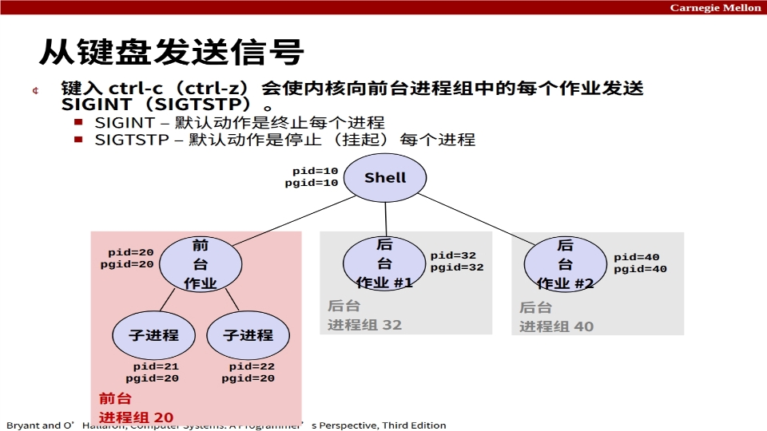

键入 **ctrl-c**（或 **ctrl-z**）会使内核向**前台进程组**中的每个作业发送信号：

- **ctrl-c → SIGINT**：默认动作是**终止**每个进程。
- **ctrl-z → SIGTSTP**：默认动作是**停止（挂起）**每个进程。

> **课堂补充（录音）：Ctrl-C vs Ctrl-Z 完全不同**
>
> Ctrl-C 是"终止"（进程结束，没了）；Ctrl-Z 是"暂停/挂起"（进程还在内存里，`fg` 命令可以把它调回前台继续跑，`bg` 让它后台继续）。Ctrl-Z 后进程状态显示为 **T（Stopped）**。所以按错键的区别很大：一个要命，一个只是"挂小牌暂停"。

**ctrl-c 与 ctrl-z 示例（课件 p18）**：

```
bluefish> ./forks 17
Child: pid=28108 pgrp=28107
Parent: pid=28107 pgrp=28107
<键入 ctrl-z>
已挂起
bluefish> ps w
  PID TTY      STAT   TIME COMMAND
27699 pts/8    Ss     0:00 -tcsh
28107 pts/8    T      0:01 ./forks 17
28108 pts/8    T      0:01 ./forks 17
28109 pts/8    R+     0:00 ps w
bluefish> fg
./forks 17
<键入 ctrl-c>
bluefish> ps w
  PID TTY      STAT   TIME COMMAND
27699 pts/8    Ss     0:00 -tcsh
28110 pts/8    R+     0:00 ps w
```

**STAT（进程状态）图例（课件 p18 + 录音）**：

| 字母 | 含义 |
| --- | --- |
| S | 睡眠中（sleeping，等待某事件） |
| T | 已停止（stopped，被 ctrl-z / SIGSTOP 挂起） |
| R | 运行中（running） |
| s（第二个字母） | 会话首进程（session leader，如登录外壳） |
| +（第二个字母） | 前台进程组（foreground） |

> 更多信息参见 `man ps`（录音：`ps` 是 report process status，打印进程状态快照；`ps w` 显示完整命令行）。

### 3.5 用 kill 函数发送信号（C 程序内）

```c
#include <sys/types.h>
#include <signal.h>
int kill(pid_t pid, int sig);
// 返回：成功为 0，错误为 -1
```

课件 p19 示例 `fork12`：创建 N 个子进程死循环，父进程逐个 `kill(pid[i], SIGINT)` 终止它们，再 `wait` 回收：

```c
/* forks.c 中的 fork12 */
void fork12()
{
    pid_t pid[N];
    int i;
    int child_status;
    for (i = 0; i < N; i++)
        if ((pid[i] = fork()) == 0) {
            /* 子进程：无限循环 */
            while(1)
                ;
        }
    for (i = 0; i < N; i++) {
        printf("正在终止进程 %d\n", pid[i]);
        kill(pid[i], SIGINT);
    }
    for (i = 0; i < N; i++) {
        pid_t wpid = wait(&child_status);
        if (WIFEXITED(child_status))
            printf("Child %d terminated with exit status %d\n",
                   wpid, WEXITSTATUS(child_status));
        else
            printf("子进程 %d 异常终止\n", wpid);
    }
}
```

> **课堂补充（录音）：死循环 + sleep 的 CPU 玄学**
>
> 写死循环测试时，纯 `while(1);` 会让 CPU 占用率飙到 ~100%；只要在循环里加一句 `sleep(1)`（休息 1 秒），CPU 占用率立刻掉到 ~1%。所以写轮询/忙等代码时记得让进程"喘口气"，不要空转烧 CPU。
>
> **kill 是函数也是命令**：在 C 里用是库函数/系统调用（`man 2 kill`，头文件 `signal.h`），在命令行里用是命令（`kill -9 pid`）。`man` 手册按 section 分类：2 = 系统调用、3 = 库函数、1 = 用户命令。
>
> **代码里的 `WIFEXITED` / `WEXITSTATUS` 宏**：判断子进程是否正常退出、取出退出状态码，讲解见《第8章_异常控制流_进程ECF.md》第 4.5 节"waitpid 等待子进程"（waitpid1.c 那里有逐位拆解）。

***

## 4. 接收信号（8.5.3）

### 4.1 接收信号的含义与三种反应

**接收信号**：当内核强制目标进程以某种方式对信号的递送作出反应时，目标进程就"接收"了信号。

可能的反应方式：

1. **忽略信号**（不做任何事）。
2. **终止进程**（可选择转储 core——保存崩溃现场便于调试）。
3. **捕获信号**：通过执行称为**信号处理程序（signal handler）**的用户级函数来处理。

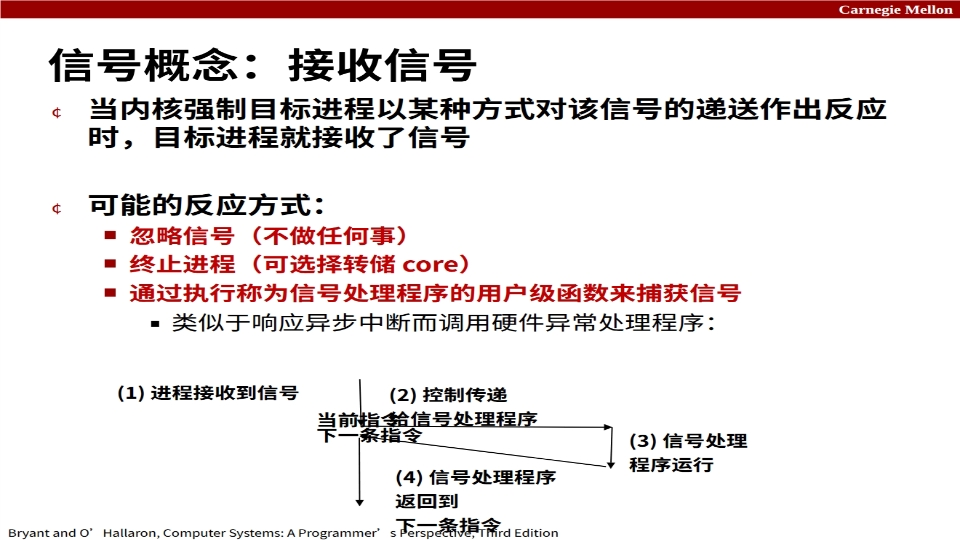

> **课堂补充（录音）：三大反应的"人生选择"**
>
> 收到信号你有三条路：①**不理它**（忽略）；②**去死**（终止，Windows 程序崩溃时问你"要不要把现场发给微软"就是在转储 core，方便调试定位 bug）；③**接住它，跑自己的处理函数**（捕获）。第三种就像硬件异常处理：主程序正跑着，信号一来，CPU 跳到处理程序，执行完再跳回主程序继续。

**信号处理程序与硬件异常处理程序的类比**（课件 p12 图）：

```
(1) 进程接收到信号
(2) 控制传递给信号处理程序     ← 类似响应异步中断而调用硬件异常处理程序
(3) 信号处理程序运行
(4) 信号处理程序返回到下一条指令
```

### 4.2 接收信号的过程（内核视角）

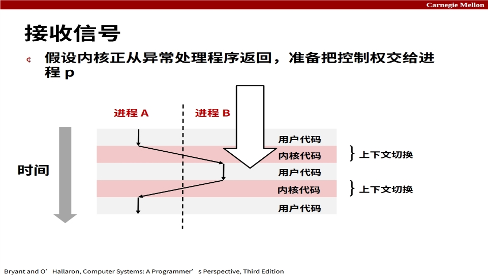

假设内核正从异常处理程序返回，准备把控制权交给进程 p，内核执行如下逻辑（课件 p21）：

```
内核计算 pnb = pending & ~blocked
        即进程 p 的"待处理且未阻塞"的信号集合
如果 (pnb == 0)
    把控制权交给 p 逻辑流中的下一条指令
否则
    选择 pnb 中最低的非零位 k，强制进程 p 接收信号 k
    信号的接收会触发 p 的某种动作
    对 pnb 中所有非零位 k 重复此过程
把控制权交给 p 逻辑流中的下一条指令
```

> **直观理解**：内核在每个进程的"信箱"里维护两张表——**待处理表（pending）**：哪些信号来了还没处理；**阻塞表（blocked）**：哪些信号被禁止接收。每次要从内核返回用户态时，先算"来了又没被挡住的信号"（`pending & ~blocked`），有一个就强制进程接收一个（从编号最小的开始），直到没有才把控制权交回进程。

### 4.3 默认动作

每种信号类型都有一个预定义的**默认动作**，可能是以下之一：

- **进程终止**；
- **进程停止**，直到被 SIGCONT 信号重新启动；
- **进程忽略该信号**。

（默认动作表见 2.2 节的信号表。）

### 4.4 安装信号处理程序（signal 函数）

**signal 函数**修改接收信号 signum 时的默认动作：

```c
#include <signal.h>
handler_t *signal(int signum, handler_t *handler);
// 返回：之前的处理程序；出错返回 SIG_ERR（SIG_ERR 是信号库定义的错误标记，
// 表示安装失败，常见于传入的 signum 非法或 handler 参数无效）
```

`handler` 的不同取值：

| 取值 | 含义 |
| --- | --- |
| SIG_IGN | 忽略类型为 signum 的信号 |
| SIG_DFL | 收到类型为 signum 的信号时恢复默认动作 |
| 其他函数指针 | 用户级信号处理程序的地址，进程收到该信号时被调用 |

术语：

- **"安装"处理程序**：调用 signal 设置 handler 的过程。
- **"捕获"/"处理"信号**：执行处理程序的过程。
- 当处理程序执行其 `return` 语句时，控制权交回**被信号接收所中断的进程控制流中的那条指令**。

### 4.5 信号处理示例（sigint.c）

```c
/* sigint.c */
void sigint_handler(int sig) /* SIGINT 处理程序 */
{
    printf("你以为用 ctrl-c 就能停掉炸弹吗？\n");
    sleep(2);
    printf("好吧...");
    fflush(stdout);
    sleep(1);
    printf("好的。:-)\n");
    exit(0);
}
int main()
{
    /* 安装 SIGINT 处理程序 */
    if (signal(SIGINT, sigint_handler) == SIG_ERR)
        unix_error("signal 错误");
    /* 等待信号的接收 */
    pause();
    return 0;
}
```

> 运行这个程序时按 Ctrl-C，不会终止进程，而是执行 sigint_handler 打印三句话。**注意**：这里处理程序里用了 `printf`/`exit`——课件后面会强调它们**不是**异步信号安全函数（正式写法见 6.2 的 sigintsafe.c）。

**信号处理程序作为并发流**：处理程序是一个**独立的逻辑流（不是进程）**，与主程序**并发运行**。

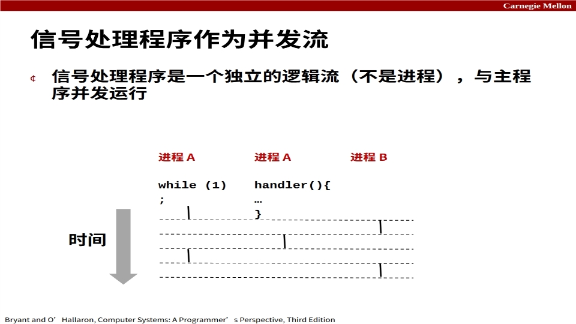

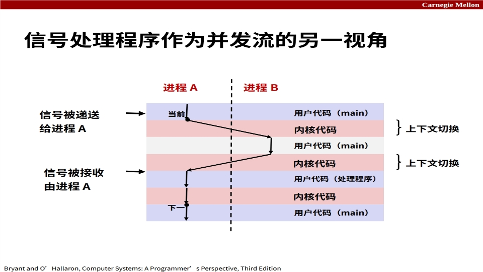

> 看图理解：进程 A 的 main 正在跑用户代码 → 信号被递送给 A → 上下文切换，A 进入内核代码 → 信号被 A 接收 → A 执行**用户代码（处理程序）** → 处理程序返回 → 回到内核代码 → 再回到用户代码（main）继续。处理程序这段"插队"执行的用户代码，就是与 main 并发的一条逻辑流。

**嵌套信号处理程序**：处理程序可能被其他处理程序中断。

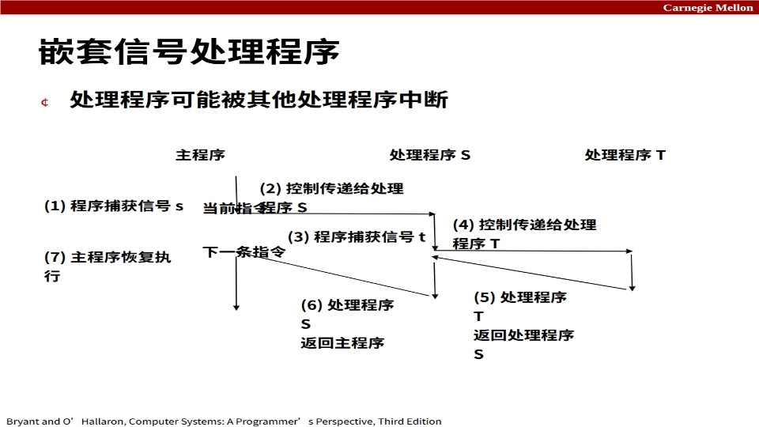

流程：主程序捕获信号 s → 控制传递给处理程序 S → S 执行中又捕获信号 t → 控制传递给处理程序 T → T 返回 S → S 返回主程序 → 主程序恢复执行。**处理程序可以像函数调用一样被更高优先级的事件再次打断。**

***

## 5. 阻塞与解除阻塞信号（8.5.4）

### 5.1 待处理信号与阻塞信号（两个关键概念）

- **待处理（pending）**：信号**已发送但尚未被接收**，称为待处理。
- **阻塞（blocked）**：进程可以**阻塞某些信号的接收**——阻塞的信号可以被递送（到达进程），但**在解除阻塞之前不会被接收**。

**重要性质：信号不会排队！**

- 任何特定类型的待处理信号**最多只能有一个**。
- 如果进程已有类型 k 的待处理信号，之后发送给该进程的类型 k 信号都**会被丢弃**。
- **待处理信号最多被接收一次**。

> **课堂补充（录音）：同一个信号来几次都只算一次**
>
> 信号在进程里是用**一个位（bit）**表示的：这一位是 1 表示"有这个信号待处理"，是 0 表示"没有"。来了两个同类型的信号，位还是 1——**不计数**。所以你不能用"发了几次信号"来计数事件（比如数子进程死了几个），信号只告诉你"发生过"，不告诉你"几次"。

### 5.2 待处理/阻塞位向量

> 注：课件 p14 是文字说明页，其内容整理如下，不单独插图。

内核在每个进程的上下文中维护两个**位向量**：

- **pending**：表示待处理信号的集合。当类型 k 的信号被**递送**时，内核在 pending 中置位 k；当类型 k 的信号被**接收**时，内核清除 pending 中的位 k。
- **blocked**：表示被阻塞信号的集合。可以用 **sigprocmask 函数**设置和清除，也称为**信号掩码（signal mask）**。

> **课堂补充（录音）：mask 就是"掩码/开关"**
>
> "掩码"这个词类比**子网掩码**：IP 地址和子网掩码做**按位与**，就能算出网络号（哪些位是网络部分、哪些是主机部分）。信号掩码同理——它是一串开关位，**把某一位设 1，这个信号就被"盖住"（挡住），不让它进来**。所以 `pending & ~blocked` 就是"来了的"与"没被挡住的"做与运算，得到"该处理的了"。

### 5.3 隐式阻塞与显式阻塞

**隐式阻塞机制**：内核**阻塞当前正在处理的信号类型**的所有待处理信号。例如：SIGINT 处理程序不会被另一个 SIGINT 中断（同一个信号不会无限嵌套打断自己）。

**显式阻塞与解除阻塞机制**：`sigprocmask` 函数 + 辅助函数：

```c
#include <signal.h>
int sigprocmask(int how, const sigset_t *set, sigset_t *oldset);
int sigemptyset(sigset_t *set);      // 创建空集合
int sigfillset(sigset_t *set);       // 将每个信号编号加入集合
int sigaddset(sigset_t *set, int signum);  // 将信号编号加入集合
int sigdelset(sigset_t *set, int signum);  // 从集合中删除信号编号
```

`sigprocmask` 的 `how` 参数：

| how | 行为 |
| --- | --- |
| SIG_BLOCK | 把 set 中的信号加入阻塞集合 |
| SIG_UNBLOCK | 把 set 中的信号从阻塞集合删除 |
| SIG_SETMASK | 用 set 替换整个阻塞集合 |

**临时阻塞信号的典型代码（课件 p29）**：

```c
sigset_t mask, prev_mask;
Sigemptyset(&mask);
Sigaddset(&mask, SIGINT);
/* 阻塞 SIGINT 并保存之前的阻塞集合 */
Sigprocmask(SIG_BLOCK, &mask, &prev_mask);
/* 不会被 SIGINT 中断的代码区域 */
/* 恢复之前的阻塞集合，解除对 SIGINT 的阻塞 */
Sigprocmask(SIG_SETMASK, &prev_mask, NULL);
```

> **课堂补充（录音）：阻塞 ≠ 丢弃**
>
> 阻塞的信号还是会被**递送**（到达进程），只是暂时"压着不处理"，等解除阻塞后，内核会在返回用户态时把它作为待处理信号处理。阻塞是"先欠着"，忽略是"不要了"，丢弃是"来了但位已置 1 就没了"——三者要分清。

***

## 6. 编写安全信号处理程序（8.5.5）

### 6.1 为什么处理程序危险

处理程序**与主程序并发执行，并共享相同的全局数据结构**——共享数据结构可能被破坏。本学期后面（第 12 章并发）会深入讨论并发问题；现在先给出几条**避免麻烦的准则**。

### 6.2 编写安全处理程序的准则（G0–G5）

| 准则 | 内容 | 解释 |
| --- | --- | --- |
| G0 | 让处理程序**尽可能简单** | 例如只设置一个全局标志然后返回 |
| G1 | 处理程序中**只调用异步信号安全函数** | printf、sprintf、malloc、exit 都是**不安全**的！ |
| G2 | 进入和退出时**保存并恢复 errno** | 以免其他处理程序覆盖你的 errno 值 |
| G3 | 通过**临时阻塞所有信号**来保护对共享数据结构的访问 | 防止可能的破坏 |
| G4 | 将全局变量声明为 **volatile** | 防止编译器把它们存到寄存器中（处理程序可能修改它） |
| G5 | 将全局标志声明为 **volatile sig_atomic_t** | flag 只被读取或写入（如 `flag = 1`，不要 `flag++`）；这样声明的标志不需要像其他全局变量那样被保护 |

### 6.3 异步信号安全

**异步信号安全（async-signal-safe）**：如果一个函数是**可重入的**（例如所有变量都存储在栈帧上，见 CS:APP3e 12.7.2），或**不会被信号中断**，那么它就是异步信号安全的。

- **POSIX 保证 117 个函数是异步信号安全的**（来源：`man 7 signal`）。
- 列表中的常用函数：`_exit, write, wait, waitpid, sleep, kill`
- **不在列表中的常用函数**：`printf, sprintf, malloc, exit`
- **不幸的事实：write 是唯一异步信号安全的输出函数**（所以处理程序里不能随便 printf！）

### 6.4 安全地生成格式化输出：SIO 库

使用来自 csapp.c 的**可重入 SIO（Safe I/O）库**：

```c
ssize_t sio_puts(char s[]);   /* 输出字符串 */
ssize_t sio_putl(long v);     /* 输出 long */
void sio_error(char s[]);     /* 输出消息并退出 */
```

安全的 SIGINT 处理程序（sigintsafe.c）：

```c
void sigint_handler(int sig) /* 安全的 SIGINT 处理程序 */
{
    Sio_puts("你以为用 ctrl-c 就能停掉炸弹吗？\n");
    sleep(2);
    Sio_puts("好吧...");
    sleep(1);
    Sio_puts("好的。:-)\n");
    _exit(0);   /* 注意是 _exit（系统调用）而不是 exit（库函数）！ */
}
```

> **对比 sigint.c 和 sigintsafe.c**：不安全的版本用 `printf`/`exit`；安全版本用 `Sio_puts`/`_exit`。为什么 `_exit` 而不用 `exit`？因为 `exit` 会调用清理函数（刷新缓冲区等），这些操作不是异步信号安全的；`_exit` 是直接的系统调用，立即终止，不做任何清理。**这就是 G1 准则的实践。**

### 6.5 待处理信号不会排队（错误示范 fork14）

**关键结论**：不能用信号来计数事件（比如子进程终止次数）。

```c
/* forks.c 中的 fork14 —— 有缺陷的版本 */
int ccount = 0;
void child_handler(int sig) {
    int olderrno = errno;
    pid_t pid;
    if ((pid = wait(NULL)) < 0)
        Sio_error("wait 错误");
    ccount--;
    Sio_puts("处理程序回收了子进程 ");
    Sio_putl((long)pid);
    Sio_puts(" \n");
    sleep(1);
    errno = olderrno;
}
void fork14() {
    pid_t pid[N];
    int i;
    ccount = N;
    Signal(SIGCHLD, child_handler);
    for (i = 0; i < N; i++) {
        if ((pid[i] = Fork()) == 0) {
            Sleep(1);
            exit(0); /* 子进程退出 */
        }
    }
    while (ccount > 0) /* Parent spins */
        ;
}
```

问题：N 个子进程几乎同时退出，SIGCHLD 信号**不排队**——很多子进程的 SIGCHLD 被合并成"一个信号"，处理程序只执行一次 wait，只回收了一个子进程，`ccount` 减不到 0，父进程死循环。运行结果只回收了 2 个（N 个只回收部分）：

```
whaleshark> ./forks 14
处理程序回收了子进程 23240
处理机制回收了子进程 23241   （然后就卡住了……）
```

### 6.6 正确的信号处理（wait 循环，fork15）

**必须等待所有已终止的子进程**：把 wait 放进**循环**中，回收所有已终止的子进程。

```c
/* forks.c 中的 fork15 —— 正确版本 */
void child_handler2(int sig)
{
    int olderrno = errno;
    pid_t pid;
    while ((pid = wait(NULL)) > 0) {   /* 循环回收，直到没有子进程可回收 */
        ccount--;
        Sio_puts("处理程序回收了子进程 ");
        Sio_putl((long)pid);
        Sio_puts(" \n");
    }
    if (errno != ECHILD)               /* ECHILD：没有子进程了 */
        Sio_error("wait 错误");
    errno = olderrno;
}
```

```
whaleshark> ./forks 15
处理程序回收了子进程 23246
处理程序回收了子进程 23247
处理程序回收了子进程 23248
处理程序回收了子进程 23249
处理程序回收了子进程 23250
whaleshark>
```

> 因为信号不排队，一次 SIGCHLD 可能对应多个子进程终止——所以处理程序里要用 `while ((pid = wait(NULL)) > 0)` 把所有已终止的子进程**一次性全回收**，直到 wait 返回 -1 且 errno == ECHILD（没有子进程了）。

### 6.7 可移植的信号处理（sigaction）

不同版本的 Unix 可能有不同的信号处理语义：

- 一些较旧的系统在捕获信号后将动作**恢复为默认**（需要每次重新安装）；
- 一些被中断的系统调用可能以 `errno == EINTR` 返回；
- 一些系统**不会阻塞**正在被处理的信号类型。

**解决方案：sigaction**。csapp.c 中的包装函数 `Signal`：

```c
handler_t *Signal(int signum, handler_t *handler)
{
    struct sigaction action, old_action;
    action.sa_handler = handler;
    sigemptyset(&action.sa_mask);  /* 阻塞正在被处理的信号类型 */
    action.sa_flags = SA_RESTART;  /* 如果可能则重启系统调用 */
    if (sigaction(signum, &action, &old_action) < 0)
        unix_error("Signal 错误");
    return (old_action.sa_handler);
}
```

> 教材中讲"系统级函数"时用小写基本名（signal）；用大写包装名（Signal）时表示走的是 csapp 库的健壮版本。

***

## 7. 同步流以避免竞态（8.5.6）

### 7.1 有竞态的版本（procmask1.c）

```c
/* procmask1.c —— 有微妙同步错误的简单 shell */
int main(int argc, char **argv)
{
    int pid;
    sigset_t mask_all, prev_all;
    Sigfillset(&mask_all);
    Signal(SIGCHLD, handler);
    initjobs(); /* 初始化作业列表 */
    while (1) {
        if ((pid = Fork()) == 0) { /* 子进程 */
            Execve("/bin/date", argv, NULL);
        }
        Sigprocmask(SIG_BLOCK, &mask_all, &prev_all); /* 父进程 */
        addjob(pid); /* 把子进程加入作业列表 */
        Sigprocmask(SIG_SETMASK, &prev_all, NULL);
    }
    exit(0);
}
```

处理程序：

```c
/* procmask1.c 的 SIGCHLD 处理程序 */
void handler(int sig)
{
    int olderrno = errno;
    sigset_t mask_all, prev_all;
    pid_t pid;
    Sigfillset(&mask_all);
    while ((pid = waitpid(-1, NULL, 0)) > 0) { /* 回收子进程 */
        Sigprocmask(SIG_BLOCK, &mask_all, &prev_all);
        deletejob(pid); /* 从作业列表中删除子进程 */
        Sigprocmask(SIG_SETMASK, &prev_all, NULL);
    }
    if (errno != ECHILD)
        Sio_error("waitpid 错误");
    errno = olderrno;
}
```

**错误在于**：这个 shell 假设**父进程先于子进程运行**。如果子进程在父进程执行 `addjob(pid)` **之前**就退出了（子进程 execve `/bin/date` 很快，date 瞬间执行完退出 → SIGCHLD → 处理程序跑 `deletejob(pid)`），而父进程还没来得及 addjob——处理程序 deletejob 一个"还没加进去的作业"，之后父进程 addjob 又加进一个"已死掉的作业"——**作业列表就错了**。

### 7.2 无竞态的修正版（procmask2.c）

**思路**：父进程在 fork 之前就**阻塞 SIGCHLD**，把"fork → addjob"做成不可被打断的整体；子进程 exec 前恢复；父进程 addjob 完再恢复。这样 SIGCHLD 处理程序不可能在 addjob 之前跑。

```c
/* procmask2.c —— 无竞态的修正版 shell */
int main(int argc, char **argv)
{
    int pid;
    sigset_t mask_all, mask_one, prev_one;
    Sigfillset(&mask_all);
    Sigemptyset(&mask_one);
    Sigaddset(&mask_one, SIGCHLD);
    Signal(SIGCHLD, handler);
    initjobs(); /* 初始化作业列表 */
    while (1) {
        Sigprocmask(SIG_BLOCK, &mask_one, &prev_one); /* 阻塞 SIGCHLD */
        if ((pid = Fork()) == 0) { /* 子进程 */
            Sigprocmask(SIG_SETMASK, &prev_one, NULL); /* 解除对 SIGCHLD 的阻塞 */
            Execve("/bin/date", argv, NULL);
        }
        Sigprocmask(SIG_BLOCK, &mask_all, NULL); /* 父进程 */
        addjob(pid); /* 把子进程加入作业列表 */
        Sigprocmask(SIG_SETMASK, &prev_one, NULL); /* 解除对 SIGCHLD 的阻塞 */
    }
    exit(0);
}
```

> **为什么这样就安全了**：SIGCHLD 在 fork 前就被阻塞，所以子进程退出触发的 SIGCHLD 只能**待处理**着，处理程序不会立刻跑；父进程 addjob 完成后才解除阻塞，此时 SIGCHLD 处理程序再跑 deletejob，作业一定已经在列表里了。**"先加后删"的顺序被强制保证**。

***

## 8. 显式等待信号（8.5.7）

### 8.1 场景与三个方案

程序可能想"**等到某个信号到达**"再做下一步。课件 p40–42 的 waitforsignal.c：父进程每轮 fork 一个子进程，然后**等待 SIGCHLD 被接收**（等子进程死掉）。

处理程序：

```c
/* waitforsignal.c 的处理程序 */
volatile sig_atomic_t pid;
void sigchld_handler(int s)
{
    int olderrno = errno;
    pid = Waitpid(-1, NULL, 0); /* main 正在等待非零 pid */
    errno = olderrno;
}
void sigint_handler(int s)
{
}
```

主程序三个版本的"等待"：

| 版本 | 代码 | 问题 |
| --- | --- | --- |
| 自旋轮询 | `while (!pid) ;` | **竞态**！如果信号在处理程序安装前到达（或循环外），`pid` 永远不更新 → 死循环 |
| 睡眠轮询 | `while (!pid) sleep(1);` | **太慢**：信号到达后最多要等 1 秒才反应 |
| **sigsuspend** | `while (!pid) Sigsuspend(&prev);` | **正确且高效**（见下） |

```c
while (!pid)  /* 竞态！ */
    pause();

while (!pid)  /* 太慢了！ */
    sleep(1);
```

### 8.2 用 sigsuspend 等待信号

`sigsuspend` 是下面这段代码的**原子（不可中断）版本**：

```c
sigprocmask(SIG_BLOCK, &mask, &prev);   // 阻塞信号
pause();                                 // 挂起直到收到信号
sigprocmask(SIG_SETMASK, &prev, NULL);  // 恢复
```

```c
#include <signal.h>
int sigsuspend(const sigset_t *mask);
// 等价于：把阻塞集合临时换成 mask 并挂起，直到收到信号；返回 -1 且 errno = EINTR
```

**正确用法（sigsuspend.c 主程序）**：

```c
int main(int argc, char **argv) {
    sigset_t mask, prev;
    Signal(SIGCHLD, sigchld_handler);
    Signal(SIGINT, sigint_handler);
    Sigemptyset(&mask);
    Sigaddset(&mask, SIGCHLD);
    while (1) {
        Sigprocmask(SIG_BLOCK, &mask, &prev); /* 阻塞 SIGCHLD */
        if (Fork() == 0) /* 子进程 */
            exit(0);
        /* 等待 SIGCHLD 被接收 */
        pid = 0;
        while (!pid)
            Sigsuspend(&prev);   /* 原子地解除阻塞并挂起 */
        /* 可选：解除对 SIGCHLD 的阻塞 */
        Sigprocmask(SIG_SETMASK, &prev, NULL);
        /* 收到 SIGCHLD 后做一些工作 */
        printf(".");
    }
    exit(0);
}
```

> **为什么 sigsuspend 是对的**：`while (!pid) pause()` 有竞态——如果信号在 pause 之前到达，pause 会一直睡下去（信号已经错过了）。sigsuspend **一步完成"换掩码 + 挂起"**，期间不会被信号打断，信号到了立即处理并唤醒，不存在"错过了"的窗口。课件说它"类似于 shell 等待一个前台作业结束"。

***

## 9. 非本地跳转（8.6）

### 9.1 setjmp / longjmp 是什么

**非本地跳转（nonlocal jump）**：C 语言提供的一种**强大（但危险）的用户级机制**，用于把控制转移到**任意位置**——一种受控的、**打破过程调用/返回纪律**的方式。对**错误恢复**和**信号处理**很有用。

```c
#include <setjmp.h>
int setjmp(jmp_buf j);    // 必须在 longjmp 之前调用；只调用一次，但返回一次或多次
void longjmp(jmp_buf j, int i);  // 在 setjmp 之后调用；只调用一次，但从不返回
```

- **setjmp**：为后续的 longjmp 标识一个返回点。实现：把当前**寄存器上下文、栈指针和 PC 值**存储在 `jmp_buf j` 中，记住"你在哪"。直接调用时**返回 0**。
- **longjmp**：再次从跳转缓冲 j 记住的 setjmp 处"返回"……**这次返回 i 而不是 0**。实现：从 j 恢复寄存器上下文（栈指针、基址指针、PC），把返回值设为 i，跳转到 j 中存储的 PC 位置。

> **直观理解（录音/课件）**：setjmp 是"做记号"，longjmp 是"空投回记号处"。本来函数调用必须一层层返回（A→B→C 只能 C→B→A），longjmp 可以**从深嵌套的函数直接飞回**最初的调用者，中间的函数栈帧全都不管了。代价是危险——跳回的地方的局部变量可能已经失效。

### 9.2 setjmp/longjmp 示例：错误恢复

目标：从深度嵌套的函数**直接返回到最初的调用者**。

```c
/* setjmp/longjmp 示例 */
jmp_buf buf;
int error1 = 0;
int error2 = 1;
void foo(void), bar(void);

int main()
{
    switch(setjmp(buf)) {
    case 0:
        foo();
        break;
    case 1:
        printf("在 foo 中检测到 error1 条件\n");
        break;
    case 2:
        printf("在 foo 中检测到 error2 条件\n");
        break;
    default:
        printf("foo 中的未知错误条件\n");
    }
    exit(0);
}

/* 深度嵌套的函数 foo */
void foo(void)
{
    if (error1)
        longjmp(buf, 1);
    bar();
}
void bar(void)
{
    if (error2)
        longjmp(buf, 2);
}
```

执行逻辑：main 先 setjmp（返回 0）→ foo() → foo 里 error1 为 0 继续 → bar() → bar 里 error2 为 1 → `longjmp(buf, 2)` → **直接飞回 main 的 setjmp 处，这次返回 2** → switch 命中 case 2，打印"在 foo 中检测到 error2 条件"。

> **为什么用 switch**：setjmp 第一次返回 0（继续正常流程），longjmp 之后"第二次返回"非 0 值（1、2……对应不同的错误），用 switch 区分"正常"和"哪种错误"。这就是 C 语言版的 try/catch——C++/Java 的异常机制底层就是类似的机制（第 8 章开头提过）。

### 9.3 非本地跳转的限制（栈纪律）

**只能长跳转到"已被调用但尚未完成的函数"的环境**——longjmp 必须在栈纪律内工作。

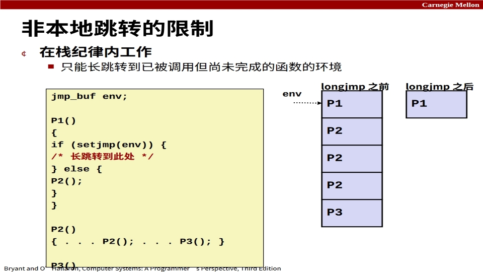

```c
jmp_buf env;
P1() {
    if (setjmp(env)) {
        /* 长跳转到此处 */
    } else {
        P2();
    }
}
P2() { ... P2(); ... P3(); }
P3() {
    longjmp(env, 1);
}
```

- longjmp **之前**：栈帧是 P1 → P2 → P2 → P2 → P3（P3 调用了 longjmp）。
- longjmp **之后**：只剩 P1 栈帧（P2、P3 的栈帧被"抛弃"），控制回到 P1 的 setjmp 处。

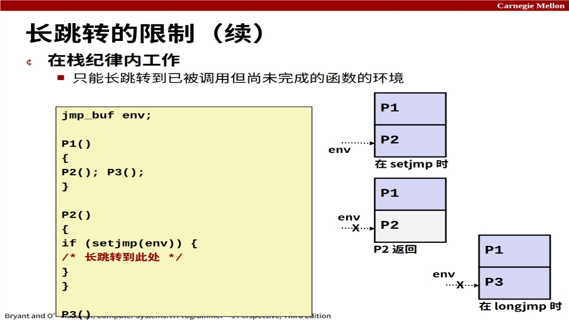

**反例（不允许）**：

```c
jmp_buf env;
P1() { P2(); P3(); }
P2() {
    if (setjmp(env)) {
        /* 长跳转到此处 */
    }
}
P3() { longjmp(env, 1); }   /* 此时 P2 已经返回，env 里的环境失效！ */
```

- **setjmp 时**：栈是 P1 → P2，env 记录了 P2 的环境。
- **P2 返回后**：P2 的栈帧已销毁（图中画 X），env 里记录的栈指针指向"不存在的帧"。
- **longjmp 时**：栈是 P1 → P3，P3 调 longjmp 想跳回 P2 的环境——**P2 已经完成了，不能跳！** 这是未定义行为（危险）。

> **记忆要点**：longjmp 只能跳回"**还在栈上、还没返回**"的函数环境。跳到一个已经返回（栈帧已销毁）的函数 = 悬空指针级别的灾难。

### 9.4 信号版本：sigsetjmp / siglongjmp + 综合应用 restart.c

信号处理程序里不能直接用 setjmp/longjmp（它们不会保存/恢复信号掩码），要用信号版本：

```c
#include <setjmp.h>
int sigsetjmp(sigjmp_buf j, int savesigs);   // savesigs 非 0 时保存信号掩码
void siglongjmp(sigjmp_buf j, int i);
```

**综合应用：一个程序在按下 ctrl-c 时自我重启**（课件 p54）：

```c
/* restart.c */
#include "csapp.h"
sigjmp_buf buf;

void handler(int sig)
{
    siglongjmp(buf, 1);
}

int main()
{
    if (!sigsetjmp(buf, 1)) {
        Signal(SIGINT, handler);
        Sio_puts("开始\n");
    }
    else
        Sio_puts("重启\n");
    while(1) {
        Sleep(1);
        Sio_puts("处理中...\n");
    }
    exit(0); /* 控制永远不会到达这里 */
}
```

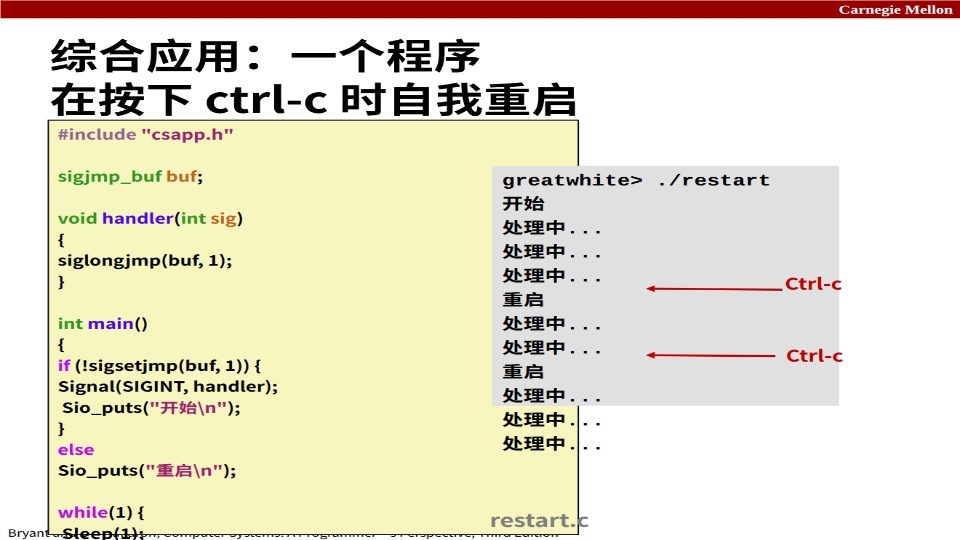

运行效果：

```
greatwhite> ./restart
开始
处理中...
处理中...
处理中...
重启      ← 按下 ctrl-c，SIGINT 处理程序 siglongjmp 回 setjmp，打印"重启"
处理中...
处理中...
重启      ← 再按 ctrl-c，再次重启
处理中...
处理中...
处理中...
```

> **原理**：第一次进入 main 时 sigsetjmp 返回 0 → 安装 SIGINT 处理程序 → 打印"开始" → 死循环打印"处理中"。每次按 ctrl-c，SIGINT 处理程序执行 `siglongjmp(buf, 1)`，程序"飞回"main 的 sigsetjmp 处且返回 1 → else 分支打印"重启" → 继续死循环。**用非本地跳转实现了"信号 → 自我重启"的循环**。

***

## 10. 本节重点

> **本节重点**：
> - **信号 = 小整数消息**（1–30），由内核发送，不含数据；类似异常/中断，是内核与应用程序之间的 ECF。
> - **常用信号**：SIGINT(2) Ctrl-C 终止、SIGKILL(9) 不可忽略终止、SIGSEGV(11) 段违规、SIGALRM(14) 定时器、SIGCHLD(17) 子进程停止/终止、SIGTSTP(20) Ctrl-Z 挂起、SIGTERM(15) 可捕获终止、SIGSTOP(19) 不可忽略停止。
> - **两个不可忽略信号**：SIGKILL（必须死）、SIGSTOP（必须停）——保证内核永远能掌控进程。
> - **发送信号**：内核检测事件自动发 / kill 系统调用（命令或函数）请求发；`kill -9 -PGID` 发给整个进程组（负号=组）；Ctrl-C/Ctrl-Z 发给前台进程组。
> - **接收信号三种反应**：忽略 / 终止（可转储 core）/ 捕获执行处理程序。
> - **pending/blocked 位向量**：`pnb = pending & ~blocked`；**信号不排队**，同类待处理信号最多一个、最多接收一次 → 不能用来计数。
> - **阻塞**：隐式（内核阻塞当前处理类型）+ 显式（sigprocmask + sigemptyset/sigaddset）；阻塞 ≠ 丢弃。
> - **安全处理程序五准则 G0–G5**：简单、只用异步信号安全函数（write 是唯一安全输出！）、保存恢复 errno、阻塞保护共享数据、volatile / volatile sig_atomic_t。
> - **正确回收**：SIGCHLD 处理程序里用 `while ((pid = wait(NULL)) > 0)` 循环回收所有已终止子进程，errno == ECHILD 结束。
> - **同步竞态**：fork 前先阻塞 SIGCHLD，addjob 后再解除（procmask2）；显式等待信号用 `sigsuspend`（原子换掩码+挂起），不要用 `pause`/`sleep` 轮询。
> - **非本地跳转**：setjmp/longjmp 打破调用/返回纪律；只能跳回"已调用未完成"的环境（栈纪律）；信号处理中用 sigsetjmp/siglongjmp（restart.c 自我重启）。
> - **僵尸进程联系**：后台作业不回收 → SIGCHLD 被忽略 → 僵尸；正确做法是捕获 SIGCHLD 并在处理程序里 wait 循环回收。

***

## 附：本笔记涉及的命令与函数速查

| 命令 / 函数 | 作用 |
| --- | --- |
| `kill -9 PID` / `kill -9 -PGID` | 向进程 / 进程组发送 9 号信号（负号=进程组） |
| `kill(pid, sig)` | C 函数：请求内核给进程发信号 |
| `signal(signum, handler)` | 安装信号处理程序（SIG_IGN / SIG_DFL / 函数指针） |
| `sigaction` / `Signal` | 可移植的信号处理安装（csapp 包装） |
| `sigprocmask(how, set, oldset)` | 设置/清除信号掩码（SIG_BLOCK / SIG_UNBLOCK / SIG_SETMASK） |
| `sigemptyset` / `sigfillset` / `sigaddset` / `sigdelset` | 操作信号集合 |
| `sigsuspend(mask)` | 原子地换掩码并挂起，等待信号 |
| `pause()` | 挂起直到收到信号（有竞态风险） |
| `getpgrp()` / `setpgid(pid, pgid)` | 获取 / 改变进程组 ID |
| `setjmp(j)` / `longjmp(j, i)` | 非本地跳转（普通版） |
| `sigsetjmp(j, s)` / `siglongjmp(j, i)` | 非本地跳转（信号安全版） |
| `sio_puts` / `sio_putl` / `sio_error` | 异步信号安全的输出函数（SIO 库） |
| `ps` / `ps w` | 查看进程状态快照（STAT：S 睡眠 / T 停止 / R 运行；s 会话首进程 / + 前台） |
| `pstree` | 显示进程树（进程层次结构） |
| `fg` / `bg` | 把作业调回前台 / 放回后台（配合 Ctrl-Z） |
| `man 2 kill` / `man 7 signal` | 查看系统调用（2）/ 信号手册（7） |
| `top` | 动态查看进程资源占用 |
