# 第八章 异常控制流（ECF）与进程

> 依据：CMU 15-213 第 14 讲课件
>
> `14-ecf-procs.pptx`（中译版）
>
> （Bryant & O'Hallaron）+ 《深入理解计算机系统》原书第 3 版第八章（中文版）+ 课堂录音（《编程库相关知识讲解》后半部分）。
> 环境假设：Linux x86-64 系统。

***

## 目录

- [0. 什么是异常控制流（ECF）？](#0-什么是异常控制流ecf)
- [1. 异常（8.1）](#1-异常81)
- [2. 进程（8.2）](#2-进程82)
- [3. 系统调用错误处理（8.3）](#3-系统调用错误处理83)
- [4. 进程控制（8.4）](#4-进程控制84)
- [5. 信号与非本地跳转预告（8.5–8.6）](#5-信号与非本地跳转预告85-86)
- [6. 本节重点](#6-本节重点)

***

## 0. 什么是异常控制流（ECF）？

从给处理器加电开始，直到断电，**程序计数器（PC）假设一个值的序列**

$$a_0, a_1, \cdots, a_{n-1}$$

其中每个 $a_k$ 是某个相应指令 $I_k$ 的地址。每次从 $a_k$ 到 $a_{k+1}$ 的过渡称为**控制转移（control transfer）**，这样的转移序列叫做处理器的**控制流（control flow）**。

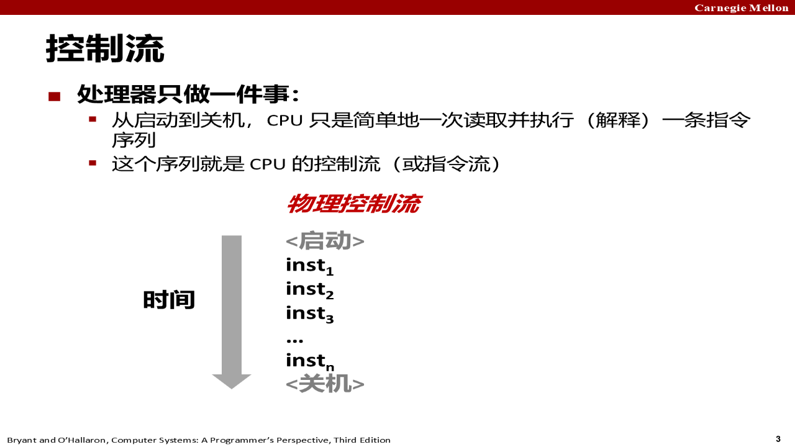

> **直观理解（录音）**
>
> 控制流就是你写的代码按顺序一条一条往下执行。想让它跳转，就用分支、跳转、调用、返回这些**正常**机制——这些是**程序自己写代码控制的**。但系统里还经常发生一些**代码没写、也不归程序管**的事，比如除零、数据从磁盘到了、按了 Ctrl-C，这些就会让控制流"不正常地"拐弯——这就是**异常控制流（Exceptional Control Flow, ECF）**。

**正常控制流**（程序自己控制的）：跳转、调用、返回，响应的是**程序变量表示的程序状态变化**。

**ECF（异常控制流）**：响应的是**系统状态的变化**——硬件定时器定期产生信号、网络包到达网卡、程序向磁盘请求数据后休眠等待、子进程终止要通知父进程……现代系统通过让控制流"突变"来响应这些情况。

**ECF 发生在计算机系统的各个层次**：

| 层次 | ECF 形式 | 实现者 |
| --- | --- | --- |
| 硬件层 | 异常（中断、陷阱、故障、终止） | 硬件 + OS |
| 操作系统层 | 进程上下文切换 | 内核 |
| 应用层（OS 接口） | 信号（signal） | OS 软件 |
| 应用层（最高） | 非本地跳转（setjmp/longjmp） | C 运行库 |

> **为什么程序员要理解 ECF（书中 5 条）**
>
> 1. 理解 ECF → 理解操作系统实现 I/O、进程、虚拟内存的**基本机制**。
> 2. 理解 ECF → 理解应用程序如何与 OS 交互（**系统调用 / 陷阱**是应用请求服务的唯一入口）。
> 3. 理解 ECF → 能写有趣的新程序（Unix shell、Web 服务器）。
> 4. 理解 ECF → 理解**并发**（中断、进程/线程、信号处理程序都是并发的例子）。
> 5. 理解 ECF → 理解软件异常（C++/Java 的 try/throw/catch 底层靠 C 的 setjmp/longjmp 这类非本地跳转实现）。

***

## 1. 异常（8.1）

**异常（exception）**：控制流中的突变，用来**响应处理器状态中的某些变化**。一部分由硬件实现，一部分由操作系统实现。

**事件（event）**：处理器状态被编码为不同的位和信号，状态变化即"事件"。

- 与当前指令直接相关：虚拟内存缺页、算术溢出、除零。
- 与当前指令无关：定时器信号、I/O 请求完成。

处理器检测到事件后，通过一张**异常表（exception table）**做间接过程调用，跳到一个专门的处理函数——**异常处理程序（exception handler）**。

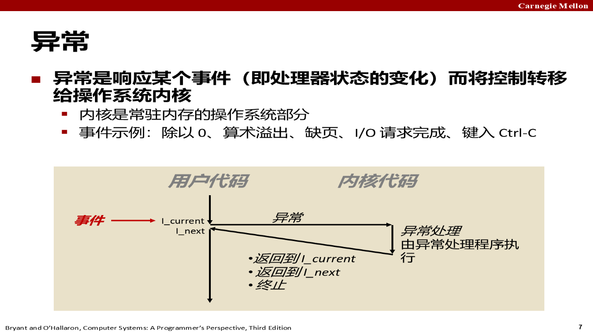

**处理程序完成后三种返回情况**：

1. 返回给当前指令 $I_{curr}$（事件发生时正在执行的指令）。
2. 返回给 $I_{next}$（没有异常时会执行的下一条指令）。
3. 终止被中断的程序。

> **课堂补充（录音）：异常 = 应急预案**
>
> 老师打的比方：异常表就像**应急预案手册**。飞机上玻璃突然碎了，机组人员不慌，翻手册看"玻璃破碎"该干什么，照着做就行。异常也一样——**你不需要在代码里处理除零**，操作系统根据异常号查表，自动跳到对应的处理程序去处理。

> **旁注：术语**
>
> C++/Java 的"异常"（try/catch/throw）是**软件异常**（应用级）；本章的"异常"主要指**硬件/系统异常**。本书用"异常"做通用词，需要区分时才说"异步异常（中断）"和"同步异常（陷阱、故障、终止）"。

### 1.1 异常处理（8.1.1）

- 每种异常类型有**唯一的非负整数异常号（exception number）**。部分由处理器设计者分配（除零、缺页、内存访问违例、断点、溢出），部分由 OS 内核设计者分配（系统调用、外部 I/O 信号）。
- 系统启动时，OS 分配并初始化**异常表**，使表目 $k$ 包含异常 $k$ 的处理程序地址。
- 运行时：处理器检测事件 → 确定异常号 $k$ → 通过异常表表目 $k$ 间接过程调用 → 进入处理程序。

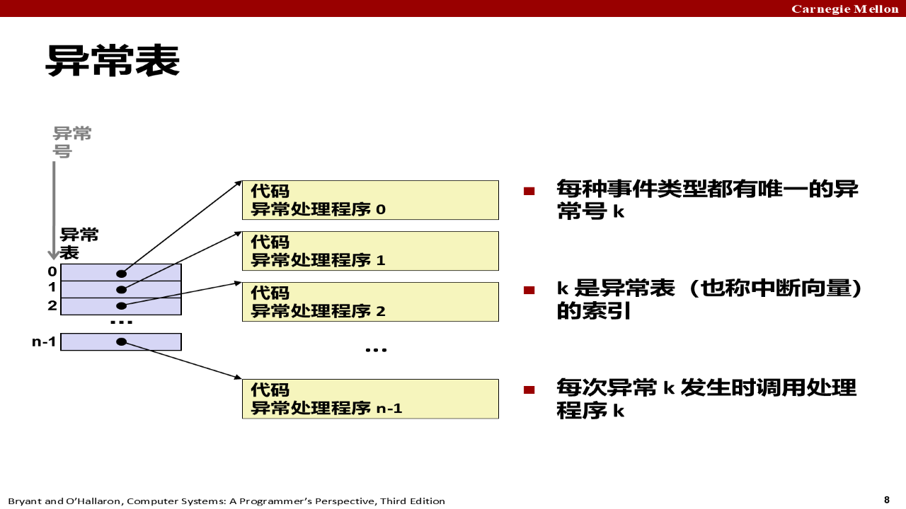

异常表基址存放在 CPU 的**异常表基址寄存器**里，异常号就是到异常表的索引。

**异常调用 vs 普通过程调用的 4 个区别**：

| | 普通过程调用 | 异常 |
| --- | --- | --- |
| 返回地址 | 下一条指令 | 当前指令 $I_{curr}$ 或下一条指令 $I_{next}$（看异常类型） |
| 压栈内容 | 返回地址 | 返回地址 + 额外处理器状态（如 x86-64 的 EFLAGS 条件码寄存器） |
| 栈 | 用户栈 | 若从用户程序转到内核，压到**内核栈** |
| 运行模式 | 用户模式 | **内核模式**（对全部系统资源有完全访问权） |

处理完事件后，处理程序执行一条特殊的"从中断返回"指令，恢复状态并返回被中断的程序。

### 1.2 异常的类别（8.1.2）

四类异常：**中断（interrupt）、陷阱（trap）、故障（fault）、终止（abort）**。

| 类别 | 原因 | 异步/同步 | 返回行为 |
| --- | --- | --- | --- |
| 中断 | 来自 I/O 设备的信号 | 异步 | 总是返回到下一条指令 |
| 陷阱 | 有意的异常 | 同步 | 总是返回到下一条指令 |
| 故障 | 潜在可恢复的错误 | 同步 | 可能返回到当前指令 |
| 终止 | 不可恢复的错误 | 同步 | 不会返回 |

> 异步异常 = 处理器**外部** I/O 设备事件产生；同步异常 = 执行**当前指令**的直接产物（这条指令叫**故障指令 faulting instruction**）。

#### 1. 中断（interrupt）

异步发生，来自处理器外部的 I/O 设备信号。处理程序常叫**中断处理程序（interrupt handler）**。

流程：I/O 设备（网卡、磁盘控制器、定时器芯片）向处理器芯片引脚发信号，并把异常号放到系统总线上 → 当前指令完成后，处理器注意到中断引脚电压变高 → 从总线读取异常号 → 调用中断处理程序 → 返回下一条指令（程序继续，好像没发生过中断）。

> **课堂补充（录音）：异步 = "它主动通知你"**
>
> 老师打比方：上课时你只管听课，**食堂开门了会有人通知你**（中断）；手机上设个**定时器**，时间到了它自己响铃，你不用一直盯着看。数据从网络来了、磁盘数据到了，都是"设备主动通知你"——这就是**异步**。中断就是典型的异步异常。

#### 2. 陷阱和系统调用（trap & syscall）

陷阱是**有意的**异常，是执行指令的直接产物。最重要的用途是**系统调用（system call）**：用户程序请求内核服务。

- 用户程序执行 `syscall` 指令 → 触发到异常处理程序的陷阱 → 处理程序解析参数、调用适当的内核程序。
- x86-64 上，**所有系统调用参数通过通用寄存器传递，不通过栈**：`%rax` 放系统调用号，`%rdi/%rsi/%rdx/%r10/%r8/%r9` 放最多 6 个参数；返回值在 `%rax`（-4095 到 -1 的负值表示错误，对应负的 errno）。

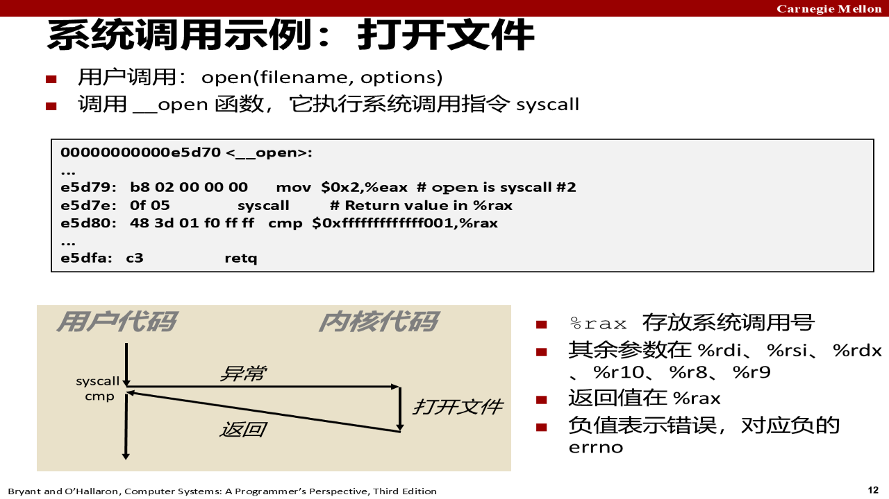

> **直观理解（录音）**
>
> 你写 C 程序时感觉有些功能**实现不了**——比如操作显示器、访问硬盘。因为你在**用户态**，权限不够。这时必须通过**系统调用**跳到**内核态**（系统模式），内核把所有硬件都管着，替你完成操作再回来。所以系统调用是"用户模式 ↔ 内核模式"切换的通道。

**常用 Linux 系统调用**（x86-64，部分）：

| 编号 | 名字 | 描述 |
| --- | --- | --- |
| 0 | read | 读文件 |
| 1 | write | 写文件 |
| 2 | open | 打开文件 |
| 3 | close | 关闭文件 |
| 4 | stat | 获得文件信息 |
| 9 | mmap | 将内存页映射到文件 |
| 12 | brk | 重置堆顶 |
| 32 | dup2 | 复制文件描述符 |
| 33 | pause | 挂起进程直到信号到达 |
| 37 | alarm | 调度告警信号传送 |
| 39 | getpid | 获得进程 ID |
| 57 | fork | 创建进程 |
| 59 | execve | 执行一个程序 |
| 60 | _exit | 终止进程 |
| 61 | wait4 | 等待一个进程终止 |
| 62 | kill | 发送信号到一个进程 |

> **课堂补充（录音）：`_exit` 和 `exit` 的区别**
>
> 带下划线的 `_exit` 是**系统调用**；不带下划线的 `exit` 是**库函数**（包装函数）。kill 也**不是"杀死"**——它是"发送一个信号"，比如发 9 号信号（SIGKILL）才一定会终止进程，别的信号可能只是通知。

`hello` 程序的两种写法：

```c
// 用系统级函数 write（不是 printf）
int main() {
    write(1, "hello, world\n", 13);
    _exit(0);
}
```

```asm
# 直接使用 syscall 指令（hello-asm64.s）
.section .data
string:
    .ascii "hello, world\n"
string_end:
    .equ len, string_end - string
.section .text
.globl main
main:
    # First, call write(1, "hello, world\n", 13)
    movq $1, %rax      # write is system call 1
    movq $1, %rdi      # Arg1: stdout has descriptor 1
    movq $string, %rsi # Arg2: hello world string
    movq $len, %rdx    # Arg3: string length
    syscall            # Make the system call
    # Next, call _exit(0)
    movq $60, %rax     # _exit is system call 60
    movq $0, %rdi      # Arg1: exit status is 0
    syscall            # Make the system call
```

> 从程序员角度看系统调用和普通函数调用一样，但实现完全不同：普通函数在**用户模式**运行（指令受限、只能访问自己的栈）；系统调用在**内核模式**运行（可执行特权指令、访问内核栈）。

#### 3. 故障（fault）

由**错误情况**引起，可能被处理程序修正：

- 能修正 → 控制返回**引起故障的指令**，重新执行它。
- 不能修正 → 返回到内核中的 `abort` 例程，终止应用程序。

**经典示例：缺页异常（page fault）**——指令引用一个虚拟地址，而对应物理页面不在内存中，需从磁盘取出。缺页处理程序从磁盘加载页面，返回给引起故障的指令；指令再次执行时页面已在内存，可正常完成。

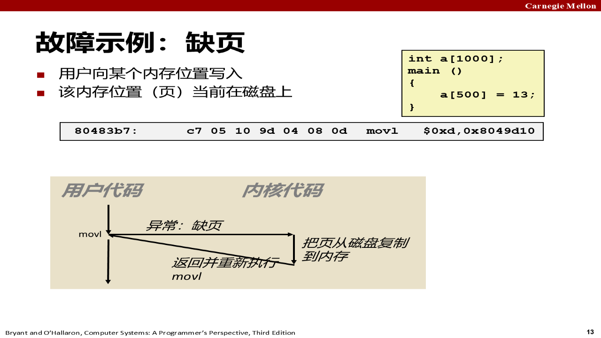

> **课堂补充（录音）：缺页是可以修复的异常**
>
> 你访问内存时，数据不在内存里（在硬盘上），进程被**挂起**，操作系统去硬盘把这一页加载进内存，然后**重新执行刚才那条指令**，程序继续往下走——只是浪费了一点时间。所以缺页是"可以修复"的异常。

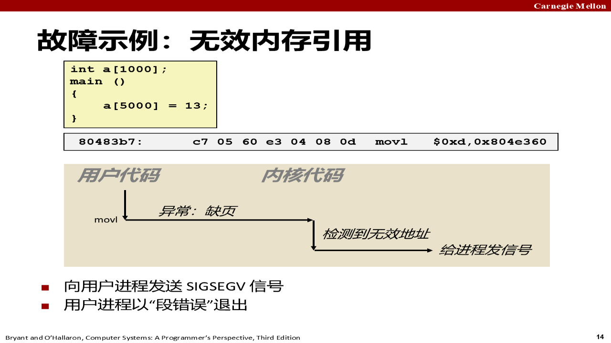

> 无效内存引用（如 `a[5000]` 而数组只有 1000 个元素）：内核检测到无效地址 → 给进程发 **SIGSEGV** 信号 → 用户进程以"段错误（Segmentation fault）"退出。

#### 4. 终止（abort）

不可恢复的致命错误（通常硬件错误，如 DRAM/SRAM 位损坏的奇偶错误）。终止处理程序**从不返回**控制给应用程序，直接转给 `abort` 例程终止程序。

### 1.3 Linux/x86-64 系统中的异常（8.1.3）

x86-64 有高达 256 种异常类型：**0~31 由 Intel 架构师定义**（对任何 x86-64 系统都一样），**32~255 对应操作系统定义的中断和陷阱**。

| 异常号 | 描述 | 异常类别 |
| --- | --- | --- |
| 0 | 除法错误 | 故障 |
| 13 | 一般保护故障 | 故障 |
| 14 | 缺页 | 故障 |
| 18 | 机器检查 | 终止 |
| 32~255 | 操作系统定义的异常 | 中断或陷阱 |

**各类异常的 Linux 行为**：

- **除法错误（0）**：试图除零或除法结果对目标操作数太大。Unix 不尝试恢复，直接终止程序；shell 常报告为"浮点异常（Floating exception）"。
- **一般保护故障（13）**：通常因引用未定义的虚拟内存区域，或试图写只读文本段。Linux 不恢复；shell 常报告为"段故障（Segmentation fault）"。
- **缺页（14）**：可恢复，处理程序把磁盘页面映射到物理内存后重新执行故障指令（第 9 章详讲）。
- **机器检查（18）**：指令执行中检测到致命硬件错误，处理程序从不返回。

> **课堂补充（录音）：同步 = 要你去等它**
>
> 同步异常需要**等待**：陷阱（如系统调用、断点）是你主动执行的；故障（缺页可修、除零不可修）；终止是最严重的（非法指令、奇偶校验错、机器检查），直接杀掉进程——因为数据已经不可信了，继续执行只会错上加错。

***

## 2. 进程（8.2）

**进程（process）**：一个**执行中程序的实例**（classic definition）。计算机科学中最深刻、最成功的概念之一。

**程序 ≠ 进程**：

| | 程序 | 进程 |
| --- | --- | --- |
| 本质 | 一堆代码和数据（静态） | 执行中程序的一个实例（动态） |
| 存在形式 | 磁盘上的目标文件 / 地址空间中的段 | 运行在某个进程的上下文中 |
| 例子 | 安装的 QQ | 运行起来的那个 QQ |

> **课堂补充（录音）**
>
> 程序是硬盘上的文件（比如 QQ 安装好后就是一堆程序）；**启动一次、跑起来的那一个就叫进程**。以前 QQ 可以多开——同一份程序，同时跑好几个进程。有的程序跑一下就结束了，有的（比如服务器、QQ 挂机）**永远不结束**，里面往往有个 `while(1);` 死循环。所以进程是"程序运行一次"这个**动态**的东西。

进程为每个程序提供两个关键抽象：

1. **独立的逻辑控制流**：假象——程序独占地使用处理器。
2. **私有的地址空间**：假象——程序独占地使用内存系统。

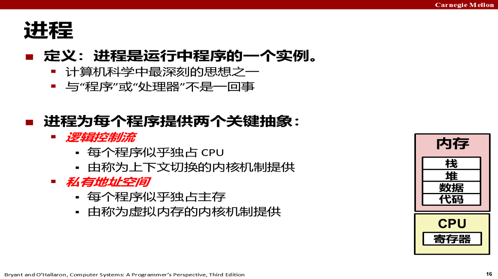

每次用户向 shell 输入一个可执行目标文件的名字，shell 就创建一个新进程，在新进程的上下文中运行这个文件。

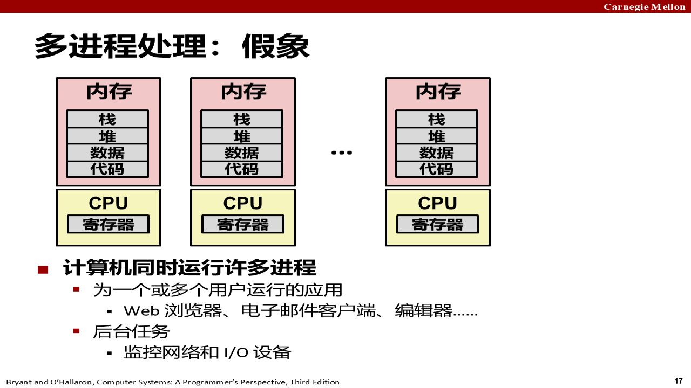

> 计算机同时运行许多进程：面向用户的（浏览器、邮件客户端、编辑器）+ 后台任务（监控网络和 I/O 设备）。

### 2.1 逻辑控制流（8.2.1）

用调试器单步执行程序，会看到一系列 PC 值，唯一对应可执行目标文件中的指令（或动态链接共享对象中的指令）。这个 PC 值序列叫**逻辑控制流（logical control flow）**，简称逻辑流。

多个进程轮流使用处理器：每个进程执行一段，然后被**抢占（preempted）**（暂时挂起），轮到其他进程。物理控制流被分成多个逻辑流。

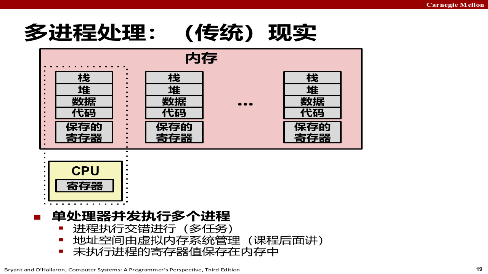

> **课堂补充（录音）：为什么 CPU 上有很多进程？**
>
> 你的电脑同时跑着浏览器、音乐、各种后台服务。单核时代 CPU 也是"模拟"同时跑——微观上同一时刻只有一个进程在 CPU 上执行，宏观上大家"看起来"都在跑。Linux/Unix 天生就是**多用户多任务**设计（当年 IBM 招标，微软赶工买了别人的系统改个名；Unix 前身 Multics 因为设计太完美实现不了，后来简化出了 Unix，这些历史故事说明了多任务从设计之初就是核心）。

### 2.2 并发流（8.2.2）

一个逻辑流的执行在时间上与另一个流**重叠**，称为**并发流（concurrent flow）**。

> 流 X 和 Y 互相并发 ⟺ X 在 Y 开始之后、结束之前开始，**或** Y 在 X 开始之后、结束之前开始。

- 多个流并发执行的一般现象 = **并发（concurrency）**。
- 一个进程和其他进程轮流运行 = **多任务（multitasking）**。
- 一个进程执行它控制流的一部分的每一段时间 = **时间片（time slice）**。多任务也叫**时间分片（time slicing）**。
- **并行流（parallel flow）**是并发流的真子集：两个流并发地运行在**不同的处理器核或计算机**上才叫并行。

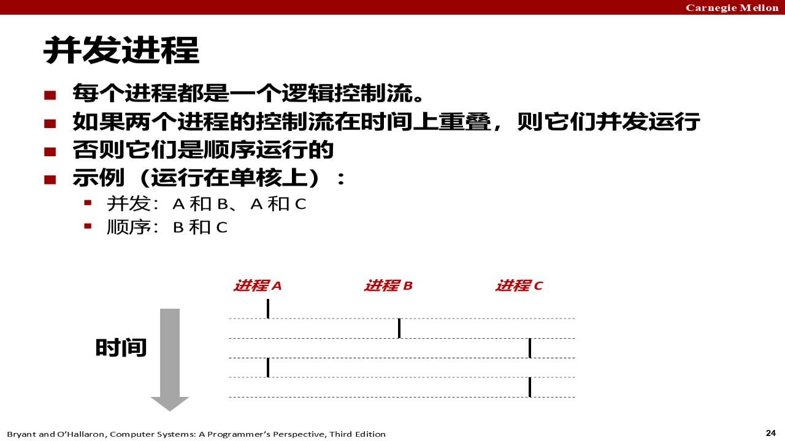

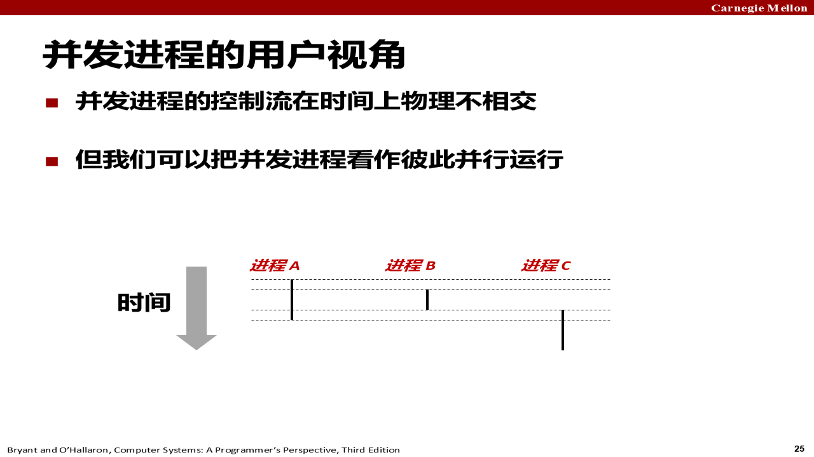

> **直观理解（录音）**
>
> 单核 CPU 上一个时刻只能执行一个进程，它执行一个"时间片"再切到下一个。但从**开始到结束的时间范围**来看，如果两个进程的时间段有**重叠**，它们就是**并发**的。以书上图 8-12 的三个进程为例：A 和 B 有重叠 → 并发；A 和 C 有重叠 → 并发；B 在 C 开始之前就结束了 → **B 和 C 不并发**（顺序执行）。（注意：图 8-12 的 A 分两段运行，与练习题 8.1 的时间数据不同。）

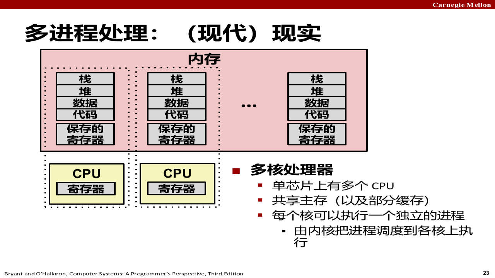

> 多进程（传统）现实：单处理器上进程执行交错（多任务），地址空间由虚拟内存系统管理，未执行进程的寄存器值保存在内存中（"保存的寄存器"）。多核现实：单芯片上多个 CPU，共享主存和部分缓存，每个核执行一个独立进程，由内核把进程调度到各核。

**练习题 8.1**（书页 509）：考虑三个具有下述起始和结束时间的进程：

| 进程 | 起始时间 | 结束时间 |
| --- | --- | --- |
| A | 0 | 2 |
| B | 1 | 4 |
| C | 3 | 5 |

对于每对进程，指出它们是否是并发地运行：

| 进程对 | 并发的？ |
| --- | --- |
| AB | 是 |
| AC | 否 |
| BC | 是 |

> **答案（书页 556）**：进程 A 和 B 互相并发，B 和 C 互相并发，因为各自的执行有重叠（一个进程在另一个进程结束前开始）。**A 和 C 不是并发的**，因为 A 在 C 开始之前就结束了（A 结束于 2，C 开始于 3，没有重叠）。

### 2.3 私有地址空间（8.2.3）

在 n 位地址机器上，地址空间是 $2^n$ 个可能地址的集合：$0, 1, \ldots, 2^n-1$。进程为每个程序提供它自己的**私有地址空间**——与空间中某个地址关联的内存字节一般不能被其他进程读写。

每个私有地址空间有相同的通用结构（x86-64 Linux 进程地址空间，见上面课件 p16 图中"内存"部分）：

| 区域 | 内容 |
| --- | --- |
| 只读代码段 | .init、.text、.rodata（从可执行文件加载） |
| 读/写段 | .data、.bss（从可执行文件加载） |
| 运行时堆 | 用 malloc 创建，`brk` 指针标记堆顶 |
| 共享库的内存映射区域 | mmap 等 |
| 用户栈 | 运行时创建，`%esp` 栈指针 |
| 内核虚拟内存 | 代码、数据、堆、栈（用户代码不可见） |

- 地址空间**底部**保留给用户程序（代码、数据、堆、栈段，代码段总是从 `0x400000` 开始）。
- 地址空间**顶部**保留给内核（OS 常驻内存的部分），包含内核代表进程执行时使用的代码、数据和栈。
- 用户模式进程**不能直接访问**内核区，只能通过系统调用接口间接访问。

> **课堂补充（录音）：虚拟地址 vs 物理地址**
>
> 每个进程看到的地址空间都是巨大的虚拟地址空间（x86-64 是 $2^{48}$ 量级），但**运行时实际占用的物理内存很小**——虚拟地址空间里大部分是空的，没用到就不分配。进程之间互相看不见、不能访问别人的内存，这才有安全隔离；如果谁都能访问别人的内存，那就不存在安全问题、也不存在病毒了——因为大家都是病毒。

### 2.4 用户模式和内核模式（8.2.4）

处理器用控制寄存器中的**模式位（mode bit）**描述进程当前享有的特权：

- **模式位设置** → **内核模式**（超级用户模式）：可执行指令集中的任何指令，可访问系统中的任何内存位置。
- **模式位未设置** → **用户模式**：不允许执行特权指令（停止处理器、改变模式位、发起 I/O 操作），也不允许直接引用内核区代码/数据（否则致命保护故障）。用户程序必须通过**系统调用接口**间接访问内核。

- 运行应用程序代码的进程初始在用户模式。
- **从用户模式变为内核模式的唯一方法：异常**（中断、故障或陷入系统调用的陷阱）。
- 异常发生时控制传给异常处理程序，处理器把模式从用户变为内核；处理程序返回到应用程序时再改回用户模式。

> **课堂补充（录音）：为什么你必须"求助于"内核**
>
> 写汇编时硬件随便你用；写 C 应用时会发现有些功能实现不了——操作显示器、读硬盘、控制鼠标，**都要系统级权限**。这时必须从用户态跳转到内核态（系统模式），内核管理所有硬件，替你做完再返回。**用户态 ↔ 内核态的切换**，本质上就是进程上下文切换的基础。厉害的病毒往往在这条切换路径上做文章，劫持切换流程获取内核权限。

**/proc 文件系统**：Linux 提供的一种机制，把许多内核数据结构的内容输出为文本文件层次结构，供用户模式进程读取。如 CPU 类型（`/proc/cpuinfo`）、某进程的内存段（`/proc/<pid>/maps`）。

### 2.5 上下文切换（8.2.5）

**上下文切换（context switch）**：操作系统内核用来实现多任务的一种**较高层形式的 ECF**，建立在低层异常机制之上。

- **上下文（context）**：内核重新启动一个被抢占进程所需的状态——通用寄存器、浮点寄存器、PC、用户栈、状态寄存器、内核栈，以及各种内核数据结构（页表、进程表、文件表）。
- **调度（scheduling）**：内核在进程执行的某些时刻决定抢占当前进程、重新开始另一个进程。由内核中的**调度器（scheduler）**处理。
- 上下文切换的步骤：1) 保存当前进程的上下文；2) 恢复某个先前被抢占进程保存的上下文；3) 将控制传给新恢复的进程。

**何时发生上下文切换**：

- **系统调用阻塞时**：如 `read` 要访问磁盘，内核可切换到另一个进程，而不是干等；`sleep` 显式请求休眠。
- **中断**：周期性的定时器中断（每 1ms 或 10ms），内核判定当前进程运行够久了，就切换。

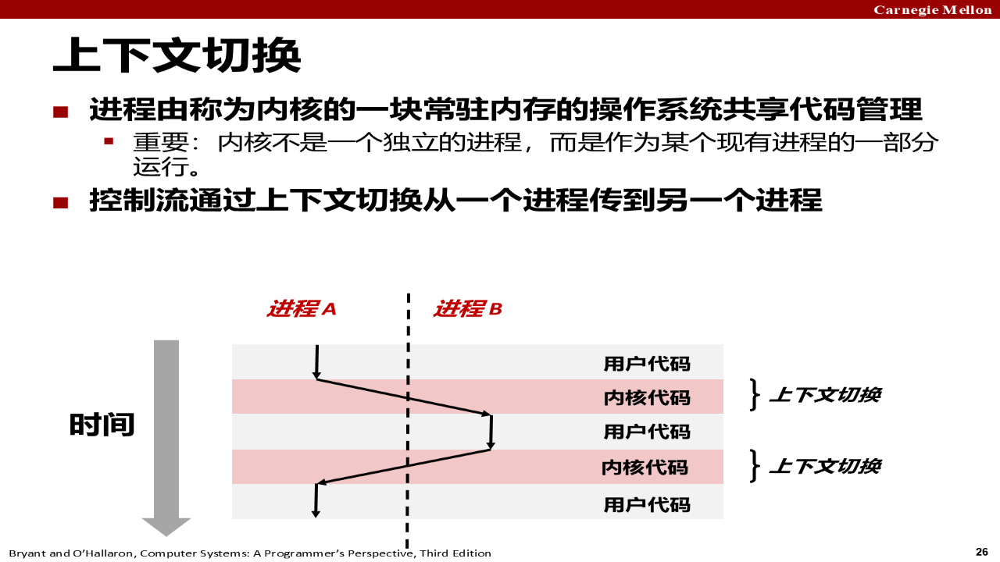

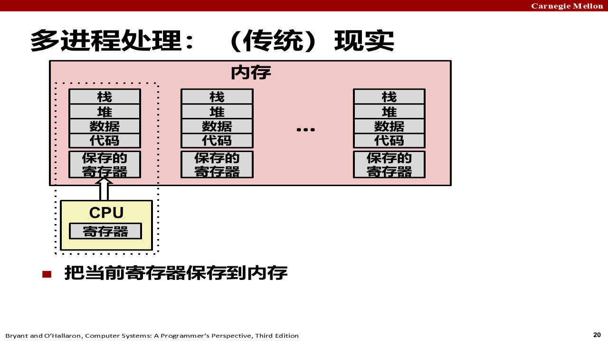

> **重要**：内核**不是一个独立的进程**，而是作为某个现有进程的一部分运行（"代表进程执行"）。

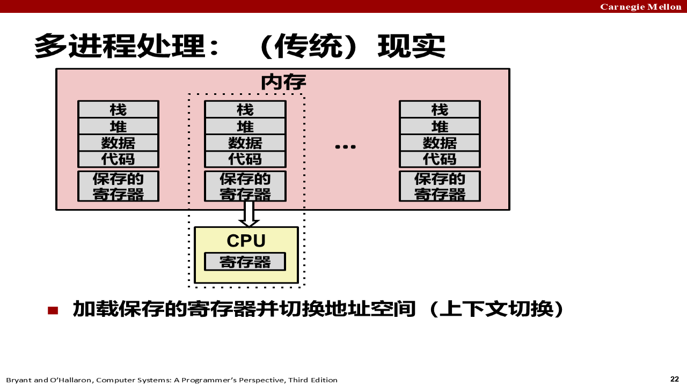

> 图 8-14 的例子：进程 A 用户模式运行 → 执行 `read` 系统调用陷入内核 → 内核请求磁盘 DMA 传输 → 磁盘数据到达需几十毫秒，内核切换到进程 B → B 运行一会 → 磁盘中断 → 内核切换回 A，返回 `read` 之后的那条指令。

> **课堂补充（录音）**
>
> 上下文切换就是**运行环境的切换**——发生在模式切换（用户态 ↔ 内核态）过程中。切换时要把当前进程的现场（寄存器、变量、历史数据）保存下来，等它再被调度时恢复。只要涉及进程切换，就一定有上下文切换。

***

## 3. 系统调用错误处理（8.3）

Unix 系统函数遇到错误时通常**返回 -1**，并设置全局整数变量 **errno** 表示出错原因。

**教材的标准处理套路**（层层简化）：

```c
// 第 1 层：直接检查错误（4 行）
if ((pid = fork()) < 0) {
    fprintf(stderr, "fork error: %s\n", strerror(errno));
    exit(0);
}
```

`strerror(errno)` 返回描述 errno 值的文本串。

```c
// 第 2 层：封装错误报告函数（调用缩成 2 行）
void unix_error(char *msg) {
    fprintf(stderr, "%s: %s\n", msg, strerror(errno));
    exit(0);
}
if ((pid = fork()) < 0)
    unix_error("fork error");
```

```c
// 第 3 层：错误处理包装函数 Foo（调用缩成 1 行）
pid_t Fork(void) {
    pid_t pid;
    if ((pid = fork()) < 0)
        unix_error("Fork error");
    return pid;
}
pid = Fork();
```

> **包装函数约定**：对基本函数 `foo`，定义同名首字母大写的包装函数 `Foo`，包装函数调用基本函数、检查错误、出错就终止。书后（csapp.c / csapp.h）提供全套。**注意**：书中讲系统级函数时，总是用小写基本名字（`fork`）引用，而不是大写包装名（`Fork`）。

> **课堂补充（录音）：为什么错误返回 -1 而不是其他值？**
>
> 成功只有一种，错误有很多种。所以成功返回 0（或正数），出错返回 **-1** 并让 errno 告诉你**错在哪**。`fork` 失败原因举例：内存不够（复制进程要空间）、进程号用完了（32 位系统 PID 上限约 6 万多个，进程太多创建不了）。

***

## 4. 进程控制（8.4）

Unix 提供了大量从 C 程序操作进程的系统调用。

### 4.1 获取进程 ID（8.4.1）

```c
#include <sys/types.h>
#include <unistd.h>
pid_t getpid(void);   // 返回调用进程的 PID
pid_t getppid(void);  // 返回父进程（创建调用进程的进程）的 PID
```

每个进程都有唯一的**正数（非零）进程 ID（PID）**。`pid_t` 在 Linux 上是 int。

> **课堂补充（录音）：函数名速记**
>
> `getpid` = get **p**rocess **id**（自己的进程号）；`getppid` = get **p**arent **p**rocess **id**（爸爸的进程号）。子进程想知道"我爸是谁"就调 `getppid`。

### 4.2 创建和终止进程（8.4.2）

**进程的三种状态**：

| 状态 | 说明 |
| --- | --- |
| 运行 | 在 CPU 上执行，或等待被执行且最终会被内核调度 |
| 停止 | 执行被挂起且不会被调度；收到 SIGSTOP/SIGTSTP/SIGTTIN/SIGTTOU 信号后停止，直到收到 SIGCONT 才继续（信号是软件中断，8.5 详讲） |
| 终止 | 永远停止。原因：1) 收到默认行为是终止的信号；2) 从主程序返回；3) 调用 exit 函数 |

```c
#include <stdlib.h>
void exit(int status);  // 该函数不返回
```

`exit` 以 status 退出状态终止进程（另一种设置退出状态的方法：从 main 返回整数值）。

> **课堂补充（录音）：终止的三种情况**
>
> 1. 收到信号被强迫终止（别人让你死）；2. 从主程序返回，程序自然结束（自己控制）；3. 调 `exit(status)` 提前结束（自己控制）。`exit` 带个状态值，**父进程能捕获到**，据此判断你是正常退出（0）还是出错（非 0）。

#### fork 函数：创建子进程

```c
#include <sys/types.h>
#include <unistd.h>
pid_t fork(void);
// 返回：子进程返回 0，父进程返回子进程 PID，出错返回 -1
```

- 新创建的子进程**几乎但不完全**与父进程相同：获得父进程用户级虚拟地址空间的**相同但独立的副本**（代码、数据段、堆、共享库、用户栈），还获得父进程所有打开文件描述符的副本（子进程可以读写父进程中打开的任何文件）。
- 父进程和子进程最大的区别：**不同的 PID**。
- **调用一次，返回两次**：父进程中返回子进程 PID，子进程中返回 0。因为子进程 PID 总为非零，返回值提供明确方法分辨是在父进程还是子进程执行。

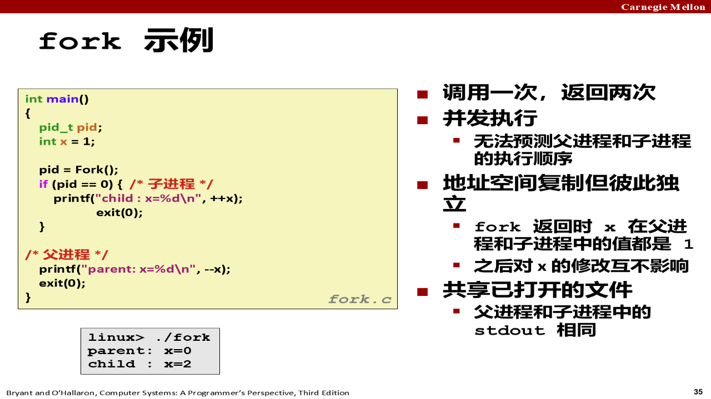

```c
/* fork.c */
int main() {
    pid_t pid;
    int x = 1;

    pid = Fork();
    if (pid == 0) { /* 子进程 */
        printf("child : x=%d\n", ++x);
        exit(0);
    }
    /* 父进程 */
    printf("parent: x=%d\n", --x);
    exit(0);
}
```

运行结果（我们的系统上）：

```
linux> ./fork
parent: x=0
child : x=2
```

**fork 示例的微妙之处**：

1. **调用一次，返回两次**：一次返回父进程，一次返回子进程。
2. **并发执行**：父子进程是并发运行的独立进程，内核可以任意方式交替执行它们的指令。我们系统上父进程先完成 printf，另一个系统可能正好相反。**作为程序员，绝不能对指令交替执行做任何假设**。
3. **相同但独立的地址空间**：fork 返回时，两个进程里 x 都为 1；但之后父/子对 x 的任何修改都是独立的，不会反映到另一个进程（父进程 x=0，子进程 x=2）。
4. **共享文件**：子进程继承父进程所有打开文件。fork 时 stdout 是打开的并指向屏幕，子进程继承它，输出也指向屏幕。

> **课堂补充（录音）：fork 为什么"返回两次"？**
>
> fork 之后有两个进程在跑，两个进程各收到一次返回值。**父进程拿到的是子进程 PID**——因为一个父亲可能有多个孩子，必须知道"是哪个孩子"（否则没法区分）；**子进程拿到 0**——因为子进程想知道父亲，随时可以调 `getppid()` 查，不用 fork 返回。而且 fork 后**代码是同一份**，靠返回值 `if (pid == 0)` 区分：这段代码在父进程跑还是子进程跑。
>
> **fork 是"重量级"的**：所有变量都要复制一份（常量可能不复制，因为只读不修改），代价大。这也是后来线程（thread）出现的原因——线程共享全局变量，不用复制。
>
> **课堂补充（录音）：进程 vs 线程（先打个照面）**
>
> 本讲（第 14 讲）主角是**进程**，但老师课上对比了两者，先建立直观认识：
>
> | 维度 | 进程 | 线程 |
> | --- | --- | --- |
> | 独立性 | **完全独立**，各有各的地址空间，谁也看不见谁 | **属于进程内部**，同一进程的线程**共享全局变量** |
> | 通信 | 进程之间**必须靠进程间通信（IPC）**：管道、消息队列、共享内存等 | 线程之间直接读写共享变量就能通信 |
> | 创建开销 | fork 要复制一份地址空间，**重** | 创建轻量，**快** |
> | 关系 | 进程是"独立的人"，各有各的家 | 线程是"一家人"，住同一个房子 |
>
> 线程属于操作系统第 12 讲的内容（CSAPP 第 12 章并发编程），这一讲先记住"**进程独立、线程共享**"这个核心区别即可。

> **课堂补充（录音）：fork 服务器模型（预告）**
>
> 服务器（Web 服务器、游戏服务器）常用的模式：**父进程只负责接收请求**，收到一个请求就 `fork` 一个子进程（分身）去处理，自己继续接下一个。如果父亲自己埋头干活，就无法响应新请求了。这个"父亲接单、儿子干活"的模型非常普遍。

**练习题 8.2**（书页 516）：

```c
/* forkprob0.c */
int main() {
    int x = 1;
    if (Fork() == 0)
        printf("p1: x=%d\n", ++x);
    printf("p2: x=%d\n", --x);
    exit(0);
}
```

A. 子进程的输出是什么？B. 父进程的输出是什么？

> **答案（书页 556）**：A. 子进程执行两个 printf：`p1: x=2`、`p2: x=1`。B. 父进程只执行第二个 printf：`p2: x=0`。
>
> 关键点：子进程在 fork 返回后执行 `if` 里的 printf（x 从 1 变 2），然后**从 if 出来**继续执行第二个 printf（x 从 2 变 1）；父进程跳过 if 分支，直接执行第二个 printf（x 从 1 变 0）。

#### 进程图（Process Graph）

**进程图**是刻画程序语句偏序关系的**前趋图**：

- 每个顶点 a 对应一条语句的执行。
- 有向边 a→b 表示语句 a 发生在语句 b 之前。
- 边可标注变量的当前值；printf 顶点可标注输出。
- 每张图从一个顶点开始（对应 main），每个进程的顶点序列结束于 exit 顶点。
- **图的任意拓扑排序对应一个可行的全序**（把所有顶点排成一行，每条边方向都从左往右）。

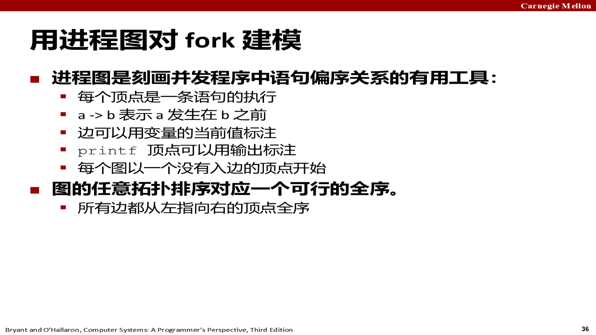

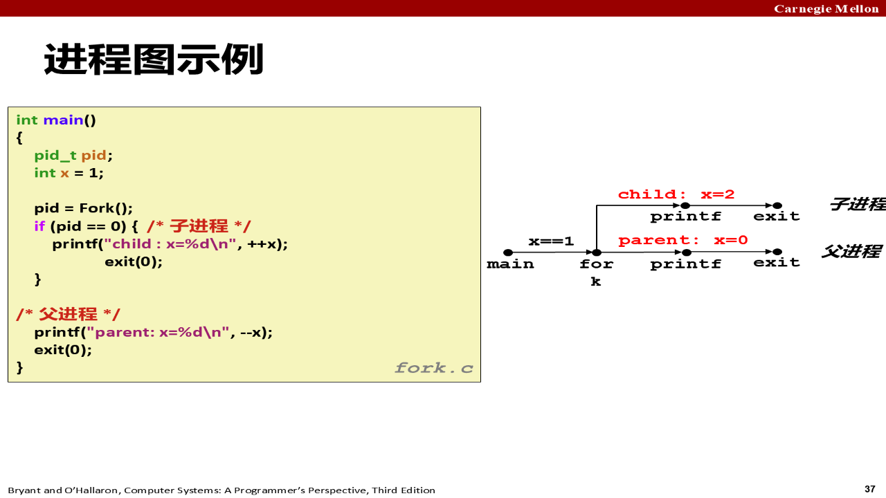

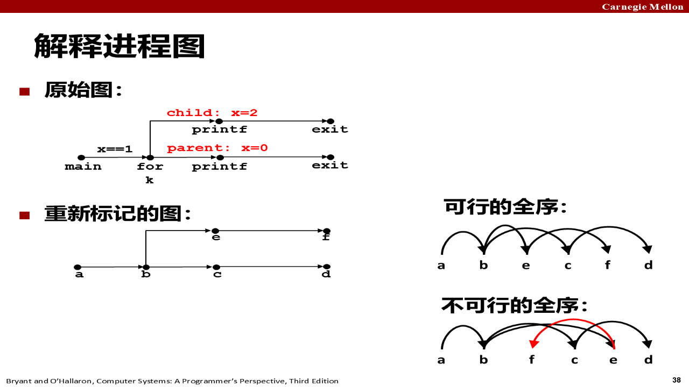

> **直观理解（录音）**
>
> 进程图就是画出代码执行的全过程：一个点代表一条语句/表达式，a→b 表示 a 先于 b。**拓扑排序 = 把所有点排成一排，所有箭头都只能从左往右**。合法的执行顺序就是某种拓扑排序；违反依赖的顺序（箭头朝左）就是不可能的。

**fork 嵌套示例**：

```c
void fork2() {           // 连续两次 fork
    printf("L0\n");
    fork();
    printf("L1\n");
    fork();
    printf("Bye\n");
}
```

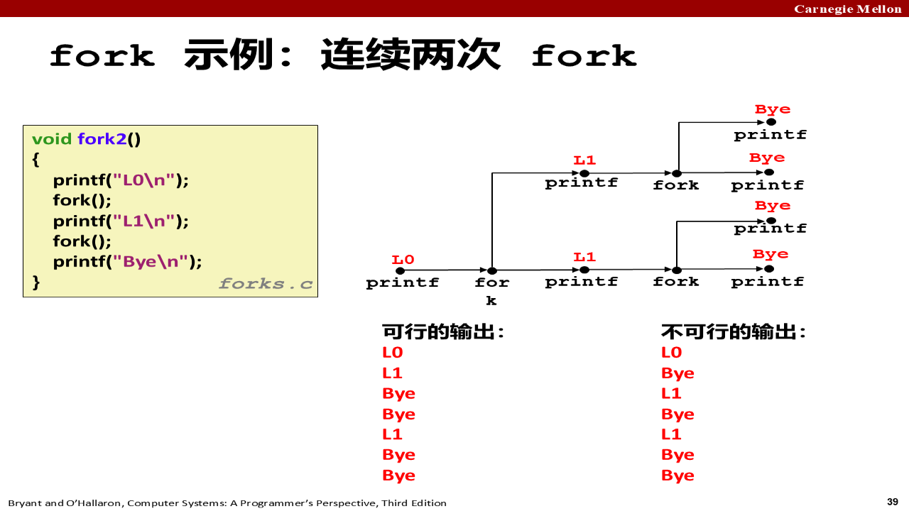

> 连续两次 fork → 4 个进程，每个都执行 printf("Bye")。可能的输出如 `L0 L1 Bye Bye L1 Bye Bye`；**不可行**的输出如 `L0 Bye L1 ...`（L1 必须在第二次 fork 之前，不能先于 L0 后的任何 Bye 前出现错序——按进程图拓扑排序判断）。

```c
void fork4() {           // 父进程中的嵌套 fork
    printf("L0\n");
    if (fork() != 0) {
        printf("L1\n");
        if (fork() != 0) {
            printf("L2\n");
        }
    }
    printf("Bye\n");
}
```

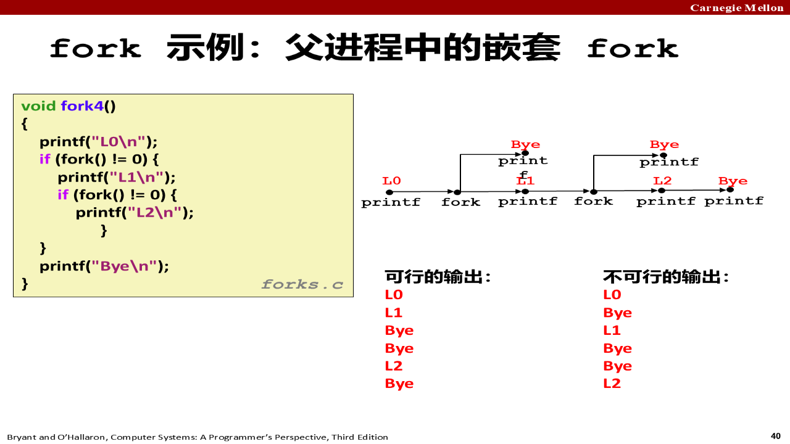

```c
void fork5() {           // 子进程中的嵌套 fork
    printf("L0\n");
    if (fork() == 0) {
        printf("L1\n");
        if (fork() == 0) {
            printf("L2\n");
        }
    }
    printf("Bye\n");
}
```

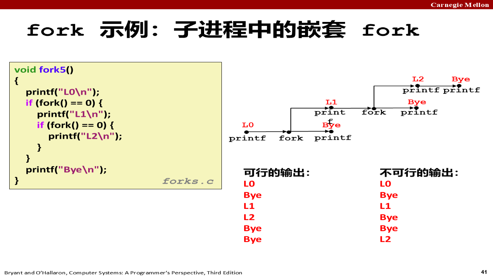

> 分析技巧：**fork 之后所有代码父子都要执行**（除非用 if 区分），一次 fork 把执行路径分成两支，多次 fork 就是分叉再分叉。画进程图 + 检查拓扑排序，就能判断一个输出序列可不可行。

### 4.3 回收子进程（8.4.3）

- 进程终止时内核**不会立即清除**它，而是保持"已终止"状态，直到被父进程**回收（reaped）**。
- 父进程回收时，内核把子进程的**退出状态**传给父进程，然后抛弃已终止进程。
- **僵死进程（zombie）**：已终止但还没被回收的进程（民间传说的僵尸：活着的尸体、半生半死——进程已终止但内核还保留状态）。

- 如果父进程终止，内核会安排 **init 进程**（PID 1，系统启动时创建，不会终止，是所有进程的祖先）成为孤儿进程的养父，回收它们。
- **长期运行的程序（shell、服务器）必须总是回收僵死子进程**——即使僵死子进程没在运行，仍消耗系统资源（进程表项、PID）。

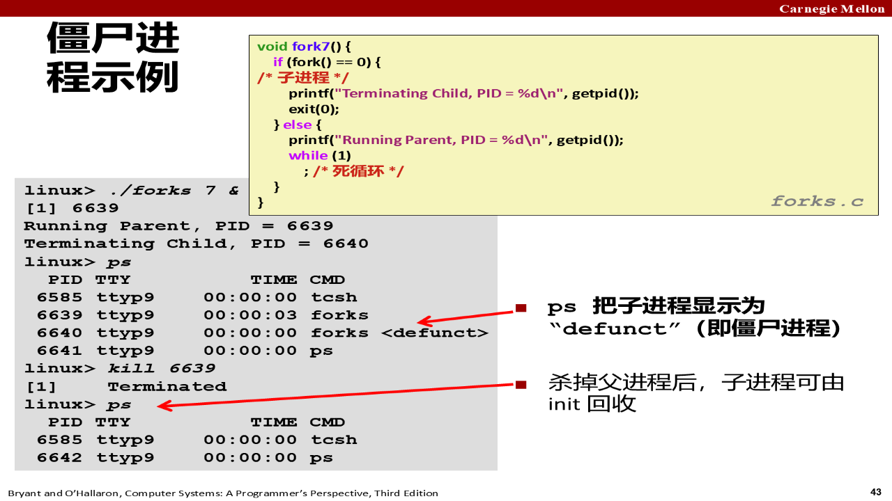

> **课堂补充（录音）：僵尸进程的"怨气"**
>
> 子进程死了，父进程不给它"收尸"（不回收），它就变成僵尸——**半死半活**：功能没了，但资源还占着（主要是进程表项和 PID）。僵尸杀不死、很麻烦，还一直占着 PID，PID 是有限的，攒多了别的进程就创建不了。父进程死了，init（1 号进程）会来收尸，所以长期运行的程序要自己显式回收。
>
> **录音补充①：僵尸怎么"彻底清除"？只能重启！** 僵尸进程**连 `kill -9`（SIGKILL）都杀不掉**——因为它的"尸体"状态本来就是内核保留给父进程收尸用的，发信号也没用；唯一办法是把它的父进程干掉（父进程死了 init 会来收尸），或干脆重启系统（早期 16 位系统 PID 上限约 65535，僵尸攒满就再也创建不了新进程，只能重启）。
>
> **录音补充②：0/1/2 号进程**：0 号进程（调度进程，系统启动时最先运行，所有进程的祖先）、1 号 init（所有进程的"老祖宗"、负责收养孤儿）、2 号进程（kthreadd，内核线程守护者）——特殊进程，普通用户动不了它们。
>
> **录音补充③：多进程服务器必须善后**：服务器（每来一个请求就 fork 一个分身）如果不管僵尸，跑一天就攒一堆僵尸，最终"进程号耗尽"没法再接受新连接。所以服务器代码里必须显式回收（wait 或捕获 SIGCHLD 信号，后者见第 8 章信号笔记）。
>
> **录音补充④：man 手册怎么用**：查系统调用（如 fork、kill）用 `man 2 fork`；查库函数用 `man 3`；查命令用 `man 1`。手册 section 分类：1=用户命令、2=系统调用、3=库函数、7=杂项（如 `man 7 signal` 列异步信号安全函数）。

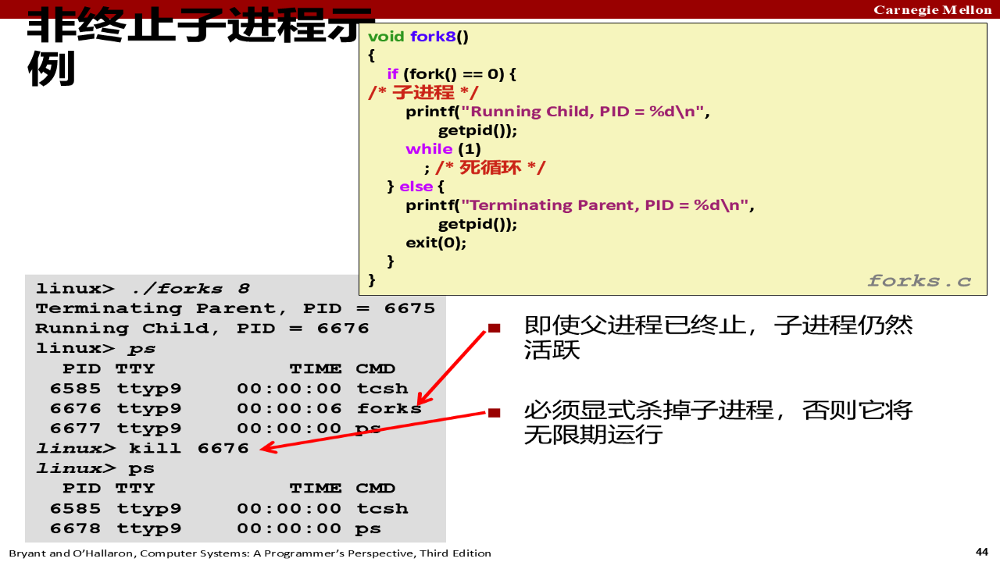

> 非终止子进程：父进程 exit 了，子进程还在死循环里**活跃**——必须显式 kill 掉，否则无限运行。父进程终止不会自动带走子进程。

#### waitpid 函数

```c
#include <sys/types.h>
#include <sys/wait.h>
pid_t waitpid(pid_t pid, int *statusp, int options);
// 返回：成功为子进程 PID；WNOHANG 时为 0；其他错误为 -1
```

默认（options=0）时，waitpid **挂起调用进程**直到等待集合中的一个子进程终止；如果调用时已有子进程终止，立即返回。返回导致返回的已终止子进程 PID，此时该子进程已被回收。

**1. 判定等待集合成员（参数 pid）**：

| pid 值 | 等待集合 |
| --- | --- |
| pid > 0 | 单个子进程，其 PID 等于 pid |
| pid = -1 | 父进程的所有子进程 |

**2. 修改默认行为的选项（options 可或运算组合）**：

| 选项 | 行为 |
| --- | --- |
| WNOHANG | 若没有子进程终止则立即返回 0（非阻塞轮询） |
| WUNTRACED | 直到某个子进程终止**或停止**才返回 |
| WCONTINUED | 直到子进程终止或收到 SIGCONT 重新开始才返回 |

> **课堂补充（录音）：阻塞 vs 非阻塞等待**
>
> 等子进程结束有两种方式：**阻塞式**——父进程啥也不干，一直等着子进程死掉才继续（`wait`）；**非阻塞式**——轮询：等一会儿发现子进程没结束，就先去做别的事，过会儿再来看看（`WNOHANG`）。

**3. 检查退出状态（statusp）**：waitpid 在 status 中放入状态信息，用 wait.h 的宏解释：

| 宏 | 含义 |
| --- | --- |
| WIFEXITED(status) | 子进程通过 exit 或 return 正常终止 → 真 |
| WEXITSTATUS(status) | 返回正常终止子进程的退出状态（仅 WIFEXITED 为真时有效） |
| WIFSIGNALED(status) | 子进程因未被捕获的信号终止 → 真 |
| WTERMSIG(status) | 返回导致终止的信号编号（仅 WIFSIGNALED 为真时有效） |
| WIFSTOPPED(status) | 引起返回的子进程当前是停止的 → 真 |
| WSTOPSIG(status) | 返回导致停止的信号编号（仅 WIFSTOPPED 为真时有效） |
| WIFCONTINUED(status) | 子进程收到 SIGCONT 重新启动 → 真 |
> **status 位布局与宏的实现（怎么取回 100、101 的）**：Linux 把"子进程怎么死的"全部编码进一个 int：
> 低 7 位（0\~6）放**终止信号编号**（正常 exit 退出时为 0）；位 8\~15 放 **exit 的状态码**（低 8 位）；另有 core dump 标志位。
> 宏就是按这个布局实现的：
> `WIFEXITED(status)` = `(status & 0x7f) == 0` —— 低 7 位全 0，说明不是被信号杀死的，是正常 exit；
> `WEXITSTATUS(status)` = `(status >> 8) & 0xff` —— 右移 8 位取出退出码。
> 完整链条：子进程 `exit(100)` → 内核把 100 编码进 status 的位 8\~15 → 父进程 `waitpid(pid[i], &status, 0)` 内核把编码后的 status 写进调用者的变量 → `WIFEXITED` 验证正常退出、`WEXITSTATUS` 右移 8 位取回 100 → printf 打印 "exit status=100"。


**4. 错误条件**：调用进程没有子进程 → 返回 -1 且 errno = ECHILD；被信号中断 → 返回 -1 且 errno = EINTR。

**5. wait 函数**：`wait(int *statusp)` 等价于 `waitpid(-1, &statusp, 0)`。

**6. 使用 waitpid 的示例**（waitpid1.c，不按特定顺序回收 N 个子进程）：

```c
/* waitpid1.c */
#include "csapp.h"
#define N 2
int main() {
    int status, i;
    pid_t pid;
    /* Parent creates N children */
    for (i = 0; i < N; i++)
        if ((pid = Fork()) == 0) /* Child */
            exit(100+i);
    /* Parent reaps N children in no particular order */
    while ((pid = waitpid(-1, &status, 0)) > 0) {
        if (WIFEXITED(status))
            printf("child %d terminated normally with exit status=%d\n",
                   pid, WEXITSTATUS(status));
        else
            printf("child %d terminated abnormally\n", pid);
    }
    /* The only normal termination is if there are no more children */
    if (errno != ECHILD)
        unix_error("waitpid error");
    exit(0);
}
```

```
linux> ./waitpid1
child 22966 terminated normally with exit status=100
child 22967 terminated normally with exit status=101
```

> **非确定性**：回收顺序不确定（这台机器如此，另一台可能相反）。两种结果都对——**绝不可以假设总出现某个结果**，唯一正确的假设是每个可能的结果都可能出现。若要按创建顺序回收，就存下所有 PID 并按序 `waitpid(pid[i], ...)`（waitpid2.c，课件 p48）。

**7. 按创建顺序回收（waitpid2.c，课件 p48）**：

waitpid1 用 `waitpid(-1, ...)` 乱序回收；若想按创建顺序回收，就把每个子进程 PID 存进数组，再逐个 `waitpid(pid[i], ...)`：

```c
/* waitpid2.c */
#include "csapp.h"
#define N 2
int main() {
    int status, i;
    pid_t pid[N];
    /* Parent creates N children */
    for (i = 0; i < N; i++)
        if ((pid[i] = Fork()) == 0) /* Child */
            exit(100+i);
    /* Parent reaps N children in order */
    for (i = 0; i < N; i++) {
        pid_t wpid = waitpid(pid[i], &status, 0);
        if (WIFEXITED(status))
            printf("child %d terminated with exit status %d\n",
                   wpid, WEXITSTATUS(status));
        else
            printf("child %d terminated abnormally\n", wpid);
    }
    exit(0);
}
```

> 拆解 `if ((pid[i] = fork()) == 0) exit(100+i);`：
> ① `pid[i] = fork()` 把 fork 返回值存进数组——父进程拿到子进程 PID（正数），子进程拿到 0；
> ② `== 0` 只在子进程里成立，所以 `exit(100+i)` 只有子进程执行，父进程跳过 if，继续下一次循环 fork 下一个孩子；
> ③ 子进程以退出状态码 `100+i` 立即终止（exit 状态码低 8 位有效，100/101 在 0~255 内）。这个状态码是给父进程"认人"用的：waitpid 后用 `WEXITSTATUS(status)` 取出来，打印 100、101，一眼看出是第几个孩子。


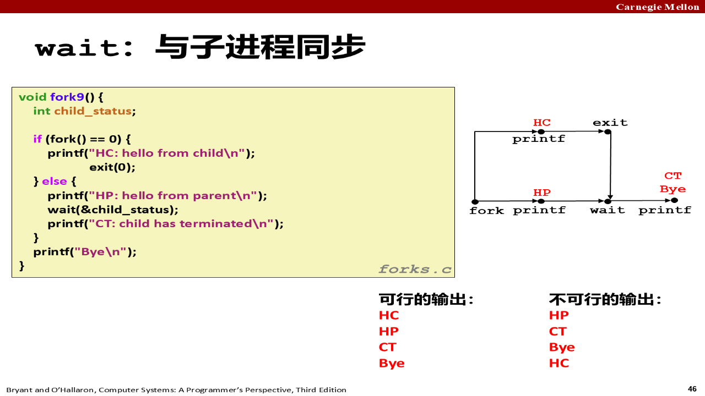

> fork9 示例：
>
> ```c
> void fork9() {
>     int child_status;
>     if (fork() == 0) {
>         printf("HC: hello from child\n");
>         exit(0);
>     } else {
>         printf("HP: hello from parent\n");
>         wait(&child_status);
>         printf("CT: child has terminated\n");
>     }
>     printf("Bye\n");
> }
> ```
>
> 可行的输出：`HC HP CT Bye`、`HP HC CT Bye` 等（**CT 一定在 Bye 之前**，因为 wait 保证子进程先终止）；不可行：`HP CT Bye HC`（HC 是子进程先打印的，CT 在 wait 之后，wait 必须等 HC 所在子进程结束）。

**练习题 8.3**（书页 518）：列出下面程序所有可能的输出序列：

```c
/* waitprob0.c */
int main() {
    if (Fork() == 0) {
        printf("a"); fflush(stdout);
    } else {
        printf("b"); fflush(stdout);
        waitpid(-1, NULL, 0);
    }
    printf("c"); fflush(stdout);
    exit(0);
}
```

> **答案（书页 557）**：可能的序列：`acbc`、`abcc`、`bacc`（对应进程图的拓扑排序）。像 `bcac`、`cbca` 不可能是拓扑排序，不可行。
>
> 关键：父进程打印 b 后 waitpid 等子进程结束；a 在子进程中先于 c；两个 c 谁先不确定（父子并发）。

**练习题 8.4**（书页 520）：

```c
/* waitprob1.c */
int main() {
    int status;
    pid_t pid;
    printf("Hello\n");
    pid = Fork();
    printf("%d\n", !pid);
    if (pid != 0) {
        if (waitpid(-1, &status, 0) > 0) {
            if (WIFEXITED(status) != 0)
                printf("%d\n", WEXITSTATUS(status));
        }
    }
    printf("Bye\n");
    exit(2);
}
```

A. 这个程序会产生多少输出行？B. 这些输出行的一种可能的顺序是什么？

> **答案（书页 557）**：A. **6 行**（数进程图中 printf 顶点的个数）。B. 任何对应拓扑排序的输出都可行，例如：`Hello、1、0、Bye、2、Bye`。
>
> 分析：Hello 先打印；fork 后父子各打印 `!pid`（父进程 !pid=0，子进程 !pid=1）；父进程 wait 等子进程，子进程 exit(2)（WIFEXITED 为真，WEXITSTATUS=2）；父进程打印 2，然后父子各打印 Bye。

### 4.4 让进程休眠（8.4.4）

```c
#include <unistd.h>
unsigned int sleep(unsigned int secs);  // 返回：还要休眠的秒数
int pause(void);                        // 总是返回 -1
```

- `sleep`：挂起进程指定时间；时间到返回 0；若被信号中断而提前返回，返回**剩余秒数**。
- `pause`：休眠直到收到信号。

**练习题 8.5**（书页 521）：编写 sleep 的包装函数 snooze，打印实际休眠时长：

```c
/* snooze.c */
unsigned int snooze(unsigned int secs) {
    unsigned int rc = sleep(secs);
    printf("Slept for %d of %d secs.\n", secs-rc, secs);
    return rc;
}
```

### 4.5 加载并运行程序（8.4.5）—— execve

```c
#include <unistd.h>
int execve(const char *filename, const char *argv[], const char *envp[]);
// 如果成功，则不返回；如果错误，则返回 -1
```

- 在当前进程的上下文中**加载并运行**可执行目标文件 filename，带参数列表 argv 和环境变量列表 envp。
- 只有出错（如找不到 filename）才返回调用程序。**调用一次，从不返回**（与 fork 调用一次返回两次相反）。

> **execve 覆盖代码、数据和栈**；**保留 PID、已打开文件和信号上下文**；可以运行可执行目标文件，或以 `#!解释器` 开头的脚本文件（如 `#!/bin/bash`）。

- **argv**：指向以 null 结尾的指针数组，每个指针指向一个参数字符串；惯例 `argv[0]` 是可执行文件名。
- **envp**：指向以 null 结尾的指针数组，每个指针指向一个 `"name=value"` 形式的环境变量字符串。
- execve 加载后调用**启动代码**（7.9 节），设置栈并把控制传给新程序 main：

```c
int main(int argc, char **argv, char **envp);
// 等价
int main(int argc, char *argv[], char *envp[]);
```

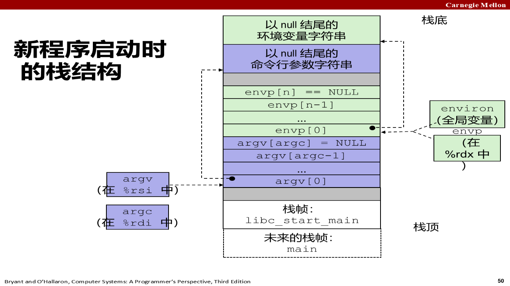

新程序开始时用户栈布局（栈底高地址 → 栈顶低地址）：环境变量字符串 → 命令行参数字符串 → envp[] 数组（envp[0] 由全局变量 environ 指向）→ argv[] 数组 → libc_start_main 栈帧 → main 的未来栈帧。argc 在 %rdi、argv 在 %rsi、envp 在 %rdx。
**启动栈 vs 运行时过程栈帧（对比）**：

这张图里的"栈"是 **main 还没开始执行时的初始布局**，和程序运行中每次函数调用动态建立的**过程栈帧（调用栈）**是两回事。对比：

| 维度 | 启动栈（初始栈） | 过程栈帧（调用栈） |
| --- | --- | --- |
| 时机 | 程序**出生时**，main 执行前，一次性布置好 | 程序**运行中**，每次函数调用动态建立/销毁 |
| 谁布置 | execve 的内核 + `__libc_start_main` 之前的启动代码 | 程序自己的指令（`addi sp,sp,-N` / `sd ra` / `jr ra` 等） |
| 内容 | 命令行/环境**字符串本体** + argv[]/envp[] 指针数组 + argc | 返回地址（ra）、保存的寄存器（s0/FP）、局部变量、溢出的参数 |
| 生命周期 | 一份，几乎不变，字符串常驻高地址直到程序结束 | 每调用一次建一个，嵌套多层，动态增删 |
| 入口 | argc/argv/envp 通过寄存器传给 main（x86-64：%rdi/%rsi/%rdx） | 栈指针 sp 指向当前帧，FP/s0 是锚点 |
| 本质 | "启动数据"的摆放 | "函数执行上下文"的记录 |

> **联系**：main 本身也是被 `__libc_start_main` 调用的一个普通函数，所以图里"libc_start_main 栈帧 → main 的未来栈帧"正是过程调用链的起点——启动布局和过程栈在 main 处接轨，之后栈就完全由函数调用规则接管。

**复习：RISC-V 过程栈帧（详见第 3 章笔记"三、栈帧详解"）**：

> - 栈**向低地址生长**，`sp` 始终指向栈顶；帧内从高到低：旧帧、返回地址 ra、保存的 s0（FP）、局部变量、溢出的参数。
> - **序言（prologue）**：`addi sp, sp, -N` 开帧 → `sd ra, 24(sp)` / `sd s0, 16(sp)` 保存 → `addi s0, sp, N` 定帧（FP 固定，便于寻址）。
> - **尾声（epilogue）**：恢复 s0、ra → `addi sp, sp, N` 收帧 → `jr ra` 返回。
> - FP 是固定锚点、SP 是动态指针；每个函数调用对应一个栈帧，调用结束帧即销毁（局部变量随之失效）。C++ 与 C 的栈帧机制相同，额外内容（析构、异常处理的栈展开等）由编译器在此基础上添加。

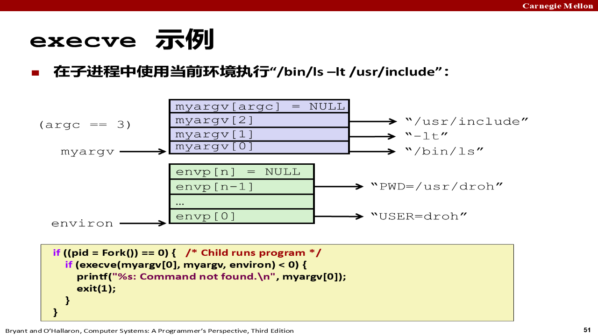

```c
/* 在子进程中使用当前环境执行 "/bin/ls -lt /usr/include" */
if ((pid = Fork()) == 0) { /* Child runs program */
    if (execve(myargv[0], myargv, environ) < 0) {
        printf("%s: Command not found.\n", myargv[0]);
        exit(1);
    }
}
```

**操作环境数组的函数**：

```c
#include <stdlib.h>
char *getenv(const char *name);   // 返回指向 name=value 中 value 的指针，找不到返回 NULL
int setenv(const char *name, const char *newvalue, int overwrite);  // 成功 0，错误 -1
void unsetenv(const char *name);  // 无返回
```

> **程序 vs 进程（书中旁注，重要）**
>
> - **程序**：一堆代码和数据，可作为目标文件存在于磁盘，或作为段存在于地址空间。
> - **进程**：执行中程序的一个具体实例，总是运行在某个进程的上下文中。
> - `fork`：在新的子进程中**运行相同的程序**（复制品）。
> - `execve`：在当前进程的上下文中**加载并运行新的程序**——**覆盖当前进程的地址空间，但不创建新进程**；新程序仍然有相同的 PID，并继承调用 execve 时已打开的所有文件描述符。

> **课堂补充（录音）：execve 是"变身"**
>
> execve 很烧脑：**调用一次，从不返回**——它把当前进程的代码、数据、栈全部覆盖成新程序，从此这个进程就"变成"新程序了（PID 不变、打开的文件不变）。所以 execve 必须配合 fork 用：先 fork 一个子进程，在子进程里 execve 新程序，父进程继续干自己的事。如果在主进程里直接 execve，自己的程序就被"吹走了"。

**练习题 8.6**（书页 523）：编写 myecho 程序，打印命令行参数和环境变量：

```c
/* myecho.c */
#include "csapp.h"
int main(int argc, char *argv[], char *envp[]) {
    int i;
    printf("Command-line arguments:\n");
    for (i=0; argv[i] != NULL; i++)
        printf(" argv[%2d]: %s\n", i, argv[i]);
    printf("\n");
    printf("Environment variables:\n");
    for (i=0; envp[i] != NULL; i++)
        printf(" envp[%2d]: %s\n", i, envp[i]);
    exit(0);
}
```

```
linux> ./myecho arg1 arg2
Command-line arguments:
  argv[ 0]: myecho
  argv[ 1]: arg1
  argv[ 2]: arg2
Environment variables:
  envp[ 0]: PWD=/usr0/droh/ics/code/ecf
  envp[ 1]: TERM=emacs
  ...
```

> **课堂补充（录音）：exec 系列变体（v/l/e/p）**
>
> 手册里除了 `execve`，还有几个"变体"：`execl`、`execv`、`execle`、`execvp` 等。名字里的字母是**口诀**：
>
> | 字母 | 含义 |
> | --- | --- |
> | l（list） | 参数用**列表**方式逐个给出（`execl(path, arg0, arg1, ..., NULL)`） |
> | v（vector） | 参数用**数组**方式给出（`execv(path, argv[])`） |
> | e（environment） | 可以**自己传环境变量数组**（`execve(path, argv, envp)`） |
> | p（path） | 在 **PATH 环境变量**里搜索可执行文件（`execvp("ls", args)` 不用写全路径） |
>
> 它们底层**都是包装 execve** 这一个真正的系统调用，只是把参数形式变来变去。理解层面记住：**真正干活的是 execve**，其余是方便书写的包装。
>
> **PATH 环境变量（录音）**：你敲 `gcc`、`python` 不用写全路径，是因为 shell（或 execvp）沿着 **PATH** 里列出的目录**逐个找**可执行文件。`echo `PATH` 可以查看（冒号分隔的一串目录）；编译器、conda 等工具切换版本，本质就是改 PATH 里先找哪个目录——先出现的先命中。

### 4.6 利用 fork 和 execve 运行程序（8.4.6）—— 简单 shell

像 Unix shell 和 Web 服务器这样的程序大量使用 fork 和 execve。

**shell 的工作流程**（读/求值循环）：

```
while (1) {
    printf("> ");                  /* Read：打印提示符 */
    Fgets(cmdline, MAXLINE, stdin);/* 读取命令行 */
    if (feof(stdin)) exit(0);
    eval(cmdline);                 /* Evaluate：解析并运行程序 */
}
```

**eval 的求值逻辑**（shellex.c）：

```c
void eval(char *cmdline) {
    char *argv[MAXARGS];
    char buf[MAXLINE];
    int bg;
    pid_t pid;

    strcpy(buf, cmdline);
    bg = parseline(buf, argv);          /* 解析命令行，构造 argv */
    if (argv[0] == NULL)
        return;                          /* 忽略空行 */

    if (!builtin_command(argv)) {        /* 不是内置命令 */
        if ((pid = Fork()) == 0) {       /* 子进程运行用户作业 */
            if (execve(argv[0], argv, environ) < 0) {
                printf("%s: Command not found.\n", argv[0]);
                exit(0);
            }
        }
        /* 父进程等待前台作业终止 */
        if (!bg) {
            int status;
            if (waitpid(pid, &status, 0) < 0)
                unix_error("waitfg: waitpid error");
        }
        else
            printf("%d %s", pid, cmdline);  /* 后台作业：打印 PID 继续 */
    }
    return;
}
```

- `parseline` 解析以空格分隔的参数并构造 argv；若最后参数是 `&` 返回 1（**后台执行**，shell 不等它完成），否则返回 0（**前台执行**，shell 等它完成）。
- `builtin_command` 检查第一个参数是否内置命令（本 shell 只有 quit；真实 shell 还有 pwd、jobs、fg 等）。
- 不是内置命令 → fork 子进程 → 子进程 execve 运行程序 → 父进程等待（前台）或打印 PID（后台）。

> **注意**：这个简单 shell 有缺陷——**不回收后台子进程**（修改需要信号，见下一节）。

> **课堂补充（录音）：服务器 + fork 的经典模式**
>
> 父进程（接收者）只管接收任务，fork 一个子进程去处理这个任务，自己继续接收下一个——**接收和处理分离**，服务器才能同时服务多个客户端。这也呼应了前面说的"重量级进程"和后面要讲的"轻量级线程"。

***

## 5. 信号与非本地跳转预告（8.5–8.6）

> 本讲课件和课堂只覆盖到 8.4（进程控制）。8.5 信号、8.6 非本地跳转已写成独立笔记 **《第8章_异常控制流_信号与进程组_Signals.md》**（第 15 讲课件 + 课堂录音《进程与线程及信号相关讲解》），这里保留原预告供衔接。
>
> 直接跳转：[[第8章_异常控制流_信号与进程组_Signals]]

- **信号（signal）**：一条小消息，通知进程系统中发生了某种类型的事件（更高层的软件 ECF）。内核为每个进程维护待处理信号集合。除零 → SIGFPE(8)；非法指令 → SIGILL(4)；非法内存引用 → SIGSEGV(11)；Ctrl-C → SIGINT(2)；强制终止 → SIGKILL(9，不可捕获/忽略)；子进程终止 → SIGCHLD(17)。
- **非本地跳转（nonlocal jump）**：C 语言通过 `setjmp` / `longjmp` 提供的应用层 ECF，违反通常调用/返回栈规则，从一个函数直接跳到另一个函数（C++/Java 软件异常的实现基础）。

***

## 6. 本节重点

> **本节重点**：
> - **ECF 定义**：响应系统状态变化而发生的控制流突变，遍布硬件层（异常）→ OS 层（上下文切换）→ 应用层（信号、非本地跳转）。
> - **四类异常**：中断（异步、I/O、返回下一条）、陷阱（同步、有意、系统调用、返回下一条）、故障（同步、可修复则重执当前指令，如缺页）、终止（同步、不可恢复、不返回）。
> - **异常表**：异常号 → 索引 → 异常处理程序地址；用户态→内核态的唯一通道是异常（系统调用即陷阱）。
> - **进程两抽象**：逻辑控制流（独占 CPU 假象，靠上下文切换）+ 私有地址空间（独占内存假象，靠虚拟内存）。
> - **并发 vs 并行**：时间上重叠即并发（与核数无关）；并行是并发且跑在不同核/机上。
> - **fork**：调用一次返回两次（父得子 PID、子得 0），地址空间相同但独立，共享打开文件；**绝不能假设父子执行顺序**。
> - **僵尸进程**：终止未回收的子进程，消耗资源，必须由父进程 wait/waitpid 回收；父进程死了由 init 收尸。
> - **waitpid**：pid 决定等待集合（>0 单个 / -1 全部），options 有 WNOHANG/WUNTRACED/WCONTINUED，退出状态用 WIFEXITED/WEXITSTATUS 等宏解析。
> - **execve**：调用一次从不返回，覆盖地址空间但不创建新进程（PID 不变）；与 fork 配合使用。
> - **常见坑**：① fork 后代码父子都执行，靠返回值区分；② 写 `printf` 后记得 `fflush`（否则输出可能在 fork 时被复制）；③ 静态库/命令行顺序陷阱已在第 7 章；④ 回收子进程的顺序不确定，不要假设；⑤ 用户态不能直接访问内核，只能走系统调用。

***

## 附：本笔记涉及的命令速查

| 命令 / 函数 | 作用 |
| --- | --- |
| `ps` | 列出当前系统中的进程（含僵死进程 `<defunct>`） |
| `top` | 打印进程资源使用信息 |
| `pmap` | 显示进程的内存映射 |
| `cat /proc/loadavg` | 查看系统平均负载（/proc 虚拟文件系统） |
| `strace` | 打印程序及其子进程的每个系统调用轨迹 |
| `getpid()` / `getppid()` | 获取自己 / 父进程 PID |
| `fork()` | 创建子进程（一次调用两次返回） |
| `exit(status)` | 以退出状态终止进程 |
| `wait(&status)` | 等价于 `waitpid(-1, &status, 0)` |
| `waitpid(pid, &status, options)` | 等待指定子进程终止/停止 |
| `sleep(secs)` / `pause()` | 休眠指定秒数 / 直到收到信号 |
| `execve(filename, argv, envp)` | 在当前进程加载并运行新程序（不返回） |
| `getenv` / `setenv` / `unsetenv` | 操作环境数组 |
