# 第八章 异常控制流（ECF）与进程

> 依据：CMU 15-213 第 14 讲课件《14-ecf-procs.pptx》（中译版）＋《深入理解计算机系统》原书第 3 版第八章（中文版）＋课堂录音（《编程库相关知识讲解》后半部分）。
> 环境假设：Linux x86-64 系统。
> 结构说明：本节严格按教材章节（8.1 异常 → 8.2 进程 → 8.3 系统调用错误处理 → 8.4 进程控制）＋课件页序组织；练习题紧跟对应知识点并附答案；课堂录音的讲解融入正文（标注 🎙️）；教材之外的必要深挖统一放在每节末尾的「拓展」里，不打断主线。

---

## 目录

- [0. 什么是异常控制流（ECF）？](#0-什么是异常控制流ecf)
- [1. 异常（8.1）](#1-异常81)
  - [1.1 异常的处理机制](#11-异常的处理机制)
  - [1.2 异常的类别](#12-异常的类别)
  - [1.3 陷阱与系统调用](#13-陷阱与系统调用)
  - [1.4 Linux/x86-64 系统中的异常](#14-linuxx86-64-系统中的异常)
- [2. 进程（8.2）](#2-进程82)
  - [2.1 进程的两个关键抽象](#21-进程的两个关键抽象)
  - [2.2 逻辑控制流](#22-逻辑控制流)
  - [2.3 并发流](#23-并发流)
  - [2.4 私有地址空间](#24-私有地址空间)
  - [2.5 用户模式和内核模式](#25-用户模式和内核模式)
  - [2.6 上下文切换](#26-上下文切换)
- [3. 系统调用错误处理（8.3）](#3-系统调用错误处理83)
- [4. 进程控制（8.4）](#4-进程控制84)
  - [4.1 获取进程 ID](#41-获取进程-id)
  - [4.2 创建和终止进程](#42-创建和终止进程)
  - [4.3 回收子进程](#43-回收子进程)
  - [4.4 让进程休眠](#44-让进程休眠)
  - [4.5 加载并运行程序：execve](#45-加载并运行程序execve)
  - [4.6 利用 fork 和 execve 运行程序](#46-利用-fork-和-execve-运行程序)
- [5. 信号与非本地跳转预告（8.5–8.6）](#5-信号与非本地跳转预告85-86)
- [6. 本节重点](#6-本节重点)
- [附：本笔记涉及的命令速查](#附本笔记涉及的命令速查)

---

## 0. 什么是异常控制流（ECF）？

从给处理器加电开始，直到断电，**程序计数器（PC）假设一个值的序列**

$$a_0, a_1, \cdots, a_{n-1}$$

其中每个 $a_k$ 是某个相应指令 $I_k$ 的地址。每次从 $a_k$ 到 $a_{k+1}$ 的过渡称为**控制转移（control transfer）**，这样的转移序列叫做处理器的**控制流（control flow）**。

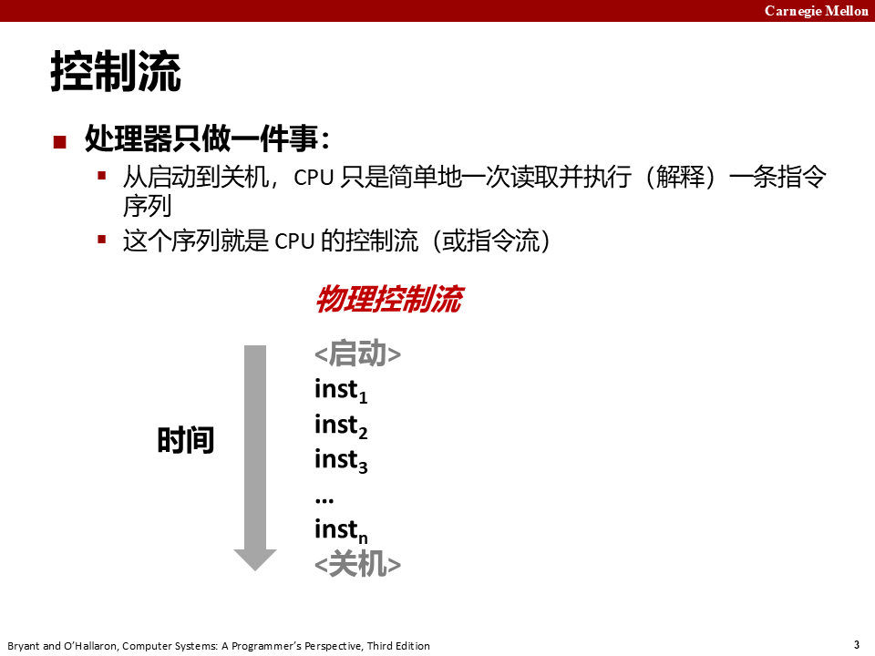

> 🎙️ **录音（直观理解）**：控制流就是你写的代码按顺序一条一条往下执行。想让它跳转，就用分支、跳转、调用、返回这些**正常**机制——这些是**程序自己写代码控制的**。但系统里还经常发生一些**代码没写、也不归程序管**的事，比如除零、数据从磁盘到了、按了 Ctrl-C，这些就会让控制流"不正常地"拐弯——这就是**异常控制流（Exceptional Control Flow, ECF）**。

**正常控制流**（程序自己控制的）：跳转、调用、返回，响应的是**程序变量表示的程序状态变化**。

**ECF（异常控制流）**：响应的是**系统状态的变化**——硬件定时器定期产生信号、网络包到达网卡、程序向磁盘请求数据后休眠等待、子进程终止要通知父进程……现代系统通过让控制流"突变"来响应这些情况。

**ECF 发生在计算机系统的各个层次**：

| 层次 | ECF 形式 | 实现者 |
| --- | --- | --- |
| 硬件层 | 异常（中断、陷阱、故障、终止） | 硬件 + OS |
| 操作系统层 | 进程上下文切换 | 内核 |
| 应用层（OS 接口） | 信号（signal） | OS 软件 |
| 应用层（最高） | 非本地跳转（setjmp/longjmp） | C 运行库 |

> **为什么程序员要理解 ECF（书中 5 条）**
>
> 1. 理解 ECF → 理解操作系统实现 I/O、进程、虚拟内存的**基本机制**。
> 2. 理解 ECF → 理解应用程序如何与 OS 交互（**系统调用 / 陷阱**是应用请求服务的唯一入口）。
> 3. 理解 ECF → 能写有趣的新程序（Unix shell、Web 服务器）。
> 4. 理解 ECF → 理解**并发**（中断、进程/线程、信号处理程序都是并发的例子）。
> 5. 理解 ECF → 理解软件异常（C++/Java 的 try/throw/catch 底层靠 C 的 setjmp/longjmp 这类非本地跳转实现）。

---

## 1. 异常（8.1）

**异常（exception）**：控制流中的突变，用来**响应处理器状态中的某些变化**。一部分由硬件实现，一部分由操作系统实现。

**事件（event）**：处理器状态被编码为不同的位和信号，状态变化即"事件"。

- 与当前指令直接相关：虚拟内存缺页、算术溢出、除零。
- 与当前指令无关：定时器信号、I/O 请求完成。

处理器检测到事件后，通过一张**异常表（exception table）** 做间接过程调用，跳到一个专门的处理函数——**异常处理程序（exception handler）**。

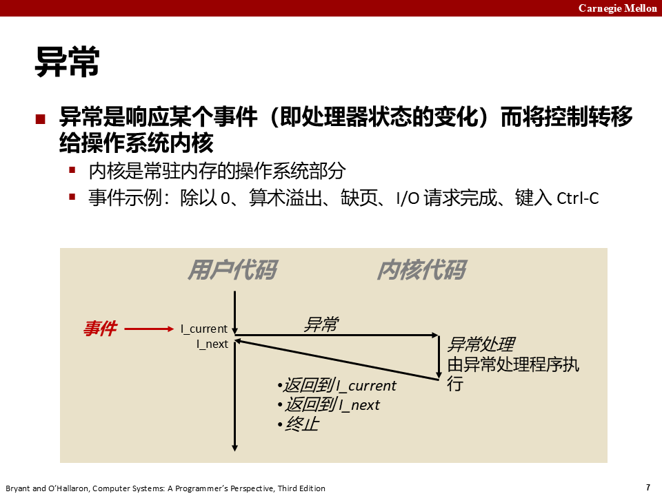

**处理程序完成后三种返回情况**：

1. 返回给当前指令 $I_{curr}$（事件发生时正在执行的指令）。
2. 返回给 $I_{next}$（没有异常时会执行的下一条指令）。
3. 终止被中断的程序。

> 🎙️ **录音（课堂补充）：异常 = 应急预案**
>
> 老师打的比方：异常表就像**应急预案手册**。飞机上玻璃突然碎了，机组人员不慌，翻手册看"玻璃破碎"该干什么，照着做就行。异常也一样——**你不需要在代码里处理除零**，操作系统根据异常号查表，自动跳到对应的处理程序去处理。

> **旁注：术语**
>
> C++/Java 的"异常"（try/catch/throw）是**软件异常**（应用级）；本章的"异常"主要指**硬件/系统异常**。本书用"异常"做通用词，需要区分时才说"异步异常（中断）"和"同步异常（陷阱、故障、终止）"。

### 1.1 异常的处理机制

- 每种异常类型有**唯一的非负整数异常号（exception number）**。部分由处理器设计者分配（除零、缺页、内存访问违例、断点、溢出），部分由 OS 内核设计者分配（系统调用、外部 I/O 信号）。
- 系统启动时，OS 分配并初始化**异常表**，使表目 $k$ 包含异常 $k$ 的处理程序地址。
- 运行时：处理器检测事件 → 确定异常号 $k$ → 通过异常表表目 $k$ 间接过程调用 → 进入处理程序。

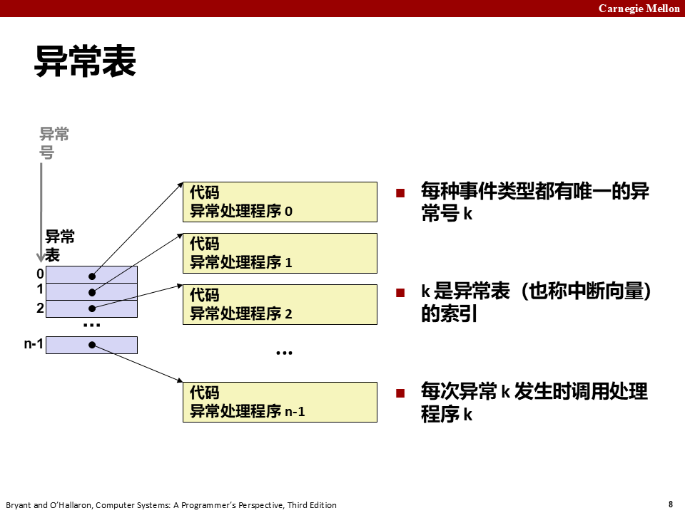

异常表基址存放在 CPU 的**异常表基址寄存器**里，异常号就是到异常表的索引。

**异常调用 vs 普通过程调用的 4 个区别**：

| | 普通过程调用 | 异常 |
| --- | --- | --- |
| 返回地址 | 下一条指令 | 当前指令 $I_{curr}$ 或下一条指令 $I_{next}$（看异常类型） |
| 压栈内容 | 返回地址 | 返回地址 + 额外处理器状态（如 x86-64 的 EFLAGS 条件码寄存器） |
| 栈 | 用户栈 | 若从用户程序转到内核，压到**内核栈** |
| 运行模式 | 用户模式 | **内核模式**（对全部系统资源有完全访问权） |

处理完事件后，处理程序执行一条特殊的"从中断返回"指令，恢复状态并返回被中断的程序。

### 1.2 异常的类别

四类异常：**中断（interrupt）、陷阱（trap）、故障（fault）、终止（abort）**。

| 类别 | 原因 | 异步/同步 | 返回行为 |
| --- | --- | --- | --- |
| 中断 | 来自 I/O 设备的信号 | 异步 | 总是返回到下一条指令 |
| 陷阱 | 有意的异常 | 同步 | 总是返回到下一条指令 |
| 故障 | 潜在可恢复的错误 | 同步 | 可能返回到当前指令 |
| 终止 | 不可恢复的错误 | 同步 | 不会返回 |

> 异步异常 = 处理器**外部** I/O 设备事件产生；同步异常 = 执行**当前指令**的直接产物（这条指令叫**故障指令 faulting instruction**）。

#### 1. 中断（interrupt）

异步发生，来自处理器外部的 I/O 设备信号。处理程序常叫**中断处理程序（interrupt handler）**。

流程：I/O 设备（网卡、磁盘控制器、定时器芯片）向处理器芯片引脚发信号，并把异常号放到系统总线上 → 当前指令完成后，处理器注意到中断引脚电压变高 → 从总线读取异常号 → 调用中断处理程序 → 返回下一条指令（程序继续，好像没发生过中断）。

> 🎙️ **录音（课堂补充）：异步 = "它主动通知你"**
>
> 老师打比方：上课时你只管听课，**食堂开门了会有人通知你**（中断）；手机上设个**定时器**，时间到了它自己响铃，你不用一直盯着看。数据从网络来了、磁盘数据到了，都是"设备主动通知你"——这就是**异步**。中断就是典型的异步异常。

#### 2. 陷阱和系统调用（trap & syscall）

陷阱是**有意的**异常，是执行指令的直接产物。最重要的用途是**系统调用（system call）**：用户程序请求内核服务。

- 用户程序执行 `syscall` 指令 → 触发到异常处理程序的陷阱 → 处理程序解析参数、调用适当的内核程序。
- x86-64 上，**所有系统调用参数通过通用寄存器传递，不通过栈**：`%rax` 放系统调用号，`%rdi/%rsi/%rdx/%r10/%r8/%r9` 放最多 6 个参数；返回值在 `%rax`（-4095 到 -1 的负值表示错误，对应负的 errno）。

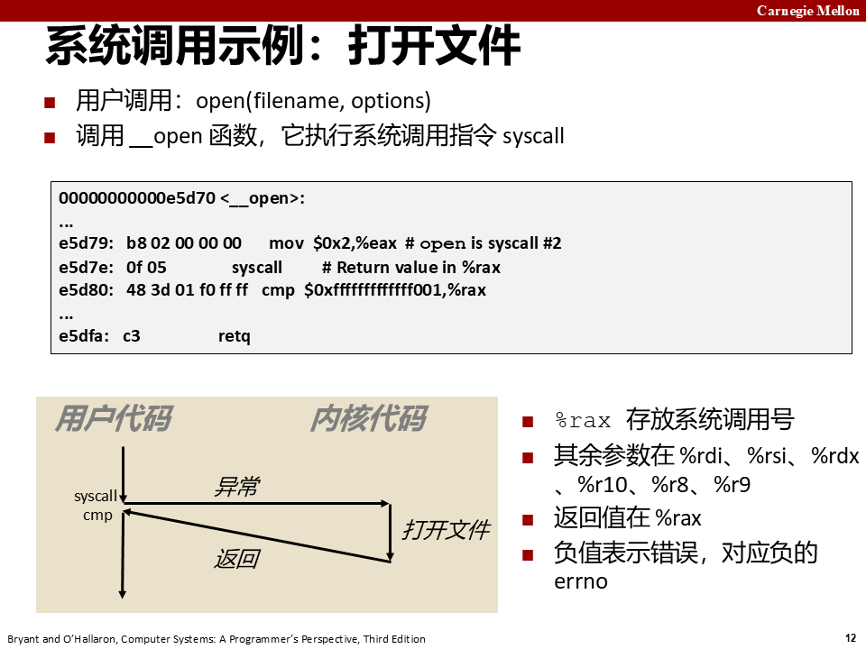

> 🎙️ **录音（直观理解）**
>
> 你写 C 程序时感觉有些功能**实现不了**——比如操作显示器、访问硬盘。因为你在**用户态**，权限不够。这时必须通过**系统调用**跳到**内核态**（系统模式），内核把所有硬件都管着，替你完成操作再回来。所以系统调用是"用户模式 ↔ 内核模式"切换的通道。

**常用 Linux 系统调用**（x86-64，部分）：

| 编号 | 名字 | 描述 |
| --- | --- | --- |
| 0 | read | 读文件 |
| 1 | write | 写文件 |
| 2 | open | 打开文件 |
| 3 | close | 关闭文件 |
| 4 | stat | 获得文件信息 |
| 9 | mmap | 将内存页映射到文件 |
| 12 | brk | 重置堆顶 |
| 32 | dup2 | 复制文件描述符 |
| 33 | pause | 挂起进程直到信号到达 |
| 37 | alarm | 调度告警信号传送 |
| 39 | getpid | 获得进程 ID |
| 57 | fork | 创建进程 |
| 59 | execve | 执行一个程序 |
| 60 | _exit | 终止进程 |
| 61 | wait4 | 等待一个进程终止 |
| 62 | kill | 发送信号到一个进程 |

> 🎙️ **录音（课堂补充）：`_exit` 和 `exit` 的区别**
>
> 带下划线的 `_exit` 是**系统调用**；不带下划线的 `exit` 是**库函数**（包装函数）。kill 也**不是"杀死"**——它是"发送一个信号"，比如发 9 号信号（SIGKILL）才一定会终止进程，别的信号可能只是通知。

`hello` 程序的两种写法：

```c
// 用系统级函数 write（不是 printf）
int main() {
    write(1, "hello, world\n", 13);
    _exit(0);
}
```

```asm
# 直接使用 syscall 指令（hello-asm64.s）
.section .data
string:
    .ascii "hello, world\n"
string_end:
    .equ len, string_end - string
.section .text
.globl main
main:
    # First, call write(1, "hello, world\n", 13)
    movq $1, %rax      # write is system call 1
    movq $1, %rdi      # Arg1: stdout has descriptor 1
    movq $string, %rsi # Arg2: hello world string
    movq $len, %rdx    # Arg3: string length
    syscall            # Make the system call
    # Next, call _exit(0)
    movq $60, %rax     # _exit is system call 60
    movq $0, %rdi      # Arg1: exit status is 0
    syscall            # Make the system call
```

> 从程序员角度看系统调用和普通函数调用一样，但实现完全不同：普通函数在**用户模式**运行（指令受限、只能访问自己的栈）；系统调用在**内核模式**运行（可执行特权指令、访问内核栈）。

#### 3. 故障（fault）

由**错误情况**引起，可能被处理程序修正：

- 能修正 → 控制返回**引起故障的指令**，重新执行它。
- 不能修正 → 返回到内核中的 `abort` 例程，终止应用程序。

**经典示例：缺页异常（page fault）**——指令引用一个虚拟地址，而对应物理页面不在内存中，需从磁盘取出。缺页处理程序从磁盘加载页面，返回给引起故障的指令；指令再次执行时页面已在内存，可正常完成。

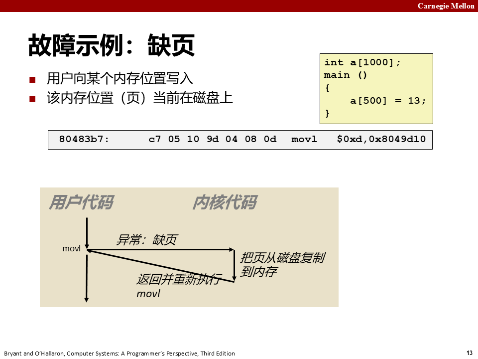

> 🎙️ **录音（课堂补充）：缺页是可以修复的异常**
>
> 你访问内存时，数据不在内存里（在硬盘上），进程被**挂起**，操作系统去硬盘把这一页加载进内存，然后**重新执行刚才那条指令**，程序继续往下走——只是浪费了一点时间。所以缺页是"可以修复"的异常。

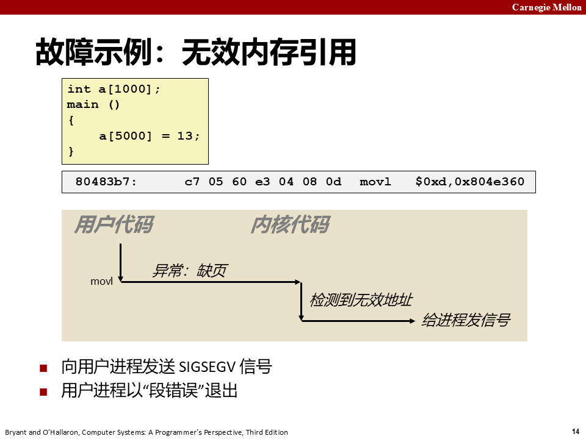

> 无效内存引用（如 `a[5000]` 而数组只有 1000 个元素）：内核检测到无效地址 → 给进程发 **SIGSEGV** 信号 → 用户进程以"段错误（Segmentation fault）"退出。

#### 4. 终止（abort）

不可恢复的致命错误（通常硬件错误，如 DRAM/SRAM 位损坏的奇偶错误）。终止处理程序**从不返回**控制给应用程序，直接转给 `abort` 例程终止程序。

### 1.4 Linux/x86-64 系统中的异常

x86-64 有高达 256 种异常类型：**0~31 由 Intel 架构师定义**（对任何 x86-64 系统都一样），**32~255 对应操作系统定义的中断和陷阱**。

| 异常号 | 描述 | 异常类别 |
| --- | --- | --- |
| 0 | 除法错误 | 故障 |
| 13 | 一般保护故障 | 故障 |
| 14 | 缺页 | 故障 |
| 18 | 机器检查 | 终止 |
| 32~255 | 操作系统定义的异常 | 中断或陷阱 |

**各类异常的 Linux 行为**：

- **除法错误（0）**：试图除零或除法结果对目标操作数太大。Unix 不尝试恢复，直接终止程序；shell 常报告为"浮点异常（Floating exception）"。
- **一般保护故障（13）**：通常因引用未定义的虚拟内存区域，或试图写只读文本段。Linux 不恢复；shell 常报告为"段故障（Segmentation fault）"。
- **缺页（14）**：可恢复，处理程序把磁盘页面映射到物理内存后重新执行故障指令（第 9 章详讲）。
- **机器检查（18）**：指令执行中检测到致命硬件错误，处理程序从不返回。

> 🎙️ **录音（课堂补充）：同步 = 要你去等它**
>
> 同步异常需要**等待**：陷阱（如系统调用、断点）是你主动执行的；故障（缺页可修、除零不可修）；终止是最严重的（非法指令、奇偶校验错、机器检查），直接杀掉进程——因为数据已经不可信了，继续执行只会错上加错。
---

## 2. 进程（8.2）

**进程（process）**：一个**执行中程序的实例**（classic definition）。计算机科学中最深刻、最成功的概念之一。

**程序 ≠ 进程**：

| | 程序 | 进程 |
| --- | --- | --- |
| 本质 | 一堆代码和数据（静态） | 执行中程序的一个实例（动态） |
| 存在形式 | 磁盘上的目标文件 / 地址空间中的段 | 运行在某个进程的上下文中 |
| 例子 | 安装的 QQ | 运行起来的那个 QQ |

> 🎙️ **录音（课堂补充）**
>
> 程序是硬盘上的文件（比如 QQ 安装好后就是一堆程序）；**启动一次、跑起来的那一个就叫进程**。以前 QQ 可以多开——同一份程序，同时跑好几个进程。有的程序跑一下就结束了，有的（比如服务器、QQ 挂机）**永远不结束**，里面往往有个 `while(1);` 死循环。所以进程是"程序运行一次"这个**动态**的东西。

### 2.1 进程的两个关键抽象

进程为每个程序提供两个关键抽象：

1. **独立的逻辑控制流**：假象——程序独占地使用处理器。
2. **私有的地址空间**：假象——程序独占地使用内存系统。

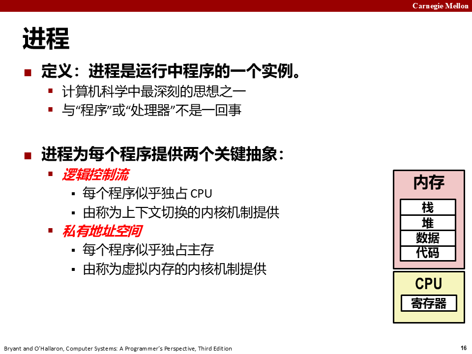

每次用户向 shell 输入一个可执行目标文件的名字，shell 就创建一个新进程，在新进程的上下文中运行这个文件。

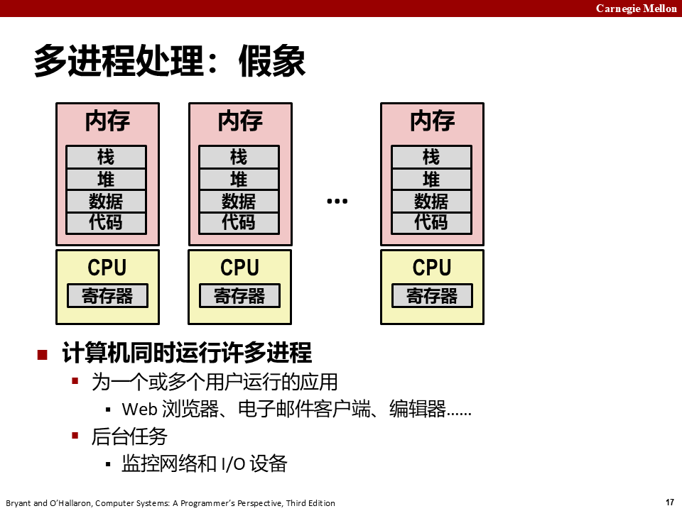

> 计算机同时运行许多进程：面向用户的（浏览器、邮件客户端、编辑器）+ 后台任务（监控网络和 I/O 设备）。

### 2.2 逻辑控制流

用调试器单步执行程序，会看到一系列 PC 值，唯一对应可执行目标文件中的指令（或动态链接共享对象中的指令）。这个 PC 值序列叫**逻辑控制流（logical control flow）**，简称逻辑流。

多个进程轮流使用处理器：每个进程执行一段，然后被**抢占（preempted）**（暂时挂起），轮到其他进程。物理控制流被分成多个逻辑流。

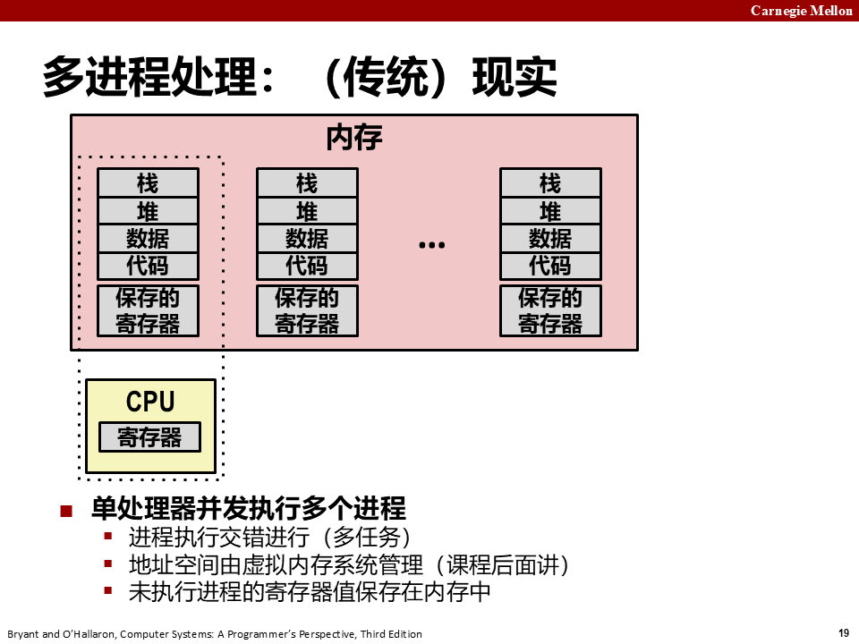

> 🎙️ **录音（课堂补充）：为什么 CPU 上有很多进程？**
>
> 你的电脑同时跑着浏览器、音乐、各种后台服务。单核时代 CPU 也是"模拟"同时跑——微观上同一时刻只有一个进程在 CPU 上执行，宏观上大家"看起来"都在跑。Linux/Unix 天生就是**多用户多任务**设计（当年 IBM 招标，微软赶工买了别人的系统改个名；Unix 前身 Multics 因为设计太完美实现不了，后来简化出了 Unix，这些历史故事说明了多任务从设计之初就是核心）。

### 2.3 并发流

一个逻辑流的执行在时间上与另一个流**重叠**，称为**并发流（concurrent flow）**。

> 流 X 和 Y 互相并发 ⟺ X 在 Y 开始之后、结束之前开始，**或** Y 在 X 开始之后、结束之前开始。

- 多个流并发执行的一般现象 = **并发（concurrency）**。
- 一个进程和其他进程轮流运行 = **多任务（multitasking）**。
- 一个进程执行它控制流的一部分的每一段时间 = **时间片（time slice）**。多任务也叫**时间分片（time slicing）**。
- **并行流（parallel flow）**是并发流的真子集：两个流并发地运行在**不同的处理器核或计算机**上才叫并行。

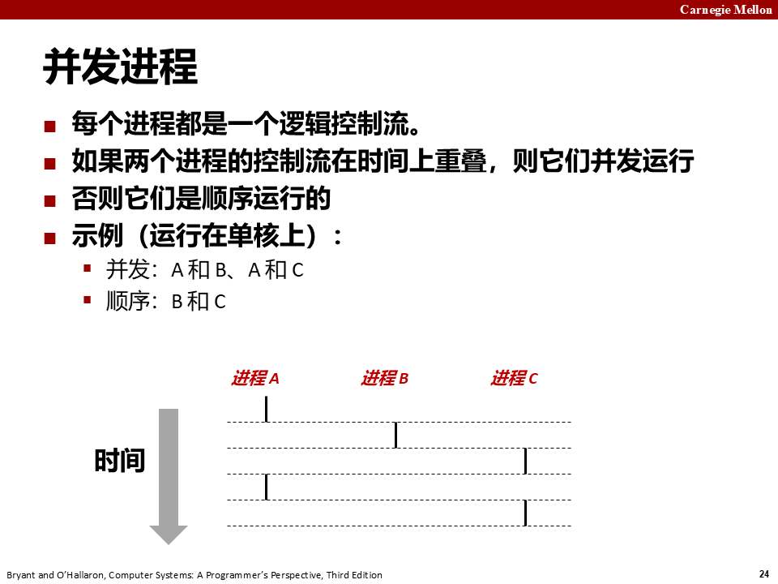

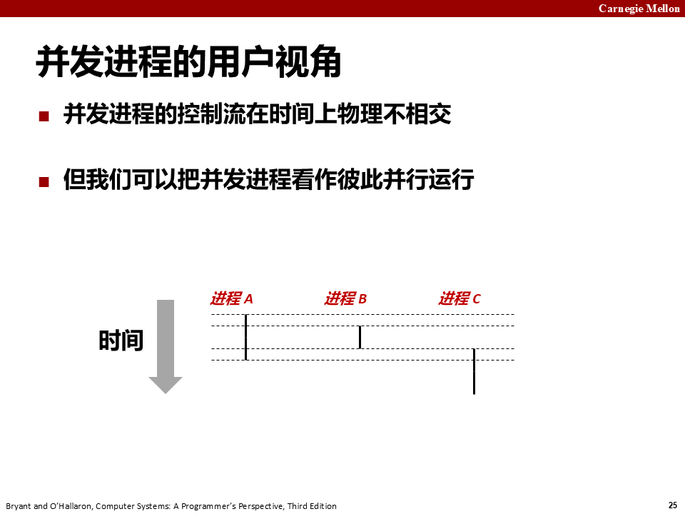

> 🎙️ **录音（直观理解）**
>
> 单核 CPU 上一个时刻只能执行一个进程，它执行一个"时间片"再切到下一个。但从**开始到结束的时间范围**来看，如果两个进程的时间段有**重叠**，它们就是**并发**的。以书上图 8-12 的三个进程为例：A 和 B 有重叠 → 并发；A 和 C 有重叠 → 并发；B 在 C 开始之前就结束了 → **B 和 C 不并发**（顺序执行）。（注意：图 8-12 的 A 分两段运行，与练习题 8.1 的时间数据不同。）

**练习题 8.1**（书页 509）：考虑三个具有下述起始和结束时间的进程：

| 进程 | 起始时间 | 结束时间 |
| --- | --- | --- |
| A | 0 | 2 |
| B | 1 | 4 |
| C | 3 | 5 |

对于每对进程，指出它们是否是并发地运行：

| 进程对 | 并发的？ |
| --- | --- |
| AB | 是 |
| AC | 否 |
| BC | 是 |

> **答案（书页 556）**：进程 A 和 B 互相并发，B 和 C 互相并发，因为各自的执行有重叠（一个进程在另一个进程结束前开始）。**A 和 C 不是并发的**，因为 A 在 C 开始之前就结束了（A 结束于 2，C 开始于 3，没有重叠）。

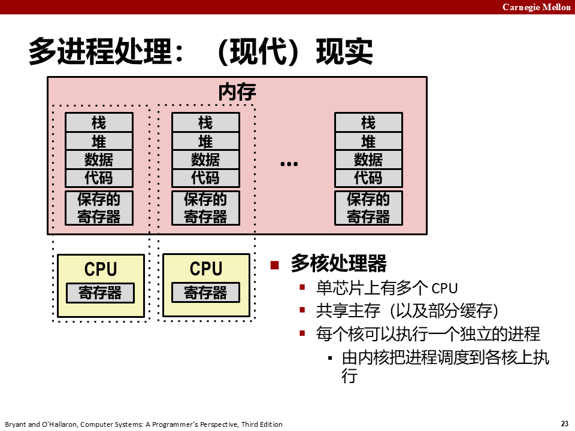

> 多进程（传统）现实：单处理器上进程执行交错（多任务），地址空间由虚拟内存系统管理，未执行进程的寄存器值保存在内存中（"保存的寄存器"）。多核现实：单芯片上多个 CPU，共享主存和部分缓存，每个核执行一个独立进程，由内核把进程调度到各核。

### 2.4 私有地址空间

在 n 位地址机器上，地址空间是 $2^n$ 个可能地址的集合：$0, 1, \ldots, 2^n-1$。进程为每个程序提供它自己的**私有地址空间**——与空间中某个地址关联的内存字节一般不能被其他进程读写。

每个私有地址空间有相同的通用结构（x86-64 Linux 进程地址空间，见上面课件 p16 图中"内存"部分）：

| 区域 | 内容 |
| --- | --- |
| 只读代码段 | .init、.text、.rodata（从可执行文件加载） |
| 读/写段 | .data、.bss（从可执行文件加载） |
| 运行时堆 | 用 malloc 创建，`brk` 指针标记堆顶 |
| 共享库的内存映射区域 | mmap 等 |
| 用户栈 | 运行时创建，`%esp` 栈指针 |
| 内核虚拟内存 | 代码、数据、堆、栈（用户代码不可见） |

- 地址空间**底部**保留给用户程序（代码、数据、堆、栈段，代码段总是从 `0x400000` 开始）。
- 地址空间**顶部**保留给内核（OS 常驻内存的部分），包含内核代表进程执行时使用的代码、数据和栈。
- 用户模式进程**不能直接访问**内核区，只能通过系统调用接口间接访问。

> 🎙️ **录音（课堂补充）：虚拟地址 vs 物理地址**
>
> 每个进程看到的地址空间都是巨大的虚拟地址空间（x86-64 是 $2^{48}$ 量级），但**运行时实际占用的物理内存很小**——虚拟地址空间里大部分是空的，没用到就不分配。进程之间互相看不见、不能访问别人的内存，这才有安全隔离；如果谁都能访问别人的内存，那就不存在安全问题、也不存在病毒了——因为大家都是病毒。

### 2.5 用户模式和内核模式

处理器用控制寄存器中的**模式位（mode bit）**描述进程当前享有的特权：

- **模式位设置** → **内核模式**（超级用户模式）：可执行指令集中的任何指令，可访问系统中的任何内存位置。
- **模式位未设置** → **用户模式**：不允许执行特权指令（停止处理器、改变模式位、发起 I/O 操作），也不允许直接引用内核区代码/数据（否则致命保护故障）。用户程序必须通过**系统调用接口**间接访问内核。

- 运行应用程序代码的进程初始在用户模式。
- **从用户模式变为内核模式的唯一方法：异常**（中断、故障或陷入系统调用的陷阱）。
- 异常发生时控制传给异常处理程序，处理器把模式从用户变为内核；处理程序返回到应用程序时再改回用户模式。

> 🎙️ **录音（课堂补充）：为什么你必须"求助于"内核**
>
> 写汇编时硬件随便你用；写 C 应用时会发现有些功能实现不了——操作显示器、读硬盘、控制鼠标，**都要系统级权限**。这时必须从用户态跳转到内核态（系统模式），内核管理所有硬件，替你做完再返回。**用户态 ↔ 内核态的切换**，本质上就是进程上下文切换的基础。厉害的病毒往往在这条切换路径上做文章，劫持切换流程获取内核权限。

**/proc 文件系统**：Linux 提供的一种机制，把许多内核数据结构的内容输出为文本文件层次结构，供用户模式进程读取。如 CPU 类型（`/proc/cpuinfo`）、某进程的内存段（`/proc/<pid>/maps`）。

### 2.6 上下文切换

**上下文切换（context switch）**：操作系统内核用来实现多任务的一种**较高层形式的 ECF**，建立在低层异常机制之上。

- **上下文（context）**：内核重新启动一个被抢占进程所需的状态——通用寄存器、浮点寄存器、PC、用户栈、状态寄存器、内核栈，以及各种内核数据结构（页表、进程表、文件表）。
- **调度（scheduling）**：内核在进程执行的某些时刻决定抢占当前进程、重新开始另一个进程。由内核中的**调度器（scheduler）**处理。
- 上下文切换的步骤：1) 保存当前进程的上下文；2) 恢复某个先前被抢占进程保存的上下文；3) 将控制传给新恢复的进程。

**何时发生上下文切换**：

- **系统调用阻塞时**：如 `read` 要访问磁盘，内核可切换到另一个进程，而不是干等；`sleep` 显式请求休眠。
- **中断**：周期性的定时器中断（每 1ms 或 10ms），内核判定当前进程运行够久了，就切换。

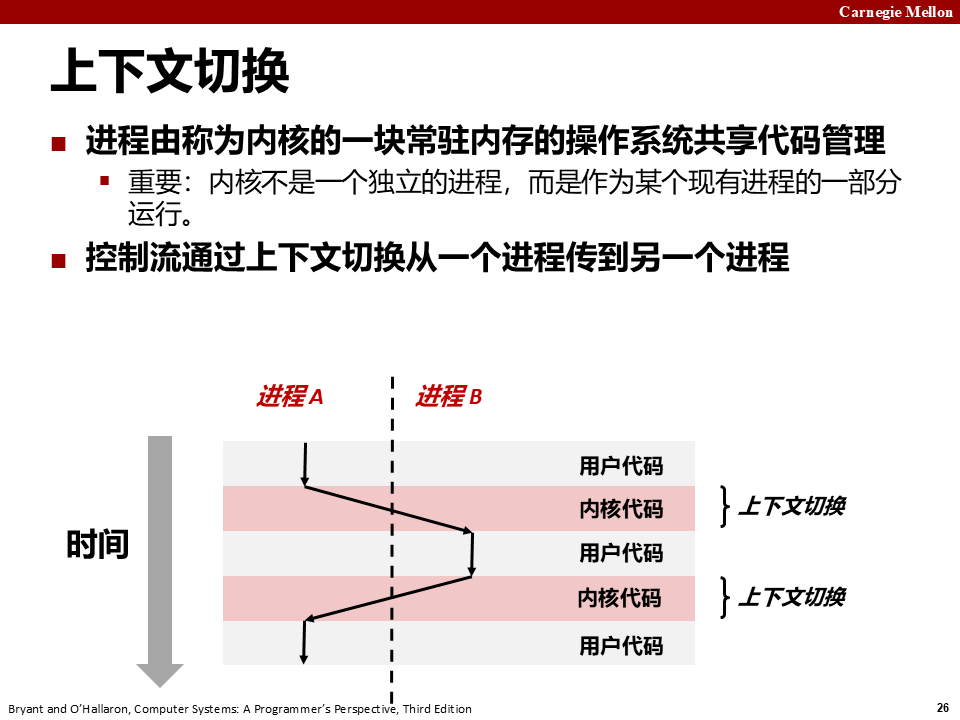

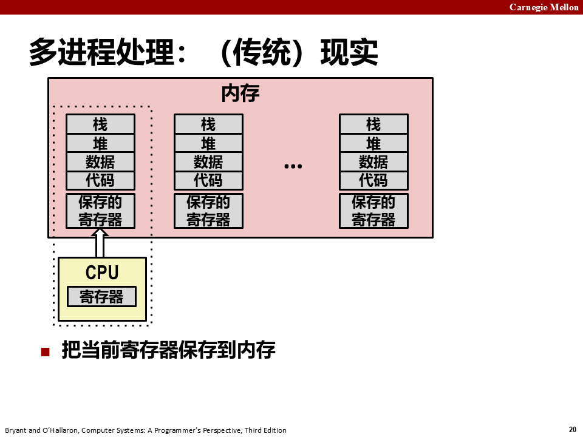

> **重要**：内核**不是一个独立的进程**，而是作为某个现有进程的一部分运行（"代表进程执行"）。

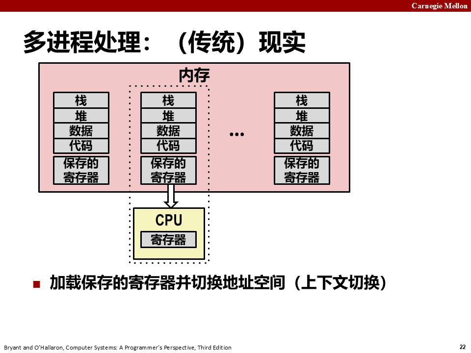

> 图 8-14 的例子：进程 A 用户模式运行 → 执行 `read` 系统调用陷入内核 → 内核请求磁盘 DMA 传输 → 磁盘数据到达需几十毫秒，内核切换到进程 B → B 运行一会 → 磁盘中断 → 内核切换回 A，返回 `read` 之后的那条指令。

> 🎙️ **录音（课堂补充）**
>
> 上下文切换就是**运行环境的切换**——发生在模式切换（用户态 ↔ 内核态）过程中。切换时要把当前进程的现场（寄存器、变量、历史数据）保存下来，等它再被调度时恢复。只要涉及进程切换，就一定有上下文切换。

> **拓展：内核到底是什么（补）**
>
> 课件和原书都没有单独给"内核"下定义，下面把笔记里散落的线索拼成一张完整画像（少量内容属于必要补充，已注明）。
>
> **一句话**：内核（kernel）是操作系统**常驻内存**的那部分代码和数据，是系统中唯一运行在**内核模式**的特权代码——它管理全部硬件资源，并为用户进程提供系统调用接口。
>
> **六个容易混淆的点**：
>
> 1. **内核不是进程**（见 2.6 的"重要"提示）。它没有 PID，不被调度器当进程排班，而是**代表某个进程执行**：异常发生时处理器切到内核模式，用**当前进程的内核栈**跑内核代码。所以内核是"附身"在进程上运行的特权代码，不是后台常驻的第 N 号进程。（0 号调度进程、1 号 init、2 号 kthreadd 是内核**创建**的特殊进程，不是内核本身。）
> 2. **内核是内存里的一份代码，被所有进程共享映射**（见 2.4）。每个进程虚拟地址空间的**顶部**都保留给内核（内核的代码、数据、堆、栈），指向**同一份物理内存**；用户代码看不见也进不去。
> 3. **操作系统 ≠ 内核**。OS = 内核 + shell + 系统工具与库（glibc、`ls`、`gcc` 这些）。**shell 只是一个普通应用程序**（见《信号》笔记 1.2），它靠 fork + execve + waitpid 干活，不是内核。
> 4. **进入内核的唯一途径是异常**（见 2.5）：中断、故障、陷入系统调用的陷阱。用户态 → 内核态**只有这一道门**，没有别的路。
> 5. **内核独占硬件**。用户态不能操作显示器、硬盘、鼠标，只能靠系统调用"求内核代劳"（录音：写 C 应用时感觉有些功能实现不了，就是权限不够）。
> 6. **内核具体干什么**：启动时分配并初始化**异常表** → 异常到来时按异常号分派处理程序 → **调度器**做上下文切换 → **发信号** → 虚拟内存管理与缺页处理 → 文件系统与设备驱动。
>
> **回到定时器中断那一问**：内核平时"不在场"，靠中断 / 系统调用被**召唤**出来，处理完再返回用户进程。它不是一直在跑的监控程序，而是**被事件驱动的共享特权代码**——这也解释了为什么定时器中断只是"把控制权交给内核"，而不是"杀掉进程"。
---

## 3. 系统调用错误处理（8.3）

当 Unix 系统级函数遇到错误时，通常返回 -1，并设置全局整数变量 `errno` 来表示错误的原因。

**错误处理的"铁律"**：对系统级函数，程序员必须检查返回值，看是否发生了错误。

```c
// 检查系统调用返回值
if (pid < 0) {
    fprintf(stderr, "fork error: %s\n", strerror(errno));
    exit(0);
}
```

**推荐：错误处理包装函数（wrapper function）**

Linux 系统调用相关手册的"man 3"部分给出了定义错误处理包装函数的传统。一个包装函数把系统调用和它的错误检查代码"打包"在一起：

```c
pid_t Fork(void) {
    pid_t pid;
    if ((pid = fork()) < 0)
        unix_error("Fork error");
    return pid;
}
```

- 包装函数命名：**首字母大写**（`Fork` 而非 `fork`），一眼能看出是包装过的版本。
- 包装函数存在的作用：代码更简洁、错误处理集中、避免在每个调用点都写一堆检查代码。
- 常见错误报告函数：`unix_error`、`posix_error`、`app_error` 等，负责打印消息并 `exit(0)`。

> 🎙️ **录音（课堂补充）：成功只有一种，错误有很多种**
>
> 老师反复强调：系统调用**成功只有一种情况（返回 0）**，但失败原因有很多种（内存不够、权限不足、文件不存在……）。所以错误处理的设计是：**成功返回 0，出错返回 -1 + errno**。`errno` 就相当于一个"错误类型编号"，`strerror(errno)` 能把它翻译成人话。这也是面试常问的：为什么要单独设一个 errno？因为一种成功对应 N 种失败，只用返回值没法区分具体错因。

> **拓展：拆解 exit(0) / exit(1) / errno 三问**（属于课堂延伸，帮助理解退出状态）
>
> **问题 1：为什么 main 结尾是 `return 0` 而不是 `return 1`？**
>
> 返回给 shell 的退出状态（exit status）中，**0 表示"正常结束"**（成功），**非 0 表示出错**。约定俗成：0 = 成功，1 = 一般错误，2 = 用法错误等。所以想表达"程序正常干完了"就 `return 0`。
>
> **问题 2：`exit(0)` 和 `return 0` 的区别？**
>
> - `return 0` 是 main 函数返回，**先执行栈上的局部变量析构（C++ 概念）、清缓冲区、调用退出处理函数**，再交给 C 运行库调 `_exit(0)`。
> - `exit(0)` 是标准库函数（不是系统调用），直接调用**退出处理函数并刷新缓冲区**，不会执行 main 栈上局部变量的析构。
> - `_exit(0)`（带下划线）才是**真正的系统调用**，立即终止进程、回收资源，**不刷新缓冲区**——用 `write` 直接写内核缓冲没这个问题，但用 `printf` 而不用 `exit`/`return` 直接 `_exit` 时，可能丢失 printf 的内容。
>
> **问题 3：`errno` 到底在哪、归谁管？**
>
> `errno` 是 glibc 提供的一个**线程局部（或进程级）全局整数变量**。系统调用失败时内核把错误码写进返回值（负 errno），glibc 转存到 `errno`。它是"最后一次错误"的编号，不是错误计数器——每次系统调用都可能覆盖它，所以**用完立刻检查/拷贝**。

---

## 4. 进程控制（8.4）

进程控制的内容：**获取进程 ID、创建和终止进程、回收子进程、让进程休眠、加载并运行程序、利用 fork 和 execve 运行程序**。

### 4.1 获取进程 ID

```c
#include <sys/types.h>
#include <unistd.h>

pid_t getpid(void);   // 返回：调用进程的 PID
pid_t getppid(void);  // 返回：调用进程的父进程的 PID
```

- `pid_t` 在 Linux 上就是 int（typedef）。
- `getpid` 返回**当前进程**的 PID；`getppid` 返回**父进程**的 PID。
- 理解要点：
  - 一个进程只能有一个父进程（Linux 里常是 shell），但可以有多个子进程。
  - 进程号从 1 开始（1 号进程是 init/systemd），0 号进程是调度器/空闲进程。
  - PID 是有限的整数资源：16 位系统上限约 65535（录音：攒满就只能重启机器）；现代 Linux 默认 pid_max 可到 4 百万量级。

### 4.2 创建和终止进程

**进程三态**（教材 8.4.2 + 课件 p32）：

| 状态 | 含义 |
| --- | --- |
| 运行（running） | 进程要么在 CPU 上执行，要么在等待被执行且最终会被内核调度 |
| 停止（stopped） | 进程被挂起且不会被调度（收到 SIGSTOP/SIGTSTP/SIGTTIN/SIGTTOU 信号后进入；收到 SIGCONT 恢复） |
| 终止（terminated） | 进程永远地停止了（收到终止信号、从 main 返回、调用 exit） |

> 🎙️ **录音（课堂补充）**
>
> 进程状态主要就三种：**运行、停止、终止**。运行 = 正在执行或排队等 CPU；停止 = 被挂起，不占 CPU 时间片；终止 = 结束，资源要被回收。

**从程序员视角，进程只有两种创建方式**：

1. **初始化**：`int main(int argc, char *argv[], char *envp[])` 时由操作系统创建。
2. **fork**：父进程调用 `fork()` 创建子进程。

```c
#include <sys/types.h>
#include <unistd.h>

pid_t fork(void);  // 返回：子进程返回 0，父进程返回子进程的 PID；出错返回 -1
```

**fork 的关键性质**：

1. **调用一次，返回两次**：父进程中返回一次（返回子进程 PID），子进程中返回一次（返回 0）。
2. **并发执行**：父进程和子进程是**两个独立的进程**，创建后都从 fork 返回的下一条指令继续执行。谁先执行**不确定**（由内核调度器决定）。
3. **相同但独立的地址空间**：fork 刚返回时，父/子进程的虚拟地址空间内容**完全相同**（代码、数据、堆、栈都复制一份"逻辑上"的拷贝）；但它们是**独立**的——任一方后续修改自己的变量不影响另一方。
4. **共享打开的文件**：父进程打开的文件描述符，子进程会**继承共享**（例如都指向 stdout 同一文件表项，所以两边 printf 都写进同一个终端/文件）。

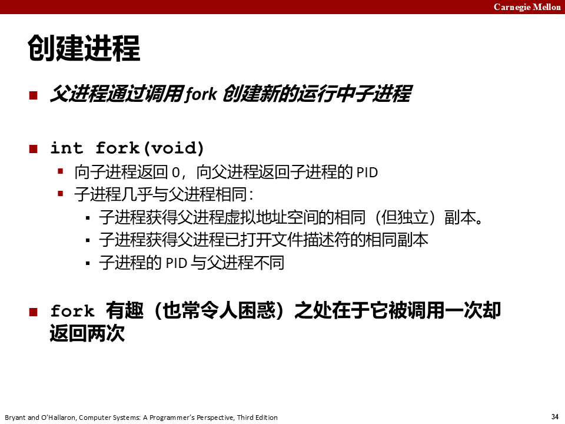

> 🎙️ **录音（课堂补充）：为什么 fork 返回两次？为什么子返回 0、父返回子 PID？**
>
> - **父进程返回子 PID**：一个父亲可能有多个孩子（创建多个子进程），**必须知道刚创建的是哪个孩子**，所以返回孩子的 PID。
> - **子进程返回 0**：子进程想知道爸爸是谁，随时可以调用 `getppid()` 查到；而且靠返回值就能区分自己是父还是子。
> - **代码怎么分工**：父子代码写在一起，靠 `if (pid == 0) { /* 子进程代码 */ } else { /* 父进程代码 */ }` 这个条件**分流**。fork 之前的所有代码，父子各执行一遍；fork 之后由返回值分流。
>
> **fork 是"重量级"的**：所有变量都要复制一份，代价很大。这也是后来**线程（thread）**出现的原因——线程不复制全局变量、共享内存，轻量得多（详见 4.2 拓展）。
>
> **fork 后指针是浅拷贝**：指针本身复制了一份，但两个指针指向**同一块内存对象**。所以多进程共享数据时要小心指针。

**fork 失败的两个原因**（录音强调）：

1. **内存不够**：创建进程需要为新进程的地址空间分配内存/页表。
2. **PID 耗尽**：16 位系统 PID 上限约 65535，进程攒满了就创建失败——只能重启释放（现代 64 位系统基本不会出现）。

**fork 例子 1：基本分流（fork.c / fork0）**

```c
int main() {
    pid_t pid;
    int x = 1;

    pid = Fork();
    if (pid == 0) {         // 子进程
        printf("child: x=%d\n", ++x);
        exit(0);
    }
    // 父进程
    printf("parent: x=%d\n", --x);
    exit(0);
}
```

**可行输出**（输出顺序不确定，但数值确定）：

```text
parent: x=0
child: x=2
```

或

```text
child: x=2
parent: x=0
```

> **分析**：fork 后父子各有一份 `x=1`。子进程 `++x` → 2（自己的 x）；父进程 `--x` → 0（自己的 x）。两个 x 互不影响。输出行顺序取决于调度，但**数值固定**。
>
> 🎙️ **录音**：fork 后父进程和子进程是两个完全独立的东西——子进程改了 x，父进程的 x 不变；反之亦然。画图的话：fork 点分裂成两个分支，各自往下走。

**练习题 8.2**（书页 516）：判断下面程序所有可能的输出：

```c
int main() {
    if (fork() == 0) {
        printf("a");
        exit(0);
    } else {
        printf("b");
        waitpid(-1, NULL, 0);
    }
    printf("c");
    exit(0);
}
```

**答案（书页 556）**：合法输出是 **`abc` 或 `bac`**。

分析：

- 子进程先运行：打印 `a` → 父进程打印 `b` → `waitpid` 立即返回 → 打印 `c`。输出 **abc**。
- 父进程先运行：打印 `b` → `waitpid` 阻塞等子进程 → 子进程打印 `a` → 父进程恢复，打印 `c`。输出 **bac**。

> 关键结论：**`c` 一定在 `a` 和 `b` 之后**——因为父进程的 `waitpid` 保证子进程结束前，父进程不会执行到 `printf("c")`。而 `a`、`b` 的相对顺序不确定（父子谁先运行由内核调度决定）。题目里 `printf("a")` / `printf("b")` 都没换行，最终拼接成一行。

**fork 例子 2：连续两次 fork（fork2）**——谁都能画错的经典图

```c
int main() {
    Fork();
    Fork();
    printf("hello\n");
    exit(0);
}
```

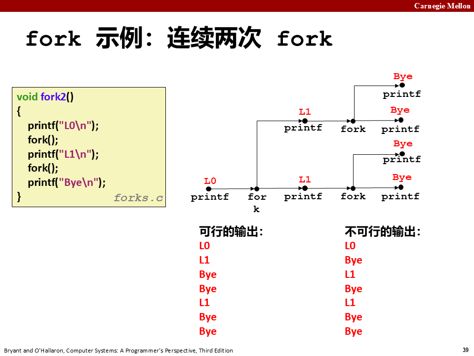

**输出**：4 个 hello（进程数 = 2^2 = 4）。进程图能清楚看到：每个 fork 点把一条流分裂成两条。

**fork 例子 3：嵌套 fork（fork4 / fork5）**

```c
// fork4.c：if (fork() == 0) { Fork(); } —— 只有子进程再 fork
int main() {
    Fork();                    // 分裂：父 P、子 C1
    if (fork() == 0) {         // P 再分裂出 C2；C1 再分裂出 C3
        Fork();                // C2 再分裂出 C4
    }
    printf("hello\n");
    exit(0);
}
```

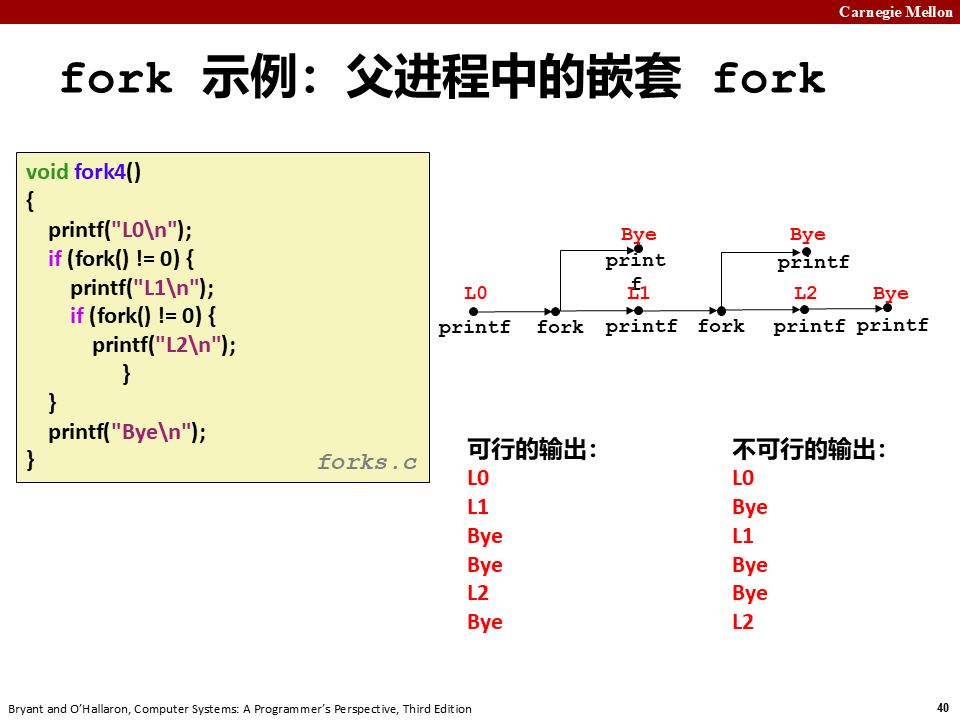

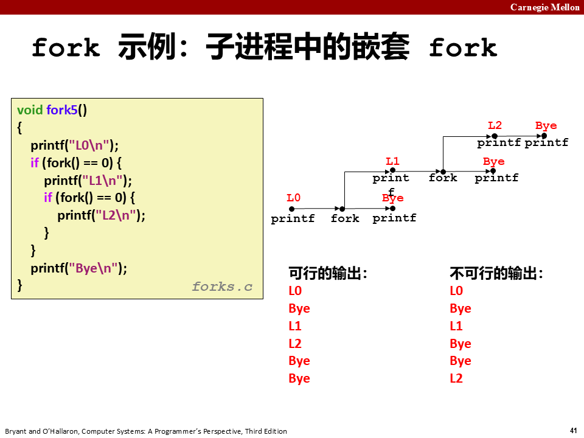

**输出**：5 个 hello（进程数 = 5）。

> **进程图（process graph）建模**（课件 p36-38）：
>
> - 进程图是一张**有向无环图（DAG）**，每个点代表一条语句的执行，边 $a \to b$ 表示 a 先于 b 执行。
> - fork 点是**分裂点**：一条流在 fork 后变成两条（父、子）。
> - 合法的输出序列 = 图的**拓扑排序**（从入口到出口，箭头方向只能向前走）。

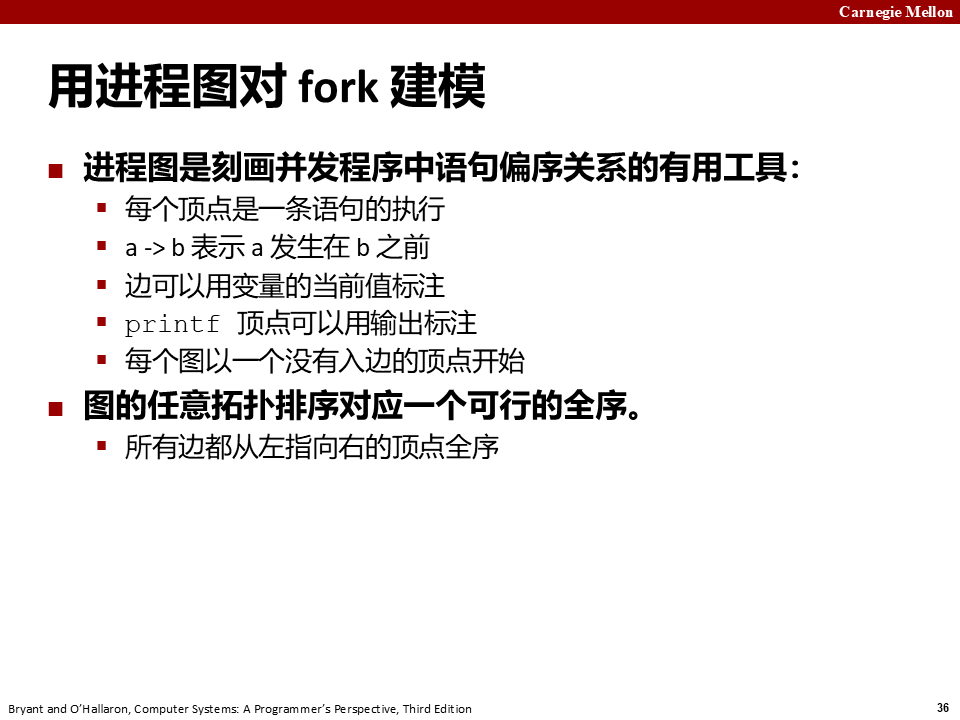

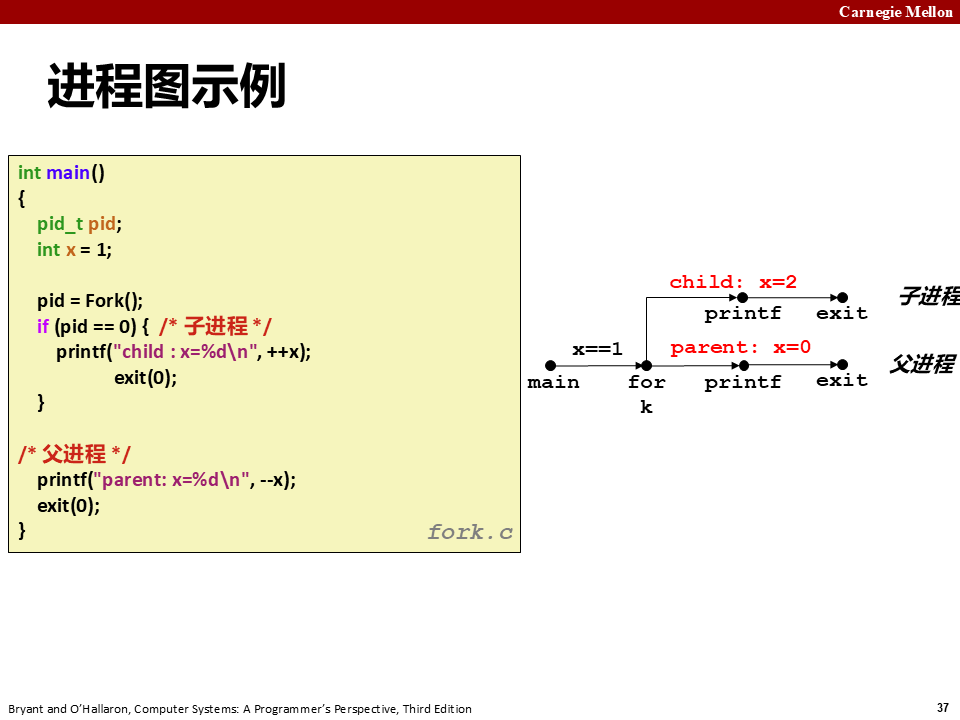

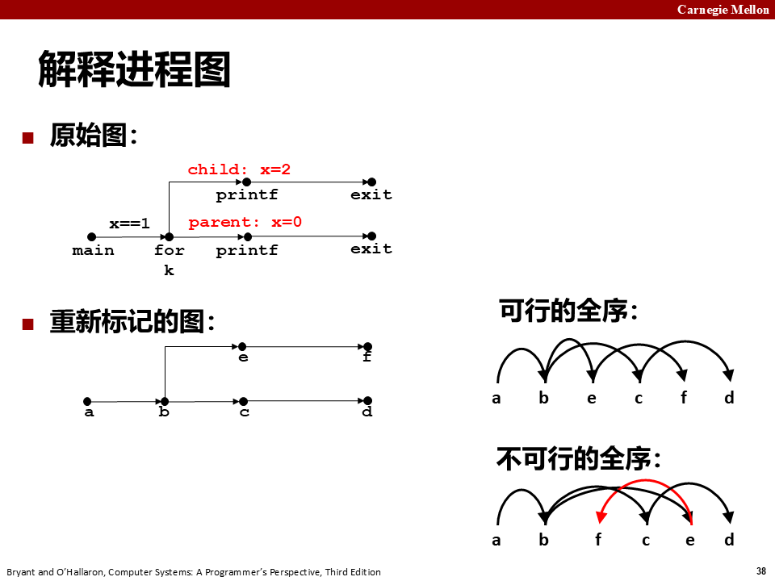

> 🎙️ **录音（课堂补充）：进程图怎么画**
>
> 每个点表示一条指令/一个语句，`a → b` 表示 a 先执行、b 后执行。fork 之后一条变两条，各自走各自的。**合法输出 = 拓扑排序**：从起点出发，只能沿箭头方向前进，不能倒退。画进程图时先标 fork 分裂点，再把每个进程的执行序列连起来。

> **拓展：写时复制 COW（第 9 章内容提前，深挖）**
>
> 教材 8.4.2 只讲 fork 会复制地址空间，**没有解释为什么 fork 这么快**。真正实现是**写时复制（Copy-On-Write, COW）**，属于第 9 章虚拟内存的机制，这里提前补充：
>
> - fork 创建子进程时，**不真正复制**父进程的整个地址空间，只是把**页表**复制一份，并把这些页标记为**只读**，父子共享同一批物理页。
> - 只要双方都只读，就一直共享，零拷贝。
> - 一旦任一方**试图写**某个页，触发**保护故障**，内核才为它**复制这个页**（写时复制），然后解除只读标记，让写的一方用新页。
> - 好处：fork 只需复制页表，速度接近 O(页表大小)；只有真正写到的页才复制，**节省大量内存**。
> - execve 之后子进程马上丢弃旧地址空间加载新程序，COW 避免了一次浪费的完整拷贝。

> **拓展：进程 vs 线程（录音强调，深挖）**
>
> | | 进程 | 线程 |
> | --- | --- | --- |
> | 地址空间 | 每个进程**独立** | 同一进程内线程**共享** |
> | 全局变量 | 各有一份 | 共享一份 |
> | 通信 | 进程间通信（IPC：管道、消息队列、共享内存、信号、套接字） | 靠共享变量直接交换数据 |
> | 创建开销 | 重量级（复制地址空间/页表） | 轻量级（共享内存） |
> | 关系 | 不同进程完全独立 | 同一个进程的多个执行流 |
>
> 🎙️ **录音（课堂补充）**：fork 是重量级的，所有变量复制一份（常量可能不复制，因为只读不会改）。线程轻量级，共享全局变量——这也是**面试常考点**：说出 5 种进程间通信方式（管道、消息队列、共享内存、信号、套接字/socket）。进程间通信很麻烦，线程间通信直接改共享变量就行。
>
> **服务器模型（录音强调）**：父进程**只负责接收请求**，fork 出子进程去处理具体业务——这样父进程随时能响应新请求。如果父进程自己干活，处理请求期间就没法响应别人了。Web 服务器、游戏服务器都这样设计（孙悟空拔毛变分身：真身接任务，分身干活）。
---

### 4.3 回收子进程

**问题**：当进程终止时，内核**不会**立即把它清掉。它保留在系统中，处于**僵尸状态（zombie）**——进程已终止、不能运行，但还没有被父进程"回收"（wait），因此**仍然占用**进程表中的条目（主要资源是 PID）。

**僵尸进程（zombie process）**：

- 已终止的进程，等待父进程回收（reap）。
- 它不占用 CPU、不占用内存主体，但**占用 PID**（进程表项）。PID 是有限的，僵尸攒多了就没法创建新进程。
- **父进程结束后**，僵尸由 **init 进程（1 号进程）**收养并回收。
- **僵尸杀不死**：`kill -9` 也没用——因为进程已经死了，不是还活着；要清掉它只能让父进程 wait，或杀掉父进程让 init 收尸。

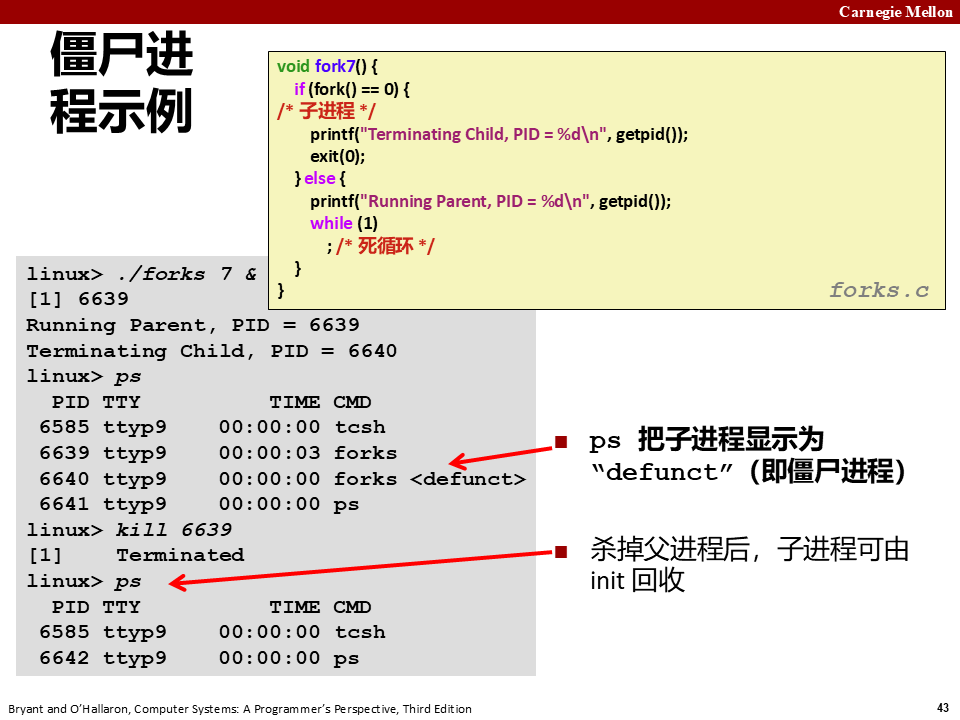

> 🎙️ **录音（课堂补充）：僵尸 = 半死半活、有怨气**
>
> 老师打比方：僵尸进程是"半死半活"——它已经不干事了（工作没了），但**占着资源不释放**（有怨气、还没被收拾）。你不给它收尸，它就赖着不走，还占着 PID。服务器编程最讨厌僵尸：服务器长期运行，如果父进程不回收，僵尸会越攒越多，把 PID 耗尽。所以服务器程序**必须显式回收**子进程（wait/waitpid）。

**回收机制**：

- **wait**：父进程调用 `wait(&status)` **阻塞**等待**任意一个**子进程终止，然后回收它。如果没有子进程，立即返回 -1（ECHILD）。
- **waitpid**：更灵活，等待**指定**子进程，支持选项（WNOHANG 非阻塞）。

```c
#include <sys/types.h>
#include <sys/wait.h>

pid_t wait(int *status);                    // 返回：成功为子进程 PID，错误为 -1
pid_t waitpid(pid_t pid, int *status, int options);  // 返回：成功为子进程 PID，WNOHANG 时 0 表示没子进程结束，错误为 -1
```

**waitpid 参数详解**：

| 参数 | 含义 |
| --- | --- |
| `pid > 0` | 等待**指定 PID** 的那个子进程 |
| `pid = -1` | 等待**任意**子进程（等同 wait） |
| `pid = 0` | 等待**与调用进程同组**的任意子进程 |
| `pid < -1` | 等待组 ID 等于 \|pid\| 的任意子进程 |
| `status` | 非空则记录子进程终止状态 |
| `options = 0` | 阻塞等待（默认） |
| `options = WNOHANG` | 非阻塞：没有子进程终止立即返回 0 |

**wait vs waitpid 对比**：

| | wait | waitpid |
| --- | --- | --- |
| 等待对象 | 任意一个子进程 | 可指定 PID / 组 / 任意 |
| 阻塞 | 一直阻塞 | 可用 WNOHANG 非阻塞轮询 |
| 出错 ECHILD | 无子进程 | 指定的子进程不存在或已回收 |

**检查子进程状态的宏**（`<sys/wait.h>`，用 `status` 判断）：

| 宏 | 用途 |
| --- | --- |
| `WIFEXITED(status)` | 子进程是否正常终止（exit 或 return） |
| `WEXITSTATUS(status)` | 若正常终止，取退出状态码（8 位，0~255） |
| `WIFSIGNALED(status)` | 是否被信号终止 |
| `WTERMSIG(status)` | 若被信号终止，取信号编号 |
| `WIFSTOPPED(status)` | 是否停止（暂停） |
| `WSTOPSIG(status)` | 若停止，取停止信号编号 |
| `WIFCONTINUED(status)` | 是否在停止后继续（Linux） |

> **拓展：status 的位布局（深挖，教材后面才展开）**
>
> `status` 是一个 32 位 int，不同位段记录不同信息（Linux x86-64）：
>
> - **低 8 位（位 0~7）**：如果正常终止，这里是退出码（`WEXITSTATUS` 取的就是它）；如果是信号终止，低 7 位是终止信号编号（`WTERMSIG`）。
> - **位 7**：core dump 标志（产生 core 文件时置 1）。
> - **位 8~15**：若进程停止（stopped），这里是停止信号编号（`WSTOPSIG`）。
> - **位 16**：`WIFCONTINUED` 使用的标志。
>
> 宏就是把这些位提取出来做判断。比如 `WIFEXITED(status)` 检查的是"进程是否通过 exit 正常结束"（对应位模式），`WEXITSTATUS(status)` 提取低 8 位退出码。

**例子：waitpid1（waitpid 等待指定子进程）**

```c
int main() {
    int status;
    pid_t pid[N];

    /* 创建 N 个子进程，每个 exit(100+i) */
    for (i = 0; i < N; i++)
        if ((pid[i] = Fork()) == 0)
            exit(100 + i);

    /* 父进程按创建顺序回收每个子进程 */
    for (i = 0; i < N; i++) {
        wpid = waitpid(pid[i], &status, 0);
        if (WIFEXITED(status))
            printf("child %d terminated with exit status %d\n",
                   wpid, WEXITSTATUS(status));
        else
            printf("child %d terminated abnormally\n", wpid);
    }
}
```

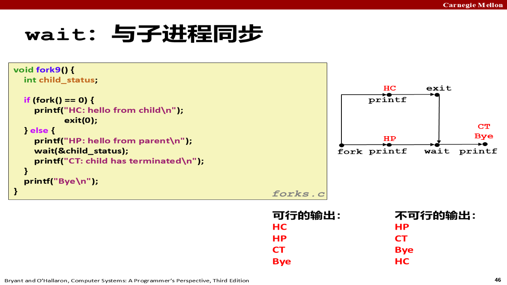

> **输出（每次运行相同）**：
>
> ```text
> child 24432 terminated with exit status 100
> child 24433 terminated with exit status 101
> child 24434 terminated with exit status 102
> ...
> ```
>
> 因为父进程**按创建顺序** waitpid 每个指定 PID，输出顺序确定：子进程们各自 `exit(100+i)` 设置退出码，父进程用 `WEXITSTATUS(status)` 取回 100、101、102……（PID 具体数值随运行变化）。

**例子：waitpid2（乱序回收）**

```c
int main() {
    int status;
    pid_t pid[N];

    /* 创建 N 个子进程，每个 exit(100+i) */
    for (i = 0; i < N; i++)
        if ((pid[i] = Fork()) == 0)
            exit(100 + i);

    /* 父进程用 waitpid(-1) 回收，谁先结束回收谁 */
    while ((wpid = waitpid(-1, &status, 0)) > 0) {
        if (WIFEXITED(status))
            printf("child %d terminated with exit status %d\n",
                   wpid, WEXITSTATUS(status));
        else
            printf("child %d terminated abnormally\n", wpid);
    }
    /* 全部回收后 waitpid 返回 -1（ECHILD） */
}
```

> **输出（每次运行可能不同）**：`waitpid(-1)` 等待**任意**子进程，子进程结束顺序不定，所以回收顺序、输出顺序都不确定。但退出码集合固定（100、101、102……各出现一次）。

**例子：fork9（wait 同步父子）**——保证子进程先输出

```c
int main() {
    if (Fork() == 0) {
        printf("a");   /* 子进程 */
        exit(0);
    } else {
        printf("b");   /* 父进程 */
        waitpid(-1, NULL, 0);
    }
    printf("c");       /* 两边都会执行 */
    exit(0);
}
```

**输出**：`abc`（父进程 waitpid 等子进程结束后才打印 c）。若去掉 waitpid，输出可能是 `acb` 或 `abc` 等任意顺序。

**练习题 8.3**（书页 518）：列出下面程序所有可能的输出：

```c
int main() {
    if (fork() == 0) {
        printf("a");
        exit(0);
    }
    printf("b");
    waitpid(-1, NULL, 0);
    printf("c");
    exit(0);
}
```

**答案（书页 556）**：

```text
abc
```

分析：父进程打印 `b`（也可能子进程先打印 `a`，顺序不定）→ 父进程 waitpid 阻塞等子进程 → 子进程打印 `a` → 父进程恢复打印 `c`。**关键是父进程的 `waitpid` 保证 `c` 一定在子进程结束后打印**。合法输出：`abc` 或 `bac`。

**练习题 8.4**（书页 520）：考虑下面的程序：

```c
int main() {
    int status;
    if (fork() == 0) {
        printf("a");
        exit(0);
    }
    printf("b");
    if (waitpid(-1, &status, 0) > 0) {
        if (WIFEXITED(status))
            printf("c");
        else
            printf("d");
    }
    exit(0);
}
```

**答案（书页 556）**：

```text
abc
```

分析：子进程打印 `a` → 父进程打印 `b` → waitpid 返回子进程 PID > 0，且子进程正常终止（exit(0)），`WIFEXITED` 为真 → 打印 `c`。输出 `abc`。

> **易错点**：`WIFEXITED(status)` 判断**是否正常退出**（通过 exit/return），而不是"退出码是否 0"。只要正常退出就为真，然后 `WEXITSTATUS(status)` 才取退出码（这里没打印退出码，所以看不出 0 不 0）。

**回收的三种情况**（录音补充）：

1. **正常回收**：父进程 wait/waitpid，子进程结束，父进程回收资源。
2. **非阻塞轮询**：父进程用 `waitpid(pid, &status, WNOHANG)`，子进程没结束就先干别的，过一会再来查（轮询）。
3. **孤儿进程**：父进程先死，子进程变孤儿，由 init（1 号进程）收养并负责回收。

---

### 4.4 让进程休眠

```c
#include <unistd.h>

unsigned int sleep(unsigned int secs);  // 返回：还要休眠的秒数（被信号打断时）
int pause(void);                        // 返回：-1（总是被信号打断才返回）
```

- `sleep(secs)`：让调用进程**休眠 secs 秒**，除非被信号提前唤醒（此时返回剩余秒数）。
- `pause()`：让调用进程**休眠直到收到一个信号**才返回（返回 -1，errno 设为 EINTR）。

**练习题 8.5**（书页 521）：编写一个 `snooze` 函数，行为和 `sleep` 一样，但在被信号打断时**打印实际休眠的时间**（即剩余时间不继续睡）：

```c
unsigned int snooze(unsigned int secs) {
    unsigned int rc = sleep(secs);
    printf("Slept for %d of %d secs.\n", secs - rc, secs);
    return rc;
}
```

**答案（书页 557）**：

- 无信号打扰：`sleep` 睡满 secs 秒，rc = 0，打印 "Slept for 5 of 5 secs."
- 被信号打断：rc = 剩余秒数，`secs - rc` 是实际睡了的秒数，打印 "Slept for 2 of 5 secs." 等。

---

### 4.5 加载并运行程序：execve

```c
#include <unistd.h>

int execve(const char *filename, const char *argv[], const char *envp[]);
// 返回：不会返回（成功时）；出错才返回 -1
```

**execve 在调用进程内加载并运行新程序**：

- 用 `filename` 指定的可执行文件**替换**当前进程的代码、数据、堆、栈段。
- 新程序从 main 开始执行（或从启动代码 _start 进入）。
- **成功不返回**：调用进程的地址空间已被新程序覆盖，原来的代码没了，不可能"返回"继续执行。
- **失败才返回 -1**：文件不存在、不是可执行文件等。
- **不创建新进程**：execve 是"变身"，不是"生孩子"。PID 不变，还是同一个进程，只是换了个程序在跑。

**argv / envp**：

```c
argv:   指向参数字符串数组，argv[0] 是程序名（惯例），argv[argc] = NULL
envp:   指向环境变量字符串数组，形如 "NAME=value"，envp[?] = NULL
```

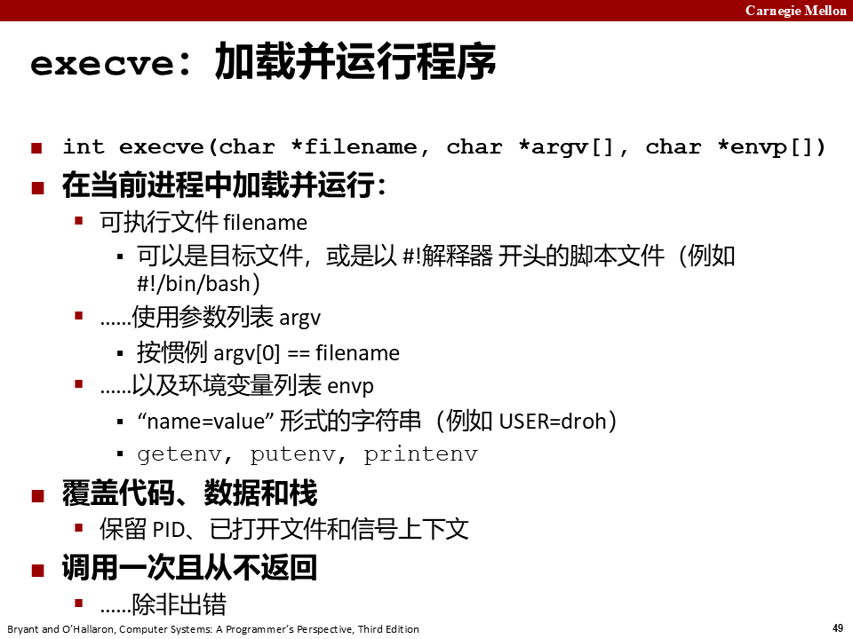

**新程序的启动栈（栈的初始布局）**：

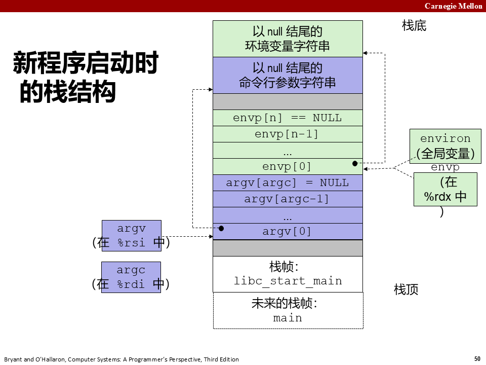

> 新程序启动栈从高地址向下：环境变量字符串 → argv 字符串 → 未使用区 → 参数指针数组 argv[] → 环境指针数组 envp[] → **栈底（%rsp 指向）**。main 通过栈上的 argv[] / envp[] 拿到参数和环境。

**练习题 8.6**（书页 523）：假设 execve 的调用是：

```c
execve("echoall", argv, envp);
```

其中：

```c
argv = ["echoall", "myarg1", "MY ARG2", NULL];
envp = ["USER=who", "PATH=/usr/bin", NULL];
```

请画出 execve 调用后新程序启动时，栈上参数的布局。

**答案（书页 557）**：栈上（从高地址到低地址，%rsp 指向最低处）：

```text
（高地址）字符串区：
  "echoall\0"
  "myarg1\0"
  "MY ARG2\0"
  "USER=who\0"
  "PATH=/usr/bin\0"
  未使用
指针区：
  argv[0] → "echoall"
  argv[1] → "myarg1"
  argv[2] → "MY ARG2"
  argv[3] = NULL
  envp[0] → "USER=who"
  envp[1] → "PATH=/usr/bin"
  envp[2] = NULL
（低地址）%rsp
```

> 可以对比第 3 章过程调用栈帧：两者都是"从高地址往低地址长"，但这里（进程启动栈）是**程序还没开始跑时**由内核/加载器摆好的初始状态；第 3 章的栈帧是**函数运行时**由 call/push 动态建的。它们共用同一块用户栈区域（见 2.4 地址空间图）。
>
> 🎙️ **录音（课堂补充）：execve 是"变身"**
>
> 老师强调：fork 是"复制/生孩子"，execve 是"变身/换人"。fork 完你还是你（两个一样的进程）；execve 把当前进程的整个代码和数据**替换**成新程序——原来的代码全没了。shell 跑 `ls` 就是：先 fork 一个子进程，子进程再 execve 换成 ls 的代码。这就是 **"fork + exec"** 经典组合。
>
> **exec 系列变体**（录音/课外补充）：`execl`、`execle`、`execv`、`execve`、`execlp`、`execvp` 都是 execve 的包装，区别只在**参数怎么传**（列表 l 还是数组 v）和**要不要在 PATH 里搜**（带 p）和**要不要自定义环境**（带 e）。底层最终都调 execve。
---

### 4.6 利用 fork 和 execve 运行程序

Unix shell 就是用 fork + execve 运行程序的典型例子。

**shell 读取命令行并执行命令的流程**：

1. 用户输入命令行（如 `ls > dir.txt`）。
2. shell 解析命令行，判断是**内置命令**（cd、pwd 等，shell 自己执行）还是**外部命令**（要 exec 新程序）。
3. 对外部命令：shell 先 fork 一个**子进程**。
4. 子进程 execve 加载并运行外部程序（如 ls）。
5. 父进程（shell）waitpid 等待子进程结束（前台命令），或继续读下一行（后台命令 `&`）。
6. 子进程结束后，shell 继续循环。

```c
// mysystem：用 fork + execve 模拟 system()
int mysystem(char *command) {
    pid_t pid;
    int status;

    if ((pid = fork()) == 0) {       /* 子进程 */
        execl("/bin/sh", "sh", "-c", command, NULL);  /* 执行 command */
        exit(127);                   /* exec 失败 */
    }
    if (pid < 0) return -1;          /* fork 失败 */
    if (waitpid(pid, &status, 0) < 0) return -1;  /* 父进程等子进程 */
    return status;
}
```

> 🎙️ **录音（课堂补充）：为什么必须 fork 再 exec？**
>
> 如果不 fork，直接在 shell 进程里 execve，shell 自己的代码就被覆盖了——shell 就没了，用户怎么再输下一条命令？所以必须先 fork 出一个**替身**（子进程），让替身去 execve 变身成 ls，**真身（父进程）留在原地继续等命令**。这就是"服务器模型"的同款思路：真身接任务，分身干活。

**简单 shell 的核心循环**（教材 8.4.6）：

```c
int main() {
    char cmdline[MAXLINE];

    while (1) {
        printf("> ");
        Fgets(cmdline, MAXLINE, stdin);
        if (feof(stdin)) exit(0);
        eval(cmdline);   /* 解析 + fork + exec + wait */
    }
}
```

---

## 5. 信号与非本地跳转预告（8.5–8.6）

本章后半部分还有两大块内容，本笔记（进程 ECF）不展开，在《第8章_异常控制流_信号与进程组_Signals.md》里详讲：

- **8.5 信号（signals）**：一种**更高层的软件形式的异常**，允许内核通知进程"发生了某个系统事件"。信号处理程序像"异步回调"——进程运行时随时可能被打断去执行处理函数。
- **8.6 非本地跳转（setjmp/longjmp）**：C 语言提供的用户级 ECF，允许程序从一个深层函数直接跳回更早的调用点（跳过中间的栈帧），是 C++/Java 异常机制的底层基础。

---

## 6. 本节重点

> **本节重点**：
>
> - **ECF 四层**：硬件异常（中断/陷阱/故障/终止）→ 进程上下文切换 → 信号 → 非本地跳转。
> - **异常四类**：异步（中断）；同步（陷阱=有意、故障=可恢复、终止=不可恢复）。用户态→内核态**唯一入口是异常**（系统调用就是陷阱）。
> - **进程两抽象**：独立逻辑控制流 + 私有地址空间。
> - **并发**：时间重叠才算并发；并行是并发的真子集（不同核/机器）。
> - **上下文切换**：保存上下文 → 恢复上下文 → 转移控制，发生在系统调用阻塞或定时器中断时。
> - **fork 三要点**：调用一次返回两次（父得子 PID、子得 0）；父子并发、谁先不确定；地址空间独立、文件表共享。fork 是重量级的（COW 优化见拓展）。
> - **僵尸进程**：已终止未回收，占 PID，`kill -9` 杀不掉，只能 wait 或让 init 收尸；服务器必须显式回收。
> - **waitpid**：`pid>0` 指定子进程、`-1` 任意；`WNOHANG` 非阻塞；`WIFEXITED`/`WEXITSTATUS` 检查退出状态。
> - **execve**：成功不返回、失败返回 -1；不创建新进程（PID 不变）；"fork + exec" 是 shell 运行命令的经典组合。
> - **错误处理铁律**：系统调用失败返回 -1 + errno；成功只有一种（0），错误有很多种；包装函数首字母大写。
> - **常见坑**：fork 后 printf 输出顺序不确定（用 waitpid 同步）；`WIFEXITED` 判断的是"是否正常退出"而非退出码是否为 0；僵尸进程不是"还在运行"，信号杀不死它；execve 成功后不可能返回。

---

## 附：本笔记涉及的命令速查

| 命令/函数 | 作用 |
| --- | --- |
| `ps` | 查看当前进程列表 |
| `ps aux` | 查看所有进程（含僵尸 Z 状态） |
| `top` / `htop` | 动态查看进程 CPU/内存 |
| `kill -9 <pid>` | 发送 SIGKILL 强制终止进程（对僵尸无效） |
| `kill -l` | 列出所有信号编号和名称 |
| `jobs` / `fg` / `bg` | 查看/切换前后台任务 |
| `getpid()` / `getppid()` | 获取当前进程 / 父进程 PID |
| `fork()` | 创建子进程（返回两次） |
| `wait()` / `waitpid()` | 回收子进程 |
| `sleep()` / `pause()` | 进程休眠 |
| `execve()` / `execl()` 等 | 加载并运行新程序 |
| `system()` | 标准库：fork+exec+wait 的封装 |
| `/proc/<pid>/maps` | 查看进程的内存映射 |

---