# 第九章 虚拟内存概念（Virtual Memory: Concepts）

> 依据：CMU 15-213 第 17 讲课件
>
> `17-vm-concepts.pptx`
>
> （Bryant & O'Hallaron）+ 《深入理解计算机系统》原书第 3 版第九章 + 课堂讲解。
>
> 环境假设：Linux x86-64 系统；课件与教材符号体系一致（VA / PA / VPN / PPN / PTE / TLB）。

***

## 0. 本章总览

这一章回答一个问题：**虚拟内存（Virtual Memory, VM）到底是什么，它解决了什么问题，系统又是怎么把虚拟地址翻译成物理地址的**。上一学期讲过内存的初步概念，这一章把它推向系统层面。

课件给出的五个主题，也是教材第 9 章的骨架：

| 主题 | 对应教材节 | 一句话概括 |
| --- | --- | --- |
| 地址空间（Address spaces） | 9.1–9.2 | 虚拟地址空间和物理地址空间分别是什么 |
| VM 作为缓存工具（VM as a tool for caching） | 9.3–9.4 | 把物理内存当作磁盘上虚拟页的缓存 |
| VM 作为内存管理工具（VM as a tool for memory management） | 9.6 | 每个进程都有统一的私有地址空间，简化链接、加载、共享 |
| VM 作为内存保护工具（VM as a tool for memory protection） | 9.5 | 在地址翻译时顺带检查权限位，隔离进程 |
| 地址翻译（Address translation） | 9.6–9.9 | 硬件 MMU + 页表 + TLB 完成 VA → PA 的映射 |

课堂上老师用一句话概括学习动机：**多进程系统出现之后，直接拿物理地址编程已经不可行，必须给每个进程一层"虚拟"的抽象**；这一章就是把这层抽象的机制讲透。

***

## 1. 物理寻址与虚拟寻址（9.1）

### 1.1 物理寻址（Physical Addressing）

**物理地址（physical address, PA）** 就是主存（DRAM）中每个存储单元真正的地址。物理寻址系统里，CPU 直接用物理地址去内存取数，地址总线上传的就是物理地址。

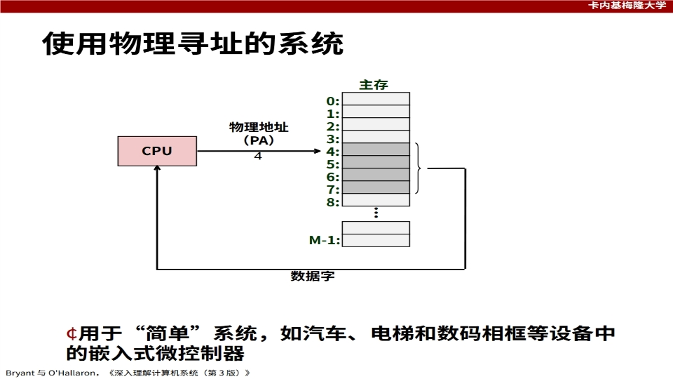

物理寻址用在"简单"系统里，比如汽车、电梯、数码相框里的嵌入式微控制器。课堂上老师补充了原因：**这类系统同一时刻只运行一个进程，一个跑完才跑下一个，串行执行，不需要在进程之间切换**，所以直接使用物理地址非常简洁——内存多大，你管理的地址范围就多大（例如 32K 内存，地址就是 0 到 32K-1）。

### 1.2 虚拟寻址（Virtual Addressing）

现代服务器、笔记本、智能手机全都是多进程并发在跑。这时候如果每个进程都直接用物理地址，进程之间会互相踩踏，内存也无法灵活分配，所以引入了**虚拟寻址**。

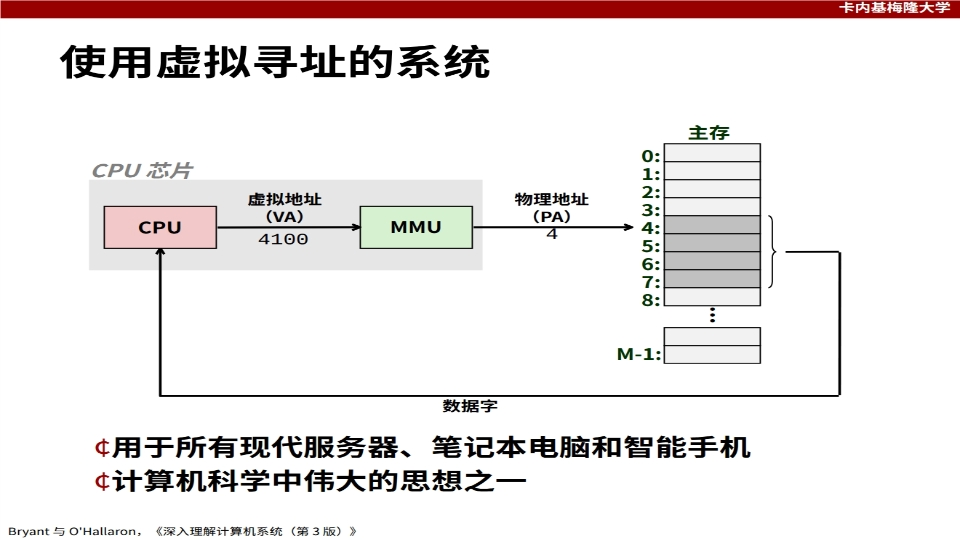

虚拟寻址系统里，**CPU 永远访问的是虚拟地址（VA），而不是物理地址**。CPU 芯片内部有一个 **MMU（Memory Management Unit，内存管理单元）**，负责把虚拟地址翻译成物理地址，再让内存按物理地址把数据取回来。这一套被课件称为"计算机科学中伟大的思想之一"。

**"虚拟化"的通用套路是拦截（interposition）**：老师在课上把这个概念讲透——所谓虚拟化一个资源，就是在用户和真实资源之间插一层，拦截所有对资源的访问，然后对这些访问做任意转换。磁盘就是现成例子：物理磁盘由柱面/磁道/扇区组成，访问一个扇区本来要给三个坐标；但磁盘控制器拦截了内核的 I/O 请求，把"逻辑块号"翻译成真实的柱面/磁道/扇区坐标，于是内核看到的就是一串简单的逻辑块。内存用的是同一招：只不过这次做拦截的是硬件 MMU，拦截的是 CPU 发出的地址，转换函数就是后面要讲的页表。

课堂上老师强调：**操作系统最核心的两个功能，一个就是进程调度（schedule），另一个就是 MMU 内存管理**。调度解决"CPU 少、进程多"的问题——宏观上看多个进程同时运行，微观上某个时刻只有一个进程占用 CPU，切换时要保存/恢复进程上下文；MMU 解决"虚拟地址与物理地址之间的翻译"，没有它，多进程系统根本转不起来。

**一句话对比**：

| 寻址方式 | 使用场景 | CPU 访问 | 谁做翻译 |
| --- | --- | --- | --- |
| 物理寻址 | 单片机、简单嵌入式（单进程、串行） | 物理地址 | 不需要 |
| 虚拟寻址 | 现代服务器、笔记本、智能手机（多进程） | 虚拟地址 | MMU |

***

## 2. 地址空间（9.2）

### 2.1 线性地址空间

**线性地址空间（linear address space）**：一组连续的非负整数地址的有序集合，即 $\{0, 1, 2, 3, \dots\}$。课堂上老师打了个比方：从 0 开始一路连续排下去、中间没有空洞的空间才是线性的；如果中间有一段地址没分配、不可用，这个空间就是不连续的，做映射会很麻烦。所以本章（以及 VM 的设计）默认研究线性地址空间。

### 2.2 虚拟地址空间与物理地址空间

**虚拟地址空间（virtual address space）**：大小为 $N = 2^n$ 的虚拟地址集合 $\{0, 1, 2, 3, \dots, N-1\}$，$n$ 是虚拟地址的位数。

**物理地址空间（physical address space）**：大小为 $M = 2^m$ 的物理地址集合 $\{0, 1, 2, 3, \dots, M-1\}$，$m$ 是物理地址的位数。

两者的决定因素不同（课堂重点）：

| 地址空间 | 由什么决定 | 例子 |
| --- | --- | --- |
| 虚拟地址空间 | 体系结构位数（操作系统自己定） | 64 位架构可以取 48 位、56 位等 |
| 物理地址空间 | 物理内存大小（硬件决定） | 1 GB 内存 → 30 位；4 GB 内存 → 32 位 |

> 课件 p5：虚拟地址空间 $\{0,1,2,3,\dots,N-1\}$，物理地址空间 $\{0,1,2,3,\dots,M-1\}$。

虚拟地址空间的大小与物理内存无关，这是虚拟内存能"造出比物理内存大得多的空间"的前提；也正因为 $N$ 远大于 $M$，才需要页表这种映射结构来管理"虚拟页 → 物理页"的关系。

> **x86-64 的实际情况**：CPU 是 64 位指针，但真正用的只有低 48 位（canonical address，规范地址）。高 16 位要么全 0、要么全 1：全 0 的一半是用户地址空间，全 1 的一半是内核地址空间；高 16 位既不全 0 也不全 1 的地址是非法的，MMU 直接拒绝。这也是为什么前面说"64 位架构可以取 48 位、56 位"——它不是真的用满 64 位。

***

## 3. 为什么需要虚拟内存（9.3）

课件列出三大理由，课堂上老师又用一句话把它们串起来：**虚拟内存就是"硬盘的 cache"——程序放在磁盘上，执行时把要用到的部分搬进内存跑，既提高了执行效率，又把每个进程的地址空间隔离开来，保证安全**。

| 好处 | 含义 |
| --- | --- |
| 高效使用主存 | 把 DRAM 当作虚拟地址空间一部分的缓存：只把正在用的虚拟页放进内存，不用的留在磁盘 |
| 简化内存管理 | 每个进程得到同一个统一、线性的地址空间，链接、加载、共享、分配都变简单 |
| 隔离地址空间 | 一个进程不能干扰另一个进程的内存；用户程序也不能访问特权内核的代码和数据 |

第 3 点特别重要：进程之间互不打扰，一方面保证安全，另一方面保证权限不被破坏——这直接对应教材里"进程的地址空间是私有的，别人动不了"的说法，也为后面第 9.9 节讲内存保护埋下伏笔。

***

## 4. VM 作为缓存工具（9.4）

### 4.1 核心思想：虚拟页 → 物理页

从概念上讲，**虚拟内存是存储在磁盘上的、由 $N$ 个连续字节组成的数组**；**物理内存（DRAM）是这个数组的缓存**，称为 **DRAM 缓存**。缓存的基本单位（块）在这里叫 **页（page）**，大小为 $P = 2^p$ 字节。

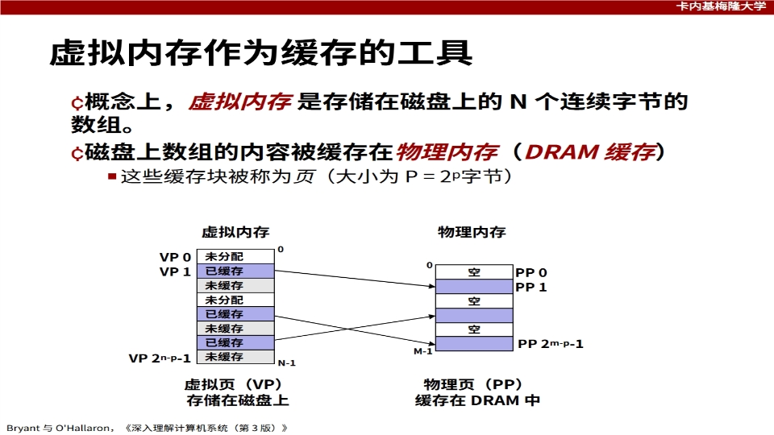

- **虚拟页（virtual page, VP）**：存放在磁盘上的页，是虚拟内存的"源数据"。
- **物理页（physical page, PP）**：被缓存进 DRAM 的页。
- 虚拟页的三种状态：
  - **未分配（unallocated）**：还没有被创建，对应页表项为空（null），不占磁盘空间。
  - **已缓存（cached）**：当前在物理内存里。
  - **未缓存（uncached）**：已分配但当前不在物理内存里，数据在磁盘上。

虚拟内存的地址空间比物理内存大得多（$N$ 个虚拟页，只有 $M$ 个物理页），所以同一时刻只有一部分虚拟页"驻留"在物理内存中，其余都在磁盘上——这正是它作为缓存工具的本质。

### 4.2 DRAM 缓存为什么这样组织（9.4 重点）

DRAM 缓存和前面第 6 章讲的 SRAM 缓存组织方式很不一样，根本原因只有一个：**未命中（miss）的惩罚太大了**。课件给出的速度对比：

| 对比 | 差距 |
| --- | --- |
| DRAM 比 SRAM 慢 | 约 10 倍 |
| 磁盘比 DRAM 慢 | 约 10000 倍（10,000x） |

课堂上老师补充了量级感受：磁盘比内存慢大约 4 个数量级；现在换用固态硬盘（SSD），差距缩小到大约 2 个数量级，性能好很多。一次内存 miss 的代价就是百万级的时钟周期，所以必须想尽办法降低 miss。

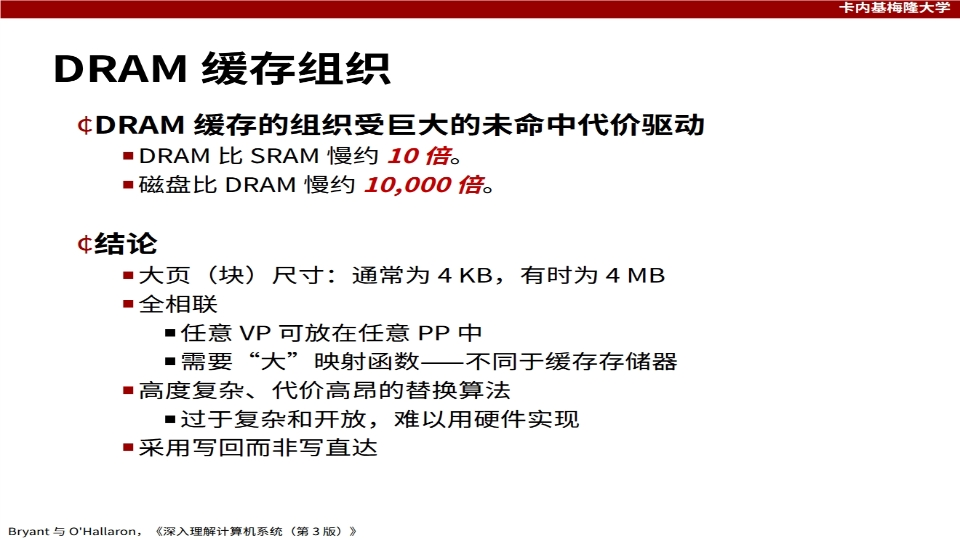

由此带来四个设计后果（课件 + 教材）：

| 设计选择 | 原因 |
| --- | --- |
| 页（块）很大：典型 4 KB，有时 4 MB | 大页利用空间局部性，降低 miss 率 |
| 全相联（fully associative） | 任何虚拟页 VP 都可以放进任何物理页 PP，避免映射限制导致 miss |
| 复杂、昂贵的替换算法 | 牺牲页谁来做、换谁出去，策略复杂，由软件（操作系统）实现 |
| 写回（write-back）而不是写直达（write-through） | 减少对磁盘的写次数（磁盘写代价极高） |

课堂解释"为什么页要做这么大"：页做小的话，程序访问相邻数据时很快就"滑出当前块"，又变成 miss；内存 miss 的代价是百万级时钟周期，miss 概率必须尽量压低。页做大、又配合空间局部性，相邻访问就大概率还在当前页里。而"全相联"意味着**只要物理内存不小于 4K，任何虚拟页都能放到任意物理页里**，映射非常自由——代价是需要一个"大"的映射函数（页表），这一点和普通缓存不同。

另外补一个课堂细节：**DRAM 是易失的**。可以把每个存储单元想象成一个电容：充满电记为 1，随着温度慢慢放电，电压降到 0.5 以下就判为 0，所以必须定时刷新（重新充电）才能保持数据；SRAM 快但贵、容量小，这也是为什么内存要用 DRAM 而缓存用 SRAM。

***

## 5. 使能数据结构：页表（9.5）

虚拟页怎么找到它对应的物理页？靠**页表（page table）**。

**页表**：一个 **页表项（page table entry, PTE）** 组成的数组，每个虚拟页对应一个 PTE，把虚拟页映射到物理页。页表是**内核维护、常驻 DRAM、每个进程一份**的数据结构。

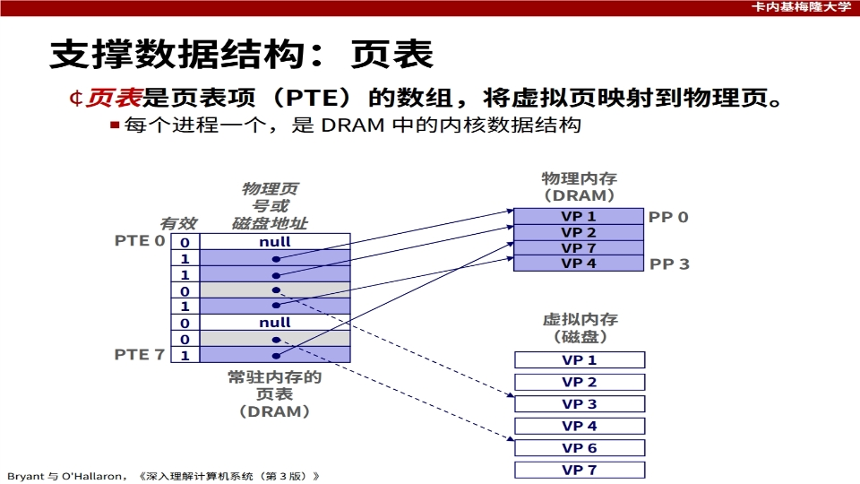

每个 PTE 至少包含两个关键字段：

| 字段 | 含义 |
| --- | --- |
| 有效位（valid bit） | 1 表示该虚拟页当前在物理内存中（有效）；0 表示不在内存（无效） |
| 物理页号（PPN）或磁盘地址 | 有效时给出物理页号；无效时给出该页在磁盘上的地址（或者为 null 表示未分配） |

如上图：VP 1、VP 2、VP 4、VP 6、VP 7 有效（在内存，分别对应 PP 0、PP 3 等），VP 0、VP 3、VP 5 的 PTE 为 null（未分配），VP 0 等条目对应磁盘地址表示"数据在磁盘上但不在内存"。**有效位是页表机制的核心**：翻译地址时先看有效位，有效就命中，无效就缺页。

***

## 6. 页命中与缺页（9.6）

### 6.1 页命中（Page Hit）

**页命中（page hit）**：访问的虚拟内存字当前就在物理内存里（相当于 DRAM 缓存命中）。此时 PTE 有效位为 1，硬件直接取出物理页号，拼出物理地址访问。

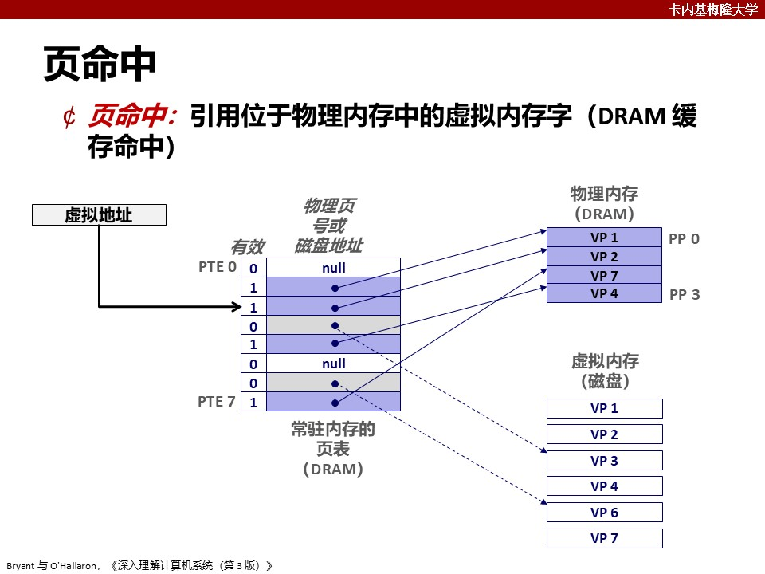

### 6.2 缺页（Page Fault）

**缺页（page fault）**：访问的虚拟内存字不在物理内存里（相当于 DRAM 缓存未命中）。此时 PTE 有效位为 0。

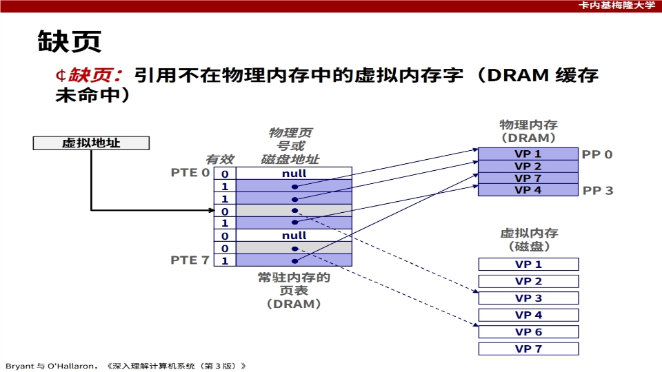

课堂上老师把缺页比作缓存 miss：要访问的虚拟页不在内存 → 产生缺页 → 必须等待并从磁盘把这一页拷进内存之后才能命中。缺页的"惩罚"很高：页本身有 4K 甚至 4MB 那么大，假设一次只能拷 4 字节，要把整页搬完得拷贝很多次，所以系统才如此依赖局部性来避免缺页。

### 6.3 缺页的处理流程

缺页会触发一个**异常**，CPU 切换到内核，由**缺页处理程序（page fault handler）** 处理：

1. 缺页异常发生（访问的虚拟页不在内存）；
2. 处理程序选择一个**牺牲页（victim）** 换出：如果该页是脏页（被修改过），先写回磁盘；
3. 把需要的页从磁盘调入内存，更新对应 PTE（有效位置 1，填入新物理页号）；
4. 返回到原来的进程，**重新执行触发缺页的那条指令**——这次页已在内存，变成了页命中。

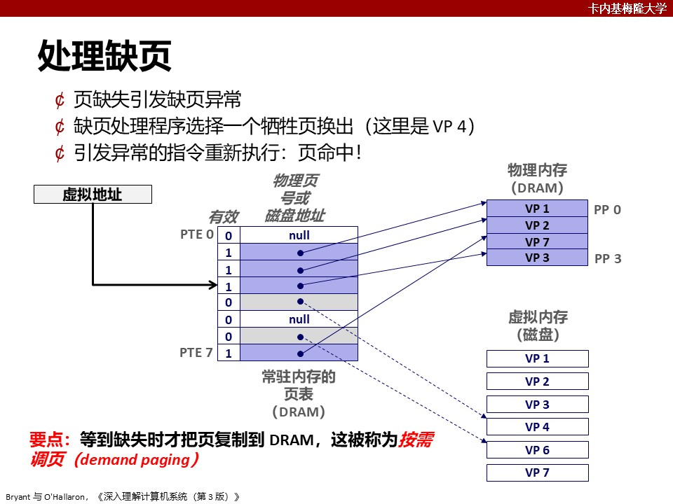

课件特别标注了一个关键点（key point）：**等到真正缺失时才把页复制进 DRAM，这种策略叫按需调页（demand paging）**。也就是说，程序刚启动时并没有把整个可执行文件读进内存，而是执行到哪一页、缺哪一页、才调哪一页。

**磁盘上这些"虚拟页"到底存在哪？** 老师课上回答学生提问时澄清：比教科书里"虚拟页整齐排列在磁盘上"的图示更省。代码页和只读数据页直接映射到 ELF 文件本身的字节——缺页时内核从可执行文件对应偏移读 4 KB 进来，不需要另存一份；栈和堆这种匿名页一开始全是零，根本不用落盘，只在被写脏之后才写到一块专门的 **swap area（交换区）** 里；换出时如果是文件映射页就写回对应文件，如果是匿名页就写回 swap area。所以"磁盘上的虚拟地址空间"并不是一个真实存在的连续大文件。

### 6.4 分配页（Allocating Pages）

缺页处理的是"数据不在内存"，而**分配页**是"创建一个新的虚拟页"。

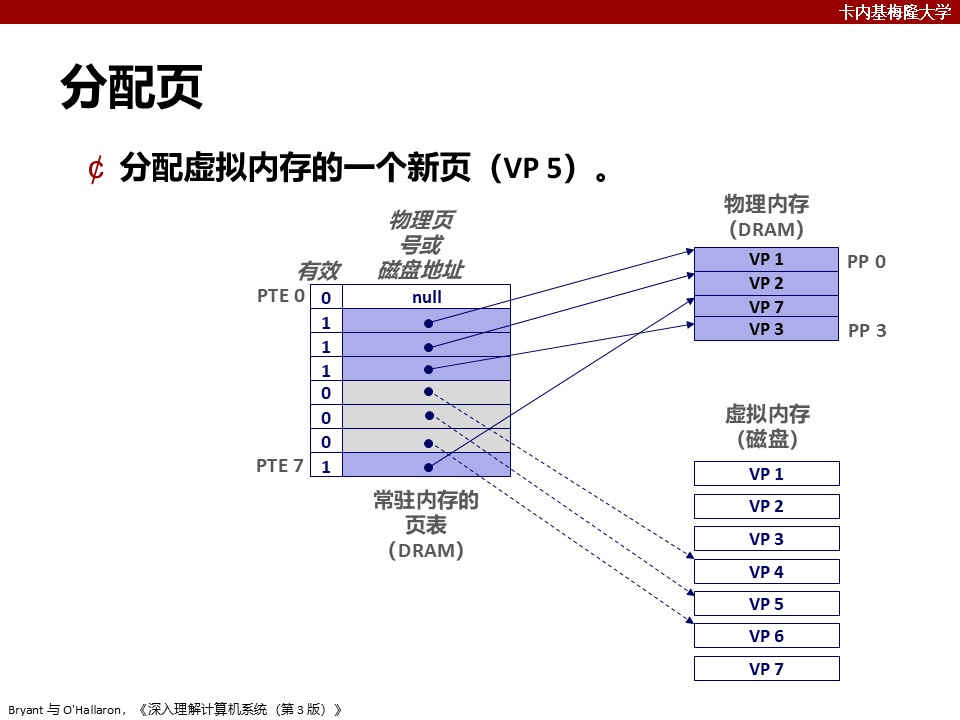

例如进程调用 `malloc` 申请新内存时，内核在虚拟地址空间里"长出"一个新的虚拟页（图中的 VP 5）：它的 PTE 从 null（未分配）变成有效并指向某个物理页，这一页才真正可用。整个过程对用户程序完全透明——程序只看到"我申请到了一块内存"，不知道底层经历了页的分配与映射。

***

## 7. 局部性：虚拟内存为什么有效（9.7）

"把磁盘当内存用"听起来效率极低，但虚拟内存在实践中表现良好，**唯一的原因是局部性（locality）**。

**工作集（working set）**：在任意时刻，程序倾向于访问的一组"活跃"虚拟页。

课件此处用文字给出了结论：

| 条件 | 结果 |
| --- | --- |
| 单个进程：工作集大小 < 主存大小 | 经过启动阶段的一次性强制缺失（compulsory miss）后，性能良好 |
| 多个进程：SUM(各工作集大小) > 主存大小 | **颠簸（thrashing）**：页被持续不断地换进换出，性能崩溃 |

课堂上老师把这个逻辑讲得很直白：时间局部性越好，程序反复访问的页面越集中，工作集就越小；只要工作集塞得进内存，绝大多数访问都命中，缺页只是偶尔发生。反过来，进程太多、每个的工作集都很大，内存装不下，系统就在"换出→缺页→换入"之间无限循环，也就是颠簸。

> 课件 p18 原文要点：虚拟内存看似极低效，但因为有局部性才成立；工作集是"活跃虚拟页集合"；更好的时间局部性 → 更小的工作集。

***

## 8. VM 作为内存管理工具（9.6 / 9.8）

### 8.1 每个进程一个虚拟地址空间

**关键思想：每个进程都有自己的虚拟地址空间**。从进程的角度看，内存就是一块简单的线性数组，从 0 到 $N-1$；至于这些虚拟页实际散落在物理内存的哪些位置，由映射函数决定，进程自己完全感知不到。

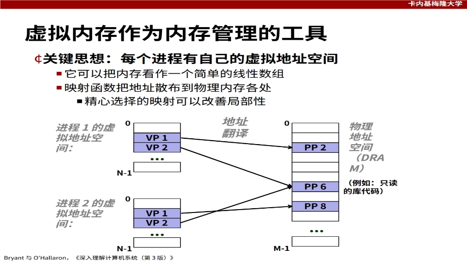

如图，进程 1 的 VP 1、VP 2 分别映射到物理页 PP 2、PP 6，进程 2 的 VP 1、VP 2 却可以映射到别的物理页（PP 6、PP 8）——**同一个虚拟页号在不同进程里可以指向完全不同的物理页**，这正是进程隔离的基础。选得好的映射还能改善局部性（比如把相关的页放到相邻物理页）。

### 8.2 简化内存分配

每个虚拟页可以映射到任意物理页；同一个虚拟页在不同时刻还可以存放在不同的物理页（被换出再换入后，位置可能变了）。这就让内存分配器（malloc 等）不必为"物理位置"操心——用户看到的虚拟地址是连续的，底层物理位置随便放。

### 8.3 共享代码和数据

VM 还能让**多个进程共享同一份代码或数据**：把不同进程的虚拟页都映射到同一个物理页。

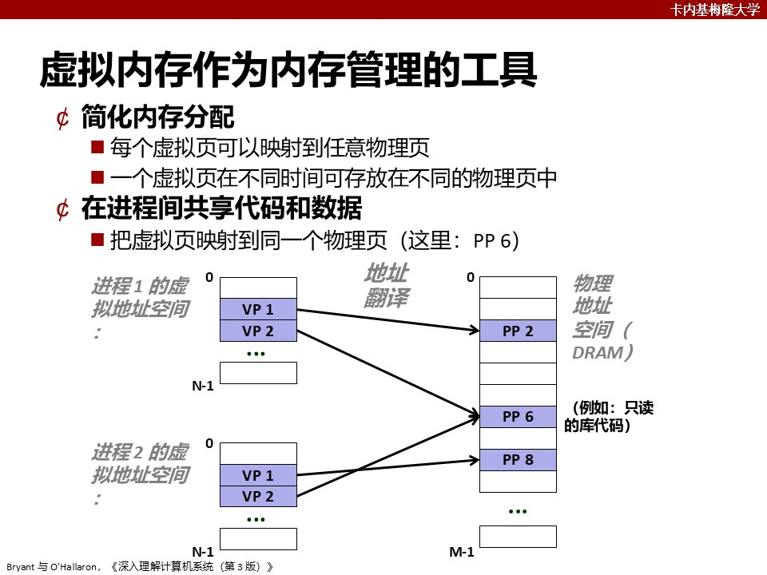

典型例子是只读的库代码（比如 libc）：每个进程的虚拟地址空间里都"有"这份库，但物理内存里只放一份（图中的 PP 6），两个进程的页表都指向它。既省内存，又天然保证共享的一致性。

### 8.4 简化链接和加载

**链接**：每个程序都使用相似的虚拟地址空间，代码、数据、堆总是从相同的地址开始（例如可执行文件从 0x400000 开始），链接器可以放心地把地址写死在程序里，不需要为每个程序重新定位。

**加载**：`execve` 为可执行文件的 `.text`、`.data` 段分配虚拟页并创建**有效位为 0 的 PTE**；这些页的内容随后由虚拟内存系统**按需逐页**从可执行文件拷入。也就是说加载器并没有真正"读入"整个文件，只是搭好了架子，数据是执行到哪页缺哪页才来的——又是 demand paging。

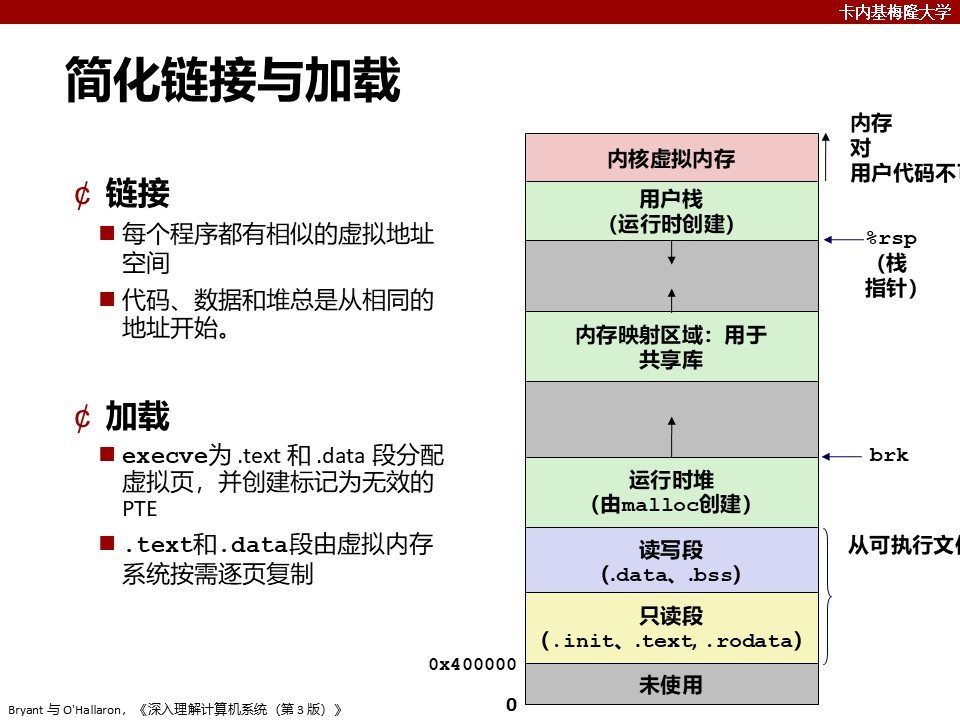

一个 x86-64 Linux 进程的虚拟内存映像（从低地址到高地址）：

| 区域 | 说明 |
| --- | --- |
| 只读段（.init / .text / .rodata） | 从可执行文件加载，只读 |
| 读写段（.data / .bss） | 从可执行文件加载，可读写 |
| 运行时堆（runtime heap，由 malloc 创建） | 向上增长，顶部由 brk 指针标记 |
| 共享库的内存映射区 | 存放动态链接库 |
| 用户栈（runtime stack） | 运行时创建，向下增长，%rsp 指向栈顶 |
| 内核虚拟内存 | 用户代码不可见、不可访问 |

***

## 9. VM 作为内存保护工具（9.5）

页表在翻译地址的同时，还能顺带做**权限检查**——这是 VM 隔离进程的硬件基础。

做法：在 PTE 里扩展**权限位（permission bits）**，MMU 在每次访问时检查这些位。课件给出的权限位有四个：

| 权限位 | 含义 |
| --- | --- |
| SUP | 是否只有内核（supervisor）模式能访问 |
| READ | 是否可读 |
| WRITE | 是否可写 |
| EXEC | 是否可执行 |

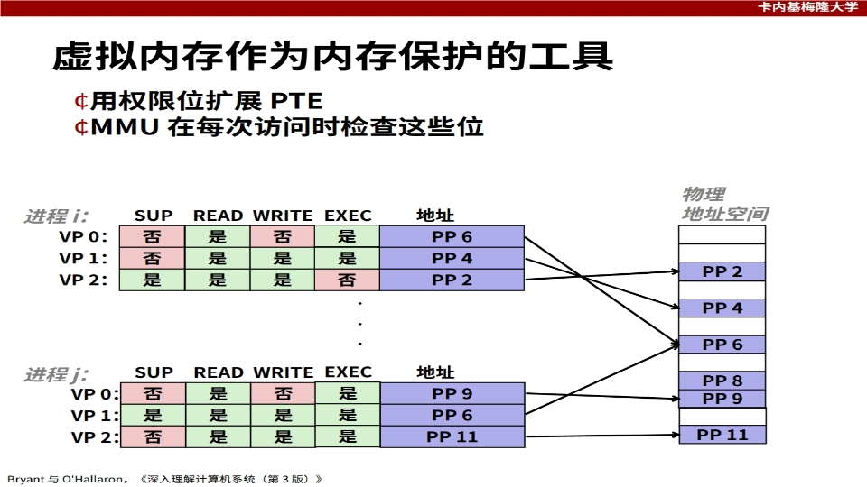

如图所示：进程 i 的 VP 0 映射到 PP 6（只读），VP 1 映射到 PP 4（可读写），VP 2 映射到 PP 2（可读写可执行）；进程 j 的页表则是另一套映射和权限。**每个进程的页表只包含自己的页面**，所以进程 j 根本无法"看到"进程 i 的物理页——地址翻译根本到不了那儿，更不用说权限位拦下的非法访问。

违反权限的访问会触发**段错误（segmentation fault）**，这正是"一个进程不能碰另一个进程的内存"、"用户程序不能访问内核代码和数据"在硬件层面的实现。

**EXEC 位与代码注入攻防（老师课上点到的真实意义）**：EXEC（也称 NX，No eXecute）是 x86-64 新增的权限位，32 位 x86 上没有。它的目的就是堵掉经典的代码注入攻击——攻击者把恶意代码写到栈或堆上，再跳过去执行；只要把数据页的 EXEC 位清掉，CPU 就不允许从这些页取指，注入的代码根本跑不起来。但攻防是猫鼠游戏：正因为传统代码注入被 NX 堵死，攻击者转而发明了 **ROP（Return-Oriented Programming，返回导向编程）**——不再注入新代码，而是复用程序里已有的指令片段（gadget）拼接出恶意逻辑，这就是 attack lab 里那道实验的背景。

***

## 10. 地址翻译（9.6 / 9.7）

### 10.1 翻译函数 MAP

虚拟地址空间 $V = \{0, 1, \dots, N-1\}$，物理地址空间 $P = \{0, 1, \dots, M-1\}$。地址翻译就是定义一个映射函数：

$$
MAP: V \rightarrow P \cup \{\varnothing\}
$$

对虚拟地址 $a$：

$$
MAP(a) =
\begin{cases}
a' & \text{若虚拟地址 } a \text{ 处的数据在物理地址 } a' \text{ 处（在内存中）}\\
\varnothing & \text{若虚拟地址 } a \text{ 处的数据不在物理内存中（无效或存于磁盘）}
\end{cases}
$$

返回 $\varnothing$ 就意味着要触发缺页异常，交给处理程序。

### 10.2 翻译符号

课件总结了地址翻译涉及的全部符号（教材 9.6 同款）：

| 符号 | 含义 |
| --- | --- |
| $N = 2^n$ | 虚拟地址空间大小（地址数） |
| $M = 2^m$ | 物理地址空间大小（地址数） |
| $P = 2^p$ | 页大小（字节数） |
| VPO | 虚拟页偏移（virtual page offset），虚拟地址的低 $p$ 位 |
| VPN | 虚拟页号（virtual page number），虚拟地址的高 $n-p$ 位 |
| PPO | 物理页偏移（physical page offset）——**和 VPO 相等**（页内偏移不变） |
| PPN | 物理页号（physical page number） |
| TLBI | TLB 索引 |
| TLBT | TLB 标记 |

关键点：**页内偏移在翻译前后不变**（VPO = PPO），翻译只改变"页号"部分：VPN → PPN。

### 10.3 用页表做翻译

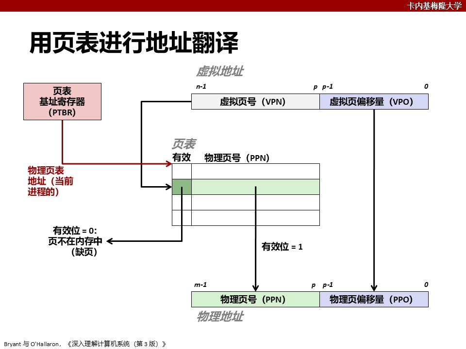

翻译过程：

1. 从 **页表基址寄存器（page table base register, PTBR）** 拿到当前进程页表在内存中的起始地址；
2. 用虚拟页号 VPN 作为索引，找到对应的 PTE；
3. 检查 PTE 的有效位：
   - 有效位 = 1：取出 PPN，拼接成物理地址 $\text{PPN} + \text{VPO}$；
   - 有效位 = 0：页不在内存，触发**缺页异常**。

PTBR 的存在意味着每个进程切换时，只要换一个页表基址寄存器，整套映射就跟着切换——进程 i 的页表只覆盖进程 i 的虚拟页，自然实现了隔离。

### 10.4 页命中翻译流程（5 步）

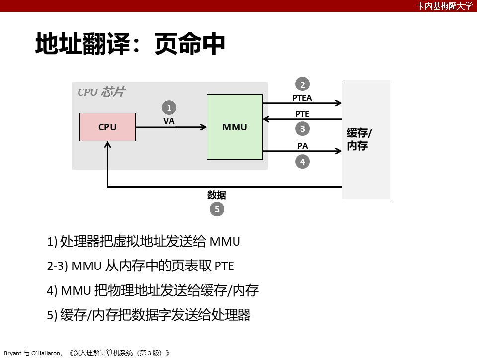

1. 处理器把虚拟地址 VA 送给 MMU；
2–3. MMU 从内存中的页表取出 PTE；
2. MMU 把物理地址 PA 送给缓存/内存；
3. 缓存/内存把数据字返回给处理器。

### 10.5 缺页翻译流程（7 步）

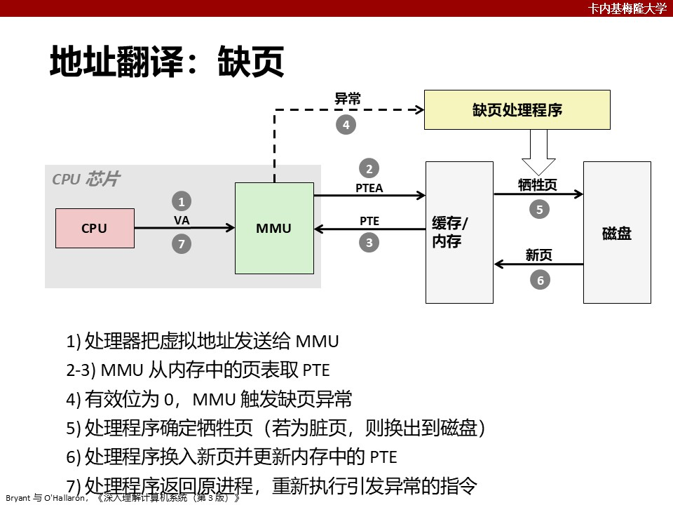

1. 处理器把 VA 送给 MMU；
2–3. MMU 从内存中取出 PTE；
4. 有效位为 0，MMU 触发**缺页异常**；
5. 缺页处理程序选一个牺牲页（若是脏页先写回磁盘）；
6. 处理程序把新页从磁盘调入内存，并更新内存中的 PTE；
7. 处理程序返回原进程，**重新执行触发缺页的指令**。

### 10.6 集成 VM 与缓存

一个完整系统里，VM 和缓存（如 L1）是串起来的：CPU 发出 VA → MMU 翻译（要查页表，页表本身也放在内存里）→ 得到 PA → 再去查缓存。**页表项 PTE 和普通数据一样缓存在 L1 里**，查 PTE 和查数据都可能有缓存命中/未命中。

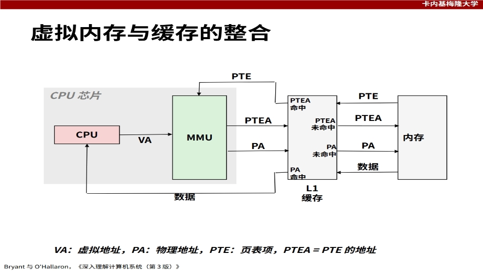

图中 PTEA（PTE 的地址）和 PA 都要经过 L1 缓存：翻译需要访问 PTE（可能 miss），取数据也要访问缓存（可能 miss）。两级 miss 叠加，翻译成本因此不可忽视——这就引出下一节的 TLB。

***

## 11. 加速翻译：TLB（9.8）

### 11.1 为什么需要 TLB

页表项 PTE 缓存在 L1 里，和普通内存字一样，可能被其他数据引用驱逐出去；而且就算命中也要付一次 L1 访问延迟。每次访问内存都要多查一次页表，代价不小。

**解决方案：翻译后备缓冲器（Translation Lookaside Buffer, TLB）**——MMU 内部的一个小型、组相联的硬件缓存，专门把**虚拟页号 VPN 映射到物理页号 PPN**，缓存少量页的完整页表项。

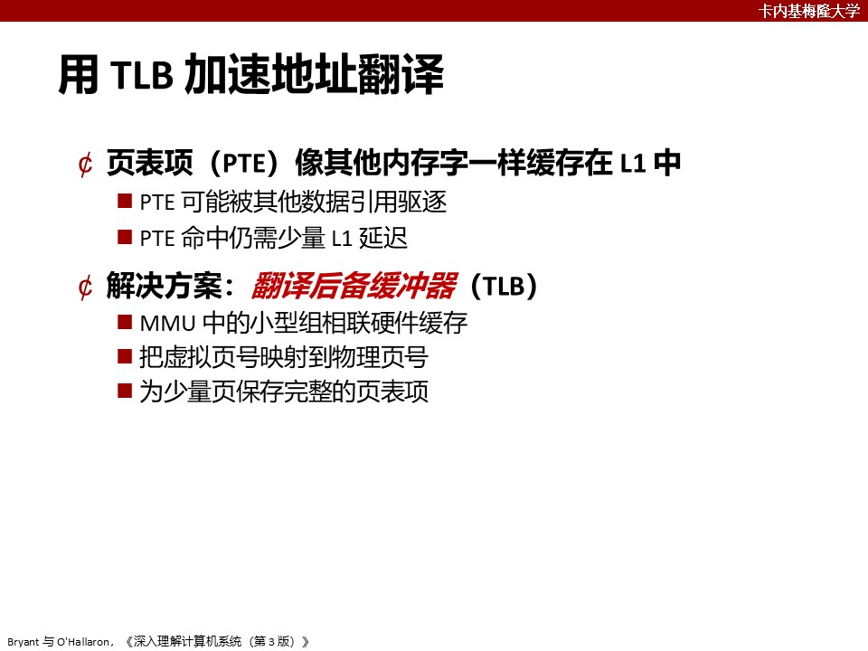

### 11.2 如何访问 TLB

MMU 用虚拟地址中的 VPN 部分访问 TLB：VPN 被拆成 **TLBT（标记）** 和 **TLBI（索引）** 两部分。

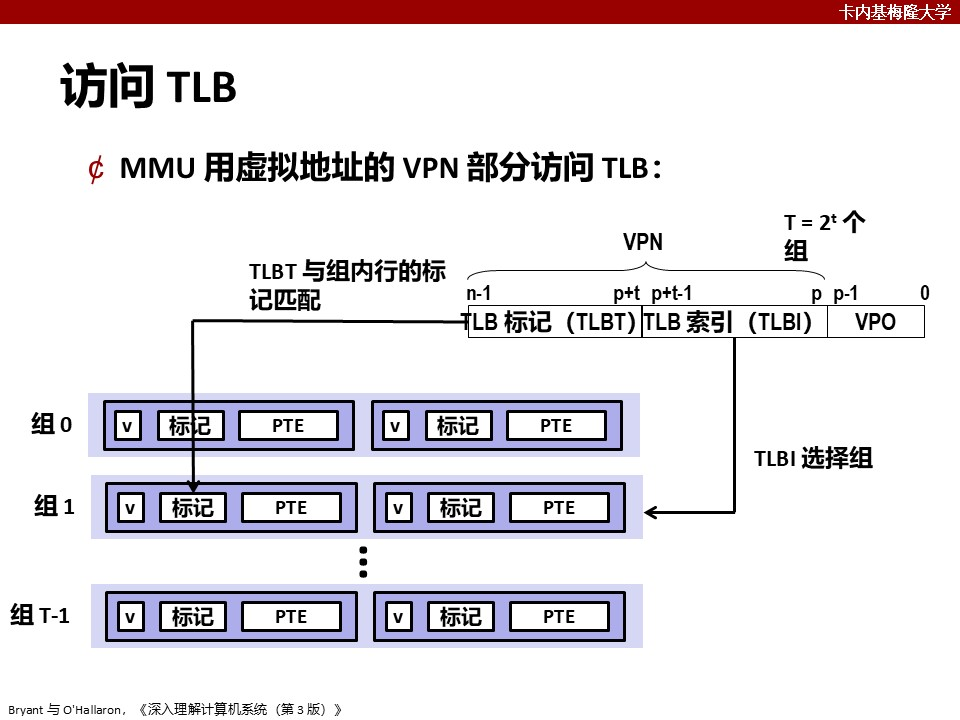

- TLBI 选择 TLB 中的哪一组（set）；
- TLBT 与组内各行的标记比较，匹配则命中。

TLB 有 $T = 2^t$ 组，每组若干行（组相联）。

### 11.3 TLB 命中

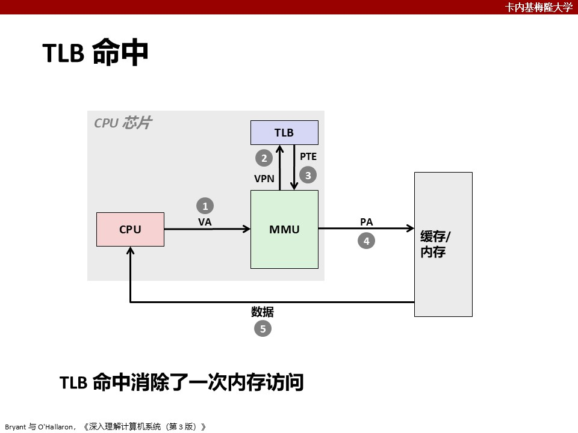

TLB 命中时，MMU 直接从 TLB 拿到 PPN，**省掉了一次访问内存查 PTE 的开销**：CPU 发 VA → TLB 查 VPN → 命中得到 PPN → 拼出 PA 送缓存/内存 → 数据返回。课件强调：**一次 TLB 命中消除了对内存的一次访问**。

### 11.4 TLB 未命中

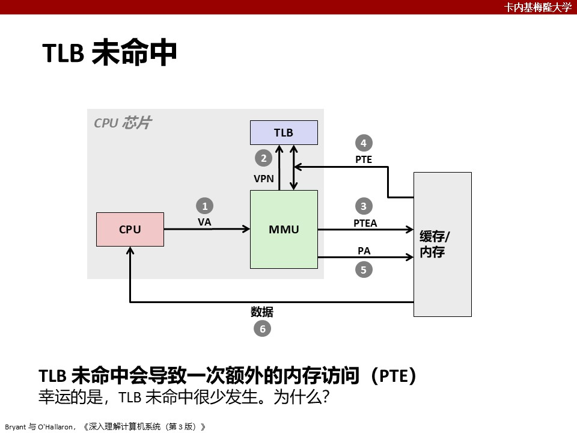

TLB 未命中时，MMU 必须访问内存里的页表取出 PTE（多一次内存访问），再把 PTE 装入 TLB（可能驱逐旧项）。课件提示：**好在 TLB 未命中很罕见**——原因还是局部性：程序短时间内访问的页面很集中，TLB 里始终留着那几个活跃页的映射。

***

## 12. 多级页表（9.9）

### 12.1 问题：单级页表太大

假设页大小 4 KB（$2^{12}$）、48 位地址空间、PTE 8 字节，单级页表需要：

$$
2^{48} \times 2^{-12} \times 2^3 = 2^{39} \text{ 字节} = 512 \text{ GB}
$$

一份页表就要 512 GB，显然不可能常驻内存。

**常见解法：多级页表（multi-level page table）**。

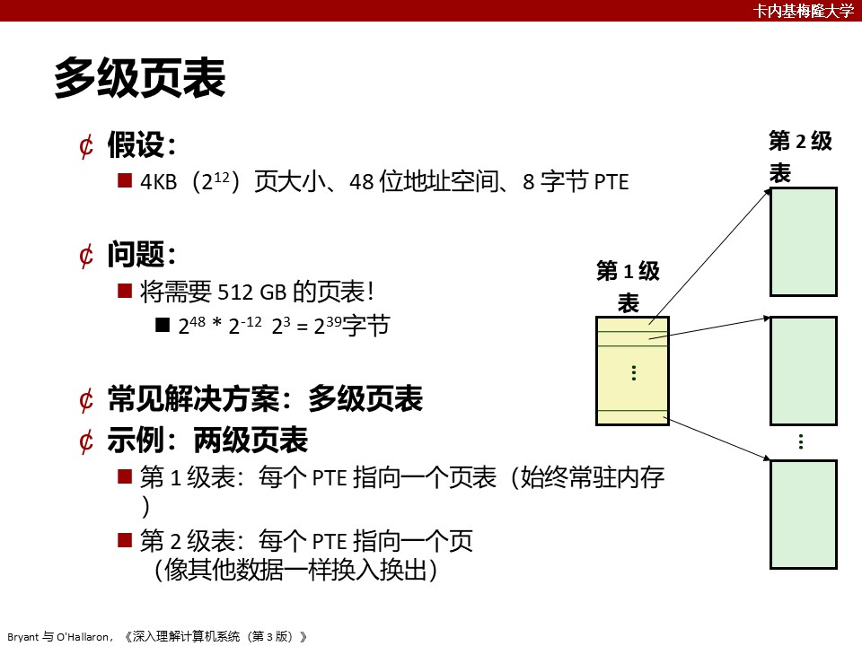

以两级页表为例：

| 级别 | PTE 指向 | 是否常驻内存 |
| --- | --- | --- |
| Level 1 表 | 下一级页表（Level 2 表） | 总是常驻内存 |
| Level 2 表 | 物理页 | 像普通数据一样按需换入换出 |

关键妙处：**Level 1 表里那些指向"未使用区域"的条目直接置为 null，就不需要为它们分配 Level 2 表**。虚拟地址空间里大部分区域是空洞（未分配），于是大量 Level 2 表根本不存在，页表的总大小被压到与"实际使用的虚拟页"成正比，而不是与"地址空间大小"成正比。

### 12.2 两级页表层次示例

课件给了一个 32 位地址、4 KB 页、4 字节 PTE 的两级示例：

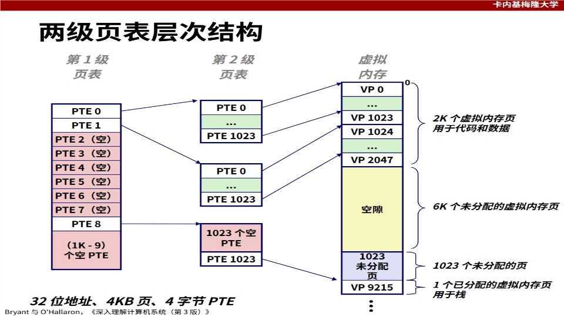

图中虚拟内存一共 2K 个已分配的页（代码和数据）+ 1 个栈页，其余 6K+ 页未分配：Level 1 表中对应未分配区域的条目全是 null，不指向任何 Level 2 表，因此物理上省掉了绝大部分页表空间。

### 12.3 k 级页表翻译

推广到 $k$ 级：虚拟地址的 VPN 部分被拆成 $k$ 段 $\text{VPN}_1, \text{VPN}_2, \dots, \text{VPN}_k$，从 PTBR 出发逐级索引：

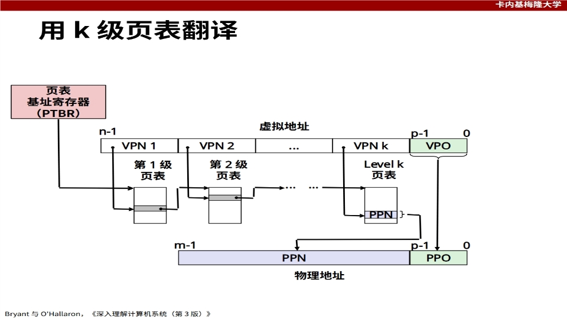

$$
\text{VA} = \underbrace{\text{VPN}_1 \cdots \text{VPN}_k}_{\text{VPN（k 段）}} + \underbrace{\text{VPO}}_{\text{页内偏移}}
$$

1. 用 $\text{VPN}_1$ 索引 Level 1 页表，得到 Level 2 页表的地址；
2. 用 $\text{VPN}_2$ 索引 Level 2 页表，得到 Level 3 页表的地址；
3. 依次类推，用 $\text{VPN}_k$ 索引 Level k 页表，得到 PPN；
4. 拼接 $\text{PPN} + \text{PPO}$ 得到物理地址。

（教材 9.9 还给出了 Intel Core i7 的 4 级页表实例：48 位地址、4 KB 页、4 字节 PTE，四级 VPN 分段各 9 位、VPO 12 位，感兴趣的可以对照教材 9.7 节看具体数值。）

**多级页表不会让翻译变慢吗？** 这是学生当场提的问题。答案是：一级页表常驻内存、覆盖整个地址空间，它的 PTE 几乎一直在 TLB 里；二级（及更深）页表覆盖的也是连续一大段地址，只要程序有合理的局部性，这几级 PTE 也大概率在 TLB 里。所以只要 TLB 命中，多级页表的多级索引几乎不产生额外内存访问——开销可以忽略。也正因为如此，x86-64 实际设成四级而不是更多级：再多一级就会增加 TLB miss 概率，得不偿失。

***

## 13. 总结（课件 p39）

**程序员视角**：

- 每个进程有自己的**私有**线性地址空间；
- 这个地址空间**不会被其他进程破坏**（隔离 + 保护）。

**系统视角**：

- 通过缓存虚拟内存页来**高效使用内存**——而它之所以高效，唯一原因是**局部性**；
- **简化了内存管理和编程**（统一地址空间、按需加载、共享）；
- **简化了保护**：地址翻译恰好提供了一个天然的"检查点"（interpositioning point），可以在这里检查权限位。

一句话收尾：虚拟内存把"磁盘"伪装成"无限大的内存"，把"进程"伪装成"独占整台机器"，靠的是页表做映射、MMU 做翻译、TLB 做加速、局部性保效率。

***

## 附：本章术语速查

| 术语 | 英文 | 一句话解释 |
| --- | --- | --- |
| 物理地址 | Physical Address (PA) | 主存中真正的地址 |
| 虚拟地址 | Virtual Address (VA) | CPU 实际发出的地址，需经 MMU 翻译 |
| MMU | Memory Management Unit | CPU 内负责 VA→PA 翻译的硬件 |
| 页 | Page | VM 缓存的基本块，大小 $2^p$，典型 4 KB / 4 MB |
| 虚拟页 | Virtual Page (VP) | 磁盘上的页 |
| 物理页 | Physical Page (PP) | DRAM 中的页 |
| 页表 | Page Table | PTE 数组，映射 VP→PP，每进程一份，常驻 DRAM |
| 页表项 | Page Table Entry (PTE) | 含有效位 + PPN/磁盘地址 + 权限位 |
| 页命中 | Page Hit | 访问的页在内存中，PTE 有效 |
| 缺页 | Page Fault | 访问的页不在内存，触发异常并调入 |
| 按需调页 | Demand Paging | 缺页时才把页从磁盘调入 |
| 工作集 | Working Set | 程序当前活跃的一组虚拟页 |
| 颠簸 | Thrashing | 工作集总和超过内存，页持续换进换出，性能崩溃 |
| 地址翻译 | Address Translation | MAP: V → P ∪ {∅} |
| TLB | Translation Lookaside Buffer | MMU 内小型组相联缓存，缓存 VPN→PPN |
| 多级页表 | Multi-Level Page Table | 用多级索引压缩页表体积，Level 1 常驻 |
