# 第九章 动态内存分配（Malloc）

> 依据：CMU 15-213 第 19 讲（
>
> `19-malloc-basic.pptx`
>
> ，中译版在桌面课件目录）、第 20 讲（
>
> `20-malloc-advanced.pptx`
>
> ）+ 《深入理解计算机系统》原书第 3 版第 9.9–9.11 节。
> 上一篇讲虚拟地址怎么翻译成物理地址、Linux 怎么管理虚拟区域。本篇讲堆上的动态内存分配器 —— 也就是 C 语言里 
>
> `malloc`
>
> /
>
> `free`
>
>  背后那一套：从 "为什么需要它" 到 "怎么实现一个能用的分配器"，再到显式链表、分离链表、垃圾收集和常见的坑。


***

## 目录


* \[\[#1. 为什么需要 malloc]]


  * \[\[#1.1 堆与动态内存分配器]]

  * \[\[#1.2 malloc/free 接口]]

  * \[\[#1.3 一个完整的 malloc 使用示例（课件 p6）]]

  * \[\[#1.4 两种分配器]]

* \[\[#2. 性能目标：吞吐量与峰值利用率]]

* \[\[#3. 分配器必须遵守的约束]]

* \[\[#4. 碎片（Fragmentation）]]


  * \[\[#4.1 内部碎片]]

  * \[\[#4.2 外部碎片]]

* \[\[#5. 实现问题与块的格式]]


  * \[\[#5.1 实现问题：五个必须回答的问题（课件 p15）]]

  * \[\[#5.2 本讲假设（课件 p7）]]

  * \[\[#5.3 块的格式]]

  * \[\[#5.4 用低位记分配位]]

  * \[\[#5.5 堆两端的哨兵块]]

* \[\[#6. 隐式空闲链表（Implicit Free List）]]


  * \[\[#6.1 基本结构]]

  * \[\[#6.2 分配：查找 + 分裂]]

  * \[\[#6.3 释放：最简单实现与 "假碎片"]]

  * \[\[#6.4 合并：与下一个块合并]]

  * \[\[#6.5 边界标签（脚部）：Knuth73]]

  * \[\[#6.6 常数时间合并：四种情况]]

  * \[\[#6.7 边界标签的缺点（课件 p31）]]

  * \[\[#6.8 放置策略]]

* \[\[#7. 完整实现：一个简单的分配器（教材 9.9.12）]]


  * \[\[#7.1 基本常数与宏]]

  * \[\[#7.2 初始空闲链表：序言块与结尾块]]

  * \[\[#7.3 分配：mm\_malloc]]

  * \[\[#7.4 释放与合并：mm\_free]]

  * \[\[#7.5 最小块大小：对齐要求决定的硬下限]]

  * \[\[#7.6 隐式链表分配器的总体评价（课件 p33）]]

* \[\[#8. 显式空闲链表（教材 9.9.13，20 讲）]]


  * \[\[#8.1 动机]]

  * \[\[#8.2 块格式：指针藏在空闲块的 payload 里]]

  * \[\[#8.3 分配与释放]]

  * \[\[#8.4 释放时的插入策略：LIFO vs 地址序（20 讲 p7）]]

  * \[\[#8.5 显式 vs 隐式对比]]

* \[\[#9. 分离空闲链表（教材 9.9.14，20 讲）]]


  * \[\[#9.1 基本思想]]

  * \[\[#9.2 分配与释放流程（20 讲 p16-17）]]

  * \[\[#9.3 为什么好]]

  * \[\[#9.4 伙伴系统（Buddy System，教材 9.9.14）]]

* \[\[#10. 垃圾收集（教材 9.10，20 讲）]]


  * \[\[#10.1 什么是垃圾收集]]

  * \[\[#10.2 内存图与可达性]]

  * \[\[#10.3 Mark\&Sweep 收集器]]

  * \[\[#10.4 C 的保守收集器（conservative GC）]]

* \[\[#11. 常见的内存相关错误（教材 9.11，20 讲）]]


  * \[\[#11.1 间接引用坏指针]]

  * \[\[#11.2 读未初始化的内存]]

  * \[\[#11.3 允许栈缓冲区溢出]]

  * \[\[#11.4 假设指针和它们指向的对象是相同大小的]]

  * \[\[#11.5 造成错位错误（off-by-one）]]

  * \[\[#11.6 引用指针，而不是它所指向的对象]]

  * \[\[#11.7 误解指针运算]]

  * \[\[#11.8 引用不存在的变量]]

  * \[\[#11.9 引用空闲堆块中的数据]]

  * \[\[#11.10 引起内存泄漏]]

  * \[\[#11.11 调试工具（20 讲 p44）]]

* \[\[#12. 小结：分配器的关键策略（课件 p32）]]

* \[\[# 附：本章术语速查]]


***

## 1. 为什么需要 malloc

### 1.1 堆与动态内存分配器

堆（heap）位于 `.bss` 之上、内存映射区之下，由 `brk` 指针标记堆顶，可以向上扩张。应用程序在运行时才知道需要多大的数据结构（比如链表长度、矩阵大小），不能在编译期确定，这时候就要靠**动态内存分配器**在堆上按需拿内存。


课件从 "程序员使用" 的角度这样描述：动态内存分配器（例如 `malloc`）在运行时获取虚拟内存，适用于大小运行时才知道的数据结构；分配器把堆维护成一组**变长块**，每个块要么是**已分配**的，要么是**空闲**的。

### 1.2 malloc/free 接口


```
#include <stdlib.h>
void *malloc(size_t size);
void free(void *p);
```


* `malloc(n)`：成功返回一块至少 n 字节、按 8 字节（x86）或 16 字节（x86-64）对齐的内存块指针；失败返回 NULL 并设置 errno。`size == 0` 也返回 NULL。

* `free(p)`：把 `p` 指向的块归还到空闲内存池。`p` 必须来自先前一次 `malloc`/`realloc`，传别的指针是未定义行为。

* `calloc(n, size)`：等价于 `malloc(n*size)` 后把块清零。

* `realloc(p, size)`：把之前申请的块扩 / 缩到新大小，必要时搬到新位置。

* `sbrk(n)`：分配器内部用来扩张 / 收缩堆顶，应用一般不直接调。

### 1.3 一个完整的 malloc 使用示例（课件 p6）


```
#include <stdio.h>
#include <stdlib.h>

void foo(int n) {
    int i, *p;
    /* Allocate a block of n ints */
    p = (int *) malloc(n * sizeof(int));
    if (p == NULL) {
        perror("malloc");
        exit(0);
    }
    /* Initialize allocated block */
    for (i = 0; i < n; i++)
        p[i] = i;
    /* Return allocated block to the heap */
    free(p);
}
```

注意两点：**malloc 之后必须检查返回值是否为 NULL**；**用完必须 free**。漏掉第一点程序可能崩溃，漏掉第二点就是内存泄漏（见 11.10 节）。

### 1.4 两种分配器


* **显式分配器**：应用显式调用 `malloc` 申请、`free` 释放（C、C++）；

* **隐式分配器（垃圾回收器）**：应用只申请不释放，分配器自动识别不再使用的内存并回收（Java、Go、ML、Lisp）。

这一讲主要讲显式分配器（垃圾回收放到第 10 节）。

## 2. 性能目标：吞吐量与峰值利用率

给定一串请求 $R_0, R_1, \dots, R_{n-1}$（每次要么是 `malloc` 要么是 `free`），分配器要在两个互相冲突的目标上做权衡：


* **吞吐量**：单位时间完成的请求数。例如 10 秒内完成 5000 次 malloc + 5000 次 free，吞吐量就是 1000 次 / 秒。

* **峰值内存利用率&#x20;****&#x20;**：

$U_k = \frac{\max_{i \le k} P_i}{H_k}$

其中 $P_i$ 是请求 $R_i$ 完成后所有已分配块的有效载荷之和（聚合 payload），$H_k$ 是当前堆大小。$H_k$ 单调不减（堆只增不减，除非显式 sbrk 收缩）。

两个目标常常打架：想快就少做整理（碎片多、利用率低）；想利用率高就到处合并、分裂（吞吐量掉）。

## 3. 分配器必须遵守的约束


* 必须立刻响应请求，不能攒批后一次性处理；

* 申请的块不能移动（一旦 `malloc` 返回，指针就不能偷偷改）；

* 只能在空闲内存上分配，不能把已分配的块挪走；

* 不能重排、缓存请求序列；

* 不允许内存压缩（compaction）；

* **必须对齐块以满足所有对齐要求**（Linux 上按 8 字节 /x86-64 按 16 字节对齐）。

最后一条是 malloc 和垃圾回收器最本质的区别：C 程序里块里存的是 `struct`、标量对象，应用手里攥着 `malloc` 返回的指针，分配器一旦把块搬走，应用手里的指针就全成野指针了。所以即使把所有已分配块往一边挤、能腾出一大片连续空闲区，malloc 也不能这么做 —— 这也是为什么外部碎片在 C 里是个真问题，而在 Java 这种有 GC 的语言里，GC 可以在移动块时顺手把指针也改掉，外部碎片就轻得多。

## 4. 碎片（Fragmentation）

### 4.1 内部碎片

**内部碎片**：一个块里，实际应用用到的有效载荷比块本身小，多出来的那部分就是内部碎片。


来源：


* 维护块元数据（头部、脚部）的开销；

* 对齐填充（块大小必须是 16 的倍数）；

* 显式策略决策（比如为了图省事把一个大块整个归还给一个小请求）。

内部碎片只取决于 "前一个请求" 的模式，很容易测量。

### 4.2 外部碎片

**外部碎片**：空闲内存总量够大，但没有任何**单个**空闲块足够大来满足请求。比如堆上有 100 KB 空闲，但被已分配块切成 4 段各 25 KB，这时来一个要 30 KB 的请求就失败了 —— 总量够，但 "找不到连续的一段"。


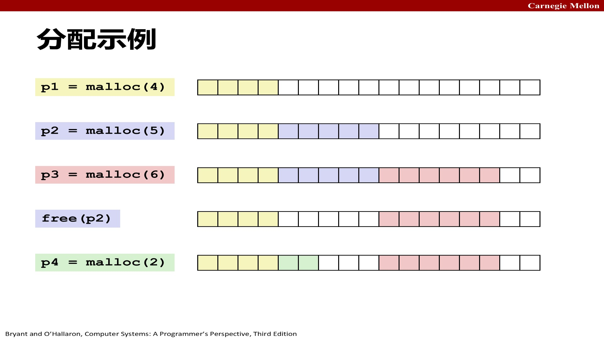

上面这张图演示了一个典型序列：`p1 = malloc(4)`、`p2 = malloc(5)`、`p3 = malloc(6)`、`free(p2)`、`p4 = malloc(2)`—— 注意最后一次 malloc 是在刚释放的块里分配的。教材图 9-34 就是这张图的完整版：malloc 从空闲块前部切块，`free` 之后指针 p2 仍然指向那块（应用有责任在它被重新初始化之前不再使用它）。

外部碎片取决于未来的请求模式，很难预测和测量。老师课上举过一个具体例子：堆上有两个空闲块，一个 5 字、一个 2 字，总共 7 字空闲。如果接下来要 6 字，就卡住了 —— 总量够，但单个块都不够大；可如果接下来要的是 3 字或 2 字，就完全没问题。所以 "现在堆外部碎片严不严重" 这个问题，答案取决于下一个请求是什么，分配器自己没法知道。

## 5. 实现问题与块的格式

### 5.1 实现问题：五个必须回答的问题（课件 p15）

真正动手写分配器前，要先回答课件列出的五个实现问题：


1. 只给一个指针，怎么知道要释放多少内存？

2. 如何跟踪空闲块？

3. 当分配的结构比所在空闲块小时，多余空间怎么办？

4. 如何选择用于分配的块 —— 可能有多个都合适？

5. 如何把释放的块重新插入？

第 6、7、8 节会逐个回答。这一节先解决第 1 个问题。

### 5.2 本讲假设（课件 p7）


* 内存按**字**编址，字长就是 `int` 的大小；

* 块的大小以字为单位：下图里已分配块是 4 字、空闲块是 3 字。


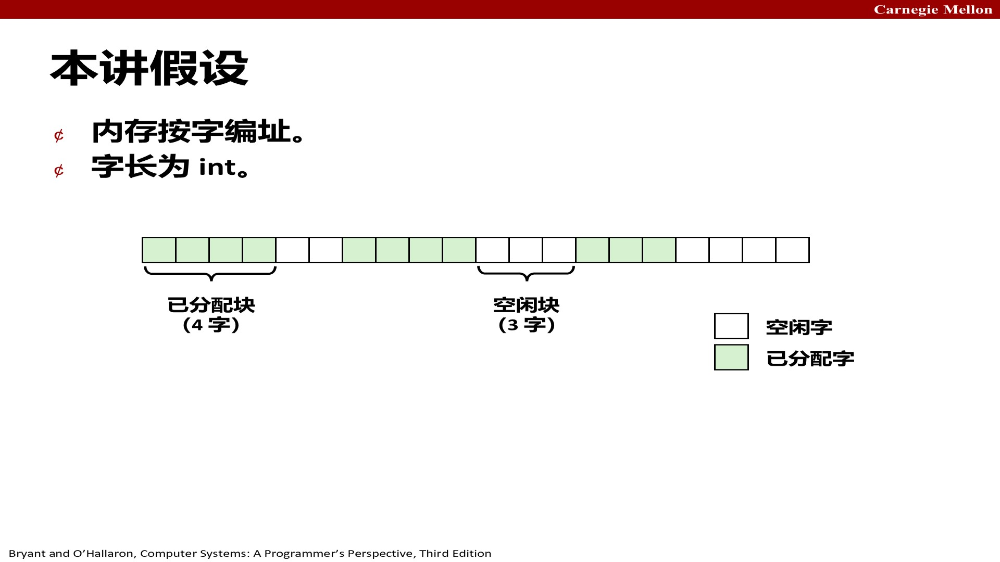

### 5.3 块的格式

堆上的每个块要么是已分配的、要么是空闲的，大小可以变。分配器在每个块里塞一点元数据：


* **头部（header）**：块的第一个字，记录整个块的大小，以及这个块是已分配还是空闲的标志位；

* **有效载荷（payload）**：应用真正拿到的部分，从头部后面开始；

* **脚部（footer）**：块末尾的一个字，复制头部信息（合并时反向遍历用）；

* **填充（padding）**：为了对齐补的字节。

### 5.4 用低位记分配位

因为块必须对齐，块大小的低位恒为 0。那就把这些永远是 0 的位挪作他用：最低位当 "已分配 / 空闲" 标志，剩下的位存块大小。读的时候把最低位 mask 掉才是真正的块大小。


这样 `free(p)` 只拿到一个指针 `p`，分配器就能往回走一个字找到头部，知道这个块有多大 —— 这就是 "知道释放多少" 的标准做法：**在块前面的一个字里保存块长度**，每个块为此额外付出一个字的开销（课件 p16）。

### 5.5 堆两端的哨兵块

为了让代码里少写一堆 "是不是到堆头 / 堆尾了" 的特判，标准做法在堆的最开头放一个**序言块（prologue）**：一个已分配、大小为 0 的块，用来把第一个 payload 顶到对齐边界上；在堆的最末尾放一个**结语块（epilogue）**：一个已分配、大小为 0、头部标志位恒为已分配的块。这样遍历堆时遇到 "大小为 0" 的块就知道到底了，coalesce 时也不用判断 "前一个块是不是堆开头"" 后一个块是不是堆尾 "—— 它们永远是" 已分配 " 状态，天然不参与合并。

## 6. 隐式空闲链表（Implicit Free List）

### 6.1 基本结构

最简单的跟踪空闲块的方法：把整个堆看成一串连续的块，从堆头开始顺序扫，每个块的头部都告诉你下一个块从哪里开始。空闲块没有额外指针，"下一个块" 就是 "当前块地址 + 当前块大小"。

这种结构叫**隐式链表**—— 块是 "链" 起来的，但靠大小算术走，不靠指针。课件 p17 把 "跟踪空闲块" 的四种方法总览如下（本讲只实现第一种，后三种见第 8、9 节与高级材料）：


课件 p20 给了一个双字对齐下的详细示例（头部标注为 "大小（字节）/ 已分配位"）：


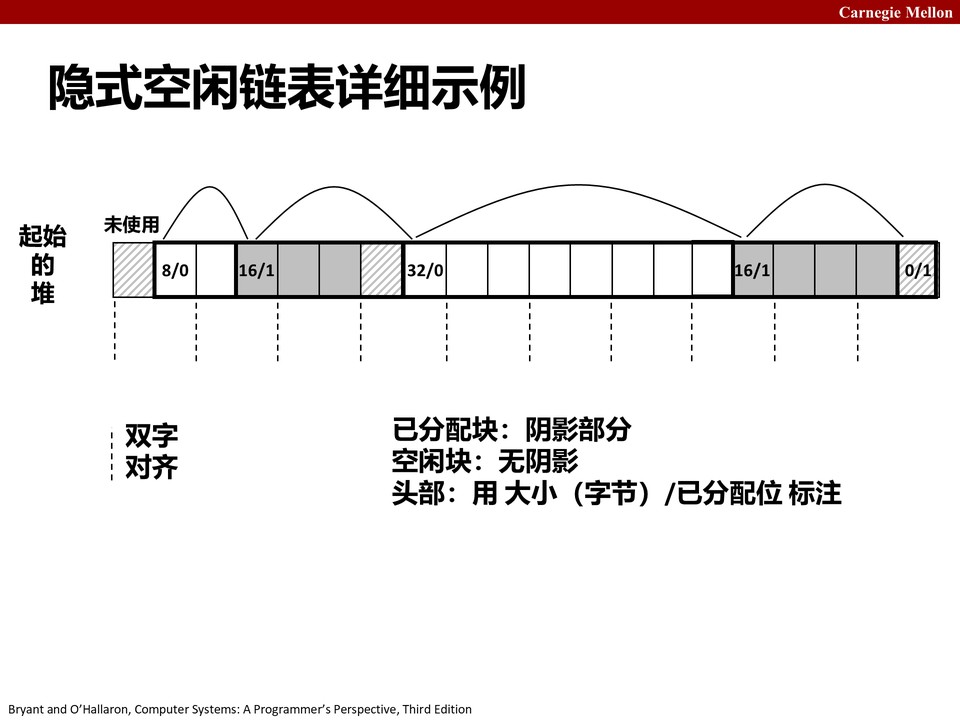

图中从左到右：`未使用`、`8/0`（空闲 8 字节）、`16/1`（已分配 16）、`16/1`（已分配 16）、`32/0`（空闲 32）、`0/1`（结语块，大小 0、已分配）。阴影是已分配块，无阴影是空闲块。教材 9.9.6 强调：空闲块是通过头部里的**大小字段**隐含地连接着的；遍历堆中所有块，就间接遍历了全部空闲块。

### 6.2 分配：查找 + 分裂

**查找**：顺序扫堆，找到第一个够大的空闲块。教材 9.9.12 的 `find_first`（首次适配）核心就是这样一个循环：


```
static void *find_first(size_t asize) {
    void *bp;
    for (bp = heap_listp; GET_SIZE(HDRP(bp)) > 0; bp = NEXT_BLKP(bp)) {
        if (!GET_ALLOC(HDRP(bp)) && (asize <= GET_SIZE(HDRP(bp))))
            return bp;              /* 找到第一个够大且空闲的块 */
    }
    return NULL;                    /* No fit */
}
```

**分裂（split）**：找到的空闲块如果比请求大很多，就把它切成两半 —— 前一半给应用，后一半继续留作空闲。课件 p22 的 `addblock` 演示了这个操作：


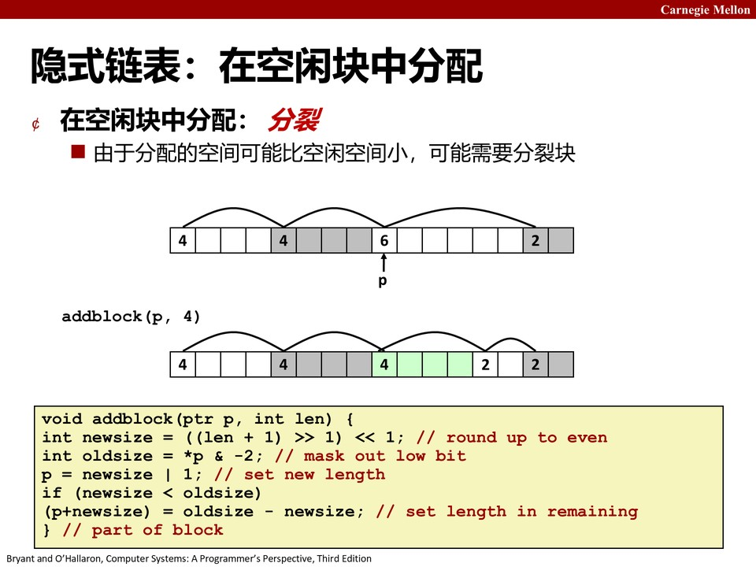


```
void addblock(ptr p, int len) {
    int newsize = ((len + 1) >> 1) << 1;   /* round up to even */
    int oldsize = *p & -2;                 /* mask out low bit */
    *p = newsize | 1;                      /* set new length + allocated */
    if (newsize < oldsize)
        *(p + newsize) = oldsize - newsize;/* set length in remaining part */
}
```

教材的 `place` 函数把 "是否分裂" 的决策讲得更细：**只有当剩余部分 ≥ 最小块大小时才分裂**，否则整个块都交给请求（避免切出一个小得没法用的碎片）：


```
static void place(void *bp, size_t asize) {
    size_t csize = GET_SIZE(HDRP(bp));
    if ((csize - asize) >= (2 * DSIZE)) {        /* 剩余够一个最小块，就分裂 */
        PUT(HDRP(bp), PACK(asize, 1));
        PUT(FTRP(bp), PACK(asize, 1));
        bp = NEXT_BLKP(bp);
        PUT(HDRP(bp), PACK(csize - asize, 0));   /* 剩余部分设为空闲 */
        PUT(FTRP(bp), PACK(csize - asize, 0));
    } else {                                     /* 剩余太小，整个块都给 */
        PUT(HDRP(bp), PACK(csize, 1));
        PUT(FTRP(bp), PACK(csize, 1));
    }
}
```

### 6.3 释放：最简单实现与 "假碎片"

最简单的释放实现：只把 "已分配" 标志清掉。


```
void free_block(ptr p) { *p = *p & -2; }
```

但课件 p23 提醒：这样会留下**假碎片（false fragmentation）**—— 两个相邻的空闲块本来可以合并成一个大块满足请求，却因为没合并而各自太小：


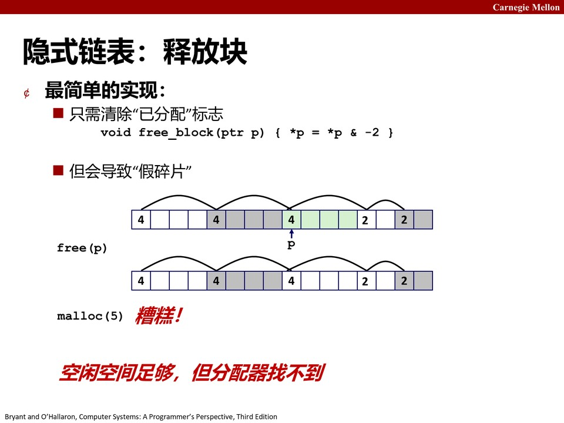

上图先 `free(p)` 清标志，再来 `malloc(5)` 就 "糟糕！" 了：空闲空间总量够（4+4+2+2），但没有任何单个空闲块 ≥ 5，分配器找不到。任何 "像样的分配器" 都遵守一条不变量：**堆上永远不会出现两个相邻的空闲块**，任何两个空闲块之间一定隔着一个已分配块。

### 6.4 合并：与下一个块合并

`free(p)` 时，光把这个块标记成空闲还不够 —— 要立刻看它**前后相邻的块**是不是也空闲，如果是就合并成一个大块。先看最简单的 "与下一个块合并"（课件 p24）：


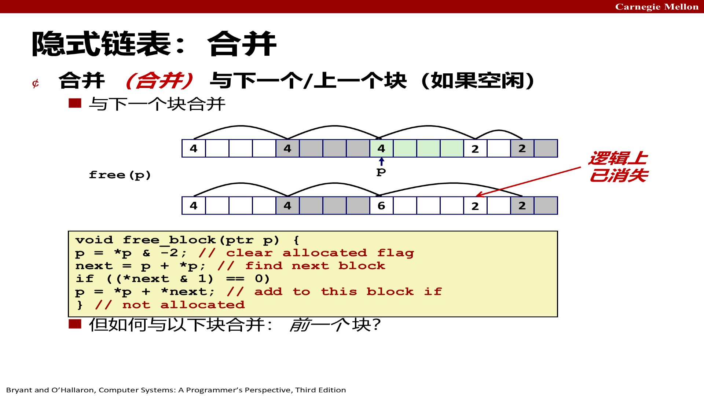


```
void free_block(ptr p) {
    *p = *p & -2;               /* clear allocated flag */
    next = p + *p;              /* find next block */
    if ((*next & 1) == 0)       /* if next block not allocated */
        *p = *p + *next;        /* add to this block */
}
```

问题是怎么 "看前面的块"。看后一个块很简单：当前块头部记着自己的大小，`当前地址 + 块大小` 就是下一个块的头部，直接读它的标志位就行。但看前一个块 —— 在只有头部的情况下，唯一办法是从堆开头一路扫到当前块前面，`free` 直接退化成 O (堆大小)，完全不可接受。

### 6.5 边界标签（脚部）：Knuth73

这个问题在 1973 年被 Donald Knuth 用一个极简单的办法解决：在每个块的**末尾**再复制一份头部，叫**脚部（footer）**（也叫**边界标签，boundary tag**）。这样要找前一个块时，从当前块地址减 4 字节（一个字）就读到前一个块的脚部，里面记着前一个块的大小，反向走一步就到了 —— 合并操作从 O (n) 变成 O (1)。


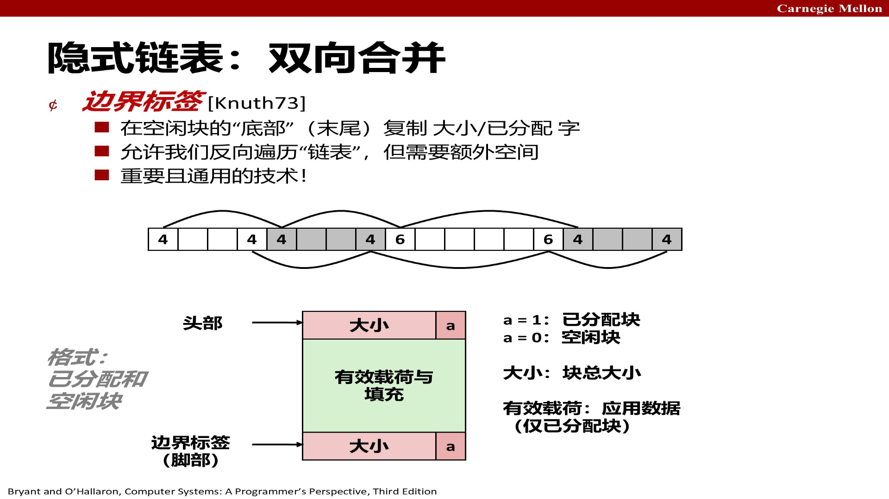

代价是每个空闲块多花一个字的元数据，但这是所有现代 malloc 的标准做法。课件强调这是 "重要且通用的技术"。

### 6.6 常数时间合并：四种情况

有了脚部，合并只需要检查**前一个块**和**后一个块**的分配位，四种情况（课件 p26）：


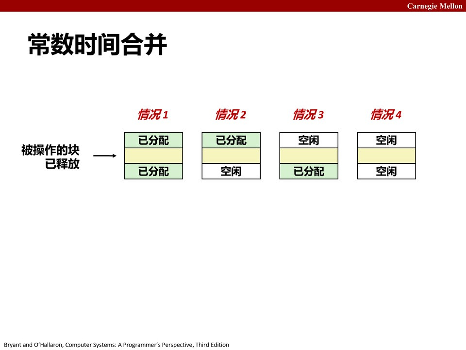


| 情况   | 前一个块 | 后一个块 | 动作              |
| ---- | ---- | ---- | --------------- |
| 情况 1 | 已分配  | 已分配  | 只清除当前块的标志       |
| 情况 2 | 已分配  | 空闲   | 与后一个块合并         |
| 情况 3 | 空闲   | 已分配  | 与前一个块合并         |
| 情况 4 | 空闲   | 空闲   | 与前后两个块一起合并成一个大块 |

教材 9.9.12 的 `coalesce` 函数就是这四个分支（用宏 `PREV_BLKP` 和 `NEXT_BLKP` 定位相邻块）：


```
static void *coalesce(void *bp) {
    size_t prev_alloc = GET_ALLOC(FTRP(PREV_BLKP(bp)));
    size_t next_alloc = GET_ALLOC(HDRP(NEXT_BLKP(bp)));
    size_t size = GET_SIZE(HDRP(bp));

    if (prev_alloc && next_alloc) { return bp; }                    /* Case 1 */
    else if (prev_alloc && !next_alloc) {                           /* Case 2 */
        size += GET_SIZE(HDRP(NEXT_BLKP(bp)));
        PUT(HDRP(bp), PACK(size, 0));
        PUT(FTRP(bp), PACK(size, 0));
    } else if (!prev_alloc && next_alloc) {                         /* Case 3 */
        size += GET_SIZE(HDRP(PREV_BLKP(bp)));
        PUT(FTRP(bp), PACK(size, 0));
        PUT(HDRP(PREV_BLKP(bp)), PACK(size, 0));
        bp = PREV_BLKP(bp);
    } else {                                                        /* Case 4 */
        size += GET_SIZE(HDRP(PREV_BLKP(bp))) + GET_SIZE(FTRP(NEXT_BLKP(bp)));
        PUT(HDRP(PREV_BLKP(bp)), PACK(size, 0));
        PUT(FTRP(NEXT_BLKP(bp)), PACK(size, 0));
        bp = PREV_BLKP(bp);
    }
    return bp;
}
```

### 6.7 边界标签的缺点（课件 p31）

边界标签不是免费的：**每个块都要多花一个字的脚部**。课件 p31 抛出两个问题：


1. **哪些块真的需要脚部？** 合并时只检查 "空闲块" 的相邻状态 —— 检查前一个块用的脚部是**前一个块**的脚部，如果前一个块是空闲块它才有脚部。所以**只有空闲块需要脚部**，已分配块的脚部是浪费（详见 6.8 的优化思路，教材 9.9.11 末尾也专门指出这一点：可以省掉已分配块的脚部，减少内部碎片）。

2. **可以优化吗？** 教材给出的优化：只给空闲块保留脚部。合并时前一个块要么是 "已分配"（无需读脚部，直接知道已分配），要么是 "空闲"（它有脚部，可以读）。这样已分配块省一个字，只有空闲块付这个代价。


### 6.8 放置策略

找到多个候选空闲块时选哪个？


* **首次适配（first fit）**：选第一个够大的；

* **下次适配（next fit）**：从上一次停下的地方继续扫；

* **最佳适配（best fit）**：选够大的里面最小的那个（剩下的碎片最小，但要扫完整条链）。

课件 p21 的伪代码展示了首次适配的查找循环：


```
p = start;
while ((p < end) &&            /* not passed end */
       ((*p & 1) ||            /* already allocated */
        (*p <= len)))          /* too small */
    p = p + (*p & -2);         /* goto next block (word addressed) */
```

经验上首次适配快但会在链表头部攒小碎片，最佳适配碎片少但慢。下次适配（next fit）直觉上应该更快 —— 因为不用每次都从堆头扫起 —— 但实测下来它的碎片比首次适配还差，因为 "从上一次停下的地方继续扫" 会把大的空闲段切得更碎，所以现代分配器几乎不用 next fit。这是一个典型的 "时空权衡反直觉" 案例：少扫几行代码省下的时间，远抵不上碎片增加带来的后续代价。

## 7. 完整实现：一个简单的分配器（教材 9.9.12）

前面讲的是零散技术，教材 9.9.12 把它们组装成一个**能跑的隐式链表分配器**（`mm.c`，Linux 的 malloc 实验就是让你写这个）。它基于隐式空闲链表 + 立即边界标记合并，最大块 $2^{24}$ 字节，代码 32 位 / 64 位干净。

### 7.1 基本常数与宏


```
#define WSIZE 4              /* 字和头部/脚部大小（字节） */
#define DSIZE 8              /* 双字大小（字节） */
#define CHUNKSIZE (1<<12)    /* 扩展堆的字节数（4 KB） */

/* 把大小和已分配位打包进一个字 */
#define PACK(size, alloc)  ((size) | (alloc))

/* 读 / 写地址 p 处的一个字 */
#define GET(p)       (*(unsigned int *)(p))
#define PUT(p, val)  (*(unsigned int *)(p) = (val))

/* 从地址 p 读大小和已分配位 */
#define GET_SIZE(p)  (GET(p) & ~0x7)
#define GET_ALLOC(p) (GET(p) & 0x1)

/* 给定块指针 bp（指向第一个有效载荷字节），算头部和脚部地址 */
#define HDRP(bp)  ((char *)(bp) - WSIZE)
#define FTRP(bp)  ((char *)(bp) + GET_SIZE(HDRP(bp)) - DSIZE)

/* 给定块指针 bp，算后一个 / 前一个块的块指针 */
#define NEXT_BLKP(bp) ((char *)(bp) + GET_SIZE(((char *)(bp) - WSIZE)))
#define PREV_BLKP(bp) ((char *)(bp) - GET_SIZE(((char *)(bp) - DSIZE)))
```

为什么 `GET` 里要做强制类型转换？参数 `p` 典型地是 `void*`，不能直接间接引用，所以先转成 `unsigned int*` 再取。`GET_SIZE` 用 `& ~0x7` 把低 3 位（对齐保证为 0 的位）mask 掉，`GET_ALLOC` 用 `& 0x1` 取最低位。

### 7.2 初始空闲链表：序言块与结尾块

分配器用 `mem_init` 提供的 "模拟堆"（`mem_heap` 与 `mem_brk` 之间是已分配虚拟内存），用 `mem_sbrk` 扩展堆（与系统 `sbrk` 语义相同，但拒绝收缩）。`mm_init` 初始化堆：


```
static char *heap_listp;   /* 指向序言块 */

int mm_init(void) {
    /* 向内存系统要 4 个字：填充字 + 序言块(头+脚) + 结尾块 */
    if ((heap_listp = mem_sbrk(4 * WSIZE)) == NULL) return -1;
    PUT(heap_listp, 0);                    /* 对齐填充 */
    PUT(heap_listp + WSIZE, PACK(DSIZE, 1));    /* 序言块头部 */
    PUT(heap_listp + (2 * WSIZE), PACK(DSIZE, 1)); /* 序言块脚部 */
    PUT(heap_listp + (3 * WSIZE), PACK(0, 1));   /* 结尾块头部 */
    heap_listp += (2 * WSIZE);
    /* 用 CHUNKSIZE 大小的空闲块扩展堆 */
    if (extend_heap(CHUNKSIZE / WSIZE) == NULL) return -1;
    return 0;
}
```

堆的恒定形状（教材图 9-42）：填充字 → 序言块（8 字节已分配块，只有头 + 脚）→ 普通块们 → 结尾块（大小 0 的已分配块，只有头部）。序言块和结尾块就是 5.5 节说的哨兵块，作用是**消除合并时的边界条件**。

### 7.3 分配：mm\_malloc


```
void *mm_malloc(size_t size) {
    size_t asize;      /* 调整后的块大小 */
    size_t extendsize; /* 没有合适块时扩展的大小 */
    char *bp;

    if (size == 0) return NULL;
    /* 最小块 16 字节，加上头部和脚部 */
    if (size <= DSIZE) asize = 2 * DSIZE;
    else asize = DSIZE * ((size + (DSIZE) + (DSIZE - 1)) / DSIZE);

    if ((bp = find_first(asize)) != NULL) {   /* 首次适配搜索 */
        place(bp, asize);                     /* 放置（可选地分裂） */
        return bp;
    }
    /* 找不到：扩展堆，把请求块放进新空闲块，可选地分裂 */
    extendsize = MAX(asize, CHUNKSIZE);
    if ((bp = extend_heap(extendsize / WSIZE)) == NULL) return NULL;
    place(bp, asize);
    return bp;
}
```

三个步骤：**调整大小 → 首次适配搜索 → 找不到就扩展堆再放置**。

### 7.4 释放与合并：mm\_free


```
void mm_free(void *bp) {
    size_t size = GET_SIZE(HDRP(bp));
    PUT(HDRP(bp), PACK(size, 0));   /* 清除已分配位 */
    PUT(FTRP(bp), PACK(size, 0));
    coalesce(bp);                   /* 立即合并相邻空闲块 */
}
```

`coalesce` 就是 6.6 节的四个分支。

### 7.5 最小块大小：对齐要求决定的硬下限

教材 9.9.12 用一张表总结对齐要求与块格式对最小块大小的强制：


| 对齐要求 | 已分配块    | 空闲块   | 最小块大小（字节） |
| ---- | ------- | ----- | --------- |
| 单字   | 头部和脚部   | 头部和脚部 | 12        |
| 单字   | 头部，没有脚部 | 头部和脚部 | 8         |
| 双字   | 头部和脚部   | 头部和脚部 | 16        |
| 双字   | 头部，没有脚部 | 头部和脚部 | 8         |

对上面的实现（双字对齐、已分配块也无脚部）：最小的已分配块 = 4 字节头部 + 1 字节载荷 → 舍入到 8 字节；最小空闲块 = 4 字节头部 + 4 字节脚部 = 8 字节，已经是 8 的倍数。所以最小块是 16 字节（两个双字）。即使应用只请求 1 字节，分配器也必须给 16 字节的块 —— 这就是内部碎片的硬来源。

**一个直观的推论（练习题 9.6）**：保持双字对齐、块大小向上舍入到 8 的倍数时，`malloc(1)` → 块大小 16（0x10），头部 `0x10|0x1 = 0x11`；`malloc(5)` → 16（0x11）；`malloc(12)` → 16（0x11）；`malloc(13)` → 24（0x18），头部 `0x19`。

### 7.6 隐式链表分配器的总体评价（课件 p33）


| 维度   | 表现                                  |
| ---- | ----------------------------------- |
| 实现   | 非常简单                                |
| 分配开销 | 最坏**线性时间**（要扫所有块）                   |
| 释放开销 | 最坏**常数时间**（即使合并）                    |
| 内存使用 | 取决于放置策略（首次 / 下次 / 最佳适配）             |
| 实际用途 | 不用于通用 `malloc/free`（分配太慢），但用于许多专用应用 |

**分裂和边界标签合并的概念对所有分配器都通用**—— 这是学这一节最重要的收获。

## 8. 显式空闲链表（教材 9.9.13，20 讲）

### 8.1 动机

隐式链表的致命缺点是**分配是线性于 "所有块" 的**：即使堆里只有 3 个空闲块，也要扫过几百个已分配块才能找到它们。教材 9.9.13 的说法：块分配与堆块总数呈线性关系，对通用分配器不合适（只对 "堆块数量预先知道很小" 的专用分配器可以）。

### 8.2 块格式：指针藏在空闲块的 payload 里

更好的方法：**只把空闲块链起来**。空闲块对应用没用，所以实现链表的前驱 / 后继指针可以**存放在空闲块的有效载荷区域**里（教材图 9-48）：


* 已分配块：头部 + 有效载荷 + 填充（和隐式链表一样，边界标签可选）；

* 空闲块：头部 + **prev 前驱指针 + next 后继指针** + 填充 + 脚部。

注意 "下一个空闲块" 在物理上**可能在任何位置**，所以必须存双向指针；边界标签仍然保留（合并要用）；好在只跟踪空闲块，指针可以借用 payload 区域，不增加块的额外空间需求。

物理上块可以乱序，逻辑上靠指针串成一条链（20 讲 p5）：


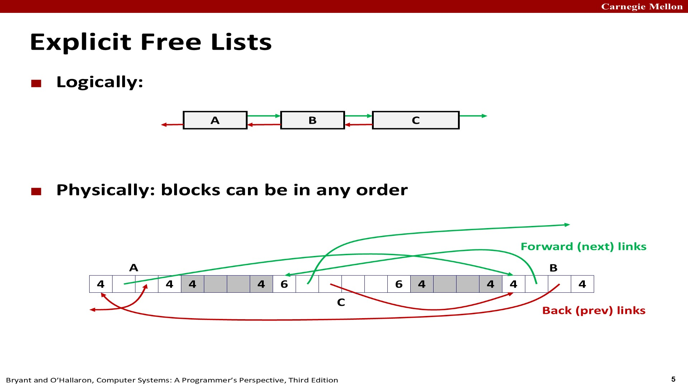

### 8.3 分配与释放


* **分配**：遍历空闲链表（只扫空闲块），找到合适块，可选分裂。首次适配的时间从 "总块数的线性" 降到 "**空闲块数量的线性**"—— 内存大部分被占满时快得多。

* **释放**：从链表中摘下该块（splice），与相邻空闲块合并，再插回链表。时间取决于插入策略。

### 8.4 释放时的插入策略：LIFO vs 地址序（20 讲 p7）


| 策略                       | 做法                          | 优点                            | 缺点            |
| ------------------------ | --------------------------- | ----------------------------- | ------------- |
| **LIFO**（后进先出）           | 新释放的块插到链表头部                 | 简单、常数时间；配合首次适配会**最先检查最近用过的块** | 研究表明碎片比地址序更差  |
| **地址序**（address-ordered） | 按地址大小插入（prev < curr < next） | 碎片更少                          | 需要搜索，释放可能线性时间 |

### 8.5 显式 vs 隐式对比


|      | 隐式链表         | 显式链表                       |
| ---- | ------------ | -------------------------- |
| 跟踪对象 | 所有块          | 只有空闲块                      |
| 分配时间 | O (总块数)      | O (空闲块数)                   |
| 释放时间 | O (1)（有边界标签） | O (1)（LIFO）或 O (空闲块数)（地址序） |
| 额外空间 | 0            | 每个空闲块 2 个字（prev/next）      |
| 复杂度  | 简单           | 分配 / 释放要 splice，略复杂        |

**是否会增加内部碎片？** 是 —— 每个空闲块多 2 个字。但这个代价通常值得。显式链表最常见的用法是**与分离空闲链表配合**（下一节）：维护多个不同大小类的链表。

## 9. 分离空闲链表（教材 9.9.14，20 讲）

### 9.1 基本思想

**分离适配（segregated fit）**：分配器维护一个**空闲链表的数组**，每个链表对应一个**大小类（size class）**，每个链表内部是显式或隐式链表。小尺寸通常每个大小单独一类，大尺寸按 2 的幂分类（20 讲 p15 的例子：1-2、3、4、5-8、9-inf）：


### 9.2 分配与释放流程（20 讲 p16-17）

**分配大小为 n 的块**：


1. 确定请求的大小类，对该类的空闲链表做首次适配；

2. 找到就（可选地）分裂，剩余部分放进适当大小类；

3. 找不到就试**下一个更大的大小类**，重复直到找到；

4. 全都没有 → 用 `sbrk` 向 OS 要额外堆内存，从新内存里分一块，剩余部分放进最大大小类。

**释放**：合并后放入相应大小类的链表。

### 9.3 为什么好


* **吞吐量高**：搜索被限制在堆的某一部分，而不是整个堆；对 2 的幂大小类，分配是对数时间；

* **内存利用率好**：有一个关键事实 —— 对分离空闲链表的简单首次适配搜索，其内存利用率**近似于对整个堆做最佳适配**的利用率；极端情况（每个块都有自己的大小类）完全等价于最佳适配；

* C 标准库的 **GNU malloc 包就是用的这种方法**。

### 9.4 伙伴系统（Buddy System，教材 9.9.14）

伙伴系统是分离适配的一种特例：**每个大小类都是 2 的幂**。假设堆大小 $2^m$ 个字，为每个块大小 $2^k$（$0 \le k \le m$）维护一条分离空闲链表，请求大小向上舍入到最近的 2 的幂。


* **分配**：找到第一个可用的大小 $2^j$ 的块（$k \le j \le m$）。若 $j = k$ 完成；否则**递归地二分割**，每个剩下的半块（伙伴块）放进相应链表；

* **释放**：持续合并空闲的伙伴，遇到已分配的伙伴就停；

* **关键事实**：给定地址和块大小，很容易算出伙伴地址 —— 一个块的地址和它的伙伴地址**只有一位不同**（比如 32 字节块地址 `xxx...x00000`，伙伴是 `xxx...x10000`）。

优点：快速搜索、快速合并。缺点：块大小必须是 2 的幂 → 可能产生显著内部碎片，不适合通用工作负载；但对 "块大小预先已知是 2 的幂" 的特定应用很有吸引力。

## 10. 垃圾收集（教材 9.10，20 讲）

### 10.1 什么是垃圾收集

**垃圾收集（GC）**：自动回收堆上已分配存储 —— 应用**永远不需要 free**。常见于 Python、Ruby、Java、Perl、ML、Lisp、Mathematica 等动态语言；也存在 C/C++ 的 "保守" 收集器变体。


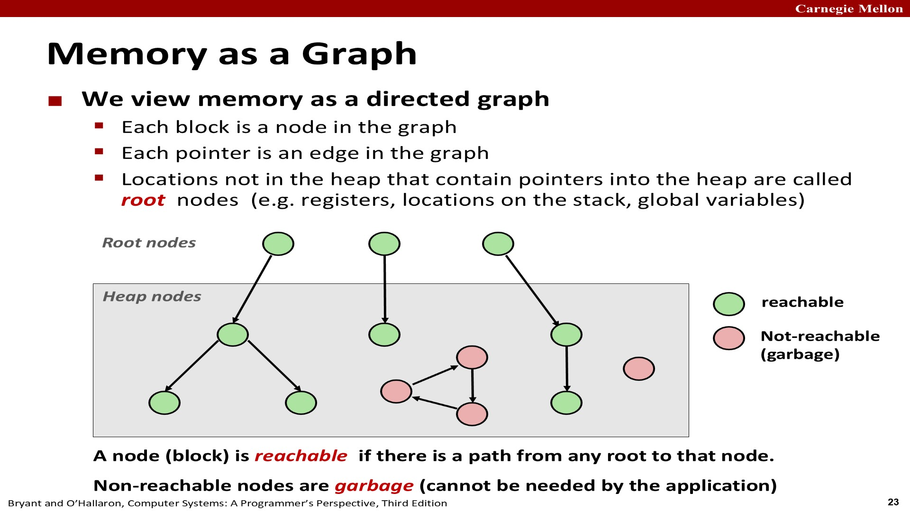

### 10.2 内存图与可达性

GC 把内存看成一张**有向图**：


* 每个**块**是图的一个**节点**；

* 每个**指针**是图的一条**边**；

* 堆外指向堆的位置（寄存器、栈上的位置、全局变量）叫**根节点（root nodes）**。

一个块是 \*\* 可达（reachable）\*\* 的，当且仅当存在从某个根出发到达它的路径。**不可达节点就是垃圾**—— 应用不可能再用到它。

### 10.3 Mark\&Sweep 收集器

最经典的算法是 **Mark\&Sweep（标记 - 清除，McCarthy 1960）**，它**不移动块**，可以直接建立在 malloc/free 包之上：

**思路**：一直用 `malloc` 分配，直到空间耗尽；耗尽时触发收集：先**标记**（从根出发，把每个可达块的 mark 位设上），再**清除**（扫所有块，释放没被标记的已分配块）。


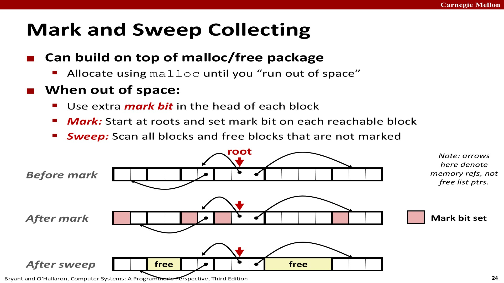

需要的辅助函数（教材 9.10.2）：


| 函数                                | 作用                                |
| --------------------------------- | --------------------------------- |
| `isPtr(p)`                        | 若 p 指向已分配块中的某个字，返回该块的起始指针；否则 NULL |
| `blockMarked(b)`                  | 块 b 是否已标记                         |
| `blockAllocated(b)`               | 块 b 是否已分配                         |
| `markBlock(b)` / `unmarkBlock(b)` | 标记 / 取消标记块 b                      |
| `length(b)`                       | 块 b 的长度（字，不含头部）                   |
| `nextBlock(b)`                    | 堆中 b 的后继块                         |

标记阶段对每个根调用一次 `mark`，用**深度优先遍历**标记所有可达块；清除阶段调用一次 `sweep`，扫过每个块，释放所有未标记的已分配块：


```
ptr mark(ptr p) {
    if (!is_ptr(p)) return;         /* 不是指针就返回 */
    if (markBitSet(p)) return;      /* 已标记就返回 */
    setMarkBit(p);                  /* 标记这个块 */
    for (i = 0; i < length(p); i++) /* 对块内每个字递归调用 */
        mark(p[i]);
    return;
}

ptr sweep(ptr p, ptr end) {
    while (p < end) {
        if (markBitSet(p)) clearMarkBit();
        else if (allocateBitSet(p)) free(p);
        p += length(p);
    }
}
```

**保守收集器如何加入 C 的 malloc 包**（教材图 9-50）：应用照常调用 `malloc`；如果 `malloc` 找不到合适的空闲块，就调用 GC 回收垃圾块到空闲链表（**由收集器代替应用调用 free**）；GC 返回后 malloc 重试；还不行才向 OS 要额外内存。

### 10.4 C 的保守收集器（conservative GC）

Java/C++ 这样的语言运行时知道类型信息，能精确维护可达图。**C 的 GC 是 "保守" 的**，根本原因：**C 不用类型信息标记内存位置**—— 一个 `int` 或 `float` 标量可能 "伪装" 成指针（其值碰巧等于某个块内地址）。收集器无法区分，只能保守地把块 b 标记为可达，即使它其实不可达。

后果（教材 9.10.3）：每个可达块都被正确标记（保证正确性，不会提前回收应用的块），但一些不可达块可能被误标为可达 → **可能回收不掉某些垃圾**，导致不必要的外部碎片。这不影响正确性，但影响空间利用率。

另外，C 的指针可以指向块的**中间**，`isPtr` 需要知道块起点 —— 可以用一棵**平衡二叉树**记录所有已分配块（键是块起始地址），树指针存在头部里，用额外的两个字。

## 11. 常见的内存相关错误（教材 9.11，20 讲）

教材 9.11 警告：与内存有关的错误 "在时间和空间上经常在距错误源一段距离之后才表现出来"—— 写错了位置，程序可能跑好几个小时才崩，而且崩溃点离错误点很远。下面是十类最常见的坑（20 讲 p29 归纳为七类，教材拆得更细）。

### 11.1 间接引用坏指针

虚拟地址空间有大量未映射的 "洞"，间接引用指向洞的指针 → 段异常；写只读区域 → 保护异常。经典例子是 scanf 忘了取地址：


```
int val;
...
scanf("%d", val);   /* 错误！应该是 &val */
```

`scanf` 会把 `val` 的内容当成地址写进去：最好的情况立即异常终止；最坏的情况该值恰好是合法的读 / 写区域，覆盖掉那块内存，很久以后才出灾难性后果。

### 11.2 读未初始化的内存

`.bss`（未初始化全局变量）由加载器清零，但**堆内存不会自动清零**。常见错误是假设堆数据初始化为零：


```
int *y = malloc(n * sizeof(int));   /* 未清零！ */
for (i = 0; i < n; i++)
    for (j = 0; j < n; j++)
        y[i] += A[i][j] * x[j];     /* y[i] 初始值未知 */
```

正确做法：显式把 `y[i]` 置零，或直接用 `calloc`。

### 11.3 允许栈缓冲区溢出

不检查输入串大小就写栈缓冲区：


```
void bufoverflow() {
    char buf[64];
    gets(buf);   /* 任意长度！缓冲区溢出 bug */
    return;
}
```

这是经典缓冲区溢出攻击的基础。纠正：用限制大小的 `fgets`。

### 11.4 假设指针和它们指向的对象是相同大小的


```
int **A = malloc(n * sizeof(int));   /* 错误！应该是 n * sizeof(int *) */
```

代码想创建 n 个指针组成的数组，却分配了 n 个 int 的空间。在 "指针大小 == int 大小" 的机器上碰巧能跑，在 Core i7 上（指针比 int 大）循环就越界写。

### 11.5 造成错位错误（off-by-one）


```
for (i = 0; i <= n; i++)    /* 错误！应该是 i < n，写到了 n+1 个元素 */
    A[i] = malloc(m * sizeof(int));
```

多初始化了一个元素，覆盖了 A 数组后面某个内存位置。更阴险的是可能覆盖到已分配块的边界标记脚部，直到很久以后释放该块时合并代码才戏剧性地失败 —— 这就是 "在远处起作用" 的典型。

### 11.6 引用指针，而不是它所指向的对象

忘记 C 运算符优先级：


```
*size--;   /* 错误！-- 和 * 优先级相同、从右向左结合：减的是指针，不是 *size */
           /* 正确写法：(*size)-- */
```

### 11.7 误解指针运算

指针算术以**所指对象的大小**为单位，不一定是字节：


```
int *search(int *p, int val) {
    while (*p && *p != val)
        p += sizeof(int);   /* 错误！p 是 int*，p+1 已经是一个 int 了 */
    return p;
}
```

### 11.8 引用不存在的变量

忘记局部变量在函数返回后消失：


```
int *foo() {
    int val;
    return &val;   /* 悬垂指针：val 的生命周期已结束 */
}
```

### 11.9 引用空闲堆块中的数据


```
free(x);
...
y = malloc(M * sizeof(int));
for (i = 0; i < M; i++)
    y[i] = x[i]++;   /* 错误！x 已经被释放 */
```

### 11.10 引起内存泄漏

释放了部分结构就返回，或干脆没释放：


```
foo() {
    int *x = malloc(N * sizeof(int));
    ...
    return;   /* 没 free(x)：内存泄漏 */
}
```

更隐蔽的是只释放了链表头部、没释放整条链（`free(head)` 但 `head->next` 还在）。内存泄漏是 "慢性的、长期的杀手"—— 尤其服务器程序长期运行，泄漏会慢慢耗尽内存。

### 11.11 调试工具（20 讲 p44）


| 工具                | 能查什么                                             |
| ----------------- | ------------------------------------------------ |
| `gdb`             | 好的坏指针间接引用（段错误定位）；其他内存 bug 很难查                    |
| 数据结构一致性检查器        | 静默运行，出错才打印，用来缩小错误范围                              |
| `valgrind`        | 强大的运行时检查：重写可执行文件的 text 段，检查每次内存引用 —— 坏指针、覆盖、越界引用 |
| `glibc malloc` 自检 | 设置 `MALLOC_CHECK_` 环境变量开启                        |

## 12. 小结：分配器的关键策略（课件 p32）

**放置策略**：首次适配、下次适配、最佳适配等 —— 用较低吞吐量换更少碎片。有趣的观察：**分离空闲链表近似实现最佳适配，而不必搜索整个空闲链表**。

**分裂策略**：什么时候分裂空闲块？愿意容忍多少内部碎片？

**合并策略**（教材 9.9.10 的补充）：


* **立即合并（immediate coalescing）**：每次 free 都合并相邻空闲块。简单，但可能引起**抖动（thrashing）**—— 反复分配 - 释放同一个块时，刚合并又被分裂，白白浪费；

* **延迟合并（deferred coalescing）**：把合并推迟到需要时，例如扫描空闲链表找合适块时**顺便合并**，或当外部碎片达到某个阈值时再合并。实际分配器通常采用延迟合并。

**隐式链表的小结**（课件 p33）：实现简单；分配最坏线性时间、释放最坏常数时间；内存使用取决于放置策略；实践中不用于通用 `malloc/free`（分配太慢），但用于许多专用应用。而**分裂和边界标签合并这两个概念对全部现代分配器都通用**。

一句话收尾：动态内存分配 = 在吞吐量（够快）和利用率（碎片少）之间权衡；从隐式链表（简单但慢）到显式链表（只串空闲块）再到分离链表（分桶近似最佳适配），每一步都是用 "更多元数据 / 更复杂结构" 换 "更少搜索时间"；而垃圾收集则是把 "释放" 这件事从应用手里拿走，靠可达性判断自动完成。


***

## 附：本章术语速查


| 术语             | 英文                        | 一句话解释                         |
| -------------- | ------------------------- | ----------------------------- |
| 堆              | Heap                      | 进程地址空间中由 malloc/sbrk 管理的区域    |
| 有效载荷           | Payload                   | 块里应用实际拿到的部分                   |
| 头部 / 脚部        | Header / Footer           | 块开头 / 末尾记录块大小和分配位的字（脚部也叫边界标签） |
| 内部碎片           | Internal Fragmentation    | 块大小 − 有效载荷，块内浪费               |
| 外部碎片           | External Fragmentation    | 空闲总量够但没有单个块够大                 |
| 隐式空闲链表         | Implicit Free List        | 靠块大小算术遍历所有块                   |
| 显式空闲链表         | Explicit Free List        | 只在空闲块间用 prev/next 指针串起来       |
| 分离空闲链表         | Segregated Free List      | 按大小类分桶，每个大小类一条链               |
| 分裂 / 合并        | Split / Coalesce          | 分配时切大块，释放时合并相邻空闲块             |
| 首次 / 下次 / 最佳适配 | First / Next / Best Fit   | 选空闲块的三种放置策略                   |
| 序言块 / 结尾块      | Prologue / Epilogue Block | 堆两端大小 0 的已分配哨兵块，消除边界条件        |
| 垃圾收集           | Garbage Collection        | 自动回收不可达块，应用无需 free            |
| 可达性            | Reachability              | 存在从根节点出发的路径到达该块               |
| Mark\&Sweep    | Mark and Sweep            | 先标记可达块、再清除未标记已分配块的 GC 算法      |
| 保守收集器          | Conservative GC           | 无法区分指针与非指针，可能误标不可达块为可达        |
| 伙伴系统           | Buddy System              | 大小类全为 2 的幂的分离适配特例             |
| 内存泄漏           | Memory Leak               | 分配后不再使用也不释放，长期耗尽内存            |