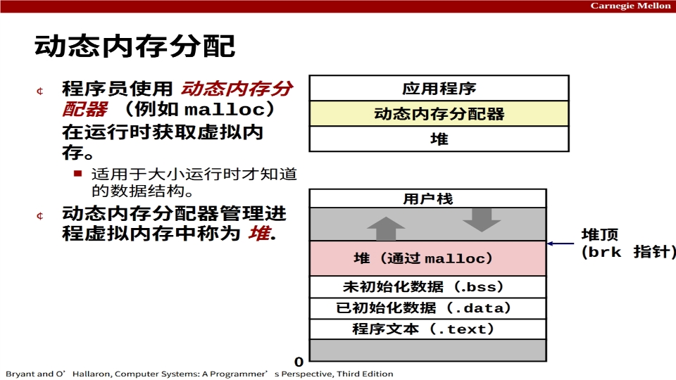
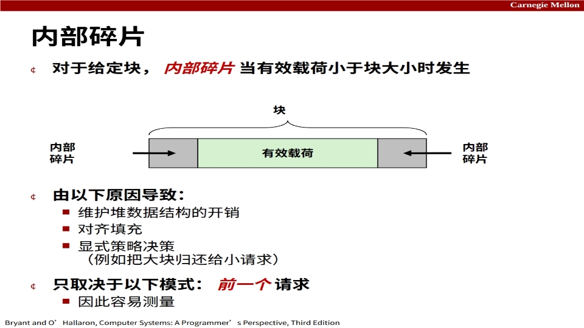
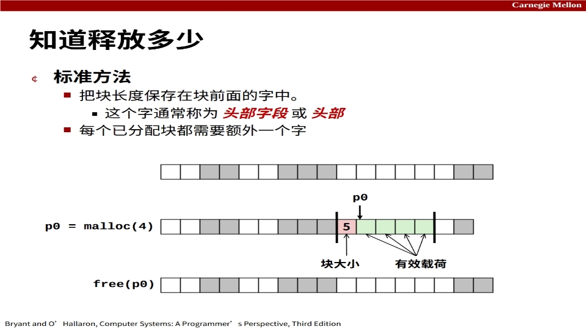
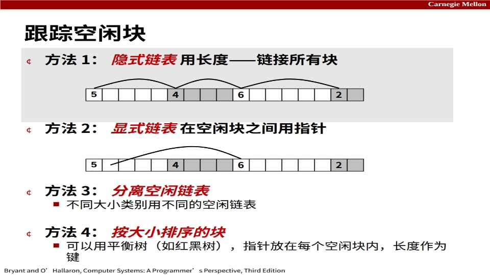

# 第九章 动态内存分配（Malloc）

> 依据：CMU 15-213 第 19 讲课件（`19-malloc-basic.pptx`，中译版已交付桌面课件目录）+ 《深入理解计算机系统》原书第 3 版第 9.9–9.10 节。
>
> 上一篇讲虚拟地址怎么翻译成物理地址、Linux 怎么管理虚拟区域。本篇讲堆上的动态内存分配器——也就是 C 语言里 `malloc`/`free` 背后那一套。

---

## 1. 为什么需要 malloc

堆（heap）位于 `.bss` 之上、内存映射区之下，由 `brk` 指针标记堆顶，可以向上扩张。应用程序在运行时才知道需要多大的数据结构（比如链表长度、矩阵大小），不能在编译期确定，这时候就要靠**动态内存分配器**在堆上按需拿内存。



两种分配器：

- **显式分配器**：应用显式调用 `malloc` 申请、`free` 释放（C、C++）；
- **隐式分配器（垃圾回收器）**：应用只申请不释放，分配器自动识别不再使用的内存并回收（Java、Go、ML、Lisp）。

这一讲只讲显式分配器。

### 1.1 malloc/free 接口

```c
#include <stdlib.h>
void *malloc(size_t size);
void free(void *p);
```

- `malloc(n)`：成功返回一块至少 n 字节、按 8 字节（x86）或 16 字节（x86-64）对齐的内存块指针；失败返回 NULL 并设置 errno。`size == 0` 也返回 NULL。
- `free(p)`：把 `p` 指向的块归还到空闲内存池。`p` 必须来自先前一次 `malloc`/`realloc`，传别的指针是未定义行为。
- `calloc(n, size)`：等价于 `malloc(n*size)` 后把块清零。
- `realloc(p, size)`：把之前申请的块扩/缩到新大小，必要时搬到新位置。
- `sbrk(n)`：分配器内部用来扩张/收缩堆顶，应用一般不直接调。

## 2. 性能目标：吞吐量与峰值利用率

给定一串请求 $R_0, R_1, \dots, R_{n-1}$（每次要么是 `malloc` 要么是 `free`），分配器要在两个互相冲突的目标上做权衡：

- **吞吐量**：单位时间完成的请求数。例如 10 秒内完成 5000 次 malloc + 5000 次 free，吞吐量就是 1000 次/秒。
- **峰值内存利用率 $U_k$**：

$$
U_k = \frac{\max_{i \le k} P_i}{H_k}
$$

其中 $P_i$ 是请求 $R_i$ 完成后所有已分配块的有效载荷之和（聚合 payload），$H_k$ 是当前堆大小。$H_k$ 单调不减（堆只增不减，除非显式 sbrk 收缩）。

两个目标常常打架：想快就少做整理（碎片多、利用率低）；想利用率高就到处合并、分裂（吞吐量掉）。

## 3. 分配器必须遵守的约束

- 必须立刻响应请求，不能攒批后一次性处理；
- 申请的块不能移动（一旦 `malloc` 返回，指针就不能偷偷改）；
- 只能在空闲内存上分配，不能把已分配的块挪走；
- 不能重排、缓存请求序列；
- 不允许内存压缩（compaction）。

最后一条是 malloc 和垃圾回收器最本质的区别：C 程序里块里存的是 `struct`、标量对象，应用手里攥着 `malloc` 返回的指针，分配器一旦把块搬走，应用手里的指针就全成野指针了。所以即使把所有已分配块往一边挤、能腾出一大片连续空闲区，malloc 也不能这么做——这也是为什么外部碎片在 C 里是个真问题，而在 Java 这种有 GC 的语言里，GC 可以在移动块时顺手把指针也改掉，外部碎片就轻得多。

## 4. 碎片（Fragmentation）

### 4.1 内部碎片

**内部碎片**：一个块里，实际应用用到的有效载荷比块本身小，多出来的那部分就是内部碎片。



来源：

- 维护块元数据（头部、脚部）的开销；
- 对齐填充（块大小必须是 16 的倍数）；
- 显式策略决策（比如为了图省事把一个大块整个归还给一个小请求）。

内部碎片只取决于"前一个请求"的模式，很容易测量。

### 4.2 外部碎片

**外部碎片**：空闲内存总量够大，但没有任何**单个**空闲块足够大来满足请求。比如堆上有 100 KB 空闲，但被已分配块切成 4 段各 25 KB，这时来一个要 30 KB 的请求就失败了——总量够，但"找不到连续的一段"。

外部碎片取决于未来的请求模式，很难预测和测量。老师课上举过一个具体例子：堆上有两个空闲块，一个 5 字、一个 2 字，总共 7 字空闲。如果接下来要 6 字，就卡住了——总量够，但单个块都不够大；可如果接下来要的是 3 字或 2 字，就完全没问题。所以"现在堆外部碎片严不严重"这个问题，答案取决于下一个请求是什么，分配器自己没法知道。

## 5. 块的格式

堆上的每个块要么是已分配的、要么是空闲的，大小可以变。分配器在每个块里塞一点元数据：

- **头部（header）**：块的第一个字，记录整个块的大小，以及这个块是已分配还是空闲的标志位；
- **有效载荷（payload）**：应用真正拿到的部分，从头部后面开始；
- **脚部（footer）**：块末尾的一个字，复制头部信息（合并时反向遍历用）；
- **填充（padding）**：为了对齐补的字节。

### 5.1 用低位记分配位

因为块必须对齐，块大小的低位恒为 0。那就把这些永远是 0 的位挪作他用：最低位当"已分配/空闲"标志，剩下的位存块大小。读的时候把最低位 mask 掉才是真正的块大小。



这样 `free(p)` 只拿到一个指针 `p`，分配器就能往回走一个字找到头部，知道这个块有多大——这就是"知道释放多少"的标准做法。

### 5.2 堆两端的哨兵块

为了让代码里少写一堆"是不是到堆头/堆尾了"的特判，标准做法在堆的最开头放一个**序言块（prologue）**：一个已分配、大小为 0 的块，用来把第一个 payload 顶到对齐边界上；在堆的最末尾放一个**结语块（epilogue）**：一个已分配、大小为 0、头部标志位恒为已分配的块。这样遍历堆时遇到"大小为 0"的块就知道到底了，coalesce 时也不用判断"前一个块是不是堆开头""后一个块是不是堆尾"——它们永远是"已分配"状态，天然不参与合并。

## 6. 隐式空闲链表（Implicit Free List）

最简单的跟踪空闲块的方法：把整个堆看成一串连续的块，从堆头开始顺序扫，每个块的头部都告诉你下一个块从哪里开始。空闲块没有额外指针，"下一个块"就是"当前块地址 + 当前块大小"。

这种结构叫**隐式链表**——块是"链"起来的，但靠大小算术走，不靠指针。

### 6.1 分配：找一个合适的空闲块

顺序扫堆，找到第一个够大的空闲块。找到之后要决定**分裂（split）**：如果空闲块比请求大很多，就把它切成两半——前一半给应用，后一半继续留作空闲。

分裂还是不分裂，取决于块大小差多少。

### 6.2 释放：合并（coalescing）

`free(p)` 时，光把这个块标记成空闲还不够——要立刻看它**前后相邻的块**是不是也空闲，如果是就合并成一个大块。否则会出现一堆碎小空闲块，外部碎片暴涨。任何"像样的分配器"都遵守一条不变量：**堆上永远不会出现两个相邻的空闲块**，任何两个空闲块之间一定隔着一个已分配块。

问题是怎么"看前面的块"。看后一个块很简单：当前块头部记着自己的大小，`当前地址 + 块大小` 就是下一个块的头部，直接读它的标志位就行。但看前一个块——在只有头部的情况下，唯一办法是从堆开头一路扫到当前块前面，`free` 直接退化成 O(堆大小)，完全不可接受。

这个问题在 1973 年被 Donald Knuth 用一个极简单的办法解决：在每个块的**末尾**再复制一份头部，叫**脚部（footer）**。这样要找前一个块时，从当前块地址减 4 字节（一个字）就读到前一个块的脚部，里面记着前一个块的大小，反向走一步就到了——合并操作从 O(n) 变成 O(1)。代价是每个空闲块多花一个字的元数据，但这是所有现代 malloc 的标准做法。

为了能"看前面的块"，每个块末尾都存了脚部，反向走一步就能拿到上一个块的头部。这就是为什么需要脚部——常数时间内完成四向合并（前一个空闲、后一个空闲、前后都空闲、前后都不空闲）。

### 6.3 放置策略

找到多个候选空闲块时选哪个？

- **首次适配（first fit）**：选第一个够大的；
- **下次适配（next fit）**：从上一次停下的地方继续扫；
- **最佳适配（best fit）**：选够大的里面最小的那个（剩下的碎片最小，但要扫完整条链）。

经验上首次适配快但会在链表头部攒小碎片，最佳适配碎片少但慢。下次适配（next fit）直觉上应该更快——因为不用每次都从堆头扫起——但实测下来它的碎片比首次适配还差，因为"从上一次停下的地方继续扫"会把大的空闲段切得更碎，所以现代分配器几乎不用 next fit。这是一个典型的"时空权衡反直觉"案例：少扫几行代码省下的时间，远抵不上碎片增加带来的后续代价。

## 7. 显式空闲链表与更高级的结构

隐式链表的缺点：分配/释放是线性时间（要扫所有块）。



更高级的做法只把**空闲块**链起来：

- **显式链表（explicit list）**：在每个空闲块内部放 prev/next 指针，只串空闲块。分配时不用扫已分配块，速度快。
- **分离空闲链表（segregated free list）**：按块大小分桶，每种大小一条链，找请求大小时直接去对应桶里拿，近似最佳适配。极端情况是"每一种可能的大小都开一条独立链表"——这时候分配就是 O(1) 直接拿，效果等价于最佳适配，但元数据开销爆炸；工程上一般把大小按 2 的幂分桶（size class），桶数从几十到几百，在速度和碎片之间取折中。
- **平衡树**：把空闲块按大小组织成红黑树，指针存在块内部，查找对数时间。

这些都是下一讲"显式分配器"的内容，本讲只要知道它们存在、是用"更少的查找时间"换"更多元数据开销"。

## 8. 小结

malloc 分配器在堆上用 header/footer + 隐式（或显式）空闲链表管理块，在吞吐量和峰值利用率之间权衡。核心操作就四件：找块、分裂、释放、合并。所有性能问题最后都归结为一件事——怎么在"够快"和"碎片少"之间做权衡。

---

## 附：本章术语速查

| 术语 | 英文 | 一句话解释 |
| --- | --- | --- |
| 堆 | Heap | 进程地址空间中由 malloc/sbrk 管理的区域 |
| 有效载荷 | Payload | 块里应用实际拿到的部分 |
| 头部/脚部 | Header / Footer | 块开头/末尾记录块大小和分配位的字 |
| 内部碎片 | Internal Fragmentation | 块大小 − 有效载荷，块内浪费 |
| 外部碎片 | External Fragmentation | 空闲总量够但没有单个块够大 |
| 隐式空闲链表 | Implicit Free List | 靠块大小算术遍历所有块 |
| 显式空闲链表 | Explicit Free List | 只在空闲块间用指针串起来 |
| 分裂/合并 | Split / Coalesce | 分配时切大块，释放时合并相邻空闲块 |
| 首次/最佳/下次适配 | First / Best / Next Fit | 选空闲块的三种放置策略 |
