# 第九章 虚拟内存系统（VM Systems）

> 依据：CMU 15-213 第 18 讲课件（`18-vm-systems.pptx`，中译版已交付桌面课件目录）+ 《深入理解计算机系统》原书第 3 版第 9.6–9.7 节。
>
> 上一篇《第 9 章 虚拟内存概念》讲了"虚拟内存是什么、地址翻译由哪些部件组成（MMU / TLB / 页表）"。本篇用一个**小参数系统把整条地址翻译流水线完整走一遍**，再看真实 Core i7 + Linux 是怎么落地的。

---

## 1. 一个简化的内存系统示例

为了把"虚拟地址 → 物理地址 → 缓存字节"整条流水线走通，课件先造了一个参数很小的假想机器，方便手算。

### 1.1 地址划分

参数：

- 虚拟地址 14 位，物理地址 12 位；
- 页大小 $P = 64$ 字节，即 $\log_2 P = 6$；
- 所以 VPN（虚拟页号）= 14 − 6 = 8 位，VPO = 6 位；
- PPN（物理页号）= 12 − 6 = 6 位，PPO = 6 位。

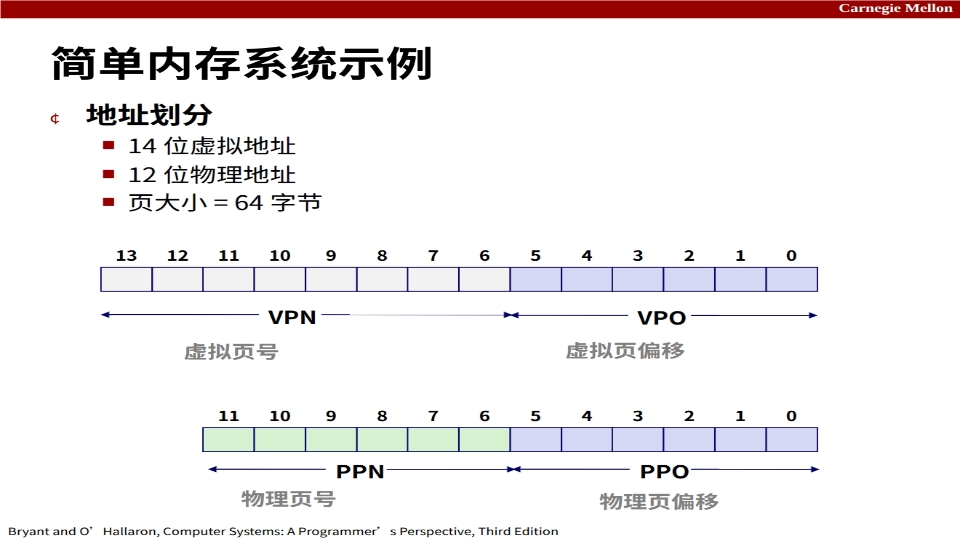

这套小系统里 TLB、页表、L1 缓存都很小，便于手动追踪每一步命中还是不命中。

### 1.2 TLB

TLB 是 MMU 内部的小缓存，缓存 VPN → PPN 的映射。这个示例机器的 TLB：

- 16 项、4 路组相联；
- TLB 索引 TLBI 用 VPN 的低 $\log_2(16/4) = 2$ 位；
- TLB 标记 TLBT 用 VPN 的剩下 6 位。

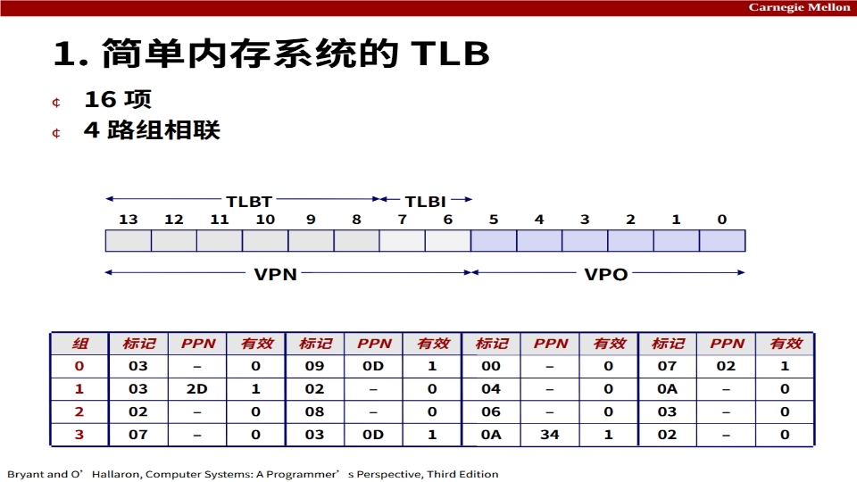

TLB 每一项里都有一个有效位，以及缓存的 PPN。MMU 拿 VPN 的低位去索引 TLB 组，再比较 TLBT 标记位，命中就直接拿到 PPN；不命中则要去内存里查真正的页表。

### 1.3 页表

这个示例系统只有一级页表，共 256 项（对应 8 位 VPN）。每项：

- 有效位；
- PPN（6 位）；
- 一些保护位（R/W、U/S 等）。

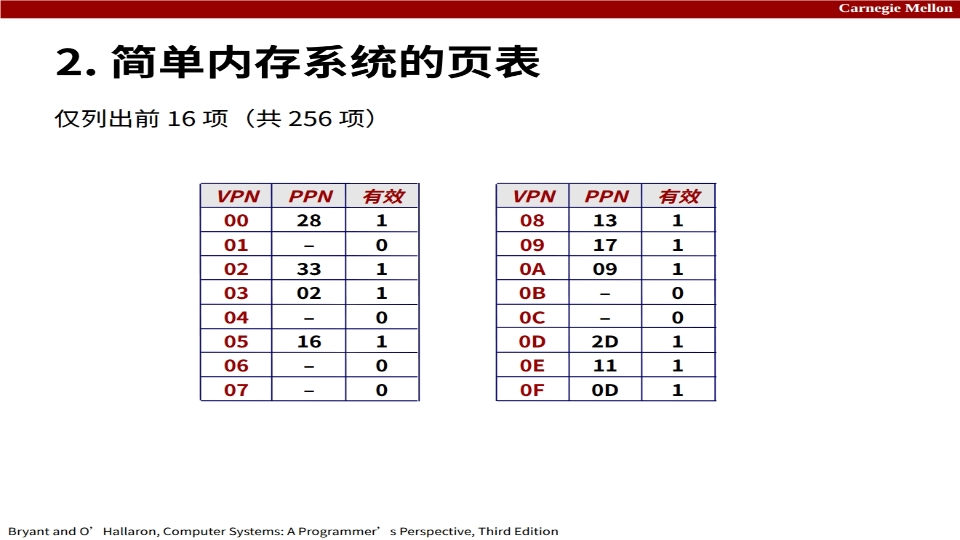

注意课件里只列出了前 16 项，其余省略。有效位为 0 的项对应"还没分配的虚拟页"，一旦访问就会触发缺页。

### 1.4 L1 缓存

- 16 行、块大小 4 字节；
- 物理地址索引、直接映射；
- 块内偏移 CO 占 2 位（$\log_2 4$）；
- 缓存索引 CI 占 2 位（$\log_2 16$）；
- 缓存标记 CT 占剩下的 8 位。

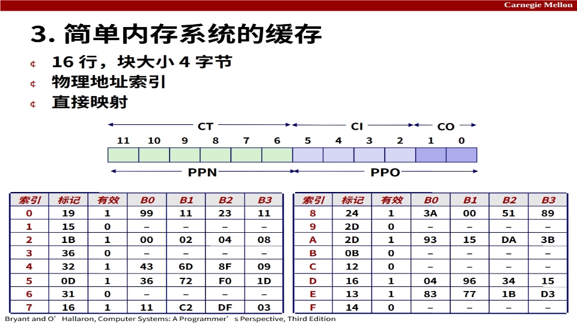

### 1.5 一次完整的地址访问流程

给定一个虚拟地址，硬件按下面的顺序跑：

1. **拆虚拟地址**：VPN = 虚拟地址右移 6 位；VPO = 低 6 位。
2. **查 TLB**：用 TLBI 选组，比较 TLBT。
   - 命中 → 直接拿到 PPN；
   - 不命中 → 用 VPN 查内存里的页表，把得到的 PPN 填回 TLB。
3. **拼物理地址**：PA = PPN ‖ PPO（PPO 直接复用 VPO，因为页内偏移在翻译前后不变）。
4. **查缓存**：用 CI 选行，比较 CT 标记。命中就返回这 4 字节里想要的那一字节；不命中就去主存取一块回来。

课件用三个例子（虚拟地址 $0x03D4$、$0x0020$、$0x0020$ 的不同情形）手算了 VPN/TLBI/TLBT/TLB 命中、PPN、物理地址、CI/CT/缓存命中、最终取出的字节，是教材配套练习题的标准考法。

---

## 2. 真实案例：Intel Core i7 / Linux

小例子走完了，看真实 CPU。

### 2.1 硬件层级

Core i7 的内存层级比小例子复杂得多：

- L1 数据 TLB：64 项、4 路（缓存 VPN→PPN）；
- L1 指令 TLB：128 项、4 路；
- L1 数据缓存：32 KB、8 路；
- L2 统一缓存：256 KB、8 路；
- L3 统一缓存：8 MB、16 路，所有核心共享；
- 主存 DRAM。

地址空间是 48 位虚拟地址、4 KB 页，所以 VPO = 12 位，VPN = 36 位。

### 2.2 端到端地址转换

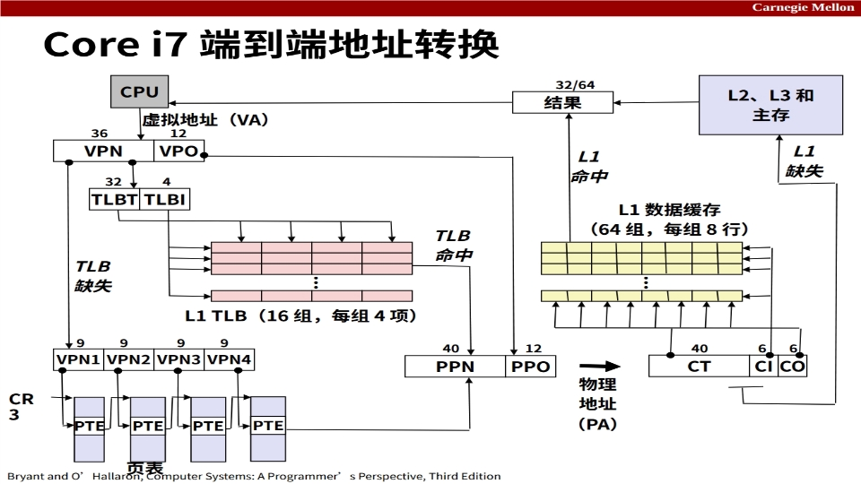

虚拟地址进来后，MMU 先查 L1 TLB；TLB 不命中就用 36 位 VPN 去走四级页表。每级 VPN 切 9 位，CR3 寄存器指向一级页表的物理基地址。

### 2.3 四级页表

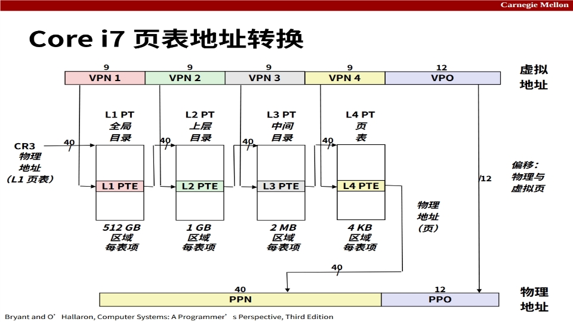

- 虚拟地址 48 位 = VPN1(9) ‖ VPN2(9) ‖ VPN3(9) ‖ VPN4(9) ‖ VPO(12)；
- CR3 指向 L4 页表（最外层）；
- VPN1 索引 L4 PTE，拿到 L3 页表物理地址；
- VPN2 索引 L3 PTE，拿到 L2 页表地址；
- VPN3 索引 L2 PTE，拿到 L1 页表地址；
- VPN4 索引 L1 PTE，拿到最终 PPN；
- 拼上 VPO 得到物理地址。

第 1~3 级 PTE 指向的是"下一级页表"（物理地址是一个页表的基地址），第 4 级 PTE 指向的才是真正的物理页。

每级 PTE 的关键位：

- **P**：存在位，0 表示这一级页表或这个页不在物理内存；
- **R/W**：读写权限；
- **U/S**：用户态/内核态；
- **A**：访问位（被 TLB/缓存走过时硬件置 1，OS 用它做页面置换）；
- **D**：脏位（写过才置 1，OS 决定换出时要不要写回磁盘）；
- **G**：全局位（标记"所有进程都共享的页"，切换进程时 TLB 不用刷掉它）。

### 2.4 一个巧妙的加速：虚拟索引、物理标记

L1 缓存用 CI 选行。理论上应该先把虚拟地址翻译成物理地址，再用 CI 查缓存——但这样缓存查找就排在 MMU 后面，慢。

Core i7 的设计让 CI 这几位正好落在 VPO 范围内。VPO 在地址翻译前后是不变的，所以：

- **地址翻译（查 TLB、查页表）和缓存索引（用 CI 选行）可以并行开始**；
- 翻译完成、PPN 拿到之后，只用它去做 CT 标记比较；
- 这就是"虚拟索引、物理标记"（VIPT, Virtually Indexed, Physically Tagged）。

代价是：缓存大小被精心限制过——如果缓存行多到 CI 越过 VPO 边界，就要等翻译完才能索引，VIPT 就失效了。

---

## 3. Linux 进程的虚拟地址空间

### 3.1 一个进程看到的内存布局

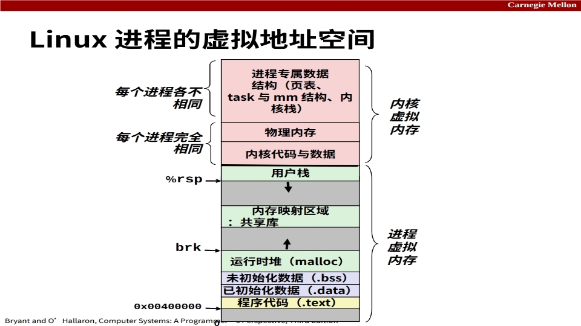

从低地址到高地址：

- 程序代码 `.text`（只读）；
- 已初始化数据 `.data`；
- 未初始化数据 `.bss`；
- 运行时堆（由 `malloc` 通过 `brk` 向上扩张）；
- 内存映射区域（共享库、`mmap` 映射的文件）；
- 用户栈（高地址，向下增长，`%rsp` 指向栈顶）；
- 最上面是内核虚拟内存（用户态不可访问）。

堆和栈之间留了大片空洞，需要时再扩张。

### 3.2 Linux 用 `vm_area_struct` 描述区域

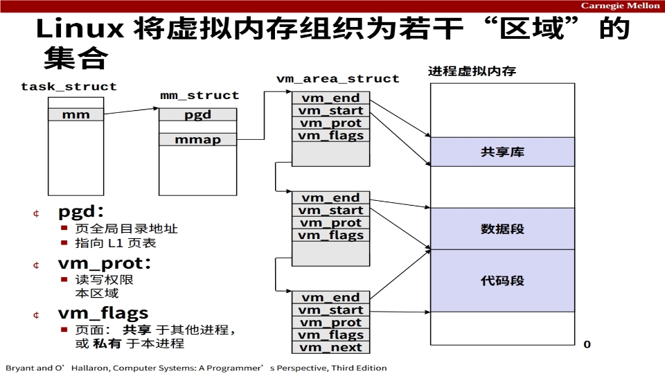

Linux 不给每个页都建一个描述结构，而是把连续、性质相同的一段虚拟地址叫一个**区域（area）**，用一个 `vm_area_struct` 描述：

- `vm_start`、`vm_end`：这段区域的起止地址；
- `vm_prot`：权限（读/写/执行）；
- `vm_next`：串成链表；
- 跟 `task_struct → mm_struct → mmap` 挂在一起。

一个进程的若干个 `vm_area_struct` 串成链表，分别对应代码段、数据段、堆、共享库映射、栈……

### 3.3 缺页异常处理

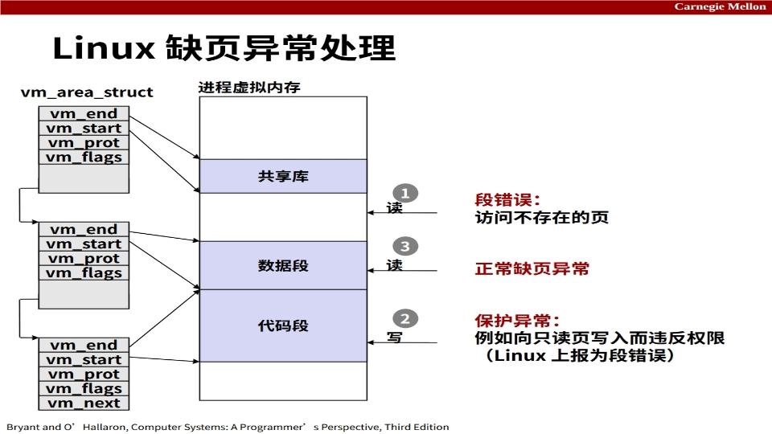

当 CPU 触发缺页，内核：

1. 拿到故障虚拟地址，遍历当前进程的 `vm_area_struct` 链表，看这个地址属于哪一段；
2. 如果不属于任何段 → 段错误（SIGSEGV）；
3. 如果属于某段但权限不对（比如往只读页写）→ 段错误；
4. 否则分配一个物理页，建立 PTE，返回用户态重新执行那条指令。

---

## 4. 内存映射（Memory Mapping）

### 4.1 基本思想

**内存映射**：把一段虚拟内存区域和一个磁盘对象"绑定"起来，让这段虚拟页的初始内容来自那个对象。这样做的好处是——物理页按需才分配（第一次访问才缺页），而且多个进程可以映射同一个对象，自动共享物理内存。

可以绑定的对象有两类：

- **普通文件**：虚拟页的内容直接来自文件的某一段（比如可执行文件的 `.text` 段对应程序代码）；
- **匿名文件**：没有磁盘后端，第一次缺页时内核分配一个全零物理页（栈、堆、`.bss` 都是这种）。

### 4.2 共享对象

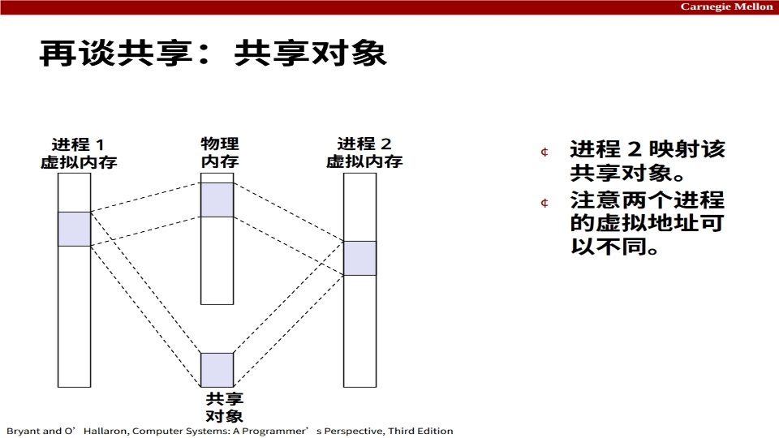

两个进程把同一个共享对象映射进自己的虚拟地址空间，它们的某些虚拟页指向**同一个物理页**。两边任何一个进程写这个物理页，另一个进程都能看到——这就是共享库、进程间共享内存的底层机制。两个进程里这个对象的虚拟地址可以不同，重要的是物理页被 PTE 共享。

### 4.3 私有对象与写时复制（COW）

共享对象是"写了大家都看得到"，但有些场景需要"两个进程一开始共享同一份物理页，一旦某一个写，就立刻复制出一份私有副本"。这就是**写时复制（Copy-On-Write, COW）**。

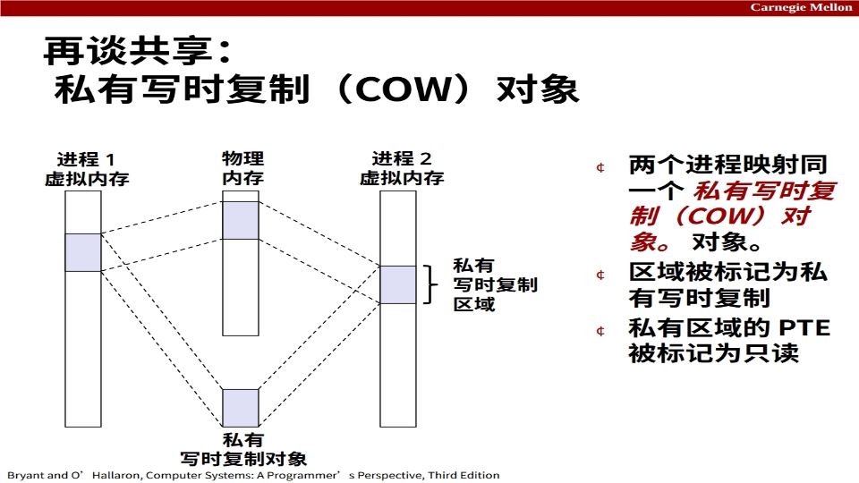

做法：

1. 父进程和子进程的 PTE 都指向同一个物理页，但 PTE 被标记为**只读**、区域标记为"私有 COW"；
2. 一开始没有真正复制物理页，两个进程共享同一份；
3. 任何一个进程尝试写这个页，会触发保护异常；
4. 内核在异常处理里：**分配一个新物理页，把旧页内容拷过去，把触发写的那个进程的 PTE 改指向新页，并改成可读写**；
5. 异常处理返回，指令重新执行，这次写就落到私有副本上。

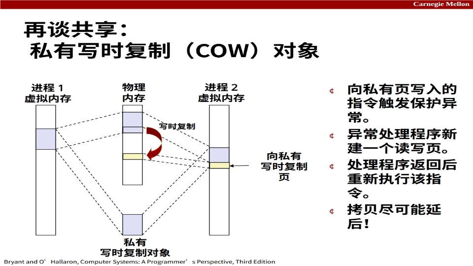

关键点：**拷贝尽可能延后**。fork 创建子进程时不需要立刻复制整个地址空间，所有页都先以 COW 方式共享，真正写时才复制——这就是 `fork` 这么快的原因。

### 4.4 用 VM 的视角重看 fork 和 execve

- **`fork()`**：内核为新进程复制 `mm_struct`、所有 `vm_area_struct`、所有页表，但**不复制物理页**——所有 PTE 都设成只读 + COW。父子共享物理页，谁写谁触发复制。
- **`execve(filename)`**：扔掉当前进程所有 `vm_area_struct` 和页表，按新程序重建：代码段和已初始化数据段映射到可执行文件，`.bss` 和栈映射到匿名全零页，然后把 CPU 栈切到新程序的入口。这就是"同一个进程，换上新程序跑"。

### 4.5 用户态 mmap API

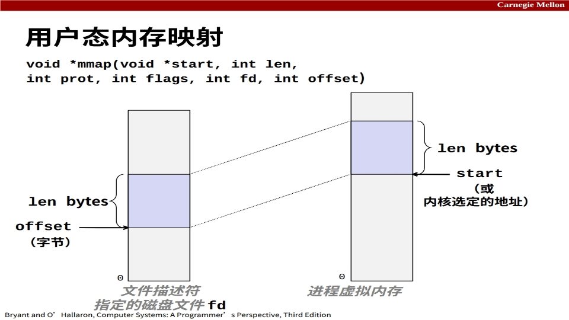

```c
void *mmap(void *start, int len, int prot, int flags, int fd, int offset);
```

- `start`：建议映射到的虚拟地址（内核通常忽略，自己选）；
- `len`：映射多长；
- `prot`：权限（PROT_READ / PROT_WRITE / PROT_EXEC）；
- `flags`：MAP_PRIVATE（私有 COW）还是 MAP_SHARED（共享）、MAP_ANONYMOUS（匿名、无文件）；
- `fd`、`offset`：映射哪个文件、从文件哪个偏移开始。

`munmap` 把一段映射拆掉。教材给了一个用 `mmap` 把整个文件读进内存再写出去的例子，比 `read/write` 更省一次拷贝。

---

## 5. 小结

虚拟内存不是抽象概念，它是一条硬件流水线：虚拟地址 → TLB → 多级页表 → 物理地址 → 缓存，每一步都有自己的小缓存和命中规则。Linux 用 `vm_area_struct` 把一个进程的虚拟地址空间描述成若干区域，缺页时按区域查权限、按需分配物理页。内存映射把虚拟页和磁盘对象绑定；共享对象多进程共享物理页，COW 让 fork 可以"先共享、写时才复制"。

---

## 附：本章术语速查

| 术语 | 英文 | 一句话解释 |
| --- | --- | --- |
| TLB | Translation Lookaside Buffer | MMU 内的 VPN→PPN 小缓存 |
| PTE | Page Table Entry | 页表项，含存在位、PPN、权限位 |
| CR3 | Control Register 3 | 指向当前进程一级页表的物理基地址 |
| VIPT | Virtually Indexed, Physically Tagged | 用虚拟地址索引缓存、物理地址做标记的设计 |
| vm_area_struct | VM Area Struct | Linux 描述一段连续虚拟区域的内核结构 |
| 内存映射 | Memory Mapping | 把虚拟区域绑定到磁盘文件/匿名对象 |
| COW | Copy-On-Write | 写时复制，先共享、写时才复制物理页 |
| mmap | Memory Map | 用户态建立内存映射的系统调用 |
